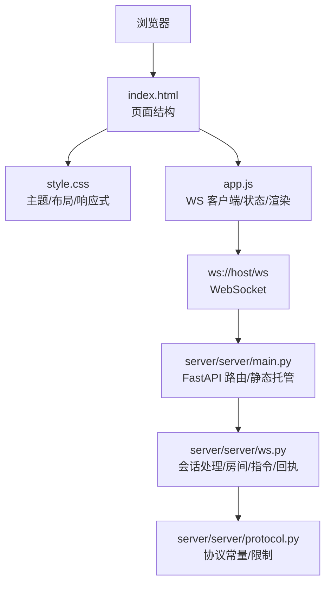
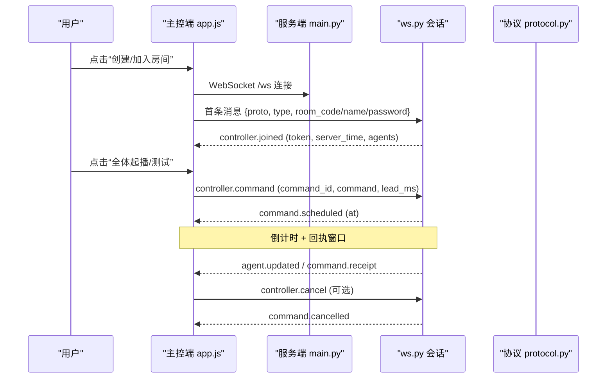
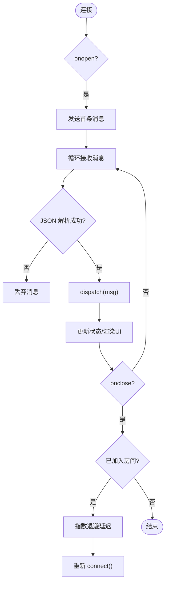
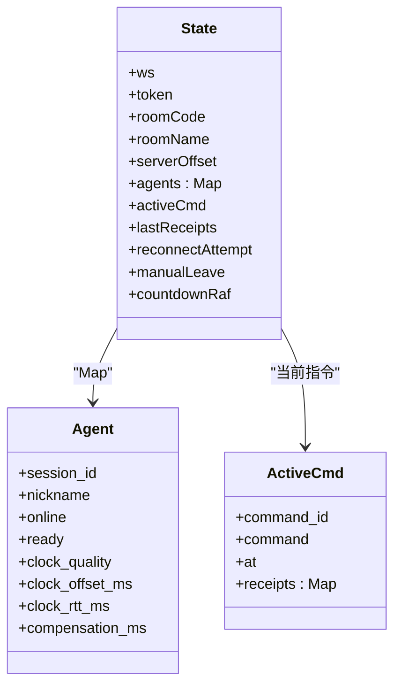
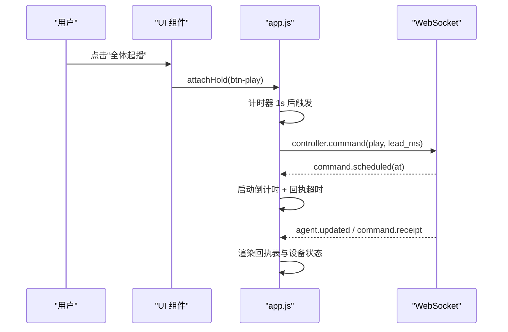
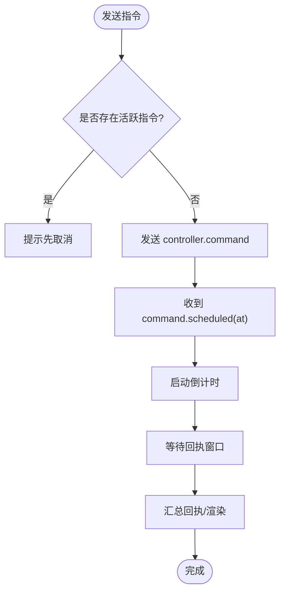
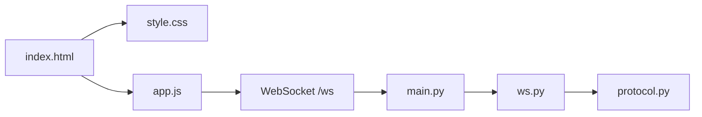

# 主控端开发指南

<cite>
**本文引用的文件**
- [controller/index.html](file://controller/index.html)
- [controller/app.js](file://controller/app.js)
- [controller/style.css](file://controller/style.css)
- [server/server/main.py](file://server/server/main.py)
- [server/server/ws.py](file://server/server/ws.py)
- [server/server/protocol.py](file://server/server/protocol.py)
- [README.md](file://README.md)
</cite>

## 目录
1. [简介](#简介)
2. [项目结构](#项目结构)
3. [核心组件](#核心组件)
4. [架构总览](#架构总览)
5. [详细组件分析](#详细组件分析)
6. [依赖关系分析](#依赖关系分析)
7. [性能与稳定性](#性能与稳定性)
8. [故障排查指南](#故障排查指南)
9. [结论](#结论)
10. [附录：界面定制与扩展指南](#附录界面定制与扩展指南)

## 简介
本指南面向 ScriptCue 主控端的开发者，聚焦原生 JavaScript 前端架构、响应式界面实现、移动端适配策略、WebSocket 客户端（连接管理、重连机制、消息处理、状态管理）、用户界面组件与交互逻辑（设备状态显示、指令下发、实时监控），以及 CSS 样式系统与响应式设计。文档同时给出界面定制与扩展的开发建议，帮助你在不引入框架和构建步骤的前提下快速迭代与维护。

## 项目结构
主控端由三个静态文件组成，由服务端以静态资源方式托管：
- index.html：页面结构与 DOM 节点定义
- app.js：业务逻辑、WebSocket 客户端、状态机与 UI 渲染
- style.css：主题变量、布局与响应式样式

图表来源
- [controller/index.html:1-98](file://controller/index.html#L1-L98)
- [controller/app.js:1-522](file://controller/app.js#L1-L522)
- [controller/style.css:1-216](file://controller/style.css#L1-L216)
- [server/server/main.py:75-98](file://server/server/main.py#L75-L98)
- [server/server/ws.py:334-360](file://server/server/ws.py#L334-L360)
- [server/server/protocol.py:1-80](file://server/server/protocol.py#L1-L80)

章节来源
- [README.md:7-21](file://README.md#L7-L21)
- [controller/index.html:1-98](file://controller/index.html#L1-L98)
- [controller/app.js:1-522](file://controller/app.js#L1-L522)
- [controller/style.css:1-216](file://controller/style.css#L1-L216)
- [server/server/main.py:75-98](file://server/server/main.py#L75-L98)

## 核心组件
- WebSocket 客户端与连接管理
  - 自动选择 ws/wss；首条消息携带 proto、type、房间信息或恢复 token；断线指数退避重连；支持手动离开时停止重连。
- 状态机与数据模型
  - 集中维护 ws、token、roomCode、roomName、serverOffset、agents Map、activeCmd、lastReceipts、reconnectAttempt、countdownRaf 等。
- 视图与交互
  - 首页创建/加入房间；房间控制台展示设备列表、倒计时横幅、回执表；长按防误触；复制房间码；设置补偿值。
- 指令调度与回执
  - 发送指令后进入“等待回执”窗口；按服务器时间计算倒计时；汇总未回执设备并渲染回执表。

章节来源
- [controller/app.js:13-27](file://controller/app.js#L13-L27)
- [controller/app.js:50-81](file://controller/app.js#L50-L81)
- [controller/app.js:83-144](file://controller/app.js#L83-L144)
- [controller/app.js:150-189](file://controller/app.js#L150-L189)
- [controller/app.js:198-298](file://controller/app.js#L198-L298)
- [controller/app.js:311-439](file://controller/app.js#L311-L439)
- [controller/app.js:445-522](file://controller/app.js#L445-L522)

## 架构总览
主控端通过 WebSocket 与服务端建立长连接，首条消息声明角色为控制器，随后参与房间生命周期管理、指令下发与回执接收。服务端负责房间管理、时钟基准、指令广播与状态汇聚，并将设备状态变化推送给主控端。

图表来源
- [controller/app.js:50-81](file://controller/app.js#L50-L81)
- [controller/app.js:83-144](file://controller/app.js#L83-L144)
- [controller/app.js:316-389](file://controller/app.js#L316-L389)
- [server/server/main.py:88-90](file://server/server/main.py#L88-L90)
- [server/server/ws.py:154-207](file://server/server/ws.py#L154-L207)
- [server/server/ws.py:228-244](file://server/server/ws.py#L228-L244)
- [server/server/protocol.py:12-43](file://server/server/protocol.py#L12-L43)

## 详细组件分析

### WebSocket 客户端与连接管理
- 连接建立
  - 根据当前协议自动选择 ws/wss；构造 wsUrl 指向 /ws。
  - onopen 后立即发送首条消息（创建/加入/恢复）。
- 消息分发
  - onmessage 解析 JSON 后统一 dispatch，按类型更新状态并触发渲染。
- 断开与重连
  - onclose 中判断是否已加入房间；若已加入则指数退避重连，上限固定秒数；支持 manualLeave 标记阻止自动重连。
- 错误处理
  - 对 error 类型消息进行统一处理，如房间不存在时回到首页。

图表来源
- [controller/app.js:33-36](file://controller/app.js#L33-L36)
- [controller/app.js:50-81](file://controller/app.js#L50-L81)
- [controller/app.js:83-144](file://controller/app.js#L83-L144)

章节来源
- [controller/app.js:33-81](file://controller/app.js#L33-L81)
- [controller/app.js:83-144](file://controller/app.js#L83-L144)

### 状态管理与数据流
- 全局 state
  - 包含 ws、token、roomCode、roomName、serverOffset、agents Map、activeCmd、lastReceipts、reconnectAttempt、manualLeave、countdownRaf。
- 时间同步
  - 使用 serverTime 与本地时间差估算 serverOffset，用于倒计时与回执超时计算。
- 设备集合
  - agents Map 以 session_id 为键，存储在线状态、就绪状态、时钟质量、偏移、RTT、补偿值等。
- 指令上下文
  - activeCmd 保存当前待执行指令的 command_id、command、at 及回执 Map；完成后归档到 lastReceipts。

图表来源
- [controller/app.js:13-27](file://controller/app.js#L13-L27)
- [controller/app.js:198-298](file://controller/app.js#L198-L298)
- [controller/app.js:316-389](file://controller/app.js#L316-L389)

章节来源
- [controller/app.js:13-27](file://controller/app.js#L13-L27)
- [controller/app.js:198-298](file://controller/app.js#L198-L298)
- [controller/app.js:316-389](file://controller/app.js#L316-L389)

### 用户界面组件与交互逻辑
- 首页
  - 创建房间：输入名称与口令，调用 create 流程。
  - 加入房间：校验 6 位房间码格式，调用 join 流程。
  - 错误提示：统一在 home-error 区域显示。
- 房间控制台
  - 头部：房间名、房间码（可复制）、离开按钮。
  - 倒计时横幅：显示即将执行的指令与剩余时间，支持取消。
  - 设备列表：卡片化展示每个设备的昵称、在线/就绪/时钟质量、偏移/RTT、最近偏差；支持单设备测试与补偿值设置。
  - 控制区：全体起播/暂停/恢复/测试，带长按确认；提前量输入框。
  - 回执表：展示每条指令的执行偏差与状态。
- 交互细节
  - 长按确认：防止误触，提供视觉进度填充。
  - Toast 通知：统一提示操作结果与系统状态。
  - 剪贴板：一键复制房间码。

图表来源
- [controller/index.html:22-92](file://controller/index.html#L22-L92)
- [controller/app.js:150-189](file://controller/app.js#L150-L189)
- [controller/app.js:198-298](file://controller/app.js#L198-L298)
- [controller/app.js:316-439](file://controller/app.js#L316-L439)
- [controller/app.js:445-522](file://controller/app.js#L445-L522)

章节来源
- [controller/index.html:22-92](file://controller/index.html#L22-L92)
- [controller/app.js:150-189](file://controller/app.js#L150-L189)
- [controller/app.js:198-298](file://controller/app.js#L198-L298)
- [controller/app.js:316-439](file://controller/app.js#L316-L439)
- [controller/app.js:445-522](file://controller/app.js#L445-L522)

### 指令下发与回执处理
- 指令下发
  - 生成唯一 command_id；读取 lead_ms；若存在活跃指令且未到执行时刻，提示先取消。
  - 发送至服务端后，进入“等待回执”阶段。
- 倒计时
  - 基于 serverNow = Date.now() + serverOffset 计算剩余时间；使用 requestAnimationFrame 刷新。
- 回执汇总
  - 到达 at + RECEIPT_TIMEOUT_MS 后，将未回执的在线设备标记为 missing，离线设备标记为 offline，归档到 lastReceipts 并渲染。

图表来源
- [controller/app.js:316-389](file://controller/app.js#L316-L389)

章节来源
- [controller/app.js:316-389](file://controller/app.js#L316-L389)

### 移动端适配策略
- 视口与安全区域
  - viewport-fit=cover 与 safe-area-inset-bottom 适配刘海屏与底部安全区。
- 触控优化
  - touch-action: manipulation 禁用双击缩放；pointer 事件统一处理长按；contextmenu 阻止弹出菜单。
- 字体与输入
  - 输入框 font-size 不小于 16px 避免 iOS 聚焦放大；系统字体栈提升可读性。
- 布局与尺寸
  - 竖屏优先布局，桌面端通过媒体查询增强字号与间距。

章节来源
- [controller/index.html:3-8](file://controller/index.html#L3-L8)
- [controller/style.css:17-28](file://controller/style.css#L17-L28)
- [controller/style.css:72-81](file://controller/style.css#L72-L81)
- [controller/style.css:83-100](file://controller/style.css#L83-L100)
- [controller/style.css:189-203](file://controller/style.css#L189-L203)
- [controller/style.css:211-216](file://controller/style.css#L211-L216)
- [controller/app.js:445-465](file://controller/app.js#L445-L465)

### CSS 样式系统与主题
- 设计令牌
  - 使用 :root 变量定义背景、卡片、文字、主色、成功/警告/危险、圆角等，便于主题切换与一致性维护。
- 组件样式
  - 卡片、徽章、按钮、横幅、回执表格等均有明确类名与层级；颜色与字号遵循移动端优先原则。
- 响应式
  - 通过 @media 调整桌面端布局与字号；sticky header 保证导航可见。

章节来源
- [controller/style.css:3-15](file://controller/style.css#L3-L15)
- [controller/style.css:30-60](file://controller/style.css#L30-L60)
- [controller/style.css:106-177](file://controller/style.css#L106-L177)
- [controller/style.css:178-216](file://controller/style.css#L178-L216)

## 依赖关系分析
- 前端依赖
  - index.html 依赖 style.css 与 app.js；app.js 依赖浏览器 WebSocket API、Clipboard API、requestAnimationFrame。
- 后端依赖
  - main.py 暴露 /healthz 与 /ws；静态挂载 controller 目录；ws.py 处理控制器与会话；protocol.py 定义消息类型与限制。
- 耦合点
  - 前后端通过 protocol 常量约定消息类型；主控端与受控端共享同一 /ws 端点，首条消息区分角色。

图表来源
- [controller/index.html:1-98](file://controller/index.html#L1-L98)
- [controller/app.js:1-522](file://controller/app.js#L1-L522)
- [server/server/main.py:75-98](file://server/server/main.py#L75-L98)
- [server/server/ws.py:334-360](file://server/server/ws.py#L334-L360)
- [server/server/protocol.py:1-80](file://server/server/protocol.py#L1-L80)

章节来源
- [server/server/main.py:75-98](file://server/server/main.py#L75-L98)
- [server/server/ws.py:334-360](file://server/server/ws.py#L334-L360)
- [server/server/protocol.py:1-80](file://server/server/protocol.py#L1-L80)

## 性能与稳定性
- 渲染性能
  - 使用 requestAnimationFrame 驱动倒计时，避免阻塞主线程；设备列表按需重建，减少不必要的 DOM 操作。
- 网络与重连
  - 指数退避重连降低瞬时拥塞；最大退避上限防止无限重试；manualLeave 允许用户主动退出重连循环。
- 时间精度
  - 基于 serverOffset 与 server_time 计算倒计时；回执窗口内聚合状态，减少频繁 UI 更新。
- 内存与状态
  - agents Map 与 receipts Map 及时清理；activeCmd 在完成或取消后重置；避免泄漏。

[本节为通用性能讨论，不直接分析具体代码行]

## 故障排查指南
- 无法连接
  - 检查 wsUrl 是否正确（ws/wss）；确认服务端 /ws 可达；查看浏览器控制台是否有跨域或证书问题。
- 加入房间失败
  - 房间码格式必须为 6 位指定字符集；口令错误将被拒绝；房间不存在会返回错误并提示回到首页。
- 指令无回执
  - 检查设备是否在线与就绪；查看回执表中 missing/offline/error 状态；确认提前量设置合理。
- 重连频繁
  - 观察网络抖动；确认服务端健康接口 /healthz 正常；必要时增大提前量或调整心跳间隔。
- 界面异常
  - 检查 DOM 节点 ID 是否与 app.js 绑定一致；确认 CSS 类名未被覆盖；移动端注意触摸事件冲突。

章节来源
- [controller/app.js:83-144](file://controller/app.js#L83-L144)
- [controller/app.js:479-522](file://controller/app.js#L479-L522)
- [server/server/ws.py:154-207](file://server/server/ws.py#L154-L207)
- [server/server/ws.py:228-244](file://server/server/ws.py#L228-L244)

## 结论
ScriptCue 主控端采用极简的原生前端架构，通过清晰的 WebSocket 消息流与集中状态管理，实现了稳定的多设备同步起播控制。其响应式设计与移动端适配确保了导控人员在移动场景下的易用性。结合服务端的房间管理、时钟基准与回执机制，整体方案在保证精度的同时具备良好的可维护性与可扩展性。

[本节为总结性内容，不直接分析具体代码行]

## 附录：界面定制与扩展指南
- 主题与品牌
  - 修改 :root 变量即可全局换肤；替换 logo 与标题文案；调整主色与圆角以匹配品牌风格。
- 新增控件
  - 在 index.html 中添加新节点并在 app.js 中绑定事件；复用 badge、card、row 等已有类保持风格一致。
- 自定义指令
  - 如需新增指令类型，需同步更新 protocol 常量与前后端消息处理；确保命令白名单与回执语义一致。
- 扩展设备信息
  - 在 renderAgentCard 中增加字段展示；与服务端 agent.state() 保持一致；注意性能与可读性。
- 移动端体验优化
  - 使用 pointer 事件统一处理长按与点击；避免 contextmenu 与双击缩放；输入框字号不低于 16px。
- 调试与日志
  - 利用 showToast 输出关键状态；在 dispatch 中打印消息类型辅助定位；必要时临时放宽回执超时以便观察。

章节来源
- [controller/style.css:3-15](file://controller/style.css#L3-L15)
- [controller/index.html:11-20](file://controller/index.html#L11-L20)
- [controller/app.js:198-298](file://controller/app.js#L198-L298)
- [controller/app.js:479-522](file://controller/app.js#L479-L522)
- [server/server/protocol.py:45-49](file://server/server/protocol.py#L45-L49)