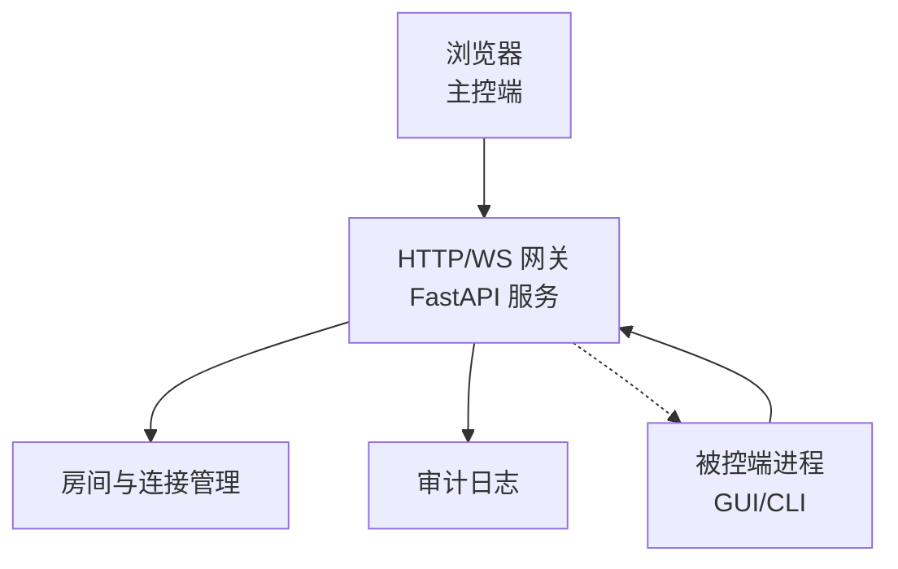
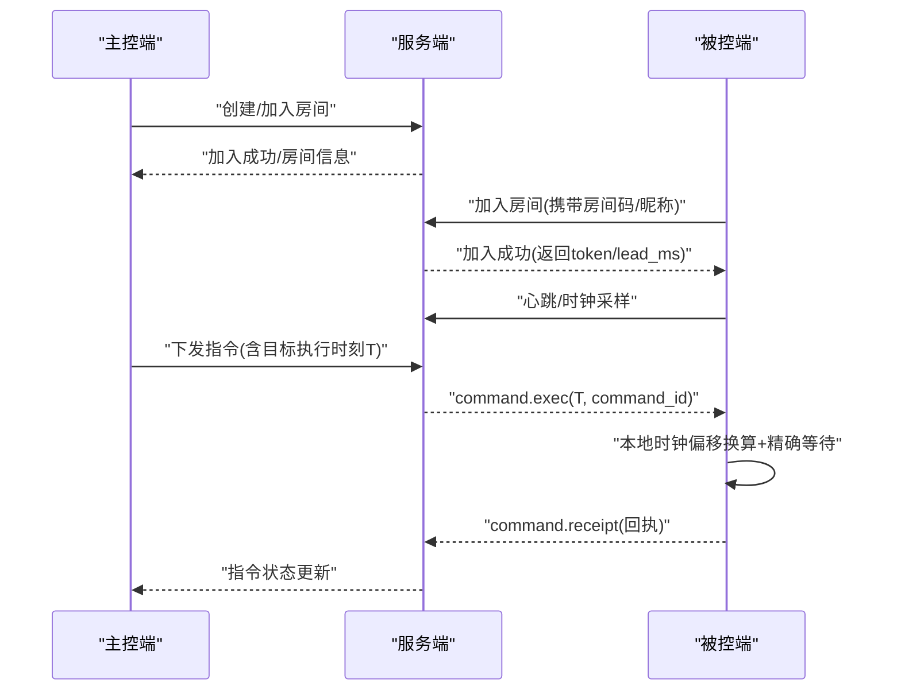

# 快速开始

<cite>
**本文引用的文件**
- [README.md](file://README.md)
- [server/main.py](file://server/server/main.py)
- [server/protocol.py](file://server/server/protocol.py)
- [server/Dockerfile](file://server/Dockerfile)
- [docker-compose.yml](file://docker-compose.yml)
- [agent/cli.py](file://agent/agent/cli.py)
- [agent/engine.py](file://agent/agent/engine.py)
- [agent/gui.py](file://agent/agent/gui.py)
- [agent/scriptcue_agent.py](file://agent/scriptcue_agent.py)
- [server/requirements.txt](file://server/requirements.txt)
- [agent/requirements.txt](file://agent/requirements.txt)
</cite>

## 目录
1. [简介](#简介)
2. [项目结构](#项目结构)
3. [环境要求与依赖安装](#环境要求与依赖安装)
4. [部署与服务端启动](#部署与服务端启动)
5. [主控端访问](#主控端访问)
6. [被控端配置与运行](#被控端配置与运行)
7. [核心流程与时钟同步](#核心流程与时钟同步)
8. [常见问题与故障排除](#常见问题与故障排除)
9. [性能与稳定性建议](#性能与稳定性建议)
10. [结论](#结论)

## 简介
本指南面向新用户，帮助你在最短时间内完成 ScriptCue 系统的安装、部署与基本使用。ScriptCue 通过“时钟对齐 + 绝对时刻调度”，让大屏电脑与多台口述员电脑在公网环境下实现高精度同步起播。系统由三部分构成：服务端（FastAPI + WebSocket）、主控端（静态网页）、被控端（Python 程序）。

## 项目结构
- 服务端：提供房间管理、WebSocket 长连接、授时基准、指令广播、状态汇聚与审计日志；支持 Docker 部署。
- 主控端：导控人员的响应式网页，查看设备状态并下发起播/暂停等指令。
- 被控端：加入房间后持续与服务器做类 NTP 时钟同步；收到带绝对执行时刻的指令后，本地高精度定时到点向前台窗口模拟按下空格键。

图表来源
- [server/main.py:63-98](file://server/server/main.py#L63-L98)
- [server/protocol.py:11-43](file://server/server/protocol.py#L11-L43)

章节来源
- [README.md:7-21](file://README.md#L7-L21)

## 环境要求与依赖安装
- Python ≥ 3.10（服务端与被控端）
- Docker（可选，用于服务端容器化部署）

服务端依赖
- FastAPI、Uvicorn（标准模式）

被控端依赖
- websockets
- pynput（macOS 平台需要，用于按键注入）

章节来源
- [README.md:29-33](file://README.md#L29-L33)
- [server/requirements.txt:1-3](file://server/requirements.txt#L1-L3)
- [agent/requirements.txt:1-6](file://agent/requirements.txt#L1-L6)

## 部署与服务端启动
### 传统方式（本地开发）
- 进入 server 目录，安装依赖后以 Uvicorn 启动服务，监听 0.0.0.0:8000。
- 可通过环境变量调整数据目录、主控端静态目录、默认提前量等。

常用环境变量
- SC_DATA_DIR：审计日志等运行时数据目录（Docker 内为 /app/data）
- SC_CONTROLLER_DIR：主控端静态页面目录
- SC_DEFAULT_LEAD_MS：指令默认提前量（毫秒）
- SC_LOG_LEVEL：日志级别

健康检查
- 服务暴露 /healthz 接口，可用于健康检查与连通性验证。

章节来源
- [README.md:36-42](file://README.md#L36-L42)
- [server/main.py:6-9](file://server/server/main.py#L6-L9)
- [server/main.py:32-37](file://server/server/main.py#L32-L37)
- [server/main.py:78-85](file://server/server/main.py#L78-L85)

### Docker 方式（镜像构建与运行）
- 在仓库根目录构建镜像并运行，映射端口 8000，挂载数据卷持久化审计日志。
- 也可使用 docker compose 一键构建与启动。

Dockerfile 要点
- 基础镜像 python:3.12-slim
- 安装服务端依赖
- 复制服务端代码与主控端静态资源
- 暴露 8000 端口
- 健康检查调用 /healthz
- 默认启动命令为 Uvicorn

docker-compose 要点
- 服务名 scriptcue-server
- 端口映射 8000:8000
- 数据卷 scriptcue-data:/app/data
- 重启策略 unless-stopped

章节来源
- [README.md:44-55](file://README.md#L44-L55)
- [server/Dockerfile:1-24](file://server/Dockerfile#L1-L24)
- [docker-compose.yml:1-15](file://docker-compose.yml#L1-L15)

## 主控端访问
- 浏览器访问 http://<服务器地址>:8000/，即可打开主控端网页（由服务端静态托管）。
- 若未找到主控端目录，服务仍会提供 WebSocket 与 /healthz。

章节来源
- [README.md:57-59](file://README.md#L57-L59)
- [server/main.py:93-98](file://server/server/main.py#L93-L98)

## 被控端配置与运行
### 命令行版（联调/验证核心链路）
- 安装依赖后，通过命令行参数指定服务器地址、房间码、昵称等。
- 支持口令、房间名、演练模式（dry-run）等选项。
- 交互命令：ready/notready（切换就绪）、comp <毫秒>（修改补偿值）、status（查看同步状态）、quit（退出）。

关键参数
- --server：服务器地址（ws://... 或 https://... 会被自动转换为 wss://...）
- --room：6 位房间码
- --nickname：设备昵称
- --password：房间口令（如有）
- --room-name：房间名（服务器重启后自动重建房间时使用）
- --dry-run：演练模式，不实际注入按键

章节来源
- [README.md:61-72](file://README.md#L61-L72)
- [agent/cli.py:1-14](file://agent/agent/cli.py#L1-L14)
- [agent/cli.py:104-134](file://agent/agent/cli.py#L104-L134)
- [agent/engine.py:95-104](file://agent/engine.py#L95-L104)

### GUI 版（正式使用）
- 直接运行 GUI 模块即可启动图形界面，便于日常操作。
- 打包为单文件发布：Windows 执行 build_windows.ps1，macOS 执行 build_macos.sh。
- 首次运行可能需要辅助功能权限（macOS），详见文档指引。

章节来源
- [README.md:67-79](file://README.md#L67-L79)
- [agent/gui.py:1-13](file://agent/agent/gui.py#L1-L13)
- [agent/scriptcue_agent.py:1-10](file://agent/scriptcue_agent.py#L1-L10)

## 核心流程与时钟同步
### 整体时序（主控 → 服务端 → 被控端）

图表来源
- [server/protocol.py:11-43](file://server/server/protocol.py#L11-L43)
- [agent/engine.py:159-192](file://agent/engine.py#L159-L192)

### 时钟同步与触发逻辑
- 被控端加入房间后立即密集采样，估算本地时钟与服务器时钟的偏移，取 RTT 最小的样本作为可信偏移。
- 收到指令后，将 T 换算为本地时刻（T − 时钟偏移 − 补偿值），先粗睡眠再末段自旋等待到点触发。
- 触发完成后发送回执，服务端据此更新指令状态。

章节来源
- [README.md:22-27](file://README.md#L22-L27)
- [server/protocol.py:75-80](file://server/server/protocol.py#L75-L80)
- [agent/engine.py:195-200](file://agent/engine.py#L195-L200)

## 常见问题与故障排除
- 无法访问主控端页面
  - 确认服务已启动且端口 8000 可访问；检查 /healthz 是否返回正常。
  - 若未放置主控端目录，服务仅提供 WebSocket 与健康检查。
  - 参考：[server/main.py:93-98](file://server/server/main.py#L93-L98)、[server/main.py:78-85](file://server/server/main.py#L78-L85)

- 被控端连接失败或频繁重连
  - 检查服务器地址是否正确（http/https 会被自动转为 ws/wss）。
  - 确认房间码格式与口令正确；如服务器重启导致房间丢失，下次重连会自动尝试重建。
  - 参考：[agent/engine.py:95-104](file://agent/engine.py#L95-L104)、[agent/engine.py:159-192](file://agent/engine.py#L159-L192)

- 指令未按预期触发
  - 使用 CLI 的 --dry-run 进行演练，避免实际按键注入干扰。
  - 通过 status 查看当前时钟同步质量与补偿值；必要时用 comp 调整补偿。
  - 参考：[agent/cli.py:104-134](file://agent/agent/cli.py#L104-L134)

- macOS 首次运行提示权限问题
  - 按文档指引授予辅助功能权限后再运行。
  - 参考：[README.md:74-79](file://README.md#L74-L79)

- 数据持久化与日志
  - 使用 Docker 时挂载数据卷以保留审计日志；本地开发注意 SC_DATA_DIR 指向。
  - 参考：[server/Dockerfile:14-16](file://server/Dockerfile#L14-L16)、[server/main.py:32-37](file://server/server/main.py#L32-L37)

## 性能与稳定性建议
- 合理设置提前量（SC_DEFAULT_LEED_MS），确保网络抖动不超过提前量，从而不影响同步精度。
- 保持被控端与服务器时间稳定，避免频繁系统时间变更。
- 控制每房间设备数量（上限 20），避免过多设备影响状态推送与心跳处理。
- 使用 Docker 部署时启用健康检查与自动重启策略，提升可用性。

章节来源
- [server/protocol.py:67-73](file://server/server/protocol.py#L67-L73)
- [server/Dockerfile:20-23](file://server/Dockerfile#L20-L23)

## 结论
按照本指南完成环境准备、服务端启动、主控端访问与被控端配置后，你即可体验 ScriptCue 的高精度同步起播能力。建议在联调阶段优先使用 CLI 与 dry-run 模式验证核心链路，再切换到 GUI 进行日常操作。遇到问题时，结合健康检查、日志与状态命令逐步定位。