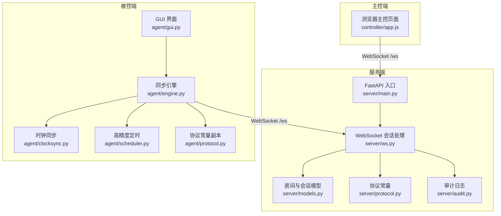
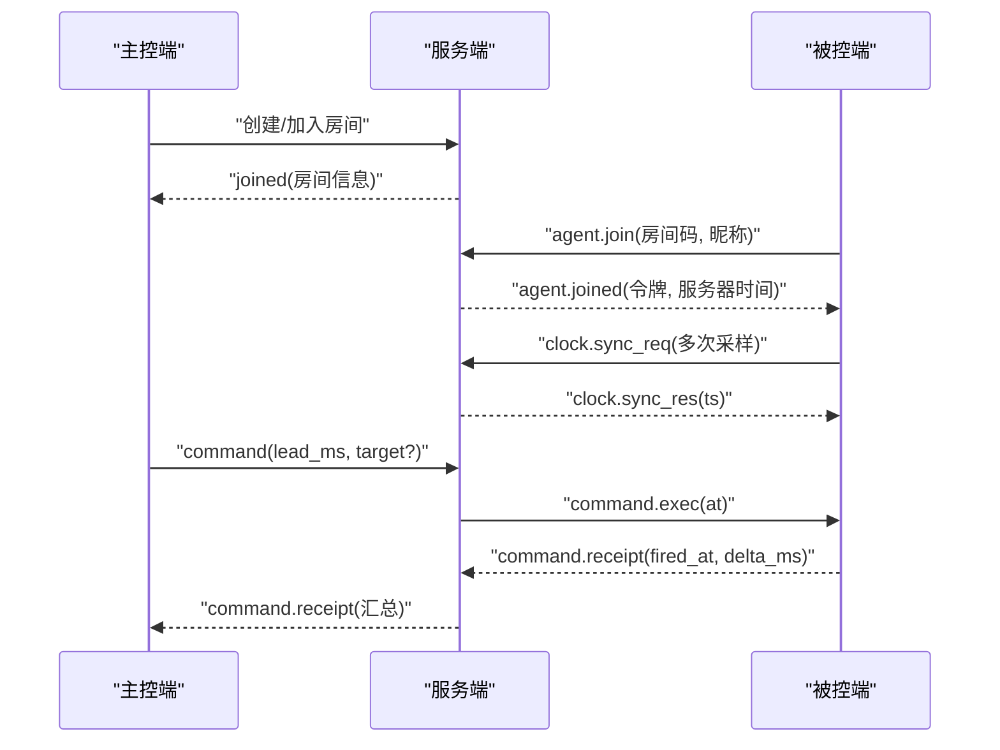
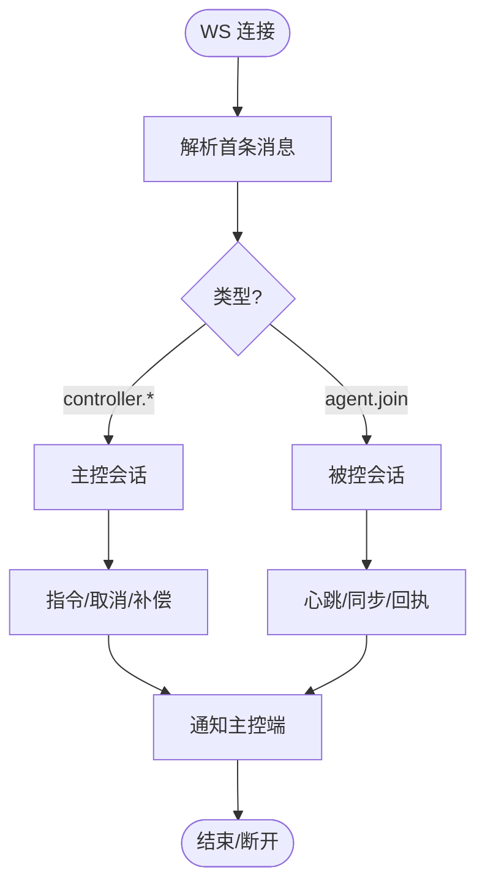
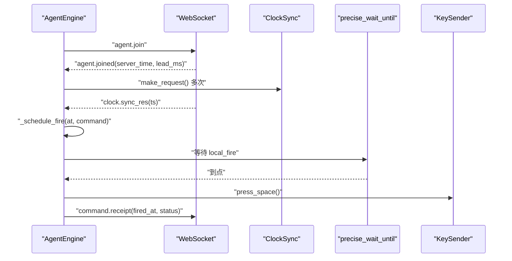
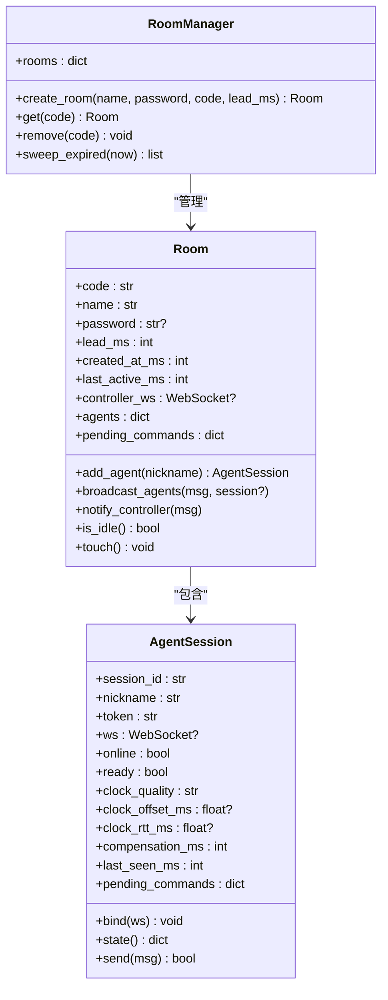
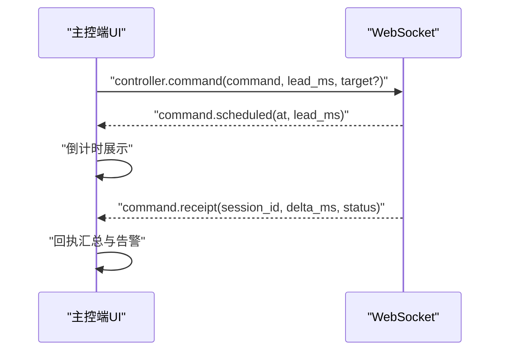
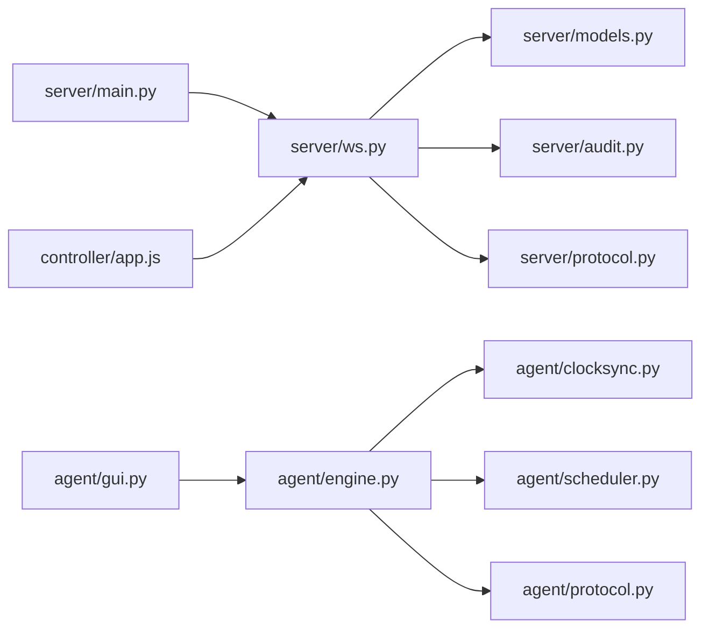

# 故障排除与最佳实践

<cite>
**本文引用的文件**
- [README.md](file://README.md)
- [server/main.py](file://server/server/main.py)
- [server/ws.py](file://server/server/ws.py)
- [server/models.py](file://server/server/models.py)
- [server/protocol.py](file://server/server/protocol.py)
- [server/audit.py](file://server/server/audit.py)
- [agent/engine.py](file://agent/agent/engine.py)
- [agent/clocksync.py](file://agent/agent/clocksync.py)
- [agent/scheduler.py](file://agent/agent/scheduler.py)
- [agent/timeutil.py](file://agent/agent/timeutil.py)
- [agent/protocol.py](file://agent/agent/protocol.py)
- [agent/gui.py](file://agent/agent/gui.py)
- [controller/app.js](file://controller/app.js)
- [docker-compose.yml](file://docker-compose.yml)
</cite>

## 目录
1. [简介](#简介)
2. [项目结构](#项目结构)
3. [核心组件](#核心组件)
4. [架构总览](#架构总览)
5. [详细组件分析](#详细组件分析)
6. [依赖关系分析](#依赖关系分析)
7. [性能注意事项](#性能注意事项)
8. [故障排除指南](#故障排除指南)
9. [监控与日志分析](#监控与日志分析)
10. [安全考虑与防护](#安全考虑与防护)
11. [调试技巧与工具](#调试技巧与工具)
12. [结论](#结论)

## 简介
本指南面向 ScriptCue 系统的运维、测试与使用人员，聚焦常见问题定位与解决（网络连接、时钟同步异常、性能瓶颈、内存泄漏等），提供系统监控与日志分析方法，分享网络配置优化、内存使用优化、并发处理优化的最佳实践，并给出安全考虑与防护措施以及实用的调试技巧。

## 项目结构
ScriptCue 由三部分构成：服务端（FastAPI + WebSocket）、主控端（浏览器网页）、被控端（Python 客户端）。三者通过统一的 JSON 协议通信，采用“时钟对齐 + 绝对时刻调度”实现高精度同步起播。

**图表来源**
- [server/main.py:12-30](file://server/server/main.py#L12-L30)
- [server/ws.py:1-20](file://server/server/ws.py#L1-L20)
- [server/models.py:1-15](file://server/server/models.py#L1-L15)
- [server/protocol.py:1-10](file://server/server/protocol.py#L1-L10)
- [server/audit.py:1-15](file://server/server/audit.py#L1-L15)
- [agent/engine.py:1-25](file://agent/agent/engine.py#L1-L25)
- [agent/clocksync.py:1-15](file://agent/agent/clocksync.py#L1-L15)
- [agent/scheduler.py:1-15](file://agent/agent/scheduler.py#L1-L15)
- [agent/protocol.py:1-10](file://agent/agent/protocol.py#L1-L10)
- [agent/gui.py:1-15](file://agent/agent/gui.py#L1-L15)
- [controller/app.js:1-15](file://controller/app.js#L1-L15)

**章节来源**
- [README.md:7-21](file://README.md#L7-L21)
- [server/main.py:12-30](file://server/server/main.py#L12-L30)
- [server/ws.py:1-20](file://server/server/ws.py#L1-L20)
- [agent/engine.py:1-25](file://agent/agent/engine.py#L1-L25)

## 核心组件
- 服务端
  - FastAPI 应用与生命周期管理、健康检查、静态页面托管
  - WebSocket 会话路由：主控端与被控端共用 /ws，首条消息区分角色
  - 房间与会话模型：纯内存存储，心跳检测、空闲销毁、指令下发与回执聚合
  - 审计日志：JSON Lines 追加写，记录关键操作与回执
- 被控端
  - 同步引擎：连接生命周期、时钟同步、绝对时刻调度、触发回执
  - 时钟同步：类 NTP 算法，多采样取最小 RTT 样本作为可信偏移
  - 高精度定时：粗睡眠 + 末段自旋等待，确保亚毫秒级到点精度
  - GUI：加入房间、就绪标记、补偿值设置、提示音、紧凑面板
- 主控端
  - 创建/加入/恢复房间，下发指令与取消，查看设备状态与回执汇总

**章节来源**
- [server/main.py:63-98](file://server/server/main.py#L63-L98)
- [server/ws.py:154-208](file://server/server/ws.py#L154-L208)
- [server/models.py:64-157](file://server/server/models.py#L64-L157)
- [server/audit.py:17-37](file://server/server/audit.py#L17-L37)
- [agent/engine.py:31-128](file://agent/agent/engine.py#L31-L128)
- [agent/clocksync.py:29-106](file://agent/agent/clocksync.py#L29-L106)
- [agent/scheduler.py:33-59](file://agent/agent/scheduler.py#L33-L59)
- [agent/gui.py:96-241](file://agent/gui.py#L96-L241)
- [controller/app.js:50-134](file://controller/app.js#L50-L134)

## 架构总览
系统通过 WebSocket 长连接维持实时通信；主控端负责业务编排，被控端负责本地执行；服务端集中管理房间与会话，承担授时基准、指令广播与状态汇聚。

**图表来源**
- [server/ws.py:154-208](file://server/server/ws.py#L154-L208)
- [server/ws.py:246-327](file://server/server/ws.py#L246-L327)
- [agent/engine.py:159-192](file://agent/agent/engine.py#L159-L192)
- [agent/engine.py:268-292](file://agent/agent/engine.py#L268-L292)
- [controller/app.js:83-134](file://controller/app.js#L83-L134)

## 详细组件分析

### 服务端 WebSocket 会话处理
- 统一入口 handle_ws：接受连接、解析首条消息、按类型分发至主控或被控会话
- 主控会话：创建/加入/恢复房间，校验口令与会话令牌，处理指令下发、取消、补偿设置
- 被控会话：加入房间、心跳上报、时钟同步应答、补偿更新、回执上报
- 清理与通知：指令到期后清理待执行记录，状态变化通知主控端

**图表来源**
- [server/ws.py:334-360](file://server/server/ws.py#L334-L360)
- [server/ws.py:154-208](file://server/server/ws.py#L154-L208)
- [server/ws.py:246-327](file://server/server/ws.py#L246-L327)

**章节来源**
- [server/ws.py:1-20](file://server/server/ws.py#L1-L20)
- [server/ws.py:154-208](file://server/server/ws.py#L154-L208)
- [server/ws.py:246-327](file://server/server/ws.py#L246-L327)
- [server/ws.py:334-360](file://server/server/ws.py#L334-L360)

### 被控端同步引擎
- 连接生命周期：指数退避重连，断线事件回调，自动重建房间
- 时钟同步：密集采样 + 维持性采样，质量分级上报
- 绝对时刻调度：将服务器时刻换算为本地时刻，线程内精确等待，触发后回执
- 事件回调：连接、时钟、指令调度、触发、取消等事件推送给 GUI

**图表来源**
- [agent/engine.py:106-158](file://agent/agent/engine.py#L106-L158)
- [agent/engine.py:159-192](file://agent/agent/engine.py#L159-L192)
- [agent/engine.py:198-212](file://agent/agent/engine.py#L198-L212)
- [agent/engine.py:297-380](file://agent/agent/engine.py#L297-L380)
- [agent/clocksync.py:37-55](file://agent/agent/clocksync.py#L37-L55)
- [agent/scheduler.py:33-59](file://agent/agent/scheduler.py#L33-L59)

**章节来源**
- [agent/engine.py:31-128](file://agent/agent/engine.py#L31-L128)
- [agent/engine.py:159-192](file://agent/agent/engine.py#L159-L192)
- [agent/engine.py:268-380](file://agent/agent/engine.py#L268-L380)
- [agent/clocksync.py:29-106](file://agent/agent/clocksync.py#L29-L106)
- [agent/scheduler.py:33-59](file://agent/agent/scheduler.py#L33-L59)

### 房间与会话模型
- 房间：成员管理、指令待执行集合、空闲销毁、广播与通知
- 会话：绑定 WebSocket、在线状态、时钟质量与偏移、补偿值、待执行指令映射
- 管理器：房间创建/获取/清理，空闲扫描

**图表来源**
- [server/models.py:17-62](file://server/models.py#L17-L62)
- [server/models.py:64-157](file://server/models.py#L64-L157)

**章节来源**
- [server/models.py:17-62](file://server/models.py#L17-L62)
- [server/models.py:64-157](file://server/models.py#L64-L157)

### 主控端交互流程
- 连接与重连：指数退避，保持会话令牌
- 指令下发：防误触长按确认，倒计时显示，回执超时汇总
- 设备状态：在线/就绪/时钟质量，最近偏差告警

**图表来源**
- [controller/app.js:50-134](file://controller/app.js#L50-L134)
- [controller/app.js:316-389](file://controller/app.js#L316-L389)

**章节来源**
- [controller/app.js:50-134](file://controller/app.js#L50-L134)
- [controller/app.js:316-389](file://controller/app.js#L316-L389)

## 依赖关系分析
- 服务端依赖 FastAPI、WebSocket、内存模型、审计日志、协议常量
- 被控端依赖 websockets、线程与定时器、按键注入、协议常量副本
- 主控端依赖浏览器 WebSocket API、原生 JS 无框架

**图表来源**
- [server/main.py:12-30](file://server/server/main.py#L12-L30)
- [server/ws.py:1-20](file://server/server/ws.py#L1-L20)
- [server/models.py:1-15](file://server/server/models.py#L1-L15)
- [server/audit.py:1-15](file://server/server/audit.py#L1-L15)
- [server/protocol.py:1-10](file://server/server/protocol.py#L1-L10)
- [agent/engine.py:1-25](file://agent/agent/engine.py#L1-L25)
- [agent/clocksync.py:1-15](file://agent/agent/clocksync.py#L1-L15)
- [agent/scheduler.py:1-15](file://agent/agent/scheduler.py#L1-L15)
- [agent/protocol.py:1-10](file://agent/agent/protocol.py#L1-L10)
- [agent/gui.py:1-15](file://agent/agent/gui.py#L1-L15)
- [controller/app.js:1-15](file://controller/app.js#L1-L15)

**章节来源**
- [server/main.py:12-30](file://server/server/main.py#L12-L30)
- [server/ws.py:1-20](file://server/server/ws.py#L1-L20)
- [agent/engine.py:1-25](file://agent/agent/engine.py#L1-L25)
- [controller/app.js:1-15](file://controller/app.js#L1-L15)

## 性能注意事项
- 网络延迟与抖动：提前量需大于最大网络抖动，保证指令在到达前已预留缓冲
- 时钟同步质量：RTT 越小越可靠，建议保持良好网络环境，避免高丢包与高抖动
- 高精度定时：Windows 下提升系统定时器分辨率，减少 sleep 误差；末段自旋确保到点精度
- 内存占用：房间与会话纯内存存储，注意房间数量与会话数上限，避免过多常驻房间
- 日志写入：审计日志采用同步追加写，数据量较小，但应避免频繁大对象序列化

[本节为通用性能指导，不直接分析具体文件]

## 故障排除指南

### 网络连接问题
- 症状：无法连接或频繁断线
- 可能原因
  - 服务器地址或端口错误，HTTPS 未正确转换为 WSS
  - 防火墙或代理阻断 WebSocket
  - 网络不稳定导致握手失败或心跳超时
- 排查步骤
  - 检查被控端 URL 规范化逻辑，确保 http(s) 转为 ws(s) 并附加 /ws
  - 验证服务端 /healthz 可访问，返回服务时间与房间数
  - 观察重连退避与断开事件，确认是否指数退避生效
  - 检查主控端重连逻辑与令牌恢复
- 参考实现路径
  - [URL 规范化与连接:95-105](file://agent/agent/engine.py#L95-L105)
  - [健康检查:78-85](file://server/server/main.py#L78-L85)
  - [重连与断开事件:106-128](file://agent/agent/engine.py#L106-L128)
  - [主控端重连:66-81](file://controller/app.js#L66-L81)

**章节来源**
- [agent/engine.py:95-128](file://agent/agent/engine.py#L95-L128)
- [server/main.py:78-85](file://server/server/main.py#L78-L85)
- [controller/app.js:66-81](file://controller/app.js#L66-L81)

### 时钟同步异常
- 症状：触发跳过、偏差过大、质量差或未同步
- 可能原因
  - 首次加入后密集采样不足
  - 网络抖动导致 RTT 增大，样本老化
  - 本地时钟漂移严重
- 排查步骤
  - 检查密集采样次数与间隔，确认收到 clock_sample 事件
  - 观察 offset_ms、rtt_ms、quality 字段，评估同步质量
  - 调整补偿值以校正系统偏差
  - 若服务器重启，确认 auto_create 机制重建房间
- 参考实现路径
  - [密集采样与维持采样:198-212](file://agent/agent/engine.py#L198-L212)
  - [时钟同步算法与质量:29-106](file://agent/agent/clocksync.py#L29-L106)
  - [调度前检查时钟同步:297-311](file://agent/agent/engine.py#L297-L311)
  - [服务器重启自动重建:253-260](file://server/server/ws.py#L253-L260)

**章节来源**
- [agent/engine.py:198-212](file://agent/agent/engine.py#L198-L212)
- [agent/engine.py:297-311](file://agent/agent/engine.py#L297-L311)
- [agent/clocksync.py:29-106](file://agent/agent/clocksync.py#L29-L106)
- [server/ws.py:253-260](file://server/server/ws.py#L253-L260)

### 性能瓶颈
- 症状：指令延迟高、CPU 占用高、UI 卡顿
- 可能原因
  - 大量设备同时心跳与回执造成服务端压力
  - 主循环阻塞（如 GUI 事件循环）
  - 高频日志写入或大对象序列化
- 排查步骤
  - 监控心跳间隔与回执窗口，合理设置 lead_ms
  - 检查 Windows 定时器分辨率提升是否生效
  - 限制房间数量与会话数，及时销毁空闲房间
  - 观察审计日志写入频率与大小
- 参考实现路径
  - [心跳间隔与回执窗口:75-79](file://server/server/protocol.py#L75-L79)
  - [定时器分辨率提升:20-27](file://agent/agent/scheduler.py#L20-L27)
  - [空闲房间销毁:54-61](file://server/server/main.py#L54-L61)
  - [审计日志写入:24-33](file://server/server/audit.py#L24-L33)

**章节来源**
- [server/server/protocol.py:75-79](file://server/server/protocol.py#L75-L79)
- [agent/agent/scheduler.py:20-27](file://agent/agent/scheduler.py#L20-L27)
- [server/server/main.py:54-61](file://server/server/main.py#L54-L61)
- [server/server/audit.py:24-33](file://server/server/audit.py#L24-L33)

### 内存泄漏
- 症状：长时间运行后内存持续增长
- 可能原因
  - 房间与会话未及时清理
  - 待执行指令集合未清理
  - 日志文件句柄未关闭
- 排查步骤
  - 检查空闲房间 TTL 与扫描任务
  - 确认指令回执后 pending_commands 清理
  - 验证审计日志在应用退出时关闭
- 参考实现路径
  - [空闲房间销毁](file://server/server/main.py:54-61)
  - [指令清理](file://server/server/ws.py:107-115)
  - [审计日志关闭](file://server/server/main.py:68-72)

**章节来源**
- [server/server/main.py:54-72](file://server/server/main.py#L54-L72)
- [server/server/ws.py:107-115](file://server/server/ws.py#L107-L115)

## 监控与日志分析

### 系统监控
- 健康检查：/healthz 返回服务版本、当前时间、房间数
- 设备状态：主控端显示在线/就绪/时钟质量/偏移/RTT
- 指令回执：主控端汇总各设备触发偏差与状态

**章节来源**
- [server/main.py:78-85](file://server/server/main.py#L78-L85)
- [controller/app.js:198-298](file://controller/app.js#L198-L298)
- [controller/app.js:391-439](file://controller/app.js#L391-L439)

### 日志分析
- 审计日志：JSON Lines 格式，记录命令、回执、设备上下线等
- 分析要点
  - 按 event 筛选关键事件（command、receipt、agent_join、agent_disconnect）
  - 统计 delta_ms 分布，识别异常偏差
  - 关联 session_id 追踪单设备行为
- 工具建议
  - 使用 jq 或 Python 脚本解析 JSON Lines
  - 结合时间戳进行前后对比分析

**章节来源**
- [server/audit.py:17-37](file://server/server/audit.py#L17-L37)

## 安全考虑与防护

### 网络安全配置
- 使用 HTTPS/WSS 传输，避免明文暴露敏感信息
- 限制访问源与端口，仅开放必要服务
- 使用 Docker 卷持久化审计日志，避免容器重启丢失

**章节来源**
- [docker-compose.yml:1-15](file://docker-compose.yml#L1-L15)

### 访问控制机制
- 房间口令：创建时可设置口令，加入时需校验
- 会话令牌：主控端与会话均维护令牌，防止会话劫持
- 设备上限：每房间最大设备数限制，防止资源滥用

**章节来源**
- [server/models.py:64-95](file://server/models.py#L64-L95)
- [server/ws.py:159-173](file://server/ws.py#L159-L173)
- [server/protocol.py:67-73](file://server/protocol.py#L67-L73)

### 数据保护措施
- 审计日志仅记录必要字段，避免敏感信息泄露
- 房间数据纯内存存储，重启后由客户端重建，降低持久化风险
- 补偿值范围限制，防止恶意输入影响系统稳定性

**章节来源**
- [server/audit.py:24-33](file://server/server/audit.py#L24-L33)
- [server/models.py:1-5](file://server/models.py#L1-L5)
- [server/ws.py:23-26](file://server/ws.py#L23-L26)

## 调试技巧与工具

### 调试技巧
- 启用详细日志：调整 SC_LOG_LEVEL 输出更详细的运行信息
- 观察事件回调：GUI 中查看连接、时钟、指令调度、触发等事件
- 手动调整补偿值：在主控端或 GUI 中微调补偿值以校正偏差
- 使用测试指令：对单设备进行测试触发，验证链路是否正常

**章节来源**
- [server/main.py:28-30](file://server/server/main.py#L28-L30)
- [agent/gui.py:301-337](file://agent/gui.py#L301-L337)
- [controller/app.js:268-298](file://controller/app.js#L268-L298)

### 工具使用方法
- Docker Compose：一键启动服务，挂载数据卷
- 命令行模式：快速联调核心链路，无需 GUI
- 打包发布：生成单文件程序，便于分发与部署

**章节来源**
- [docker-compose.yml:1-15](file://docker-compose.yml#L1-L15)
- [README.md:61-79](file://README.md#L61-L79)

## 结论
ScriptCue 通过严谨的时钟同步与高精度定时机制，实现了跨设备的同步起播。在实际使用中，应重点关注网络连接稳定性、时钟同步质量与性能调优，结合监控与日志分析快速定位问题。遵循安全配置与最佳实践，可显著提升系统的可靠性与可维护性。