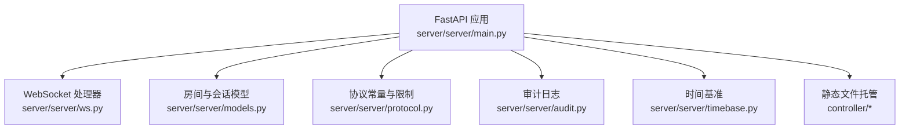
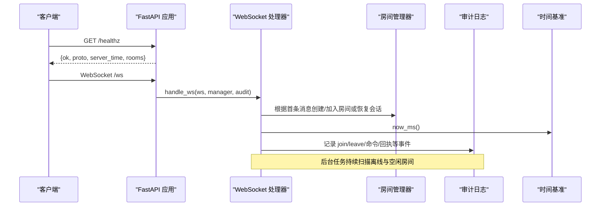
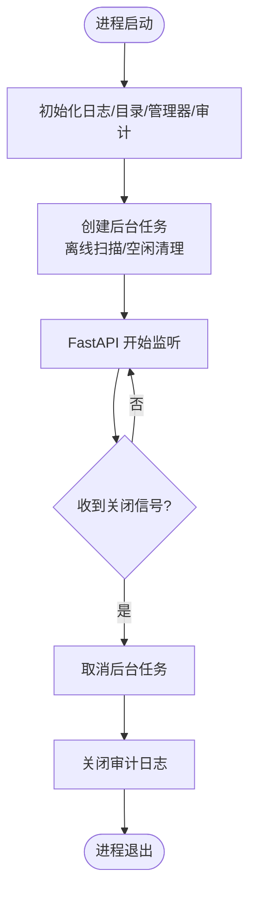
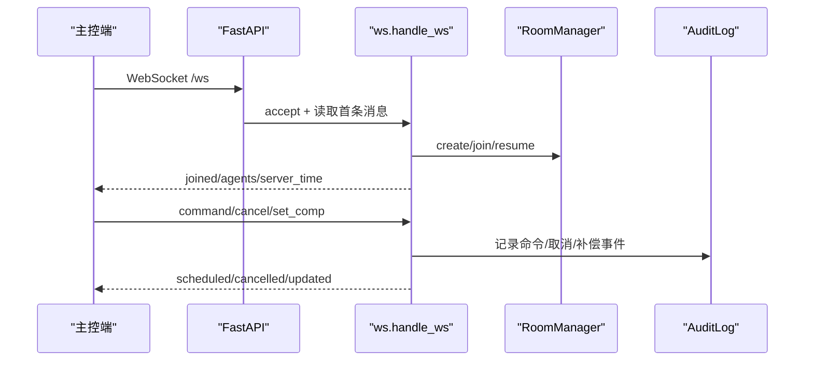
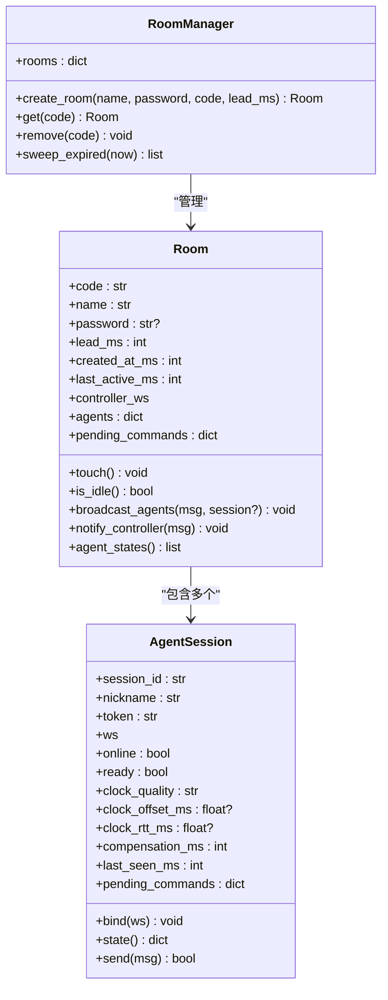
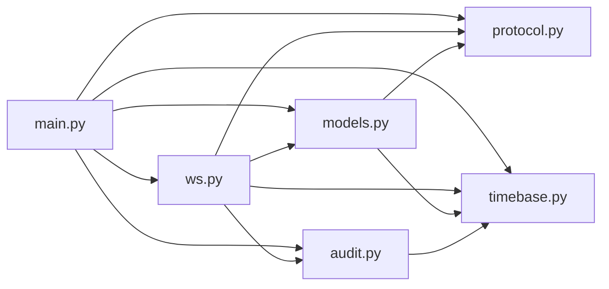

# FastAPI 应用架构

<cite>
**本文引用的文件**
- [server/server/main.py](file://server/server/main.py)
- [server/server/ws.py](file://server/server/ws.py)
- [server/server/models.py](file://server/server/models.py)
- [server/server/protocol.py](file://server/server/protocol.py)
- [server/server/audit.py](file://server/server/audit.py)
- [server/server/timebase.py](file://server/server/timebase.py)
- [README.md](file://README.md)
- [docker-compose.yml](file://docker-compose.yml)
- [server/Dockerfile](file://server/Dockerfile)
- [server/requirements.txt](file://server/requirements.txt)
</cite>

## 目录
1. [简介](#简介)
2. [项目结构](#项目结构)
3. [核心组件](#核心组件)
4. [架构总览](#架构总览)
5. [详细组件分析](#详细组件分析)
6. [依赖关系分析](#依赖关系分析)
7. [性能与可靠性](#性能与可靠性)
8. [故障排查指南](#故障排查指南)
9. [结论](#结论)
10. [附录：环境变量与部署清单](#附录：环境变量与部署清单)

## 简介
本文件为 ScriptCue 服务端（FastAPI + WebSocket）的架构文档，聚焦以下目标：
- 应用启动流程、生命周期管理与后台任务调度机制
- 环境变量配置（SC_DATA_DIR、SC_CONTROLLER_DIR、SC_DEFAULT_LEAD_MS）的作用与设置方法
- 健康检查端点 /healthz 的实现与监控用途
- 静态文件服务挂载与主控端界面托管方式
- 日志配置、错误处理与异常处理策略
- 开发环境启动与生产环境部署最佳实践

该服务通过房间模型管理主控端与被控端的 WebSocket 会话，提供时钟同步、指令调度、状态汇聚与审计日志能力。

**章节来源**
- [README.md:16-28](file://README.md#L16-L28)

## 项目结构
- server/server：FastAPI 应用核心代码（路由、WebSocket、模型、协议常量、审计日志、时间基准）
- controller：主控端前端资源（HTML/JS/CSS），由服务端以静态文件形式托管
- agent：被控端程序（不在本文重点）
- 容器化：Dockerfile 与 docker-compose.yml 用于构建镜像与服务编排

**图表来源**
- [server/server/main.py:12-37](file://server/server/main.py#L12-L37)
- [server/server/ws.py:1-20](file://server/server/ws.py#L1-L20)
- [server/server/models.py:1-10](file://server/server/models.py#L1-L10)
- [server/server/protocol.py:1-10](file://server/server/protocol.py#L1-L10)
- [server/server/audit.py:1-15](file://server/server/audit.py#L1-L15)
- [server/server/timebase.py:1-13](file://server/server/timebase.py#L1-L13)

**章节来源**
- [README.md:7-14](file://README.md#L7-L14)
- [server/Dockerfile:11-16](file://server/Dockerfile#L11-L16)
- [docker-compose.yml:1-15](file://docker-compose.yml#L1-L15)

## 核心组件
- 应用入口与生命周期：定义 lifespan，启动后台任务（离线扫描、空闲房间清理），优雅关闭时取消任务并关闭审计日志
- WebSocket 路由：统一 /ws 接入，首条消息区分主控端或被控端角色，进入对应会话处理流程
- 房间与会话模型：内存存储房间、设备会话、待执行指令；支持自动创建、口令校验、容量限制、空闲销毁
- 协议常量：消息类型、指令类型、错误码、心跳与离线判定阈值、默认提前量等
- 审计日志：JSON Lines 追加写，记录关键事件（指令下发、回执、设备上下线、房间重建等）
- 时间基准：基于 time.time_ns() 的高精度毫秒时间戳，作为所有“服务器时间”的统一来源

**章节来源**
- [server/server/main.py:63-75](file://server/server/main.py#L63-L75)
- [server/server/ws.py:334-360](file://server/server/ws.py#L334-L360)
- [server/server/models.py:17-157](file://server/server/models.py#L17-L157)
- [server/server/protocol.py:7-80](file://server/server/protocol.py#L7-L80)
- [server/server/audit.py:17-37](file://server/server/audit.py#L17-L37)
- [server/server/timebase.py:7-13](file://server/server/timebase.py#L7-L13)

## 架构总览
下图展示请求从客户端到服务端的整体路径，包括 HTTP 健康检查、WebSocket 握手与消息分发、后台任务对在线状态的维护以及审计日志写入。

**图表来源**
- [server/server/main.py:78-90](file://server/server/main.py#L78-L90)
- [server/server/ws.py:334-360](file://server/server/ws.py#L334-L360)
- [server/server/models.py:120-157](file://server/server/models.py#L120-L157)
- [server/server/audit.py:24-33](file://server/server/audit.py#L24-L33)
- [server/server/timebase.py:10-13](file://server/server/timebase.py#L10-L13)

## 详细组件分析

### 应用启动与生命周期管理
- 启动阶段：初始化日志级别与格式，解析数据目录、主控端目录，创建房间管理器与审计日志实例
- 后台任务：
  - 离线扫描：每秒检查心跳超时（超过 3 次心跳间隔）的设备，标记离线并通知主控端，同时记录审计事件
  - 空闲清理：每分钟扫描空闲超时的房间并销毁
- 关闭阶段：取消后台任务，等待任务结束，关闭审计日志文件句柄

**图表来源**
- [server/server/main.py:28-37](file://server/server/main.py#L28-L37)
- [server/server/main.py:40-61](file://server/server/main.py#L40-L61)
- [server/server/main.py:63-75](file://server/server/main.py#L63-L75)

**章节来源**
- [server/server/main.py:28-75](file://server/server/main.py#L28-L75)

### WebSocket 会话与消息路由
- 统一接入：/ws 接收连接，首条消息必须为 JSON 对象且包含协议版本
- 角色识别：
  - 主控端：create/join/resume，建立主控会话，接管旧连接，推送房间状态与设备列表
  - 被控端：join，按房间码与令牌恢复会话，或自动创建房间（服务器重启后）
- 消息处理：
  - 主控端：下发指令（play/pause/test）、取消指令、设置补偿值
  - 被控端：心跳、时钟同步请求、回执、设置补偿值
- 错误处理：非法消息、未知类型、参数越界等返回标准错误消息

**图表来源**
- [server/server/ws.py:334-360](file://server/server/ws.py#L334-L360)
- [server/server/ws.py:154-208](file://server/server/ws.py#L154-L208)
- [server/server/ws.py:246-328](file://server/server/ws.py#L246-L328)
- [server/server/audit.py:24-33](file://server/server/audit.py#L24-L33)

**章节来源**
- [server/server/ws.py:1-360](file://server/server/ws.py#L1-L360)

### 房间与会话模型
- AgentSession：保存会话标识、昵称、令牌、在线状态、时钟质量、偏移与 RTT、补偿值、最后心跳时间、待执行指令映射
- Room：房间标识、名称、口令、提前量、创建/活跃时间、主控连接、设备集合、待执行指令集合
- RoomManager：房间创建（支持指定房间码以便重启恢复）、查找、删除、空闲房间清理

**图表来源**
- [server/server/models.py:17-157](file://server/server/models.py#L17-L157)

**章节来源**
- [server/server/models.py:1-157](file://server/server/models.py#L1-L157)

### 协议常量与限制
- 消息类型：主控端、被控端、服务器推送三类消息
- 指令类型：play、pause、test，白名单校验
- 错误码：协议版本不匹配、房间不存在、口令错误、满员、未知指令、设备不存在、消息格式错误等
- 服务端限制：每房间最大设备数、房间码长度与字符集、空闲 TTL、心跳间隔、离线判定秒数、回执超时窗口、状态推送节流间隔
- 默认提前量：从环境变量 SC_DEFAULT_LEAD_MS 读取，模块导入期绑定默认参数

**章节来源**
- [server/server/protocol.py:7-80](file://server/server/protocol.py#L7-L80)

### 审计日志
- 写入策略：JSON Lines 格式，线程安全追加写，失败时记录异常但不中断主流程
- 记录内容：事件类型（如 command、receipt、agent_join、room_recreated 等）及上下文字段
- 生命周期：应用启动时创建，关闭时显式关闭文件句柄

**章节来源**
- [server/server/audit.py:1-37](file://server/server/audit.py#L1-L37)

### 时间基准
- 使用 time.time_ns() 计算毫秒级 Unix 时间戳，跨平台一致，满足授时需求
- 所有“服务器时间”字段均来源于此函数，保证一致性

**章节来源**
- [server/server/timebase.py:1-13](file://server/server/timebase.py#L1-L13)

## 依赖关系分析
- main.py 依赖 ws、models、protocol、audit、timebase
- ws.py 依赖 protocol、audit、models、timebase
- models.py 依赖 protocol、timebase
- audit.py 依赖 timebase
- Dockerfile 将 server/server 与 controller 复制到镜像中，暴露 8000 端口，并通过 HEALTHCHECK 调用 /healthz

**图表来源**
- [server/server/main.py:22-26](file://server/server/main.py#L22-L26)
- [server/server/ws.py:15-18](file://server/server/ws.py#L15-L18)
- [server/server/models.py:9-10](file://server/server/models.py#L9-L10)
- [server/server/audit.py:12-12](file://server/server/audit.py#L12-L12)

**章节来源**
- [server/requirements.txt:1-3](file://server/requirements.txt#L1-L3)
- [server/Dockerfile:8-18](file://server/Dockerfile#L8-L18)

## 性能与可靠性
- 内存模型：房间与会话纯内存存储，重启后由客户端重连自动重建，降低 I/O 压力
- 后台任务：轻量协程循环，避免阻塞请求处理
- 心跳与离线判定：通过固定间隔与阈值控制，减少误判与频繁广播
- 指令回执窗口：到期后清理待执行记录，防止内存泄漏
- 审计日志：低写入频率，直接追加写，必要时可异步化或落盘优化
- 健康检查：/healthz 提供快速存活探测，便于容器编排与健康探针

[本节为通用性能建议，无需特定文件引用]

## 故障排查指南
- 无法访问主控端页面：确认 CONTROLLER_DIR 存在且可读；若缺失，仅保留 WebSocket 与 /healthz
- 设备显示离线：检查心跳间隔与离线判定阈值；确认被控端网络与时间同步正常
- 指令未触发：查看回执窗口是否过期；检查设备 pending_commands 与房间 pending_commands 清理逻辑
- 审计日志无输出：检查 SC_DATA_DIR 权限与磁盘空间；确认审计日志文件句柄在关闭时被释放
- 健康检查失败：确认 /healthz 可达；容器内 curl 或 python 请求验证

**章节来源**
- [server/server/main.py:93-98](file://server/server/main.py#L93-L98)
- [server/server/ws.py:214-226](file://server/server/ws.py#L214-L226)
- [server/server/ws.py:107-115](file://server/server/ws.py#L107-L115)
- [server/server/audit.py:24-33](file://server/server/audit.py#L24-L33)

## 结论
ScriptCue 服务端采用 FastAPI 与 WebSocket 实现高并发、低延迟的指令调度与时钟同步。通过房间模型与内存状态管理，结合后台任务进行设备在线性维护与房间生命周期管理，辅以审计日志保障可追溯性。健康检查与容器化部署使服务易于运维与扩展。遵循本文的环境变量配置与部署建议，可在开发与生产环境中稳定运行。

[本节为总结性内容，无需特定文件引用]

## 附录：环境变量与部署清单

### 环境变量说明
- SC_DATA_DIR
  - 作用：审计日志等运行时数据目录
  - 默认：仓库根目录下的 server/data（Docker 内为 /app/data）
  - 设置方法：启动前导出或在 Dockerfile/docker-compose 中声明
- SC_CONTROLLER_DIR
  - 作用：主控端静态目录，用于静态文件托管
  - 默认：仓库根目录下的 controller
  - 设置方法：同上
- SC_DEFAULT_LEAD_MS
  - 作用：指令默认提前量（毫秒），影响指令执行时刻 T = 当前时间 + 提前量
  - 默认：3000
  - 设置方法：同上

**章节来源**
- [server/server/main.py:6-9](file://server/server/main.py#L6-L9)
- [server/server/main.py:32-35](file://server/server/main.py#L32-L35)
- [server/server/protocol.py:72-73](file://server/server/protocol.py#L72-L73)
- [server/Dockerfile:14-16](file://server/Dockerfile#L14-L16)

### 开发环境启动
- 安装依赖：pip install -r server/requirements.txt
- 启动服务：uvicorn server.main:app --host 0.0.0.0 --port 8000
- 访问主控端：浏览器打开 http://<服务器地址>:8000/

**章节来源**
- [README.md:34-42](file://README.md#L34-L42)
- [server/requirements.txt:1-3](file://server/requirements.txt#L1-L3)

### 生产环境部署
- 容器镜像：使用 server/Dockerfile 构建镜像，复制 server/server 与 controller
- 数据持久化：通过卷挂载 /app/data 保留审计日志
- 健康检查：HEALTHCHECK 定期调用 /healthz，确保服务可用
- 编排：使用 docker-compose.yml 管理服务，端口映射 8000，卷命名 scriptcue-data

**章节来源**
- [server/Dockerfile:1-24](file://server/Dockerfile#L1-L24)
- [docker-compose.yml:1-15](file://docker-compose.yml#L1-L15)

### 健康检查端点 /healthz
- 功能：返回 ok、协议版本、服务器时间、房间数量
- 用途：容器编排与健康探针，快速判断服务存活与基本状态
- 行为：只读、无副作用、响应迅速

**章节来源**
- [server/server/main.py:78-85](file://server/server/main.py#L78-L85)
- [server/Dockerfile:20-21](file://server/Dockerfile#L20-L21)

### 静态文件服务与主控端托管
- 机制：当 CONTROLLER_DIR 存在时，以 StaticFiles 挂载到根路径，启用 HTML 模式
- 保护：若目录缺失，仅保留 WebSocket 与 /healthz，并记录警告日志
- 优势：简化部署，无需额外 Web 服务器

**章节来源**
- [server/server/main.py:93-98](file://server/server/main.py#L93-L98)

### 日志配置与异常处理策略
- 日志级别：通过 SC_LOG_LEVEL 控制，默认 INFO；格式包含时间、模块、级别与消息
- 异常处理：
  - WebSocket 断开：捕获并安全关闭连接
  - 消息解析失败：返回标准错误消息，保持连接
  - 审计日志写入失败：记录异常，不影响主流程
- 最佳实践：在生产环境集中收集日志，配合结构化字段便于检索与分析

**章节来源**
- [server/server/main.py:28-30](file://server/server/main.py#L28-L30)
- [server/server/ws.py:29-39](file://server/server/ws.py#L29-L39)
- [server/server/audit.py:24-33](file://server/server/audit.py#L24-L33)