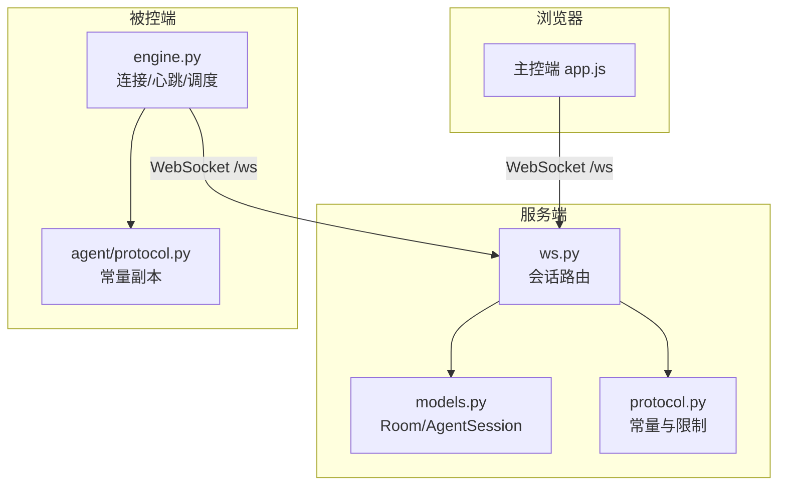
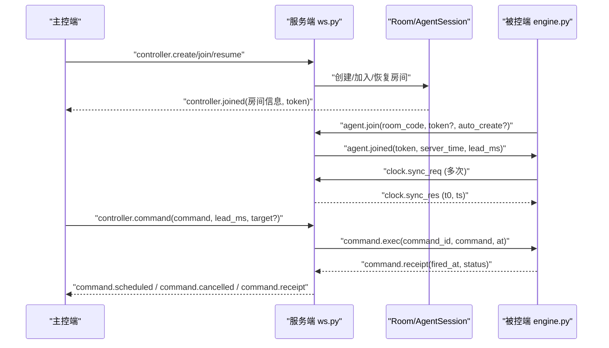
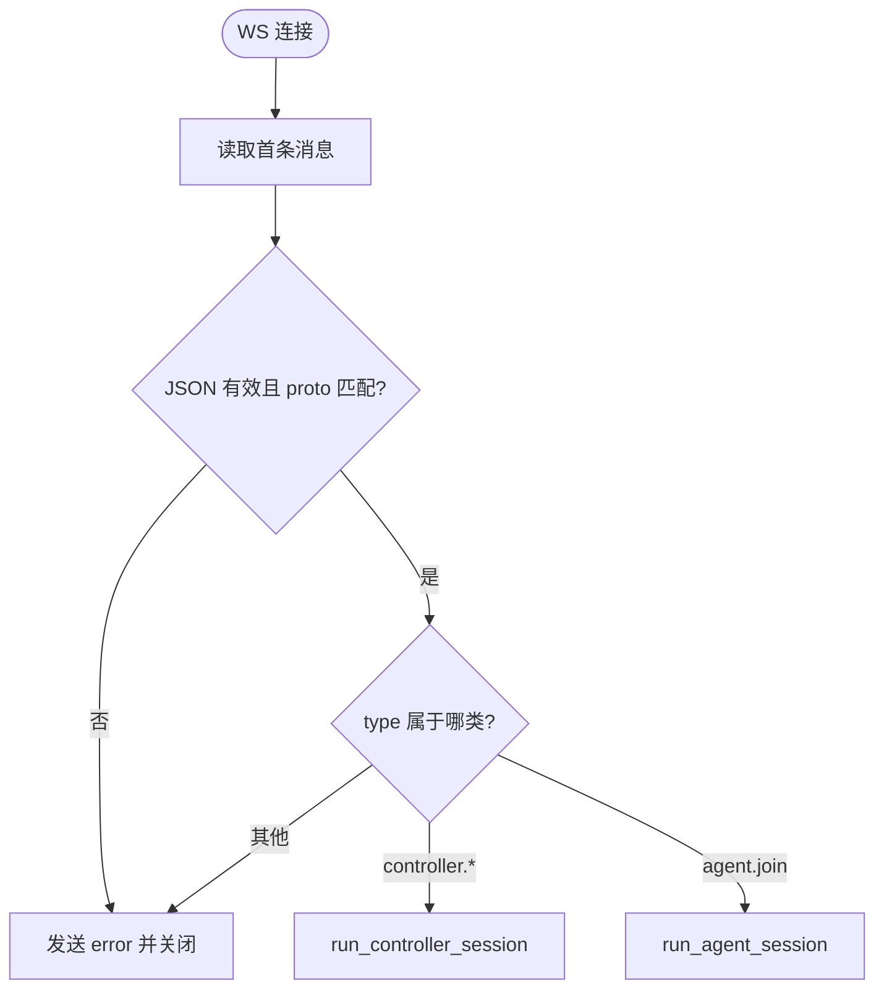
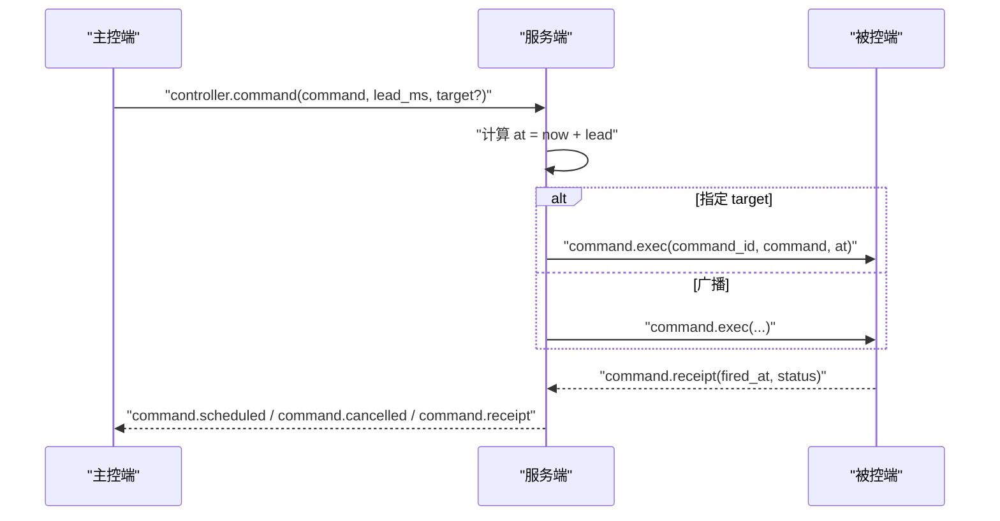
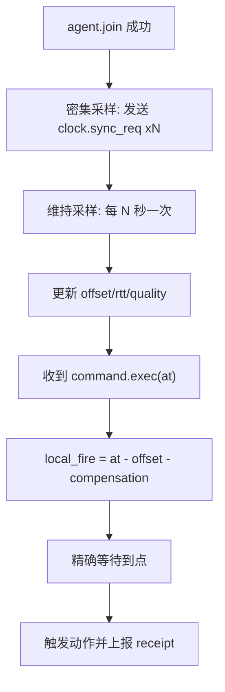
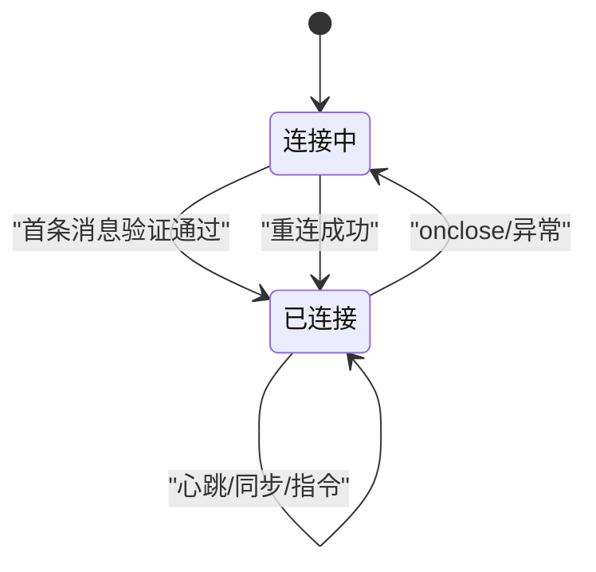
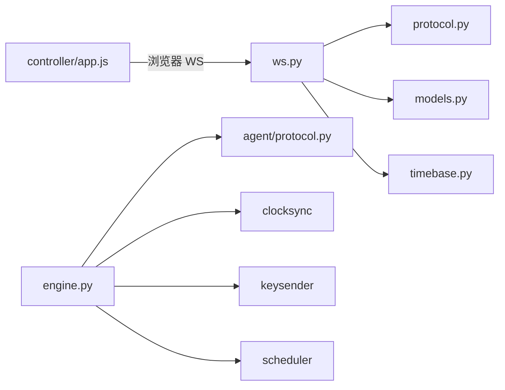

# WebSocket 通信协议

<cite>
**本文引用的文件**
- [server/server/protocol.py](file://server/server/protocol.py)
- [server/server/ws.py](file://server/server/ws.py)
- [server/server/models.py](file://server/server/models.py)
- [agent/agent/protocol.py](file://agent/agent/protocol.py)
- [agent/agent/engine.py](file://agent/agent/engine.py)
- [controller/app.js](file://controller/app.js)
- [README.md](file://README.md)
</cite>

## 目录
1. [简介](#简介)
2. [项目结构](#项目结构)
3. [核心组件](#核心组件)
4. [架构总览](#架构总览)
5. [详细组件分析](#详细组件分析)
6. [依赖关系分析](#依赖关系分析)
7. [性能与精度特性](#性能与精度特性)
8. [故障排查指南](#故障排查指南)
9. [结论](#结论)
10. [附录：消息类型与字段规范](#附录消息类型与字段规范)

## 简介
本文件为 ScriptCue 的 WebSocket 通信协议文档，覆盖连接建立、消息路由、事件分发、版本管理与向后兼容、所有消息类型定义与格式、连接管理（含断线重连与会话保持）、序列化/反序列化实现细节与错误处理策略，以及客户端集成与调试技巧。系统通过“时钟对齐 + 绝对时刻调度”在多设备间实现高精度同步起播。

## 项目结构
- 服务端：FastAPI + WebSocket，负责房间管理、指令广播、状态汇聚、审计日志与授时基准。
- 主控端：原生 HTML/JS 网页，用于创建/加入房间、下发指令、查看回执与设备状态。
- 被控端：Python 程序，持续与服务端进行类 NTP 时钟同步，按绝对时刻触发本地动作并上报回执。

图表来源
- [server/server/ws.py:1-360](file://server/server/ws.py#L1-L360)
- [server/server/models.py:1-157](file://server/server/models.py#L1-L157)
- [server/server/protocol.py:1-80](file://server/server/protocol.py#L1-L80)
- [agent/agent/engine.py:1-388](file://agent/agent/engine.py#L1-L388)
- [agent/agent/protocol.py:1-80](file://agent/agent/protocol.py#L1-L80)
- [controller/app.js:1-522](file://controller/app.js#L1-L522)

章节来源
- [README.md:1-86](file://README.md#L1-L86)

## 核心组件
- 协议常量与限制：集中定义消息类型、指令类型、错误码、房间限制、心跳参数等，服务端权威维护，被控端持有等价副本。
- WebSocket 会话：统一入口 /ws，首条消息声明角色（主控或设备），后续按类型路由到对应处理器。
- 房间与会话模型：内存存储房间、设备会话、待执行指令集合；支持空闲销毁、令牌恢复、广播与通知。
- 主控端：创建/加入/恢复房间，发送指令与取消，展示倒计时与回执汇总。
- 被控端：加入房间、密集/维持性时钟同步、心跳上报、绝对时刻调度、触发回执。

章节来源
- [server/server/protocol.py:1-80](file://server/server/protocol.py#L1-L80)
- [server/server/ws.py:1-360](file://server/server/ws.py#L1-L360)
- [server/server/models.py:1-157](file://server/server/models.py#L1-L157)
- [agent/agent/engine.py:1-388](file://agent/agent/engine.py#L1-L388)
- [controller/app.js:1-522](file://controller/app.js#L1-L522)

## 架构总览
- 连接建立：客户端通过 WebSocket 连接 /ws，首条消息必须包含 proto 与 type。
- 角色路由：
  - 主控端：controller.create/join/resume
  - 被控端：agent.join
- 消息分发：服务器根据消息 type 分派到具体处理器，完成指令调度、状态汇聚、补偿值更新等。
- 时钟同步：被控端周期性发送 clock.sync_req，服务端立即返回 clock.sync_res；被控端据此估算偏移与 RTT。
- 指令执行：服务器将指令以绝对时刻 at 下发给在线设备；设备在本地精确等待后触发并上报回执。

图表来源
- [server/server/ws.py:154-360](file://server/server/ws.py#L154-L360)
- [agent/agent/engine.py:159-193](file://agent/agent/engine.py#L159-L193)
- [agent/agent/engine.py:268-379](file://agent/agent/engine.py#L268-L379)
- [controller/app.js:50-134](file://controller/app.js#L50-L134)

## 详细组件分析

### 连接建立与角色路由
- 统一入口 handle_ws：接受连接，等待首条消息（超时保护），校验 JSON 与 proto 版本，再按 type 路由至主控或被控会话。
- 主控端会话 run_controller_session：
  - 支持 create/join/resume 三种进入方式；resume 使用 token 恢复会话。
  - 新连接会顶替旧主控连接。
  - 接收指令、取消、设置补偿值等操作。
- 被控端会话 run_agent_session：
  - 支持自动重建房间（auto_create）以应对服务端重启。
  - 支持凭 token 恢复会话。
  - 处理心跳、时钟同步、补偿值设置、回执上报。

图表来源
- [server/server/ws.py:334-360](file://server/server/ws.py#L334-L360)
- [server/server/ws.py:154-208](file://server/server/ws.py#L154-L208)
- [server/server/ws.py:246-328](file://server/server/ws.py#L246-L328)

章节来源
- [server/server/ws.py:1-360](file://server/server/ws.py#L1-L360)

### 指令调度与回执闭环
- 主控端发送 controller.command，携带 command、lead_ms、可选 target。
- 服务器计算 at = now_ms() + lead_ms，记录 pending_commands，向目标或全体在线设备广播 command.exec。
- 设备在 at 时刻触发后上报 command.receipt，包含 fired_at 与 status。
- 服务器汇总回执并推送给主控端；同时清理过期 pending 记录。

图表来源
- [server/server/ws.py:67-115](file://server/server/ws.py#L67-L115)
- [server/server/ws.py:228-244](file://server/server/ws.py#L228-L244)
- [controller/app.js:316-330](file://controller/app.js#L316-L330)

章节来源
- [server/server/ws.py:67-115](file://server/server/ws.py#L67-L115)
- [server/server/ws.py:228-244](file://server/server/ws.py#L228-L244)
- [controller/app.js:316-330](file://controller/app.js#L316-L330)

### 时钟同步与精度保障
- 被控端加入房间后立即密集采样（DENSE_SYNC_SAMPLES 次，间隔 DENSE_SYNC_INTERVAL_MS），随后周期性维持采样（MAINTAIN_SYNC_INTERVAL_S）。
- 每次请求 clock.sync_req，服务端立即返回 clock.sync_res（包含 t0、ts），被控端据此估算 offset 与 rtt，并上报质量等级。
- 设备侧在 at 时刻前进行粗睡眠 + 末段自旋等待，保证触发精度；若未同步则直接回报错误。

图表来源
- [agent/agent/engine.py:198-212](file://agent/agent/engine.py#L198-L212)
- [agent/agent/engine.py:268-292](file://agent/agent/engine.py#L268-L292)
- [agent/agent/engine.py:297-379](file://agent/agent/engine.py#L297-L379)
- [server/server/ws.py:299-303](file://server/server/ws.py#L299-L303)

章节来源
- [agent/agent/engine.py:198-212](file://agent/agent/engine.py#L198-L212)
- [agent/agent/engine.py:268-292](file://agent/agent/engine.py#L268-L292)
- [agent/agent/engine.py:297-379](file://agent/agent/engine.py#L297-L379)
- [server/server/ws.py:299-303](file://server/server/ws.py#L299-L303)

### 连接管理、断线重连与会话保持
- 主控端：
  - onclose 时指数退避重连，使用 controller.resume + token 恢复会话；token 失效则提示重新加入。
  - 离开房间时主动断开并清理状态。
- 被控端：
  - 主循环 run 中捕获异常，按 RECONNECT_BACKOFF_S 序列退避重连，上限 RECONNECT_BACKOFF_MAX_S。
  - 首次失败后标记 _auto_create，下次重连尝试重建房间。
  - 心跳与同步任务在连接生命周期内运行，断开后取消。
- 服务端：
  - 首条消息超时保护（FIRST_MESSAGE_TIMEOUT_S）。
  - 旧连接顶替新连接（主控与被控均支持）。
  - 房间空闲 TTL 自动销毁。

图表来源
- [controller/app.js:50-81](file://controller/app.js#L50-L81)
- [agent/agent/engine.py:106-128](file://agent/agent/engine.py#L106-L128)
- [server/server/ws.py:334-360](file://server/server/ws.py#L334-L360)
- [server/server/models.py:148-157](file://server/server/models.py#L148-L157)

章节来源
- [controller/app.js:50-81](file://controller/app.js#L50-L81)
- [agent/agent/engine.py:106-128](file://agent/agent/engine.py#L106-L128)
- [server/server/ws.py:334-360](file://server/server/ws.py#L334-L360)
- [server/server/models.py:148-157](file://server/server/models.py#L148-L157)

### 消息序列化/反序列化与错误处理
- 序列化：所有消息均为 JSON 文本；主控端与被控端分别使用 JSON.stringify 与 json.dumps。
- 反序列化：
  - 服务端：_recv_json 对每条消息解析，非法则返回 ERR_BAD_MESSAGE 并保持连接。
  - 被控端：引擎层 try/catch 忽略无法解析的消息，避免中断主循环。
- 错误处理：
  - 统一 error 消息类型，包含 code 与 message。
  - 常见错误码：bad_proto、room_not_found、bad_password、room_full、not_controller、bad_command、no_such_agent、bad_message。
  - 服务端对未知消息类型返回 bad_message；对无效字段进行范围校验（如 lead_ms、compensation_ms）。

章节来源
- [server/server/ws.py:29-60](file://server/server/ws.py#L29-L60)
- [server/server/ws.py:67-76](file://server/server/ws.py#L67-L76)
- [server/server/ws.py:137-151](file://server/server/ws.py#L137-L151)
- [server/server/ws.py:305-319](file://server/server/ws.py#L305-L319)
- [agent/agent/engine.py:142-147](file://agent/agent/engine.py#L142-L147)
- [agent/agent/engine.py:289-291](file://agent/agent/engine.py#L289-L291)

### 版本管理与向后兼容
- 协议版本 PROTO_VERSION 由服务端权威定义，被控端维护等价副本；修改协议需同步更新两端并递增版本号。
- 连接建立时校验 proto，不匹配则返回 bad_proto 并拒绝连接。
- 控制器与设备端各自维护常量副本，确保消息类型与限制一致。

章节来源
- [server/server/protocol.py:1-10](file://server/server/protocol.py#L1-L10)
- [agent/agent/protocol.py:1-8](file://agent/agent/protocol.py#L1-L8)
- [server/server/ws.py:349-351](file://server/server/ws.py#L349-L351)

## 依赖关系分析
- 模块耦合：
  - ws.py 依赖 protocol.py（常量）、models.py（房间与会话）、timebase.py（时间）。
  - engine.py 依赖 agent/protocol.py、clocksync、keysender、scheduler、timeutil。
  - controller/app.js 仅依赖浏览器 WebSocket API，无外部库。
- 外部依赖：
  - 服务端：FastAPI、Starlette、websockets（被控端使用 websockets 库）。
  - 被控端：websockets、线程与 asyncio 混合模型。

图表来源
- [server/server/ws.py:1-20](file://server/server/ws.py#L1-L20)
- [agent/agent/engine.py:12-24](file://agent/agent/engine.py#L12-L24)
- [controller/app.js:1-10](file://controller/app.js#L1-L10)

章节来源
- [server/server/ws.py:1-20](file://server/server/ws.py#L1-L20)
- [agent/agent/engine.py:12-24](file://agent/agent/engine.py#L12-L24)
- [controller/app.js:1-10](file://controller/app.js#L1-L10)

## 性能与精度特性
- 同步精度：通过密集采样与维持性采样估计偏移，结合绝对时刻调度与末段自旋等待，达到毫秒级精度。
- 提前量（lead_ms）：默认 3000ms，可配置并在合理范围内裁剪（LEAD_MIN/LEAD_MAX）。
- 心跳与离线判定：HEARTBEAT_INTERVAL_S 为 5s，连续 3 次无响应视为离线（AGENT_OFFLINE_S=15s）。
- 回执窗口：RECEIPT_TIMEOUT_MS 为 8000ms，超时后清理 pending 记录。
- 节流：AGENT_PUSH_THROTTLE_S 控制状态推送频率，避免频繁刷新。

章节来源
- [server/server/protocol.py:51-80](file://server/server/protocol.py#L51-L80)
- [server/server/ws.py:22-26](file://server/server/ws.py#L22-L26)
- [agent/agent/engine.py:27-28](file://agent/agent/engine.py#L27-L28)
- [agent/agent/engine.py:235-241](file://agent/agent/engine.py#L235-L241)

## 故障排查指南
- 连接阶段
  - 首条消息非 JSON 或 proto 不匹配：检查客户端发送的首条消息结构与版本。
  - 房间不存在或口令错误：确认 room_code 与 password，必要时启用 auto_create。
- 指令阶段
  - 未知指令或无效 lead_ms：检查 command 是否在允许列表，lead_ms 是否在允许范围。
  - 目标设备不存在：target 对应的 session_id 是否在线。
- 回执阶段
  - 未收到回执：检查设备是否在线、时钟是否同步、网络延迟是否超过提前量。
  - 偏差过大：关注 delta_ms，超出阈值需调整补偿值或优化网络。
- 重连与恢复
  - 主控端：onclose 后指数退避重连，token 失效需重新加入。
  - 被控端：异常后按退避序列重连，必要时启用 auto_create 重建房间。

章节来源
- [server/server/ws.py:37-60](file://server/server/ws.py#L37-L60)
- [server/server/ws.py:67-85](file://server/server/ws.py#L67-L85)
- [server/server/ws.py:117-134](file://server/server/ws.py#L117-L134)
- [controller/app.js:136-144](file://controller/app.js#L136-L144)
- [agent/agent/engine.py:175-183](file://agent/agent/engine.py#L175-L183)

## 结论
ScriptCue 的 WebSocket 协议以版本化 JSON 文本为基础，通过统一入口与角色路由实现主控端与被控端的协同工作。借助时钟同步与绝对时刻调度，系统在公网环境下实现高精度同步。完善的错误处理、重连机制与房间生命周期管理保障了系统的健壮性与可用性。

## 附录：消息类型与字段规范

### 消息类型总览
- 主控端 → 服务器
  - controller.create：创建房间
  - controller.join：加入房间
  - controller.resume：恢复会话
  - controller.command：下发指令
  - controller.cancel：取消指令
  - controller.set_comp：设置设备补偿值
- 服务器 → 主控端
  - controller.joined：加入成功
  - command.scheduled：指令已调度
  - command.cancelled：指令已取消
  - agent.updated：设备状态更新
  - agent.left：设备离开
  - error：错误
- 被控端 → 服务器
  - agent.join：加入房间
  - agent.heartbeat：心跳与状态上报
  - agent.set_comp：设备上报补偿值变更
  - clock.sync_req：时钟同步请求
  - command.receipt：指令回执
- 服务器 → 被控端
  - agent.joined：加入成功
  - clock.sync_res：时钟同步响应
  - command.exec：指令执行
  - command.cancel：指令取消
  - comp.update：补偿值更新

### 关键字段说明
- 通用
  - type：消息类型字符串
  - proto：协议版本号（首条消息必填）
  - error：{code, message}
- 房间与会话
  - room_code：房间码（6位，特定字母表）
  - password：房间口令（可选）
  - token：会话令牌（用于 resume 或设备恢复）
  - nickname：设备昵称
- 指令
  - command：play/pause/test
  - command_id：唯一标识
  - lead_ms：提前量（毫秒）
  - target：目标设备 session_id（可选）
  - at：绝对执行时刻（毫秒时间戳）
- 时钟同步
  - id：请求 ID（回显）
  - t0：请求发出时间
  - ts：服务端接收时间
  - clock_quality：excellent/good/poor/none
  - clock_offset_ms：偏移（毫秒）
  - clock_rtt_ms：往返时延（毫秒）
- 回执
  - fired_at：实际触发时刻（服务器时间）
  - status：ok/error/skipped
  - detail：错误详情（可选）
- 设备状态
  - session_id：设备会话 ID
  - online：是否在线
  - ready：是否就绪
  - compensation_ms：补偿值（毫秒）
  - last_seen：最后活跃时间

章节来源
- [server/server/protocol.py:11-80](file://server/server/protocol.py#L11-L80)
- [agent/agent/protocol.py:9-80](file://agent/agent/protocol.py#L9-L80)
- [server/server/models.py:17-62](file://server/server/models.py#L17-L62)
- [server/server/ws.py:67-151](file://server/server/ws.py#L67-L151)
- [server/server/ws.py:214-328](file://server/server/ws.py#L214-L328)
- [agent/agent/engine.py:217-241](file://agent/agent/engine.py#L217-L241)
- [agent/agent/engine.py:297-379](file://agent/agent/engine.py#L297-L379)
- [controller/app.js:83-134](file://controller/app.js#L83-L134)