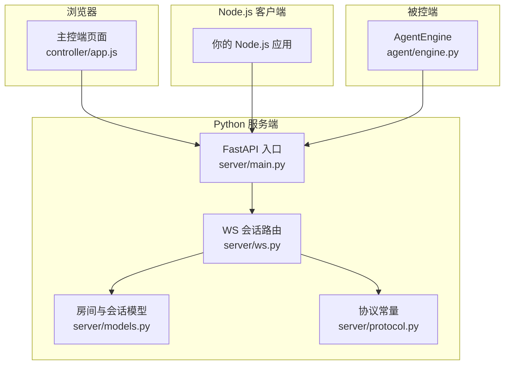
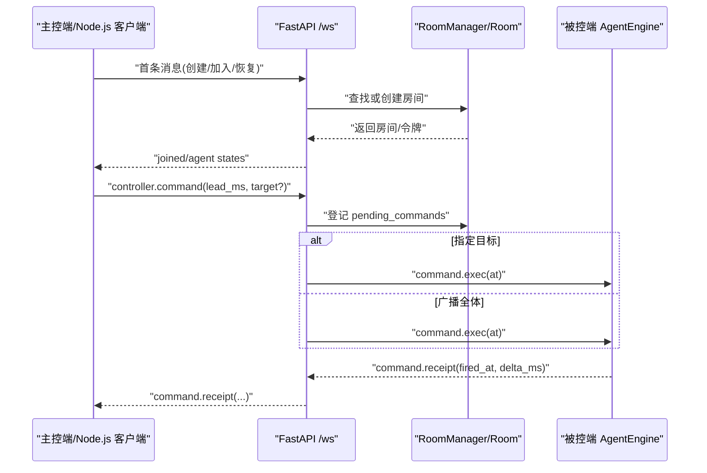
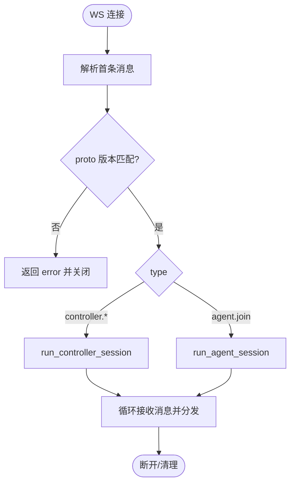
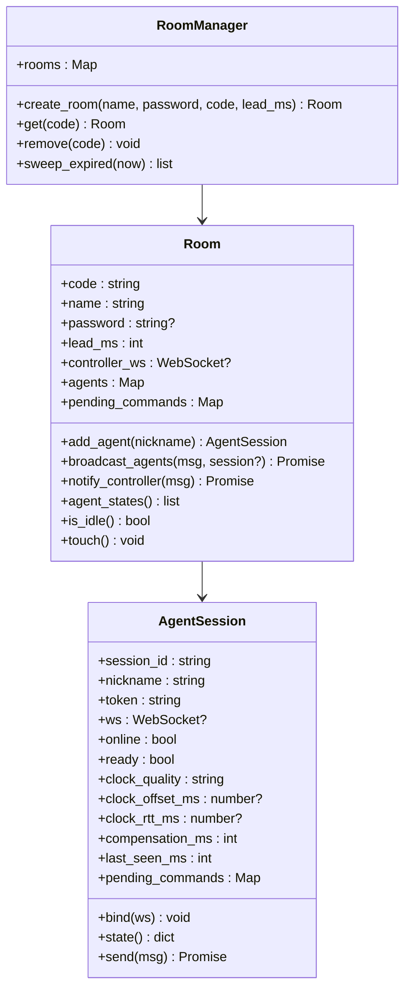
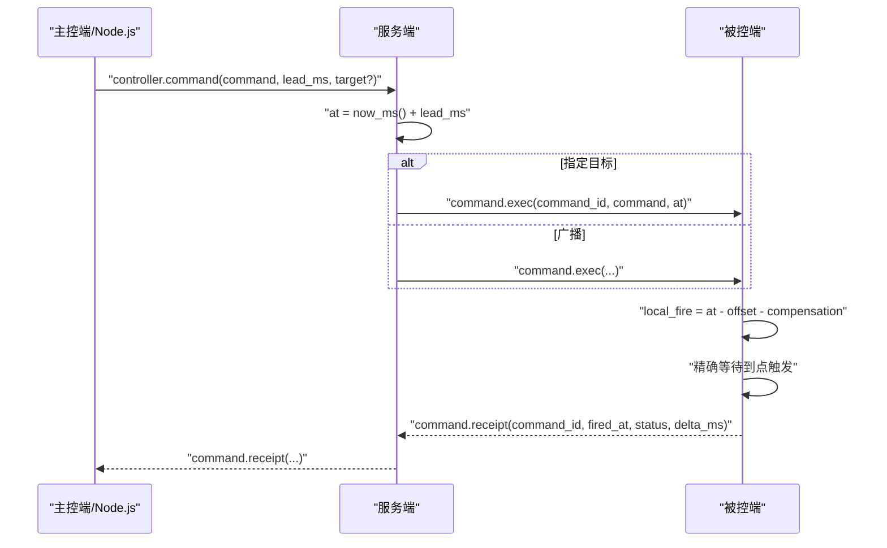
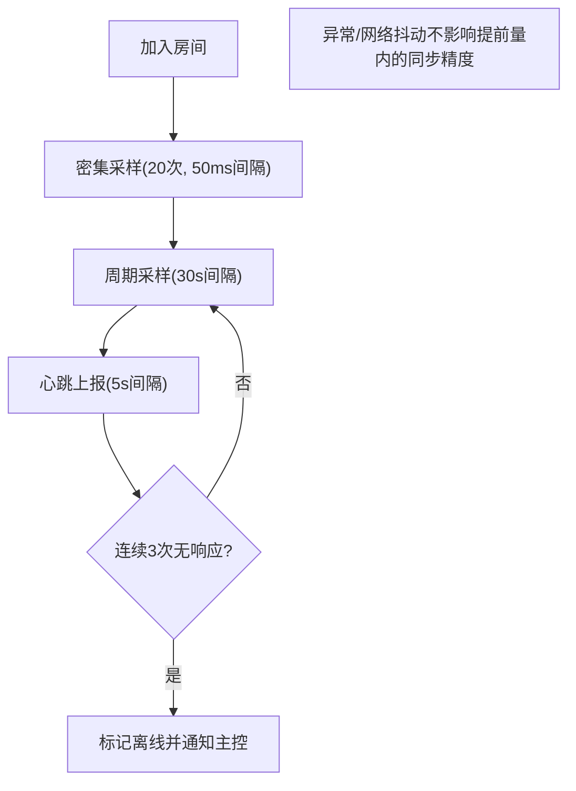
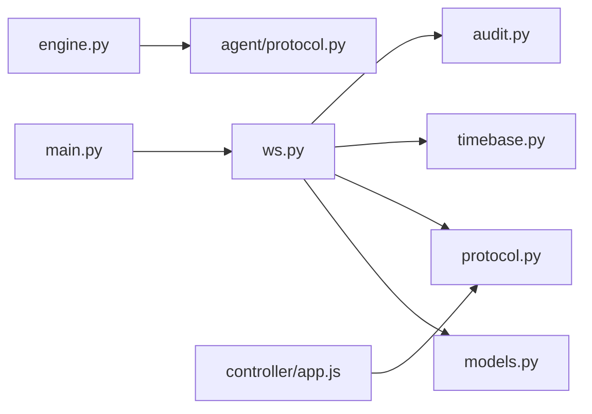
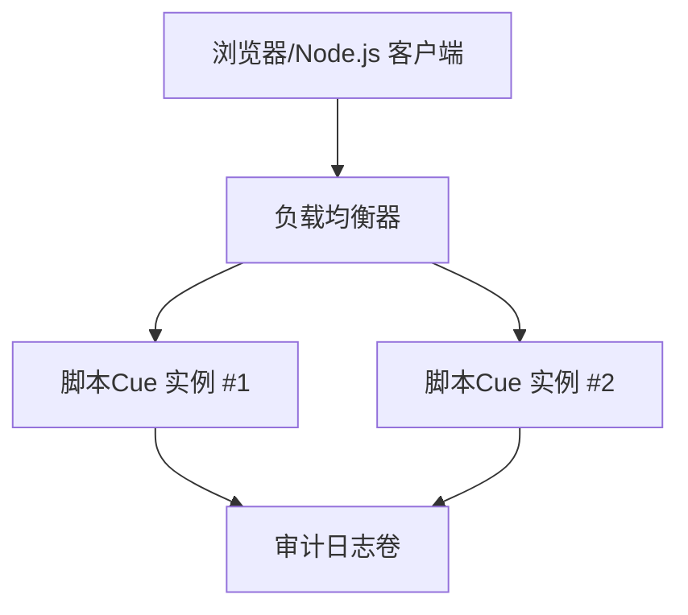

# Node.js 服务端集成

<cite>
**本文引用的文件**
- [README.md](file://README.md)
- [server/server/main.py](file://server/server/main.py)
- [server/server/ws.py](file://server/server/ws.py)
- [server/server/protocol.py](file://server/server/protocol.py)
- [server/server/models.py](file://server/server/models.py)
- [agent/agent/engine.py](file://agent/agent/engine.py)
- [agent/agent/protocol.py](file://agent/agent/protocol.py)
- [controller/app.js](file://controller/app.js)
- [docker-compose.yml](file://docker-compose.yml)
</cite>

## 目录
1. [简介](#简介)
2. [项目结构](#项目结构)
3. [核心组件](#核心组件)
4. [架构总览](#架构总览)
5. [详细组件分析](#详细组件分析)
6. [依赖关系分析](#依赖关系分析)
7. [性能与内存管理](#性能与内存管理)
8. [生产部署与高可用](#生产部署与高可用)
9. [测试与调试指南](#测试与调试指南)
10. [结论](#结论)

## 简介
本指南面向在 Node.js 环境中集成 ScriptCue WebSocket 客户端的开发者。ScriptCue 是一个多设备口述影像同步起播系统，通过“时钟对齐 + 绝对时刻调度”实现大屏与多台口述员电脑的高精度同步。本项目采用 Python FastAPI 作为服务端，提供房间管理、WebSocket 长连接、授时基准、指令广播、状态汇聚与审计日志；主控端为原生 HTML/JS 网页；被控端为 Python 程序，负责高精度定时触发与回执上报。

Node.js 客户端可复用同一套 JSON 协议，实现与 Python 服务端的互通，用于：
- 替代或扩展主控端功能（如移动端、桌面端）
- 接入第三方系统集成（如自动化编排平台）
- 构建自定义设备代理或监控面板

## 项目结构
仓库包含以下关键目录：
- server：Python 服务端（FastAPI + WebSocket），含房间模型、协议常量、WS 会话处理、时间基准与审计日志
- controller：主控端静态页面（HTML/CSS/JS），由服务端静态托管
- agent：被控端（Python），实现连接生命周期、时钟同步、精确调度与回执
- docs：文档（协议规范等）
- docker-compose.yml：容器化编排

图表来源
- [server/server/main.py:75-98](file://server/server/main.py#L75-L98)
- [server/server/ws.py:334-360](file://server/server/ws.py#L334-L360)
- [server/server/models.py:64-157](file://server/server/models.py#L64-L157)
- [server/server/protocol.py:1-80](file://server/server/protocol.py#L1-L80)
- [agent/agent/engine.py:106-157](file://agent/agent/engine.py#L106-L157)

章节来源
- [README.md:7-20](file://README.md#L7-L20)
- [server/server/main.py:1-98](file://server/server/main.py#L1-L98)

## 核心组件
- 协议层：统一的 JSON 消息类型、错误码、限制常量，定义于服务端与被控端各自副本，确保版本一致
- 会话层：ws.py 统一处理主控端与被控端的首条消息识别、鉴权、房间绑定与消息分发
- 房间模型：models.py 维护房间、设备会话、待执行指令、在线状态、空闲回收
- 时间基准：now_ms() 提供服务器毫秒时间戳，用于指令提前量与到期判定
- 审计日志：记录关键事件（加入/离开、指令下发/取消、离线、过期等）

章节来源
- [server/server/protocol.py:1-80](file://server/server/protocol.py#L1-L80)
- [server/server/ws.py:1-360](file://server/server/ws.py#L1-L360)
- [server/server/models.py:1-157](file://server/server/models.py#L1-L157)
- [server/server/main.py:1-98](file://server/server/main.py#L1-L98)

## 架构总览
下图展示了主控端、Node.js 客户端、被控端与服务端之间的交互流程，包括连接建立、房间加入、指令调度与回执闭环。

图表来源
- [server/server/ws.py:67-134](file://server/server/ws.py#L67-L134)
- [server/server/ws.py:246-327](file://server/server/ws.py#L246-L327)
- [agent/agent/engine.py:268-388](file://agent/agent/engine.py#L268-L388)

## 详细组件分析

### WebSocket 会话与消息路由
- 首条消息必须携带 proto 版本号，不匹配则拒绝
- 根据 type 区分主控端与会话：
  - 主控端：create/join/resume，进入 run_controller_session
  - 被控端：join，进入 run_agent_session
- 心跳超时将标记设备离线并通知主控端
- 空闲房间超过阈值将被销毁

图表来源
- [server/server/ws.py:334-360](file://server/server/ws.py#L334-L360)
- [server/server/ws.py:154-208](file://server/server/ws.py#L154-L208)
- [server/server/ws.py:246-327](file://server/server/ws.py#L246-L327)

章节来源
- [server/server/ws.py:1-360](file://server/server/ws.py#L1-L360)

### 房间管理与设备会话
- RoomManager 维护 rooms 字典，支持创建、查询、删除与过期清理
- Room 维护控制器连接、设备列表、待执行指令集合
- AgentSession 保存会话令牌、在线状态、时钟质量、补偿值、最近可见时间、待执行指令映射
- 房间容量上限与空闲 TTL 由协议常量控制

图表来源
- [server/server/models.py:17-157](file://server/server/models.py#L17-L157)

章节来源
- [server/server/models.py:1-157](file://server/server/models.py#L1-L157)

### 指令调度与回执闭环
- 主控端发送 controller.command，服务端计算 at = now_ms() + lead_ms，登记 pending_commands
- 若指定 target，仅向该设备发送 command.exec；否则广播给所有在线设备
- 被控端收到 command.exec 后，基于本地时钟偏移与补偿值计算 local_fire，精确等待到点触发
- 触发完成后上报 command.receipt，包含 fired_at 与 delta_ms，服务端汇总并推送给主控端
- 指令到期后超过回执窗口，清理 pending 记录

图表来源
- [server/server/ws.py:67-134](file://server/server/ws.py#L67-L134)
- [server/server/ws.py:228-244](file://server/server/ws.py#L228-L244)
- [agent/agent/engine.py:297-388](file://agent/agent/engine.py#L297-L388)

章节来源
- [server/server/ws.py:67-134](file://server/server/ws.py#L67-L134)
- [agent/agent/engine.py:268-388](file://agent/agent/engine.py#L268-L388)

### 时钟同步与重连机制
- 被控端加入房间后密集采样多次，随后周期性维持采样，估算时钟偏移与 RTT
- 心跳每 5 秒上报一次，包含就绪状态、时钟质量、偏移、RTT、当前待执行指令
- 断线后指数退避重连，最大间隔 10 秒；服务器重启后支持自动重建房间
- 主控端也具备断线重连逻辑，使用 resume 恢复会话

图表来源
- [agent/agent/engine.py:198-241](file://agent/agent/engine.py#L198-L241)
- [server/server/main.py:40-61](file://server/server/main.py#L40-L61)
- [agent/agent/protocol.py:68-80](file://agent/agent/protocol.py#L68-L80)

章节来源
- [agent/agent/engine.py:106-241](file://agent/agent/engine.py#L106-L241)
- [server/server/main.py:40-61](file://server/server/main.py#L40-L61)
- [agent/agent/protocol.py:68-80](file://agent/agent/protocol.py#L68-L80)

### 主控端与 Node.js 客户端对照
- 主控端使用原生 WebSocket，遵循相同协议；Node.js 客户端可完全复用其消息结构与状态机
- 关键状态：连接、加入房间、活跃指令、回执收集、倒计时、重连退避
- 建议 Node.js 客户端实现与主控端一致的 join/resume 流程与错误处理

章节来源
- [controller/app.js:50-144](file://controller/app.js#L50-L144)
- [controller/app.js:316-389](file://controller/app.js#L316-L389)

## 依赖关系分析
- ws.py 依赖 protocol 常量、models 房间模型、timebase 时间函数、audit 审计日志
- main.py 初始化 RoomManager、AuditLog，启动后台任务（离线扫描、空闲房间清理）
- engine.py 依赖 websockets、clocksync、keysender、scheduler、timeutil，实现连接与调度
- controller/app.js 直接操作 WebSocket，遵循协议消息类型

图表来源
- [server/server/main.py:12-27](file://server/server/main.py#L12-L27)
- [server/server/ws.py:6-18](file://server/server/ws.py#L6-L18)
- [agent/agent/engine.py:12-23](file://agent/agent/engine.py#L12-L23)

章节来源
- [server/server/main.py:12-27](file://server/server/main.py#L12-L27)
- [server/server/ws.py:6-18](file://server/server/ws.py#L6-L18)
- [agent/agent/engine.py:12-23](file://agent/agent/engine.py#L12-L23)

## 性能与内存管理
- 房间数据纯内存存储，重启后由客户端凭 token/auto_create 恢复，避免持久化开销
- 指令 pending 集合在到期与回执窗口后清理，防止内存泄漏
- 心跳与状态推送节流，减少不必要的数据传输
- 被控端使用线程进行精确等待与触发，避免阻塞事件循环
- 建议 Node.js 客户端：
  - 使用事件驱动模式，避免阻塞 I/O
  - 对回执与状态更新做去抖与合并，降低 UI 渲染压力
  - 合理设置重连退避，避免雪崩
  - 对大对象（如批量回执）进行分页或增量更新

[本节为通用指导，不直接分析具体文件]

## 生产部署与高可用
- 使用 Docker 部署服务端，暴露 8000 端口，挂载审计日志卷
- 可通过反向代理（Nginx/Traefik）实现负载均衡与 TLS 终止
- 多实例部署时，房间数据为内存态，需结合外部状态共享（如 Redis）或采用单实例+水平扩展前端
- 健康检查：/healthz 返回协议版本、服务器时间、房间数量
- 环境变量：SC_DATA_DIR、SC_CONTROLLER_DIR、SC_DEFAULT_LEAD_MS、SC_LOG_LEVEL

图表来源
- [docker-compose.yml:1-15](file://docker-compose.yml#L1-L15)
- [server/server/main.py:78-85](file://server/server/main.py#L78-L85)

章节来源
- [docker-compose.yml:1-15](file://docker-compose.yml#L1-L15)
- [server/server/main.py:78-85](file://server/server/main.py#L78-L85)

## 测试与调试指南
- 使用主控端页面验证端到端链路：创建/加入房间、下发指令、查看回执与偏差
- 使用命令行版被控端快速联调核心链路
- 服务端日志级别可通过 SC_LOG_LEVEL 调整
- 健康检查接口 /healthz 可用于探针与告警
- 常见问题定位：
  - 协议版本不匹配：检查两端 PROTO_VERSION
  - 房间不存在：确认 room_code 与密码，必要时启用 auto_create
  - 指令未回执：检查设备是否在线、时钟是否同步、补偿值是否合理
  - 重连风暴：检查客户端重连退避策略与服务器负载

章节来源
- [README.md:34-79](file://README.md#L34-L79)
- [server/server/main.py:28-30](file://server/server/main.py#L28-L30)
- [server/server/ws.py:334-360](file://server/server/ws.py#L334-L360)

## 结论
本指南基于现有代码库梳理了 ScriptCue 的通信协议、房间管理、指令调度与回执闭环，为 Node.js 环境下的 WebSocket 客户端集成提供了清晰的参考路径。Node.js 客户端可复用主控端的消息结构与状态机，实现与 Python 服务端的无缝对接。在生产环境中，建议结合反向代理、健康检查与合理的重连策略，确保高可用与稳定性。