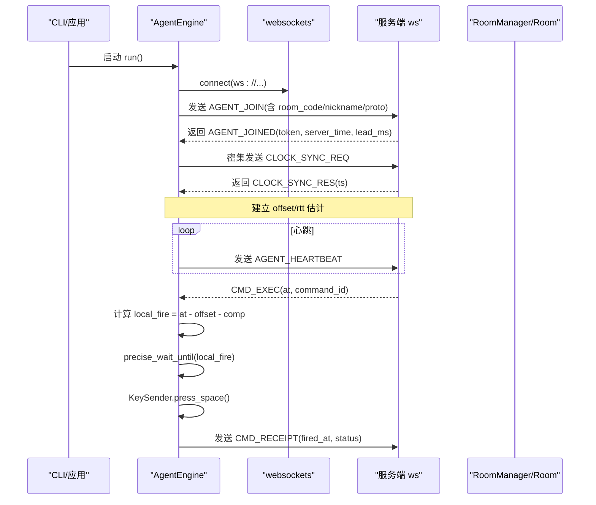
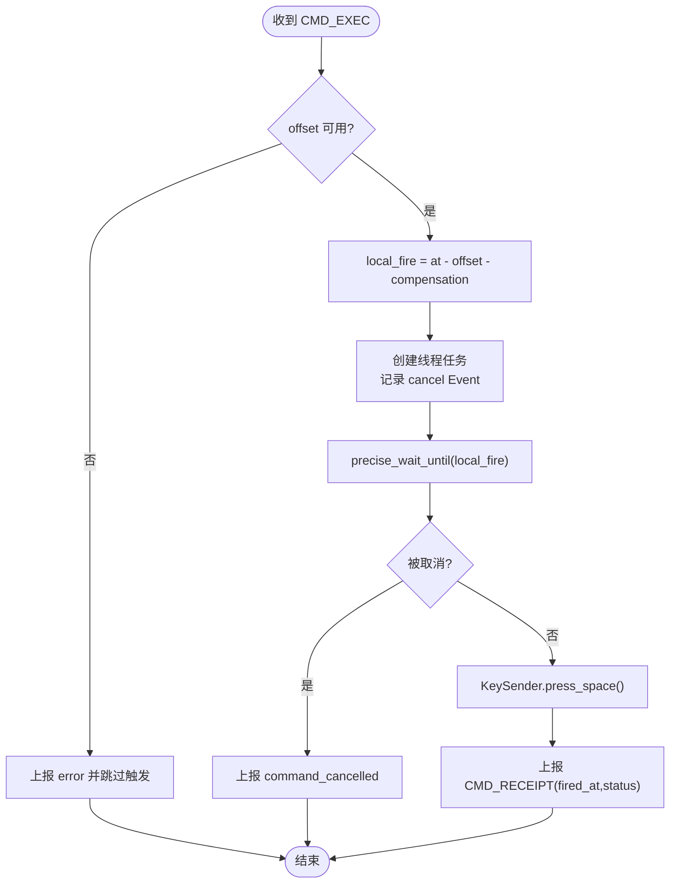
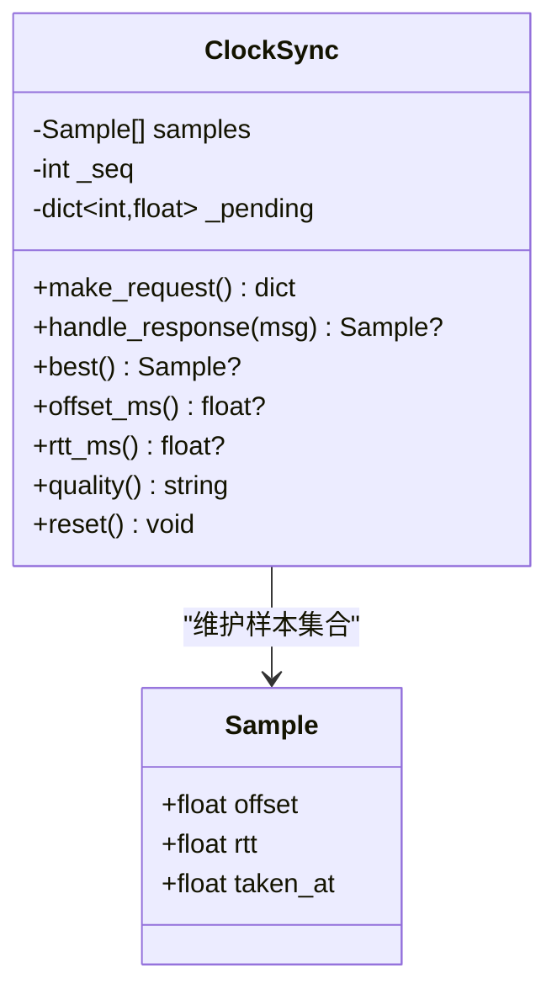
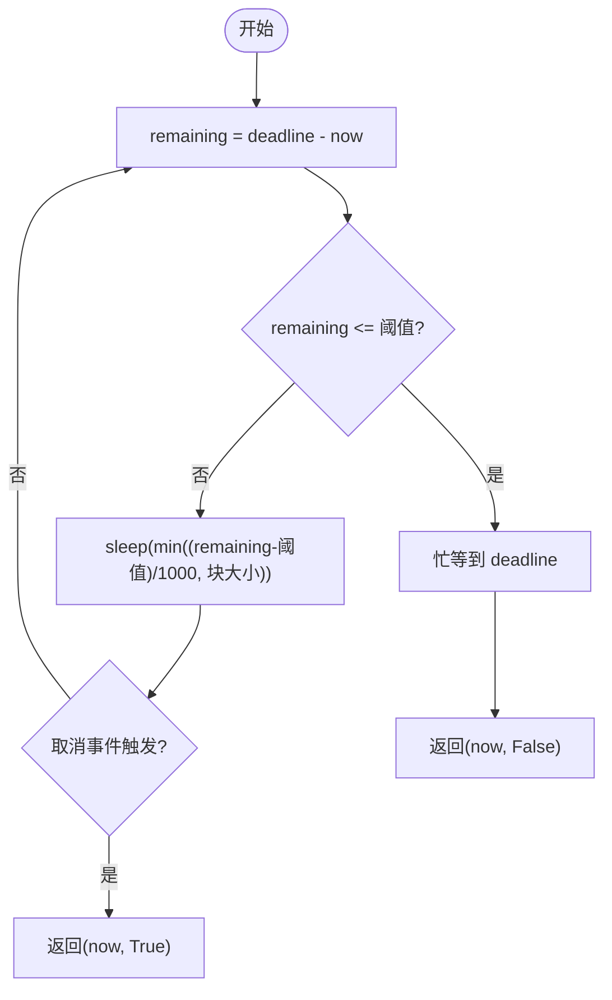
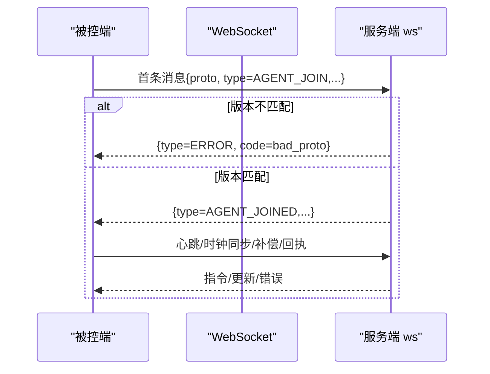
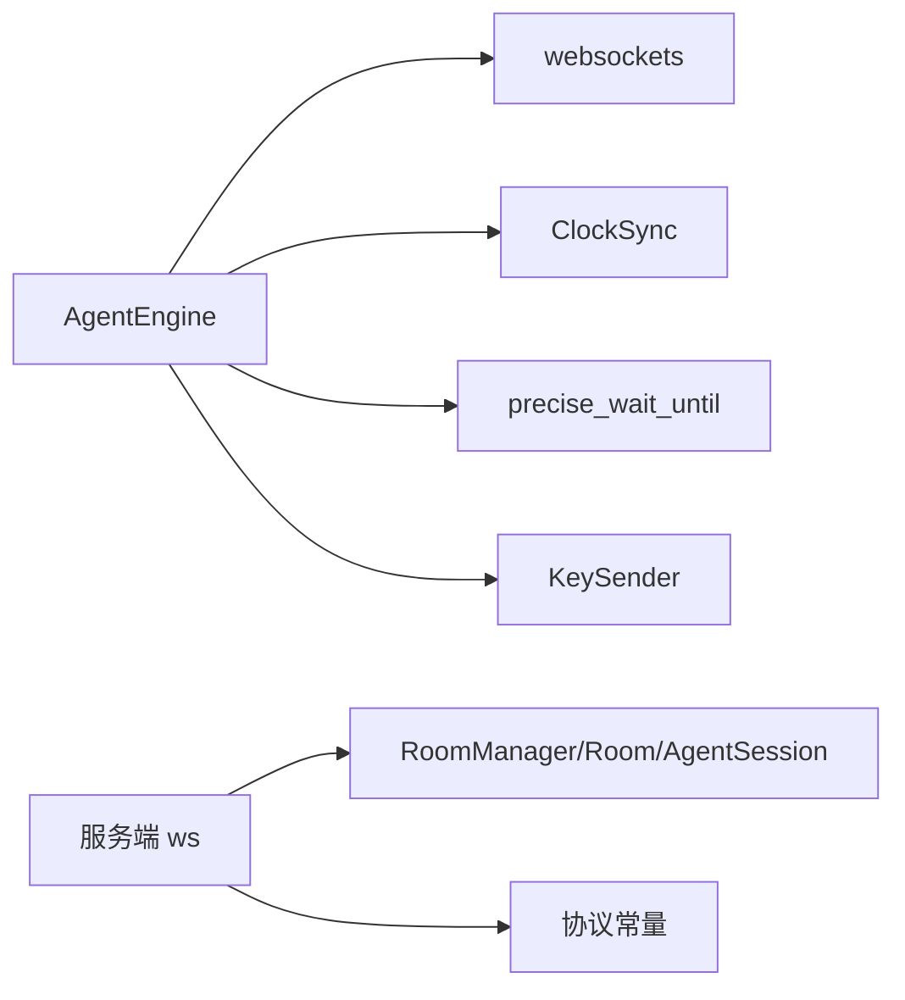

# Python 客户端集成

<cite>
**本文引用的文件**
- [agent/agent/engine.py](file://agent/agent/engine.py)
- [agent/agent/protocol.py](file://agent/agent/protocol.py)
- [agent/agent/clocksync.py](file://agent/agent/clocksync.py)
- [agent/agent/scheduler.py](file://agent/agent/scheduler.py)
- [agent/agent/keysender.py](file://agent/agent/keysender.py)
- [agent/agent/cli.py](file://agent/agent/cli.py)
- [server/server/ws.py](file://server/server/ws.py)
- [server/server/models.py](file://server/server/models.py)
- [server/server/protocol.py](file://server/server/protocol.py)
- [server/server/main.py](file://server/server/main.py)
- [README.md](file://README.md)
</cite>

## 目录
1. [简介](#简介)
2. [项目结构](#项目结构)
3. [核心组件](#核心组件)
4. [架构总览](#架构总览)
5. [详细组件分析](#详细组件分析)
6. [依赖关系分析](#依赖关系分析)
7. [性能考虑](#性能考虑)
8. [故障排查指南](#故障排查指南)
9. [结论](#结论)
10. [附录](#附录)

## 简介
本指南面向在 Python 环境中集成 ScriptCue 被控端（Agent）的开发者，提供基于 websockets 库的完整实现要点与最佳实践。内容覆盖：
- 异步连接管理与重连策略
- 消息序列化/反序列化与协议兼容性（版本协商、消息格式、错误处理）
- 被控端时钟同步、精确调度与键盘输入模拟
- 多线程模型、协程使用与资源管理
- 跨平台兼容方案（Windows/macOS）
- 测试与基准建议（单元测试、集成测试、性能基准）

## 项目结构
仓库包含服务端、主控端网页与被控端三个部分。被控端以 Python 实现，通过 WebSocket 与服务端通信，完成时钟对齐与绝对时刻触发。

```mermaid
graph TB
subgraph "被控端"
A_engine["AgentEngine<br/>连接/心跳/调度"]
A_clock["ClockSync<br/>NTP式采样"]
A_sched["precise_wait_until<br/>粗睡眠+自旋"]
A_key["KeySender<br/>空格键注入"]
A_cli["CLI 入口"]
end
subgraph "服务端"
S_main["FastAPI 入口"]
S_ws["WebSocket 会话路由"]
S_models["房间与会话模型"]
S_proto["协议常量"]
end
A_cli --> A_engine
A_engine --> A_clock
A_engine --> A_sched
A_engine --> A_key
A_engine < --> |websockets| S_ws
S_ws --> S_models
S_ws --> S_proto
S_main --> S_ws
```

图示来源
- [agent/agent/engine.py:106-158](file://agent/agent/engine.py#L106-L158)
- [server/server/main.py:75-98](file://server/server/main.py#L75-L98)
- [server/server/ws.py:334-360](file://server/server/ws.py#L334-L360)

章节来源
- [README.md:1-86](file://README.md#L1-L86)

## 核心组件
- AgentEngine：被控端同步引擎，负责连接生命周期、时钟同步、指令调度与回执上报。
- ClockSync：类 NTP 时钟同步，维护样本集并估算可信偏移与 RTT。
- precise_wait_until：高精度等待，采用“粗睡眠 + 末段自旋”策略。
- KeySender：跨平台空格键注入（Windows SendInput / macOS CGEvent）。
- 协议常量：两端共享的消息类型、错误码、限制参数等。
- 服务端 ws/models：房间与会话管理、指令广播、状态汇聚与审计。

章节来源
- [agent/agent/engine.py:31-128](file://agent/agent/engine.py#L31-L128)
- [agent/agent/clocksync.py:22-106](file://agent/agent/clocksync.py#L22-L106)
- [agent/agent/scheduler.py:20-59](file://agent/agent/scheduler.py#L20-L59)
- [agent/agent/keysender.py:99-126](file://agent/agent/keysender.py#L99-L126)
- [agent/agent/protocol.py:7-80](file://agent/agent/protocol.py#L7-L80)
- [server/server/ws.py:154-327](file://server/server/ws.py#L154-L327)
- [server/server/models.py:17-157](file://server/server/models.py#L17-L157)

## 架构总览
被控端通过 websockets 连接到服务端的 /ws 端点，首条消息声明角色为“被控端加入”，随后进行密集时钟采样与周期性维持采样；收到带绝对执行时刻的指令后，换算本地触发时间并精确到点触发按键动作，最后上报回执。



图示来源
- [agent/agent/engine.py:129-192](file://agent/agent/engine.py#L129-L192)
- [agent/agent/engine.py:198-211](file://agent/agent/engine.py#L198-L211)
- [agent/agent/engine.py:297-379](file://agent/agent/engine.py#L297-L379)
- [server/server/ws.py:246-327](file://server/server/ws.py#L246-L327)

## 详细组件分析

### AgentEngine：连接、心跳、调度与回执
- 连接与重连：run() 循环尝试连接，异常后按指数退避重试，上限固定。
- 加入房间：_join() 发送 AGENT_JOIN，接收 AGENT_JOINED，初始化 token/lead_ms/compensation，重置时钟样本。
- 时钟同步：_dense_sync() 密集采样；_maintain_sync_loop() 定时维持采样。
- 心跳：_heartbeat_loop() 周期上报 ready、clock_quality、offset/rtt、pending_command 等。
- 消息分发：_dispatch() 处理 CLOCK_SYNC_RES、CMD_EXEC、CMD_CANCEL、COMP_UPDATE、ERROR。
- 调度与触发：_schedule_fire() 将 CMD_EXEC 转为本地线程任务，调用 precise_wait_until 到点触发，并通过 KeySender 注入空格键，最终上报 CMD_RECEIPT。
- 线程安全：所有网络发送通过 _send_threadsafe 在事件循环中执行；触发在独立线程中进行，避免阻塞事件循环。



图示来源
- [agent/agent/engine.py:297-379](file://agent/agent/engine.py#L297-L379)

章节来源
- [agent/agent/engine.py:31-128](file://agent/agent/engine.py#L31-L128)
- [agent/agent/engine.py:129-192](file://agent/agent/engine.py#L129-L192)
- [agent/agent/engine.py:198-211](file://agent/agent/engine.py#L198-L211)
- [agent/agent/engine.py:217-245](file://agent/agent/engine.py#L217-L245)
- [agent/agent/engine.py:268-291](file://agent/agent/engine.py#L268-L291)
- [agent/agent/engine.py:297-379](file://agent/agent/engine.py#L297-L379)

### ClockSync：类 NTP 时钟同步
- 请求构造：make_request() 生成 id/t0，记录待应答映射。
- 应答处理：handle_response() 计算 offset=ts-(t0+t1)/2，rtt=t1-t0，加入样本集并修剪。
- 结果估算：best 取新鲜样本中 RTT 最小者；quality 根据样本数量与 RTT 分级。
- 老化机制：保留最近一定数量的最优样本，避免陈旧路径主导。



图示来源
- [agent/agent/clocksync.py:22-106](file://agent/agent/clocksync.py#L22-L106)

章节来源
- [agent/agent/clocksync.py:22-106](file://agent/agent/clocksync.py#L22-L106)

### precise_wait_until：高精度等待
- 策略：距离目标较远时 sleep（可被取消事件打断），进入最后阈值后忙等自旋逼近目标时刻。
- Windows 优化：提升系统定时器分辨率，降低 sleep 误差。
- 返回值：实际醒来时间与是否被取消。



图示来源
- [agent/agent/scheduler.py:33-59](file://agent/agent/scheduler.py#L33-L59)

章节来源
- [agent/agent/scheduler.py:20-59](file://agent/agent/scheduler.py#L20-L59)

### KeySender：跨平台键盘注入
- Windows：直接调用 SendInput 注入空格键，低延迟且无第三方依赖。
- macOS：通过 pynput 封装 CGEventPost 注入空格键；支持辅助功能权限检测与引导打开设置页。
- 自检：check() 验证注入能力，dry_run 模式用于联调演练。

章节来源
- [agent/agent/keysender.py:22-93](file://agent/agent/keysender.py#L22-L93)
- [agent/agent/keysender.py:99-126](file://agent/agent/keysender.py#L99-L126)

### 协议与服务器交互
- 版本协商：首条消息携带 proto，服务端校验 PROTO_VERSION，不匹配则返回错误。
- 消息类型：AGENT_JOIN/HEARTBEAT/CLOCK_SYNC_REQ/SET_COMP/RECEIPT；服务端回发 AGENT_JOINED/CLOCK_SYNC_RES/COMP_UPDATE/CMD_EXEC/CMD_CANCEL/ERROR。
- 错误处理：统一 ERROR 消息，包含 code 与 message；客户端需据此提示或恢复。
- 房间与会话：RoomManager/Room/AgentSession 管理成员、在线状态、待执行指令与状态推送。



图示来源
- [server/server/ws.py:334-360](file://server/server/ws.py#L334-L360)
- [server/server/ws.py:246-327](file://server/server/ws.py#L246-L327)
- [server/server/protocol.py:7-80](file://server/server/protocol.py#L7-L80)
- [agent/agent/protocol.py:7-80](file://agent/agent/protocol.py#L7-L80)

章节来源
- [server/server/ws.py:334-360](file://server/server/ws.py#L334-L360)
- [server/server/ws.py:246-327](file://server/server/ws.py#L246-L327)
- [server/server/protocol.py:7-80](file://server/server/protocol.py#L7-L80)
- [agent/agent/protocol.py:7-80](file://agent/agent/protocol.py#L7-L80)

## 依赖关系分析
- 被控端依赖 websockets>=13,<18，macOS 下可选 pynput。
- 服务端依赖 FastAPI 与 Uvicorn，提供 WebSocket 端点与静态页面托管。
- 模块内耦合：Engine 组合 ClockSync、Scheduler、KeySender；ws 层依赖 models 与 protocol。



图示来源
- [agent/requirements.txt:1-7](file://agent/requirements.txt#L1-L7)
- [server/requirements.txt:1-3](file://server/requirements.txt#L1-L3)
- [agent/agent/engine.py:12-23](file://agent/agent/engine.py#L12-L23)
- [server/server/ws.py:6-18](file://server/server/ws.py#L6-L18)

章节来源
- [agent/requirements.txt:1-7](file://agent/requirements.txt#L1-L7)
- [server/requirements.txt:1-3](file://server/requirements.txt#L1-L3)

## 性能考虑
- 时钟同步精度：多次采样取 RTT 最小样本，结合质量分级评估可靠性。
- 调度精度：粗睡眠减少 CPU 占用，末段自旋逼近目标时刻，Windows 提升定时器分辨率。
- 心跳与状态上报：周期性上报，必要时立即补发（如就绪切换）。
- 资源管理：连接断开后清理任务与回调，避免泄漏；线程任务设为守护线程，退出时自动回收。

[本节为通用指导，不直接分析具体文件]

## 故障排查指南
- 协议版本不匹配：检查客户端与服务端 PROTO_VERSION 一致。
- 房间不存在/口令错误：确认 room_code/password 正确，必要时启用 auto_create 重建房间。
- 时钟未同步：若 offset 不可用，无法调度；检查网络连接与采样频率。
- 按键注入失败：Windows 检查安全软件拦截；macOS 检查辅助功能权限并引导授权。
- 指令未触发：查看回执状态与 delta_ms；关注 COMP_UPDATE 与补偿值调整。

章节来源
- [server/server/ws.py:334-360](file://server/server/ws.py#L334-L360)
- [agent/agent/engine.py:159-192](file://agent/agent/engine.py#L159-L192)
- [agent/agent/engine.py:297-311](file://agent/agent/engine.py#L297-L311)
- [agent/agent/keysender.py:107-119](file://agent/agent/keysender.py#L107-L119)

## 结论
本指南基于现有代码梳理了 ScriptCue 被控端的 Python 集成要点，涵盖连接管理、协议兼容、时钟同步、精确调度与跨平台注入。遵循上述最佳实践可实现稳定、低延迟的多设备同步起播。

[本节为总结性内容，不直接分析具体文件]

## 附录

### 快速开始与运行方式
- 服务端：安装依赖后启动 uvicorn，暴露 /ws 与 /healthz。
- 被控端：命令行版用于联调，GUI 版用于正式使用；支持 dry-run 演练。

章节来源
- [README.md:34-79](file://README.md#L34-L79)
- [server/server/main.py:75-98](file://server/server/main.py#L75-L98)
- [agent/agent/cli.py:104-134](file://agent/agent/cli.py#L104-L134)

### 单元测试建议
- 协议层：验证消息类型、错误码与常量一致性。
- 时钟同步：构造 mock 响应，验证 offset/rtt/quality 计算。
- 调度器：断言在取消事件触发时立即返回，且在阈值内进入自旋。
- 按键注入：dry_run 模式验证不实际注入；Windows/macOS 分别验证 check() 行为。
- 引擎流程：端到端模拟 join→心跳→指令→触发→回执全流程。

[本节为测试方法论，不直接分析具体文件]

### 集成测试建议
- 启动本地服务端与被控端，验证房间创建、加入、指令下发与回执。
- 模拟网络抖动与丢包，观察重连与样本老化行为。
- 多设备并发场景，验证房间容量与状态推送节流。

[本节为测试方法论，不直接分析具体文件]

### 性能基准建议
- 时钟同步：统计 offset 收敛速度与稳定性（RTT 分布）。
- 调度精度：测量 fired_at 与 at 的偏差分布（delta_ms）。
- 注入延迟：对比不同平台下的 press_space 耗时。
- 资源占用：监控 CPU/内存随设备数增长的变化。

[本节为测试方法论，不直接分析具体文件]