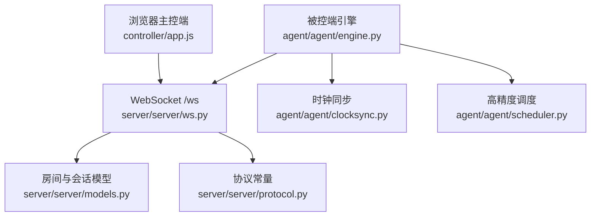
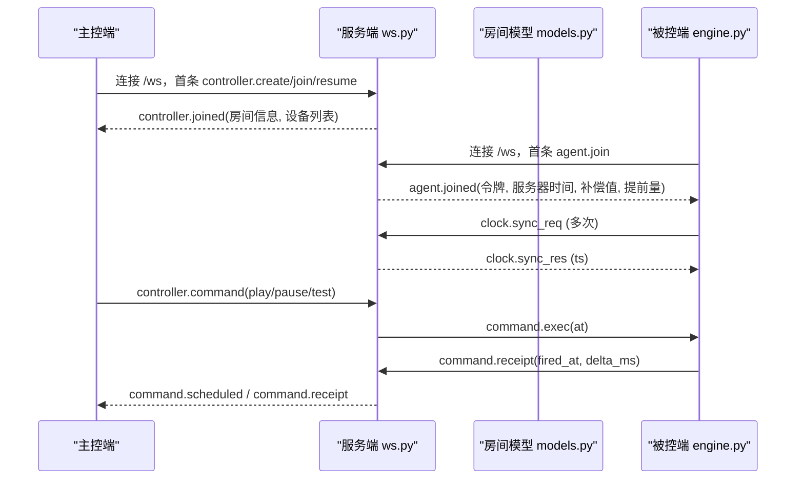
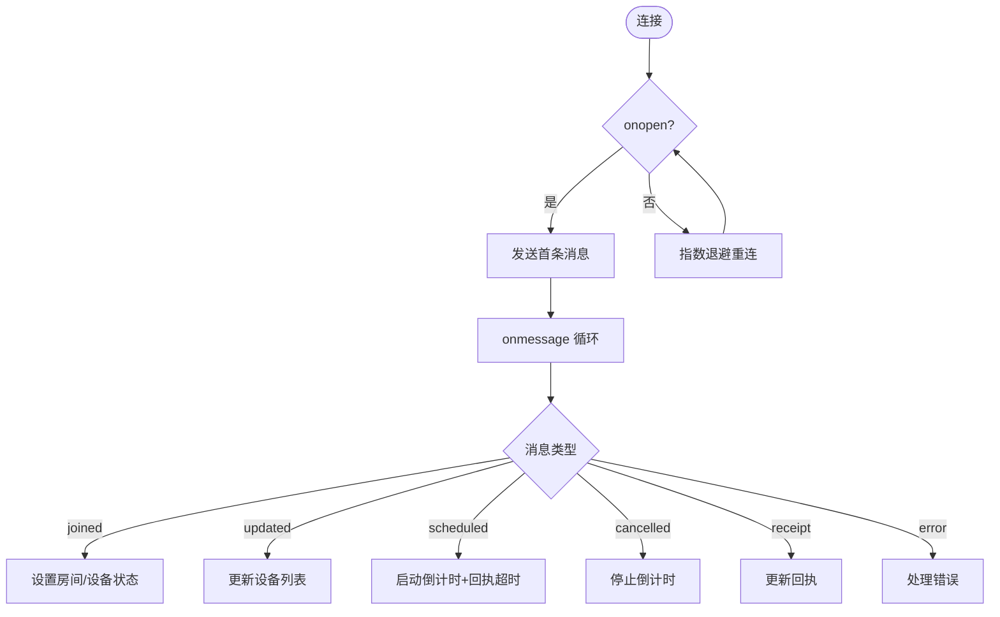
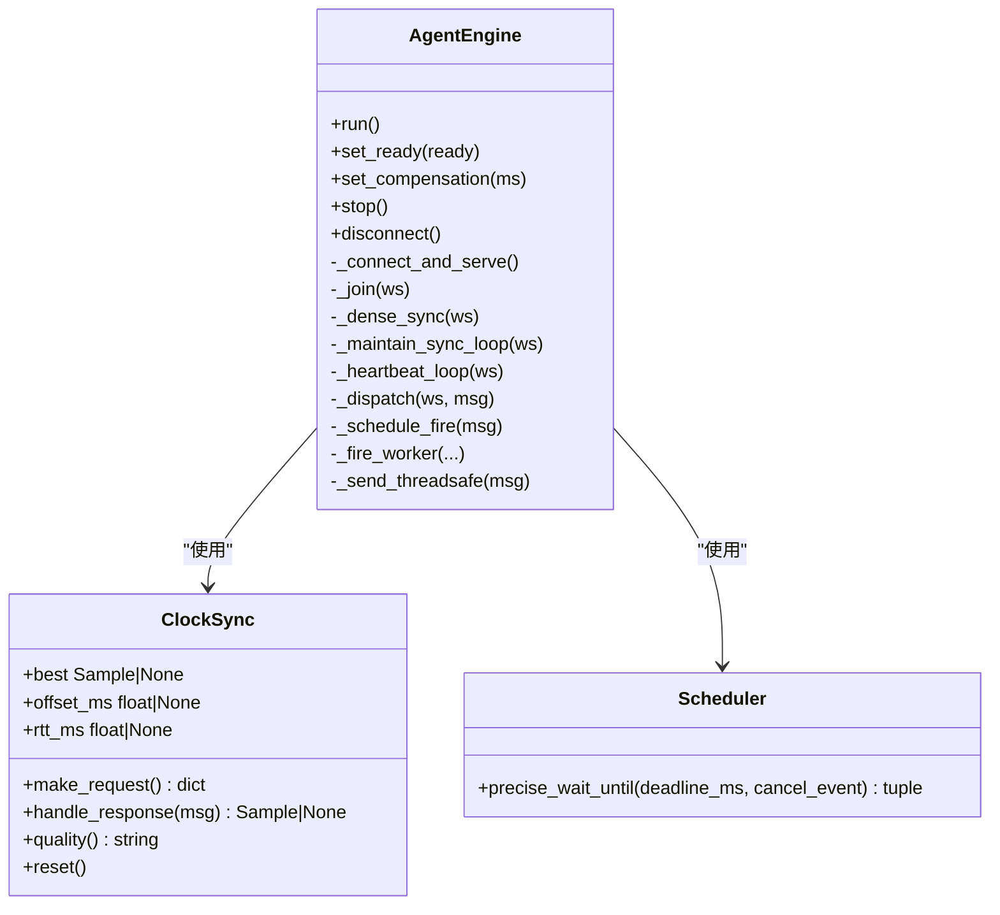
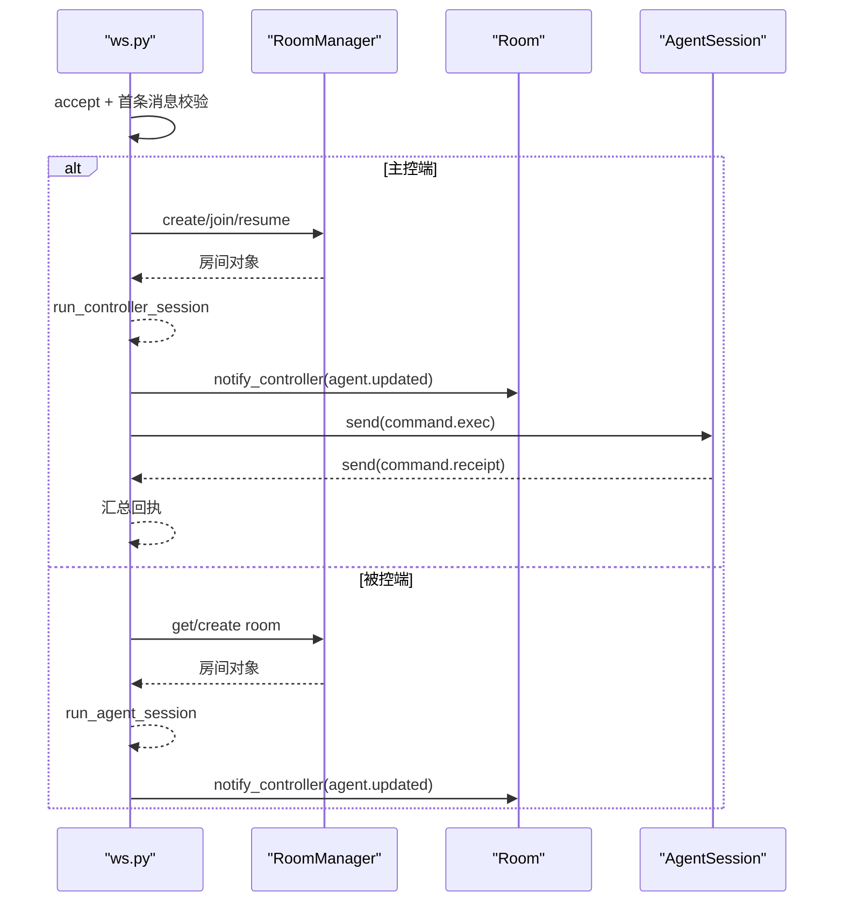
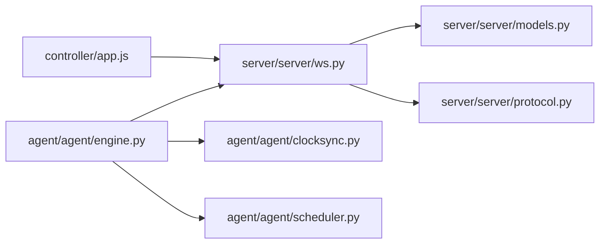

# 客户端集成指南

<cite>
**本文引用的文件**
- [README.md](file://README.md)
- [controller/app.js](file://controller/app.js)
- [controller/index.html](file://controller/index.html)
- [server/server/main.py](file://server/server/main.py)
- [server/server/ws.py](file://server/server/ws.py)
- [server/server/protocol.py](file://server/server/protocol.py)
- [server/server/models.py](file://server/server/models.py)
- [agent/agent/engine.py](file://agent/agent/engine.py)
- [agent/agent/protocol.py](file://agent/agent/protocol.py)
- [agent/agent/clocksync.py](file://agent/agent/clocksync.py)
- [agent/agent/scheduler.py](file://agent/agent/scheduler.py)
</cite>

## 目录
1. [简介](#简介)
2. [项目结构](#项目结构)
3. [核心组件](#核心组件)
4. [架构总览](#架构总览)
5. [详细组件分析](#详细组件分析)
6. [依赖关系分析](#依赖关系分析)
7. [性能与并发优化](#性能与并发优化)
8. [测试、调试与排错](#测试调试与排错)
9. [生产部署与监控](#生产部署与监控)
10. [结论](#结论)

## 简介
本指南面向需要在不同环境中集成 ScriptCue WebSocket 客户端的开发者，覆盖主控端（浏览器 JavaScript）与被控端（Python）的完整集成流程：连接建立、消息收发、错误处理、状态管理、重连逻辑与心跳机制。同时提供多语言/框架集成思路、性能优化建议、内存管理与并发最佳实践，以及测试、调试、常见问题与生产部署要点。

## 项目结构
- 服务端：FastAPI + WebSocket，房间管理、指令广播、时钟基准、审计日志。
- 主控端：原生 HTML/JS 网页，由服务端静态托管，负责创建/加入房间、下发指令、展示回执。
- 被控端：Python 程序，持续与服务端做类 NTP 时钟同步，收到带绝对执行时刻的指令后高精度定时触发并上报回执。

**图表来源**
- [controller/app.js:50-81](file://controller/app.js#L50-L81)
- [server/server/ws.py:334-360](file://server/server/ws.py#L334-L360)
- [server/server/models.py:64-117](file://server/server/models.py#L64-L117)
- [server/server/protocol.py:1-80](file://server/server/protocol.py#L1-L80)
- [agent/agent/engine.py:106-158](file://agent/agent/engine.py#L106-L158)
- [agent/agent/clocksync.py:29-106](file://agent/agent/clocksync.py#L29-L106)
- [agent/agent/scheduler.py:33-59](file://agent/agent/scheduler.py#L33-L59)

**章节来源**
- [README.md:7-27](file://README.md#L7-L27)

## 核心组件
- 主控端 WebSocket 客户端：负责创建/加入房间、发送指令、接收回执与设备状态更新，实现指数退避重连与倒计时 UI。
- 被控端同步引擎：负责连接生命周期、时钟同步、绝对时刻调度、触发回执、心跳与补偿值管理。
- 服务端会话处理：统一接入 /ws，根据首条消息区分主控端或被控端会话，维护房间与会话状态，广播指令与状态。

**章节来源**
- [controller/app.js:15-134](file://controller/app.js#L15-L134)
- [agent/agent/engine.py:31-158](file://agent/agent/engine.py#L31-L158)
- [server/server/ws.py:154-327](file://server/server/ws.py#L154-L327)

## 架构总览
主控端通过浏览器 WebSocket 连接到服务端的 /ws，首条消息声明角色为“主控”，随后进入房间并接收设备列表；被控端通过 Python websockets 连接同一 /ws，首条消息声明角色为“被控”，加入房间后开始密集时钟采样与心跳上报。服务端在房间内聚合设备状态，将指令以绝对时刻下发给在线设备，并在回执窗口内汇总回执反馈给主控端。

**图表来源**
- [controller/app.js:50-134](file://controller/app.js#L50-L134)
- [server/server/ws.py:154-207](file://server/server/ws.py#L154-L207)
- [server/server/ws.py:246-327](file://server/server/ws.py#L246-L327)
- [agent/agent/engine.py:159-193](file://agent/agent/engine.py#L159-L193)
- [agent/agent/engine.py:268-378](file://agent/agent/engine.py#L268-L378)

## 详细组件分析

### 主控端（浏览器 JavaScript）集成
- 连接建立：使用 WebSocket 构造 ws/wss URL，onopen 时发送首条消息（创建/加入/恢复），onmessage 解析 JSON 并分发到 dispatch。
- 状态管理：维护 token、room_code、room_name、serverOffset、agents Map、activeCmd、lastReceipts、reconnectAttempt 等。
- 消息处理：
  - controller.joined：设置 token/房间信息，初始化 agents，切换视图。
  - agent.updated：更新设备状态并渲染。
  - command.scheduled：记录 activeCmd，启动倒计时与回执超时。
  - command.cancelled：清理 activeCmd，停止倒计时。
  - command.receipt：更新回执集合，刷新 UI。
  - error：处理房间失效等错误。
- 重连逻辑：onclose 中按指数退避自动重连，上限 10 秒；支持手动离开关闭连接。
- 指令下发：controller.command 包含 command_id、command、lead_ms，可选 target 指定单设备。
- 回执汇总：到期后统计未回执设备为 missing，离线设备标记 offline。

**图表来源**
- [controller/app.js:50-134](file://controller/app.js#L50-L134)
- [controller/app.js:316-389](file://controller/app.js#L316-L389)

**章节来源**
- [controller/app.js:15-134](file://controller/app.js#L15-L134)
- [controller/app.js:316-389](file://controller/app.js#L316-L389)
- [controller/index.html:22-92](file://controller/index.html#L22-L92)

### 被控端（Python）集成
- 连接生命周期：engine.run 主循环，断线后指数退避重连；_connect_and_serve 建立连接并启动密集同步、心跳、维持同步任务。
- 加入房间：_join 发送 agent.join，等待 agent.joined，获取 token、compensation_ms、lead_ms，重置时钟同步样本。
- 时钟同步：_dense_sync 密集采样，_maintain_sync_loop 定期采样；clocksync 模块计算 offset/rtt，选择 RTT 最小样本作为可信偏移。
- 心跳：_heartbeat_loop 每 5 秒上报 ready、clock_quality、offset、rtt、compensation、pending_command；状态变化时立即补发。
- 消息分发：处理 clock.sync_res、command.exec、command.cancel、comp.update、error。
- 绝对时刻调度：_schedule_fire 计算 local_fire = at - offset - compensation，使用 scheduler.precise_wait_until 进行粗睡眠+末段自旋等待；触发后上报 command.receipt。
- 回调与线程安全：on_event 回调在引擎线程调用；发送消息通过 run_coroutine_threadsafe 跨线程安全投递。

**图表来源**
- [agent/agent/engine.py:31-158](file://agent/agent/engine.py#L31-L158)
- [agent/agent/engine.py:198-242](file://agent/agent/engine.py#L198-L242)
- [agent/agent/engine.py:268-378](file://agent/agent/engine.py#L268-L378)
- [agent/agent/clocksync.py:29-106](file://agent/agent/clocksync.py#L29-L106)
- [agent/agent/scheduler.py:33-59](file://agent/agent/scheduler.py#L33-L59)

**章节来源**
- [agent/agent/engine.py:106-158](file://agent/agent/engine.py#L106-L158)
- [agent/agent/engine.py:198-242](file://agent/agent/engine.py#L198-L242)
- [agent/agent/engine.py:268-378](file://agent/agent/engine.py#L268-L378)
- [agent/agent/clocksync.py:29-106](file://agent/agent/clocksync.py#L29-L106)
- [agent/agent/scheduler.py:33-59](file://agent/agent/scheduler.py#L33-L59)

### 服务端 WebSocket 会话处理
- 入口 handle_ws：接受连接，限制首条消息超时，校验协议版本，根据 type 路由到主控或会话处理。
- 主控会话：run_controller_session 处理 create/join/resume，命令下发 _controller_handle_command，取消 _controller_handle_cancel，设置补偿 _controller_handle_set_comp。
- 被控会话：run_agent_session 处理 join、心跳、补偿、回执；维护 pending_commands，通知主控端设备状态。
- 健康检查：/healthz 返回 proto、server_time、rooms 数量。

**图表来源**
- [server/server/ws.py:334-360](file://server/server/ws.py#L334-L360)
- [server/server/ws.py:154-207](file://server/server/ws.py#L154-L207)
- [server/server/ws.py:246-327](file://server/server/ws.py#L246-L327)
- [server/server/models.py:64-117](file://server/server/models.py#L64-L117)

**章节来源**
- [server/server/ws.py:154-207](file://server/server/ws.py#L154-L207)
- [server/server/ws.py:246-327](file://server/server/ws.py#L246-L327)
- [server/server/main.py:78-98](file://server/server/main.py#L78-L98)

## 依赖关系分析
- 主控端依赖浏览器 WebSocket API，无外部库。
- 被控端依赖 websockets、asyncio、threading；使用 clocksync 与 scheduler 模块实现高精度定时。
- 服务端依赖 FastAPI、websockets、asyncio；房间与会话模型纯内存存储。

**图表来源**
- [controller/app.js:50-81](file://controller/app.js#L50-L81)
- [agent/agent/engine.py:106-158](file://agent/agent/engine.py#L106-L158)
- [server/server/ws.py:334-360](file://server/server/ws.py#L334-L360)
- [server/server/models.py:64-117](file://server/server/models.py#L64-L117)
- [server/server/protocol.py:1-80](file://server/server/protocol.py#L1-L80)
- [agent/agent/clocksync.py:29-106](file://agent/agent/clocksync.py#L29-L106)
- [agent/agent/scheduler.py:33-59](file://agent/agent/scheduler.py#L33-L59)

**章节来源**
- [server/server/protocol.py:1-80](file://server/server/protocol.py#L1-L80)
- [agent/agent/protocol.py:1-80](file://agent/agent/protocol.py#L1-L80)

## 性能与并发优化
- 心跳与节流：被控端每 5 秒上报一次心跳，服务端每秒扫描离线设备（3 次心跳无响应判定离线），状态推送有节流间隔。
- 时钟同步：加入房间后密集采样 20 次，间隔 50ms；维持性采样每 30 秒一次；选择 RTT 最小的新鲜样本作为可信偏移，避免陈旧样本影响精度。
- 高精度调度：采用“粗睡眠 + 最后 50ms 自旋”策略，Windows 下提升系统定时器分辨率至 1ms，确保误差亚毫秒级。
- 内存管理：房间与会话纯内存存储，空闲超过 24h 的房间自动销毁；指令回执窗口结束后清理 pending_commands。
- 并发处理：被控端触发在独立线程执行，避免阻塞事件循环；通过 run_coroutine_threadsafe 安全跨线程发送消息。

**章节来源**
- [server/server/main.py:40-61](file://server/server/main.py#L40-L61)
- [server/server/protocol.py:75-80](file://server/server/protocol.py#L75-L80)
- [agent/agent/engine.py:198-242](file://agent/agent/engine.py#L198-L242)
- [agent/agent/clocksync.py:66-106](file://agent/agent/clocksync.py#L66-L106)
- [agent/agent/scheduler.py:33-59](file://agent/agent/scheduler.py#L33-L59)
- [server/server/models.py:148-157](file://server/server/models.py#L148-L157)

## 测试、调试与排错
- 健康检查：访问 /healthz 获取 proto、server_time、rooms 数量，验证服务可用性。
- 日志级别：通过环境变量 SC_LOG_LEVEL 控制日志输出等级。
- 常见错误：
  - 协议版本不匹配：首条消息 proto 必须与服务端一致。
  - 房间不存在/口令错误：加入失败时检查房间码与密码。
  - 设备不存在：设置补偿或单设备指令时需确认 session_id。
  - 消息格式非法：JSON 必须为对象，字段类型需符合约定。
- 调试建议：
  - 主控端：观察连接状态、设备列表、回执表中的偏差与状态。
  - 被控端：关注 on_event 回调中的 clock_sample、command_scheduled、command_fired、error 等事件。
  - 服务端：查看审计日志 audit.jsonl，追踪命令下发与回执。

**章节来源**
- [server/server/main.py:78-98](file://server/server/main.py#L78-L98)
- [server/server/ws.py:29-61](file://server/server/ws.py#L29-L61)
- [agent/agent/engine.py:268-378](file://agent/agent/engine.py#L268-L378)

## 生产部署与监控
- 部署方式：
  - 服务端：使用 uvicorn 启动或 Docker 容器化部署，数据目录与主控端目录可通过环境变量配置。
  - 主控端：浏览器直接访问 http(s)://<服务器地址>:8000/。
  - 被控端：GUI 版用于正式使用，命令行版用于联调验证。
- 环境变量：
  - SC_DATA_DIR：审计日志目录。
  - SC_CONTROLLER_DIR：主控端静态目录。
  - SC_DEFAULT_LEAD_MS：指令默认提前量（毫秒）。
  - SC_LOG_LEVEL：日志级别。
- 监控指标：
  - 房间数、在线设备数、指令回执成功率、平均 delta_ms、离线率。
  - 心跳超时次数、重连频率、时钟质量分布。
- 高可用建议：
  - 合理设置提前量与回执窗口，避免网络抖动导致误判。
  - 定期清理空闲房间，释放内存。
  - 监控审计日志增长，必要时归档或轮转。

**章节来源**
- [README.md:34-79](file://README.md#L34-L79)
- [server/server/main.py:6-10](file://server/server/main.py#L6-L10)
- [server/server/main.py:78-98](file://server/server/main.py#L78-L98)

## 结论
ScriptCue 通过统一的 WebSocket 协议与房间模型，实现了主控端与被控端的高精度同步起播。主控端提供直观的 Web 控制台，被控端通过时钟同步与高精度调度确保触发准确性。服务端集中管理房间与会话，提供健康检查与审计能力。按照本指南集成，可在浏览器、Node.js、Python 等多环境快速构建稳定可靠的同步播放系统。