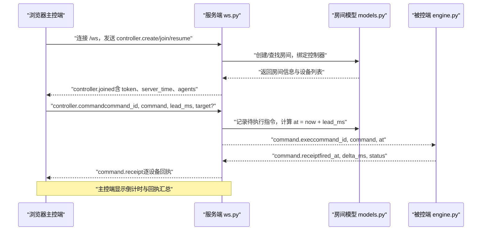
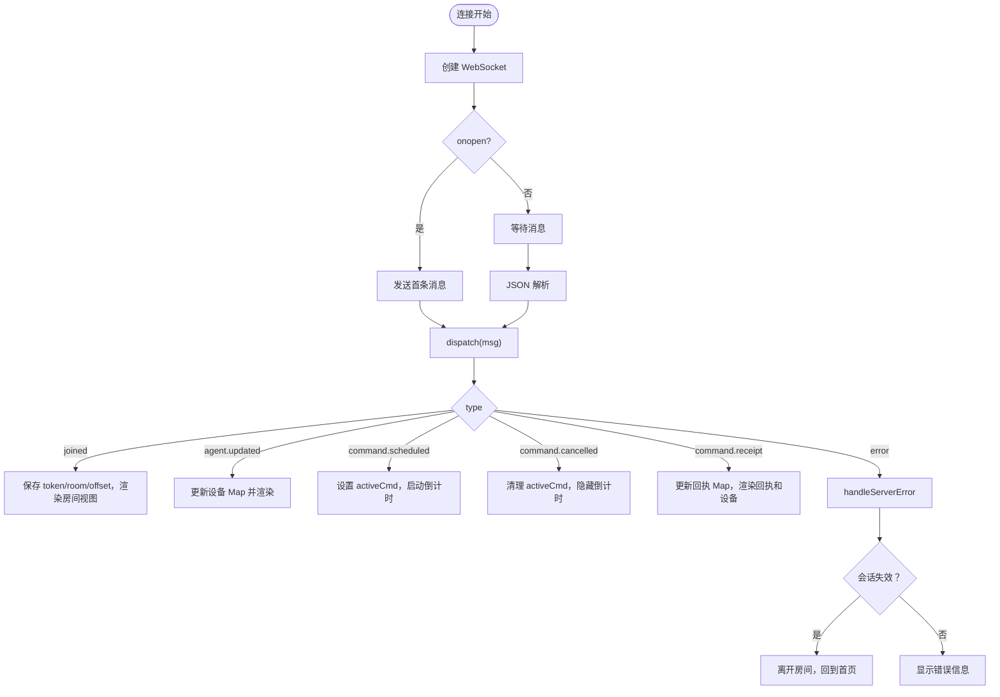
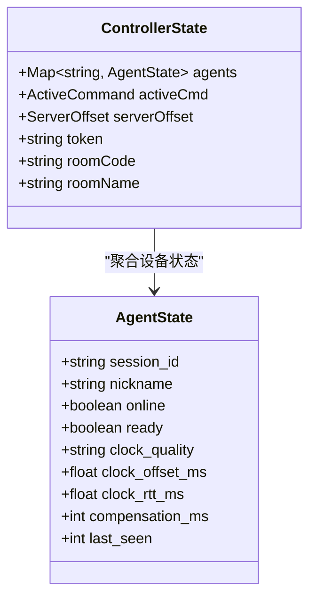
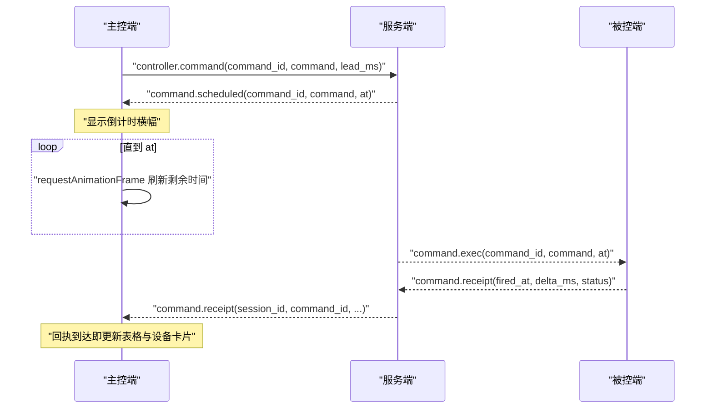

# 浏览器端集成

<cite>
**本文引用的文件**
- [controller/app.js](file://controller/app.js)
- [controller/index.html](file://controller/index.html)
- [controller/style.css](file://controller/style.css)
- [server/server/ws.py](file://server/server/ws.py)
- [server/server/protocol.py](file://server/server/protocol.py)
- [server/server/models.py](file://server/server/models.py)
- [agent/agent/engine.py](file://agent/agent/engine.py)
- [README.md](file://README.md)
</cite>

## 目录
1. [简介](#简介)
2. [项目结构](#项目结构)
3. [核心组件](#核心组件)
4. [架构总览](#架构总览)
5. [详细组件分析](#详细组件分析)
6. [依赖关系分析](#依赖关系分析)
7. [性能与稳定性](#性能与稳定性)
8. [故障排查指南](#故障排查指南)
9. [结论](#结论)
10. [附录：从零构建主控端的步骤清单](#附录从零构建主控端的步骤清单)

## 简介
本指南面向在浏览器环境中集成 ScriptCue 主控端（WebSocket 客户端）的开发者，目标是提供一份“从连接建立到指令回执、倒计时、错误恢复”的完整实现说明。文档基于仓库中现有的原生 JavaScript 主控端实现，结合服务端协议与会话模型，解释房间管理、设备列表、指令下发、倒计时系统、回执处理与 UI 交互细节，并给出移动端适配与响应式设计的最佳实践建议。

## 项目结构
本项目由三部分组成：
- 服务端：负责房间管理、WebSocket 会话、指令调度、状态汇聚与审计日志。
- 主控端：浏览器原生 HTML/CSS/JS，用于创建/加入房间、查看设备、下发指令与观察回执。
- 被控端：Python 程序，负责时钟同步、精确触发与回执上报。

```mermaid
graph TB
subgraph "浏览器"
UI["HTML/CSS/JS<br/>主控端页面"]
end
subgraph "服务器"
WS["WebSocket 路由<br/>ws.py"]
Models["房间与会话模型<br/>models.py"]
Proto["协议常量<br/>protocol.py"]
end
subgraph "被控端"
Engine["AgentEngine<br/>engine.py"]
end
UI --> WS
WS --> Models
WS --> Proto
WS < --> Engine
```

图表来源
- [controller/app.js:50-81](file://controller/app.js#L50-L81)
- [server/server/ws.py:154-207](file://server/server/ws.py#L154-L207)
- [server/server/models.py:64-117](file://server/server/models.py#L64-L117)
- [server/server/protocol.py:1-80](file://server/server/protocol.py#L1-L80)
- [agent/agent/engine.py:106-193](file://agent/agent/engine.py#L106-L193)

章节来源
- [README.md:1-86](file://README.md#L1-L86)

## 核心组件
- WebSocket 连接与消息分发：负责建立连接、发送首条消息、解析消息并分派到对应处理器。
- 房间管理：创建房间、加入房间、重连恢复、离开房间。
- 设备列表渲染：展示在线/离线、就绪状态、时钟质量、偏移与 RTT、最近触发偏差。
- 指令下发与倒计时：设置提前量、下发指令、显示倒计时横幅、取消指令。
- 回执处理：接收回执、汇总统计、超时收尾。
- 错误恢复：断线指数退避重连、会话失效处理、复制房间码等用户体验优化。

章节来源
- [controller/app.js:12-134](file://controller/app.js#L12-L134)
- [controller/app.js:150-189](file://controller/app.js#L150-L189)
- [controller/app.js:198-439](file://controller/app.js#L198-L439)
- [controller/app.js:445-519](file://controller/app.js#L445-L519)

## 架构总览
主控端通过 WebSocket 与服务端 /ws 端点通信。首条消息声明角色（主控或设备），服务端据此进入不同会话流程。主控端可创建/加入房间，查看设备列表，下发带绝对执行时刻的指令；服务端将指令广播给在线设备，设备按本地时钟对齐后触发并上报回执；主控端实时显示倒计时与回执汇总。



图表来源
- [controller/app.js:50-81](file://controller/app.js#L50-L81)
- [controller/app.js:83-134](file://controller/app.js#L83-L134)
- [server/server/ws.py:154-207](file://server/server/ws.py#L154-L207)
- [server/server/ws.py:67-115](file://server/server/ws.py#L67-L115)
- [server/server/ws.py:228-243](file://server/server/ws.py#L228-L243)
- [agent/agent/engine.py:268-388](file://agent/agent/engine.py#L268-L388)

## 详细组件分析

### WebSocket 连接与消息处理
- 连接建立：根据当前页面协议选择 ws/wss，构造 URL 并创建 WebSocket；onopen 时发送首条消息（创建/加入/恢复）。
- 消息分发：onmessage 解析 JSON，调用 dispatch 按 type 路由到具体处理逻辑（加入成功、设备更新、指令计划、指令取消、回执、错误）。
- 断开重连：onclose 中若已加入房间且非手动离开，则按指数退避策略自动重连；重连时携带 room_code 与 token。
- 错误处理：收到 error 类型消息时，根据 code 判断是否会话失效并引导回到首页。



图表来源
- [controller/app.js:50-81](file://controller/app.js#L50-L81)
- [controller/app.js:83-144](file://controller/app.js#L83-L144)

章节来源
- [controller/app.js:50-81](file://controller/app.js#L50-L81)
- [controller/app.js:83-144](file://controller/app.js#L83-L144)

### 房间管理与状态
- 创建房间：发送 controller.create，包含房间名与可选口令；成功后获得 token、room_code、room_name 与 server_time。
- 加入房间：校验 6 位房间码格式，发送 controller.join；失败时提示错误。
- 恢复连接：断线重连使用 controller.resume 携带 token，避免重复创建导致控制器被顶替。
- 离开房间：关闭连接、清空状态、停止倒计时、切换回首页。

章节来源
- [controller/app.js:479-519](file://controller/app.js#L479-L519)
- [server/server/ws.py:154-207](file://server/server/ws.py#L154-L207)

### 设备列表与状态显示
- 设备数据：维护 agents Map（session_id -> AgentState），包括 online、ready、clock_quality、clock_offset_ms、clock_rtt_ms、compensation_ms。
- 渲染卡片：显示昵称、状态徽章（离线/就绪/未就绪）、时钟质量徽章、偏移与 RTT、最近触发偏差（delta_ms 超阈值高亮）。
- 单设备操作：测试触发、补偿值编辑与设置（controller.set_comp）。



图表来源
- [server/server/models.py:17-52](file://server/server/models.py#L17-L52)
- [controller/app.js:198-298](file://controller/app.js#L198-L298)

章节来源
- [controller/app.js:198-298](file://controller/app.js#L198-L298)
- [server/server/models.py:17-52](file://server/server/models.py#L17-L52)

### 指令下发与倒计时系统
- 指令参数：command_id（随机生成）、command（play/pause/test）、lead_ms（提前量，默认 3s，范围受服务端限制）。
- 倒计时：收到 command.scheduled 后，使用 requestAnimationFrame 刷新剩余时间；到期后显示“等待回执”。
- 回执超时：根据 at 与 RECEIPT_TIMEOUT_MS 计算超时回调，汇总缺失回执并结束 activeCmd。
- 取消指令：在倒计时期间可发送 controller.cancel 取消尚未到期的指令。



图表来源
- [controller/app.js:316-389](file://controller/app.js#L316-L389)
- [server/server/ws.py:67-115](file://server/server/ws.py#L67-L115)
- [server/server/ws.py:228-243](file://server/server/ws.py#L228-L243)

章节来源
- [controller/app.js:316-389](file://controller/app.js#L316-L389)
- [server/server/ws.py:67-115](file://server/server/ws.py#L67-L115)

### 回执处理与统计
- 回执结构：包含 session_id、nickname、command_id、fired_at、delta_ms、status。
- 实时渲染：activeCmd 存在时，按设备维度显示等待中/正常/异常/跳过/离线等状态。
- 超时收尾：达到回执窗口后，将未回执的在线设备标记为 missing，离线设备标记为 offline，并持久化 lastReceipts。

章节来源
- [controller/app.js:364-439](file://controller/app.js#L364-L439)
- [server/server/ws.py:228-243](file://server/server/ws.py#L228-L243)

### 用户界面交互与防误触
- 长按确认：对关键按钮（全体起播、全体测试）实现长按 1 秒触发，防止误触；支持移动端指针事件与菜单禁用。
- 复制房间码：点击房间码区域尝试复制到剪贴板，失败时提示手动抄录。
- Toast 提示：统一的消息提示，4 秒自动消失。

章节来源
- [controller/app.js:445-519](file://controller/app.js#L445-L519)
- [controller/index.html:46-92](file://controller/index.html#L46-L92)

### 移动端适配与响应式设计
- 样式优先手机竖屏：大按钮、清晰可读的字体与间距，输入框字号避免 iOS 聚焦放大。
- 安全区域：body 底部预留 safe-area-inset-bottom，适配刘海屏。
- 桌面自适应：媒体查询增大主内容区与房间码字号，提升桌面体验。

章节来源
- [controller/style.css:1-216](file://controller/style.css#L1-L216)

## 依赖关系分析
- 主控端 app.js 依赖 DOM API（getElementById、requestAnimationFrame、navigator.clipboard）与 WebSocket。
- 服务端 ws.py 依赖 FastAPI/Starlette 的 WebSocket 能力，以及 protocol 常量与 models 房间模型。
- 被控端 engine.py 依赖 websockets、线程与定时器，实现高精度触发与回执上报。

```mermaid
graph LR
AppJS["controller/app.js"] --> WS_PY["server/server/ws.py"]
WS_PY --> PROTO["server/server/protocol.py"]
WS_PY --> MODELS["server/server/models.py"]
WS_PY < --> ENGINE["agent/agent/engine.py"]
```

图表来源
- [controller/app.js:50-81](file://controller/app.js#L50-L81)
- [server/server/ws.py:154-207](file://server/server/ws.py#L154-L207)
- [server/server/protocol.py:1-80](file://server/server/protocol.py#L1-L80)
- [server/server/models.py:64-117](file://server/server/models.py#L64-L117)
- [agent/agent/engine.py:106-193](file://agent/agent/engine.py#L106-L193)

章节来源
- [server/server/ws.py:154-207](file://server/server/ws.py#L154-L207)
- [server/server/protocol.py:1-80](file://server/server/protocol.py#L1-L80)
- [server/server/models.py:64-117](file://server/server/models.py#L64-L117)
- [agent/agent/engine.py:106-193](file://agent/agent/engine.py#L106-L193)

## 性能与稳定性
- 倒计时刷新：使用 requestAnimationFrame 保证平滑动画与较低 CPU 占用。
- 回执超时：基于 at 与 RECEIPT_TIMEOUT_MS 计算一次性定时器，避免轮询。
- 重连退避：指数退避上限 RECONNECT_MAX_S，减少频繁重连对服务器的压力。
- 节流与限制：服务端对 lead_ms 与 compensation_ms 进行范围限制，防止极端配置影响整体精度。

[本节为通用性能讨论，不直接分析具体代码行]

## 故障排查指南
- 连接断开：检查 onclose 中的重连逻辑与 manualLeave 标志；确认是否已加入房间（有 token）。
- 会话失效：收到 room_not_found 错误时，回到首页重新创建或加入房间。
- 指令未回执：检查回执窗口是否已到；查看设备是否在线与就绪；核对补偿值与时钟质量。
- 复制失败：剪贴板权限受限，提示手动抄录房间码。

章节来源
- [controller/app.js:66-81](file://controller/app.js#L66-L81)
- [controller/app.js:136-144](file://controller/app.js#L136-L144)
- [controller/app.js:500-507](file://controller/app.js#L500-L507)

## 结论
本指南基于仓库中的原生主控端实现，系统性地说明了 WebSocket 连接、消息分发、房间管理、设备列表、指令下发、倒计时与回执处理的完整链路，并结合服务端协议与会话模型解释了端到端的数据流。同时提供了移动端适配与响应式设计的实践要点，帮助开发者快速构建一个功能完整、稳定可靠的主控端应用。

[本节为总结性内容，不直接分析具体代码行]

## 附录：从零构建主控端的步骤清单
- 部署服务端：安装依赖并运行服务（或使用 Docker）。
- 访问主控端：浏览器打开服务端根路径，加载静态页面。
- 创建/加入房间：输入房间名与口令（可选），或输入 6 位房间码加入。
- 添加设备：启动被控端程序加入同一房间，等待设备上线与就绪。
- 下发指令：设置提前量，长按触发全体起播/测试；观察倒计时与回执。
- 调整补偿：针对个别设备微调补偿值，提升整体同步精度。
- 退出房间：点击离开，关闭连接并回到首页。

章节来源
- [README.md:34-86](file://README.md#L34-L86)
- [controller/index.html:24-92](file://controller/index.html#L24-L92)
- [controller/app.js:479-519](file://controller/app.js#L479-L519)