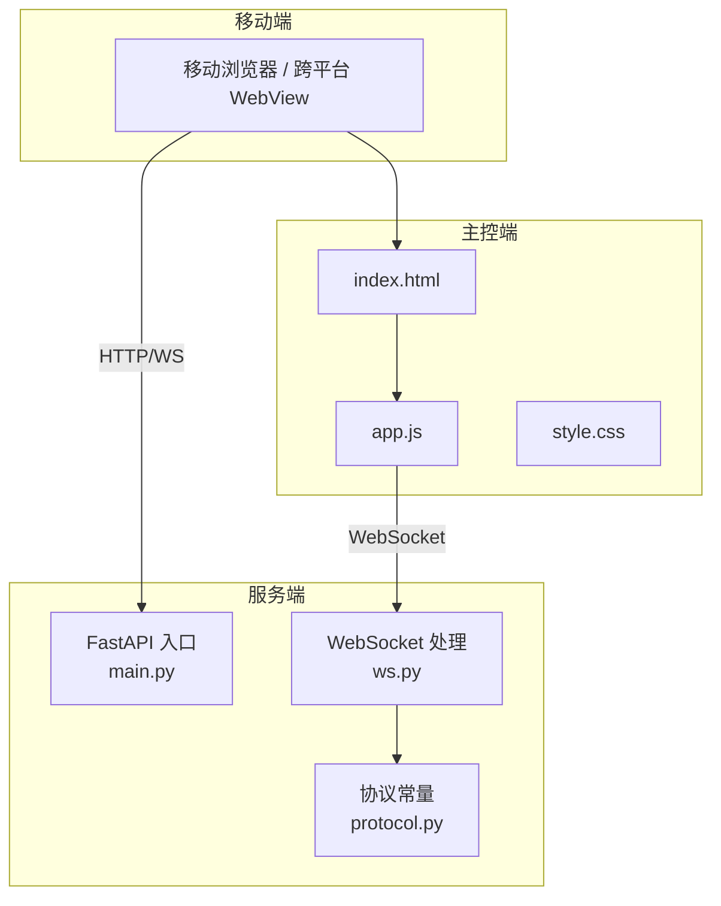
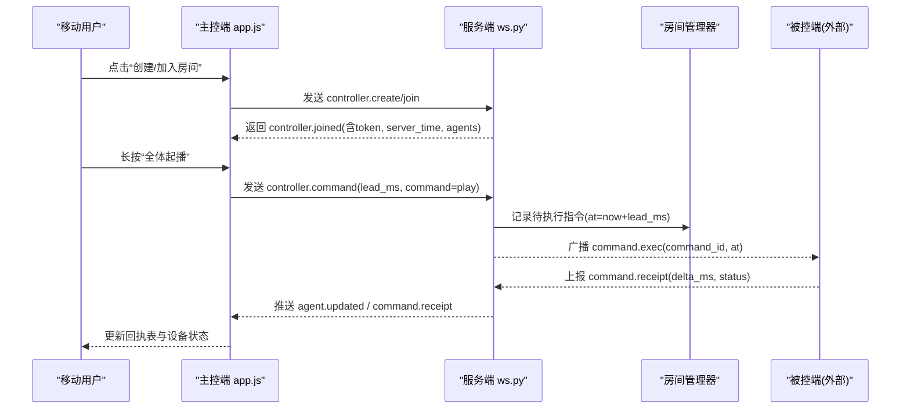
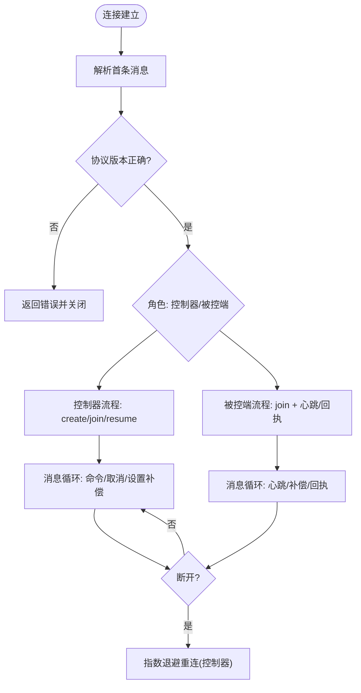
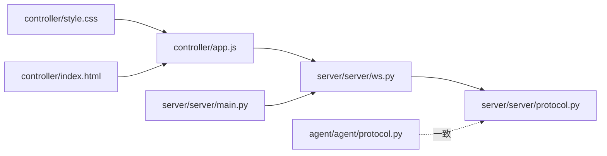

# 移动端集成

<cite>
**本文引用的文件**
- [README.md](file://README.md)
- [controller/index.html](file://controller/index.html)
- [controller/app.js](file://controller/app.js)
- [controller/style.css](file://controller/style.css)
- [server/server/main.py](file://server/server/main.py)
- [server/server/ws.py](file://server/server/ws.py)
- [server/server/protocol.py](file://server/server/protocol.py)
- [agent/agent/protocol.py](file://agent/agent/protocol.py)
</cite>

## 目录
1. [简介](#简介)
2. [项目结构](#项目结构)
3. [核心组件](#核心组件)
4. [架构总览](#架构总览)
5. [详细组件分析](#详细组件分析)
6. [依赖关系分析](#依赖关系分析)
7. [性能与电量优化](#性能与电量优化)
8. [故障排查指南](#故障排查指南)
9. [结论](#结论)
10. [附录：跨平台集成示例](#附录跨平台集成示例)

## 简介
本指南面向在移动设备上集成 ScriptCue 主控端（浏览器）或构建移动端客户端（React Native、Flutter 等）的工程师。文档基于仓库中已有的主控端实现，提炼出响应式设计与移动端交互要点，并给出 WebSocket 连接管理、网络切换处理、后台限制与电量优化的实践建议；同时提供跨平台框架的集成思路与测试方案。

## 项目结构
ScriptCue 由服务端、主控端网页与被控端组成。主控端为原生 HTML/JS/CSS，采用手机竖屏优先设计，桌面自适应；服务端通过 FastAPI 提供 WebSocket 长连接与房间管理；被控端使用 Python 实现时钟同步与指令执行。

图表来源
- [server/server/main.py:75-98](file://server/server/main.py#L75-L98)
- [server/server/ws.py:334-360](file://server/server/ws.py#L334-L360)
- [controller/index.html:1-98](file://controller/index.html#L1-L98)
- [controller/app.js:1-120](file://controller/app.js#L1-L120)
- [controller/style.css:1-30](file://controller/style.css#L1-L30)

章节来源
- [README.md:7-20](file://README.md#L7-L20)
- [server/server/main.py:75-98](file://server/server/main.py#L75-L98)
- [controller/index.html:1-98](file://controller/index.html#L1-L98)

## 核心组件
- 主控端（移动端 Web）：负责创建/加入房间、下发指令、显示倒计时与回执、设备状态列表。
- 服务端：房间生命周期管理、指令调度、心跳检测、审计日志。
- 协议：统一的 JSON 消息类型、错误码、限制参数（提前量范围、补偿值范围、心跳间隔等）。

章节来源
- [controller/app.js:13-134](file://controller/app.js#L13-L134)
- [server/server/ws.py:67-207](file://server/server/ws.py#L67-L207)
- [server/server/protocol.py:1-80](file://server/server/protocol.py#L1-L80)

## 架构总览
主控端通过 WebSocket 与服务端建立会话，首条消息声明角色（控制器或被控端）。控制器进入房间后，可下发带绝对执行时刻的指令；服务端将指令广播给在线的被控端，被控端按本地时钟对齐到点触发，并向服务器上报回执，最终汇总至主控端展示。

图表来源
- [controller/app.js:480-518](file://controller/app.js#L480-L518)
- [server/server/ws.py:154-207](file://server/server/ws.py#L154-L207)
- [server/server/ws.py:228-244](file://server/server/ws.py#L228-L244)

## 详细组件分析

### 响应式设计与移动端交互
- 视口与安全区域：使用 viewport 适配与 safe-area-inset-bottom，确保刘海屏/底部横条安全区。
- 触控友好：按钮最小点击面积与内边距充足，禁用双击缩放，关闭默认长按菜单，提升触摸体验。
- 布局策略：手机竖屏优先，卡片化信息块，控制区大按钮与分组行；桌面端通过媒体查询扩展宽度与字号。
- 反馈机制：Toast 提示、连接状态胶囊、倒计时横幅、回执表格，关键操作有视觉进度（长按填充动画）。

章节来源
- [controller/index.html:1-98](file://controller/index.html#L1-L98)
- [controller/style.css:1-216](file://controller/style.css#L1-L216)
- [controller/app.js:445-465](file://controller/app.js#L445-L465)

### 手势识别与防误触
- 长按确认：对“全体起播/全体测试”等危险操作采用长按 1 秒确认，避免误触。
- 指针事件统一：使用 pointerdown/up/leave/cancel 兼容鼠标与触摸，统一处理取消逻辑。
- 上下文菜单屏蔽：阻止 contextmenu，避免移动端弹出菜单干扰。

章节来源
- [controller/app.js:445-465](file://controller/app.js#L445-L465)

### 屏幕适配与可读性
- 字体与输入框：输入框字号不小于 16px，防止 iOS 聚焦放大；主标题与房间码在大屏下增大字号。
- 间距与层级：卡片阴影与圆角，信息分块清晰；重要操作按钮加粗与高对比色。
- 窄屏优化：控制区按钮纵向堆叠，行内按钮 flex 均分，保证单手操作可达性。

章节来源
- [controller/style.css:60-104](file://controller/style.css#L60-L104)
- [controller/style.css:178-216](file://controller/style.css#L178-L216)

### WebSocket 连接管理与网络切换
- 自动重连：断开后指数退避重连，上限固定；支持手动离开时停止重连。
- 首条消息校验：服务端要求首条消息为 JSON 对象且协议版本匹配，否则报错。
- 会话恢复：控制器支持 resume，携带 token 与房间码恢复会话；被控端支持自动重建房间。
- 心跳与离线判定：被控端定期心跳，服务端 3 次无响应标记离线并通知控制器。

图表来源
- [controller/app.js:50-81](file://controller/app.js#L50-L81)
- [server/server/ws.py:334-360](file://server/server/ws.py#L334-L360)
- [server/server/ws.py:246-327](file://server/server/ws.py#L246-L327)
- [server/server/main.py:40-52](file://server/server/main.py#L40-L52)

章节来源
- [controller/app.js:50-81](file://controller/app.js#L50-L81)
- [server/server/ws.py:334-360](file://server/server/ws.py#L334-L360)
- [server/server/main.py:40-52](file://server/server/main.py#L40-L52)

### 指令调度与回执
- 提前量：控制器可配置 lead_ms，服务端限制在 500ms~60000ms；指令到期后等待回执窗口 8000ms。
- 目标设备：支持单设备或全体指令；单设备时仅向该设备下发。
- 回执汇总：服务端计算 delta_ms 并回推至控制器；超时未完成则标记 missing/offline。

章节来源
- [server/server/ws.py:67-115](file://server/server/ws.py#L67-L115)
- [server/server/ws.py:228-244](file://server/server/ws.py#L228-L244)
- [controller/app.js:316-389](file://controller/app.js#L316-L389)

### 用户界面设计原则（移动端）
- 触控友好：大按钮、足够内边距、禁用文本选择与双击缩放。
- 滑动操作：当前主控端未实现滑动删除/刷新，建议在后续迭代中增加滑动以清理回执或快速切换房间。
- 弹窗提示：使用 Toast 与横幅替代 alert，减少阻塞；危险操作需二次确认（已实现长按）。

章节来源
- [controller/style.css:83-104](file://controller/style.css#L83-L104)
- [controller/app.js:182-189](file://controller/app.js#L182-L189)
- [controller/app.js:445-465](file://controller/app.js#L445-L465)

## 依赖关系分析
- 主控端依赖服务端的 WebSocket 接口与静态页面托管。
- 服务端依赖房间管理器、审计日志与时间基准；协议常量集中定义，两端保持一致。
- 被控端与服务端共享协议常量副本，维持心跳与回执一致性。

图表来源
- [controller/app.js:1-120](file://controller/app.js#L1-L120)
- [controller/style.css:1-30](file://controller/style.css#L1-L30)
- [controller/index.html:1-98](file://controller/index.html#L1-L98)
- [server/server/main.py:75-98](file://server/server/main.py#L75-L98)
- [server/server/ws.py:334-360](file://server/server/ws.py#L334-L360)
- [server/server/protocol.py:1-80](file://server/server/protocol.py#L1-L80)
- [agent/agent/protocol.py:1-80](file://agent/agent/protocol.py#L1-L80)

章节来源
- [server/server/protocol.py:1-80](file://server/server/protocol.py#L1-L80)
- [agent/agent/protocol.py:1-80](file://agent/agent/protocol.py#L1-L80)

## 性能与电量优化
- 前端渲染
  - 使用 requestAnimationFrame 驱动倒计时，避免频繁 DOM 操作导致掉帧。
  - 列表渲染按需更新，减少整表重建。
  - 禁用不必要的动画与滤镜，降低 GPU 压力。
- 网络与连接
  - 指数退避重连，避免风暴；合理设置 RECEIPT_TIMEOUT_MS 与心跳间隔。
  - 节流状态推送（服务端 AGENT_PUSH_THROTTLE_S），降低频繁更新带来的 CPU 与带宽消耗。
- 电池优化
  - 后台运行时尽量降低 UI 刷新频率；必要时暂停倒计时动画。
  - 避免高频定时器；合并多次状态更新。
- 内存管理
  - 及时清理定时器与动画帧；离开房间时关闭 WebSocket 并释放引用。
  - Map/Set 存储设备状态，避免冗余对象。

章节来源
- [controller/app.js:340-362](file://controller/app.js#L340-L362)
- [controller/app.js:157-168](file://controller/app.js#L157-L168)
- [server/server/protocol.py:75-80](file://server/server/protocol.py#L75-L80)

## 故障排查指南
- 连接问题
  - 检查首条消息是否为 JSON 对象且协议版本匹配；查看错误码 ERR_BAD_MESSAGE/ERR_BAD_PROTO。
  - 断线后观察是否触发自动重连；若长时间离线，检查网络与防火墙。
- 房间与会话
  - 房间不存在或口令错误会返回对应错误码；控制器 resume 失败需重新创建/加入。
  - 房间满员时将被拒绝；检查 MAX_AGENTS_PER_ROOM。
- 指令与回执
  - 指令提前量超出范围会被裁剪；回执超时未收到将标记 missing/offline。
  - 偏差阈值 DELTA_WARN_MS 用于告警，过大说明时钟同步或网络抖动异常。
- 设备状态
  - 心跳超时将被标记离线；检查被控端心跳间隔与网络质量。

章节来源
- [server/server/ws.py:334-360](file://server/server/ws.py#L334-L360)
- [server/server/ws.py:67-115](file://server/server/ws.py#L67-L115)
- [server/server/ws.py:228-244](file://server/server/ws.py#L228-L244)
- [controller/app.js:136-144](file://controller/app.js#L136-L144)
- [controller/app.js:316-389](file://controller/app.js#L316-L389)

## 结论
ScriptCue 的主控端已具备完善的移动端基础能力：响应式布局、触控友好的交互、稳定的 WebSocket 连接与指令回执闭环。在此基础上，可进一步引入滑动操作、更精细的后台运行策略与电量优化，以满足生产环境的高可用与用户体验要求。跨平台框架集成时，应严格遵循协议常量与限制参数，保持与服务端的一致性。

## 附录：跨平台集成示例

### React Native（WebView 方式）
- 将主控端页面打包为静态资源，嵌入 WebView 中加载。
- 通过桥接暴露系统剪贴板、通知等能力；注意处理权限与隐私提示。
- 监听 WebView 的生命周期，在后台时暂停倒计时动画与高频刷新，恢复时重连 WebSocket。
- 参考主控端实现：
  - 视图结构与交互：[controller/index.html:22-92](file://controller/index.html#L22-L92)
  - 连接与消息分发：[controller/app.js:50-134](file://controller/app.js#L50-L134)
  - 样式与触控优化：[controller/style.css:83-104](file://controller/style.css#L83-L104)

### Flutter（InAppWebView 方式）
- 使用 InAppWebView 加载主控端页面，配置安全区域与视口。
- 通过 Platform Channel 调用系统功能（如复制房间码、显示通知）。
- 在应用进入后台时暂停 UI 动画与定时器，回到前台时恢复并重连。
- 参考主控端实现：
  - 事件绑定与指令下发：[controller/app.js:479-518](file://controller/app.js#L479-L518)
  - 倒计时与回执渲染：[controller/app.js:332-439](file://controller/app.js#L332-L439)

### 原生 WebSocket 客户端（RN/Flutter 直接通信）
- 遵循协议常量，实现控制器与被控端两类会话；首条消息必须包含 proto 与 type。
- 实现心跳与离线检测，结合指数退避重连；维护房间令牌与设备映射。
- 指令下发需校验 lead_ms 范围，接收回执后更新 UI；超时未完成标记缺失。
- 参考服务端与协议：
  - 控制器会话处理：[server/server/ws.py:154-207](file://server/server/ws.py#L154-L207)
  - 被控端会话处理：[server/server/ws.py:246-327](file://server/server/ws.py#L246-L327)
  - 协议常量与限制：[server/server/protocol.py:1-80](file://server/server/protocol.py#L1-L80)

### 移动端测试方案
- 功能测试
  - 创建/加入房间、指令下发与取消、回执汇总、设备状态更新。
  - 网络切换（WiFi/蜂窝）、断线重连、后台恢复。
- 兼容性测试
  - iOS Safari、Android Chrome、不同分辨率与刘海屏机型。
  - 触控事件（pointerdown/up/leave/cancel）与长按行为。
- 性能与电量
  - 监控 CPU、内存、网络流量与电量消耗；验证后台降频策略。
  - 统计回执延迟分布与偏差阈值告警比例。
- 用户体验评估
  - 任务完成时间、误触率、满意度问卷；重点评估长按确认与 Toast 提示的可感知性。

章节来源
- [controller/app.js:445-465](file://controller/app.js#L445-L465)
- [server/server/ws.py:67-115](file://server/server/ws.py#L67-L115)
- [server/server/protocol.py:67-80](file://server/server/protocol.py#L67-L80)