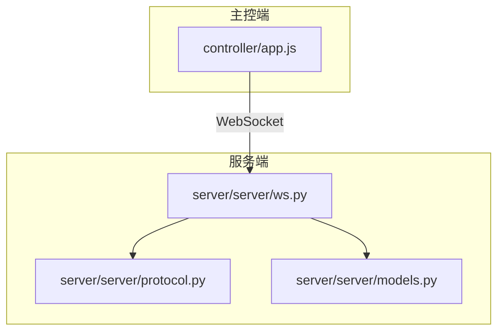
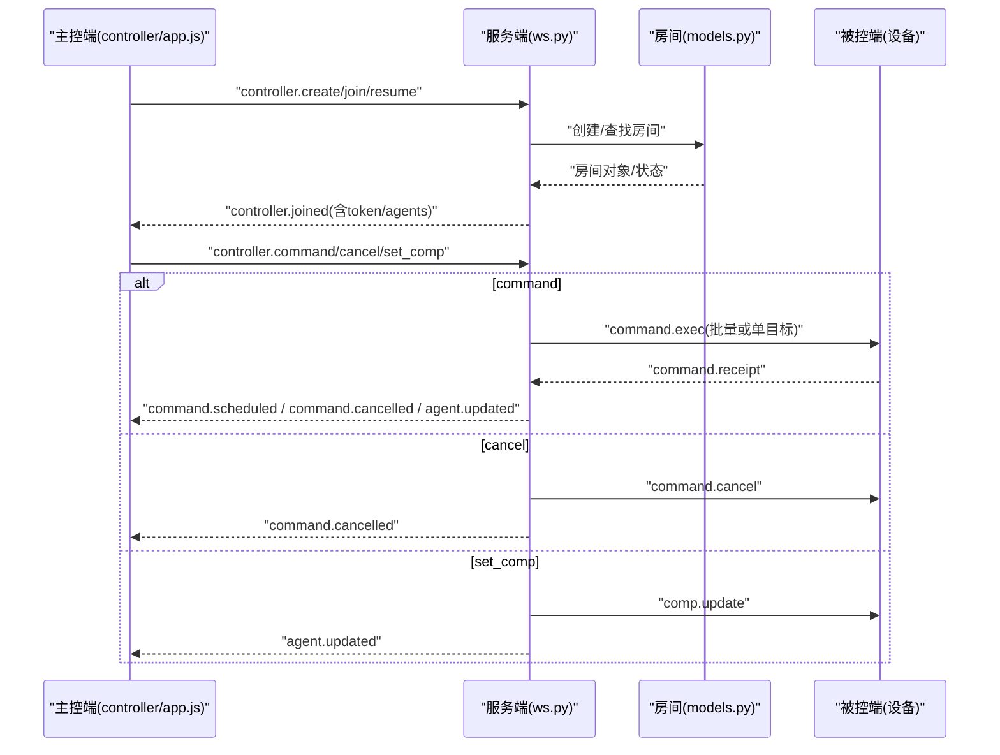
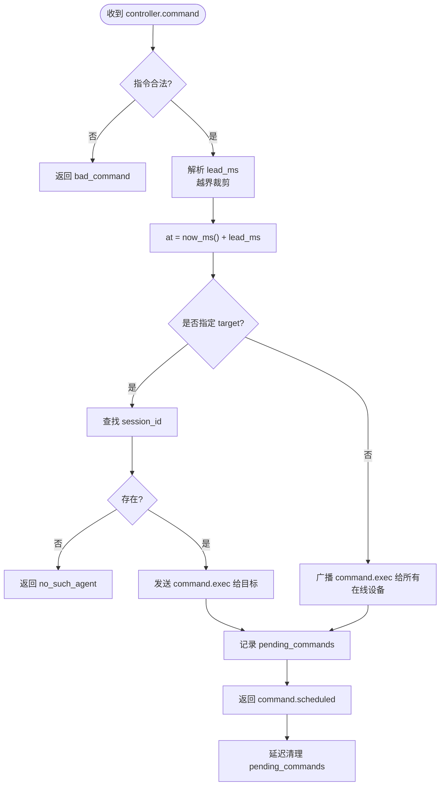
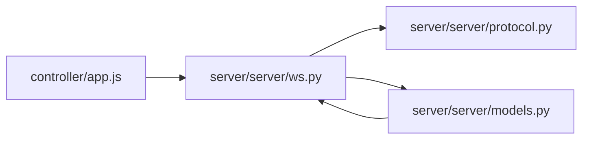

# 控制消息

<cite>
**本文引用的文件**
- [server/server/protocol.py](file://server/server/protocol.py)
- [agent/agent/protocol.py](file://agent/agent/protocol.py)
- [server/server/ws.py](file://server/server/ws.py)
- [server/server/models.py](file://server/server/models.py)
- [controller/app.js](file://controller/app.js)
</cite>

## 目录
1. [简介](#简介)
2. [项目结构](#项目结构)
3. [核心组件](#核心组件)
4. [架构总览](#架构总览)
5. [详细组件分析](#详细组件分析)
6. [依赖关系分析](#依赖关系分析)
7. [性能考虑](#性能考虑)
8. [故障排查指南](#故障排查指南)
9. [结论](#结论)
10. [附录：消息清单与示例](#附录消息清单与示例)

## 简介
本文件为 ScriptCue 的“控制消息”专项文档，聚焦主控端到服务器的所有控制消息类型：房间创建（controller.create）、加入房间（controller.join）、恢复会话（controller.resume）、下发指令（controller.command）、取消指令（controller.cancel）和设置补偿（controller.set_comp）。文档覆盖每个消息的字段结构、参数验证规则、使用场景、错误处理机制，并提供完整消息示例与最佳实践。

## 项目结构
- 协议常量由服务端权威定义，被控端维护等价副本，确保两端一致。
- WebSocket 入口统一为 /ws，首条消息声明角色（主控端或被控端），后续按消息类型路由到对应处理器。
- 房间与会话模型以内存存储，支持房间空闲销毁、设备离线检测等后台任务。

图表来源
- [controller/app.js:1-522](file://controller/app.js#L1-L522)
- [server/server/ws.py:1-360](file://server/server/ws.py#L1-L360)
- [server/server/protocol.py:1-80](file://server/server/protocol.py#L1-L80)
- [server/server/models.py:1-157](file://server/server/models.py#L1-L157)

章节来源
- [server/server/protocol.py:1-80](file://server/server/protocol.py#L1-L80)
- [server/server/ws.py:1-360](file://server/server/ws.py#L1-L360)
- [server/server/models.py:1-157](file://server/server/models.py#L1-L157)
- [controller/app.js:1-522](file://controller/app.js#L1-L522)

## 核心组件
- 协议常量：集中定义消息类型、指令类型、错误码、限制与默认值。
- WebSocket 会话：解析首条消息并分发至主控端或被控端会话处理流程；对主控端消息进行校验与执行。
- 房间与会话模型：管理房间生命周期、设备会话状态、待执行指令队列、广播与通知。

章节来源
- [server/server/protocol.py:1-80](file://server/server/protocol.py#L1-L80)
- [server/server/ws.py:15-208](file://server/server/ws.py#L15-L208)
- [server/server/models.py:17-117](file://server/server/models.py#L17-L117)

## 架构总览
主控端通过 WebSocket 连接服务器，首条消息决定进入“主控端会话”。随后发送控制消息，服务器根据类型路由到相应处理器，完成房间管理、指令调度、补偿设置等操作，并向主控端与被控端推送状态更新与回执。

图表来源
- [controller/app.js:480-518](file://controller/app.js#L480-L518)
- [server/server/ws.py:154-208](file://server/server/ws.py#L154-L208)
- [server/server/ws.py:67-152](file://server/server/ws.py#L67-L152)
- [server/server/models.py:100-117](file://server/server/models.py#L100-L117)

## 详细组件分析

### 通用约束与校验
- 协议版本：首条消息必须携带 proto 字段且与服务端 PROTO_VERSION 一致，否则返回 bad_proto。
- 消息格式：所有消息必须是 JSON 对象，非法将返回 bad_message。
- 房间口令：若房间设置了密码，加入时需提供正确 password，否则返回 bad_password。
- 房间容量：每房间最大设备数受 MAX_AGENTS_PER_ROOM 限制，超出返回 room_full。
- 提前量范围：lead_ms 必须在 LEAD_MIN~LEAD_MAX 范围内，越界会被裁剪。
- 补偿值范围：compensation_ms 必须在 COMP_MIN~COMP_MAX 范围内，越界会被裁剪。

章节来源
- [server/server/ws.py:22-26](file://server/server/ws.py#L22-L26)
- [server/server/ws.py:349-351](file://server/server/ws.py#L349-L351)
- [server/server/ws.py:50-60](file://server/server/ws.py#L50-L60)
- [server/server/protocol.py:67-73](file://server/server/protocol.py#L67-L73)
- [server/server/models.py:89-95](file://server/server/models.py#L89-L95)

### controller.create（创建房间）
- 用途：新建一个房间并建立主控端会话。
- 关键字段
  - type: "controller.create"
  - proto: 协议版本号
  - room_name: 可选，房间名称
  - password: 可选，房间口令
- 成功响应
  - type: "controller.joined"
  - room_code, room_name, token, server_time, agents
- 错误处理
  - 协议版本不匹配：bad_proto
  - 首条消息非 JSON 对象：bad_message
- 行为说明
  - 房间创建成功后，控制器成为该房间的当前主控端；若已有控制器连接，新连接会顶替旧连接。

章节来源
- [controller/app.js:480-485](file://controller/app.js#L480-L485)
- [server/server/ws.py:154-185](file://server/server/ws.py#L154-L185)
- [server/server/protocol.py:11-23](file://server/server/protocol.py#L11-L23)

### controller.join（加入房间）
- 用途：以房间码加入已存在的房间。
- 关键字段
  - type: "controller.join"
  - proto
  - room_code: 6 位房间码（仅允许特定字符集）
  - password: 可选，若房间设了口令则必须匹配
- 成功响应
  - type: "controller.joined"
  - room_code, room_name, token, server_time, agents
- 错误处理
  - 房间不存在：room_not_found
  - 口令错误：bad_password
  - 协议版本不匹配：bad_proto
  - 首条消息非 JSON 对象：bad_message
- 客户端校验
  - 前端会对 room_code 做正则校验，确保 6 位有效字符。

章节来源
- [controller/app.js:487-496](file://controller/app.js#L487-L496)
- [server/server/ws.py:161-168](file://server/server/ws.py#L161-L168)
- [server/server/protocol.py:67-70](file://server/server/protocol.py#L67-L70)

### controller.resume（恢复会话）
- 用途：网络断开重连后，凭 token 恢复主控端会话。
- 关键字段
  - type: "controller.resume"
  - proto
  - room_code
  - token: 上次 controller.joined 返回的 token
- 成功响应
  - type: "controller.joined"
  - room_code, room_name, token, server_time, agents
- 错误处理
  - 会话失效（房间不存在或 token 不匹配）：room_not_found
  - 协议版本不匹配：bad_proto
  - 首条消息非 JSON 对象：bad_message
- 使用场景
  - 浏览器刷新或网络抖动后自动重连，避免重新创建房间。

章节来源
- [controller/app.js:66-78](file://controller/app.js#L66-L78)
- [server/server/ws.py:169-173](file://server/server/ws.py#L169-L173)

### controller.command（下发指令）
- 用途：向房间内在线的被控端下发定时指令（play/pause/test），可指定单目标或全体。
- 关键字段
  - type: "controller.command"
  - command_id: 可选，未提供时服务端生成
  - command: play | pause | test
  - lead_ms: 可选，指令提前量（毫秒），默认取房间配置
  - target: 可选，session_id，指定单台设备
- 成功响应
  - type: "command.scheduled"
  - command_id, command, at, lead_ms
- 错误处理
  - 未知指令：bad_command
  - 目标设备不存在：no_such_agent
  - 其他：bad_message
- 执行流程
  - 计算 at = now_ms() + lead_ms
  - 写入房间待执行队列
  - 向目标设备或全体在线设备发送 command.exec
  - 启动清理任务，在回执窗口结束后清理 pending_commands
- 回执与超时
  - 被控端执行后上报 command.receipt，包含 fired_at、status、delta_ms
  - 前端等待 RECEIPT_TIMEOUT_MS 汇总回执，标记缺失或未回执设备

章节来源
- [server/server/ws.py:67-115](file://server/server/ws.py#L67-L115)
- [server/server/ws.py:228-243](file://server/server/ws.py#L228-L243)
- [controller/app.js:316-330](file://controller/app.js#L316-L330)
- [controller/app.js:364-389](file://controller/app.js#L364-L389)
- [server/server/protocol.py:45-49](file://server/server/protocol.py#L45-L49)

图表来源
- [server/server/ws.py:67-115](file://server/server/ws.py#L67-L115)

### controller.cancel（取消指令）
- 用途：取消尚未到期的指令。
- 关键字段
  - type: "controller.cancel"
  - command_id: 要取消的指令 ID
- 成功响应
  - type: "command.cancelled"
  - command_id
- 行为说明
  - 若指令不存在或已到期，静默忽略
  - 从房间与设备的 pending_commands 中移除
  - 向目标设备或全体在线设备发送 command.cancel
- 错误处理
  - 其他异常：bad_message

章节来源
- [server/server/ws.py:117-135](file://server/server/ws.py#L117-L135)
- [controller/app.js:509-513](file://controller/app.js#L509-L513)

### controller.set_comp（设置补偿）
- 用途：为主控端视角下的某台设备设置补偿值（毫秒），用于微调触发时机。
- 关键字段
  - type: "controller.set_comp"
  - session_id: 设备会话 ID
  - compensation_ms: 整数毫秒，越界将被裁剪
- 成功响应
  - 对被控端：type: "comp.update", compensation_ms
  - 对主控端：type: "agent.updated", agent(state)
- 错误处理
  - 设备不存在：no_such_agent
  - 补偿值非法：bad_command（非整数毫秒）
  - 其他：bad_message
- 使用场景
  - 针对个别设备时钟偏差较大时，单独调整其补偿值以提升同步精度。

章节来源
- [server/server/ws.py:137-152](file://server/server/ws.py#L137-L152)
- [controller/app.js:275-293](file://controller/app.js#L275-L293)
- [server/server/protocol.py:57-65](file://server/server/protocol.py#L57-L65)

## 依赖关系分析
- 主控端（controller/app.js）负责构建并发送控制消息，处理服务端返回的状态与回执。
- 服务端（server/server/ws.py）解析首条消息，路由到 run_controller_session，再根据 type 调用具体处理器。
- 房间模型（server/server/models.py）提供房间与会话状态、广播与通知能力。
- 协议常量（server/server/protocol.py）集中定义消息类型、错误码与限制，被两端引用。

图表来源
- [controller/app.js:1-522](file://controller/app.js#L1-L522)
- [server/server/ws.py:1-360](file://server/server/ws.py#L1-L360)
- [server/server/protocol.py:1-80](file://server/server/protocol.py#L1-L80)
- [server/server/models.py:1-157](file://server/server/models.py#L1-L157)

章节来源
- [server/server/ws.py:154-208](file://server/server/ws.py#L154-L208)
- [server/server/models.py:64-117](file://server/server/models.py#L64-L117)
- [server/server/protocol.py:11-43](file://server/server/protocol.py#L11-L43)

## 性能考虑
- 指令提前量（lead_ms）建议设置在合理范围（如 1000~30000ms），避免过短导致执行抖动，过长影响交互体验。
- 补偿值（compensation_ms）应谨慎调整，过大可能引入新的时序误差。
- 回执超时（RECEIPT_TIMEOUT_MS）需兼顾网络波动与设备处理能力，避免过早判定失败。
- 房间空闲销毁（ROOM_IDLE_TTL_S）可减少资源占用，适合长时间无人值守场景。

[本节为通用指导，无需代码引用]

## 故障排查指南
- 协议版本不匹配（bad_proto）
  - 检查主控端与服务端的 PROTO_VERSION 是否一致。
- 房间不存在（room_not_found）
  - 确认 room_code 是否正确；若为 resume，检查 token 是否仍有效。
- 口令错误（bad_password）
  - 确认加入时提供的 password 与房间设置一致。
- 设备不存在（no_such_agent）
  - 检查 session_id 是否属于当前房间且在线。
- 未知指令（bad_command）
  - 仅支持 play、pause、test，检查 command 字段。
- 消息格式错误（bad_message）
  - 确保消息为 JSON 对象，字段类型符合要求。

章节来源
- [server/server/ws.py:349-351](file://server/server/ws.py#L349-L351)
- [server/server/ws.py:161-173](file://server/server/ws.py#L161-L173)
- [server/server/ws.py:67-85](file://server/server/ws.py#L67-L85)
- [server/server/ws.py:137-152](file://server/server/ws.py#L137-L152)

## 结论
ScriptCue 的控制消息体系围绕房间与会话管理、指令调度与补偿调节展开，具备严格的参数校验与完善的错误处理。通过统一的 WebSocket 入口与清晰的协议常量，主控端可以可靠地创建房间、加入房间、恢复会话，并对设备进行精准控制与调优。遵循本文的最佳实践与排障指引，可有效提升系统的稳定性与同步精度。

[本节为总结性内容，无需代码引用]

## 附录：消息清单与示例

### controller.create
- 请求字段
  - type: "controller.create"
  - proto: 协议版本
  - room_name: 可选
  - password: 可选
- 成功响应
  - type: "controller.joined"
  - room_code, room_name, token, server_time, agents
- 错误
  - bad_proto, bad_message

章节来源
- [controller/app.js:480-485](file://controller/app.js#L480-L485)
- [server/server/ws.py:154-185](file://server/server/ws.py#L154-L185)

### controller.join
- 请求字段
  - type: "controller.join"
  - proto
  - room_code: 6 位有效字符
  - password: 可选
- 成功响应
  - type: "controller.joined"
  - room_code, room_name, token, server_time, agents
- 错误
  - room_not_found, bad_password, bad_proto, bad_message

章节来源
- [controller/app.js:487-496](file://controller/app.js#L487-L496)
- [server/server/ws.py:161-168](file://server/server/ws.py#L161-L168)

### controller.resume
- 请求字段
  - type: "controller.resume"
  - proto
  - room_code
  - token
- 成功响应
  - type: "controller.joined"
  - room_code, room_name, token, server_time, agents
- 错误
  - room_not_found, bad_proto, bad_message

章节来源
- [controller/app.js:66-78](file://controller/app.js#L66-L78)
- [server/server/ws.py:169-173](file://server/server/ws.py#L169-L173)

### controller.command
- 请求字段
  - type: "controller.command"
  - command_id: 可选
  - command: play | pause | test
  - lead_ms: 可选，默认取房间配置
  - target: 可选，session_id
- 成功响应
  - type: "command.scheduled"
  - command_id, command, at, lead_ms
- 错误
  - bad_command, no_such_agent, bad_message

章节来源
- [server/server/ws.py:67-115](file://server/server/ws.py#L67-L115)
- [controller/app.js:316-330](file://controller/app.js#L316-L330)

### controller.cancel
- 请求字段
  - type: "controller.cancel"
  - command_id
- 成功响应
  - type: "command.cancelled"
  - command_id
- 错误
  - bad_message

章节来源
- [server/server/ws.py:117-135](file://server/server/ws.py#L117-L135)
- [controller/app.js:509-513](file://controller/app.js#L509-L513)

### controller.set_comp
- 请求字段
  - type: "controller.set_comp"
  - session_id
  - compensation_ms: 整数毫秒
- 成功响应
  - 对被控端：type: "comp.update", compensation_ms
  - 对主控端：type: "agent.updated", agent(state)
- 错误
  - no_such_agent, bad_command, bad_message

章节来源
- [server/server/ws.py:137-152](file://server/server/ws.py#L137-L152)
- [controller/app.js:275-293](file://controller/app.js#L275-L293)