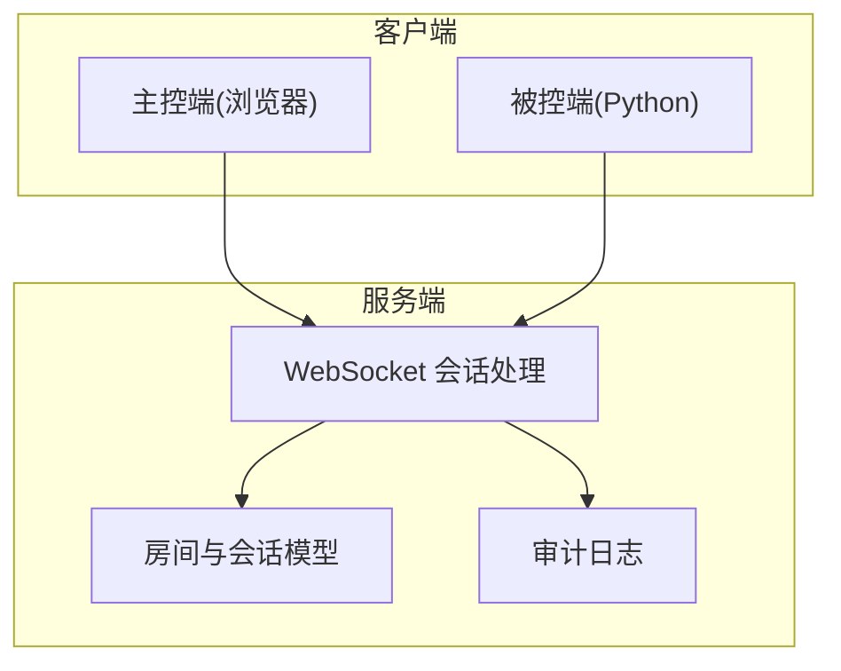
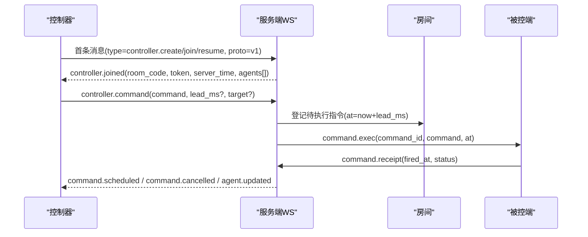
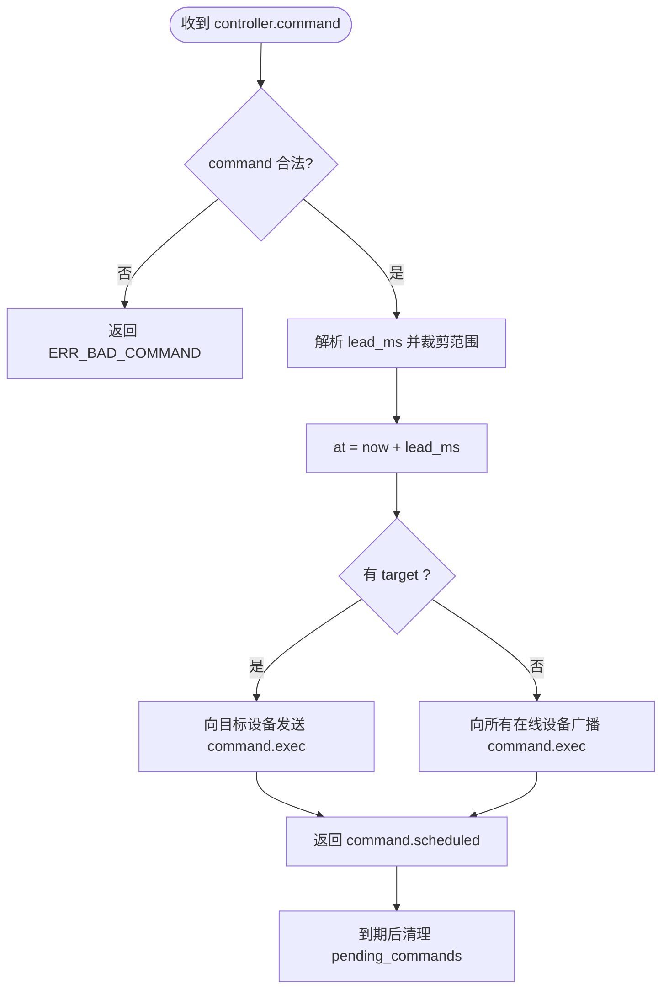
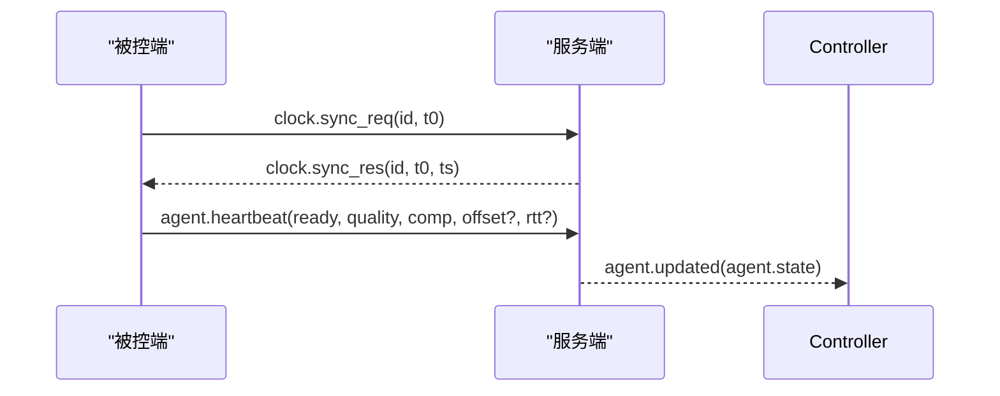
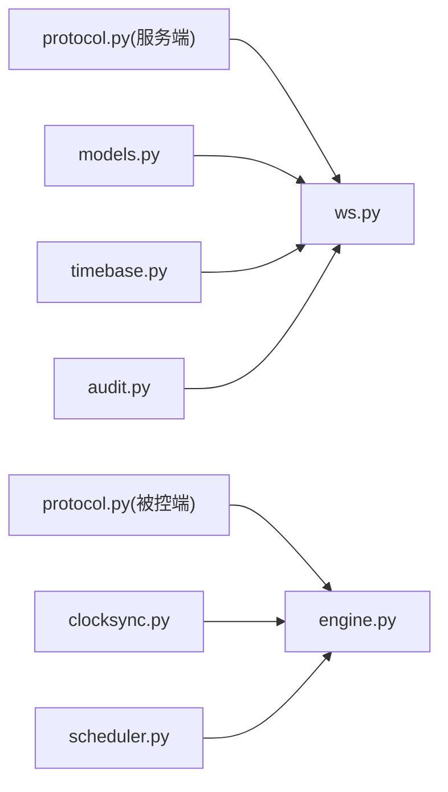

# 消息协议规范

<cite>
**本文引用的文件**
- [server/server/protocol.py](file://server/server/protocol.py)
- [agent/agent/protocol.py](file://agent/agent/protocol.py)
- [server/server/ws.py](file://server/server/ws.py)
- [server/server/models.py](file://server/server/models.py)
- [agent/agent/engine.py](file://agent/agent/engine.py)
- [agent/agent/clocksync.py](file://agent/agent/clocksync.py)
- [agent/agent/scheduler.py](file://agent/agent/scheduler.py)
- [README.md](file://README.md)
</cite>

## 目录
1. [简介](#简介)
2. [项目结构](#项目结构)
3. [核心组件](#核心组件)
4. [架构总览](#架构总览)
5. [详细组件分析](#详细组件分析)
6. [依赖关系分析](#依赖关系分析)
7. [性能与精度特性](#性能与精度特性)
8. [故障排查指南](#故障排查指南)
9. [结论](#结论)
10. [附录：消息定义与示例](#附录消息定义与示例)

## 简介
本规范定义了 ScriptCue 的 WebSocket 消息协议，覆盖控制消息（房间管理、指令调度）、状态消息（设备状态、时钟同步）和错误消息的完整结构；说明消息路由机制、优先级处理、批量操作支持；给出序列化/反序列化实现细节、版本兼容策略与扩展机制；并提供完整的消息示例、错误码说明与最佳实践。

## 项目结构
- 服务端：FastAPI + WebSocket，负责房间与会话管理、指令广播、时钟基准、状态汇聚与审计日志。
- 主控端：网页应用，用于创建/加入房间、下发指令、查看设备状态。
- 被控端：Python 程序，连接服务器进行类 NTP 时钟同步，按绝对时刻高精度触发动作并回执执行结果。

图表来源
- [server/server/ws.py:1-360](file://server/server/ws.py#L1-L360)
- [server/server/models.py:1-157](file://server/server/models.py#L1-L157)

章节来源
- [README.md:1-86](file://README.md#L1-L86)

## 核心组件
- 协议常量与版本：统一的消息类型、指令类型、质量等级、错误码、限制参数等，由服务端权威定义，被控端维护等价副本。
- WebSocket 会话：首条消息声明角色（controller/agent），后续按类型路由到对应处理器。
- 房间与会话：内存存储房间与会话，支持自动销毁、令牌恢复、在线状态聚合。
- 时钟同步：被控端通过 ping/pong 采样估算偏移，心跳上报质量与偏差。
- 指令调度：服务器计算绝对执行时刻，向目标或全体设备广播；被控端高精度等待并回执。

章节来源
- [server/server/protocol.py:1-80](file://server/server/protocol.py#L1-L80)
- [agent/agent/protocol.py:1-80](file://agent/agent/protocol.py#L1-L80)
- [server/server/ws.py:1-360](file://server/server/ws.py#L1-L360)
- [server/server/models.py:1-157](file://server/server/models.py#L1-L157)
- [agent/agent/clocksync.py:1-106](file://agent/agent/clocksync.py#L1-L106)
- [agent/agent/engine.py:1-388](file://agent/agent/engine.py#L1-L388)

## 架构总览
- 连接建立：客户端连接 /ws，首条消息携带 proto 与 type，服务端校验后进入控制器或被控端会话循环。
- 房间生命周期：控制器创建/加入/恢复房间；被控端可自动重建房间；空闲超时会清理。
- 指令流：控制器发送指令（含提前量），服务器计算 at，广播给目标或全部在线设备；设备到点执行并回执；超时未回执则清理待执行记录。
- 时钟同步：被控端密集采样+维持采样，心跳上报质量与偏移；服务器据此更新设备状态。

图表来源
- [server/server/ws.py:154-208](file://server/server/ws.py#L154-L208)
- [server/server/ws.py:246-327](file://server/server/ws.py#L246-L327)
- [server/server/models.py:64-117](file://server/server/models.py#L64-L117)

## 详细组件分析

### 消息路由与角色识别
- 首条消息必须为 JSON 对象，包含 proto 与 type。proto 不匹配将返回错误并关闭连接。
- 根据 type 分流：
  - controller.*：进入控制器会话，支持 create/join/resume，后续处理 command/cancel/set_comp。
  - agent.join：进入被控端会话，支持 heartbeat/set_comp/clock.sync_req/command.receipt。
- 非法消息类型或格式将返回 ERR_BAD_MESSAGE。

章节来源
- [server/server/ws.py:334-360](file://server/server/ws.py#L334-L360)
- [server/server/ws.py:154-208](file://server/server/ws.py#L154-L208)
- [server/server/ws.py:246-327](file://server/server/ws.py#L246-L327)

### 房间管理与控制器会话
- 创建房间：支持 name/password，返回 room_code、token、server_time、当前设备列表。
- 加入房间：需 room_code，若设密码需 password；支持 resume 使用 token 恢复会话。
- 顶替机制：新控制器连接会顶替旧连接；被控端也支持旧连接被顶替。
- 房间容量与空闲回收：最大设备数限制；无在线成员且超过空闲 TTL 自动销毁。

章节来源
- [server/server/ws.py:154-208](file://server/server/ws.py#L154-L208)
- [server/server/models.py:64-157](file://server/server/models.py#L64-L157)
- [server/server/protocol.py:67-80](file://server/server/protocol.py#L67-L80)

### 指令调度与回执
- 控制器发送指令：command 必须在允许集合内；lead_ms 可选，会被裁剪到允许范围；target 可选，为空时广播至所有在线设备。
- 服务器计算 at = now_ms() + lead_ms，登记 pending_commands，并向目标或全体设备下发 command.exec。
- 被控端收到 command.exec：若无时钟同步则回执 error；否则计算本地触发时刻并高精度等待；执行后回执 fired_at 与 status。
- 取消指令：仅对尚未到期的指令有效；服务器清理待执行并通知设备。
- 回执窗口：到期后等待 RECEIPT_TIMEOUT_MS 再清理待执行记录。

图表来源
- [server/server/ws.py:67-115](file://server/server/ws.py#L67-L115)
- [server/server/ws.py:117-135](file://server/server/ws.py#L117-L135)
- [server/server/protocol.py:45-79](file://server/server/protocol.py#L45-L79)

章节来源
- [server/server/ws.py:67-135](file://server/server/ws.py#L67-L135)
- [server/server/protocol.py:45-79](file://server/server/protocol.py#L45-L79)

### 时钟同步与心跳
- 被控端在加入房间后立即密集采样 DENSE_SYNC_SAMPLES 次，间隔 DENSE_SYNC_INTERVAL_MS；之后每 MAINTAIN_SYNC_INTERVAL_S 进行一次维持性采样。
- 心跳周期 HEARTBEAT_INTERVAL_S，上报 ready、clock_quality、compensation_ms、可选 offset/rtt、pending_command。
- 服务器根据心跳更新设备状态并推送给控制器。
- 质量分级：基于样本数量与 RTT 阈值判定 excellent/good/poor/none。

图表来源
- [agent/agent/engine.py:198-212](file://agent/agent/engine.py#L198-L212)
- [agent/agent/engine.py:217-245](file://agent/agent/engine.py#L217-L245)
- [server/server/ws.py:214-226](file://server/server/ws.py#L214-L226)
- [agent/agent/clocksync.py:37-99](file://agent/agent/clocksync.py#L37-L99)

章节来源
- [agent/agent/engine.py:198-245](file://agent/agent/engine.py#L198-L245)
- [server/server/ws.py:214-226](file://server/server/ws.py#L214-L226)
- [agent/agent/clocksync.py:1-106](file://agent/agent/clocksync.py#L1-L106)
- [agent/agent/protocol.py:75-80](file://agent/agent/protocol.py#L75-L80)

### 补偿值与设备配置
- 控制器可通过 set_comp 调整某设备的 compensation_ms，范围受限；被控端也可主动上报自身补偿值。
- 服务器将补偿值写入会话并推送 COMP_UPDATE；同时向控制器推送 agent.updated。

章节来源
- [server/server/ws.py:137-152](file://server/server/ws.py#L137-L152)
- [server/server/ws.py:305-315](file://server/server/ws.py#L305-L315)
- [agent/agent/engine.py:71-75](file://agent/agent/engine.py#L71-L75)

### 错误处理与审计
- 错误消息统一为 {type: error, code, message}。
- 常见错误码：bad_proto、room_not_found、bad_password、room_full、not_controller、bad_command、no_such_agent、bad_message。
- 审计日志记录控制器与被控端关键事件：join/leave、command/cancel/receipt、set_comp、agent 上下线等。

章节来源
- [server/server/ws.py:29-39](file://server/server/ws.py#L29-L39)
- [server/server/ws.py:67-152](file://server/server/ws.py#L67-L152)
- [server/server/ws.py:228-244](file://server/server/ws.py#L228-L244)
- [server/server/protocol.py:57-65](file://server/server/protocol.py#L57-L65)

## 依赖关系分析
- 服务端 ws.py 依赖 protocol 常量、models 房间与会话、timebase 时间函数、audit 审计。
- 被控端 engine.py 依赖 protocol、clocksync、scheduler、keysender、timeutil。
- 时钟同步模块独立于执行器，保证解耦与可测试性。

图表来源
- [server/server/ws.py:1-360](file://server/server/ws.py#L1-L360)
- [agent/agent/engine.py:1-388](file://agent/agent/engine.py#L1-L388)

章节来源
- [server/server/ws.py:1-360](file://server/server/ws.py#L1-L360)
- [agent/agent/engine.py:1-388](file://agent/agent/engine.py#L1-L388)

## 性能与精度特性
- 高精度定时：采用“粗睡眠 + 末段自旋”策略，最后 SPIN_THRESHOLD_MS 毫秒忙等，误差亚毫秒级；Windows 下提升系统定时器分辨率。
- 时钟同步：多次采样取 RTT 最小者作为可信偏移；样本带时间戳并设置老化窗口，避免陈旧样本主导。
- 指令提前量：默认 3000ms，可在 500~60000ms 范围内裁剪；网络抖动不超过提前量不影响精度。
- 心跳与节流：心跳间隔固定；状态推送节流间隔防止频繁刷新。

章节来源
- [agent/agent/scheduler.py:1-59](file://agent/agent/scheduler.py#L1-L59)
- [agent/agent/clocksync.py:1-106](file://agent/agent/clocksync.py#L1-L106)
- [server/server/protocol.py:67-80](file://server/server/protocol.py#L67-L80)

## 故障排查指南
- 首条消息非 JSON 或类型未知：检查 proto 与 type，确保符合协议版本与角色。
- 房间不存在或口令错误：确认 room_code 与 password；必要时使用 auto_create 重建房间。
- 设备已达上限：减少设备数或扩容房间上限。
- 指令无效或设备不存在：检查 command 是否在允许集合，target 是否存在。
- 时钟未同步导致跳过执行：等待密集采样完成，关注 clock_quality 与 offset/rtt。
- 回执超时：检查网络延迟与设备在线状态；服务器会在到期后等待 RECEIPT_TIMEOUT_MS 再清理。

章节来源
- [server/server/ws.py:334-360](file://server/server/ws.py#L334-L360)
- [server/server/ws.py:154-208](file://server/server/ws.py#L154-L208)
- [server/server/ws.py:246-327](file://server/server/ws.py#L246-L327)
- [agent/agent/engine.py:297-311](file://agent/agent/engine.py#L297-L311)

## 结论
本协议以版本化 JSON 文本为基础，通过严格的类型校验、范围裁剪与回执机制，实现了跨公网的高精度同步起播。房间与会话模型简洁可靠，时钟同步与高精度定时保证了 ≤50ms 的执行一致性。建议在生产环境合理设置提前量、监控时钟质量与回执成功率，并结合审计日志定位问题。

## 附录：消息定义与示例

### 通用字段
- 所有消息均为 JSON 对象。
- 首条消息必须包含：
  - proto：协议版本号（整数）。
  - type：消息类型（字符串）。
- 错误消息统一结构：{type: "error", code: 错误码, message: 描述}。

章节来源
- [server/server/ws.py:334-360](file://server/server/ws.py#L334-L360)
- [server/server/protocol.py:57-65](file://server/server/protocol.py#L57-L65)

### 控制端消息（控制器 → 服务器）
- controller.create
  - 字段：room_name?（字符串）、password?（字符串）
  - 响应：controller.joined
- controller.join
  - 字段：room_code（字符串）、password?（字符串）
  - 响应：controller.joined
- controller.resume
  - 字段：room_code（字符串）、token（字符串）
  - 响应：controller.joined
- controller.command
  - 字段：command（play|pause|test）、lead_ms?（整数，裁剪范围）、command_id?（字符串）、target?（设备 session_id）
  - 响应：command.scheduled
- controller.cancel
  - 字段：command_id（字符串）
  - 响应：command.cancelled
- controller.set_comp
  - 字段：session_id（字符串）、compensation_ms（整数，范围受限）
  - 响应：agent.updated

章节来源
- [server/server/ws.py:154-208](file://server/server/ws.py#L154-L208)
- [server/server/protocol.py:11-23](file://server/server/protocol.py#L11-L23)

### 被控端消息（设备 → 服务器）
- agent.join
  - 字段：room_code（字符串）、nickname?（字符串）、password?（字符串）、token?（字符串）、auto_create?（布尔）、room_name?（字符串）
  - 响应：agent.joined
- agent.heartbeat
  - 字段：ready（布尔）、clock_quality（excellent|good|poor|none）、compensation_ms（整数）、clock_offset_ms?（浮点）、clock_rtt_ms?（浮点）、pending_command?（字符串）
- agent.set_comp
  - 字段：compensation_ms（整数，范围受限）
- clock.sync_req
  - 字段：id（整数）、t0（毫秒时间戳）
  - 响应：clock.sync_res
- command.receipt
  - 字段：command_id（字符串）、fired_at（毫秒时间戳）、status（ok|error）、detail?（字符串）

章节来源
- [server/server/ws.py:246-327](file://server/server/ws.py#L246-L327)
- [agent/agent/engine.py:159-193](file://agent/agent/engine.py#L159-L193)
- [agent/agent/engine.py:217-245](file://agent/agent/engine.py#L217-L245)
- [agent/agent/engine.py:297-379](file://agent/agent/engine.py#L297-L379)
- [agent/agent/clocksync.py:37-55](file://agent/agent/clocksync.py#L37-L55)

### 服务器推送消息（服务器 → 客户端）
- controller.joined
  - 字段：room_code（字符串）、room_name（字符串）、token（字符串）、server_time（毫秒时间戳）、agents[]（设备状态数组）
- command.scheduled
  - 字段：command_id（字符串）、command（字符串）、at（毫秒时间戳）、lead_ms（整数）
- command.cancelled
  - 字段：command_id（字符串）
- agent.joined
  - 字段：room_code（字符串）、token（字符串）、server_time（毫秒时间戳）、compensation_ms（整数）、lead_ms（整数）
- clock.sync_res
  - 字段：id（整数）、t0（毫秒时间戳）、ts（毫秒时间戳）
- comp.update
  - 字段：compensation_ms（整数）
- agent.updated
  - 字段：agent（设备状态对象）
- agent.left
  - 字段：session_id（字符串）
- error
  - 字段：code（错误码）、message（描述）

章节来源
- [server/server/ws.py:154-208](file://server/server/ws.py#L154-L208)
- [server/server/ws.py:214-244](file://server/server/ws.py#L214-L244)
- [server/server/ws.py:283-289](file://server/server/ws.py#L283-L289)
- [server/server/models.py:40-52](file://server/server/models.py#L40-L52)

### 数据验证规则
- 指令类型：仅限 play、pause、test。
- lead_ms：范围 500~60000 ms，超出将被裁剪。
- compensation_ms：范围 -10000~10000 ms，超出将被裁剪。
- 房间口令：存在时需匹配。
- 设备上限：单房间最多 MAX_AGENTS_PER_ROOM。
- 首条消息：必须是 JSON 对象且 proto 匹配。

章节来源
- [server/server/ws.py:22-27](file://server/server/ws.py#L22-L27)
- [server/server/ws.py:67-76](file://server/server/ws.py#L67-L76)
- [server/server/ws.py:137-149](file://server/server/ws.py#L137-L149)
- [server/server/ws.py:305-315](file://server/server/ws.py#L305-L315)
- [server/server/models.py:89-95](file://server/server/models.py#L89-L95)
- [server/server/ws.py:334-360](file://server/server/ws.py#L334-L360)

### 版本兼容与扩展机制
- 版本控制：首条消息携带 proto，服务端要求与 PROTO_VERSION 一致；不匹配返回 bad_proto。
- 扩展字段：新增可选字段应向后兼容；客户端忽略未知字段。
- 指令扩展：新增指令需在 VALID_COMMANDS 中注册，并在服务端校验。
- 质量等级：新增等级需在两端协议常量中保持一致。

章节来源
- [server/server/protocol.py:1-10](file://server/server/protocol.py#L1-L10)
- [agent/agent/protocol.py:1-10](file://agent/agent/protocol.py#L1-L10)
- [server/server/ws.py:349-351](file://server/server/ws.py#L349-L351)

### 错误码说明
- bad_proto：协议版本不匹配。
- room_not_found：房间不存在。
- bad_password：房间口令错误。
- room_full：房间设备数已达上限。
- not_controller：非控制器权限。
- bad_command：指令类型未知或非法。
- no_such_agent：目标设备不存在。
- bad_message：消息格式非法或类型不支持。

章节来源
- [server/server/protocol.py:57-65](file://server/server/protocol.py#L57-L65)

### 最佳实践
- 设置合理的 lead_ms：根据网络状况调整，确保足够容纳抖动。
- 监控时钟质量：quality 为 poor/none 时应检查网络与采样频率。
- 使用 target 精确下发：避免不必要的广播，降低设备负载。
- 及时取消过期指令：减少资源占用与误触发风险。
- 利用审计日志：追踪关键事件，便于问题定位与复盘。

[本节为通用指导，不直接分析具体文件]