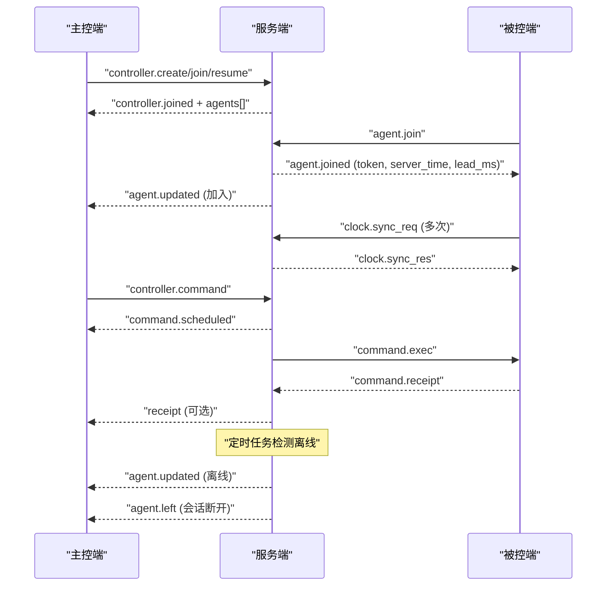
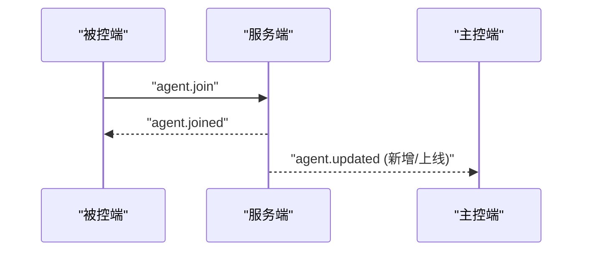
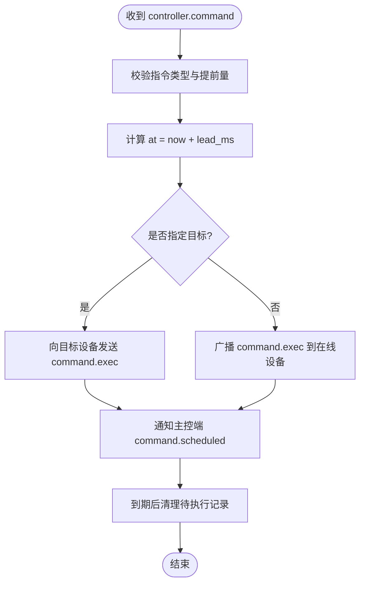
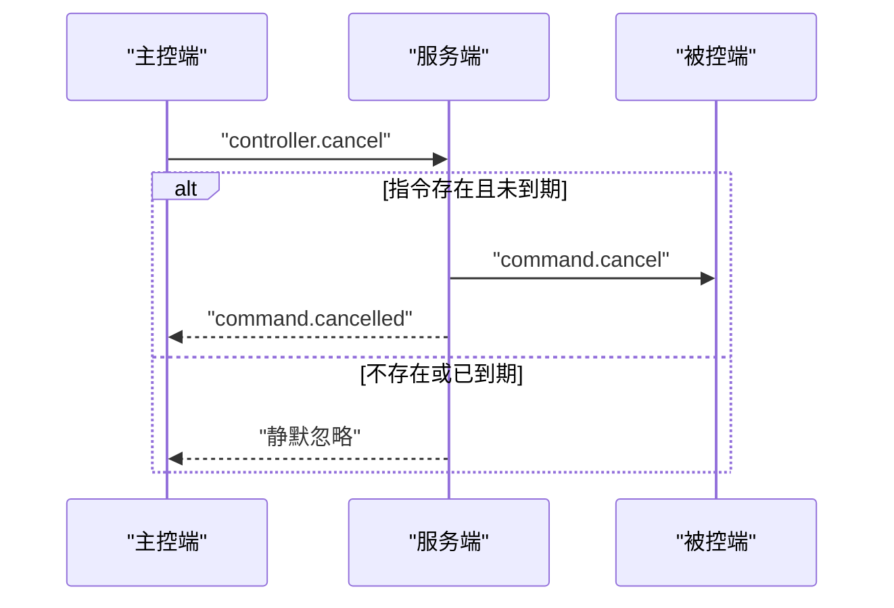
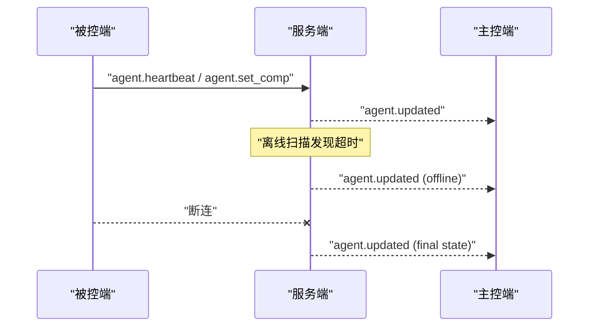
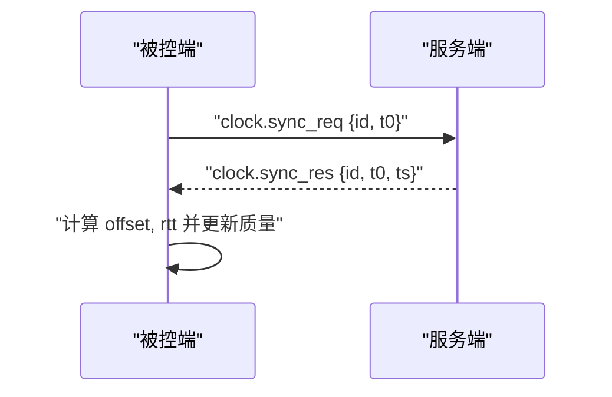
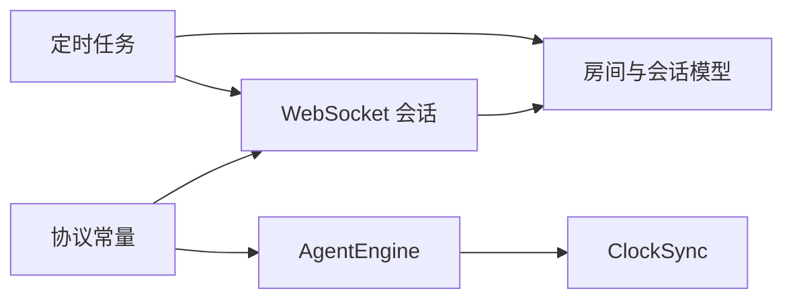

# 状态消息

<cite>
**本文引用的文件**
- [server/server/protocol.py](file://server/server/protocol.py)
- [agent/agent/protocol.py](file://agent/agent/protocol.py)
- [server/server/ws.py](file://server/server/ws.py)
- [server/server/models.py](file://server/server/models.py)
- [server/server/main.py](file://server/server/main.py)
- [agent/agent/engine.py](file://agent/agent/engine.py)
- [agent/agent/clocksync.py](file://agent/agent/clocksync.py)
</cite>

## 目录
1. [简介](#简介)
2. [项目结构](#项目结构)
3. [核心组件](#核心组件)
4. [架构总览](#架构总览)
5. [详细组件分析](#详细组件分析)
6. [依赖关系分析](#依赖关系分析)
7. [性能考虑](#性能考虑)
8. [故障排查指南](#故障排查指南)
9. [结论](#结论)
10. [附录：状态消息清单与字段说明](#附录状态消息清单与字段说明)

## 简介
本章节面向 ScriptCue 的状态消息，聚焦服务器向主控端与被控端推送的六类状态更新：设备加入确认（agent.joined）、指令调度通知（command.scheduled）、指令取消通知（command.cancelled）、设备状态更新（agent.updated）、设备离开通知（agent.left）和时钟同步响应（clock.sync_res）。文档将说明各消息的触发条件、数据结构要点、更新策略，以及整体状态同步机制与实时通信模式。

## 项目结构
- 服务端负责房间与会话管理、指令调度、心跳与离线检测、状态汇聚并推送到主控端；同时向被控端下发执行与取消指令、处理时钟同步请求。
- 被控端负责连接生命周期、时钟同步采样、精确时刻调度与回执上报，并通过心跳持续上报自身状态。
- 协议常量在两端分别定义并保持一致，确保消息类型与限制参数统一。

```mermaid
graph TB
subgraph "主控端"
C["主控端客户端"]
end
subgraph "服务端"
WS["WebSocket 会话处理"]
RM["房间与会话模型"]
MS["定时任务<br/>离线扫描/空闲销毁"]
end
subgraph "被控端"
AE["AgentEngine<br/>时钟同步/调度/回执"]
end
C < --> WS
AE < --> WS
WS --> RM
MS --> WS
MS --> RM
```

图表来源
- [server/server/ws.py:154-207](file://server/server/ws.py#L154-L207)
- [server/server/ws.py:246-327](file://server/server/ws.py#L246-L327)
- [server/server/models.py:64-117](file://server/server/models.py#L64-L117)
- [server/server/main.py:40-72](file://server/server/main.py#L40-L72)
- [agent/agent/engine.py:106-157](file://agent/agent/engine.py#L106-L157)

章节来源
- [server/server/ws.py:154-207](file://server/server/ws.py#L154-L207)
- [server/server/ws.py:246-327](file://server/server/ws.py#L246-L327)
- [server/server/models.py:64-117](file://server/server/models.py#L64-L117)
- [server/server/main.py:40-72](file://server/server/main.py#L40-L72)
- [agent/agent/engine.py:106-157](file://agent/agent/engine.py#L106-L157)

## 核心组件
- 协议常量：集中定义消息类型、指令类型、错误码、限制与默认值，保证主从端一致性。
- WebSocket 会话：统一接入点，根据首条消息区分主控端或被控端会话，分发处理。
- 房间与会话模型：维护房间成员、待执行指令、在线状态、时间戳等，提供广播与通知能力。
- AgentEngine：被控端引擎，负责连接、时钟同步、精确调度、回执上报与状态上报。
- 定时任务：周期性扫描离线设备与销毁空闲房间，驱动 agent.left 与 agent.updated 等状态。

章节来源
- [server/server/protocol.py:11-80](file://server/server/protocol.py#L11-L80)
- [agent/agent/protocol.py:9-80](file://agent/agent/protocol.py#L9-L80)
- [server/server/ws.py:154-207](file://server/server/ws.py#L154-L207)
- [server/server/ws.py:246-327](file://server/server/ws.py#L246-L327)
- [server/server/models.py:17-117](file://server/server/models.py#L17-L117)
- [agent/agent/engine.py:31-157](file://agent/agent/engine.py#L31-L157)
- [server/server/main.py:40-72](file://server/server/main.py#L40-L72)

## 架构总览
状态消息围绕“事件驱动 + 双向实时”的模式运行：
- 主控端通过 WebSocket 创建/加入房间，接收指令调度与取消通知，并订阅设备状态变化。
- 被控端加入房间后，立即进行密集时钟同步，随后周期性维持同步；通过心跳上报就绪、时钟质量、偏移、往返时延与补偿值。
- 服务端在收到指令后计算绝对执行时刻，向目标或全体在线设备下发执行指令，并向主控端返回调度结果。
- 服务端定时任务检测心跳超时，标记设备离线并通知主控端；空闲房间达到阈值自动销毁。



图表来源
- [server/server/ws.py:154-207](file://server/server/ws.py#L154-L207)
- [server/server/ws.py:246-327](file://server/server/ws.py#L246-L327)
- [server/server/main.py:40-72](file://server/server/main.py#L40-L72)
- [agent/agent/engine.py:159-192](file://agent/agent/engine.py#L159-L192)
- [agent/agent/engine.py:198-211](file://agent/agent/engine.py#L198-L211)

## 详细组件分析

### 设备加入确认（agent.joined）
- 触发条件：被控端首次发送 agent.join 成功加入房间，或旧连接被新连接顶替后重新绑定。
- 数据结构要点：包含房间码、令牌、服务器时间、补偿值、提前量等，用于被控端初始化本地时钟与调度参数。
- 更新策略：仅在被控端建立有效会话时推送一次；后续状态变化通过 agent.updated 推送。
- 相关流程：
  - 被控端发起加入，服务端校验房间与口令，分配或恢复会话，绑定 WebSocket。
  - 推送 agent.joined 给被控端，同时向主控端推送 agent.updated 以反映新增设备。



图表来源
- [server/server/ws.py:246-289](file://server/server/ws.py#L246-L289)
- [server/server/models.py:89-117](file://server/server/models.py#L89-L117)

章节来源
- [server/server/ws.py:246-289](file://server/server/ws.py#L246-L289)
- [server/server/models.py:89-117](file://server/server/models.py#L89-L117)

### 指令调度通知（command.scheduled）
- 触发条件：主控端发送 controller.command，服务端校验指令类型与提前量，计算绝对执行时刻 at，并将指令加入待执行队列。
- 数据结构要点：包含指令 ID、指令类型、执行时刻 at、提前量 lead_ms。
- 更新策略：立即返回调度结果；若指定目标设备则仅下发到该设备，否则广播到所有在线设备。
- 清理策略：指令到期且超过回执窗口后，服务端清理待执行记录。



图表来源
- [server/server/ws.py:67-115](file://server/server/ws.py#L67-L115)

章节来源
- [server/server/ws.py:67-115](file://server/server/ws.py#L67-L115)

### 指令取消通知（command.cancelled）
- 触发条件：主控端发送 controller.cancel，且指令尚未到期或未执行。
- 数据结构要点：包含指令 ID。
- 更新策略：服务端移除待执行记录，向目标或全体在线设备发送取消指令，并通知主控端取消成功。
- 边界情况：若指令不存在或已到期，静默忽略。



图表来源
- [server/server/ws.py:117-134](file://server/server/ws.py#L117-L134)

章节来源
- [server/server/ws.py:117-134](file://server/server/ws.py#L117-L134)

### 设备状态更新（agent.updated）
- 触发条件：
  - 被控端心跳上报就绪、时钟质量、偏移、往返时延、补偿值等。
  - 被控端主动设置补偿值。
  - 服务端检测到设备离线（心跳超时）。
  - 被控端会话断开（最终状态刷新）。
- 数据结构要点：包含设备会话信息（session_id、nickname、online、ready、clock_quality、clock_offset_ms、clock_rtt_ms、compensation_ms、last_seen）。
- 更新策略：每次状态变化即推送，供主控端实时展示设备列表与状态。
- 节流策略：协议中定义了状态推送节流间隔，避免高频更新导致带宽压力。



图表来源
- [server/server/ws.py:214-225](file://server/server/ws.py#L214-L225)
- [server/server/ws.py:303-313](file://server/server/ws.py#L303-L313)
- [server/server/main.py:40-51](file://server/server/main.py#L40-L51)
- [server/server/ws.py:320-327](file://server/server/ws.py#L320-L327)
- [server/server/protocol.py:75-80](file://server/server/protocol.py#L75-L80)

章节来源
- [server/server/ws.py:214-225](file://server/server/ws.py#L214-L225)
- [server/server/ws.py:303-313](file://server/server/ws.py#L303-L313)
- [server/server/main.py:40-51](file://server/server/main.py#L40-L51)
- [server/server/ws.py:320-327](file://server/server/ws.py#L320-L327)
- [server/server/protocol.py:75-80](file://server/server/protocol.py#L75-L80)

### 设备离开通知（agent.left）
- 触发条件：当前代码中并未直接推送 agent.left 消息；设备离开的语义由 agent.updated 的 final state（online=false）体现。
- 数据结构要点：同 agent.updated 的设备状态结构。
- 更新策略：会话断开时刷新设备状态为离线，并通知主控端。
- 注意：如需显式 agent.left，可在主控端基于 online=false 自行推导。

章节来源
- [server/server/ws.py:320-327](file://server/server/ws.py#L320-L327)
- [server/server/models.py:40-52](file://server/server/models.py#L40-L52)

### 时钟同步响应（clock.sync_res）
- 触发条件：被控端发送 clock.sync_req，服务端立即回复 clock.sync_res，携带请求 id、本地发出时刻 t0 与服务端时间 ts。
- 数据结构要点：id、t0、ts。
- 更新策略：被控端使用 NTP 风格算法估算 offset 与 rtt，选择 RTT 最小的新鲜样本作为可信偏移，并在心跳中上报质量等级。
- 同步节奏：加入房间后进行密集采样，随后周期性维持采样，抑制时钟漂移。



图表来源
- [server/server/ws.py:299-302](file://server/server/ws.py#L299-L302)
- [agent/agent/engine.py:198-211](file://agent/agent/engine.py#L198-L211)
- [agent/agent/clocksync.py:37-55](file://agent/agent/clocksync.py#L37-L55)
- [agent/agent/clocksync.py:66-99](file://agent/agent/clocksync.py#L66-L99)

章节来源
- [server/server/ws.py:299-302](file://server/server/ws.py#L299-L302)
- [agent/agent/engine.py:198-211](file://agent/agent/engine.py#L198-L211)
- [agent/agent/clocksync.py:37-55](file://agent/agent/clocksync.py#L37-L55)
- [agent/agent/clocksync.py:66-99](file://agent/agent/clocksync.py#L66-L99)

## 依赖关系分析
- 协议常量依赖：服务端与被控端各自维护 protocol.py，保持一致的消息类型与限制。
- WebSocket 会话依赖房间与会话模型，实现广播与通知。
- 定时任务依赖协议中的离线判定与房间 TTL，驱动状态更新。
- 被控端引擎依赖时钟同步模块，生成高质量偏移估计，支撑精确调度与回执。



图表来源
- [server/server/protocol.py:11-80](file://server/server/protocol.py#L11-L80)
- [agent/agent/protocol.py:9-80](file://agent/agent/protocol.py#L9-L80)
- [server/server/ws.py:154-207](file://server/server/ws.py#L154-L207)
- [server/server/models.py:64-117](file://server/server/models.py#L64-L117)
- [server/server/main.py:40-72](file://server/server/main.py#L40-L72)
- [agent/agent/engine.py:198-211](file://agent/agent/engine.py#L198-L211)
- [agent/agent/clocksync.py:37-55](file://agent/agent/clocksync.py#L37-L55)

章节来源
- [server/server/protocol.py:11-80](file://server/server/protocol.py#L11-L80)
- [agent/agent/protocol.py:9-80](file://agent/agent/protocol.py#L9-L80)
- [server/server/ws.py:154-207](file://server/server/ws.py#L154-L207)
- [server/server/models.py:64-117](file://server/server/models.py#L64-L117)
- [server/server/main.py:40-72](file://server/server/main.py#L40-L72)
- [agent/agent/engine.py:198-211](file://agent/agent/engine.py#L198-L211)
- [agent/agent/clocksync.py:37-55](file://agent/agent/clocksync.py#L37-L55)

## 性能考虑
- 心跳与状态上报：被控端每固定间隔上报心跳，包含时钟质量与偏移，便于服务端快速感知设备状态。
- 状态推送节流：协议定义了状态推送节流间隔，避免频繁更新造成网络拥塞。
- 指令回执窗口：指令到期后等待回执的时间窗口有限，超时后清理待执行记录，减少内存占用。
- 时钟同步采样：加入房间后密集采样，随后周期性维持，平衡精度与开销。

[本节为通用性能讨论，不直接分析具体文件]

## 故障排查指南
- 协议版本不匹配：首条消息 proto 与服务端不一致会返回错误并关闭连接。
- 房间不存在或口令错误：主控端或被控端加入失败时返回相应错误码。
- 未知消息类型：不支持的消息类型会返回错误提示。
- 设备离线：心跳超时将被标记离线并通知主控端；检查网络与被控端心跳是否正常。
- 指令未执行：若被控端时钟未同步，将无法调度并上报错误回执；检查时钟同步质量与偏移。

章节来源
- [server/server/ws.py:334-360](file://server/server/ws.py#L334-L360)
- [server/server/ws.py:67-71](file://server/server/ws.py#L67-L71)
- [server/server/ws.py:253-266](file://server/server/ws.py#L253-L266)
- [server/server/main.py:40-51](file://server/server/main.py#L40-L51)
- [agent/agent/engine.py:297-311](file://agent/agent/engine.py#L297-L311)

## 结论
ScriptCue 的状态消息体系以 WebSocket 为基础，结合心跳与定时任务，实现了主控端对设备状态的实时掌握与指令调度的可靠执行。通过严格的协议常量与两端一致的逻辑，确保了状态同步的一致性与可维护性。实际使用中应关注时钟同步质量、心跳正常与指令回执，以获得最佳体验。

[本节为总结性内容，不直接分析具体文件]

## 附录：状态消息清单与字段说明
- agent.joined（服务器 → 被控端）
  - 触发：被控端加入房间成功
  - 关键字段：room_code、token、server_time、compensation_ms、lead_ms
  - 参考路径：[server/server/ws.py:283-286](file://server/server/ws.py#L283-L286)

- command.scheduled（服务器 → 主控端）
  - 触发：主控端下发指令，服务端计算执行时刻并登记
  - 关键字段：command_id、command、at、lead_ms
  - 参考路径：[server/server/ws.py:100-103](file://server/server/ws.py#L100-L103)

- command.cancelled（服务器 → 主控端）
  - 触发：主控端取消指令且指令未到期
  - 关键字段：command_id
  - 参考路径：[server/server/ws.py:125-134](file://server/server/ws.py#L125-L134)

- agent.updated（服务器 → 主控端）
  - 触发：心跳上报、补偿值变更、离线检测、会话断开
  - 关键字段：agent（含 session_id、nickname、online、ready、clock_quality、clock_offset_ms、clock_rtt_ms、compensation_ms、last_seen）
  - 参考路径：[server/server/ws.py:214-225](file://server/server/ws.py#L214-L225)、[server/server/ws.py:303-313](file://server/server/ws.py#L303-L313)、[server/server/main.py:40-51](file://server/server/main.py#L40-L51)、[server/server/ws.py:320-327](file://server/server/ws.py#L320-L327)、[server/server/models.py:40-52](file://server/server/models.py#L40-L52)

- agent.left（服务器 → 主控端）
  - 触发：当前实现未直接推送此消息；设备离开的语义通过 agent.updated 的 online=false 表达
  - 关键字段：同 agent.updated
  - 参考路径：[server/server/ws.py:320-327](file://server/server/ws.py#L320-L327)、[server/server/models.py:40-52](file://server/server/models.py#L40-L52)

- clock.sync_res（服务器 → 被控端）
  - 触发：被控端发送时钟同步请求
  - 关键字段：id、t0、ts
  - 参考路径：[server/server/ws.py:299-302](file://server/server/ws.py#L299-L302)

章节来源
- [server/server/ws.py:283-286](file://server/server/ws.py#L283-L286)
- [server/server/ws.py:100-103](file://server/server/ws.py#L100-L103)
- [server/server/ws.py:125-134](file://server/server/ws.py#L125-L134)
- [server/server/ws.py:214-225](file://server/server/ws.py#L214-L225)
- [server/server/ws.py:303-313](file://server/server/ws.py#L303-L313)
- [server/server/main.py:40-51](file://server/server/main.py#L40-L51)
- [server/server/ws.py:320-327](file://server/server/ws.py#L320-L327)
- [server/server/models.py:40-52](file://server/server/models.py#L40-L52)
- [server/server/ws.py:299-302](file://server/server/ws.py#L299-L302)