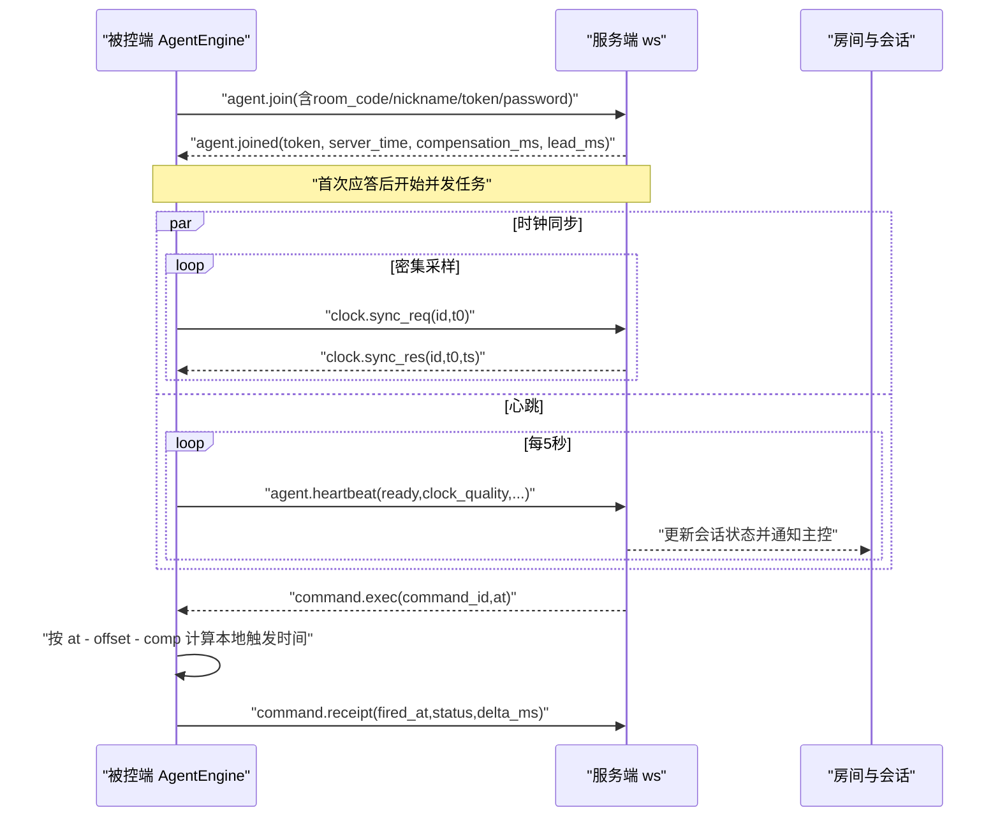
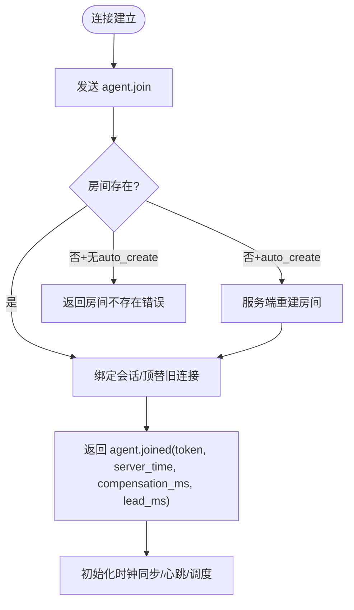
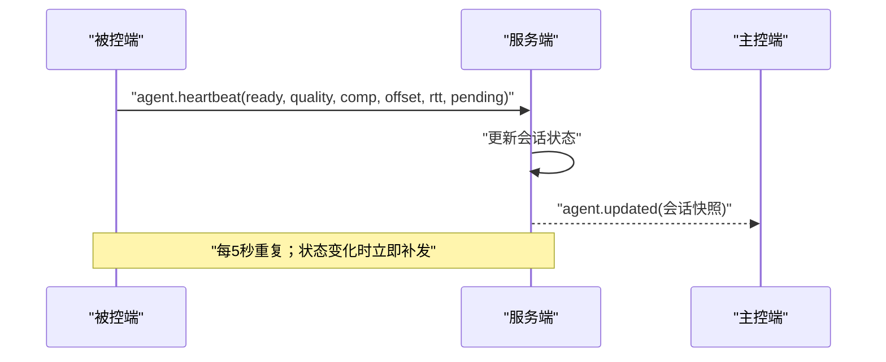
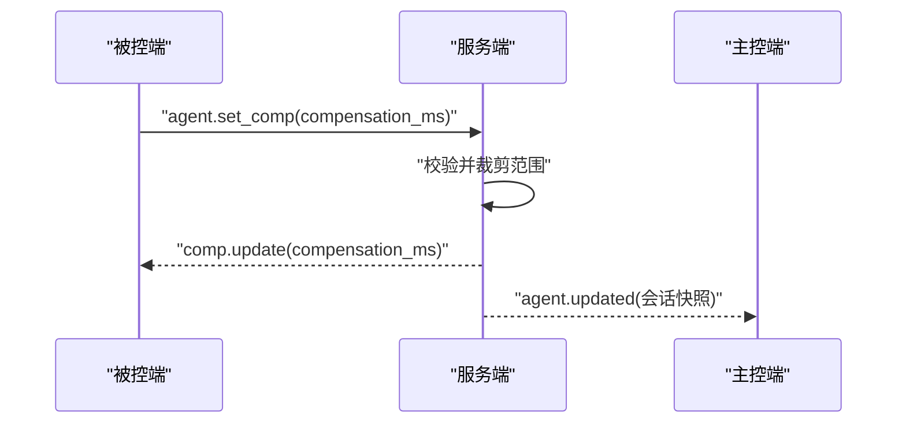
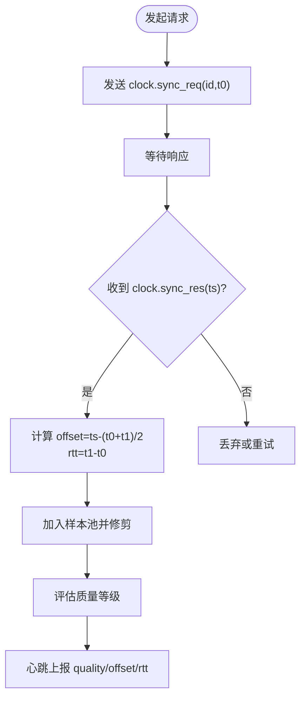
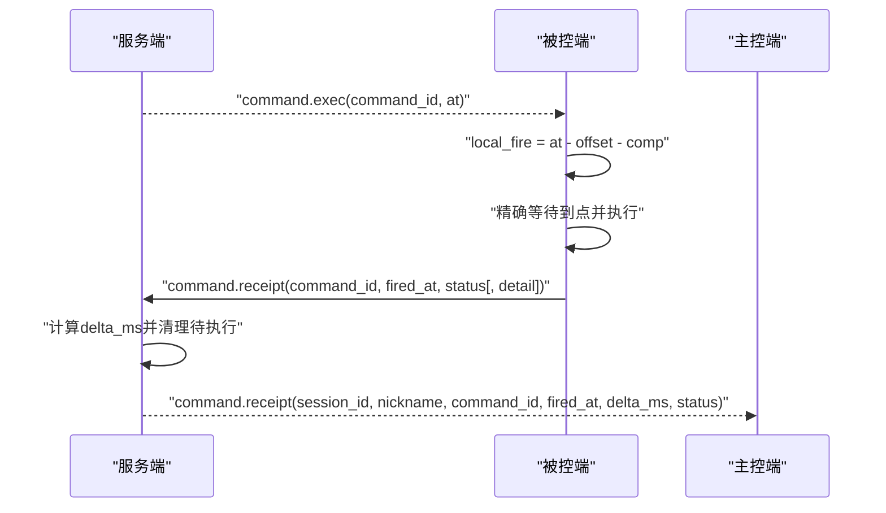
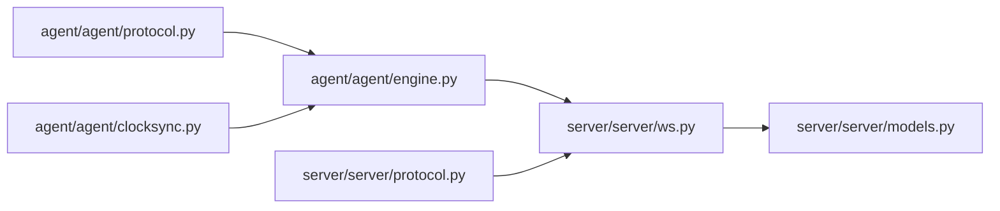

# 被控端消息

<cite>
**本文引用的文件**
- [agent/agent/protocol.py](file://agent/agent/protocol.py)
- [server/server/protocol.py](file://server/server/protocol.py)
- [agent/agent/engine.py](file://agent/agent/engine.py)
- [agent/agent/clocksync.py](file://agent/agent/clocksync.py)
- [server/server/ws.py](file://server/server/ws.py)
- [server/server/models.py](file://server/server/models.py)
- [README.md](file://README.md)
</cite>

## 目录
1. [简介](#简介)
2. [项目结构](#项目结构)
3. [核心组件](#核心组件)
4. [架构总览](#架构总览)
5. [详细组件分析](#详细组件分析)
6. [依赖关系分析](#依赖关系分析)
7. [性能考量](#性能考量)
8. [故障排查指南](#故障排查指南)
9. [结论](#结论)

## 简介
本文档聚焦于 ScriptCue 被控端（Agent）向服务器发送的消息类型与行为，覆盖以下五种消息：
- 设备加入 agent.join
- 心跳检测 agent.heartbeat
- 设置补偿 agent.set_comp
- 时钟同步请求 clock.sync_req
- 指令回执 command.receipt

文档将逐一说明每个消息的字段格式、发送时机、数据校验规则与业务逻辑；并解释心跳机制、时钟同步流程以及指令执行确认过程。

## 项目结构
本项目由服务端、主控端与被控端三部分构成。被控端通过 WebSocket 与服务端通信，使用类 NTP 的时钟同步实现高精度绝对时刻调度。

```mermaid
graph TB
subgraph "被控端"
A_engine["AgentEngine<br/>连接/心跳/调度"]
A_clock["ClockSync<br/>NTP式采样"]
A_proto["协议常量<br/>消息类型/限制"]
end
subgraph "服务端"
S_ws["WebSocket会话处理<br/>路由/鉴权/广播"]
S_models["房间与会话模型<br/>状态聚合"]
S_proto["协议常量<br/>权威定义"]
end
A_engine --> A_clock
A_engine --> A_proto
A_engine < --> S_ws
S_ws --> S_models
S_ws --> S_proto
```

图表来源
- [agent/agent/engine.py:31-157](file://agent/agent/engine.py#L31-L157)
- [agent/agent/clocksync.py:29-106](file://agent/agent/clocksync.py#L29-L106)
- [agent/agent/protocol.py:23-39](file://agent/agent/protocol.py#L23-L39)
- [server/server/ws.py:246-327](file://server/server/ws.py#L246-L327)
- [server/server/models.py:17-117](file://server/server/models.py#L17-L117)
- [server/server/protocol.py:25-41](file://server/server/protocol.py#L25-L41)

章节来源
- [README.md:16-27](file://README.md#L16-L27)

## 核心组件
- AgentEngine：负责连接生命周期、时钟同步任务、心跳循环、绝对时刻调度与回执上报。
- ClockSync：实现类 NTP 的时钟偏移估算与质量分级，维护样本池与老化策略。
- 服务端 ws 模块：解析首条消息区分角色，处理被控端消息（心跳、补偿、回执、授时），并维护房间与会话状态。
- 协议常量：两端共享的消息类型、错误码、限制参数等。

章节来源
- [agent/agent/engine.py:31-157](file://agent/agent/engine.py#L31-L157)
- [agent/agent/clocksync.py:29-106](file://agent/agent/clocksync.py#L29-L106)
- [server/server/ws.py:246-327](file://server/server/ws.py#L246-L327)
- [server/server/protocol.py:25-80](file://server/server/protocol.py#L25-L80)
- [agent/agent/protocol.py:23-80](file://agent/agent/protocol.py#L23-L80)

## 架构总览
被控端启动后建立 WebSocket 连接到服务端，首条消息为 agent.join 完成入房与鉴权。随后并行运行：
- 密集时钟同步：连续发送若干次 clock.sync_req，快速收敛偏移。
- 维持性时钟同步：周期性发送 clock.sync_req，抑制漂移。
- 心跳循环：每固定间隔发送 agent.heartbeat，携带就绪状态、时钟质量、补偿值、偏移与 RTT、当前待执行命令等信息。
- 指令执行：收到 server→agent 的 command.exec 后，按绝对时刻精确触发，并在完成后发送 command.receipt 回执。



图表来源
- [agent/agent/engine.py:159-193](file://agent/agent/engine.py#L159-L193)
- [agent/agent/engine.py:198-212](file://agent/agent/engine.py#L198-L212)
- [agent/agent/engine.py:217-245](file://agent/agent/engine.py#L217-L245)
- [agent/agent/engine.py:297-379](file://agent/agent/engine.py#L297-L379)
- [server/server/ws.py:246-327](file://server/server/ws.py#L246-L327)

## 详细组件分析

### 消息一：设备加入 agent.join
- 发送时机
  - 被控端建立 WebSocket 连接后立即发送，作为首条消息。
- 字段格式
  - type: "agent.join"
  - room_code: 字符串，房间码（大写）
  - nickname: 字符串，设备昵称
  - password: 可选，房间口令
  - token: 可选，用于重连恢复会话
  - auto_create: 可选，布尔，允许服务端在房间不存在时自动重建
  - room_name: 可选，配合 auto_create 指定房间名
- 数据验证
  - 服务端要求首条消息为 JSON 对象且 proto 版本匹配，否则返回错误。
  - 若房间不存在且未开启 auto_create，返回“房间不存在”错误。
  - 若房间存在且设置了口令，需密码正确。
- 业务逻辑
  - 服务端创建或查找房间与会话，绑定 WebSocket，返回 agent.joined，包含 token、server_time、compensation_ms、lead_ms。
  - 被控端记录 token、补偿值、提前量，重置时钟同步样本，标记已加入。
  - 若因服务器重启导致房间丢失，被控端下次重连可启用 auto_create 自动恢复。



图表来源
- [server/server/ws.py:334-360](file://server/server/ws.py#L334-L360)
- [server/server/ws.py:246-289](file://server/server/ws.py#L246-L289)
- [agent/agent/engine.py:159-193](file://agent/agent/engine.py#L159-L193)

章节来源
- [agent/agent/engine.py:159-193](file://agent/agent/engine.py#L159-L193)
- [server/server/ws.py:246-289](file://server/server/ws.py#L246-L289)
- [server/server/ws.py:334-360](file://server/server/ws.py#L334-L360)

### 消息二：心跳检测 agent.heartbeat
- 发送时机
  - 每固定间隔（默认 5 秒）发送一次；当就绪状态变化时立即补发一次。
- 字段格式
  - type: "agent.heartbeat"
  - ready: 布尔，是否就绪
  - clock_quality: 枚举，时钟质量等级（excellent/good/poor/none）
  - compensation_ms: 整数毫秒，当前补偿值
  - clock_offset_ms: 浮点毫秒，最近一次偏移估计（可选）
  - clock_rtt_ms: 浮点毫秒，最近一次往返时延（可选）
  - pending_command: 字符串，当前等待触发的命令 ID（可选）
- 数据验证
  - 服务端接收后校验字段类型，更新会话状态并推送给主控端。
- 业务逻辑
  - 被控端从 ClockSync 获取质量、偏移、RTT，结合本地补偿值与待执行命令信息组装心跳。
  - 服务端根据心跳更新在线状态、就绪状态、时钟质量、偏移与 RTT，并通知主控端。
  - 心跳间隔与离线判定阈值在服务端配置中定义，用于判断设备是否离线。



图表来源
- [agent/agent/engine.py:217-245](file://agent/agent/engine.py#L217-L245)
- [server/server/ws.py:214-226](file://server/server/ws.py#L214-L226)
- [server/server/protocol.py:75-79](file://server/server/protocol.py#L75-L79)

章节来源
- [agent/agent/engine.py:217-245](file://agent/agent/engine.py#L217-L245)
- [server/server/ws.py:214-226](file://server/server/ws.py#L214-L226)
- [server/server/protocol.py:75-79](file://server/server/protocol.py#L75-L79)

### 消息三：设置补偿 agent.set_comp
- 发送时机
  - 被控端本地修改补偿值后立即上报，以让服务器与主控端感知最新补偿。
- 字段格式
  - type: "agent.set_comp"
  - compensation_ms: 整数毫秒，新补偿值
- 数据验证
  - 服务端对补偿值进行范围裁剪（例如 -10000~10000 毫秒），非法输入返回错误。
- 业务逻辑
  - 服务端更新会话补偿值，回推 COMP_UPDATE 给被控端确认，同时通知主控端设备状态变更。
  - 被控端收到 COMP_UPDATE 后更新本地补偿值，便于后续绝对时刻换算。



图表来源
- [agent/agent/engine.py:71-75](file://agent/agent/engine.py#L71-L75)
- [server/server/ws.py:305-315](file://server/server/ws.py#L305-L315)
- [server/server/ws.py:137-152](file://server/server/ws.py#L137-L152)

章节来源
- [agent/agent/engine.py:71-75](file://agent/agent/engine.py#L71-L75)
- [server/server/ws.py:305-315](file://server/server/ws.py#L305-L315)
- [server/server/ws.py:137-152](file://server/server/ws.py#L137-L152)

### 消息四：时钟同步请求 clock.sync_req
- 发送时机
  - 加入房间后立即密集发送若干次（如 20 次，间隔 50ms），快速收敛偏移。
  - 之后每隔固定时间（如 30 秒）发送一次，维持性采样抑制漂移。
- 字段格式
  - type: "clock.sync_req"
  - id: 自增请求 ID
  - t0: 本地发出时刻（毫秒）
- 数据验证
  - 服务端不做强校验，直接原样返回 id/t0，并附加服务器当前时间 ts。
- 业务逻辑
  - 被控端收到 clock.sync_res 后计算偏移 offset = ts - (t0 + t1)/2，rtt = t1 - t0，加入样本池。
  - 样本池按 RTT 排序保留最优一批，并带时间戳老化，避免陈旧样本主导。
  - 质量分级依据新鲜样本数量与最佳 RTT，上报到心跳。



图表来源
- [agent/agent/clocksync.py:37-55](file://agent/agent/clocksync.py#L37-L55)
- [agent/agent/clocksync.py:57-99](file://agent/agent/clocksync.py#L57-L99)
- [agent/agent/engine.py:198-212](file://agent/agent/engine.py#L198-L212)
- [server/server/ws.py:299-303](file://server/server/ws.py#L299-L303)

章节来源
- [agent/agent/clocksync.py:37-99](file://agent/agent/clocksync.py#L37-L99)
- [agent/agent/engine.py:198-212](file://agent/agent/engine.py#L198-L212)
- [server/server/ws.py:299-303](file://server/server/ws.py#L299-L303)

### 消息五：指令回执 command.receipt
- 发送时机
  - 被控端收到 command.exec 后，按绝对时刻精确触发；无论成功或失败，均上报回执。
  - 若时钟未同步，无法调度，则立即上报错误回执。
- 字段格式
  - type: "command.receipt"
  - command_id: 字符串，指令 ID
  - fired_at: 浮点/整数毫秒，换算到服务器时钟的执行时刻
  - status: 字符串，"ok" 或 "error"
  - detail: 可选，错误详情
- 数据验证
  - 服务端校验回执中的 command_id 是否存在于待执行队列，计算 delta_ms 并通知主控端。
- 业务逻辑
  - 被控端将服务器时刻 at 转换为本地触发时间 local_fire = at - offset - compensation_ms，等待到点后执行动作（如按键注入）。
  - 执行完成后，将实际触发时刻换算为服务器时钟（fired_at = actual_local + offset），上报回执。
  - 服务端清理待执行记录，并将回执转发给主控端，审计日志记录。



图表来源
- [agent/agent/engine.py:297-379](file://agent/agent/engine.py#L297-L379)
- [server/server/ws.py:228-243](file://server/server/ws.py#L228-L243)

章节来源
- [agent/agent/engine.py:297-379](file://agent/agent/engine.py#L297-L379)
- [server/server/ws.py:228-243](file://server/server/ws.py#L228-L243)

## 依赖关系分析
- 被控端依赖协议常量定义消息类型与限制，依赖 ClockSync 提供时钟偏移与质量评估，依赖调度器实现精确等待。
- 服务端依赖房间与会话模型管理在线设备、待执行指令与状态聚合，依赖协议常量统一消息语义。
- 心跳与回执形成闭环：心跳持续上报设备健康与时钟质量；回执确认指令执行结果，供主控端监控。



图表来源
- [agent/agent/protocol.py:23-80](file://agent/agent/protocol.py#L23-L80)
- [server/server/protocol.py:25-80](file://server/server/protocol.py#L25-L80)
- [agent/agent/engine.py:19-23](file://agent/agent/engine.py#L19-L23)
- [server/server/ws.py:15-18](file://server/server/ws.py#L15-L18)

章节来源
- [agent/agent/engine.py:19-23](file://agent/agent/engine.py#L19-L23)
- [server/server/ws.py:15-18](file://server/server/ws.py#L15-L18)

## 性能考量
- 心跳间隔与离线判定：心跳间隔较短（默认 5 秒），服务端基于多次心跳无响应判定离线，避免频繁误判。
- 时钟同步采样：密集采样快速收敛，维持性采样抑制漂移；样本池大小与老化窗口平衡精度与内存占用。
- 指令回执超时：服务端在指令到期后设置回执等待窗口，超时清理待执行记录，防止资源泄漏。
- 节流与限流：补偿值范围限制、房间人数上限、提前量范围限制，保障系统稳定性。

[本节为通用性能讨论，不直接分析具体文件]

## 故障排查指南
- 首条消息非 JSON 或协议版本不匹配：服务端返回 bad_message/bad_proto，检查客户端连接与协议常量版本。
- 房间不存在或口令错误：检查房间码与密码，必要时启用 auto_create 自动恢复。
- 时钟未同步导致跳过触发：检查 clock.sync_req 是否持续收到响应，观察心跳中的 clock_quality 与 offset/rtt。
- 补偿值非法：确保 compensation_ms 为整数且在允许范围内。
- 指令回执缺失：检查 command.exec 是否下发成功，确认被控端是否按时触发并上报回执；服务端会在回执窗口后清理待执行记录。

章节来源
- [server/server/ws.py:334-360](file://server/server/ws.py#L334-L360)
- [server/server/ws.py:246-327](file://server/server/ws.py#L246-L327)
- [agent/agent/engine.py:297-379](file://agent/agent/engine.py#L297-L379)

## 结论
被控端通过 agent.join 完成入房与鉴权，随后以心跳与时钟同步维持连接健康与时钟对齐；指令执行采用绝对时刻调度，确保多设备在高抖动网络下的同步精度；command.receipt 形成执行确认闭环，使主控端可实时监控设备状态与指令执行情况。整体设计解耦清晰、容错完善，适合大屏与多台口述员设备的协同场景。

[本节为总结性内容，不直接分析具体文件]