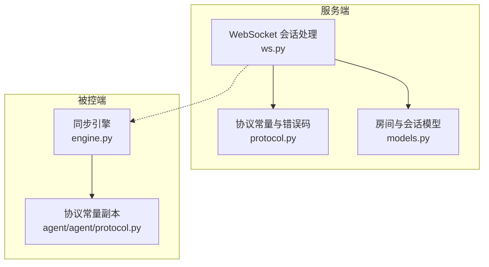
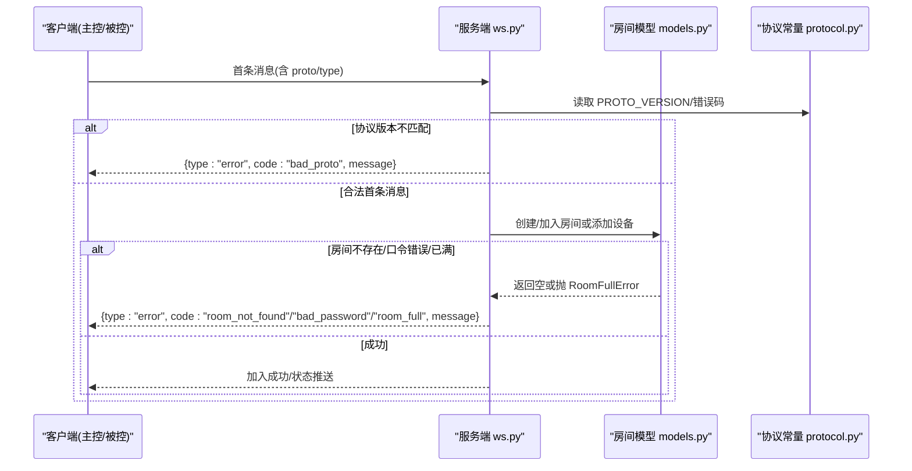
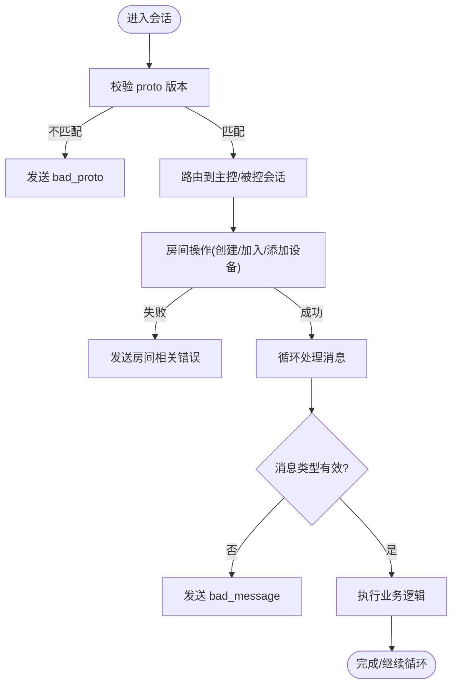
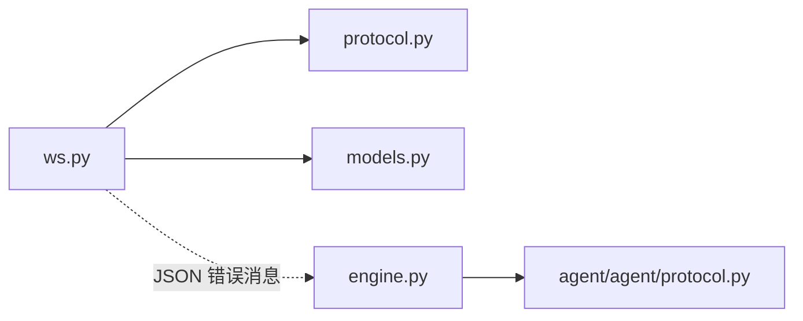

# 错误处理

<cite>
**本文引用的文件**
- [server/server/protocol.py](file://server/server/protocol.py)
- [agent/agent/protocol.py](file://agent/agent/protocol.py)
- [server/server/ws.py](file://server/server/ws.py)
- [server/server/models.py](file://server/server/models.py)
- [agent/agent/engine.py](file://agent/agent/engine.py)
- [README.md](file://README.md)
</cite>

## 目录
1. [简介](#简介)
2. [项目结构](#项目结构)
3. [核心组件](#核心组件)
4. [架构总览](#架构总览)
5. [详细组件分析](#详细组件分析)
6. [依赖关系分析](#依赖关系分析)
7. [性能考虑](#性能考虑)
8. [故障排查指南](#故障排查指南)
9. [结论](#结论)
10. [附录](#附录)

## 简介
本文件系统化梳理 ScriptCue 的错误处理机制，覆盖错误类型定义、错误码分类与消息格式、错误传播路径、客户端（主控端与被控端）错误处理策略、调试技巧以及常见错误的排查方法。目标是帮助开发者与运维人员快速定位并解决协议版本不匹配、房间相关错误、权限错误、指令错误、设备错误和消息格式错误等问题。

## 项目结构
ScriptCue 由服务端、主控端网页与被控端组成。错误处理的核心集中在服务端的 WebSocket 会话处理与协议常量定义，被控端通过引擎接收并上报错误事件。

图表来源
- [server/server/ws.py:1-360](file://server/server/ws.py#L1-L360)
- [server/server/protocol.py:1-80](file://server/server/protocol.py#L1-L80)
- [server/server/models.py:1-157](file://server/server/models.py#L1-L157)
- [agent/agent/engine.py:1-388](file://agent/agent/engine.py#L1-L388)
- [agent/agent/protocol.py:1-80](file://agent/agent/protocol.py#L1-L80)

章节来源
- [README.md:1-86](file://README.md#L1-L86)

## 核心组件
- 协议常量与错误码：集中定义消息类型、指令类型、错误码等，确保两端一致。
- WebSocket 会话处理：统一入口，校验首条消息、路由到主控或被控会话，发送错误消息。
- 房间与会话模型：管理房间生命周期、成员上限、令牌与会话绑定，抛出房间满等异常。
- 被控端同步引擎：连接生命周期、时钟同步、指令调度与回执；将服务端错误转换为本地事件。

章节来源
- [server/server/protocol.py:1-80](file://server/server/protocol.py#L1-L80)
- [server/server/ws.py:1-360](file://server/server/ws.py#L1-L360)
- [server/server/models.py:1-157](file://server/server/models.py#L1-L157)
- [agent/agent/engine.py:1-388](file://agent/agent/engine.py#L1-L388)
- [agent/agent/protocol.py:1-80](file://agent/agent/protocol.py#L1-L80)

## 架构总览
错误在系统中的传播遵循“服务端统一构造 → JSON 错误消息 → 客户端解析并响应”的模式。

图表来源
- [server/server/ws.py:334-360](file://server/server/ws.py#L334-L360)
- [server/server/ws.py:154-207](file://server/server/ws.py#L154-L207)
- [server/server/ws.py:246-327](file://server/server/ws.py#L246-L327)
- [server/server/protocol.py:57-65](file://server/server/protocol.py#L57-L65)
- [server/server/models.py:89-95](file://server/server/models.py#L89-L95)

## 详细组件分析

### 错误类型与消息格式
- 所有错误以统一的消息结构返回：包含 type、code、message 字段。
- type 固定为 "error"。
- code 使用协议中定义的字符串错误码。
- message 为可读的人类语言描述，便于前端展示与日志记录。

章节来源
- [server/server/ws.py:37-39](file://server/server/ws.py#L37-L39)
- [server/server/protocol.py:43-65](file://server/server/protocol.py#L43-L65)
- [agent/agent/protocol.py:41-63](file://agent/agent/protocol.py#L41-L63)

### 错误码分类与触发场景
- 协议版本错误（bad_proto）
  - 触发点：首条消息的 proto 与服务端期望不一致。
  - 影响：立即拒绝连接，要求客户端升级或降级至兼容版本。
  - 参考位置：[server/server/ws.py:349-351](file://server/server/ws.py#L349-L351)

- 房间相关错误
  - room_not_found：房间不存在或会话失效（主控恢复时 token 不匹配）。
    - 参考位置：[server/server/ws.py:162-173](file://server/server/ws.py#L162-L173), [server/server/ws.py:253-260](file://server/server/ws.py#L253-L260)
  - bad_password：房间设置了口令但提供的口令不正确。
    - 参考位置：[server/server/ws.py:166-168](file://server/server/ws.py#L166-L168), [server/server/ws.py:262-266](file://server/server/ws.py#L262-L266)
  - room_full：房间内设备数达到上限。
    - 参考位置：[server/server/models.py:89-95](file://server/server/models.py#L89-L95), [server/server/ws.py:271-274](file://server/server/ws.py#L271-L274)

- 权限错误（not_controller）
  - 当前代码路径未直接使用该错误码；若未来需要限制非控制器操作，可在此处扩展。
  - 建议：在控制器专属接口增加权限校验后返回该错误码。

- 指令错误（bad_command）
  - 触发点：主控下发 command 不在允许集合内；或补偿值参数非法。
  - 参考位置：[server/server/ws.py:67-71](file://server/server/ws.py#L67-L71), [server/server/ws.py:142-146](file://server/server/ws.py#L142-L146)

- 设备错误（no_such_agent）
  - 触发点：指定 target 的设备不存在；设置补偿时目标 session 不存在。
  - 参考位置：[server/server/ws.py:81-85](file://server/server/ws.py#L81-L85), [server/server/ws.py:137-141](file://server/server/ws.py#L137-L141)

- 消息格式错误（bad_message）
  - 触发点：首条消息非 JSON 对象；后续消息类型不被支持；JSON 解析失败；参数类型/范围非法。
  - 参考位置：[server/server/ws.py:50-60](file://server/server/ws.py#L50-L60), [server/server/ws.py:338-347](file://server/server/ws.py#L338-L347), [server/server/ws.py:199-201](file://server/server/ws.py#L199-L201), [server/server/ws.py:318-319](file://server/server/ws.py#L318-L319)

章节来源
- [server/server/ws.py:50-60](file://server/server/ws.py#L50-L60)
- [server/server/ws.py:67-85](file://server/server/ws.py#L67-L85)
- [server/server/ws.py:137-146](file://server/server/ws.py#L137-L146)
- [server/server/ws.py:154-207](file://server/server/ws.py#L154-L207)
- [server/server/ws.py:246-327](file://server/server/ws.py#L246-L327)
- [server/server/protocol.py:57-65](file://server/server/protocol.py#L57-L65)
- [server/server/models.py:89-95](file://server/server/models.py#L89-L95)

### 错误传播机制
- 服务端统一通过 _send_error 构造并发送错误消息，保证格式一致。
- 首条消息阶段进行协议版本校验，不匹配则立即返回 bad_proto。
- 房间与会话阶段根据业务规则返回具体错误码。
- 被控端引擎收到 error 类型消息后，通过 on_event 回调上报给上层应用，便于 UI 展示与重试逻辑。

图表来源
- [server/server/ws.py:334-360](file://server/server/ws.py#L334-L360)
- [server/server/ws.py:154-207](file://server/server/ws.py#L154-L207)
- [server/server/ws.py:246-327](file://server/server/ws.py#L246-L327)

章节来源
- [server/server/ws.py:37-39](file://server/server/ws.py#L37-L39)
- [server/server/ws.py:334-360](file://server/server/ws.py#L334-L360)

### 客户端错误处理策略
- 主控端（网页）
  - 监听 error 消息，根据 code 显示友好提示。
  - 对 bad_proto：提示升级或切换版本。
  - 对 room_not_found/bad_password：引导重新创建或检查口令。
  - 对 bad_command/no_such_agent：提示修正指令或选择正确设备。
  - 对 bad_message：检查请求体结构与字段类型。

- 被控端（Python 引擎）
  - 在加入房间阶段遇到 error 会抛出 ConnectionError，上层捕获后可触发重连或自动重建房间。
  - 收到 error 类型消息时，通过 on_event 上报 {event:"error", code, message}，供 GUI/CLI 展示。
  - 对于时钟未同步导致的执行失败，引擎主动上报 CMD_RECEIPT 状态为 error，并附带 detail。

章节来源
- [agent/agent/engine.py:159-193](file://agent/agent/engine.py#L159-L193)
- [agent/agent/engine.py:268-292](file://agent/agent/engine.py#L268-L292)
- [agent/agent/engine.py:297-311](file://agent/agent/engine.py#L297-L311)

### 调试技巧
- 启用日志：服务端使用 logging 输出错误上下文；被控端通过 on_event 收集错误事件。
- 抓包验证：确认首条消息是否包含正确的 proto 与 type；检查 JSON 结构是否符合预期。
- 最小化复现：先测试 join/create，再逐步引入 command/target/compensation 等参数。
- 时间相关：关注 lead_ms 与补偿值范围，避免超出允许区间导致 bad_command。
- 房间状态：查看 agent 列表与在线状态，确认 no_such_agent 是否因设备离线或已顶替。

章节来源
- [server/server/ws.py:20-21](file://server/server/ws.py#L20-L21)
- [agent/agent/engine.py:25-26](file://agent/agent/engine.py#L25-L26)
- [server/server/ws.py:26-27](file://server/server/ws.py#L26-L27)

## 依赖关系分析
- 服务端 ws.py 依赖 protocol.py 中的错误码与消息类型，依赖 models.py 的房间与会话能力。
- 被控端 engine.py 依赖 agent/agent/protocol.py 的常量副本，用于识别错误码与消息类型。
- 错误传播链路清晰：ws.py 构造错误 → JSON 传输 → engine.py 解析并上报。

图表来源
- [server/server/ws.py:1-360](file://server/server/ws.py#L1-L360)
- [server/server/protocol.py:1-80](file://server/server/protocol.py#L1-L80)
- [server/server/models.py:1-157](file://server/server/models.py#L1-L157)
- [agent/agent/engine.py:1-388](file://agent/agent/engine.py#L1-L388)
- [agent/agent/protocol.py:1-80](file://agent/agent/protocol.py#L1-L80)

章节来源
- [server/server/ws.py:1-360](file://server/server/ws.py#L1-L360)
- [server/server/protocol.py:1-80](file://server/server/protocol.py#L1-L80)
- [server/server/models.py:1-157](file://server/server/models.py#L1-L157)
- [agent/agent/engine.py:1-388](file://agent/agent/engine.py#L1-L388)
- [agent/agent/protocol.py:1-80](file://agent/agent/protocol.py#L1-L80)

## 性能考虑
- 错误消息轻量：仅包含必要字段，减少网络开销。
- 节流与超时：心跳与回执窗口控制错误反馈频率，避免风暴。
- 房间空闲销毁：降低无效房间占用资源，间接减少错误分支。

[本节提供一般性指导，无需特定文件引用]

## 故障排查指南
- bad_proto
  - 现象：连接后立即断开，提示协议版本不匹配。
  - 排查：检查客户端与服务端协议版本常量是否一致；确认首条消息包含正确的 proto。
  - 解决：升级客户端或服务端至同一版本。

- room_not_found
  - 现象：加入房间失败，提示房间不存在或会话失效。
  - 排查：确认房间码大小写与存在性；主控恢复时 token 是否仍有效。
  - 解决：重新创建房间或使用新 token 加入。

- bad_password
  - 现象：口令错误。
  - 排查：核对房间口令配置与客户端传入值。
  - 解决：修正口令或移除口令保护。

- room_full
  - 现象：设备数已达上限。
  - 排查：查看房间内在线设备数量。
  - 解决：清理离线设备或扩容房间上限（需修改协议常量并部署）。

- not_controller
  - 现象：当前代码未直接使用；如新增控制器专属接口，应在此处校验权限。
  - 建议：在控制器专用命令前增加权限检查，失败返回 not_controller。

- bad_command
  - 现象：未知指令或参数非法。
  - 排查：检查 command 是否在允许集合；lead_ms/compensation_ms 是否在允许范围。
  - 解决：修正指令或调整参数范围。

- no_such_agent
  - 现象：目标设备不存在。
  - 排查：确认 target/session_id 是否存在且在线；是否有旧连接被顶替。
  - 解决：选择正确设备或等待设备上线。

- bad_message
  - 现象：首条消息非 JSON 对象；消息类型不支持；参数类型/范围非法。
  - 排查：打印原始消息；校验 JSON 结构与字段类型。
  - 解决：修正消息格式与参数。

章节来源
- [server/server/ws.py:50-60](file://server/server/ws.py#L50-L60)
- [server/server/ws.py:67-85](file://server/server/ws.py#L67-L85)
- [server/server/ws.py:137-146](file://server/server/ws.py#L137-L146)
- [server/server/ws.py:154-207](file://server/server/ws.py#L154-L207)
- [server/server/ws.py:246-327](file://server/server/ws.py#L246-L327)
- [server/server/protocol.py:57-65](file://server/server/protocol.py#L57-L65)
- [server/server/models.py:89-95](file://server/server/models.py#L89-L95)
- [agent/agent/engine.py:159-193](file://agent/agent/engine.py#L159-L193)
- [agent/agent/engine.py:268-292](file://agent/agent/engine.py#L268-L292)

## 结论
ScriptCue 的错误处理以协议常量为中心，服务端统一构造错误消息，客户端按错误码采取相应策略。通过清晰的错误分类与传播路径，系统能够在协议版本不匹配、房间异常、权限不足、指令非法、设备不存在与消息格式错误等场景下给出明确反馈。结合日志与事件上报，可有效提升问题定位效率与用户体验。

## 附录
- 协议文档与常量维护：修改协议时需同步更新服务端与被控端常量，并递增 PROTO_VERSION。
- 环境变量：DEFAULT_LEAD_MS 可通过环境变量配置，影响指令提前量默认值。

章节来源
- [server/server/protocol.py:72-73](file://server/server/protocol.py#L72-L73)
- [README.md:81-85](file://README.md#L81-L85)