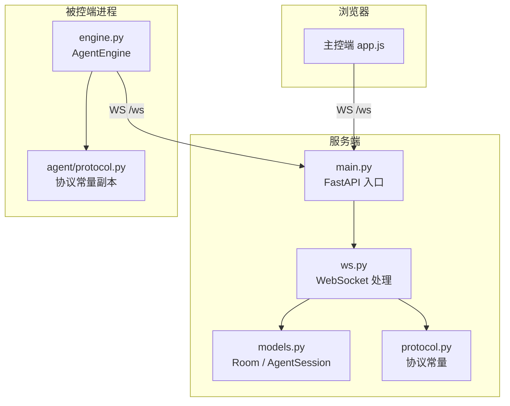
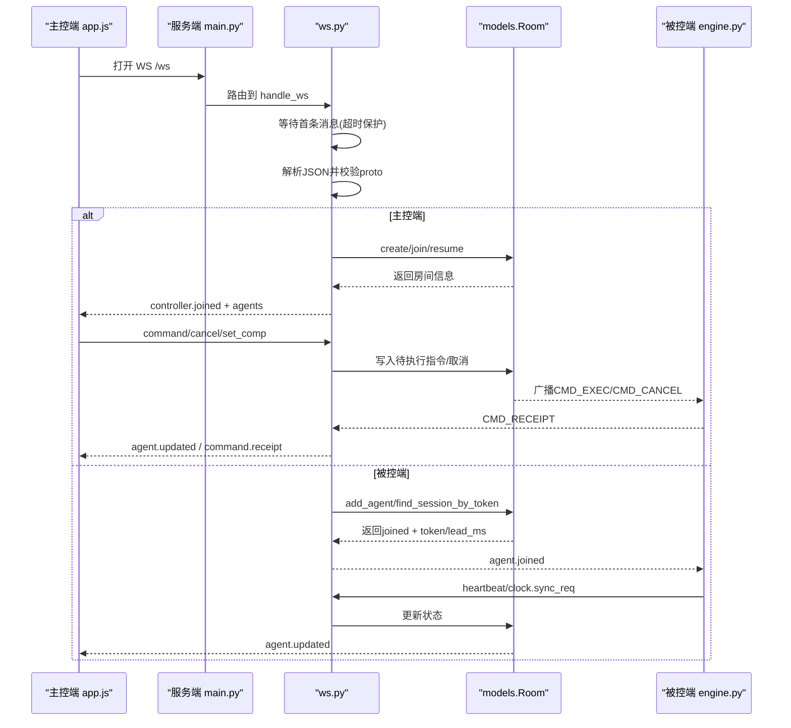
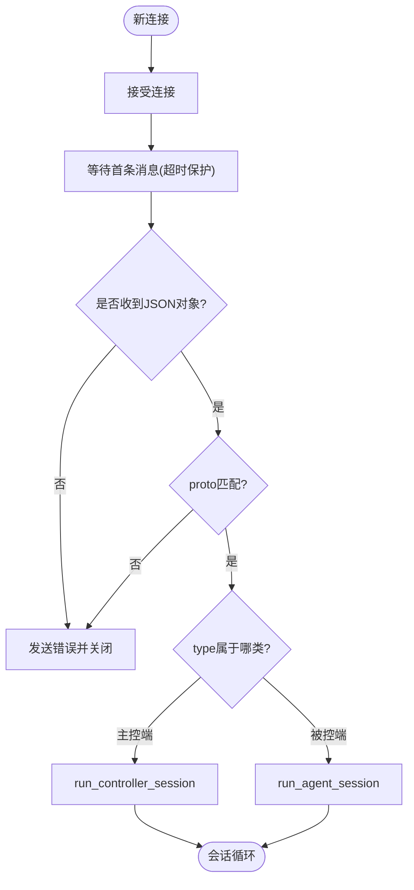
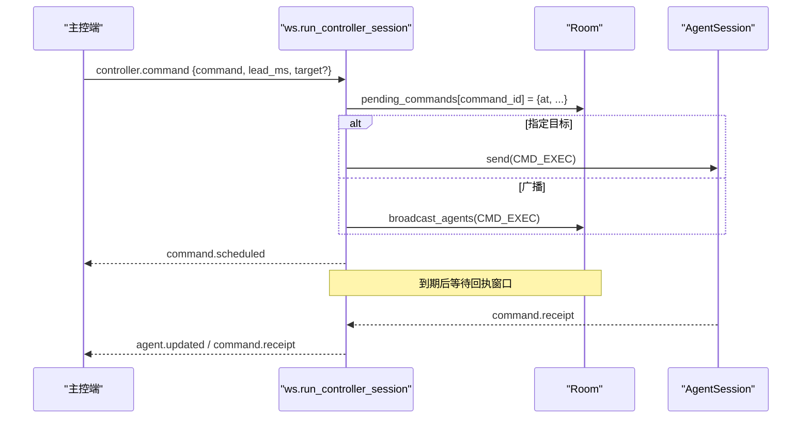
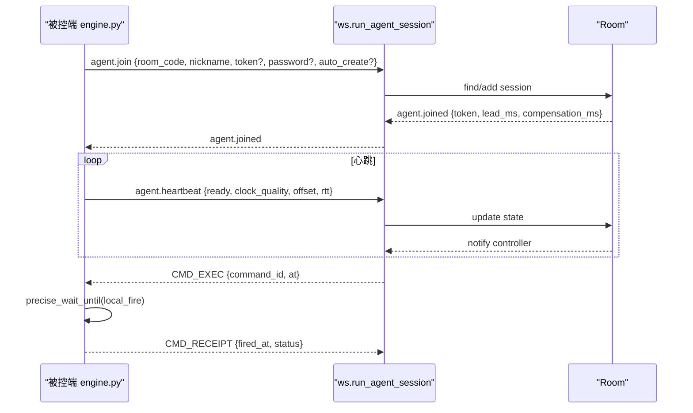
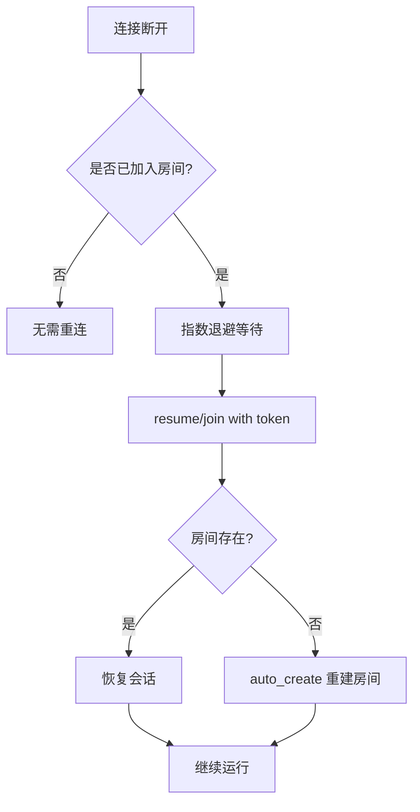
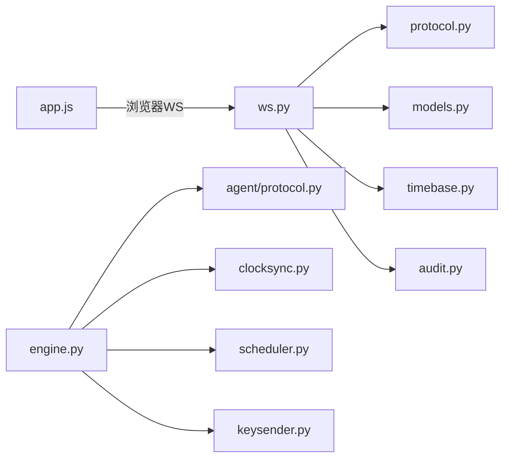

# 连接管理

<cite>
**本文引用的文件**
- [server/server/ws.py](file://server/server/ws.py)
- [server/server/protocol.py](file://server/server/protocol.py)
- [server/server/models.py](file://server/server/models.py)
- [server/server/main.py](file://server/server/main.py)
- [agent/agent/engine.py](file://agent/agent/engine.py)
- [agent/agent/protocol.py](file://agent/agent/protocol.py)
- [controller/app.js](file://controller/app.js)
</cite>

## 目录
1. [简介](#简介)
2. [项目结构](#项目结构)
3. [核心组件](#核心组件)
4. [架构总览](#架构总览)
5. [详细组件分析](#详细组件分析)
6. [依赖关系分析](#依赖关系分析)
7. [性能与优化](#性能与优化)
8. [故障排除指南](#故障排除指南)
9. [结论](#结论)
10. [附录：客户端连接示例与调试技巧](#附录客户端连接示例与调试技巧)

## 简介
本文件面向 ScriptCue 的 WebSocket 连接管理系统，系统性说明连接建立流程、角色识别机制、会话生命周期管理、主控端与被控端的处理逻辑（首条消息验证、协议版本检查、连接超时）、连接复用、断线重连与会话恢复、连接池与资源清理、异常处理策略、状态监控、性能优化与故障排除，并提供客户端连接示例与调试技巧。

## 项目结构
- 服务端
  - FastAPI 应用入口与后台任务：[server/server/main.py](file://server/server/main.py)
  - WebSocket 路由与消息分发：[server/server/ws.py](file://server/server/ws.py)
  - 房间与会话模型（内存）：[server/server/models.py](file://server/server/models.py)
  - 协议常量（权威定义）：[server/server/protocol.py](file://server/server/protocol.py)
- 被控端（Agent）
  - 连接与调度引擎：[agent/agent/engine.py](file://agent/agent/engine.py)
  - 协议常量（与服务端一致）：[agent/agent/protocol.py](file://agent/agent/protocol.py)
- 主控端（Controller，浏览器）
  - 前端连接与交互：[controller/app.js](file://controller/app.js)

图表来源
- [server/server/main.py:78-90](file://server/server/main.py#L78-L90)
- [server/server/ws.py:334-360](file://server/server/ws.py#L334-L360)
- [server/server/models.py:64-117](file://server/server/models.py#L64-L117)
- [server/server/protocol.py:1-80](file://server/server/protocol.py#L1-L80)
- [agent/agent/engine.py:106-157](file://agent/agent/engine.py#L106-L157)
- [agent/agent/protocol.py:1-80](file://agent/agent/protocol.py#L1-L80)

章节来源
- [server/server/main.py:1-98](file://server/server/main.py#L1-L98)
- [server/server/ws.py:1-360](file://server/server/ws.py#L1-L360)
- [server/server/models.py:1-157](file://server/server/models.py#L1-L157)
- [server/server/protocol.py:1-80](file://server/server/protocol.py#L1-L80)
- [agent/agent/engine.py:1-388](file://agent/agent/engine.py#L1-L388)
- [agent/agent/protocol.py:1-80](file://agent/agent/protocol.py#L1-L80)
- [controller/app.js:1-522](file://controller/app.js#L1-L522)

## 核心组件
- 角色识别与首条消息校验
  - 所有连接统一走 /ws 端点，首条消息必须为 JSON 对象并携带 proto 字段；服务端校验协议版本后根据 type 分派到主控或会被控会话。
- 主控端会话
  - 支持创建房间、加入房间、恢复会话；进入房间后接收设备列表与实时状态推送；可下发指令、取消指令、设置补偿值。
- 被控端会话
  - 加入房间后可通过令牌恢复；上报心跳与时钟质量；执行定时指令并回执；支持本地补偿值调整。
- 房间与会话模型
  - 内存存储房间与会话；支持房间空闲销毁、在线成员广播、主控顶替、旧连接顶替等。
- 后台任务
  - 离线检测：基于心跳间隔判定设备离线并通知主控。
  - 空闲销毁：超过阈值的空闲房间自动回收。

章节来源
- [server/server/ws.py:154-208](file://server/server/ws.py#L154-L208)
- [server/server/ws.py:246-327](file://server/server/ws.py#L246-L327)
- [server/server/models.py:17-117](file://server/server/models.py#L17-L117)
- [server/server/main.py:40-61](file://server/server/main.py#L40-L61)

## 架构总览

图表来源
- [server/server/ws.py:334-360](file://server/server/ws.py#L334-L360)
- [server/server/ws.py:154-208](file://server/server/ws.py#L154-L208)
- [server/server/ws.py:246-327](file://server/server/ws.py#L246-L327)
- [server/server/models.py:64-117](file://server/server/models.py#L64-L117)
- [agent/agent/engine.py:159-192](file://agent/agent/engine.py#L159-L192)

## 详细组件分析

### 连接建立与角色识别
- 统一入口：所有连接经 FastAPI 路由到 ws.handle_ws。
- 首条消息约束：必须在限定时间内发送一条 JSON 对象，包含 proto 与 type。
- 协议版本检查：proto 必须等于服务端 PROTO_VERSION，否则返回错误并关闭。
- 角色分派：
  - 主控端：type 为 controller.create / controller.join / controller.resume。
  - 被控端：type 为 agent.join。
- 超时处理：首条消息超时直接退出，避免空连接占用资源。

图表来源
- [server/server/ws.py:334-360](file://server/server/ws.py#L334-L360)

章节来源
- [server/server/ws.py:334-360](file://server/server/ws.py#L334-L360)
- [server/server/protocol.py:7-9](file://server/server/protocol.py#L7-L9)

### 主控端会话管理
- 房间操作
  - 创建房间：传入 room_name/password，服务器生成房间码并返回。
  - 加入房间：传入 room_code/password，校验口令。
  - 恢复会话：传入 room_code/token，若 token 不匹配则视为失效。
- 顶替机制：新主控连接会关闭旧主控连接，确保单主控。
- 指令下发
  - 命令类型限制在合法集合内。
  - lead_ms 有上下限约束，计算 at = now_ms() + lead_ms。
  - 将指令写入房间待执行队列，并广播给在线被控端（或指定目标）。
  - 回执窗口：指令到期后等待回执一段时间，超时清理。
- 取消指令：仅对未到期且存在的指令有效。
- 补偿值设置：按设备设置 compensation_ms，范围受限，并同步到被控端。

图表来源
- [server/server/ws.py:67-115](file://server/server/ws.py#L67-L115)
- [server/server/models.py:100-117](file://server/server/models.py#L100-L117)

章节来源
- [server/server/ws.py:154-208](file://server/server/ws.py#L154-L208)
- [server/server/ws.py:67-135](file://server/server/ws.py#L67-L135)
- [server/server/protocol.py:45-49](file://server/server/protocol.py#L45-L49)

### 被控端会话管理
- 加入与恢复
  - 首次加入：room_code/nickname/password，必要时 auto_create 以支持服务器重启后重建房间。
  - 恢复加入：携带 token 查找原会话，实现连接复用与会话恢复。
- 旧连接顶替：同一会话的新连接会关闭旧连接，保证唯一绑定。
- 心跳与时钟同步
  - 定期上报 ready、clock_quality、offset、rtt 等。
  - 密集采样与维持性采样用于高精度时钟同步。
- 指令执行与回执
  - 收到 CMD_EXEC 后根据 at 与本地时钟偏移计算触发时刻，精确等待并执行。
  - 回执包含 fired_at 与 delta_ms，便于主控端评估精度。
- 补偿值
  - 支持服务端下发与本地设置，范围受限，立即生效并上报。

图表来源
- [server/server/ws.py:246-327](file://server/server/ws.py#L246-L327)
- [agent/agent/engine.py:159-192](file://agent/agent/engine.py#L159-L192)
- [agent/agent/engine.py:297-379](file://agent/agent/engine.py#L297-L379)

章节来源
- [server/server/ws.py:246-327](file://server/server/ws.py#L246-L327)
- [agent/agent/engine.py:106-157](file://agent/agent/engine.py#L106-L157)
- [agent/agent/engine.py:198-211](file://agent/agent/engine.py#L198-L211)
- [agent/agent/engine.py:217-241](file://agent/agent/engine.py#L217-L241)
- [agent/agent/engine.py:297-379](file://agent/agent/engine.py#L297-L379)

### 连接复用、断线重连与会话恢复
- 主控端
  - onclose 时进行指数退避重连，使用 controller.resume 携带 token 恢复会话。
  - 若收到 room_not_found 错误，提示用户重新创建或加入。
- 被控端
  - run() 主循环在异常或断开后进行指数退避重连。
  - _join() 中若因房间丢失失败，下次重连启用 auto_create 重建房间。
  - 使用 token 恢复原会话，保持补偿值与 lead_ms 等上下文。

图表来源
- [controller/app.js:66-78](file://controller/app.js#L66-L78)
- [agent/agent/engine.py:106-128](file://agent/agent/engine.py#L106-L128)
- [agent/agent/engine.py:159-192](file://agent/agent/engine.py#L159-L192)

章节来源
- [controller/app.js:66-78](file://controller/app.js#L66-L78)
- [agent/agent/engine.py:106-128](file://agent/agent/engine.py#L106-L128)
- [agent/agent/engine.py:159-192](file://agent/agent/engine.py#L159-L192)

### 连接池管理、资源清理与异常处理
- 房间与会话
  - 房间容量上限控制，超出时报错。
  - 空闲房间超过阈值自动销毁，释放内存。
  - 心跳超时将被控端标记离线并通知主控。
- 资源清理
  - 主控/被控会话结束均清理绑定与在线标志。
  - 指令回执窗口结束后清理待执行记录。
  - 后台任务在应用生命周期结束时取消并关闭审计日志。
- 异常处理
  - 首条消息格式错误、协议版本不匹配、未知消息类型均返回错误并安全关闭。
  - 发送失败捕获异常，避免阻塞事件循环。
  - 被控端回调异常记录日志但不中断主循环。

章节来源
- [server/server/models.py:89-95](file://server/server/models.py#L89-L95)
- [server/server/models.py:148-156](file://server/server/models.py#L148-L156)
- [server/server/main.py:40-61](file://server/server/main.py#L40-L61)
- [server/server/ws.py:29-60](file://server/server/ws.py#L29-L60)
- [server/server/ws.py:334-360](file://server/server/ws.py#L334-L360)
- [agent/agent/engine.py:383-388](file://agent/agent/engine.py#L383-L388)

### 连接状态监控
- 主控端
  - 显示设备在线/就绪状态、时钟质量、最近偏差、RTT。
  - 指令回执汇总展示各设备状态（正常/异常/跳过/等待/未回执/离线）。
- 服务端
  - 健康检查接口返回协议版本、当前时间、房间数量。
  - 后台任务持续维护离线状态与房间存活。

章节来源
- [controller/app.js:195-262](file://controller/app.js#L195-L262)
- [controller/app.js:364-439](file://controller/app.js#L364-L439)
- [server/server/main.py:78-85](file://server/server/main.py#L78-L85)
- [server/server/main.py:40-61](file://server/server/main.py#L40-L61)

## 依赖关系分析
- 模块耦合
  - ws.py 依赖 protocol.py 的消息类型与限制、models.py 的房间与会话、timebase.py 的时间函数、audit.py 的审计。
  - engine.py 依赖 agent/protocol.py、clocksync、scheduler、keysender。
  - controller/app.js 依赖浏览器 WebSocket API 与 DOM。
- 外部依赖
  - 服务端：FastAPI、Starlette、websockets（被控端使用 websockets 库）。
  - 主控端：原生 JS，无框架。

图表来源
- [server/server/ws.py:15-18](file://server/server/ws.py#L15-L18)
- [agent/agent/engine.py:12-23](file://agent/agent/engine.py#L12-L23)
- [controller/app.js:33-48](file://controller/app.js#L33-L48)

章节来源
- [server/server/ws.py:15-18](file://server/server/ws.py#L15-L18)
- [agent/agent/engine.py:12-23](file://agent/agent/engine.py#L12-L23)
- [controller/app.js:33-48](file://controller/app.js#L33-L48)

## 性能与优化
- 首条消息超时：避免空连接长期占用资源。
- 指令提前量与回执窗口：合理配置 lead_ms 与 RECEIPT_TIMEOUT_MS 平衡延迟与可靠性。
- 心跳与离线判定：固定间隔与阈值降低误判概率。
- 状态推送节流：服务端对状态推送进行节流，减少主控端渲染压力。
- 时钟同步：密集采样与维持性采样提升调度精度。
- 连接复用与顶替：避免多连接导致的状态不一致。

章节来源
- [server/server/ws.py:22-26](file://server/server/ws.py#L22-L26)
- [server/server/protocol.py:67-79](file://server/server/protocol.py#L67-L79)
- [agent/agent/engine.py:198-211](file://agent/agent/engine.py#L198-L211)

## 故障排除指南
- 首条消息错误
  - 现象：连接后立即断开或收到错误消息。
  - 排查：确认首条消息为 JSON 对象且 proto 正确。
  - 参考路径：[server/server/ws.py:50-60](file://server/server/ws.py#L50-L60)、[server/server/ws.py:334-360](file://server/server/ws.py#L334-L360)
- 协议版本不匹配
  - 现象：连接被拒绝，提示协议版本要求。
  - 排查：升级客户端或服务端至相同 PROTO_VERSION。
  - 参考路径：[server/server/ws.py:349-351](file://server/server/ws.py#L349-L351)、[server/server/protocol.py:7-9](file://server/server/protocol.py#L7-L9)
- 房间不存在或口令错误
  - 现象：加入失败，返回对应错误码。
  - 排查：确认房间码与口令；必要时启用 auto_create。
  - 参考路径：[server/server/ws.py:159-173](file://server/server/ws.py#L159-L173)、[server/server/ws.py:253-266](file://server/server/ws.py#L253-L266)
- 设备离线
  - 现象：主控端显示设备离线。
  - 排查：检查被控端心跳是否正常；确认网络连通。
  - 参考路径：[server/server/main.py:40-52](file://server/server/main.py#L40-L52)
- 指令未回执
  - 现象：主控端回执汇总出现 missing/offline/error。
  - 排查：检查被控端时钟同步、补偿值、执行线程是否被阻塞。
  - 参考路径：[controller/app.js:364-439](file://controller/app.js#L364-L439)、[agent/agent/engine.py:297-379](file://agent/agent/engine.py#L297-L379)
- 重连频繁
  - 现象：主控或被控端频繁重连。
  - 排查：检查网络稳定性、服务器负载；确认指数退避参数。
  - 参考路径：[controller/app.js:66-78](file://controller/app.js#L66-L78)、[agent/agent/engine.py:106-128](file://agent/agent/engine.py#L106-L128)

## 结论
ScriptCue 的连接管理通过统一入口、严格的首条消息校验与协议版本检查，实现了主控端与被控端的清晰分离与可靠通信。房间与会话模型提供内存级的高性能状态管理，配合后台任务完成离线检测与空闲销毁。被控端通过时钟同步与精确调度保障指令执行的时序一致性。主控端具备完善的连接复用与重连机制，结合回执汇总与状态监控，形成闭环的可观测性与可运维性。整体设计在保证低延迟的同时兼顾了鲁棒性与可维护性。

## 附录：客户端连接示例与调试技巧

### 主控端连接示例（浏览器）
- 创建房间
  - 调用 connect({ type: "controller.create", proto: 1, room_name: "...", password?: "..." })
  - 成功后接收 controller.joined，包含 room_code、token、server_time、agents。
- 加入房间
  - 调用 connect({ type: "controller.join", proto: 1, room_code: "...", password?: "..." })
- 恢复会话
  - 连接断开后自动使用 controller.resume 携带 token 恢复。
- 下发指令
  - 发送 controller.command，包含 command、lead_ms、target?。
  - 接收 command.scheduled，随后根据回执汇总判断执行情况。
- 取消指令
  - 发送 controller.cancel，包含 command_id。
- 设置补偿值
  - 发送 controller.set_comp，包含 session_id、compensation_ms。

章节来源
- [controller/app.js:480-518](file://controller/app.js#L480-L518)
- [controller/app.js:50-81](file://controller/app.js#L50-L81)
- [controller/app.js:102-133](file://controller/app.js#L102-L133)

### 被控端连接示例（Python 进程）
- 初始化引擎
  - 构造 AgentEngine(server_url, room_code, nickname, password?, room_name?)。
- 启动运行
  - 调用 run()，内部负责连接、加入、心跳、时钟同步与重连。
- 加入房间
  - 首次加入发送 agent.join；服务器重启后可通过 auto_create 重建房间。
- 设置就绪与补偿值
  - set_ready(true) 上报就绪；set_compensation(ms) 上报补偿值。
- 监听事件
  - on_event 回调获取 connected/disconnected/reconnecting/clock_sample/command_scheduled/command_fired 等事件。

章节来源
- [agent/agent/engine.py:31-62](file://agent/agent/engine.py#L31-L62)
- [agent/agent/engine.py:106-128](file://agent/agent/engine.py#L106-L128)
- [agent/agent/engine.py:159-192](file://agent/agent/engine.py#L159-L192)
- [agent/agent/engine.py:217-241](file://agent/agent/engine.py#L217-L241)
- [agent/agent/engine.py:297-379](file://agent/agent/engine.py#L297-L379)

### 调试技巧
- 服务端健康检查
  - 访问 /healthz 查看 proto、server_time、rooms 数量。
- 日志级别
  - 通过环境变量 SC_LOG_LEVEL 调整日志输出。
- 审计日志
  - 服务端将关键操作写入 audit.jsonl，便于回溯。
- 浏览器控制台
  - 观察 WebSocket 消息收发，核对消息结构与字段。
- 被控端事件
  - 通过 on_event 打印 clock_sample、command_scheduled、command_fired 等事件，定位时序问题。

章节来源
- [server/server/main.py:78-85](file://server/server/main.py#L78-L85)
- [server/server/main.py:28-30](file://server/server/main.py#L28-L30)
- [agent/agent/engine.py:383-388](file://agent/agent/engine.py#L383-L388)