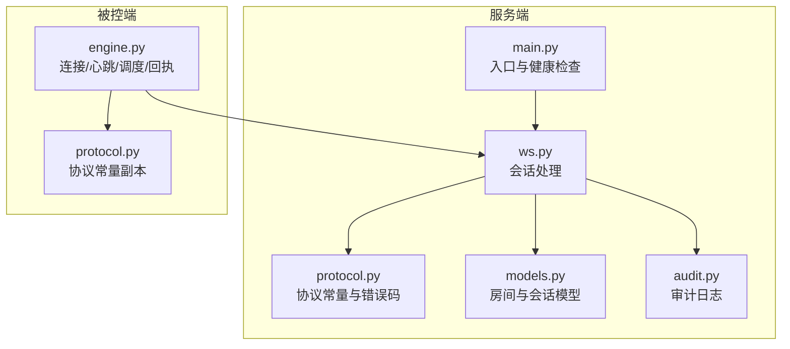
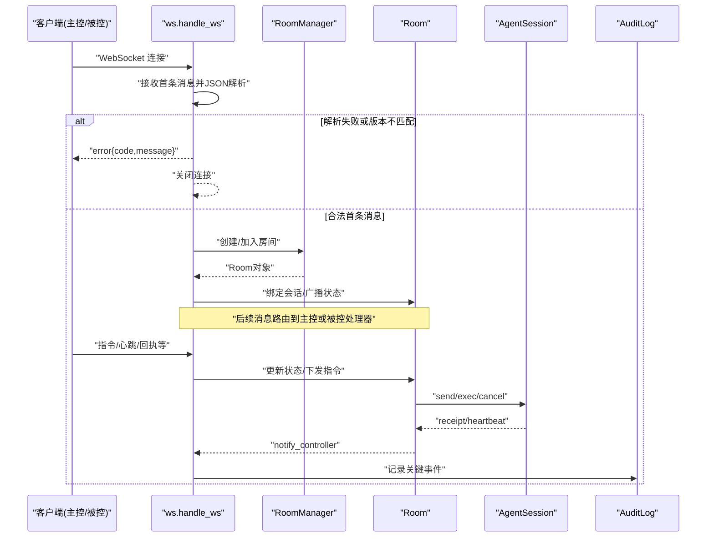
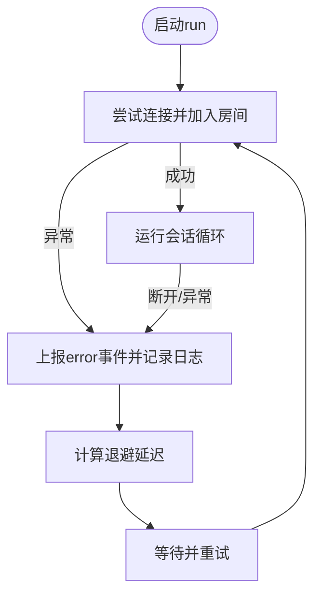
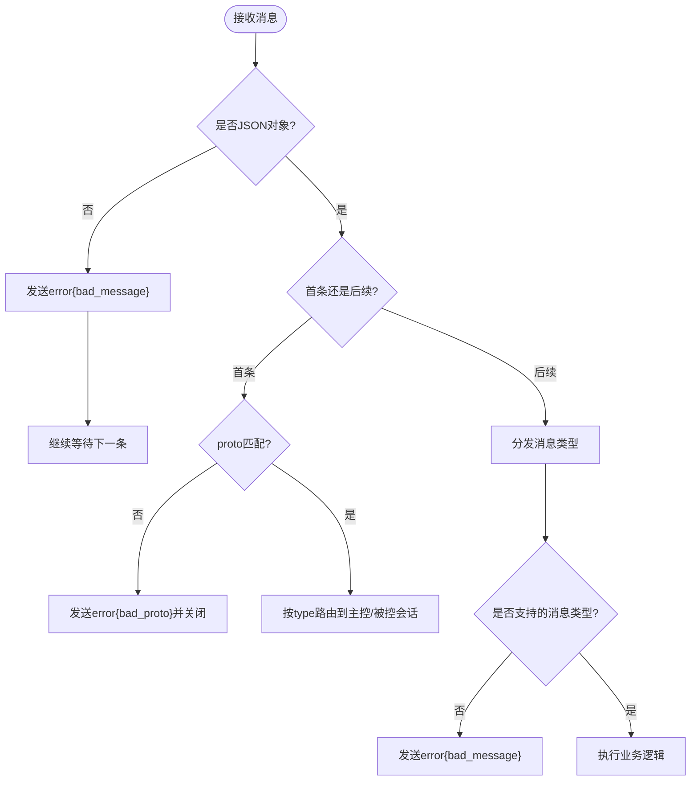
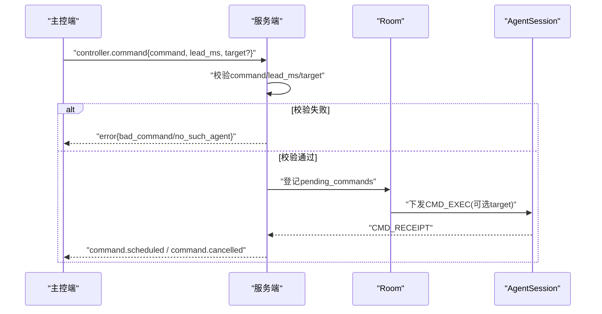
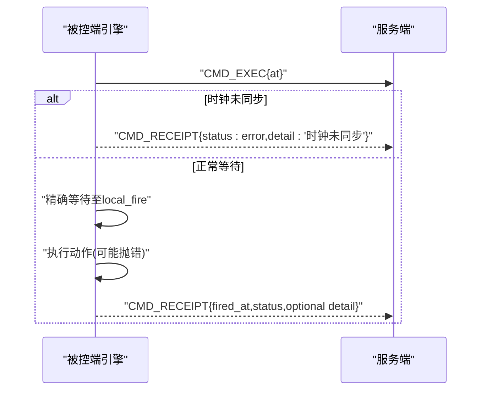
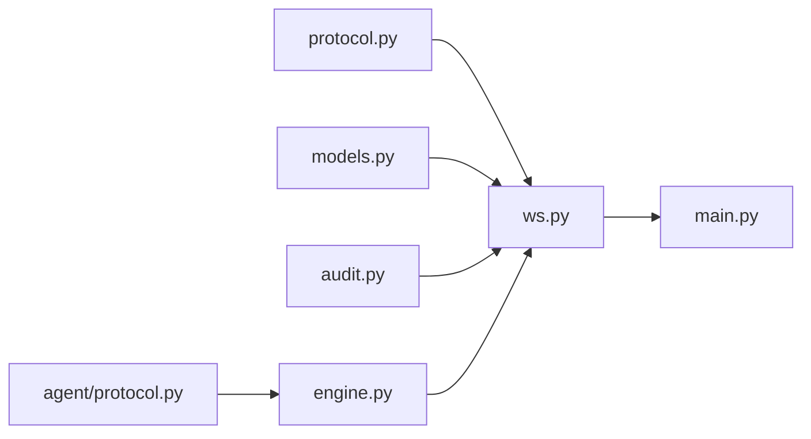

# 错误处理机制

<cite>
**本文引用的文件**
- [server/server/ws.py](file://server/server/ws.py)
- [server/server/protocol.py](file://server/server/protocol.py)
- [agent/agent/protocol.py](file://agent/agent/protocol.py)
- [agent/agent/engine.py](file://agent/agent/engine.py)
- [server/server/models.py](file://server/server/models.py)
- [server/server/main.py](file://server/server/main.py)
- [server/server/audit.py](file://server/server/audit.py)
</cite>

## 目录
1. [简介](#简介)
2. [项目结构](#项目结构)
3. [核心组件](#核心组件)
4. [架构总览](#架构总览)
5. [详细组件分析](#详细组件分析)
6. [依赖关系分析](#依赖关系分析)
7. [性能考量](#性能考量)
8. [故障排查指南](#故障排查指南)
9. [结论](#结论)
10. [附录](#附录)

## 简介
本文件面向 ScriptCue 的 WebSocket 错误处理系统，系统化说明错误分类、错误码定义与错误响应格式；覆盖网络连接错误、协议解析错误、业务逻辑错误的处理策略；文档化错误重试机制、降级处理与故障恢复方案；并给出错误日志记录、监控告警与调试工具的使用建议。最后提供常见错误场景的诊断方法、性能影响分析与优化建议，以及最佳实践与代码示例路径。

## 项目结构
ScriptCue 由服务端（FastAPI + WebSocket）与被控端（AgentEngine）组成，双方通过统一的协议常量进行通信。错误处理贯穿握手、消息收发、房间与会话管理、指令调度与回执等关键环节。

图表来源
- [server/server/ws.py:1-360](file://server/server/ws.py#L1-L360)
- [server/server/protocol.py:1-80](file://server/server/protocol.py#L1-L80)
- [server/server/models.py:1-157](file://server/server/models.py#L1-L157)
- [server/server/main.py:1-98](file://server/server/main.py#L1-L98)
- [server/server/audit.py:1-37](file://server/server/audit.py#L1-L37)
- [agent/agent/engine.py:1-388](file://agent/agent/engine.py#L1-L388)
- [agent/agent/protocol.py:1-80](file://agent/agent/protocol.py#L1-L80)

章节来源
- [server/server/ws.py:1-360](file://server/server/ws.py#L1-L360)
- [server/server/protocol.py:1-80](file://server/server/protocol.py#L1-L80)
- [agent/agent/engine.py:1-388](file://agent/agent/engine.py#L1-L388)
- [server/server/main.py:1-98](file://server/server/main.py#L1-L98)

## 核心组件
- 协议与错误码：集中定义消息类型、指令类型、时钟质量等级、错误码与服务端限制，确保两端一致。
- WebSocket 会话处理：统一入口 handle_ws，负责首条消息校验、角色分发、主控/被控会话生命周期、错误响应发送。
- 房间与会话模型：Room/AgentSession 维护在线状态、待执行指令、令牌与推送通知。
- 被控端引擎：连接生命周期、指数退避重连、时钟同步、绝对时刻调度、触发回执与错误上报。
- 审计日志：记录关键事件（加入/离开、指令下发与回执、离线、房间过期等），便于复盘与排障。

章节来源
- [server/server/protocol.py:1-80](file://server/server/protocol.py#L1-L80)
- [server/server/ws.py:1-360](file://server/server/ws.py#L1-L360)
- [server/server/models.py:1-157](file://server/server/models.py#L1-L157)
- [agent/agent/engine.py:1-388](file://agent/agent/engine.py#L1-L388)
- [server/server/audit.py:1-37](file://server/server/audit.py#L1-L37)

## 架构总览
下图展示从客户端连接到错误处理的端到端流程，包括握手、协议校验、房间/会话建立、指令下发与回执、错误上报与审计。

图表来源
- [server/server/ws.py:154-360](file://server/server/ws.py#L154-L360)
- [server/server/models.py:64-117](file://server/server/models.py#L64-L117)
- [server/server/audit.py:17-33](file://server/server/audit.py#L17-L33)

## 详细组件分析

### 错误分类与错误码定义
- 协议层错误
  - bad_proto：首条消息 proto 字段与服务器期望版本不一致。
  - bad_message：非 JSON、非对象、未知消息类型、非法参数（如补偿值非整数）。
- 房间与会话错误
  - room_not_found：房间不存在或未携带有效 token/password。
  - bad_password：口令错误。
  - room_full：房间设备数达到上限。
  - not_controller：权限不足（当前未实现该分支，但已预留错误码）。
- 指令与目标错误
  - bad_command：未知指令类型。
  - no_such_agent：目标设备不存在。

错误响应格式统一为：
- type: "error"
- code: 上述错误码之一
- message: 人类可读的错误描述

章节来源
- [server/server/protocol.py:57-65](file://server/server/protocol.py#L57-L65)
- [server/server/ws.py:37-39](file://server/server/ws.py#L37-L39)
- [server/server/ws.py:50-60](file://server/server/ws.py#L50-L60)
- [server/server/ws.py:67-85](file://server/server/ws.py#L67-L85)
- [server/server/ws.py:154-173](file://server/server/ws.py#L154-L173)
- [server/server/ws.py:246-287](file://server/server/ws.py#L246-L287)
- [server/server/ws.py:334-360](file://server/server/ws.py#L334-L360)

### 网络连接错误与重连策略（被控端）
- 连接异常捕获：在 run() 中捕获所有异常，上报 error 事件并进入重连流程。
- 指数退避重连：使用固定序列 (1,2,4,8) 秒，最大不超过 10 秒，避免雪崩。
- 断线清理：取消密集采样、心跳、维持同步任务，释放资源并标记断开。
- 自动重建房间：若收到 ERR_ROOM_NOT_FOUND 且之前已成功加入过，则下次重连启用 auto_create 以重建房间。

图表来源
- [agent/agent/engine.py:106-127](file://agent/agent/engine.py#L106-L127)
- [agent/agent/engine.py:129-157](file://agent/agent/engine.py#L129-L157)
- [agent/agent/engine.py:159-192](file://agent/agent/engine.py#L159-L192)
- [agent/agent/protocol.py:71-73](file://agent/agent/protocol.py#L71-L73)

章节来源
- [agent/agent/engine.py:106-127](file://agent/agent/engine.py#L106-L127)
- [agent/agent/engine.py:129-157](file://agent/agent/engine.py#L129-L157)
- [agent/agent/engine.py:159-192](file://agent/agent/engine.py#L159-L192)
- [agent/agent/protocol.py:71-73](file://agent/agent/protocol.py#L71-L73)

### 协议解析错误处理（服务端）
- 首条消息超时或断开：直接结束会话，不返回错误（保持最小侵入）。
- 首条消息非 JSON 或非对象：返回 bad_message 并关闭。
- 协议版本不匹配：返回 bad_proto 并关闭。
- 未知首条消息类型：返回 bad_message 并关闭。
- 后续消息非 JSON 或非对象：返回 bad_message，连接保持，继续消费。

图表来源
- [server/server/ws.py:334-360](file://server/server/ws.py#L334-L360)
- [server/server/ws.py:50-60](file://server/server/ws.py#L50-L60)
- [server/server/ws.py:187-202](file://server/server/ws.py#L187-L202)
- [server/server/ws.py:291-320](file://server/server/ws.py#L291-L320)

章节来源
- [server/server/ws.py:334-360](file://server/server/ws.py#L334-L360)
- [server/server/ws.py:50-60](file://server/server/ws.py#L50-L60)
- [server/server/ws.py:187-202](file://server/server/ws.py#L187-L202)
- [server/server/ws.py:291-320](file://server/server/ws.py#L291-L320)

### 业务逻辑错误处理（服务端）
- 指令校验：未知指令返回 bad_command；lead_ms 越界会被钳制到允许范围。
- 目标设备校验：target 不存在返回 no_such_agent。
- 房间校验：房间不存在返回 room_not_found；口令错误返回 bad_password；房间满员返回 room_full。
- 撤销指令：对已到期或不存在指令静默忽略，避免无效操作。
- 补偿值设置：非法值返回 bad_message；合法值更新并通知主控。

图表来源
- [server/server/ws.py:67-104](file://server/server/ws.py#L67-L104)
- [server/server/ws.py:117-135](file://server/server/ws.py#L117-L135)
- [server/server/ws.py:137-152](file://server/server/ws.py#L137-L152)
- [server/server/ws.py:228-244](file://server/server/ws.py#L228-L244)

章节来源
- [server/server/ws.py:67-104](file://server/server/ws.py#L67-L104)
- [server/server/ws.py:117-135](file://server/server/ws.py#L117-L135)
- [server/server/ws.py:137-152](file://server/server/ws.py#L137-L152)
- [server/server/ws.py:228-244](file://server/server/ws.py#L228-L244)

### 被控端错误上报与回执
- 时钟未同步：无法调度时立即上报 receipt status=error，并提示“时钟未同步”。
- 执行异常：按键注入抛出异常时，回执包含 detail 信息。
- 取消指令：收到 CMD_CANCEL 后停止等待并上报取消事件。
- 错误消息透传：收到服务端 error 消息时，向上层回调 error 事件。

图表来源
- [agent/agent/engine.py:297-327](file://agent/agent/engine.py#L297-L327)
- [agent/agent/engine.py:329-379](file://agent/agent/engine.py#L329-L379)
- [agent/agent/engine.py:268-292](file://agent/agent/engine.py#L268-L292)

章节来源
- [agent/agent/engine.py:297-327](file://agent/agent/engine.py#L297-L327)
- [agent/agent/engine.py:329-379](file://agent/agent/engine.py#L329-L379)
- [agent/agent/engine.py:268-292](file://agent/agent/engine.py#L268-L292)

### 降级处理与故障恢复
- 房间丢失恢复：被控端收到 ERR_ROOM_NOT_FOUND 且曾加入成功，下次重连启用 auto_create 重建房间。
- 空闲房间回收：服务端定时扫描，超过 24h 无活跃成员的房间销毁，减少资源占用。
- 心跳超时离线：服务端每秒扫描，连续 3 次心跳无响应将被控端标记离线并通知主控。
- 主控制顶替：新主控连接会关闭旧主控连接，保证单主控一致性。

章节来源
- [agent/agent/engine.py:159-192](file://agent/agent/engine.py#L159-L192)
- [server/server/main.py:40-61](file://server/server/main.py#L40-L61)
- [server/server/ws.py:175-185](file://server/server/ws.py#L175-L185)

### 错误日志、监控与调试
- 审计日志：记录 controller_join/leave、agent_join/leave/disconnect/offline、command/receipt/cancel/set_comp、room_expired 等事件，便于演出复盘。
- 健康检查：/healthz 暴露服务状态、协议版本、房间数量与服务器时间，可用于探针与告警。
- 日志级别：可通过环境变量 SC_LOG_LEVEL 调整；默认 INFO。
- 调试建议：
  - 观察 agent 侧 on_event 回调中的 connecting/error/reconnecting/connected/disconnected 事件。
  - 关注 clock_sample 事件，确认偏移与 RTT 收敛。
  - 核对 command.scheduled/command.cancelled/command.receipt 链路是否完整。

章节来源
- [server/server/audit.py:17-33](file://server/server/audit.py#L17-L33)
- [server/server/main.py:78-85](file://server/server/main.py#L78-L85)
- [server/server/main.py:28-30](file://server/server/main.py#L28-L30)
- [agent/agent/engine.py:106-127](file://agent/agent/engine.py#L106-L127)
- [agent/agent/engine.py:198-212](file://agent/agent/engine.py#L198-L212)

## 依赖关系分析
- ws.py 依赖 protocol.py（错误码/消息类型）、models.py（房间与会话）、audit.py（审计）、timebase.py（时间）。
- engine.py 依赖 agent/protocol.py（错误码/重连策略）、clocksync/scheduler/timeutil（时钟与调度）、websockets（网络）。
- main.py 作为 FastAPI 应用，挂载 /ws 端点并启动后台任务（离线扫描、空闲回收）。

图表来源
- [server/server/ws.py:1-360](file://server/server/ws.py#L1-L360)
- [server/server/protocol.py:1-80](file://server/server/protocol.py#L1-L80)
- [server/server/models.py:1-157](file://server/server/models.py#L1-L157)
- [server/server/audit.py:1-37](file://server/server/audit.py#L1-L37)
- [server/server/main.py:1-98](file://server/server/main.py#L1-L98)
- [agent/agent/engine.py:1-388](file://agent/agent/engine.py#L1-L388)
- [agent/agent/protocol.py:1-80](file://agent/agent/protocol.py#L1-L80)

章节来源
- [server/server/ws.py:1-360](file://server/server/ws.py#L1-L360)
- [server/server/protocol.py:1-80](file://server/server/protocol.py#L1-L80)
- [server/server/models.py:1-157](file://server/server/models.py#L1-L157)
- [server/server/audit.py:1-37](file://server/server/audit.py#L1-L37)
- [server/server/main.py:1-98](file://server/server/main.py#L1-L98)
- [agent/agent/engine.py:1-388](file://agent/agent/engine.py#L1-L388)
- [agent/agent/protocol.py:1-80](file://agent/agent/protocol.py#L1-L80)

## 性能考量
- 首条消息超时：设置 FIRST_MESSAGE_TIMEOUT_S 防止空连接占用资源。
- 心跳与离线判定：HEARTBEAT_INTERVAL_S 与 AGENT_OFFLINE_S 平衡实时性与开销。
- 指令回执窗口：RECEIPT_TIMEOUT_MS 控制 pending 清理时机，避免内存泄漏。
- 状态推送节流：AGENT_PUSH_THROTTLE_S 降低主控端压力（常量存在，可在上层使用）。
- 房间空闲回收：ROOM_IDLE_TTL_S 定期清理闲置房间，释放内存。
- 重连退避：指数退避避免风暴式重连，保护服务端。

[本节为通用性能指导，不直接分析具体文件]

## 故障排查指南
- 连接阶段
  - 现象：首次连接即返回 bad_proto 或 bad_message
  - 排查：检查客户端 proto 版本、首条消息是否为 JSON 对象、URL 是否正确
  - 参考路径：[server/server/ws.py:334-360](file://server/server/ws.py#L334-L360)
- 房间阶段
  - 现象：room_not_found/bad_password/room_full
  - 排查：确认房间码、口令、房间容量；查看审计日志中 agent_join/controller_join
  - 参考路径：[server/server/ws.py:154-173](file://server/server/ws.py#L154-L173), [server/server/ws.py:246-287](file://server/server/ws.py#L246-L287)
- 指令阶段
  - 现象：bad_command/no_such_agent
  - 排查：检查 command 是否在白名单、target 是否存在；查看 command.scheduled 与 command.cancelled
  - 参考路径：[server/server/ws.py:67-104](file://server/server/ws.py#L67-L104), [server/server/ws.py:117-135](file://server/server/ws.py#L117-L135)
- 回执阶段
  - 现象：status=error 或 delta_ms 过大
  - 排查：检查时钟同步质量、补偿值设置、按键注入异常；查看 agent 侧 clock_sample 与 command_fired
  - 参考路径：[agent/agent/engine.py:297-327](file://agent/agent/engine.py#L297-L327), [agent/agent/engine.py:329-379](file://agent/agent/engine.py#L329-L379)
- 离线与恢复
  - 现象：设备长时间 offline
  - 排查：检查心跳间隔、网络连通性、auto_create 是否生效；查看 agent_offline 审计事件
  - 参考路径：[server/server/main.py:40-61](file://server/server/main.py#L40-L61), [agent/agent/engine.py:159-192](file://agent/agent/engine.py#L159-L192)

章节来源
- [server/server/ws.py:154-173](file://server/server/ws.py#L154-L173)
- [server/server/ws.py:246-287](file://server/server/ws.py#L246-L287)
- [server/server/ws.py:67-104](file://server/server/ws.py#L67-L104)
- [server/server/ws.py:117-135](file://server/server/ws.py#L117-L135)
- [agent/agent/engine.py:297-327](file://agent/agent/engine.py#L297-L327)
- [agent/agent/engine.py:329-379](file://agent/agent/engine.py#L329-L379)
- [server/server/main.py:40-61](file://server/server/main.py#L40-L61)

## 结论
ScriptCue 的错误处理体系围绕“严格协议校验 + 明确错误码 + 可观测审计 + 稳健重连”展开。服务端在握手与消息路由处进行强校验，被控端通过指数退避重连与自动房间重建提升可用性；指令链路通过回执与审计闭环保障可追溯性。结合健康检查与日志，可实现快速定位与恢复。

[本节为总结性内容，不直接分析具体文件]

## 附录

### 错误码速查表
- bad_proto：协议版本不匹配
- bad_message：消息格式/类型非法
- room_not_found：房间不存在或会话失效
- bad_password：口令错误
- room_full：房间已满
- not_controller：非主控（预留）
- bad_command：未知指令
- no_such_agent：目标设备不存在

章节来源
- [server/server/protocol.py:57-65](file://server/server/protocol.py#L57-L65)
- [agent/agent/protocol.py:55-63](file://agent/agent/protocol.py#L55-L63)

### 错误响应格式
- type: "error"
- code: 见上表
- message: 错误描述

章节来源
- [server/server/ws.py:37-39](file://server/server/ws.py#L37-L39)

### 最佳实践
- 客户端始终校验首条消息结构与 proto 版本，避免 bad_message/bad_proto。
- 被控端启用 auto_create 以应对服务端重启导致的房间丢失。
- 合理配置 lead_ms 与 compensation_ms，确保指令按时触发。
- 监控心跳与 clock_sample，及时调优时钟同步。
- 利用审计日志复盘指令全链路，定位问题根因。

[本节为通用实践建议，不直接分析具体文件]