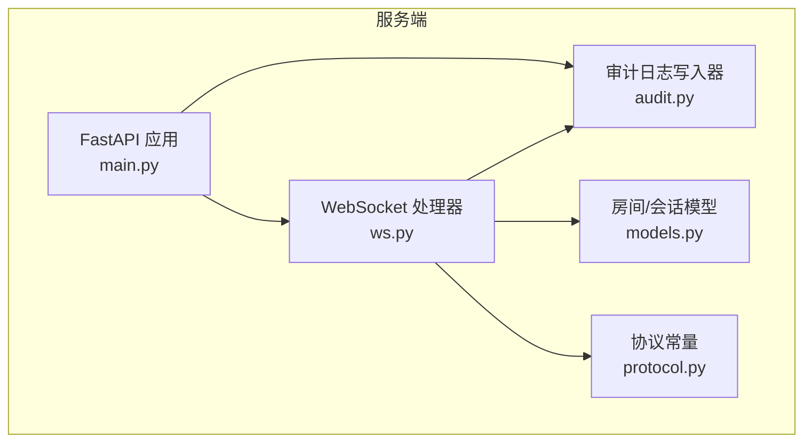
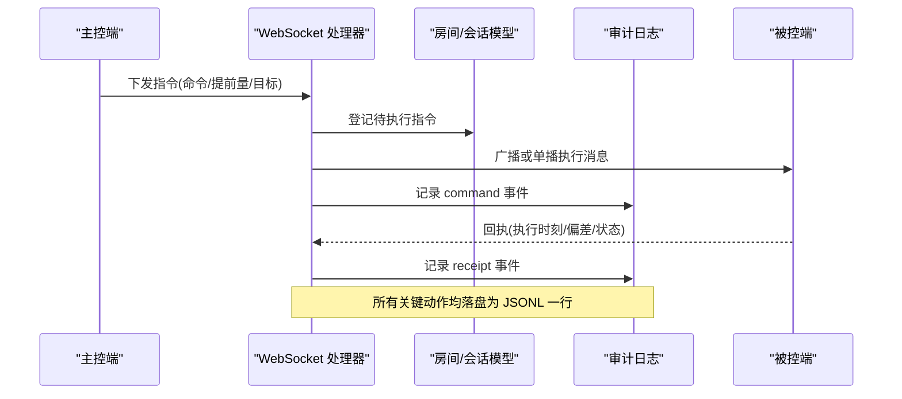
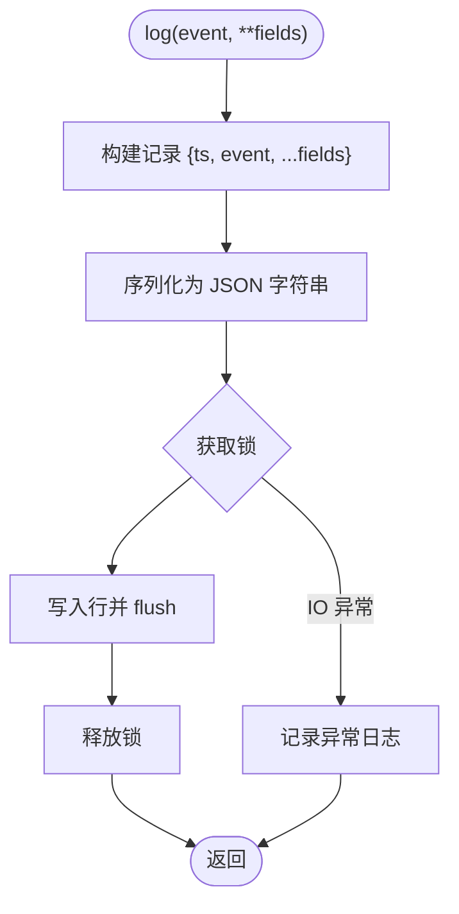
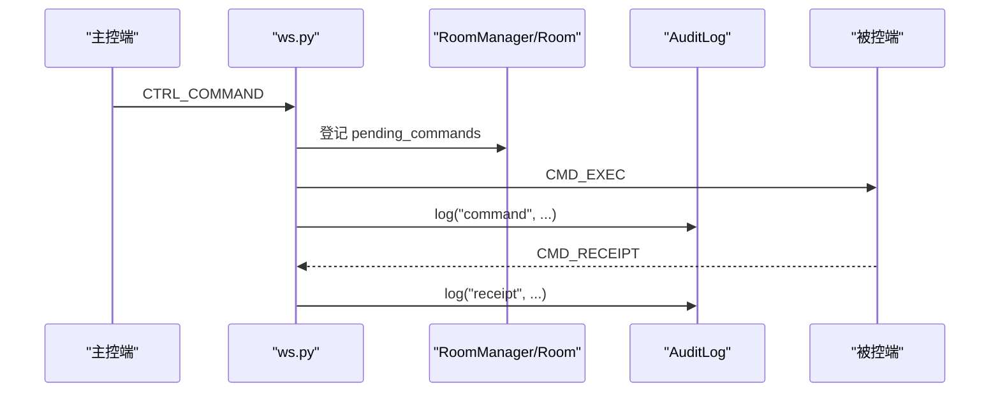
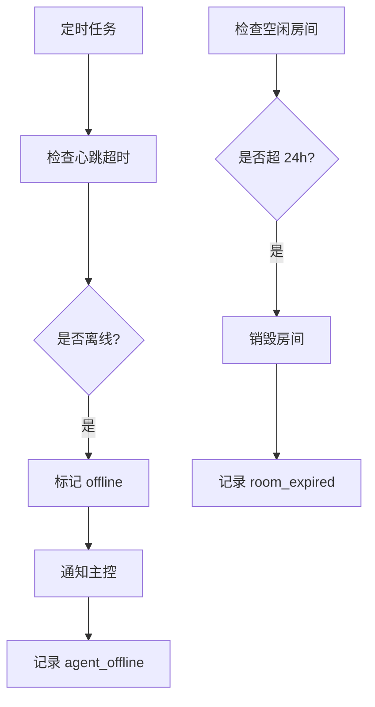
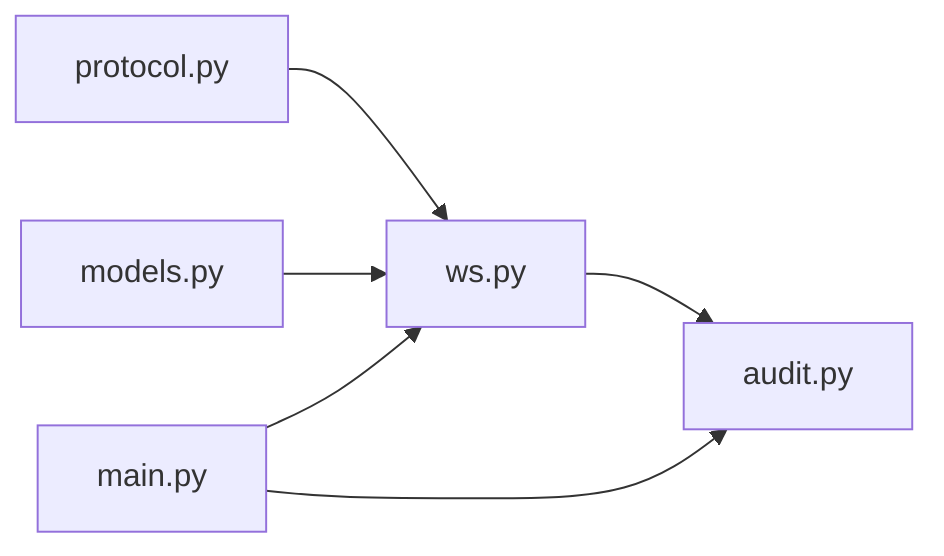

# 审计日志系统

<cite>
**本文引用的文件**
- [server/server/audit.py](file://server/server/audit.py)
- [server/server/main.py](file://server/server/main.py)
- [server/server/ws.py](file://server/server/ws.py)
- [server/server/models.py](file://server/server/models.py)
- [server/server/protocol.py](file://server/server/protocol.py)
- [README.md](file://README.md)
</cite>

## 目录
1. [简介](#简介)
2. [项目结构](#项目结构)
3. [核心组件](#核心组件)
4. [架构总览](#架构总览)
5. [详细组件分析](#详细组件分析)
6. [依赖关系分析](#依赖关系分析)
7. [性能与存储](#性能与存储)
8. [故障排查指南](#故障排查指南)
9. [结论](#结论)
10. [附录：事件类型与字段规范](#附录事件类型与字段规范)

## 简介
本文件为 ScriptCue 的审计日志系统提供完整技术文档。内容涵盖设计目标、记录策略、事件捕获与持久化机制、日志文件格式（JSONL）与字段定义、各类审计事件的触发条件、日志轮转与存储空间管理建议，以及查询分析与备份导出最佳实践。目标是帮助运维与研发人员理解、使用与维护该系统的可观测性与复盘能力。

## 项目结构
ScriptCue 服务端基于 FastAPI + WebSocket，房间与会话采用纯内存模型；审计日志以 JSON Lines 格式追加写入到数据目录下的单一文件中。关键位置如下：
- 审计日志实现：server/server/audit.py
- 服务启动与后台任务（离线扫描、空闲房间销毁）：server/server/main.py
- WebSocket 会话处理（主控端与被控端）及事件埋点：server/server/ws.py
- 房间与会话模型（内存状态）：server/server/models.py
- 协议常量与限制（指令类型、时间窗口等）：server/server/protocol.py
- 仓库说明与环境信息：README.md

图表来源
- [server/server/main.py:63-75](file://server/server/main.py#L63-L75)
- [server/server/ws.py:334-360](file://server/server/ws.py#L334-L360)
- [server/server/audit.py:17-36](file://server/server/audit.py#L17-L36)
- [server/server/models.py:64-157](file://server/server/models.py#L64-L157)
- [server/server/protocol.py:1-80](file://server/server/protocol.py#L1-L80)

章节来源
- [README.md:16-20](file://README.md#L16-L20)
- [server/server/main.py:1-38](file://server/server/main.py#L1-L38)

## 核心组件
- 审计日志写入器 AuditLog：负责线程安全的 JSONL 追加写、异常兜底与关闭。
- WebSocket 处理器：在关键操作路径中调用审计日志记录事件，如设备上线/下线、房间创建/恢复、指令下发/取消/回执、补偿值设置、主控连接/离开等。
- 后台任务：心跳超时离线检测、空闲房间自动销毁，均会记录审计事件。
- 房间/会话模型：维护在线状态、最后活跃时间、待执行指令等，供审计事件上下文使用。
- 协议常量：定义指令类型、时间窗口、限制等，影响审计事件字段含义。

章节来源
- [server/server/audit.py:17-36](file://server/server/audit.py#L17-L36)
- [server/server/ws.py:67-151](file://server/server/ws.py#L67-L151)
- [server/server/ws.py:154-207](file://server/server/ws.py#L154-L207)
- [server/server/ws.py:214-327](file://server/server/ws.py#L214-L327)
- [server/server/main.py:40-61](file://server/server/main.py#L40-L61)
- [server/server/models.py:17-157](file://server/server/models.py#L17-L157)
- [server/server/protocol.py:45-80](file://server/server/protocol.py#L45-L80)

## 架构总览
审计日志贯穿“主控端控制流”和“被控端运行态”，通过统一的 AuditLog 接口输出结构化事件，便于演出后复盘与问题定位。

图表来源
- [server/server/ws.py:67-104](file://server/server/ws.py#L67-L104)
- [server/server/ws.py:228-244](file://server/server/ws.py#L228-L244)
- [server/server/audit.py:24-32](file://server/server/audit.py#L24-L32)

## 详细组件分析

### 审计日志写入器（AuditLog）
- 职责：线程安全地以 JSONL 格式追加写入事件行，包含统一时间戳、事件名与业务字段。
- 并发安全：内部使用锁保护文件句柄写入与 flush，避免多协程/多线程竞争导致交错。
- 错误处理：捕获 IO 异常并记录日志，保证主流程不受影响。
- 生命周期：服务启动时创建实例，退出时关闭文件句柄。

图表来源
- [server/server/audit.py:24-36](file://server/server/audit.py#L24-L36)

章节来源
- [server/server/audit.py:1-37](file://server/server/audit.py#L1-L37)

### WebSocket 处理器中的审计事件埋点
- 主控端侧：
  - 指令下发：记录 command 事件，包含房间、指令 ID、指令类型、计划执行时刻、提前量、目标设备。
  - 指令取消：记录 cancel 事件，包含房间与指令 ID。
  - 补偿值设置：记录 set_comp 事件，包含房间、设备会话 ID、补偿值。
  - 主控加入/离开：记录 controller_join / controller_leave 事件。
- 被控端侧：
  - 设备加入：记录 agent_join，包含房间、会话 ID、昵称。
  - 设备断开：记录 agent_disconnect，包含房间与会话 ID。
  - 指令回执：记录 receipt，包含房间、会话 ID、指令 ID、实际执行时刻、偏差毫秒、状态。
  - 设备侧设置补偿值：记录 set_comp（source=agent）。
- 自动恢复：
  - 服务器重启后客户端自动重建房间：记录 room_recreated。

图表来源
- [server/server/ws.py:67-104](file://server/server/ws.py#L67-L104)
- [server/server/ws.py:228-244](file://server/server/ws.py#L228-L244)
- [server/server/ws.py:154-207](file://server/server/ws.py#L154-L207)
- [server/server/ws.py:246-327](file://server/server/ws.py#L246-L327)

章节来源
- [server/server/ws.py:67-151](file://server/server/ws.py#L67-L151)
- [server/server/ws.py:154-207](file://server/server/ws.py#L154-L207)
- [server/server/ws.py:214-327](file://server/server/ws.py#L214-L327)

### 后台任务的审计事件
- 设备离线：心跳超时（连续 3 次未响应）标记离线并通知主控，同时记录 agent_offline。
- 房间过期：空闲超过 24 小时自动销毁房间，记录 room_expired。

图表来源
- [server/server/main.py:40-61](file://server/server/main.py#L40-L61)

章节来源
- [server/server/main.py:40-61](file://server/server/main.py#L40-L61)

### 房间与会话模型的关联
- 房间：维护代码、名称、口令、提前量、创建/最后活跃时间、主控连接、待执行指令集合、设备列表。
- 设备会话：维护会话 ID、昵称、令牌、在线/就绪状态、时钟质量与偏移、RTT、补偿值、最后活跃时间、待执行指令映射。
- 这些状态为审计事件提供上下文字段（如 room.code、session.session_id、nickname、at、delta_ms 等）。

章节来源
- [server/server/models.py:17-157](file://server/server/models.py#L17-L157)

## 依赖关系分析
- ws.py 依赖 protocol 常量（指令类型、时间窗口、限制），用于校验与构造审计事件字段。
- main.py 在进程生命周期内初始化审计日志实例，并在退出时关闭。
- audit.py 仅依赖时间基准模块与标准库，无外部依赖。
- models.py 提供房间与会话状态，供 ws.py 与 main.py 读取与更新。

图表来源
- [server/server/protocol.py:1-80](file://server/server/protocol.py#L1-L80)
- [server/server/ws.py:1-360](file://server/server/ws.py#L1-L360)
- [server/server/audit.py:1-37](file://server/server/audit.py#L1-L37)
- [server/server/main.py:1-98](file://server/server/main.py#L1-L98)
- [server/server/models.py:1-157](file://server/server/models.py#L1-L157)

章节来源
- [server/server/protocol.py:45-80](file://server/server/protocol.py#L45-L80)
- [server/server/ws.py:1-360](file://server/server/ws.py#L1-L360)
- [server/server/audit.py:1-37](file://server/server/audit.py#L1-L37)
- [server/server/main.py:1-98](file://server/server/main.py#L1-L98)
- [server/server/models.py:1-157](file://server/server/models.py#L1-L157)

## 性能与存储
- 写入策略：JSONL 同步追加写，每场演出几十条，I/O 压力极低；线程锁保障一致性。
- 存储位置：默认位于数据目录（可通过环境变量配置），容器部署时挂载卷持久化。
- 轮转策略：当前实现未内置轮转。建议按日期或大小进行轮转（例如每日归档、保留 N 天），以避免单文件过大。
- 空间管理：结合日志轮转工具或脚本定期清理旧文件；监控磁盘使用率与文件大小增长趋势。
- 高可用建议：将数据目录置于可靠存储介质；必要时对日志文件做增量备份。

章节来源
- [server/server/audit.py:1-37](file://server/server/audit.py#L1-L37)
- [server/server/main.py:32-38](file://server/server/main.py#L32-L38)
- [README.md:44-55](file://README.md#L44-L55)

## 故障排查指南
- 无法写入日志：
  - 现象：审计日志写入失败异常被捕获并记录。
  - 排查：检查数据目录权限、磁盘空间、文件系统是否只读；确认进程拥有写入权限。
- 设备频繁离线：
  - 现象：出现大量 agent_offline 事件。
  - 排查：检查网络质量、心跳间隔与超时阈值；核对设备时钟同步质量与 RTT。
- 房间自动销毁：
  - 现象：出现 room_expired 事件。
  - 排查：确认是否有主控或设备在线；调整空闲 TTL 或保持活动。
- 指令未执行或延迟大：
  - 现象：receipt 事件中 delta_ms 较大或状态异常。
  - 排查：检查提前量配置、设备本地时钟偏移与补偿值；核对指令目标是否存在。
- 主控连接冲突：
  - 现象：新主控连接顶替旧连接。
  - 排查：确认同一房间仅允许一个主控；关注 controller_join/controller_leave 事件顺序。

章节来源
- [server/server/audit.py:24-36](file://server/server/audit.py#L24-L36)
- [server/server/main.py:40-61](file://server/server/main.py#L40-L61)
- [server/server/ws.py:67-151](file://server/server/ws.py#L67-L151)
- [server/server/ws.py:154-207](file://server/server/ws.py#L154-L207)
- [server/server/ws.py:214-327](file://server/server/ws.py#L214-L327)

## 结论
ScriptCue 的审计日志系统以极简设计实现了关键操作的完整可追溯性：通过统一的 JSONL 格式与线程安全写入，覆盖设备上下线、房间生命周期、指令调度与回执、补偿值调整等核心事件。配合后台任务的心跳检测与空闲回收，形成闭环的可观测体系。建议在生产环境引入日志轮转与备份策略，并结合事件字段开展查询与分析，以提升排障效率与演出复盘质量。

## 附录：事件类型与字段规范
- 通用字段
  - ts：事件时间戳（毫秒）
  - event：事件类型字符串
  - 其他字段随事件不同而变
- 事件类型与触发条件
  - command：主控下发指令成功，已登记并广播执行
    - 关键字段：room、command_id、command、at、lead_ms、target
  - cancel：指令取消成功
    - 关键字段：room、command_id
  - set_comp：设置设备补偿值（可来自主控或被控端）
    - 关键字段：room、session、compensation_ms、source（当 source="agent" 时表示由被控端发起）
  - controller_join：主控加入房间
    - 关键字段：room
  - controller_leave：主控离开房间
    - 关键字段：room
  - agent_join：设备加入房间
    - 关键字段：room、session、nickname
  - agent_disconnect：设备断开连接
    - 关键字段：room、session
  - agent_offline：心跳超时判定离线
    - 关键字段：room、session
  - room_recreated：服务器重启后客户端自动恢复房间
    - 关键字段：room
  - room_expired：空闲超过 24 小时自动销毁房间
    - 关键字段：room
  - receipt：设备回执指令执行情况
    - 关键字段：room、session、command_id、fired_at、delta_ms、status

- 字段语义说明
  - room：房间码
  - session：设备会话 ID
  - nickname：设备昵称
  - command_id：指令唯一标识
  - command：指令类型（play/pause/test）
  - at：计划执行时刻（毫秒）
  - lead_ms：提前量（毫秒）
  - target：目标设备会话 ID（可选）
  - fired_at：实际执行时刻（毫秒）
  - delta_ms：实际与计划执行时刻差（毫秒）
  - status：回执状态（如 ok 或其他）

章节来源
- [server/server/audit.py:24-32](file://server/server/audit.py#L24-L32)
- [server/server/ws.py:67-151](file://server/server/ws.py#L67-L151)
- [server/server/ws.py:154-207](file://server/server/ws.py#L154-L207)
- [server/server/ws.py:214-327](file://server/server/ws.py#L214-L327)
- [server/server/main.py:40-61](file://server/server/main.py#L40-L61)
- [server/server/protocol.py:45-80](file://server/server/protocol.py#L45-L80)