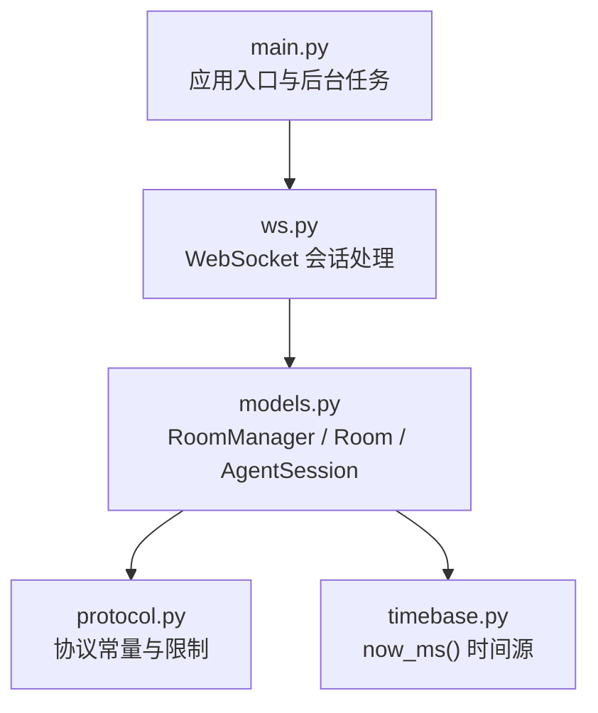
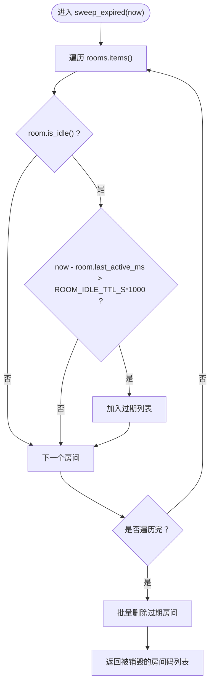
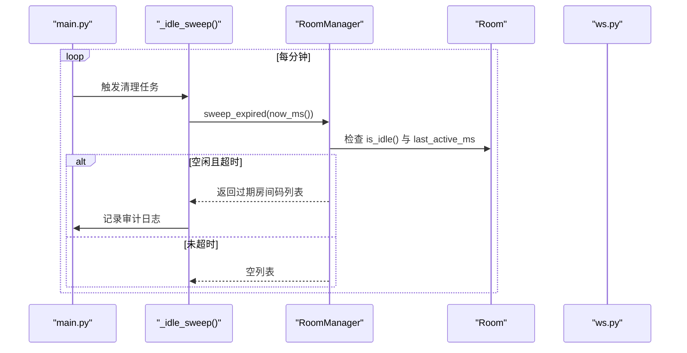
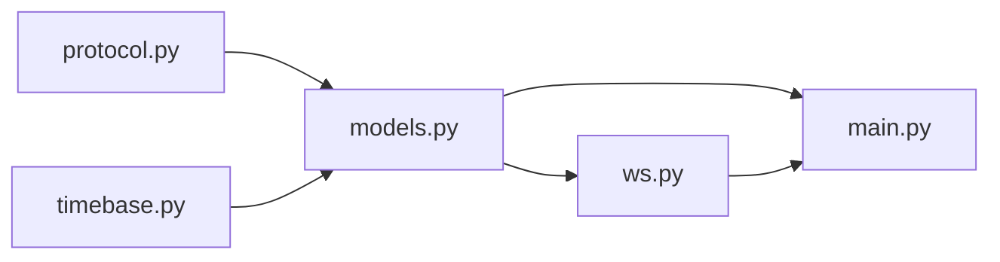

# 内存存储设计

<cite>
**本文引用的文件**
- [server/server/models.py](file://server/server/models.py)
- [server/server/ws.py](file://server/server/ws.py)
- [server/server/main.py](file://server/server/main.py)
- [server/server/protocol.py](file://server/server/protocol.py)
- [server/server/timebase.py](file://server/server/timebase.py)
</cite>

## 目录
1. [简介](#简介)
2. [项目结构](#项目结构)
3. [核心组件](#核心组件)
4. [架构总览](#架构总览)
5. [详细组件分析](#详细组件分析)
6. [依赖关系分析](#依赖关系分析)
7. [性能考量](#性能考量)
8. [故障排查指南](#故障排查指南)
9. [结论](#结论)
10. [附录](#附录)

## 简介
本技术文档聚焦于 ScriptCue 服务端的纯内存存储设计，围绕 RoomManager 类及其数据模型展开，系统阐述房间与会话的关联、索引与查询优化、生命周期管理（自动清理、资源回收）、并发访问控制（协程安全与锁机制）、性能优化策略（缓存、批量操作、压缩）以及内存使用监控与调试方法。该内存存储为无持久化方案：服务器重启后房间与会话丢失，由客户端在重连时通过 auto_create/令牌恢复。

## 项目结构
服务端内存存储相关代码主要位于 server/server 目录下：
- models.py：定义 Room、AgentSession、RoomManager 等核心内存数据结构与管理逻辑
- ws.py：WebSocket 会话处理，负责命令调度、回执处理、状态推送以及与 RoomManager 的交互
- main.py：应用启动、后台任务（离线检测、空闲房间清理）与路由挂载
- protocol.py：协议常量与限制（房间容量、空闲 TTL、心跳间隔等）
- timebase.py：统一时间源 now_ms()，用于所有时间戳计算



图表来源
- [server/server/main.py:36-72](file://server/server/main.py#L36-L72)
- [server/server/ws.py:154-208](file://server/server/ws.py#L154-L208)
- [server/server/models.py:120-156](file://server/server/models.py#L120-L156)
- [server/server/protocol.py:67-80](file://server/server/protocol.py#L67-L80)
- [server/server/timebase.py:10-12](file://server/server/timebase.py#L10-L12)

章节来源
- [server/server/main.py:1-98](file://server/server/main.py#L1-L98)
- [server/server/models.py:1-157](file://server/server/models.py#L1-L157)
- [server/server/ws.py:1-360](file://server/server/ws.py#L1-L360)
- [server/server/protocol.py:1-80](file://server/server/protocol.py#L1-L80)
- [server/server/timebase.py:1-13](file://server/server/timebase.py#L1-L13)

## 核心组件
- RoomManager：内存中的房间字典 rooms: dict[str, Room] 的管理者，提供创建、查找、删除、过期清理等方法
- Room：房间实体，维护控制器连接、设备列表 agents、待执行指令 pending_commands、活跃时间 last_active_ms 等
- AgentSession：被控端设备会话，维护在线状态、时钟质量、补偿值、最近可见时间 last_seen_ms、待执行指令 pending_commands 等
- 后台任务：_offline_sweep（每秒扫描离线设备）、_idle_sweep（每分钟扫描并销毁空闲超时的房间）

章节来源
- [server/server/models.py:17-118](file://server/server/models.py#L17-L118)
- [server/server/models.py:120-156](file://server/server/models.py#L120-L156)
- [server/server/main.py:40-61](file://server/server/main.py#L40-L61)

## 架构总览
RoomManager 作为内存存储的核心，集中管理房间字典；Room 聚合设备与会话；AgentSession 表示单台设备的运行时状态。ws.py 将 WebSocket 消息路由到对应处理器，并通过 RoomManager 进行房间级操作。main.py 启动后台任务以维护内存数据的健康度（离线标记、空闲清理）。

```mermaid
classDiagram
class RoomManager {
+rooms : dict[str, Room]
+create_room(name, password, code, lead_ms) Room
+get(code) Room|None
+remove(code) void
+sweep_expired(now) list[str]
-_generate_code(existing) str
}
class Room {
+code : str
+name : str
+password : str|None
+lead_ms : int
+created_at_ms : int
+last_active_ms : int
+controller_ws : WebSocket|None
+controller_token : str
+agents : dict[str, AgentSession]
+pending_commands : dict[str, dict]
+touch() void
+is_idle() bool
+add_agent(nickname) AgentSession
+find_session_by_token(token) AgentSession|None
+broadcast_agents(msg, session) void
+notify_controller(msg) void
+agent_states() list[dict]
}
class AgentSession {
+session_id : str
+nickname : str
+token : str
+ws : WebSocket|None
+online : bool
+ready : bool
+clock_quality : string
+clock_offset_ms : float|None
+clock_rtt_ms : float|None
+compensation_ms : int
+last_seen_ms : int
+pending_commands : dict[str, int]
+bind(ws) void
+state() dict
+send(msg) bool
}
RoomManager --> Room : "rooms : dict"
Room --> AgentSession : "agents : dict"
```

图表来源
- [server/server/models.py:17-118](file://server/server/models.py#L17-L118)
- [server/server/models.py:120-156](file://server/server/models.py#L120-L156)

章节来源
- [server/server/models.py:1-157](file://server/server/models.py#L1-L157)

## 详细组件分析

### RoomManager：房间字典与设备映射管理策略
- 房间字典 rooms: dict[str, Room] 以房间码为键，实现 O(1) 查找与插入
- 生成唯一房间码：基于协议常量中的字母表与长度，避免冲突
- 创建房间：若指定 code 且已存在则返回已有房间；否则新建并加入字典
- 获取与删除：直接对 rooms 字典进行操作
- 过期清理：遍历 rooms，筛选 is_idle() 且超过空闲 TTL 的房间，批量删除并返回被销毁的房间码



图表来源
- [server/server/models.py:148-156](file://server/server/models.py#L148-L156)
- [server/server/protocol.py:67-71](file://server/server/protocol.py#L67-L71)

章节来源
- [server/server/models.py:120-156](file://server/server/models.py#L120-L156)
- [server/server/protocol.py:67-80](file://server/server/protocol.py#L67-L80)

### 数据模型：房间与会话的关联关系、索引设计与查询优化
- 房间与会话：Room.agents: dict[str, AgentSession] 以 session_id 为键，支持 O(1) 查找与更新
- 令牌恢复：Room.find_session_by_token(token) 线性扫描 agents.values()，适用于房间规模较小场景
- 待执行指令：Room.pending_commands: dict[str, dict] 与 AgentSession.pending_commands: dict[str, int] 双向维护，便于取消与清理
- 查询优化：
  - 按房间码快速定位房间（rooms 字典）
  - 按 session_id 快速定位会话（agents 字典）
  - 广播仅针对 online 的设备，减少无效发送
  - 指令下发时优先写入目标 session 的 pending_commands，再广播或定向发送

章节来源
- [server/server/models.py:64-118](file://server/server/models.py#L64-L118)
- [server/server/ws.py:67-134](file://server/server/ws.py#L67-L134)

### 内存数据生命周期管理：自动清理、内存泄漏防护、资源回收
- 空闲房间销毁：_idle_sweep 每分钟调用 manager.sweep_expired(now_ms())，销毁空闲超 24h 的房间
- 设备离线标记：_offline_sweep 每秒检查 agent.online 与 last_seen_ms，超过阈值标记离线并通知控制器
- 资源回收：
  - 控制器断开时清除 room.controller_ws
  - 设备断开时清除 session.ws 并设置 online=False
  - 指令回执或超时后清理 pending_commands（房间与设备侧）
- 审计日志：关键事件记录至 audit.jsonl，便于回溯



图表来源
- [server/server/main.py:54-61](file://server/server/main.py#L54-L61)
- [server/server/models.py:148-156](file://server/server/models.py#L148-L156)

章节来源
- [server/server/main.py:40-72](file://server/server/main.py#L40-L72)
- [server/server/models.py:148-156](file://server/server/models.py#L148-L156)
- [server/server/ws.py:202-227](file://server/server/ws.py#L202-L227)
- [server/server/ws.py:320-327](file://server/server/ws.py#L320-L327)

### 并发访问控制：线程安全考虑与锁机制设计
- 运行环境：FastAPI + asyncio，主路径为异步协程，非多线程共享可变状态
- 协程安全：
  - 房间与会话的状态变更发生在单个 WebSocket 处理协程内，通常不会并发写同一对象
  - 后台任务（_offline_sweep、_idle_sweep）读取 rooms 与 agents，不修改房间字典结构（仅删除过期房间），读多写少场景下风险较低
- 潜在竞争点：
  - 控制器顶替：新连接会关闭旧控制器连接并替换 controller_ws
  - 设备顶替：新连接会关闭旧设备连接并绑定新 ws
- 建议增强：
  - 在高并发场景下，可为 RoomManager.rooms 与 Room.agents 增加 asyncio.Lock 保护关键读写段
  - 对 sweep 期间的遍历采用快照（list(manager.rooms.values())）以避免迭代中修改导致的异常（当前已使用 list(...) 快照）

章节来源
- [server/server/main.py:40-61](file://server/server/main.py#L40-L61)
- [server/server/ws.py:175-180](file://server/server/ws.py#L175-L180)
- [server/server/ws.py:276-281](file://server/server/ws.py#L276-L281)

### 性能优化策略：缓存、批量操作、数据压缩
- 缓存策略：
  - 房间与会话均使用字典索引，O(1) 查找
  - 广播仅面向 online 设备，减少无效网络开销
- 批量操作：
  - sweep_expired 批量收集过期房间后一次性删除，降低多次 pop 的开销
  - 指令取消时批量清理房间与设备的 pending_commands
- 数据压缩：
  - 内存存储本身不实现压缩；可通过限制房间容量（MAX_AGENTS_PER_ROOM）与空闲 TTL（ROOM_IDLE_TTL_S）控制内存增长
  - 未来可考虑对大对象（如 pending_commands）进行序列化压缩存储，但需权衡 CPU 与延迟

章节来源
- [server/server/models.py:89-95](file://server/server/models.py#L89-L95)
- [server/server/models.py:148-156](file://server/server/models.py#L148-L156)
- [server/server/ws.py:117-134](file://server/server/ws.py#L117-L134)
- [server/server/protocol.py:67-80](file://server/server/protocol.py#L67-L80)

### 内存使用监控与调试工具
- 健康检查接口：/healthz 返回 rooms 数量、协议版本与服务时间，可用于外部监控
- 审计日志：关键事件（房间创建、设备上下线、指令回执、补偿设置、房间过期）写入 audit.jsonl，便于问题定位
- 调试建议：
  - 定期采集 rooms 大小、agents 总数、pending_commands 规模
  - 结合审计日志分析异常断连与指令积压
  - 在高负载下观察 sweep 任务的执行频率与耗时

章节来源
- [server/server/main.py:78-85](file://server/server/main.py#L78-L85)
- [server/server/ws.py:100-104](file://server/server/ws.py#L100-L104)
- [server/server/ws.py:228-243](file://server/server/ws.py#L228-L243)
- [server/server/ws.py:287-289](file://server/server/ws.py#L287-L289)
- [server/server/main.py:54-61](file://server/server/main.py#L54-L61)

## 依赖关系分析
- RoomManager 依赖 protocol 常量（房间容量、空闲 TTL、默认提前量）
- Room 与 AgentSession 依赖 timebase.now_ms() 获取高精度时间戳
- ws.py 依赖 models 与 protocol，负责消息路由与状态同步
- main.py 依赖 models 与 protocol，启动后台任务并挂载路由



图表来源
- [server/server/models.py:1-10](file://server/server/models.py#L1-L10)
- [server/server/ws.py:15-18](file://server/server/ws.py#L15-L18)
- [server/server/main.py:22-26](file://server/server/main.py#L22-L26)

章节来源
- [server/server/models.py:1-10](file://server/server/models.py#L1-L10)
- [server/server/ws.py:15-18](file://server/server/ws.py#L15-L18)
- [server/server/main.py:22-26](file://server/server/main.py#L22-L26)

## 性能考量
- 时间精度：now_ms() 使用 time.time_ns() 毫秒级时间戳，保证指令调度与心跳判断的准确性
- 心跳与离线判定：HEARTBEAT_INTERVAL_S 与 AGENT_OFFLINE_S 共同决定离线检测灵敏度
- 指令回执窗口：RECEIPT_TIMEOUT_MS 控制 pending_commands 清理时机，避免长期占用内存
- 房间容量限制：MAX_AGENTS_PER_ROOM 防止单房间过大导致内存膨胀
- 空闲清理：ROOM_IDLE_TTL_S 控制房间存活周期，及时释放资源

章节来源
- [server/server/timebase.py:10-12](file://server/server/timebase.py#L10-L12)
- [server/server/protocol.py:67-80](file://server/server/protocol.py#L67-L80)
- [server/server/ws.py:107-115](file://server/server/ws.py#L107-L115)

## 故障排查指南
- 房间不存在：检查 CTRL_JOIN/CTRL_RESUME 的 room_code 与密码是否正确
- 设备数已达上限：确认 MAX_AGENTS_PER_ROOM 配置是否合理，必要时扩容
- 指令未回执：检查 RECEIPT_TIMEOUT_MS 与设备时钟同步状态，查看审计日志中的 receipt 事件
- 房间未销毁：确认 is_idle() 逻辑与 last_active_ms 更新是否正常，检查 _idle_sweep 任务是否运行
- 设备未离线：检查 HEARTBEAT_INTERVAL_S 与 AGENT_OFFLINE_S，确认心跳消息是否到达

章节来源
- [server/server/ws.py:159-173](file://server/server/ws.py#L159-L173)
- [server/server/ws.py:268-274](file://server/server/ws.py#L268-L274)
- [server/server/ws.py:228-243](file://server/server/ws.py#L228-L243)
- [server/server/main.py:40-61](file://server/server/main.py#L40-L61)

## 结论
ScriptCue 的内存存储以 RoomManager 为核心，通过简洁的数据结构与高效的字典索引实现了房间与会话的快速管理。配合后台任务完成设备离线标记与空闲房间清理，保障内存使用的健康度。当前实现基于 asyncio 协程模型，未引入显式锁，适合中小规模并发场景；在高并发环境下建议引入细粒度锁以提升安全性。通过健康检查接口与审计日志，可实现基本的内存使用监控与问题定位。

## 附录
- 环境变量：
  - SC_DATA_DIR：审计日志目录
  - SC_CONTROLLER_DIR：主控端静态目录
  - SC_DEFAULT_LEAD_MS：指令默认提前量（毫秒）
- 关键常量：
  - MAX_AGENTS_PER_ROOM：单房间最大设备数
  - ROOM_IDLE_TTL_S：房间空闲 TTL（秒）
  - HEARTBEAT_INTERVAL_S：心跳间隔（秒）
  - AGENT_OFFLINE_S：离线判定阈值（秒）
  - RECEIPT_TIMEOUT_MS：指令回执等待窗口（毫秒）

章节来源
- [server/server/main.py:6-9](file://server/server/main.py#L6-L9)
- [server/server/protocol.py:67-80](file://server/server/protocol.py#L67-L80)