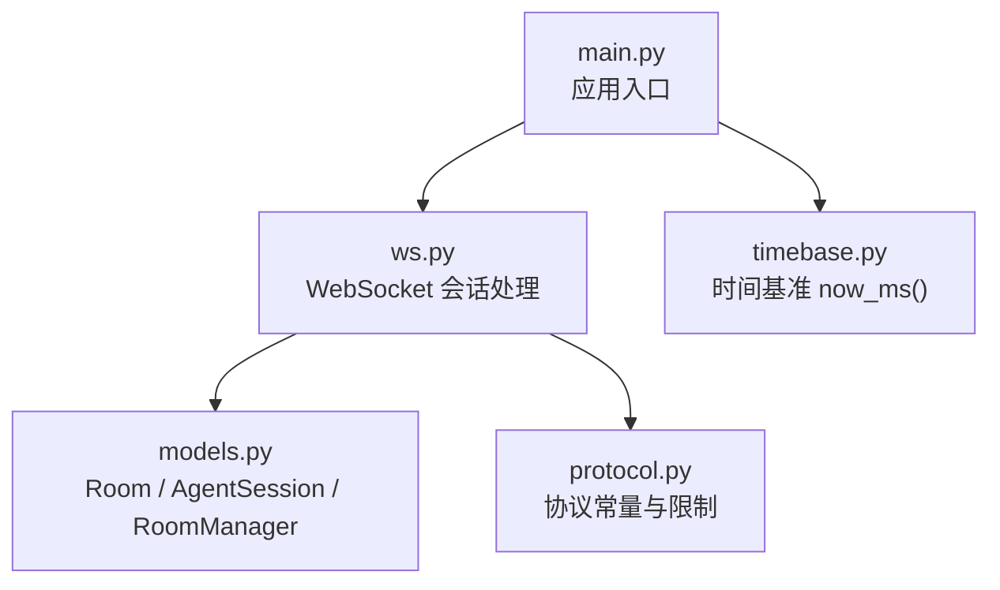
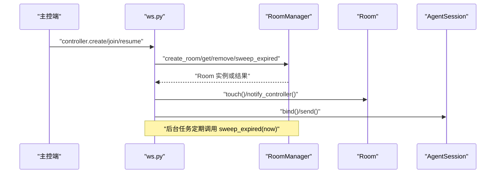
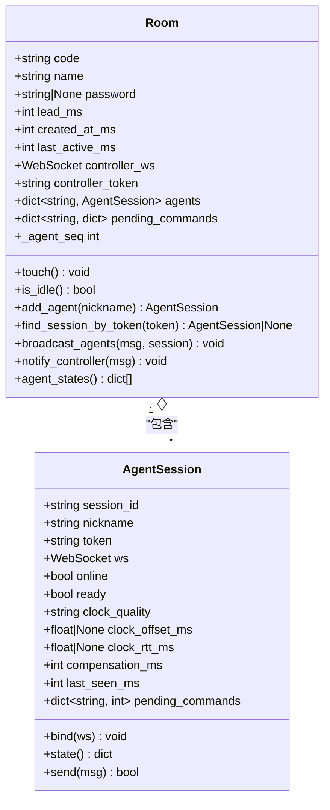
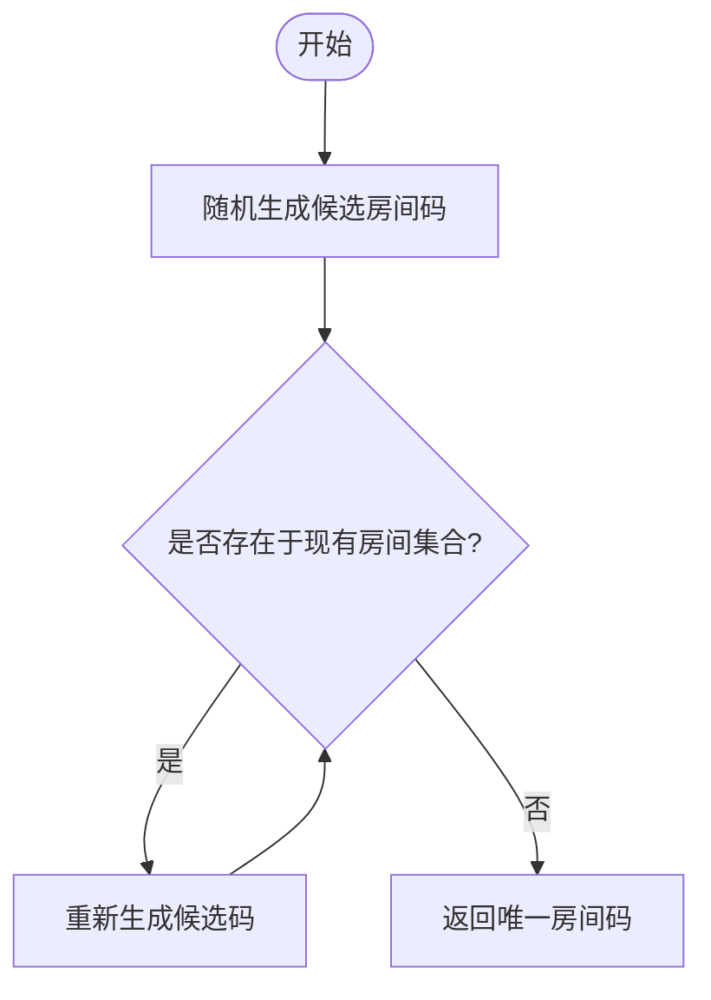
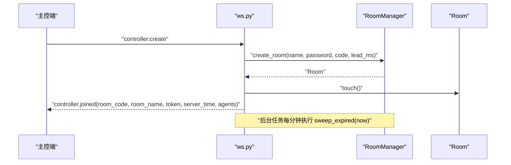
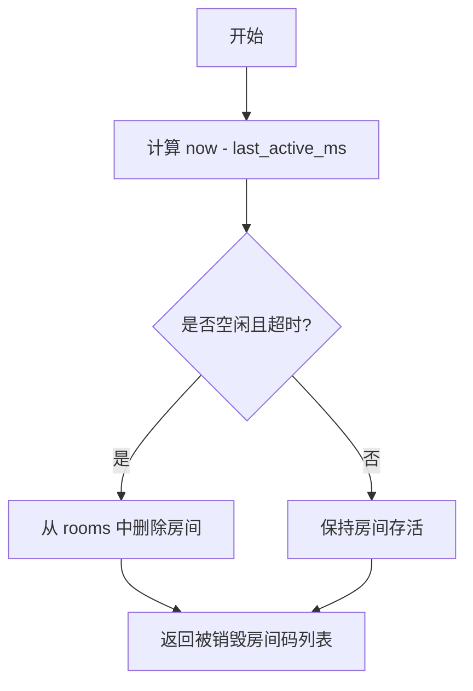
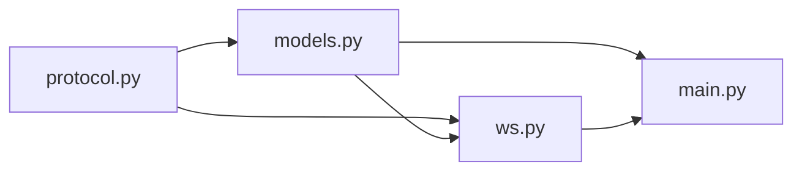

# 房间生命周期管理

<cite>
**本文引用的文件**
- [server/server/models.py](file://server/server/models.py)
- [server/server/ws.py](file://server/server/ws.py)
- [server/server/main.py](file://server/server/main.py)
- [server/server/protocol.py](file://server/server/protocol.py)
</cite>

## 目录
1. [简介](#简介)
2. [项目结构](#项目结构)
3. [核心组件](#核心组件)
4. [架构总览](#架构总览)
5. [详细组件分析](#详细组件分析)
6. [依赖关系分析](#依赖关系分析)
7. [性能与并发](#性能与并发)
8. [故障排查指南](#故障排查指南)
9. [结论](#结论)
10. [附录：API 示例与错误码](#附录api-示例与错误码)

## 简介
本技术文档聚焦于 ScriptCue 服务端的“房间”生命周期管理，围绕 Room 类的设计模式与核心功能展开，覆盖房间的创建、加入、销毁、状态管理、代码生成算法与唯一性保证、属性管理（名称、密码保护、lead_ms 配置、时间戳维护）、活跃度检测与空闲清理机制，以及并发安全与内存管理策略。同时提供房间管理的 API 接口示例与错误处理模式，帮助开发者快速理解并正确使用房间子系统。

## 项目结构
服务端采用 FastAPI + WebSocket 的架构，房间相关逻辑主要分布在以下模块：
- models.py：定义 Room、AgentSession、RoomManager 等数据模型与管理器，包含房间代码生成、空闲清理等核心逻辑。
- ws.py：WebSocket 会话处理，负责主控端与被控端的连接建立、消息路由、房间加入/离开、指令调度与回执处理。
- main.py：应用入口，启动后台任务进行离线设备检测与空闲房间清理。
- protocol.py：协议常量与限制参数（如房间码长度、默认提前量、最大设备数、空闲 TTL 等）。

图表来源
- [server/server/main.py:36-72](file://server/server/main.py#L36-L72)
- [server/server/ws.py:15-20](file://server/server/ws.py#L15-L20)
- [server/server/models.py:64-157](file://server/server/models.py#L64-L157)
- [server/server/protocol.py:67-80](file://server/server/protocol.py#L67-L80)

章节来源
- [server/server/main.py:1-98](file://server/server/main.py#L1-L98)
- [server/server/ws.py:1-360](file://server/server/ws.py#L1-L360)
- [server/server/models.py:1-157](file://server/server/models.py#L1-L157)
- [server/server/protocol.py:1-80](file://server/server/protocol.py#L1-L80)

## 核心组件
- Room：表示一个房间，持有房间码、名称、密码、lead_ms、创建与最后活跃时间戳、控制器连接与会话令牌、被控端会话集合、待执行指令队列等。
- AgentSession：表示一台被控设备的会话，包含在线状态、时钟质量、补偿值、最近心跳时间、待执行指令映射等。
- RoomManager：房间管理器，维护所有房间字典，提供创建、查询、删除、空闲清理等方法，并实现房间码生成算法。

章节来源
- [server/server/models.py:64-157](file://server/server/models.py#L64-L157)

## 架构总览
房间生命周期由 WebSocket 层驱动，通过 RoomManager 在内存中维护房间集合。主控端通过 CTRL_CREATE/CTRL_JOIN/CTRL_RESUME 进入房间；被控端通过 AGENT_JOIN 加入房间。后台任务定期扫描并销毁空闲超时的房间。

图表来源
- [server/server/ws.py:154-208](file://server/server/ws.py#L154-L208)
- [server/server/models.py:120-157](file://server/server/models.py#L120-L157)
- [server/server/main.py:54-61](file://server/server/main.py#L54-L61)

## 详细组件分析

### Room 类设计与核心功能
- 属性管理
  - code：房间唯一标识（字符串）
  - name：房间名称，未设置时回退为 code
  - password：可选的口令保护
  - lead_ms：指令提前量（毫秒），用于控制指令下发到执行的缓冲时间
  - created_at_ms：房间创建时间戳
  - last_active_ms：最后活跃时间戳，每次交互都会更新
  - controller_ws/controller_token：主控端连接与会话令牌，支持新连接顶替旧连接
  - agents：被控端会话字典，键为 session_id
  - pending_commands：全体待执行指令队列，键为 command_id
  - _agent_seq：被控端序号计数器，用于生成唯一 session_id

- 关键方法
  - touch()：更新 last_active_ms，标记房间活跃
  - is_idle()：判断是否空闲（无主控且无在线被控端）
  - add_agent(nickname)：添加被控端会话，超过上限抛出 RoomFullError
  - find_session_by_token(token)：按令牌查找会话
  - broadcast_agents(msg, session=None)：向房间内在线被控端广播或单发
  - notify_controller(msg)：通知主控端
  - agent_states()：返回所有被控端的状态列表

图表来源
- [server/server/models.py:17-118](file://server/server/models.py#L17-L118)

章节来源
- [server/server/models.py:64-118](file://server/server/models.py#L64-L118)

### 房间代码生成算法与唯一性保证
- 算法位置：RoomManager._generate_code(existing)
- 过程
  - 从协议定义的字母表中随机选择固定长度的字符组合生成候选房间码
  - 检查候选码是否在现有房间集合中，若冲突则重试
  - 直到生成不冲突的房间码为止
- 唯一性保证
  - 基于内存中的 rooms 字典键集合去重
  - 创建时先检查是否存在同名房间，存在则直接复用
  - 支持传入指定 code 以恢复服务器重启后的房间重建流程

图表来源
- [server/server/models.py:124-130](file://server/server/models.py#L124-L130)
- [server/server/protocol.py:67-71](file://server/server/protocol.py#L67-L71)

章节来源
- [server/server/models.py:120-140](file://server/server/models.py#L120-L140)
- [server/server/protocol.py:67-71](file://server/server/protocol.py#L67-L71)

### 房间创建、加入、销毁与状态管理
- 创建房间
  - 主控端发送 CTRL_CREATE，服务端调用 RoomManager.create_room(name, password, code, lead_ms)
  - 若未指定 code，则调用 _generate_code 生成唯一房间码
  - 将房间存入 rooms 字典并返回
- 加入房间
  - 主控端发送 CTRL_JOIN，服务端根据 room_code 获取房间
  - 校验房间是否存在与密码是否正确
  - 建立主控连接，记录 controller_ws 与 controller_token，并通知主控已加入
- 销毁房间
  - 后台任务 _idle_sweep 每分钟调用 RoomManager.sweep_expired(now)
  - 筛选出 is_idle() 且 last_active_ms 超过 ROOM_IDLE_TTL_S * 1000 的房间
  - 从 rooms 中移除并记录审计日志
- 状态管理
  - 每次主控或被控端交互都会调用 room.touch() 更新 last_active_ms
  - 被控端心跳与指令回执会触发状态推送给主控端

图表来源
- [server/server/ws.py:154-185](file://server/server/ws.py#L154-L185)
- [server/server/models.py:131-140](file://server/server/models.py#L131-L140)
- [server/server/main.py:54-61](file://server/server/main.py#L54-L61)

章节来源
- [server/server/ws.py:154-208](file://server/server/ws.py#L154-L208)
- [server/server/models.py:131-157](file://server/server/models.py#L131-L157)
- [server/server/main.py:54-61](file://server/server/main.py#L54-L61)

### 房间属性管理与时间戳维护
- 名称与密码
  - name 可为空，默认使用 code
  - password 可选，加入时需校验
- lead_ms 配置
  - 默认来自环境变量 SC_DEFAULT_LEAD_MS，可通过协议常量 DEFAULT_LEAD_MS 读取
  - 主控下发指令时可覆盖 lead_ms，但会被限制在 LEAD_MIN/LEAD_MAX 范围内
- 时间戳维护
  - created_at_ms：房间创建时刻
  - last_active_ms：最后一次交互时刻，用于空闲判定
  - 被控端 last_seen_ms：最近心跳时刻，用于离线判定

章节来源
- [server/server/models.py:64-82](file://server/server/models.py#L64-L82)
- [server/server/ws.py:67-77](file://server/server/ws.py#L67-L77)
- [server/server/protocol.py:72-79](file://server/server/protocol.py#L72-L79)

### 活跃度检测与空闲清理机制
- 活跃度检测 is_idle()
  - 如果存在主控连接，则房间不空闲
  - 否则检查是否有任意被控端在线，若无则为空闲
- 空闲清理 sweep_expired(now)
  - 遍历 rooms，筛选 is_idle() 且 last_active_ms 距离 now 超过 ROOM_IDLE_TTL_S * 1000 的房间
  - 删除这些房间并返回被销毁的房间码列表
- 后台任务 _idle_sweep
  - 每秒睡眠 60 秒，调用 sweep_expired(now_ms())
  - 记录审计日志 room_expired

图表来源
- [server/server/models.py:83-87](file://server/server/models.py#L83-L87)
- [server/server/models.py:148-157](file://server/server/models.py#L148-L157)
- [server/server/main.py:54-61](file://server/server/main.py#L54-L61)

章节来源
- [server/server/models.py:83-87](file://server/server/models.py#L83-L87)
- [server/server/models.py:148-157](file://server/server/models.py#L148-L157)
- [server/server/main.py:54-61](file://server/server/main.py#L54-L61)

### 并发安全考虑与内存管理策略
- 并发安全
  - 房间与会话均为纯内存数据结构，Python GIL 保证基本原子性
  - 主控连接支持新连接顶替旧连接，避免多主控冲突
  - 被控端旧连接也会被顶替，确保同一会话只有一条有效连接
  - 后台任务仅做只读扫描与删除操作，不会修改正在处理的会话状态
- 内存管理
  - 房间与会话均存储在内存字典中，重启后丢失
  - 客户端支持 auto_create 与指定 code 重建房间，保障业务连续性
  - 空闲清理机制防止长期闲置房间占用内存
  - 指令回执超时后清理 pending_commands，避免无限增长

章节来源
- [server/server/ws.py:175-180](file://server/server/ws.py#L175-L180)
- [server/server/ws.py:276-281](file://server/server/ws.py#L276-L281)
- [server/server/models.py:131-140](file://server/server/models.py#L131-L140)
- [server/server/models.py:148-157](file://server/server/models.py#L148-L157)
- [server/server/ws.py:107-115](file://server/server/ws.py#L107-L115)

## 依赖关系分析
- ws.py 依赖 models.py 的 Room、AgentSession、RoomManager 与 protocol.py 的常量
- main.py 启动后台任务，依赖 models.py 的 RoomManager 与 timebase.now_ms()
- protocol.py 提供房间码长度、默认提前量、空闲 TTL、最大设备数等限制

图表来源
- [server/server/ws.py:15-20](file://server/server/ws.py#L15-L20)
- [server/server/main.py:22-27](file://server/server/main.py#L22-L27)
- [server/server/models.py:6-11](file://server/server/models.py#L6-L11)

章节来源
- [server/server/ws.py:15-20](file://server/server/ws.py#L15-L20)
- [server/server/main.py:22-27](file://server/server/main.py#L22-L27)
- [server/server/models.py:6-11](file://server/server/models.py#L6-L11)

## 性能与并发
- 房间码生成：随机生成+碰撞检测，期望 O(1) 次尝试，空间复杂度取决于 rooms 集合大小
- 空闲清理：每分钟一次线性扫描 rooms，时间复杂度 O(N)，N 为房间数量
- 指令调度：pending_commands 字典操作 O(1)，回执超时清理避免堆积
- 并发模型：异步 I/O 与后台协程并行，GIL 下简单数据结构操作足够安全
- 内存优化：及时清理离线与会话断开状态，避免泄漏

[本节为通用性能讨论，无需特定文件引用]

## 故障排查指南
- 房间不存在
  - 现象：主控加入失败，返回 ERR_ROOM_NOT_FOUND
  - 排查：确认房间码正确，或启用 auto_create 重建
- 口令错误
  - 现象：加入房间时报 ERR_BAD_PASSWORD
  - 排查：核对房间密码
- 房间已满
  - 现象：被控端加入失败，返回 ERR_ROOM_FULL
  - 排查：减少设备数量或调整 MAX_AGENTS_PER_ROOM
- 指令无效或消息格式错误
  - 现象：返回 ERR_BAD_COMMAND 或 ERR_BAD_MESSAGE
  - 排查：检查指令类型与消息结构是否符合协议
- 设备离线
  - 现象：长时间无心跳，设备被标记离线并通知主控
  - 排查：检查网络与心跳间隔配置

章节来源
- [server/server/ws.py:162-168](file://server/server/ws.py#L162-L168)
- [server/server/ws.py:262-274](file://server/server/ws.py#L262-L274)
- [server/server/ws.py:67-71](file://server/server/ws.py#L67-L71)
- [server/server/main.py:40-52](file://server/server/main.py#L40-L52)

## 结论
ScriptCue 的房间生命周期管理通过简洁的 Room、AgentSession、RoomManager 设计，实现了房间创建、加入、销毁与状态管理的完整闭环。房间码生成算法具备唯一性保证，空闲清理机制有效释放内存。WebSocket 层负责会话与消息路由，配合后台任务完成离线检测与空闲清理。整体架构清晰、可扩展性强，适合在高并发场景下稳定运行。

[本节为总结性内容，无需特定文件引用]

## 附录：API 示例与错误码
- 主控端创建房间
  - 首条消息 type: controller.create
  - 字段：room_name, password（可选）
  - 响应：controller.joined（包含 room_code, room_name, token, server_time, agents）
- 主控端加入房间
  - 首条消息 type: controller.join
  - 字段：room_code, password（可选）
  - 响应：controller.joined 或错误
- 主控端恢复会话
  - 首条消息 type: controller.resume
  - 字段：room_code, token
  - 响应：controller.joined 或错误
- 被控端加入房间
  - 首条消息 type: agent.join
  - 字段：room_code, nickname（可选）, token（可选）, auto_create（可选）
  - 响应：agent.joined（包含 room_code, token, server_time, compensation_ms, lead_ms）
- 常见错误码
  - bad_proto：协议版本不匹配
  - room_not_found：房间不存在
  - bad_password：口令错误
  - room_full：房间设备数已达上限
  - not_controller：非主控端操作
  - bad_command：未知指令
  - no_such_agent：设备不存在
  - bad_message：消息格式错误

章节来源
- [server/server/ws.py:154-208](file://server/server/ws.py#L154-L208)
- [server/server/ws.py:246-289](file://server/server/ws.py#L246-L289)
- [server/server/protocol.py:57-66](file://server/server/protocol.py#L57-L66)