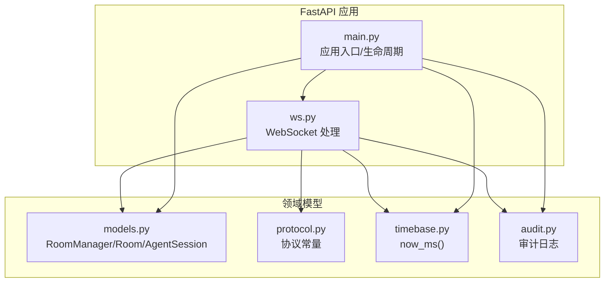
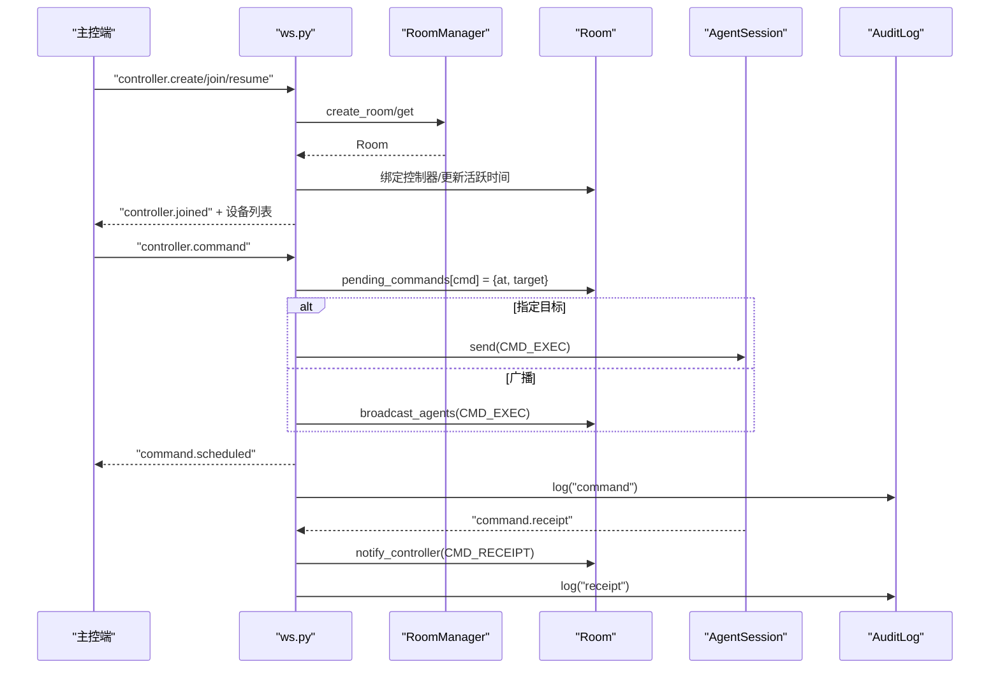
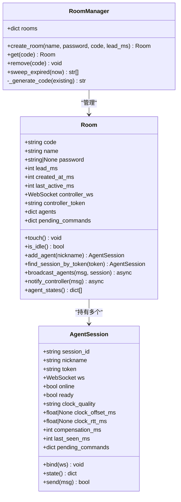
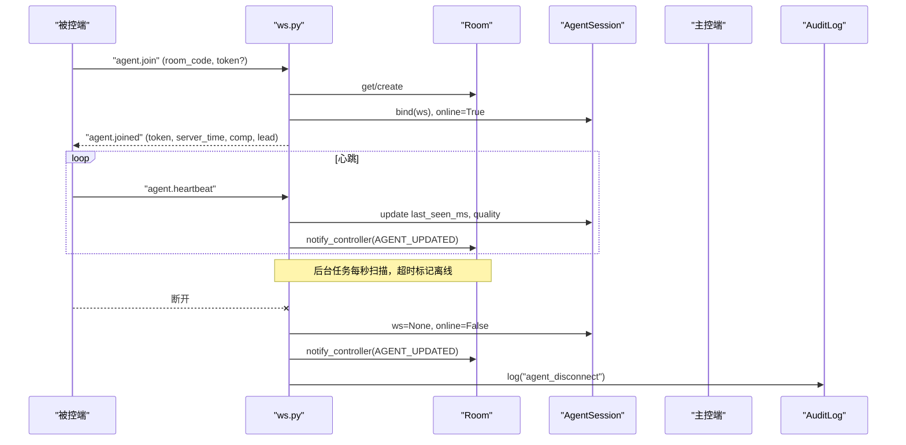
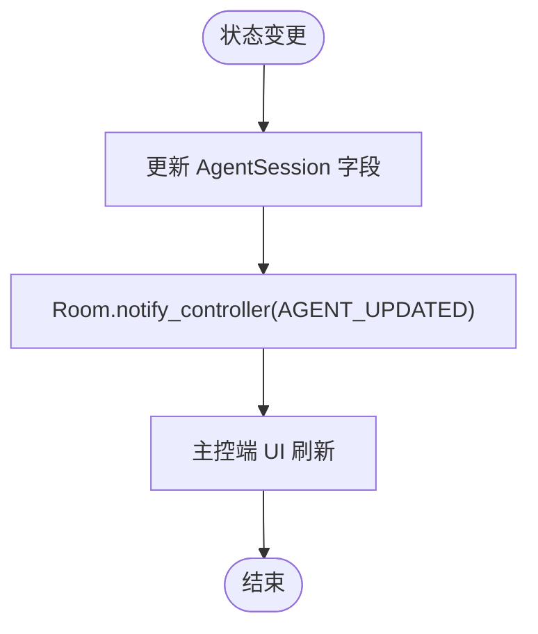
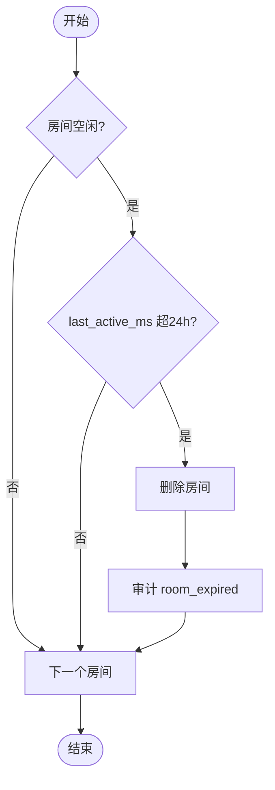
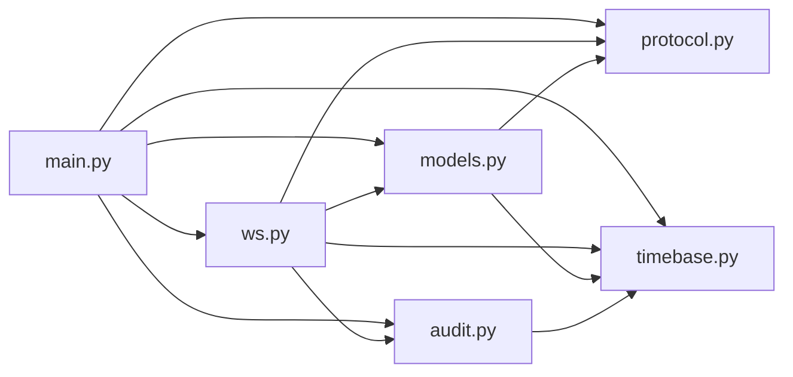

# 房间管理系统

<cite>
**本文引用的文件**
- [server/server/main.py](file://server/server/main.py)
- [server/server/ws.py](file://server/server/ws.py)
- [server/server/models.py](file://server/server/models.py)
- [server/server/protocol.py](file://server/server/protocol.py)
- [server/server/audit.py](file://server/server/audit.py)
- [server/server/timebase.py](file://server/server/timebase.py)
- [README.md](file://README.md)
</cite>

## 目录
1. [简介](#简介)
2. [项目结构](#项目结构)
3. [核心组件](#核心组件)
4. [架构总览](#架构总览)
5. [详细组件分析](#详细组件分析)
6. [依赖关系分析](#依赖关系分析)
7. [性能与并发](#性能与并发)
8. [故障排查指南](#故障排查指南)
9. [结论](#结论)
10. [附录：API 接口与使用示例](#附录api-接口与使用示例)

## 简介
本技术文档聚焦于 ScriptCue 服务端的“房间管理系统”，围绕 RoomManager、Room、AgentSession 的设计模式与实现，系统阐述房间的创建、加入、销毁与状态管理；设备会话的生命周期（连接建立、心跳检测、离线标记、会话恢复）；内存存储模型的数据结构与同步策略；空闲房间清理算法与超时处理；并发安全与性能优化；以及房间管理的 API 接口与使用示例。该子系统通过 WebSocket 长连接承载主控端与被控端通信，以纯内存方式维护房间与会话状态，配合后台任务完成离线判定与空闲清理。

## 项目结构
服务端采用 FastAPI 提供 HTTP 与 WebSocket 能力，核心模块如下：
- main.py：应用启动、生命周期管理、健康检查、WebSocket 路由挂载、后台任务（离线扫描、空闲清理）。
- ws.py：WebSocket 消息路由与处理，区分主控端与会话、被控端会话，负责指令下发、回执处理、补偿值设置等。
- models.py：房间与会话的内存模型，包含 RoomManager、Room、AgentSession。
- protocol.py：协议常量定义（消息类型、错误码、限制参数等）。
- audit.py：审计日志写入（JSON Lines），用于演出复盘。
- timebase.py：服务器时间基准（毫秒级单调时钟）。

**图表来源**
- [server/server/main.py:63-98](file://server/server/main.py#L63-L98)
- [server/server/ws.py:334-360](file://server/server/ws.py#L334-L360)
- [server/server/models.py:120-157](file://server/server/models.py#L120-L157)
- [server/server/protocol.py:1-80](file://server/server/protocol.py#L1-L80)
- [server/server/timebase.py:10-12](file://server/server/timebase.py#L10-L12)
- [server/server/audit.py:17-37](file://server/server/audit.py#L17-L37)

**章节来源**
- [server/server/main.py:1-98](file://server/server/main.py#L1-L98)
- [README.md:1-86](file://README.md#L1-L86)

## 核心组件
- RoomManager：房间管理器，负责房间字典维护、房间创建/查找/删除、空闲房间过期清理。
- Room：房间实体，维护房间元信息、控制器连接、设备会话集合、待执行指令队列、活跃时间戳。
- AgentSession：设备会话，维护设备标识、令牌、在线状态、时钟质量与偏移、补偿值、待执行指令映射、WebSocket 绑定。
- WebSocket 处理器：统一入口 handle_ws，根据首条消息类型分发到主控端或设备端会话流程。
- 后台任务：_offline_sweep（心跳超时离线）、_idle_sweep（空闲房间销毁）。
- 审计日志：记录关键事件（指令、回执、设备上下线、房间过期等）。
- 时间基准：统一 now_ms() 获取毫秒级时间戳。

**章节来源**
- [server/server/models.py:17-157](file://server/server/models.py#L17-L157)
- [server/server/ws.py:67-327](file://server/server/ws.py#L67-L327)
- [server/server/main.py:40-72](file://server/server/main.py#L40-L72)
- [server/server/audit.py:17-37](file://server/server/audit.py#L17-L37)
- [server/server/timebase.py:10-12](file://server/server/timebase.py#L10-L12)

## 架构总览
房间管理系统基于“内存模型 + 异步任务 + WebSocket 长连接”的架构：
- 主控端通过 /ws 接入，首条消息声明角色（创建/加入/恢复房间），进入 run_controller_session。
- 被控端通过 /ws 接入，首条消息为 agent.join，进入 run_agent_session。
- 指令由主控端下发，服务器计算绝对执行时刻并广播给在线设备；设备回执触发回调与审计。
- 后台任务每秒扫描设备心跳，超过阈值标记离线并通知主控；每分钟扫描空闲房间，超过 TTL 销毁。

**图表来源**
- [server/server/ws.py:154-207](file://server/server/ws.py#L154-L207)
- [server/server/ws.py:246-327](file://server/server/ws.py#L246-L327)
- [server/server/models.py:64-118](file://server/server/models.py#L64-L118)
- [server/server/audit.py:24-32](file://server/server/audit.py#L24-L32)

## 详细组件分析

### RoomManager 设计与功能
- 设计模式：单例式管理器（进程内全局实例），集中管理房间字典 rooms: dict[str, Room]。
- 核心方法：
  - create_room(name, password, code, lead_ms)：生成或复用房间码，创建 Room 并注册到字典。
  - get(code)：按房间码查找房间。
  - remove(code)：从字典移除房间。
  - sweep_expired(now)：遍历房间，判断是否空闲且超过 TTL，批量删除并返回过期房间码。
- 并发安全：当前实现未加锁，依赖 asyncio 单线程事件循环保证同一协程内的顺序访问；跨协程共享字典读写在 FastAPI 异步上下文下通常安全，但需注意高并发下的竞态风险（见“性能与并发”章节）。

**图表来源**
- [server/server/models.py:17-157](file://server/server/models.py#L17-L157)

**章节来源**
- [server/server/models.py:120-157](file://server/server/models.py#L120-L157)

### 设备会话（AgentSession）生命周期管理
- 连接建立：
  - 被控端发送 agent.join，ws.py 解析房间码与令牌，若房间不存在且 auto_create 则重建房间；否则校验密码。
  - 若存在旧连接，关闭旧连接并绑定新 WebSocket；更新房间活跃时间。
  - 返回 AGENT_JOINED，携带令牌、服务器时间、补偿值与提前量。
- 心跳检测：
  - 被控端周期性发送 AGENT_HEARTBEAT，ws.py 更新会话 last_seen_ms 与质量信息，并推送 AGENT_UPDATED 给主控。
  - 后台 _offline_sweep 每秒扫描，若 now - last_seen_ms > AGENT_OFFLINE_S * 1000，标记 offline=False，通知主控并审计。
- 离线标记：
  - 断连时（finally 分支）将 ws 置空、online=False，并通知主控与审计。
- 会话恢复：
  - 支持凭 token 恢复会话（find_session_by_token），允许客户端重连后继续参与房间。
- 指令回执：
  - 设备执行完成后发送 CMD_RECEIPT，ws.py 计算 delta_ms 并上报主控，同时清理 pending_commands。

**图表来源**
- [server/server/ws.py:246-327](file://server/server/ws.py#L246-L327)
- [server/server/main.py:40-52](file://server/server/main.py#L40-L52)
- [server/server/models.py:17-62](file://server/server/models.py#L17-L62)

**章节来源**
- [server/server/ws.py:246-327](file://server/server/ws.py#L246-L327)
- [server/server/main.py:40-52](file://server/server/main.py#L40-L52)
- [server/server/models.py:17-62](file://server/server/models.py#L17-L62)

### 内存存储模型数据结构与状态同步
- 房间字典：rooms: dict[str, Room]，键为房间码，值为 Room 实例。
- 设备映射：Room.agents: dict[str, AgentSession]，键为 session_id，值为设备会话。
- 待执行指令：
  - Room.pending_commands: dict[str, {command, at, target}]，全局待执行指令。
  - AgentSession.pending_commands: dict[str, int]，设备侧等待触发的指令映射 command_id -> at。
- 状态同步策略：
  - 设备状态变化（上线/下线、就绪、时钟质量、补偿值）通过 notify_controller 推送 AGENT_UPDATED 给主控。
  - 指令回执通过 CMD_RECEIPT 上报，附带 fired_at 与 delta_ms，便于主控观察执行偏差。
  - 控制器连接顶替：新连接接管旧控制器连接，确保单一控制器。

**图表来源**
- [server/server/models.py:100-117](file://server/server/models.py#L100-L117)
- [server/server/ws.py:214-243](file://server/server/ws.py#L214-L243)

**章节来源**
- [server/server/models.py:64-118](file://server/server/models.py#L64-L118)
- [server/server/ws.py:214-243](file://server/server/ws.py#L214-L243)

### 空闲房间清理算法与超时处理
- 空闲判定：Room.is_idle() 当无控制器连接且所有设备均不在线时视为空闲。
- 超时阈值：ROOM_IDLE_TTL_S = 24*3600 秒（24小时）。
- 清理算法：RoomManager.sweep_expired(now) 遍历 rooms，筛选 is_idle() 且 last_active_ms 超过阈值的房间，删除并返回过期房间码。
- 后台任务：_idle_sweep 每分钟执行一次，调用 sweep_expired 并审计 room_expired。

**图表来源**
- [server/server/models.py:80-88](file://server/server/models.py#L80-L88)
- [server/server/models.py:148-157](file://server/server/models.py#L148-L157)
- [server/server/main.py:54-61](file://server/server/main.py#L54-L61)

**章节来源**
- [server/server/main.py:54-61](file://server/server/main.py#L54-L61)
- [server/server/models.py:80-88](file://server/server/models.py#L80-L88)
- [server/server/models.py:148-157](file://server/server/models.py#L148-L157)

### 并发安全考虑
- 事件循环模型：FastAPI 基于 asyncio，默认单线程事件循环，协程间切换由调度器控制，避免传统多线程竞争。
- 共享状态访问：
  - RoomManager.rooms 字典读写在协程中顺序进行，通常安全；但在高并发场景下建议增加细粒度锁（如 asyncio.Lock）保护关键路径（创建/删除房间、清理过期房间）。
  - AgentSession.ws 与 online 字段在断连与重连时可能被并发修改，需确保绑定与解绑的原子性（当前 finally 块已做基本保护）。
- I/O 操作：
  - WebSocket 发送失败时捕获异常并忽略，避免阻塞事件循环。
  - 审计日志写入使用 threading.Lock 保证多协程并发写文件的原子性。
- 建议优化：
  - 对 RoomManager.sweep_expired 与 RoomManager.remove 加锁，防止并发删除导致字典迭代异常。
  - 对 AgentSession.bind 与断连逻辑加锁，避免重复绑定或状态不一致。

**章节来源**
- [server/server/audit.py:24-32](file://server/server/audit.py#L24-L32)
- [server/server/ws.py:29-39](file://server/server/ws.py#L29-L39)
- [server/server/models.py:35-39](file://server/server/models.py#L35-L39)

### 性能优化策略
- 心跳节流：AGENT_PUSH_THROTTLE_S 可用于限制状态推送频率（当前代码未直接使用，可在 notify_controller 前加节流逻辑）。
- 指令回执窗口：RECEIPT_TIMEOUT_MS 控制等待回执的时间，超时后清理 pending_commands，避免内存泄漏。
- 广播优化：Room.broadcast_agents 仅向在线设备广播，减少无效发送。
- 时间基准：统一 now_ms() 提供高精度单调时间，避免系统时间跳变影响。
- 静态资源：主控端页面由 StaticFiles 托管，减少后端负载。

**章节来源**
- [server/server/protocol.py:75-80](file://server/server/protocol.py#L75-L80)
- [server/server/ws.py:107-115](file://server/server/ws.py#L107-L115)
- [server/server/models.py:100-107](file://server/server/models.py#L100-L107)
- [server/server/timebase.py:10-12](file://server/server/timebase.py#L10-L12)
- [server/server/main.py:94-98](file://server/server/main.py#L94-L98)

## 依赖关系分析
- main.py 依赖 models.RoomManager、protocol、timebase、ws、audit。
- ws.py 依赖 protocol、models、timebase、audit。
- models.py 依赖 protocol、timebase。
- audit.py 依赖 timebase。
- timebase.py 无外部依赖。

**图表来源**
- [server/server/main.py:22-26](file://server/server/main.py#L22-L26)
- [server/server/ws.py:15-18](file://server/server/ws.py#L15-L18)
- [server/server/models.py:9-10](file://server/server/models.py#L9-L10)
- [server/server/audit.py:12](file://server/server/audit.py#L12)

**章节来源**
- [server/server/main.py:22-26](file://server/server/main.py#L22-L26)
- [server/server/ws.py:15-18](file://server/server/ws.py#L15-L18)
- [server/server/models.py:9-10](file://server/server/models.py#L9-L10)
- [server/server/audit.py:12](file://server/server/audit.py#L12)

## 性能与并发
- 事件循环与协程：利用 asyncio 的高并发特性，I/O 密集型任务（WebSocket、网络请求）非阻塞。
- 内存模型：纯内存存储，无磁盘 IO 瓶颈；房间与会话数据随进程生命周期存在。
- 后台任务：_offline_sweep 与 _idle_sweep 使用 asyncio.sleep 定期执行，避免忙轮询。
- 日志写入：审计日志使用线程锁串行化写入，避免并发写冲突。
- 建议监控：
  - 监控 rooms 数量与 agents 总数，评估内存占用。
  - 统计指令回执延迟分布，优化提前量配置。
  - 关注心跳超时比例，评估网络质量。

**章节来源**
- [server/server/main.py:40-72](file://server/server/main.py#L40-L72)
- [server/server/audit.py:24-32](file://server/server/audit.py#L24-L32)

## 故障排查指南
- 设备无法加入房间：
  - 检查房间是否存在、口令是否正确、设备数是否达到上限。
  - 参考错误码：ERR_ROOM_NOT_FOUND、ERR_BAD_PASSWORD、ERR_ROOM_FULL。
- 指令未执行：
  - 检查设备是否在线、是否收到 CMD_EXEC、是否按时回执。
  - 查看 pending_commands 是否被清理（回执窗口超时）。
- 设备频繁离线：
  - 检查心跳间隔与超时阈值（HEARTBEAT_INTERVAL_S、AGENT_OFFLINE_S）。
  - 观察网络抖动与 RTT，调整提前量与补偿值。
- 房间未自动销毁：
  - 确认是否有控制器连接或设备在线，is_idle() 判定条件。
  - 检查 sweep_expired 是否被执行。

**章节来源**
- [server/server/ws.py:154-207](file://server/server/ws.py#L154-L207)
- [server/server/ws.py:246-327](file://server/server/ws.py#L246-L327)
- [server/server/protocol.py:57-66](file://server/server/protocol.py#L57-L66)
- [server/server/models.py:80-88](file://server/server/models.py#L80-L88)

## 结论
ScriptCue 的房间管理系统以简洁清晰的内存模型与异步任务为核心，实现了房间的全生命周期管理与设备会话的高效协调。通过心跳检测与空闲清理机制，保障了系统的稳定性与资源利用率。WebSocket 通道承载了主控端与被控端的实时交互，配合审计日志满足演出复盘需求。建议在后续版本中引入细粒度锁与监控指标，进一步提升高并发场景下的健壮性与可观测性。

## 附录：API 接口与使用示例
- WebSocket 端点：/ws
  - 首条消息类型：
    - 主控端：controller.create、controller.join、controller.resume
    - 被控端：agent.join
  - 主控端命令：
    - controller.command：下发指令（play/pause/test），支持 target 指定设备或广播。
    - controller.cancel：取消待执行指令。
    - controller.set_comp：设置设备补偿值。
  - 被控端消息：
    - agent.heartbeat：心跳上报。
    - agent.set_comp：设备主动设置补偿值。
    - clock.sync_req：授时请求。
    - command.receipt：指令回执。
- 健康检查：GET /healthz
  - 返回服务器时间、协议版本、房间数量。
- 使用示例：
  - 主控端创建房间：发送 {"type": "controller.create", "room_name": "...", "password": "..."}。
  - 被控端加入房间：发送 {"type": "agent.join", "room_code": "...", "nickname": "..."}。
  - 下发指令：发送 {"type": "controller.command", "command": "play", "lead_ms": 3000, "target": "agent-1"}。
  - 查看健康状态：访问 http://<server>:8000/healthz。

**章节来源**
- [server/server/main.py:78-90](file://server/server/main.py#L78-L90)
- [server/server/ws.py:154-207](file://server/server/ws.py#L154-L207)
- [server/server/ws.py:246-327](file://server/server/ws.py#L246-L327)
- [server/server/protocol.py:11-49](file://server/server/protocol.py#L11-L49)