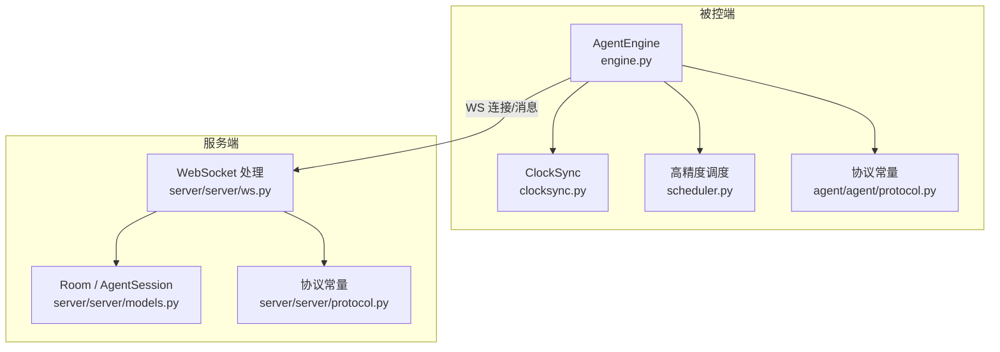
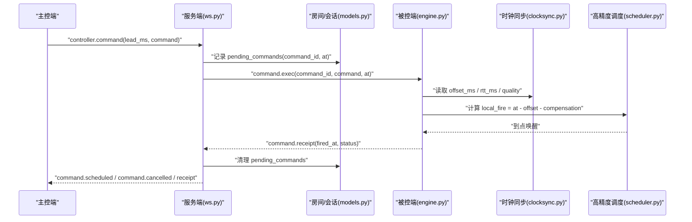
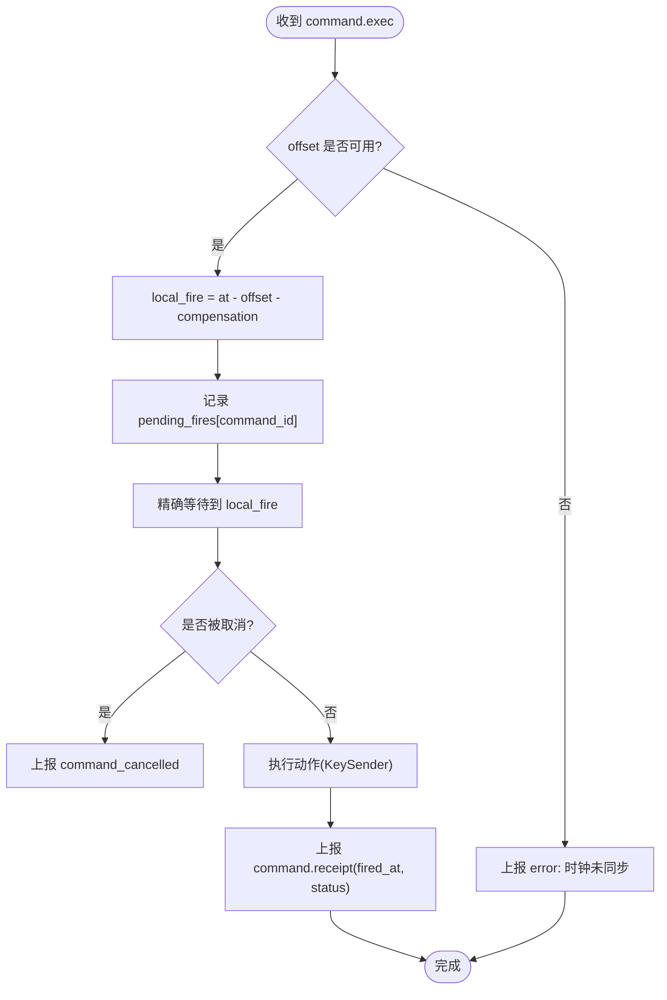
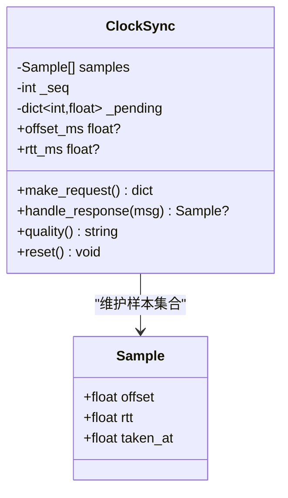
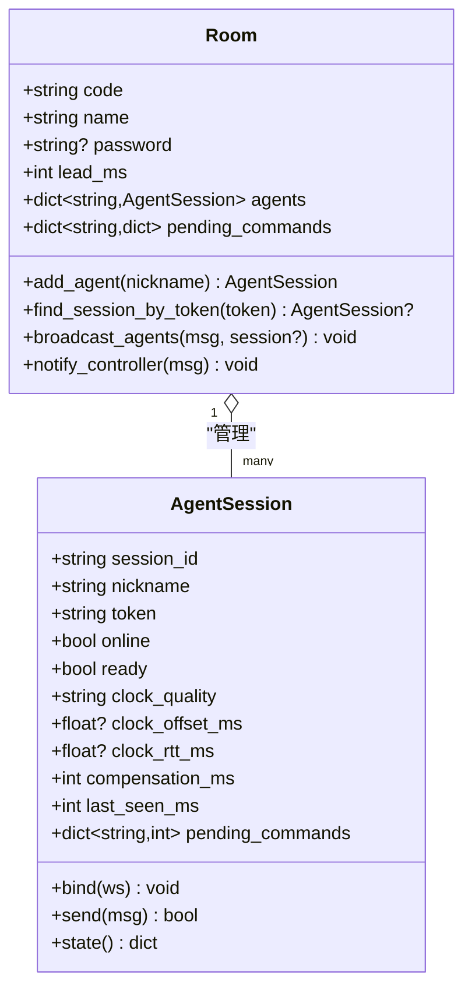
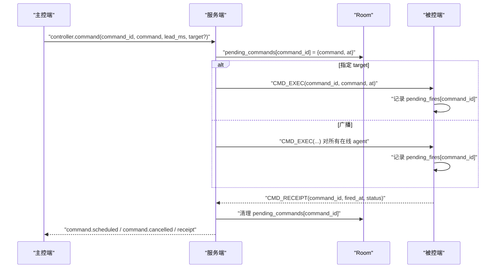
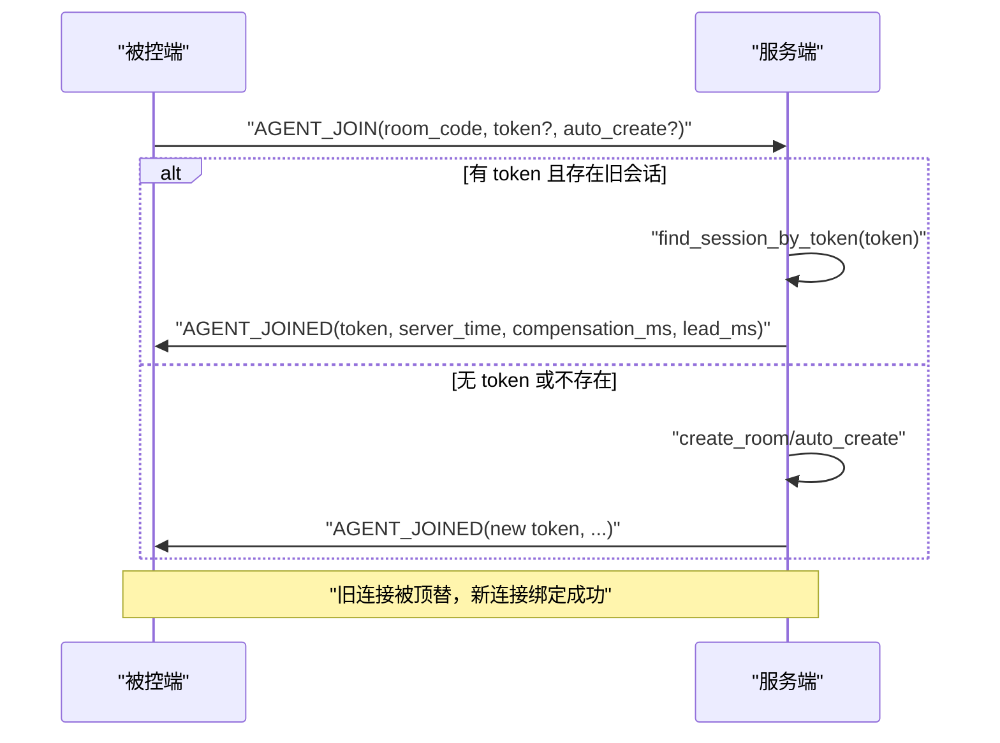
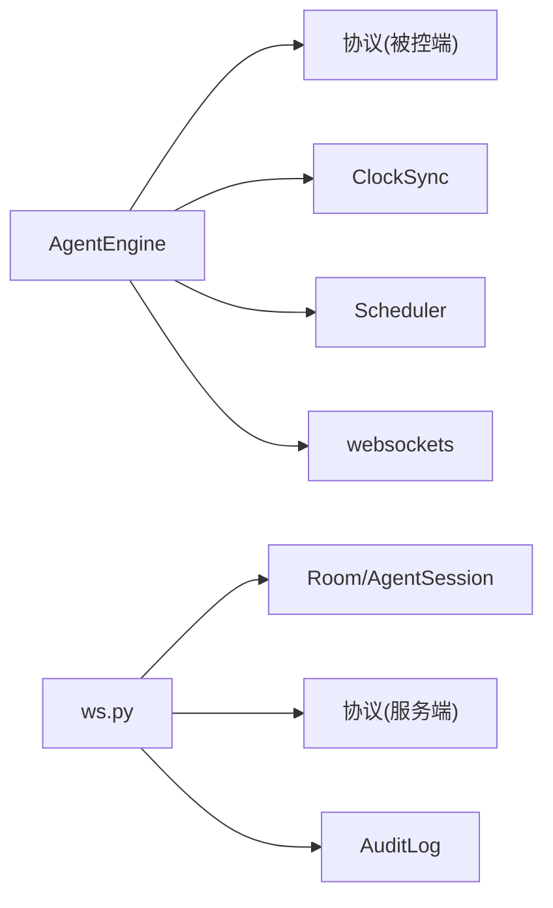

# 设备会话管理

<cite>
**本文引用的文件**
- [engine.py](file://agent/agent/engine.py)
- [clocksync.py](file://agent/agent/clocksync.py)
- [scheduler.py](file://agent/agent/scheduler.py)
- [protocol.py（被控端）](file://agent/agent/protocol.py)
- [ws.py](file://server/server/ws.py)
- [models.py](file://server/server/models.py)
- [protocol.py（服务端）](file://server/server/protocol.py)
- [README.md](file://README.md)
</cite>

## 目录
1. [简介](#简介)
2. [项目结构](#项目结构)
3. [核心组件](#核心组件)
4. [架构总览](#架构总览)
5. [详细组件分析](#详细组件分析)
6. [依赖关系分析](#依赖关系分析)
7. [性能考量](#性能考量)
8. [故障排查指南](#故障排查指南)
9. [结论](#结论)
10. [附录：API 与使用示例](#附录api-与使用示例)

## 简介
本技术文档聚焦 ScriptCue 的“设备会话管理”，围绕 AgentSession 类的设计模式与核心功能展开，覆盖会话创建、绑定、状态维护与销毁；深入说明 WebSocket 绑定、在线状态跟踪与心跳机制；文档化时钟质量评估、偏移量计算、RTT 测量与补偿值管理；解释待执行指令队列的管理与同步策略；并给出基于令牌（token）的断线重连与会话恢复机制。最后提供设备会话管理的 API 接口与使用示例，帮助主控端与被控端正确协作。

## 项目结构
本项目由三部分构成：服务端（FastAPI + WebSocket）、主控端（网页）、被控端（Python）。设备会话管理主要涉及被控端的引擎模块与服务端的房间与会话模型。

图表来源
- [engine.py:31-193](file://agent/agent/engine.py#L31-L193)
- [clocksync.py:29-106](file://agent/agent/clocksync.py#L29-L106)
- [scheduler.py:33-59](file://agent/agent/scheduler.py#L33-L59)
- [protocol.py（被控端）:1-80](file://agent/agent/protocol.py#L1-L80)
- [ws.py:246-327](file://server/server/ws.py#L246-L327)
- [models.py:17-117](file://server/server/models.py#L17-L117)
- [protocol.py（服务端）:1-80](file://server/server/protocol.py#L1-L80)

章节来源
- [README.md:16-28](file://README.md#L16-L28)

## 核心组件
- AgentEngine（被控端）：负责连接生命周期、时钟同步、绝对时刻调度与触发回执、心跳上报、断线重连。
- ClockSync（被控端）：实现类 NTP 的时钟同步算法，维护样本集合，估算偏移与 RTT，输出质量等级。
- Scheduler（被控端）：高精度定时等待，采用“粗睡眠 + 末段自旋”策略，保证亚毫秒级到点精度。
- Room / AgentSession（服务端）：房间与会话模型，管理设备在线状态、待执行指令、补偿值、令牌与广播。
- WebSocket 处理（服务端）：解析首条消息区分主控/被控，处理加入、心跳、时钟同步、指令下发与回执。

章节来源
- [engine.py:31-193](file://agent/agent/engine.py#L31-L193)
- [clocksync.py:29-106](file://agent/agent/clocksync.py#L29-L106)
- [scheduler.py:33-59](file://agent/agent/scheduler.py#L33-L59)
- [models.py:17-117](file://server/server/models.py#L17-L117)
- [ws.py:246-327](file://server/server/ws.py#L246-L327)

## 架构总览
下图展示了从主控端下发指令到被控端精确触发的端到端流程，包括时钟同步、指令队列管理与回执回传。

图表来源
- [ws.py:67-115](file://server/server/ws.py#L67-L115)
- [ws.py:246-327](file://server/server/ws.py#L246-L327)
- [engine.py:297-379](file://agent/agent/engine.py#L297-L379)
- [clocksync.py:44-87](file://agent/agent/clocksync.py#L44-L87)
- [scheduler.py:33-59](file://agent/agent/scheduler.py#L33-L59)

## 详细组件分析

### AgentEngine（被控端会话引擎）
- 设计要点
  - 线程模型：事件循环运行在 asyncio 中；触发在独立线程执行，避免阻塞事件循环；回调 on_event 在引擎线程调用。
  - 连接生命周期：run() 主循环封装 connect → serve → 指数退避重连；_connect_and_serve() 建立 WS 并启动密集同步、心跳、维持同步任务。
  - 加入房间：_join() 发送 AGENT_JOIN，接收 AGENT_JOINED，保存 token、compensation_ms、lead_ms，重置时钟同步。
  - 时钟同步：_dense_sync() 加入后立即密集采样；_maintain_sync_loop() 周期性维持采样。
  - 心跳：_heartbeat_loop() 每 5s 上报 ready、clock_quality、offset、rtt、pending_command；set_ready() 立即补发一次心跳。
  - 指令调度：_schedule_fire() 将命令放入 _pending_fires，计算 local_fire 并启动线程等待；_fire_worker() 到点后执行 KeySender 并上报回执。
  - 错误与取消：支持 CMD_CANCEL 取消待执行命令；异常时通过 on_event 上报 error。
  - 断线重连：run() 捕获异常后按 RECONNECT_BACKOFF_S 指数退避，最大不超过 RECONNECT_BACKOFF_MAX_S。

- 关键数据流
  - 心跳消息包含 clock_quality、clock_offset_ms、clock_rtt_ms、compensation_ms、pending_command。
  - 回执消息包含 command_id、fired_at、status、delta_ms（服务端计算）。

- 复杂度与性能
  - 时钟同步：每次请求 O(1)，样本维护 O(n log n)（排序裁剪），n 上限为 SAMPLE_KEEP_MAX。
  - 调度：到点前粗睡眠，最后 SPIN_THRESHOLD_MS 自旋，CPU 占用低且精度高。

图表来源
- [engine.py:297-379](file://agent/agent/engine.py#L297-L379)

章节来源
- [engine.py:31-193](file://agent/agent/engine.py#L31-L193)
- [engine.py:198-245](file://agent/agent/engine.py#L198-L245)
- [engine.py:268-379](file://agent/agent/engine.py#L268-L379)

### ClockSync（时钟同步）
- 算法概述
  - 类 NTP：客户端发送 t0，服务器回复 ts，客户端记录 t1，计算 offset = ts - (t0 + t1)/2，rtt = t1 - t0。
  - 多采样取最小 RTT 的样本作为可信偏移，避免网络抖动影响。
  - 样本老化：超过 SAMPLE_MAX_AGE_MS 的样本仅在无新样本时兜底使用；保留最多 SAMPLE_KEEP_MAX 个样本并按 RTT 排序裁剪。
- 质量评估
  - 根据新鲜样本数量与 best.rtt 划分 excellent/good/poor/none。
- 重置
  - 重连后清空历史样本，重新密集采样，确保快速收敛。

图表来源
- [clocksync.py:22-106](file://agent/agent/clocksync.py#L22-L106)

章节来源
- [clocksync.py:29-106](file://agent/agent/clocksync.py#L29-L106)

### Scheduler（高精度调度）
- 策略
  - 粗睡眠：距离目标较远时使用 sleep，分片时长 COARSE_SLEEP_CHUNK_S，保证可响应取消。
  - 末段自旋：进入 SPIN_THRESHOLD_MS 后忙等，逼近目标时刻，误差控制在亚毫秒级。
  - Windows 下提升系统定时器分辨率，改善 sleep 精度。
- 返回值
  - 返回实际醒来时刻与是否被取消，供上层判断继续或中止。

章节来源
- [scheduler.py:1-59](file://agent/agent/scheduler.py#L1-L59)

### 服务端 AgentSession（会话模型）
- 职责
  - 管理单台设备的会话状态：session_id、nickname、token、online、ready、clock_quality、offset、rtt、compensation_ms、last_seen。
  - 维护 pending_commands：已下发但尚未回执的命令映射 command_id -> at。
  - 提供 bind(ws)、send(msg)、state() 等方法。
- 生命周期
  - 加入：run_agent_session() 创建或恢复会话，bind(ws)，设置 online=True，通知主控端。
  - 心跳：更新 ready、clock_quality、offset、rtt，推送 AGENT_UPDATED。
  - 断开：finally 中关闭 ws、置 online=False，通知主控端。

图表来源
- [models.py:17-117](file://server/server/models.py#L17-L117)

章节来源
- [models.py:17-117](file://server/server/models.py#L17-L117)
- [ws.py:246-327](file://server/server/ws.py#L246-L327)

### 指令队列与同步策略
- 服务端
  - 主控下发指令时，room.pending_commands 记录 command_id -> {command, at, target}。
  - 若指定 target，仅向该 agent 发送 CMD_EXEC；否则广播给所有在线 agent。
  - 异步清理：_cleanup_pending() 在 at + RECEIPT_TIMEOUT_MS 后移除 pending 记录。
  - 取消：CTRL_CANCEL 删除 pending 并向目标或全体 agent 发送 CMD_CANCEL。
- 被控端
  - engine._pending_fires 记录待触发命令的取消事件；收到 CMD_CANCEL 时设置事件以中断等待。
  - 回执：command.receipt 上报 fired_at、status；服务端据此计算 delta_ms 并通知主控。

图表来源
- [ws.py:67-115](file://server/server/ws.py#L67-L115)
- [ws.py:117-134](file://server/server/ws.py#L117-L134)
- [engine.py:297-379](file://agent/agent/engine.py#L297-L379)

章节来源
- [ws.py:67-134](file://server/server/ws.py#L67-L134)
- [engine.py:297-379](file://agent/agent/engine.py#L297-L379)

### 心跳检测与在线状态
- 被控端
  - 每 5s 发送 AGENT_HEARTBEAT，包含 ready、clock_quality、offset、rtt、compensation_ms、pending_command。
  - set_ready() 立即补发一次心跳，确保状态及时同步。
- 服务端
  - 收到心跳后更新 session.ready、clock_quality、offset、rtt，并推送 AGENT_UPDATED 给主控端。
  - 断开时置 online=False，并通知主控端。

章节来源
- [engine.py:217-245](file://agent/agent/engine.py#L217-L245)
- [ws.py:214-226](file://server/server/ws.py#L214-L226)
- [ws.py:291-327](file://server/server/ws.py#L291-L327)

### 时钟质量评估、偏移量与 RTT
- 质量评估
  - 基于新鲜样本数量与 best.rtt：excellent（≥10 样本且 rtt ≤ 80ms）、good（≥5 样本且 rtt ≤ 200ms）、poor、none。
- 偏移量与 RTT
  - offset_ms 与 rtt_ms 来自最佳样本；心跳上报用于主控端监控。
- 补偿值
  - 本地可调整 compensation_ms，立即生效并上报；服务端校验范围 [-10000, 10000] ms。

章节来源
- [clocksync.py:89-99](file://agent/agent/clocksync.py#L89-L99)
- [engine.py:217-245](file://agent/agent/engine.py#L217-L245)
- [ws.py:137-151](file://server/server/ws.py#L137-L151)

### 断线重连与会话恢复（基于 token）
- 被控端
  - run() 主循环捕获异常后按指数退避重连；_join() 携带 token 尝试恢复旧会话。
  - 若服务器重启导致房间丢失，客户端自动标记 auto_create，下次重连重建房间。
- 服务端
  - run_agent_session() 若提供 token，则通过 find_session_by_token 恢复旧会话；否则创建新会话。
  - 旧连接顶替：若同一会话已有 ws，先关闭旧连接再 bind 新连接。

图表来源
- [engine.py:159-193](file://agent/agent/engine.py#L159-L193)
- [ws.py:246-287](file://server/server/ws.py#L246-L287)

章节来源
- [engine.py:106-193](file://agent/agent/engine.py#L106-L193)
- [ws.py:246-287](file://server/server/ws.py#L246-L287)

## 依赖关系分析
- 被控端依赖
  - websockets：建立与服务端的长连接。
  - protocol（被控端）：消息类型、错误码、默认提前量、心跳间隔、重连退避、时钟同步参数。
  - clocksync：时钟同步算法。
  - scheduler：高精度等待。
  - timeutil：本地时间戳。
- 服务端依赖
  - FastAPI/Starlette：WebSocket 接入。
  - models：房间与会话模型。
  - protocol（服务端）：权威协议定义、限制与超时。
  - audit：审计日志。
  - timebase：服务器时间。

图表来源
- [engine.py:12-23](file://agent/agent/engine.py#L12-L23)
- [protocol.py（被控端）:1-80](file://agent/agent/protocol.py#L1-L80)
- [ws.py:6-18](file://server/server/ws.py#L6-L18)
- [models.py:1-10](file://server/server/models.py#L1-L10)
- [protocol.py（服务端）:1-80](file://server/server/protocol.py#L1-L80)

章节来源
- [engine.py:12-23](file://agent/agent/engine.py#L12-L23)
- [ws.py:6-18](file://server/server/ws.py#L6-L18)

## 性能考量
- 时钟同步
  - 密集采样（20 次，间隔 50ms）快速收敛；维持性采样（每 30s）抑制漂移。
  - 样本裁剪保留最优一批，降低内存与计算开销。
- 调度精度
  - 粗睡眠 + 末段自旋，Windows 下提升定时器分辨率，误差控制在亚毫秒级。
- 心跳与状态推送
  - 心跳间隔 5s；状态推送节流（AGENT_PUSH_THROTTLE_S）避免频繁通知主控端。
- 重连策略
  - 指数退避（1,2,4,8s，上限 10s）减少瞬时拥塞。

章节来源
- [protocol.py（被控端）:68-80](file://agent/agent/protocol.py#L68-L80)
- [protocol.py（服务端）:75-80](file://server/server/protocol.py#L75-L80)
- [scheduler.py:1-59](file://agent/agent/scheduler.py#L1-L59)

## 故障排查指南
- 常见错误
  - 协议版本不匹配：ERR_BAD_PROTO，检查两端 PROTO_VERSION。
  - 房间不存在：ERR_ROOM_NOT_FOUND，确认 room_code 与密码；必要时启用 auto_create。
  - 口令错误：ERR_BAD_PASSWORD，核对房间密码。
  - 设备不存在：ERR_NO_SUCH_AGENT，检查 target 是否正确。
  - 消息格式错误：ERR_BAD_MESSAGE，确保 JSON 对象且字段类型正确。
- 调试建议
  - 观察 on_event 回调中的 clock_sample、command_scheduled、command_fired、error 等事件。
  - 检查心跳中的 clock_quality、offset、rtt 是否正常。
  - 查看 pending_commands 是否按时清理，避免堆积。
  - 断线重连时关注 reconnecting 事件与 delay_s。

章节来源
- [protocol.py（服务端）:57-65](file://server/server/protocol.py#L57-L65)
- [engine.py:106-128](file://agent/agent/engine.py#L106-L128)
- [ws.py:334-360](file://server/server/ws.py#L334-L360)

## 结论
ScriptCue 的设备会话管理通过 AgentEngine 与 AgentSession 的协同，实现了高可靠、高精度的跨设备同步起播。其核心在于：
- 类 NTP 时钟同步与质量评估，确保偏移与 RTT 的可信估计。
- 绝对时刻调度与高精度等待，保障触发时机准确。
- 完善的指令队列管理与回执机制，支持取消与超时清理。
- 基于 token 的会话恢复与自动房间重建，提升鲁棒性。
- 心跳与状态推送，便于主控端实时监控与干预。

## 附录：API 与使用示例

### 被控端 API（AgentEngine）
- 构造与配置
  - 构造函数参数：server_url、room_code、nickname、password、room_name、key_sender、on_event、beep_fn。
  - 设置就绪：set_ready(ready)。
  - 设置补偿值：set_compensation(ms)。
  - 停止与断开：stop()、disconnect()。
- 事件回调
  - on_event(event)：引擎线程中调用，事件包括 connecting、connected、reconnecting、disconnected、clock_sample、command_scheduled、command_fired、command_cancelled、comp_changed、error。

章节来源
- [engine.py:31-79](file://agent/agent/engine.py#L31-L79)
- [engine.py:383-388](file://agent/agent/engine.py#L383-L388)

### 服务端 WebSocket 接口
- 首条消息类型
  - 主控端：controller.create、controller.join、controller.resume。
  - 被控端：agent.join。
- 主控端消息
  - controller.command：command_id、command、lead_ms、target（可选）。
  - controller.cancel：command_id。
  - controller.set_comp：session_id、compensation_ms。
- 被控端消息
  - agent.heartbeat：ready、clock_quality、clock_offset_ms、clock_rtt_ms、compensation_ms、pending_command。
  - agent.set_comp：compensation_ms。
  - command.receipt：command_id、fired_at、status、detail（可选）。
- 服务器响应
  - controller.joined：room_code、room_name、token、server_time、agents。
  - command.scheduled：command_id、command、at、lead_ms。
  - command.cancelled：command_id。
  - agent.updated：agent.state()。
  - agent.left：会话离开。
  - error：code、message。

章节来源
- [ws.py:154-208](file://server/server/ws.py#L154-L208)
- [ws.py:246-327](file://server/server/ws.py#L246-L327)
- [ws.py:334-360](file://server/server/ws.py#L334-L360)

### 使用示例（描述性）
- 被控端启动
  - 初始化 AgentEngine，传入 server_url、room_code、nickname。
  - 调用 run() 进入主循环，监听 on_event 回调。
  - 通过 set_ready(True) 表示设备就绪，开始参与同步。
- 主控端下发指令
  - 通过 controller.command 指定 command、lead_ms、target（可选）。
  - 服务端计算 at = now_ms() + lead_ms，下发 command.exec 给目标或全体在线设备。
  - 被控端收到后，依据 offset 与 compensation 计算 local_fire，精确等待并触发。
  - 被控端上报 command.receipt，服务端清理 pending 并通知主控端。

章节来源
- [README.md:61-72](file://README.md#L61-L72)
- [ws.py:67-115](file://server/server/ws.py#L67-L115)
- [engine.py:297-379](file://agent/agent/engine.py#L297-L379)