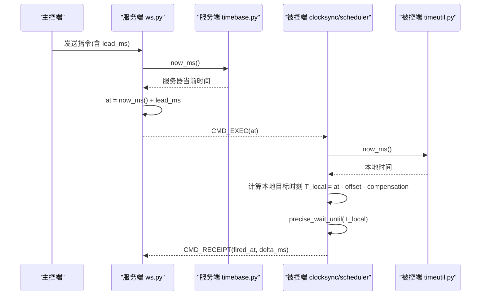
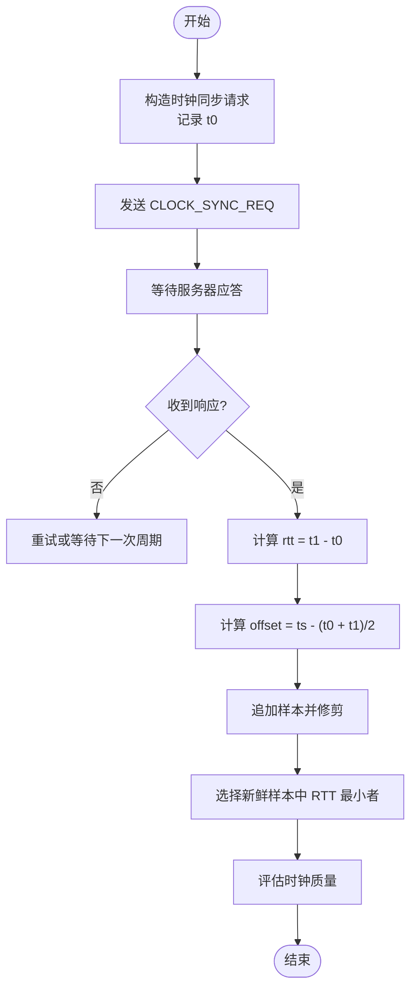
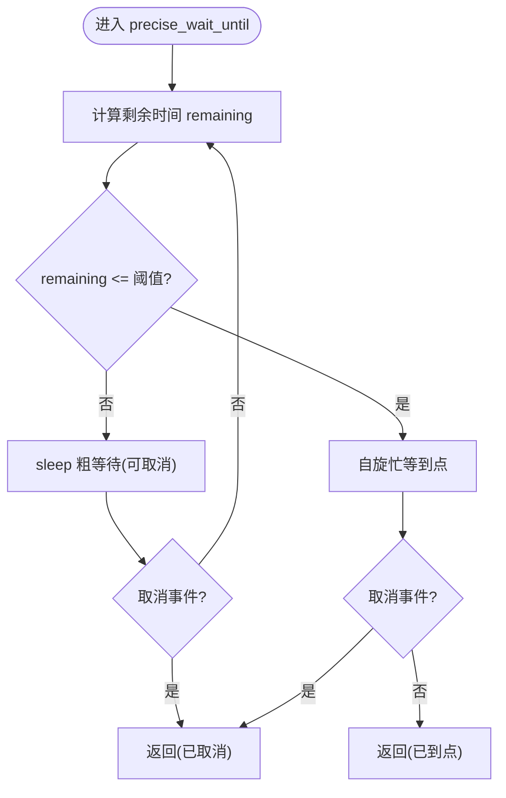
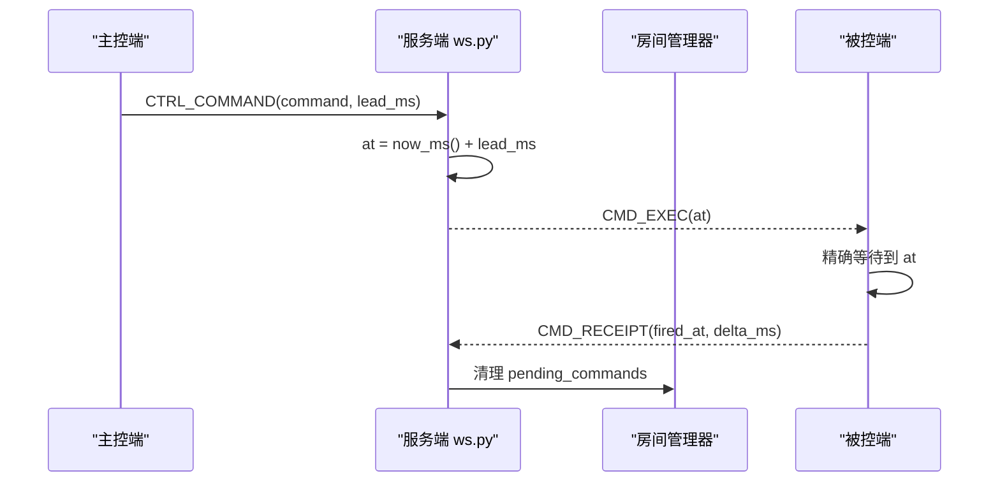
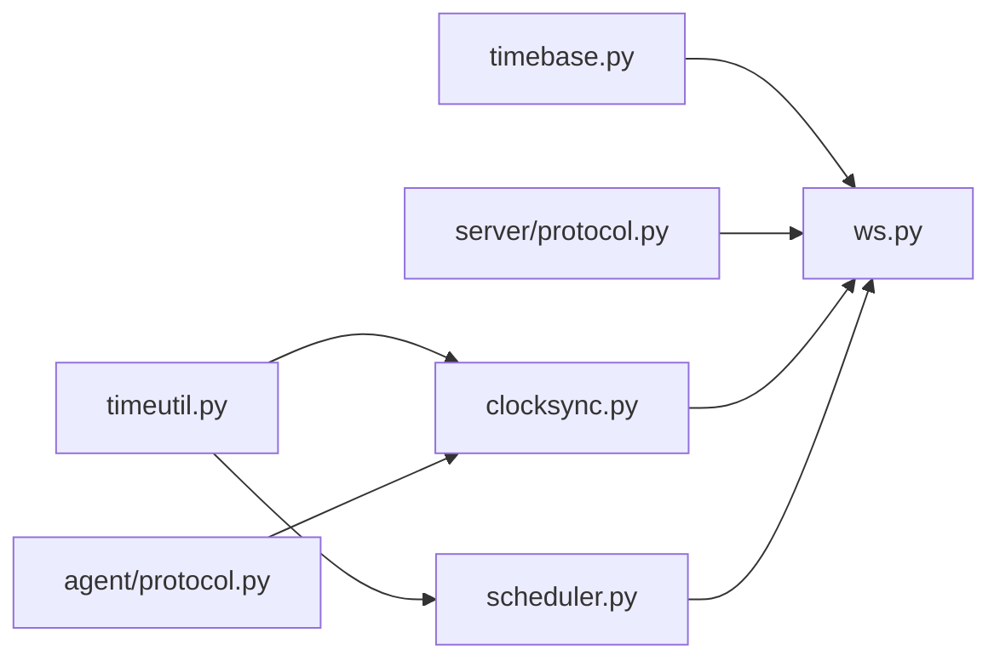

# 时钟基准服务

<cite>
**本文引用的文件**
- [server/server/timebase.py](file://server/server/timebase.py)
- [agent/agent/clocksync.py](file://agent/agent/clocksync.py)
- [agent/agent/timeutil.py](file://agent/agent/timeutil.py)
- [agent/agent/scheduler.py](file://agent/agent/scheduler.py)
- [server/server/ws.py](file://server/server/ws.py)
- [server/server/protocol.py](file://server/server/protocol.py)
- [agent/agent/protocol.py](file://agent/agent/protocol.py)
- [README.md](file://README.md)
</cite>

## 目录
1. [简介](#简介)
2. [项目结构](#项目结构)
3. [核心组件](#核心组件)
4. [架构总览](#架构总览)
5. [详细组件分析](#详细组件分析)
6. [依赖关系分析](#依赖关系分析)
7. [性能考量](#性能考量)
8. [故障排查指南](#故障排查指南)
9. [结论](#结论)
10. [附录：测试与基准](#附录测试与基准)

## 简介
本技术文档聚焦 ScriptCue 的“时钟基准服务”，围绕高精度时间获取、时钟漂移补偿、now_ms() 实现细节与性能优化，以及时间基准在房间管理与指令调度中的作用进行系统化说明。同时给出时间相关问题的排查方法与调优建议，并补充时间精度测试方法与性能基准思路。

该系统的同步核心机制为：被控端通过类 NTP 方式估算本地与服务器时钟偏移；主控下发指令时由服务器附加绝对执行时刻；被控端将绝对时刻换算为本地时刻后，采用“粗睡眠 + 末段自旋”的高精度等待策略到点触发，从而在公网环境下实现毫秒级同步起播。

**章节来源**
- [README.md:22-27](file://README.md#L22-L27)

## 项目结构
与时间基准相关的代码分布在服务端与被控端两个部分：
- 服务端提供权威时间源 now_ms()，并在 WebSocket 会话中处理时钟同步请求、指令调度与回执。
- 被控端维护本地高精度时间工具 timeutil.now_ms()，实现时钟同步算法 ClockSync，并提供高精度定时 scheduler.precise_wait_until()。

```mermaid
graph TB
subgraph "服务端"
S_WS["ws.py<br/>WebSocket 会话"]
S_TB["timebase.py<br/>now_ms() 基准"]
S_PR["protocol.py<br/>协议常量"]
end
subgraph "被控端"
A_CS["clocksync.py<br/>ClockSync 同步算法"]
A_TU["timeutil.py<br/>now_ms() 本地时间"]
A_SC["scheduler.py<br/>precise_wait_until()"]
A_PR["protocol.py<br/>协议常量副本"]
end
S_WS --> S_TB
S_WS --> S_PR
A_CS --> A_TU
A_CS --> A_PR
A_SC --> A_TU
A_SC --> A_PR
S_WS < --> A_CS : "时钟同步消息"
```

**图表来源**
- [server/server/ws.py:1-360](file://server/server/ws.py#L1-L360)
- [server/server/timebase.py:1-13](file://server/server/timebase.py#L1-L13)
- [server/server/protocol.py:1-80](file://server/server/protocol.py#L1-L80)
- [agent/agent/clocksync.py:1-106](file://agent/agent/clocksync.py#L1-L106)
- [agent/agent/timeutil.py:1-12](file://agent/agent/timeutil.py#L1-L12)
- [agent/agent/scheduler.py:1-59](file://agent/agent/scheduler.py#L1-L59)
- [agent/agent/protocol.py:1-80](file://agent/agent/protocol.py#L1-L80)

**章节来源**
- [server/server/timebase.py:1-13](file://server/server/timebase.py#L1-L13)
- [agent/agent/timeutil.py:1-12](file://agent/agent/timeutil.py#L1-L12)
- [server/server/ws.py:1-360](file://server/server/ws.py#L1-L360)
- [agent/agent/clocksync.py:1-106](file://agent/agent/clocksync.py#L1-L106)
- [agent/agent/scheduler.py:1-59](file://agent/agent/scheduler.py#L1-L59)
- [server/server/protocol.py:1-80](file://server/server/protocol.py#L1-L80)
- [agent/agent/protocol.py:1-80](file://agent/agent/protocol.py#L1-L80)

## 核心组件
- 服务端时间基准 now_ms()：基于系统高精度单调时间源，返回毫秒级 Unix 时间戳，作为所有协议中的“服务器时间”权威来源。
- 被控端本地时间 now_ms()：同样基于高精度时间源，但返回浮点毫秒以保留亚毫秒信息，用于本地计算与调度。
- 时钟同步 ClockSync：类 NTP 算法，多次采样取 RTT 最小样本作为可信偏移，具备样本老化与质量分级。
- 高精度调度 precise_wait_until：粗睡眠 + 最后 50ms 自旋等待，确保到点误差控制在亚毫秒级。
- WebSocket 会话 ws.py：承载时钟同步请求/应答、指令调度（含提前量）、回执处理与状态上报。

**章节来源**
- [server/server/timebase.py:1-13](file://server/server/timebase.py#L1-L13)
- [agent/agent/timeutil.py:1-12](file://agent/agent/timeutil.py#L1-L12)
- [agent/agent/clocksync.py:1-106](file://agent/agent/clocksync.py#L1-L106)
- [agent/agent/scheduler.py:1-59](file://agent/agent/scheduler.py#L1-L59)
- [server/server/ws.py:1-360](file://server/server/ws.py#L1-L360)

## 架构总览
下图展示了时间基准在系统中的角色与交互流程：服务端提供权威时间，被控端通过时钟同步估算偏移，指令调度使用绝对时刻，最终由被控端高精度等待到点执行。



**图表来源**
- [server/server/ws.py:67-104](file://server/server/ws.py#L67-L104)
- [server/server/timebase.py:10-12](file://server/server/timebase.py#L10-L12)
- [agent/agent/clocksync.py:37-55](file://agent/agent/clocksync.py#L37-L55)
- [agent/agent/scheduler.py:33-58](file://agent/agent/scheduler.py#L33-L58)
- [agent/agent/timeutil.py:9-11](file://agent/agent/timeutil.py#L9-L11)

## 详细组件分析

### 服务端时间基准 now_ms()
- 设计要点：
  - 使用系统高精度时间源，保证跨平台一致性。
  - 返回整数毫秒时间戳，便于协议传输与比较。
- 性能特征：
  - 单次调用开销极低，适合高频调用（如心跳、回执、指令调度）。
- 错误处理：
  - 无外部依赖，异常概率低；若底层时间源异常，上层需做好容错。

**章节来源**
- [server/server/timebase.py:1-13](file://server/server/timebase.py#L1-L13)

### 被控端本地时间 now_ms()
- 设计要点：
  - 返回浮点毫秒，保留亚毫秒信息，利于精细计算与调度。
- 性能特征：
  - 与系统高精度时间源一致，开销低。
- 注意事项：
  - 浮点表示可能带来极小舍入误差，但在毫秒级应用中可忽略。

**章节来源**
- [agent/agent/timeutil.py:1-12](file://agent/agent/timeutil.py#L1-L12)

### 时钟同步 ClockSync（R-02）
- 算法原理：
  - 被控端发送 ping（携带本地发出时刻 t0），服务器回复服务器时间 ts，被控端记录收到时刻 t1。
  - 估算偏移 offset = ts - (t0 + t1)/2，往返时延 rtt = t1 - t0。
  - 多次采样后取 RTT 最小的样本作为可信偏移，提升鲁棒性。
- 样本管理：
  - 样本带时间戳，设置最长保留时间（老化窗口），避免陈旧样本主导估算。
  - 按 RTT 排序保留最优一批样本，抑制网络抖动影响。
- 质量分级：
  - 根据新鲜样本数量与 RTT 阈值划分 excellent/good/poor/none。
- 集成点：
  - 加入房间后密集采样，随后周期性维持采样，抑制时钟漂移。
  - 心跳消息上报 clock_quality、offset_ms、rtt_ms，供主控端监控。



**图表来源**
- [agent/agent/clocksync.py:37-77](file://agent/agent/clocksync.py#L37-L77)
- [agent/agent/clocksync.py:89-99](file://agent/agent/clocksync.py#L89-L99)

**章节来源**
- [agent/agent/clocksync.py:1-106](file://agent/agent/clocksync.py#L1-L106)
- [agent/agent/protocol.py:75-79](file://agent/agent/protocol.py#L75-L79)

### 高精度调度 precise_wait_until（R-03）
- 设计要点：
  - 距离目标时刻较远时使用 sleep 粗等待，支持取消事件打断。
  - 进入最后 SPIN_THRESHOLD_MS 毫秒后切换为忙等自旋，逼近目标时刻，误差控制在亚毫秒级。
  - Windows 下提升系统定时器分辨率，改善粗睡眠精度。
- 返回值：
  - 返回实际醒来时刻与是否被取消，便于上层判断与日志记录。
- 集成点：
  - 被控端收到 CMD_EXEC 后，将绝对时刻转换为本地目标时刻，调用 precise_wait_until 到点触发。



**图表来源**
- [agent/agent/scheduler.py:33-58](file://agent/agent/scheduler.py#L33-L58)
- [agent/agent/protocol.py:79](file://agent/agent/protocol.py#L79)

**章节来源**
- [agent/agent/scheduler.py:1-59](file://agent/agent/scheduler.py#L1-L59)
- [agent/agent/protocol.py:75-79](file://agent/agent/protocol.py#L75-L79)

### 时间基准在房间管理与指令调度中的作用
- 指令调度：
  - 主控下发指令时，服务器计算 at = now_ms() + lead_ms，并将绝对时刻随指令下发。
  - 被控端将 at 换算为本地目标时刻（考虑偏移与补偿），使用 precise_wait_until 到点执行。
- 回执与审计：
  - 被控端执行后上报 CMD_RECEIPT，包含 fired_at 与 delta_ms，便于追踪执行偏差。
  - 服务器清理待执行记录，防止内存泄漏。
- 补偿机制：
  - 支持动态设置补偿值 comp，限制在允许范围内，实时生效。



**图表来源**
- [server/server/ws.py:67-114](file://server/server/ws.py#L67-L114)
- [server/server/ws.py:228-243](file://server/server/ws.py#L228-L243)

**章节来源**
- [server/server/ws.py:67-114](file://server/server/ws.py#L67-L114)
- [server/server/ws.py:228-243](file://server/server/ws.py#L228-L243)
- [server/server/protocol.py:67-79](file://server/server/protocol.py#L67-L79)

## 依赖关系分析
- 服务端依赖：
  - timebase.now_ms() 提供权威时间。
  - ws.py 负责会话、指令调度、时钟同步应答与回执处理。
  - protocol.py 定义消息类型、质量等级、限制参数。
- 被控端依赖：
  - timeutil.now_ms() 提供本地高精度时间。
  - clocksync.ClockSync 实现同步算法与质量评估。
  - scheduler.precise_wait_until() 实现高精度等待。
  - protocol.py 副本保持与服务端一致的消息常量。



**图表来源**
- [server/server/timebase.py:1-13](file://server/server/timebase.py#L1-L13)
- [server/server/ws.py:1-360](file://server/server/ws.py#L1-L360)
- [server/server/protocol.py:1-80](file://server/server/protocol.py#L1-L80)
- [agent/agent/timeutil.py:1-12](file://agent/agent/timeutil.py#L1-L12)
- [agent/agent/clocksync.py:1-106](file://agent/agent/clocksync.py#L1-L106)
- [agent/agent/scheduler.py:1-59](file://agent/agent/scheduler.py#L1-L59)
- [agent/agent/protocol.py:1-80](file://agent/agent/protocol.py#L1-L80)

**章节来源**
- [server/server/protocol.py:1-80](file://server/server/protocol.py#L1-L80)
- [agent/agent/protocol.py:1-80](file://agent/agent/protocol.py#L1-L80)

## 性能考量
- 时间源选择：
  - 服务端与被控端均使用系统高精度时间源，满足毫秒级精度需求。
- 采样策略：
  - 加入房间后密集采样，快速收敛偏移估计；后续周期性维持采样抑制漂移。
  - 样本老化与修剪避免陈旧数据影响，提升鲁棒性。
- 调度精度：
  - “粗睡眠 + 末段自旋”策略平衡功耗与精度，Windows 下提升定时器分辨率进一步改善精度。
- 网络影响：
  - 提前量 lead_ms 需覆盖网络延迟与抖动；默认值与范围在服务端协议中限定。
- 资源占用：
  - 自旋阶段 CPU 占用较高，但持续时间短（≤50ms），整体开销可控。

[本节为通用性能讨论，不直接分析具体文件]

## 故障排查指南
- 时钟质量差（poor/none）：
  - 检查网络稳定性与 RTT；确认密集采样是否完成；观察样本老化是否导致无新鲜样本。
  - 参考质量分级逻辑与阈值，调整网络或采样频率。
- 执行偏差大（delta_ms 过大）：
  - 检查 lead_ms 是否足够；确认补偿值 comp 设置合理；验证 precise_wait_until 是否被中断。
  - 查看回执消息中的 fired_at 与 at 的差异，定位偏差来源。
- 连接异常或重连：
  - 重连后重置时钟同步样本，重新密集采样；确认心跳正常上报。
- 平台差异：
  - Windows 下确认系统定时器分辨率提升成功；其他平台注意 sleep 精度差异。

**章节来源**
- [agent/agent/clocksync.py:89-99](file://agent/agent/clocksync.py#L89-L99)
- [server/server/ws.py:228-243](file://server/server/ws.py#L228-L243)
- [agent/agent/scheduler.py:33-58](file://agent/agent/scheduler.py#L33-L58)

## 结论
ScriptCue 的时钟基准服务通过高精度时间源、类 NTP 同步算法与高精度调度策略，实现了多设备在公网环境下的毫秒级同步起播。服务端提供权威时间，被控端估算偏移并到点执行，配合补偿机制与质量分级，确保系统在复杂网络条件下的鲁棒性与准确性。建议在部署时关注网络质量、提前量配置与平台差异，以获得最佳效果。

[本节为总结性内容，不直接分析具体文件]

## 附录：测试与基准
- 时间精度测试方法：
  - 在受控网络环境下，记录 CMD_EXEC 的 at 与被控端 fired_at，统计 delta_ms 分布，验证 ≤50ms 目标。
  - 模拟不同 RTT 与抖动场景，评估 ClockSync 的质量分级与偏移估计稳定性。
- 性能基准测试：
  - 测量 precise_wait_until 的唤醒误差与 CPU 占用，对比不同 spin_threshold_ms 的效果。
  - 评估密集采样与维持采样的开销，确定合适的采样间隔与样本上限。
- 调优建议：
  - 根据网络状况调整 lead_ms 与 MAINTAIN_SYNC_INTERVAL_S。
  - 在 Windows 平台确认系统定时器分辨率提升，必要时调整 COARSE_SLEEP_CHUNK_S。
  - 监控时钟质量与 RTT，动态调整补偿值与采样策略。

[本节为通用测试与调优指导，不直接分析具体文件]