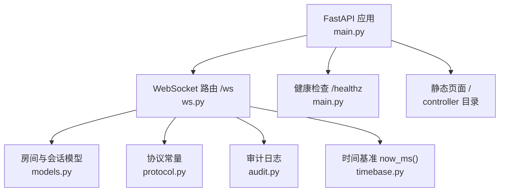
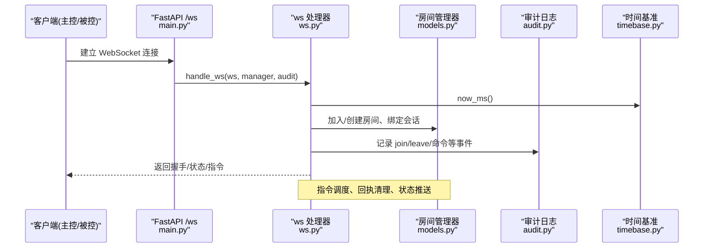
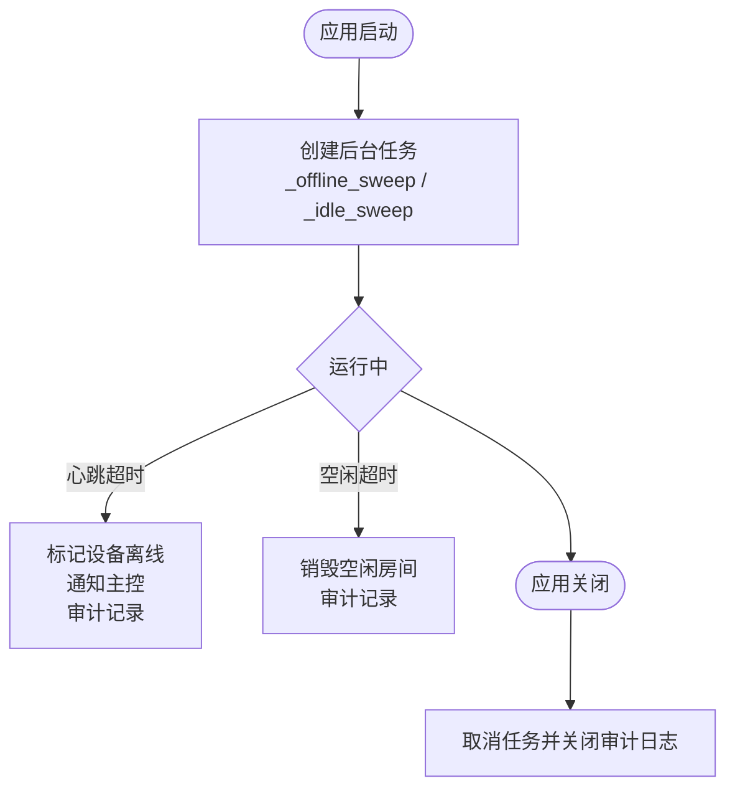
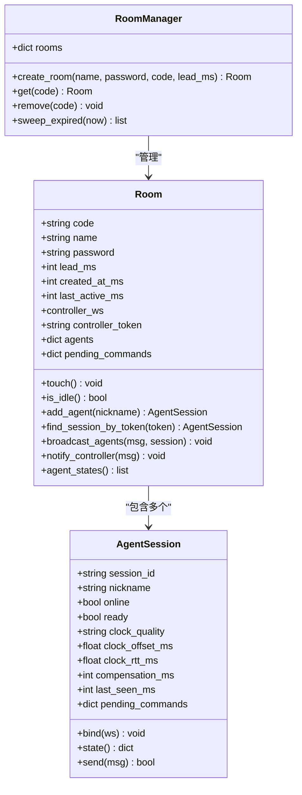
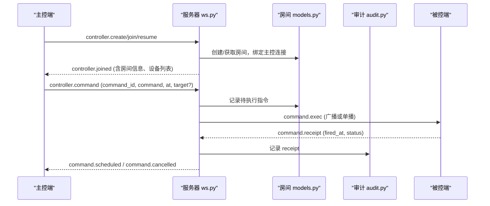
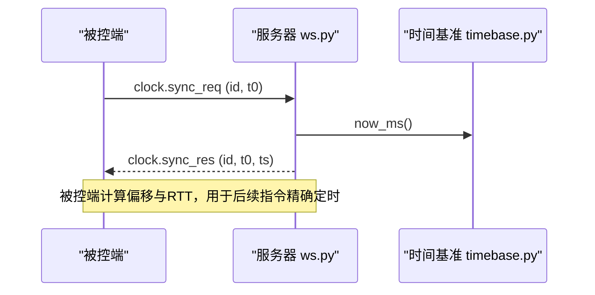
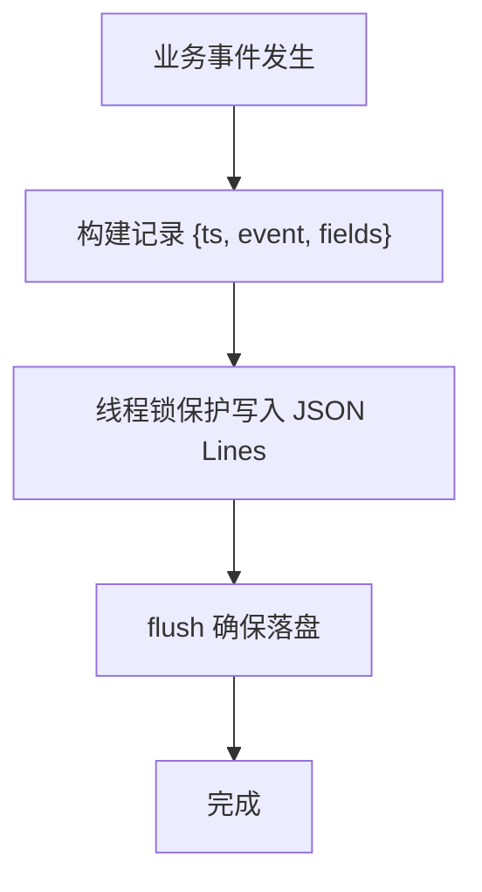
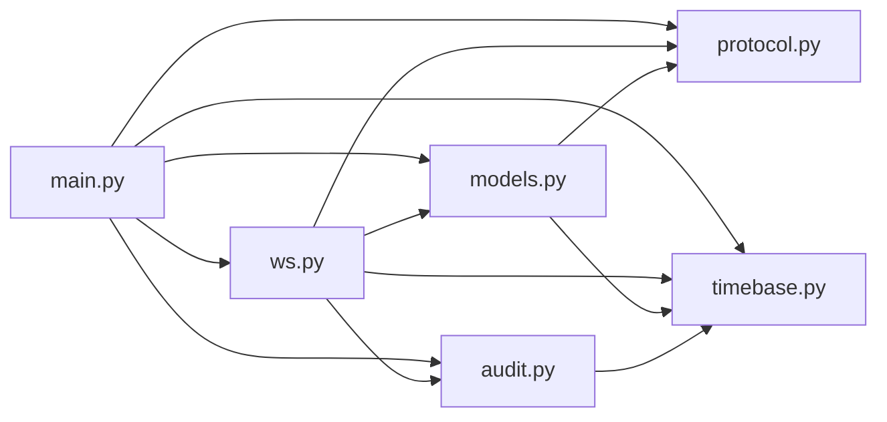

# 服务端开发指南

<cite>
**本文引用的文件**
- [server/server/main.py](file://server/server/main.py)
- [server/server/ws.py](file://server/server/ws.py)
- [server/server/models.py](file://server/server/models.py)
- [server/server/protocol.py](file://server/server/protocol.py)
- [server/server/timebase.py](file://server/server/timebase.py)
- [server/server/audit.py](file://server/server/audit.py)
- [README.md](file://README.md)
- [server/requirements.txt](file://server/requirements.txt)
- [docker-compose.yml](file://docker-compose.yml)
</cite>

## 目录
1. [简介](#简介)
2. [项目结构](#项目结构)
3. [核心组件](#核心组件)
4. [架构总览](#架构总览)
5. [详细组件分析](#详细组件分析)
6. [依赖关系分析](#依赖关系分析)
7. [性能与扩展性](#性能与扩展性)
8. [故障排查指南](#故障排查指南)
9. [结论](#结论)
10. [附录：API 与协议要点](#附录api-与协议要点)

## 简介
本指南面向 ScriptCue 服务端的开发与维护，聚焦 FastAPI 应用架构、生命周期管理、房间管理与设备会话、WebSocket 通信协议、时钟基准服务与审计日志集成。目标是帮助开发者快速理解并扩展服务端能力，确保在公网环境下实现多设备高精度同步起播。

## 项目结构
服务端位于 server 目录，采用模块化设计：
- main.py：FastAPI 应用入口、生命周期任务（离线扫描、空闲房间清理）、静态资源挂载、健康检查与 WebSocket 路由。
- ws.py：WebSocket 会话处理，区分主控端与被控端消息路由、错误处理、重连与会话恢复。
- models.py：纯内存的房间与会话模型，包含房间生命周期、设备状态、指令待执行队列等。
- protocol.py：协议常量定义（消息类型、错误码、限制参数）。
- timebase.py：服务器授时基准，提供毫秒级时间戳。
- audit.py：JSON Lines 格式的审计日志，记录关键事件。

**图表来源**
- [server/server/main.py:63-98](file://server/server/main.py#L63-L98)
- [server/server/ws.py:334-360](file://server/server/ws.py#L334-L360)
- [server/server/models.py:64-157](file://server/server/models.py#L64-L157)
- [server/server/protocol.py:1-80](file://server/server/protocol.py#L1-L80)
- [server/server/timebase.py:10-12](file://server/server/timebase.py#L10-L12)
- [server/server/audit.py:17-37](file://server/server/audit.py#L17-L37)

**章节来源**
- [server/server/main.py:1-98](file://server/server/main.py#L1-L98)
- [README.md:1-86](file://README.md#L1-L86)

## 核心组件
- 应用生命周期：启动后创建后台任务进行心跳超时检测与空闲房间清理；关闭时取消任务并关闭审计日志。
- 房间管理系统：内存存储房间与会话，支持自动销毁、口令保护、最大成员数限制、指令调度与回执清理。
- WebSocket 通信：统一 /ws 端点，首条消息声明角色（主控或设备），按协议路由到对应处理器。
- 时钟基准：基于系统单调高精度时间源，保证所有“服务器时间”一致。
- 审计日志：线程安全追加写 JSON Lines，记录指令下发、回执、设备上下线等事件。

**章节来源**
- [server/server/main.py:40-72](file://server/server/main.py#L40-L72)
- [server/server/models.py:17-157](file://server/server/models.py#L17-L157)
- [server/server/ws.py:67-327](file://server/server/ws.py#L67-L327)
- [server/server/timebase.py:10-12](file://server/server/timebase.py#L10-L12)
- [server/server/audit.py:17-37](file://server/server/audit.py#L17-L37)

## 架构总览
下图展示了请求从客户端进入 FastAPI 到房间管理与 WebSocket 处理的整体流程，以及各模块之间的依赖关系。

**图表来源**
- [server/server/main.py:88-90](file://server/server/main.py#L88-L90)
- [server/server/ws.py:334-360](file://server/server/ws.py#L334-L360)
- [server/server/models.py:120-157](file://server/server/models.py#L120-L157)
- [server/server/audit.py:24-32](file://server/server/audit.py#L24-L32)
- [server/server/timebase.py:10-12](file://server/server/timebase.py#L10-L12)

## 详细组件分析

### FastAPI 应用与生命周期
- 应用初始化：加载配置路径、创建 RoomManager 与 AuditLog 实例。
- 生命周期任务：
  - 离线扫描：每秒检查设备心跳，超过阈值标记离线并通知主控，记录审计事件。
  - 空闲清理：每分钟扫描房间，销毁空闲超时的房间，记录审计事件。
- 路由：
  - GET /healthz：返回服务状态、协议版本、服务器时间与房间数量。
  - WebSocket /ws：统一接入点，交由 ws.py 处理。
  - 静态页面：若存在 controller 目录则挂载为根路径。

**图表来源**
- [server/server/main.py:40-72](file://server/server/main.py#L40-L72)

**章节来源**
- [server/server/main.py:12-98](file://server/server/main.py#L12-L98)

### 房间管理与设备会话
- AgentSession：表示一台被控设备的会话，维护在线状态、时钟质量、补偿值、待执行指令映射等。
- Room：房间实体，维护成员集合、主控连接、待执行指令、活跃时间戳、令牌等。
- RoomManager：房间集合管理，负责生成房间码、创建/获取/删除房间、过期清理。

**图表来源**
- [server/server/models.py:17-157](file://server/server/models.py#L17-L157)

**章节来源**
- [server/server/models.py:17-157](file://server/server/models.py#L17-L157)

### WebSocket 通信协议与消息处理
- 统一接入：/ws 端点接受连接，首条消息必须为 JSON 对象且包含 proto 字段校验协议版本。
- 角色识别：
  - 主控端：controller.create/join/resume，后续可发送 command/cancel/set_comp。
  - 被控端：agent.join，后续可发送 heartbeat/set_comp/receipt/sync_req。
- 消息路由：
  - 主控端命令：调度指令到目标或全体设备，记录审计，异步清理待执行。
  - 设备心跳：更新时钟质量、偏移、RTT，推送状态给主控。
  - 指令回执：上报触发时刻与延迟，记录审计。
  - 时钟同步：立即响应，不参与排队。
- 错误处理：统一错误消息格式，非法消息或未知类型返回错误码。
- 重连机制：
  - 旧连接顶替：同一会话的旧连接会被关闭，新连接接管。
  - 房间重建：被控端可携带 auto_create 在服务端不存在房间时重建。
  - 令牌恢复：通过 token 查找已有会话，避免重复创建。

**图表来源**
- [server/server/ws.py:67-207](file://server/server/ws.py#L67-L207)
- [server/server/ws.py:228-243](file://server/server/ws.py#L228-L243)
- [server/server/models.py:100-117](file://server/server/models.py#L100-L117)

**章节来源**
- [server/server/ws.py:1-360](file://server/server/ws.py#L1-L360)
- [server/server/protocol.py:1-80](file://server/server/protocol.py#L1-L80)

### 时钟基准服务与时间同步
- 时间基准：now_ms() 使用系统高精度时间源，保证跨平台一致性。
- 时间同步：
  - 被控端发起 clock.sync_req，服务器立即返回 clock.sync_res，附带 t0 与当前服务器时间 ts。
  - 被控端据此估算本地与服务器时钟偏移，结合 RTT 选择可信样本。
- 性能优化：
  - 授时响应不排队，直接发送，降低延迟。
  - 使用毫秒级时间戳，满足 ≤50ms 精度需求。

**图表来源**
- [server/server/ws.py:299-302](file://server/server/ws.py#L299-L302)
- [server/server/timebase.py:10-12](file://server/server/timebase.py#L10-L12)

**章节来源**
- [server/server/ws.py:299-302](file://server/server/ws.py#L299-L302)
- [server/server/timebase.py:1-13](file://server/server/timebase.py#L1-L13)

### 审计日志系统集成
- 写入策略：线程安全追加写 JSON Lines，每条记录包含时间戳、事件类型与上下文字段。
- 覆盖事件：设备上下线、主控加入/离开、指令下发与取消、回执、补偿设置、房间重建与过期等。
- 生命周期：应用关闭时关闭文件句柄，确保数据落盘。

**图表来源**
- [server/server/audit.py:24-32](file://server/server/audit.py#L24-L32)

**章节来源**
- [server/server/audit.py:1-37](file://server/server/audit.py#L1-L37)

## 依赖关系分析
- 外部依赖：FastAPI、Uvicorn（见 requirements.txt）。
- 内部依赖：
  - main.py 依赖 ws.py、models.py、audit.py、timebase.py、protocol.py。
  - ws.py 依赖 models.py、audit.py、timebase.py、protocol.py。
  - models.py 依赖 protocol.py、timebase.py。
  - audit.py 依赖 timebase.py。
- 部署与环境：
  - 环境变量：SC_DATA_DIR、SC_CONTROLLER_DIR、SC_DEFAULT_LEAD_MS、SC_LOG_LEVEL。
  - Docker Compose：端口映射、数据卷持久化、重启策略。

**图表来源**
- [server/server/main.py:22-26](file://server/server/main.py#L22-L26)
- [server/server/ws.py:15-18](file://server/server/ws.py#L15-L18)
- [server/server/models.py:9-10](file://server/server/models.py#L9-L10)
- [server/server/audit.py:12](file://server/server/audit.py#L12)

**章节来源**
- [server/requirements.txt:1-3](file://server/requirements.txt#L1-L3)
- [docker-compose.yml:1-15](file://docker-compose.yml#L1-L15)
- [server/server/main.py:28-37](file://server/server/main.py#L28-L37)

## 性能与扩展性
- 内存模型：房间与会话均为内存存储，适合单机低延迟场景；重启后由客户端自动重建房间。
- 并发模型：基于 asyncio 的事件循环，后台任务轻量高效。
- 限流与节流：
  - 指令提前量范围限制（默认 500ms~60000ms）。
  - 补偿值范围限制（±10000ms）。
  - 心跳超时判定（15s）与空闲房间 TTL（24h）。
- 可扩展点：
  - 新增指令类型：在 protocol.py 添加 VALID_COMMANDS，并在 ws.py 路由中处理。
  - 新增房间策略：在 models.py 的 RoomManager 中扩展清理或合并逻辑。
  - 审计增强：在 audit.py 中增加更多事件字段或导出格式。

[本节为通用性能讨论，不直接分析具体文件]

## 故障排查指南
- 连接问题：
  - 首条消息超时：检查客户端是否在 15s 内发送合法 JSON 首包。
  - 协议版本不匹配：确认客户端与服务端 PROTO_VERSION 一致。
- 房间问题：
  - 房间不存在：检查 room_code 是否正确，或被控端是否启用 auto_create。
  - 口令错误：核对房间密码与传入密码。
  - 房间已满：检查 MAX_AGENTS_PER_ROOM 限制。
- 指令问题：
  - 未知指令：确认 command 属于 VALID_COMMANDS。
  - 目标设备不存在：检查 target 是否为有效 session_id。
  - 回执超时：RECEIPT_TIMEOUT_MS 窗口内未收到回执将被清理。
- 设备离线：
  - 心跳超时：检查 AGENT_OFFLINE_S 阈值与设备心跳间隔 HEARTBEAT_INTERVAL_S。
- 审计日志：
  - 写入失败：检查 SC_DATA_DIR 权限与磁盘空间。

**章节来源**
- [server/server/ws.py:22-27](file://server/server/ws.py#L22-L27)
- [server/server/ws.py:67-115](file://server/server/ws.py#L67-L115)
- [server/server/ws.py:154-207](file://server/server/ws.py#L154-L207)
- [server/server/ws.py:246-327](file://server/server/ws.py#L246-L327)
- [server/server/protocol.py:57-79](file://server/server/protocol.py#L57-L79)
- [server/server/audit.py:24-32](file://server/server/audit.py#L24-L32)

## 结论
ScriptCue 服务端以 FastAPI 为核心，结合内存房间模型与 WebSocket 长连接，实现了高可靠的多设备同步起播能力。通过严格的协议常量、清晰的会话生命周期、精确的时间基准与完善的审计日志，系统在公网环境下具备鲁棒性与可观测性。开发者可在现有基础上扩展指令类型、优化清理策略与增强监控指标。

[本节为总结性内容，不直接分析具体文件]

## 附录：API 与协议要点
- HTTP 接口：
  - GET /healthz：返回 ok、proto、server_time、rooms。
- WebSocket 端点：
  - /ws：统一接入，首条消息需包含 proto 与 type。
- 主控端消息：
  - controller.create/join/resume：创建/加入/恢复房间。
  - controller.command：调度指令，支持 target 指定设备。
  - controller.cancel：取消待执行指令。
  - controller.set_comp：设置设备补偿值。
- 被控端消息：
  - agent.join：加入房间，支持 auto_create。
  - agent.heartbeat：上报时钟质量、偏移、RTT。
  - agent.set_comp：设置补偿值。
  - command.receipt：回执触发结果。
  - clock.sync_req：请求时间同步。
- 服务器响应：
  - controller.joined：房间信息与设备列表。
  - command.scheduled/cancelled：指令调度与取消确认。
  - agent.joined：设备加入确认。
  - command.exec/cancel：指令下发与取消。
  - comp.update：补偿值更新。
  - agent.updated：设备状态变化推送。
  - error：错误消息，包含 code 与 message。

**章节来源**
- [server/server/main.py:78-90](file://server/server/main.py#L78-L90)
- [server/server/ws.py:67-207](file://server/server/ws.py#L67-L207)
- [server/server/ws.py:246-327](file://server/server/ws.py#L246-L327)
- [server/server/protocol.py:11-80](file://server/server/protocol.py#L11-L80)