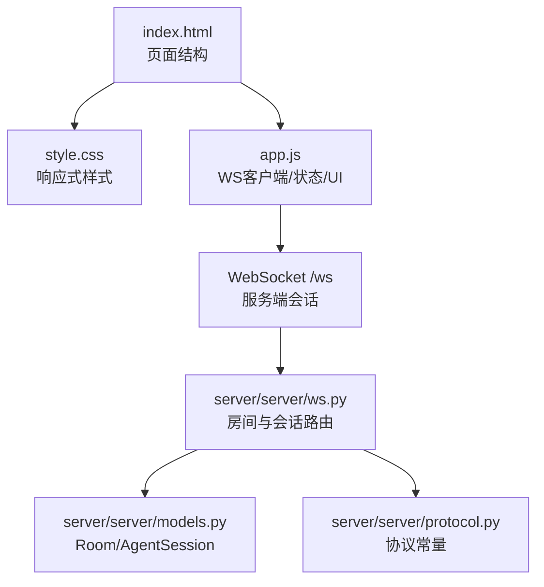
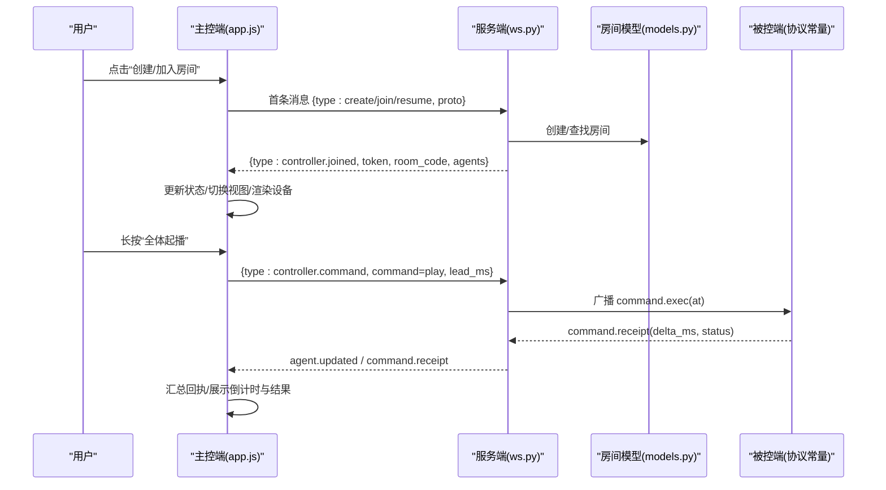
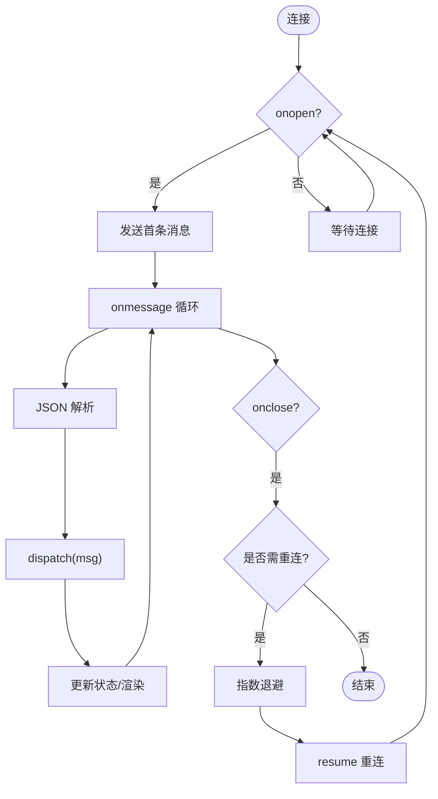
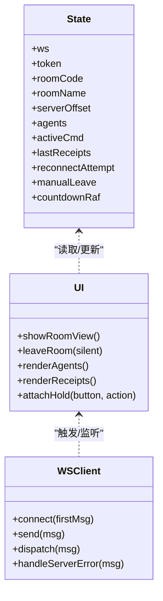
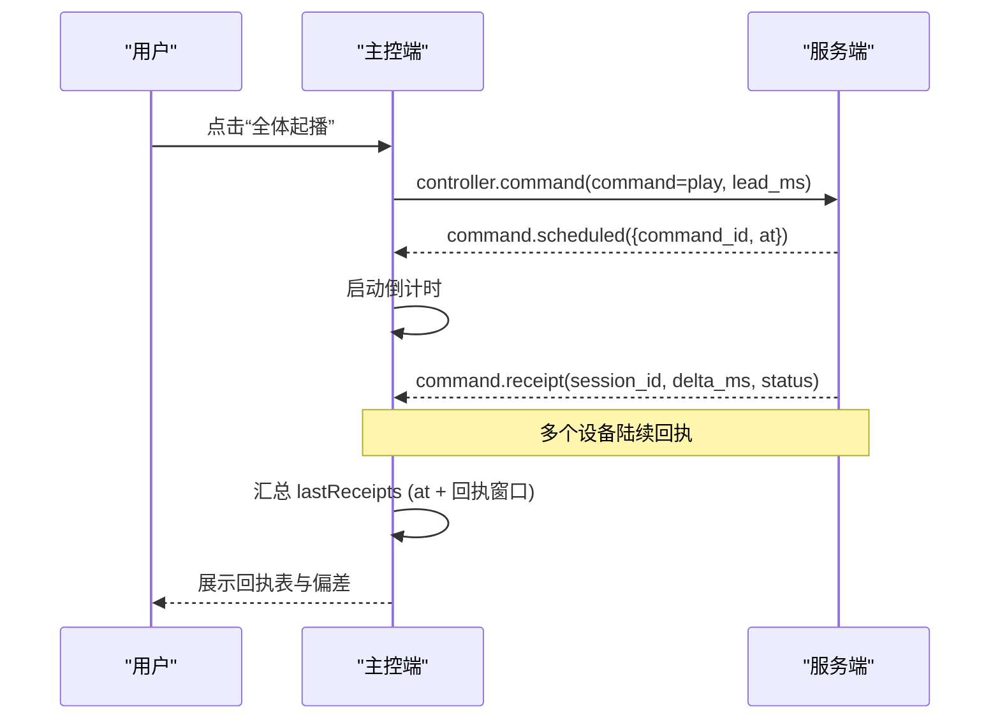
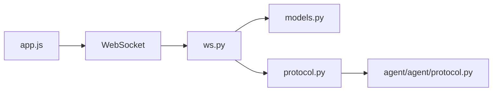

# 主控端架构设计

<cite>
**本文引用的文件**
- [controller/app.js](file://controller/app.js)
- [controller/index.html](file://controller/index.html)
- [controller/style.css](file://controller/style.css)
- [server/server/ws.py](file://server/server/ws.py)
- [server/server/protocol.py](file://server/server/protocol.py)
- [server/server/models.py](file://server/server/models.py)
- [agent/agent/protocol.py](file://agent/agent/protocol.py)
- [README.md](file://README.md)
</cite>

## 目录
1. [简介](#简介)
2. [项目结构](#项目结构)
3. [核心组件](#核心组件)
4. [架构总览](#架构总览)
5. [详细组件分析](#详细组件分析)
6. [依赖关系分析](#依赖关系分析)
7. [性能与可靠性](#性能与可靠性)
8. [故障排查指南](#故障排查指南)
9. [结论](#结论)
10. [附录：协议与交互要点](#附录协议与交互要点)

## 简介
本文件面向 ScriptCue 主控端（浏览器原生 JavaScript，无框架、无构建步骤），系统性阐述其前端架构设计与实现细节，包括 WebSocket 客户端、状态管理、用户界面逻辑、响应式与移动端适配、房间操作、设备管理与指令下发流程，以及与后端的通信协议和错误处理机制。文档同时提供组件关系图与关键交互流程图，帮助读者快速理解并维护该主控端。

## 项目结构
主控端由三个文件组成：
- index.html：页面结构与元素容器（首页创建/加入房间、房间控制台、回执区等）
- style.css：响应式样式，手机竖屏优先，桌面自适应
- app.js：WebSocket 客户端、状态机、UI 渲染与事件绑定

图表来源
- [controller/index.html:1-98](file://controller/index.html#L1-L98)
- [controller/style.css:1-216](file://controller/style.css#L1-L216)
- [controller/app.js:1-522](file://controller/app.js#L1-L522)
- [server/server/ws.py:1-360](file://server/server/ws.py#L1-L360)
- [server/server/models.py:1-157](file://server/server/models.py#L1-L157)
- [server/server/protocol.py:1-80](file://server/server/protocol.py#L1-L80)

章节来源
- [controller/index.html:1-98](file://controller/index.html#L1-L98)
- [controller/style.css:1-216](file://controller/style.css#L1-L216)
- [controller/app.js:1-522](file://controller/app.js#L1-L522)
- [README.md:1-86](file://README.md#L1-L86)

## 核心组件
- WebSocket 客户端与连接管理
  - 自动选择 ws/wss，构造 URL；首次消息携带 proto 与角色信息；断线指数退避重连；支持手动离开与静默重连保护。
- 全局状态管理
  - 集中保存 token、roomCode、roomName、serverOffset、agents Map、activeCmd、lastReceipts、重连计数等；所有 UI 渲染基于该状态。
- 视图与交互
  - 首页（创建/加入房间）、房间控制台（设备列表、控制按钮、倒计时横幅、回执表）；长按确认防误触；复制房间码。
- 指令下发与回执闭环
  - 发送 controller.command → 收到 command.scheduled → 倒计时 → 收集 command.receipt → 超时汇总 lastReceipts → 展示结果。
- 设备管理与补偿设置
  - 实时显示设备在线/就绪/时钟质量；单设备测试触发；按设备设置补偿值（毫秒）。

章节来源
- [controller/app.js:15-27](file://controller/app.js#L15-L27)
- [controller/app.js:50-81](file://controller/app.js#L50-L81)
- [controller/app.js:83-134](file://controller/app.js#L83-L134)
- [controller/app.js:198-298](file://controller/app.js#L198-L298)
- [controller/app.js:316-439](file://controller/app.js#L316-L439)
- [controller/app.js:445-519](file://controller/app.js#L445-L519)

## 架构总览
主控端通过 WebSocket 与服务端建立长连接，首条消息声明角色为“主控端”，随后进入房间生命周期：创建/加入/恢复。服务器负责房间与会话管理、指令调度、状态汇聚与审计。主控端仅做轻量 UI 与状态同步，不持有持久化数据。

图表来源
- [controller/app.js:50-81](file://controller/app.js#L50-L81)
- [controller/app.js:83-134](file://controller/app.js#L83-L134)
- [controller/app.js:316-439](file://controller/app.js#L316-L439)
- [server/server/ws.py:154-207](file://server/server/ws.py#L154-L207)
- [server/server/ws.py:228-243](file://server/server/ws.py#L228-L243)
- [server/server/models.py:64-117](file://server/server/models.py#L64-L117)
- [server/server/protocol.py:1-80](file://server/server/protocol.py#L1-L80)

## 详细组件分析

### WebSocket 客户端与连接管理
- 连接建立
  - 根据当前协议自动选择 ws/wss，拼接 /ws；onopen 发送首条消息；onmessage 解析 JSON 并分发到 dispatch。
- 断线重连
  - onclose 中若已加入房间且非手动离开，则指数退避（上限 10 秒）后以 resume 方式重连；重连前清空回调避免重复。
- 消息分发
  - 统一处理 controller.joined、agent.updated、command.scheduled/cancelled/receipt、error 等类型，更新状态并触发 UI 刷新。

图表来源
- [controller/app.js:50-81](file://controller/app.js#L50-L81)
- [controller/app.js:83-134](file://controller/app.js#L83-L134)

章节来源
- [controller/app.js:50-81](file://controller/app.js#L50-L81)
- [controller/app.js:83-134](file://controller/app.js#L83-L134)

### 状态管理
- 状态对象 state 集中管理连接、房间、时间偏移、设备集合、活跃指令与回执、重连计数等。
- serverNow() 基于本地时间与 serverOffset 估算服务器时间，用于倒计时与回执超时计算。
- 所有渲染函数均从 state 派生 UI，保证单一事实源。

章节来源
- [controller/app.js:15-31](file://controller/app.js#L15-L31)
- [controller/app.js:198-298](file://controller/app.js#L198-L298)
- [controller/app.js:316-439](file://controller/app.js#L316-L439)

### 用户界面与交互逻辑
- 视图切换
  - showRoomView/leaveRoom 控制首页与房间视图的显隐；连接状态胶囊 pill 实时更新。
- 设备列表
  - renderAgents 动态生成设备卡片，显示昵称、在线/就绪/时钟质量、偏移/RTT、最近偏差；支持单设备测试与补偿设置。
- 控制区
  - 全体起播/暂停/恢复/测试；提前量输入；取消指令；长按 1 秒防误触（hold-btn + attachHold）。
- 回执面板
  - 实时展示每条指令的执行偏差与状态；到期后汇总 lastReceipts 并持久化展示。

图表来源
- [controller/app.js:15-27](file://controller/app.js#L15-L27)
- [controller/app.js:150-189](file://controller/app.js#L150-L189)
- [controller/app.js:198-298](file://controller/app.js#L198-L298)
- [controller/app.js:316-439](file://controller/app.js#L316-L439)
- [controller/app.js:445-519](file://controller/app.js#L445-L519)

章节来源
- [controller/index.html:22-92](file://controller/index.html#L22-L92)
- [controller/style.css:1-216](file://controller/style.css#L1-L216)
- [controller/app.js:150-189](file://controller/app.js#L150-L189)
- [controller/app.js:198-298](file://controller/app.js#L198-L298)
- [controller/app.js:316-439](file://controller/app.js#L316-L439)
- [controller/app.js:445-519](file://controller/app.js#L445-L519)

### 指令下发与回执流程
- 下发指令
  - sendCommand 校验上一条指令是否仍在倒计时；生成 command_id；携带 command、lead_ms；可选 target 指定设备。
- 倒计时与回执
  - 收到 command.scheduled 后启动 requestAnimationFrame 倒计时；到达 at 后等待回执；scheduleReceiptTimeout 在 at + 回执窗口后汇总未回执设备。
- 回执展示
  - 对每个设备显示 delta_ms 与状态（正常/异常/跳过/等待/未回执/离线）；颜色区分偏差是否在阈值内。

图表来源
- [controller/app.js:316-439](file://controller/app.js#L316-L439)
- [server/server/ws.py:67-104](file://server/server/ws.py#L67-L104)
- [server/server/ws.py:228-243](file://server/server/ws.py#L228-L243)

章节来源
- [controller/app.js:316-439](file://controller/app.js#L316-L439)
- [server/server/ws.py:67-104](file://server/server/ws.py#L67-L104)
- [server/server/ws.py:228-243](file://server/server/ws.py#L228-L243)

### 房间操作与设备管理
- 房间操作
  - 创建房间：controller.create，返回 token、room_code、room_name、agents；失败时提示错误。
  - 加入房间：controller.join，校验房间码与口令；失败时提示。
  - 恢复连接：controller.resume，使用 token 恢复会话；失效时回到首页。
- 设备管理
  - 设备上线/心跳/下线通过 agent.updated 推送；主控端渲染设备卡片并统计就绪数量。
  - 单设备测试：target=session_id 的 test 指令；补偿设置：controller.set_comp 更新 compensation_ms。

章节来源
- [controller/app.js:83-134](file://controller/app.js#L83-L134)
- [controller/app.js:198-298](file://controller/app.js#L198-L298)
- [controller/app.js:479-519](file://controller/app.js#L479-L519)
- [server/server/ws.py:154-207](file://server/server/ws.py#L154-L207)
- [server/server/ws.py:214-226](file://server/server/ws.py#L214-L226)

### 响应式设计与移动端适配
- 布局与主题
  - 手机竖屏优先，最大宽度限制；深色头部；卡片阴影与圆角；安全区域适配（safe-area-inset-bottom）。
- 交互优化
  - 大按钮与触控友好尺寸；禁用双击缩放与长按菜单；focus 高亮；数字输入防止 iOS 放大。
- 桌面适配
  - 媒体查询增大主内容间距与房间码字号；整体保持简洁一致。

章节来源
- [controller/style.css:1-216](file://controller/style.css#L1-L216)
- [controller/index.html:1-98](file://controller/index.html#L1-L98)

## 依赖关系分析
- 前端依赖
  - DOM API、WebSocket、requestAnimationFrame、navigator.clipboard（可选）
- 后端依赖
  - FastAPI/Starlette WebSocket、异步 I/O、内存房间模型、审计日志
- 协议常量
  - 前后端共享的消息类型、错误码、指令类型、时间参数范围等

图表来源
- [controller/app.js:1-522](file://controller/app.js#L1-L522)
- [server/server/ws.py:1-360](file://server/server/ws.py#L1-L360)
- [server/server/models.py:1-157](file://server/server/models.py#L1-L157)
- [server/server/protocol.py:1-80](file://server/server/protocol.py#L1-L80)
- [agent/agent/protocol.py:1-80](file://agent/agent/protocol.py#L1-L80)

章节来源
- [server/server/protocol.py:1-80](file://server/server/protocol.py#L1-L80)
- [agent/agent/protocol.py:1-80](file://agent/agent/protocol.py#L1-L80)

## 性能与可靠性
- 连接与重连
  - 指数退避重连（上限 10 秒），减少瞬时拥塞；手动离开时停止重连。
- 渲染与计时
  - 使用 requestAnimationFrame 平滑倒计时；仅在状态变化时重建设备列表与回执表。
- 指令时效
  - 回执超时窗口固定（8 秒），到期后汇总缺失回执，避免无限等待。
- 资源占用
  - 纯内存房间模型，无数据库 IO；状态推送节流由服务端控制（协议常量定义）。

章节来源
- [controller/app.js:340-367](file://controller/app.js#L340-L367)
- [server/server/ws.py:107-115](file://server/server/ws.py#L107-L115)
- [server/server/protocol.py:75-80](file://server/server/protocol.py#L75-L80)

## 故障排查指南
- 常见错误
  - 房间不存在：检查房间码与口令；服务端返回 error 并提示重新创建或加入。
  - 会话失效：服务端重启导致控制器 token 失效，回到首页重新加入。
  - 未知指令/消息：检查 command 类型与消息结构是否符合协议。
  - 设备不存在：target session_id 无效，检查设备列表。
- 定位方法
  - 查看连接状态胶囊与 Toast 提示；检查回执表中各设备的状态与偏差；核对提前量与补偿值。
- 恢复策略
  - 断线自动重连；手动离开后重新创建/加入；必要时清除浏览器缓存并重试。

章节来源
- [controller/app.js:136-144](file://controller/app.js#L136-L144)
- [controller/app.js:157-180](file://controller/app.js#L157-L180)
- [server/server/ws.py:154-207](file://server/server/ws.py#L154-L207)
- [server/server/ws.py:228-243](file://server/server/ws.py#L228-L243)

## 结论
ScriptCue 主控端采用极简原生前端架构，聚焦于 WebSocket 通信、状态驱动 UI 与用户体验优化。通过统一的协议常量与清晰的消息流，实现了房间管理、设备监控、指令下发与回执闭环。响应式设计与移动端适配确保导控人员可在手机竖屏高效操作。结合服务端的房间与会话管理，系统具备高可用性与可维护性。

## 附录：协议与交互要点
- 首条消息
  - 主控端：controller.create / controller.join / controller.resume，携带 proto 版本
- 指令与回执
  - 下发：controller.command（command_id、command、lead_ms、可选 target）
  - 计划：command.scheduled（command_id、command、at）
  - 回执：command.receipt（session_id、delta_ms、status）
  - 取消：controller.cancel → command.cancelled
- 设备状态
  - agent.updated（session_id、nickname、online、ready、clock_quality、offset、rtt、compensation）
- 错误处理
  - error（code、message）；常见 code：room_not_found、bad_password、no_such_agent、bad_command、bad_message

章节来源
- [server/server/protocol.py:1-80](file://server/server/protocol.py#L1-L80)
- [controller/app.js:83-134](file://controller/app.js#L83-L134)
- [controller/app.js:316-439](file://controller/app.js#L316-L439)
- [server/server/ws.py:67-104](file://server/server/ws.py#L67-L104)
- [server/server/ws.py:228-243](file://server/server/ws.py#L228-L243)