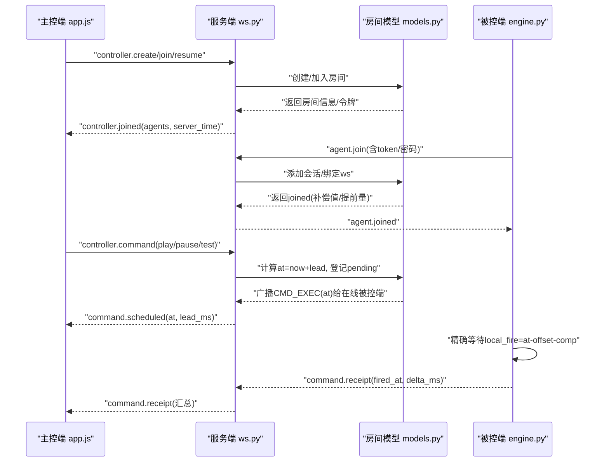
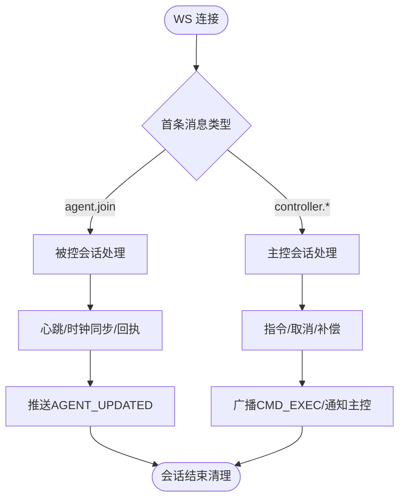
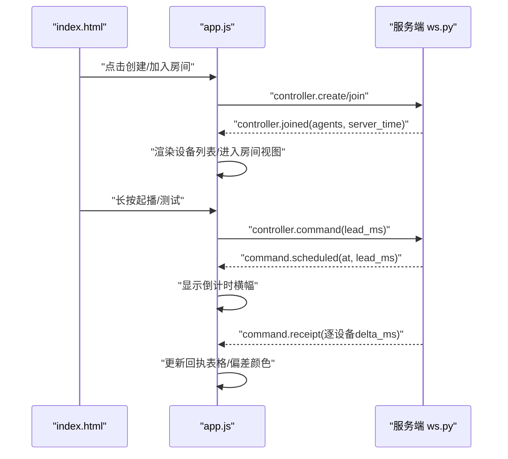
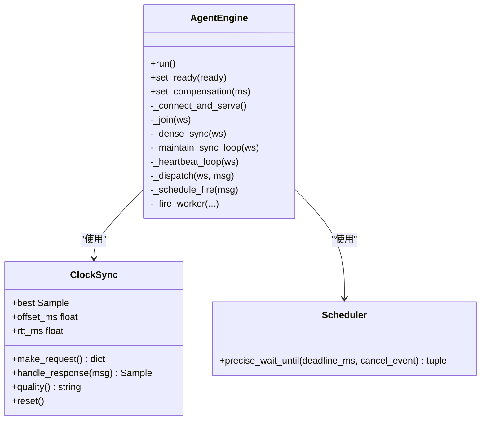
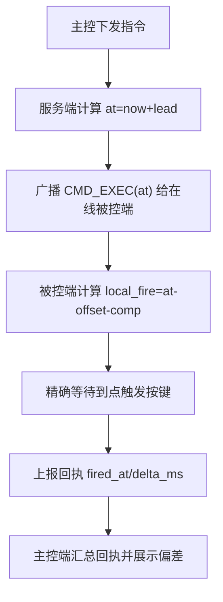
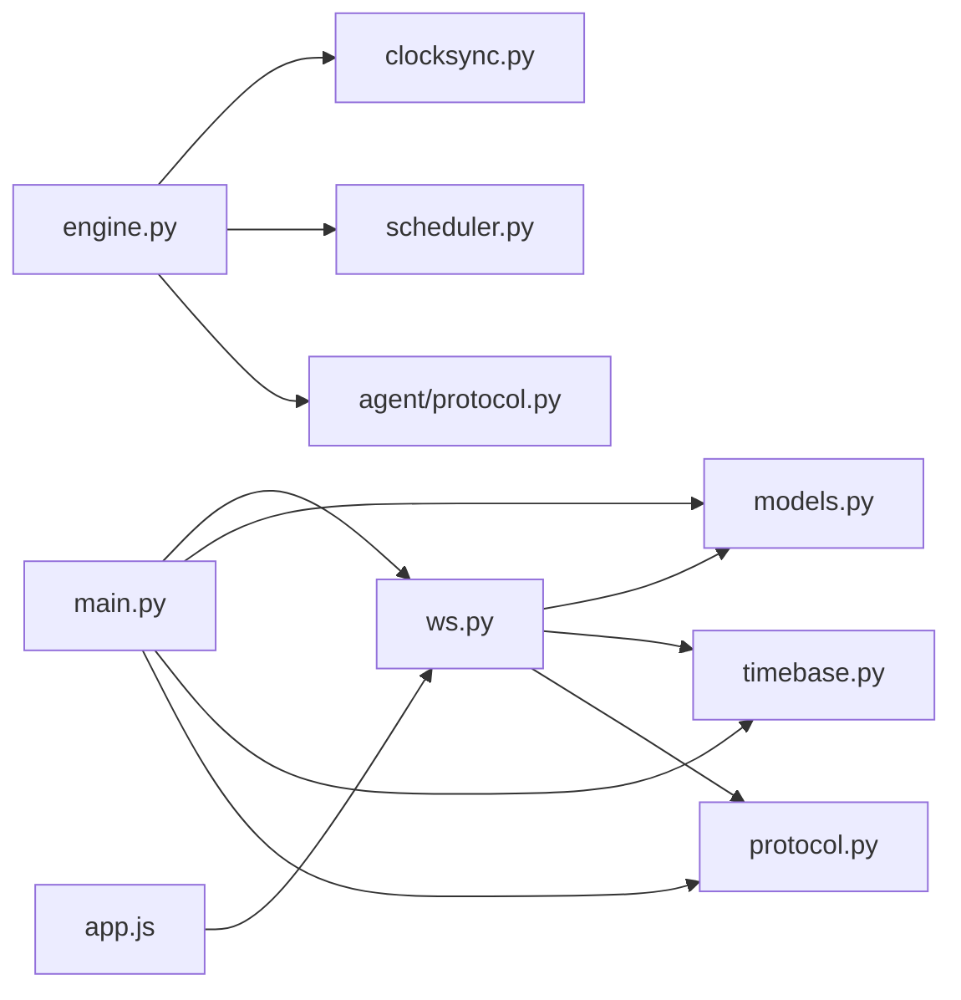

# 整体架构概览

<cite>
**本文引用的文件**
- [README.md](file://README.md)
- [server/main.py](file://server/server/main.py)
- [server/ws.py](file://server/server/ws.py)
- [server/models.py](file://server/server/models.py)
- [server/timebase.py](file://server/server/timebase.py)
- [server/protocol.py](file://server/server/protocol.py)
- [controller/index.html](file://controller/index.html)
- [controller/app.js](file://controller/app.js)
- [agent/engine.py](file://agent/agent/engine.py)
- [agent/clocksync.py](file://agent/agent/clocksync.py)
- [agent/scheduler.py](file://agent/agent/scheduler.py)
- [agent/protocol.py](file://agent/agent/protocol.py)
- [docker-compose.yml](file://docker-compose.yml)
</cite>

## 目录
1. [简介](#简介)
2. [项目结构](#项目结构)
3. [核心组件](#核心组件)
4. [架构总览](#架构总览)
5. [详细组件分析](#详细组件分析)
6. [依赖关系分析](#依赖关系分析)
7. [性能与精度考量](#性能与精度考量)
8. [故障排查指南](#故障排查指南)
9. [结论](#结论)

## 简介
ScriptCue 是一个多设备口述影像同步起播系统，通过“时钟对齐 + 绝对时刻调度”在公网环境下实现大屏电脑与多台口述员电脑的毫秒级同步。系统采用三层架构：服务端（FastAPI + WebSocket）、主控端（原生 HTML/JS 网页）、被控端（Python 桌面应用）。服务端负责房间管理、WebSocket 长连接、授时基准、指令广播、状态汇聚与审计日志；主控端提供导控人员操作界面；被控端加入房间后持续进行类 NTP 时钟同步，收到带绝对执行时刻的指令后，本地高精度定时到点触发前台窗口按键动作并上报回执。

## 项目结构
仓库按职责划分为 server、controller、agent 三个子系统，辅以文档与容器编排配置：
- server：服务端进程，暴露 HTTP 健康检查、静态页面托管与 WebSocket 服务，维护房间与会话内存模型，提供时间基准与审计日志。
- controller：浏览器端主控页，由服务端静态托管，负责创建/加入房间、下发指令、展示设备状态与回执。
- agent：被控端应用，封装连接生命周期、时钟同步、绝对时刻调度与按键注入，支持 GUI 与 CLI 两种形态。
- docker-compose：一键启动服务端容器，持久化审计数据卷。

```mermaid
graph TB
subgraph "服务端"
SMain["FastAPI 入口<br/>/healthz, /ws"]
SWs["WebSocket 会话处理"]
SModels["房间与会话模型"]
STime["时间基准 now_ms()"]
SProto["协议常量"]
SAudit["审计日志"]
end
subgraph "主控端"
CHTML["index.html"]
CJS["app.js"]
end
subgraph "被控端"
AEngine["AgentEngine"]
AClock["ClockSync"]
ASched["precise_wait_until"]
AProto["协议常量副本"]
end
CHTML --> CJS
CJS < --> |WebSocket| SWs
AEngine < --> |WebSocket| SWs
SWs --> SModels
SWs --> STime
SWs --> SProto
SWs --> SAudit
AEngine --> AClock
AEngine --> ASched
AEngine --> AProto
```

图表来源
- [server/main.py:12-98](file://server/server/main.py#L12-L98)
- [server/ws.py:1-360](file://server/server/ws.py#L1-L360)
- [server/models.py:1-157](file://server/server/models.py#L1-L157)
- [server/timebase.py:1-13](file://server/server/timebase.py#L1-L13)
- [server/protocol.py:1-80](file://server/server/protocol.py#L1-L80)
- [controller/index.html:1-98](file://controller/index.html#L1-L98)
- [controller/app.js:1-522](file://controller/app.js#L1-L522)
- [agent/engine.py:1-388](file://agent/agent/engine.py#L1-L388)
- [agent/clocksync.py:1-106](file://agent/agent/clocksync.py#L1-L106)
- [agent/scheduler.py:1-59](file://agent/agent/scheduler.py#L1-L59)
- [agent/protocol.py:1-80](file://agent/agent/protocol.py#L1-L80)

章节来源
- [README.md:1-86](file://README.md#L1-L86)
- [docker-compose.yml:1-15](file://docker-compose.yml#L1-L15)

## 核心组件
- 服务端
  - FastAPI 应用与生命周期：挂载静态页面、注册 WebSocket 路由、启动后台任务（离线扫描、空闲房间销毁）。
  - WebSocket 会话：统一 /ws 端点，首条消息声明角色（主控或被控），分发至对应处理流程。
  - 房间模型：内存存储房间与会话，支持密码、令牌、在线状态、待执行指令队列、广播与通知。
  - 时间基准：统一的 now_ms() 作为服务器时间源。
  - 协议常量：集中定义消息类型、错误码、限制参数。
  - 审计日志：记录关键事件（命令、回执、设备上下线等）。
- 主控端
  - 页面与交互：创建/加入房间、设备列表、指令按钮、倒计时横幅、回执表格。
  - 连接与消息：自动重连、指数退避、状态渲染、防误触长按确认。
- 被控端
  - AgentEngine：连接生命周期、时钟同步、心跳、消息分发、绝对时刻调度与触发回执。
  - ClockSync：类 NTP 采样、RTT 最小样本选择、质量分级。
  - Scheduler：粗睡眠 + 末段自旋的高精度等待。
  - 协议副本：与服务端一致的常量集合。

章节来源
- [server/main.py:12-98](file://server/server/main.py#L12-L98)
- [server/ws.py:1-360](file://server/server/ws.py#L1-L360)
- [server/models.py:1-157](file://server/server/models.py#L1-L157)
- [server/timebase.py:1-13](file://server/server/timebase.py#L1-L13)
- [server/protocol.py:1-80](file://server/server/protocol.py#L1-L80)
- [controller/index.html:1-98](file://controller/index.html#L1-L98)
- [controller/app.js:1-522](file://controller/app.js#L1-L522)
- [agent/engine.py:1-388](file://agent/agent/engine.py#L1-L388)
- [agent/clocksync.py:1-106](file://agent/agent/clocksync.py#L1-L106)
- [agent/scheduler.py:1-59](file://agent/agent/scheduler.py#L1-L59)
- [agent/protocol.py:1-80](file://agent/agent/protocol.py#L1-L80)

## 架构总览
系统上下文图展示了三层之间的通信与职责边界：主控端通过浏览器建立 WebSocket 连接到服务端；被控端以 Python 进程连接同一 WebSocket 端点；服务端维护房间与会话，将指令以绝对时刻下发给被控端，并将回执与状态回推给主控端。



图表来源
- [server/ws.py:67-207](file://server/server/ws.py#L67-L207)
- [server/models.py:64-117](file://server/server/models.py#L64-L117)
- [controller/app.js:50-134](file://controller/app.js#L50-L134)
- [agent/engine.py:159-193](file://agent/agent/engine.py#L159-L193)
- [agent/engine.py:297-379](file://agent/agent/engine.py#L297-L379)

## 详细组件分析

### 服务端：FastAPI 与 WebSocket 会话
- 入口与生命周期：初始化 RoomManager 与 AuditLog，启动离线扫描与空闲房间销毁任务，挂载静态页面与 /healthz。
- WebSocket 路由：统一 /ws 端点，解析首条消息确定角色，分派至主控或会话处理。
- 主控会话：校验指令类型与提前量范围，计算 at=now+lead，登记 pending 并广播 CMD_EXEC；支持取消与补偿设置。
- 被控会话：处理心跳、时钟同步请求、补偿设置与回执；维护在线状态与最后可见时间。
- 房间模型：内存存储房间与会话，支持密码保护、令牌恢复、最大设备数限制、空闲销毁策略。
- 时间基准：now_ms() 提供单调可靠的时间源。
- 协议常量：集中管理消息类型、错误码、限制参数。



图表来源
- [server/main.py:63-98](file://server/server/main.py#L63-L98)
- [server/ws.py:334-360](file://server/server/ws.py#L334-L360)
- [server/ws.py:67-207](file://server/server/ws.py#L67-L207)
- [server/ws.py:214-327](file://server/server/ws.py#L214-L327)
- [server/models.py:64-157](file://server/server/models.py#L64-L157)
- [server/timebase.py:10-12](file://server/server/timebase.py#L10-L12)
- [server/protocol.py:1-80](file://server/server/protocol.py#L1-L80)

章节来源
- [server/main.py:12-98](file://server/server/main.py#L12-L98)
- [server/ws.py:1-360](file://server/server/ws.py#L1-L360)
- [server/models.py:1-157](file://server/server/models.py#L1-L157)
- [server/timebase.py:1-13](file://server/server/timebase.py#L1-L13)
- [server/protocol.py:1-80](file://server/server/protocol.py#L1-L80)

### 主控端：原生 HTML/JS 控制台
- 页面结构：首页用于创建/加入房间；房间视图显示设备列表、控制按钮、倒计时横幅与回执表格。
- 连接管理：自动重连与指数退避，维护 token 与房间信息，断线后尝试 resume。
- 指令下发：长按防误触，计算提前量，发送 command；收到 scheduled 后进入倒计时与回执收集。
- 状态渲染：根据设备在线/就绪/时钟质量展示卡片；偏差阈值高亮提示。
- 回执汇总：到期后统计各设备回执状态，标记缺失或离线。



图表来源
- [controller/index.html:22-92](file://controller/index.html#L22-L92)
- [controller/app.js:50-134](file://controller/app.js#L50-L134)
- [controller/app.js:316-389](file://controller/app.js#L316-L389)
- [controller/app.js:479-522](file://controller/app.js#L479-L522)
- [server/ws.py:67-207](file://server/server/ws.py#L67-L207)

章节来源
- [controller/index.html:1-98](file://controller/index.html#L1-L98)
- [controller/app.js:1-522](file://controller/app.js#L1-L522)

### 被控端：AgentEngine、时钟同步与高精度调度
- 连接与加入：标准化 URL，连接 WebSocket，发送 join 消息，接收 joined 响应并重置时钟同步。
- 时钟同步：密集采样与维持性采样，基于 RTT 最小样本估算偏移，质量分级随心跳上报。
- 心跳与状态：周期性上报 ready、clock_quality、offset、rtt、compensation 与 pending_command。
- 绝对时刻调度：收到 CMD_EXEC 后计算 local_fire = at - offset - compensation，使用线程等待并在到点触发按键，上报回执。
- 撤销与补偿：支持 CMD_CANCEL 取消待触发；可动态设置补偿值并立即生效。



图表来源
- [agent/engine.py:31-388](file://agent/agent/engine.py#L31-L388)
- [agent/clocksync.py:29-106](file://agent/agent/clocksync.py#L29-L106)
- [agent/scheduler.py:33-59](file://agent/agent/scheduler.py#L33-L59)

章节来源
- [agent/engine.py:1-388](file://agent/agent/engine.py#L1-L388)
- [agent/clocksync.py:1-106](file://agent/agent/clocksync.py#L1-L106)
- [agent/scheduler.py:1-59](file://agent/agent/scheduler.py#L1-L59)
- [agent/protocol.py:1-80](file://agent/agent/protocol.py#L1-L80)

### 多设备同步播放的核心设计理念
- 时钟对齐：被控端通过类 NTP 多次 ping 采样，取 RTT 最小的样本作为可信偏移，抑制网络抖动与路由变化影响。
- 绝对时刻调度：服务端指令附加 at=服务器当前时间+提前量；被控端换算为本地时刻 local_fire=at-偏移-补偿，使用粗睡眠+末段自旋等待到点触发。
- 房间管理：内存存储房间与会话，支持口令、令牌恢复、设备上限、空闲销毁；重启后客户端凭 auto_create 重建房间。
- 回执与可视：被控端触发后上报 fired_at，服务端计算 delta_ms 并推送主控端，便于监控与诊断。



图表来源
- [server/ws.py:67-115](file://server/server/ws.py#L67-L115)
- [agent/engine.py:297-379](file://agent/agent/engine.py#L297-L379)
- [agent/clocksync.py:44-87](file://agent/agent/clocksync.py#L44-L87)
- [controller/app.js:102-134](file://controller/app.js#L102-L134)

章节来源
- [README.md:22-28](file://README.md#L22-L28)
- [server/ws.py:67-115](file://server/server/ws.py#L67-L115)
- [agent/engine.py:297-379](file://agent/agent/engine.py#L297-L379)
- [agent/clocksync.py:44-87](file://agent/agent/clocksync.py#L44-L87)

## 依赖关系分析
- 模块耦合
  - 服务端 main 依赖 ws、models、timebase、protocol、audit。
  - ws 依赖 protocol、models、timebase、audit。
  - 被控端 engine 依赖 clocksync、scheduler、protocol、timeutil。
  - 主控端 app.js 仅依赖浏览器 WebSocket API 与服务端 /ws。
- 外部依赖
  - 服务端：FastAPI、uvicorn、websockets（被控端使用 websockets 库）。
  - 被控端：websockets、可选 KeySender（GUI 注入按键）。
  - 容器：Docker 与 docker-compose 编排服务端。



图表来源
- [server/main.py:12-98](file://server/server/main.py#L12-L98)
- [server/ws.py:1-360](file://server/server/ws.py#L1-L360)
- [server/models.py:1-157](file://server/server/models.py#L1-L157)
- [server/timebase.py:1-13](file://server/server/timebase.py#L1-L13)
- [server/protocol.py:1-80](file://server/server/protocol.py#L1-L80)
- [agent/engine.py:1-388](file://agent/agent/engine.py#L1-L388)
- [agent/clocksync.py:1-106](file://agent/agent/clocksync.py#L1-L106)
- [agent/scheduler.py:1-59](file://agent/agent/scheduler.py#L1-L59)
- [agent/protocol.py:1-80](file://agent/agent/protocol.py#L1-L80)
- [controller/app.js:1-522](file://controller/app.js#L1-L522)

章节来源
- [server/main.py:12-98](file://server/server/main.py#L12-L98)
- [server/ws.py:1-360](file://server/server/ws.py#L1-L360)
- [agent/engine.py:1-388](file://agent/agent/engine.py#L1-L388)
- [controller/app.js:1-522](file://controller/app.js#L1-L522)

## 性能与精度考量
- 时钟同步精度
  - 密集采样与维持性采样结合，取 RTT 最小样本，降低网络抖动影响。
  - 质量分级依据样本数量与 RTT 阈值，辅助主控端判断同步可靠性。
- 调度精度
  - 粗睡眠 + 末段自旋策略，避免 OS 调度误差导致的大延迟；Windows 下提升系统定时器分辨率。
  - 提前量默认 3s，允许网络延迟与抖动在不超出提前量的情况下不影响同步精度。
- 资源占用
  - 房间与会话纯内存存储，重启后由客户端自动恢复；空闲房间 24h 销毁。
  - 心跳间隔 5s，离线判定 15s（3 次无响应），减少无效连接占用。
- 部署与扩展
  - Docker 化部署，数据卷持久化审计日志；可通过环境变量调整默认提前量与日志级别。

章节来源
- [agent/clocksync.py:1-106](file://agent/agent/clocksync.py#L1-L106)
- [agent/scheduler.py:1-59](file://agent/agent/scheduler.py#L1-L59)
- [server/protocol.py:67-80](file://server/server/protocol.py#L67-L80)
- [server/main.py:40-61](file://server/server/main.py#L40-L61)
- [README.md:22-28](file://README.md#L22-L28)

## 故障排查指南
- 连接问题
  - 主控端断线：app.js 自动重连并指数退避；若会话失效（room_not_found）则回到首页重新创建/加入。
  - 被控端断线：engine.py 指数退避重连；重连后自动重建房间（auto_create）。
- 指令未执行
  - 检查时钟同步质量（excellent/good/poor/none），未同步时会被控端直接回报错误。
  - 查看回执表格中 delta_ms 与状态（ok/error/skipped/waiting/missing/offline）。
- 补偿值设置
  - 主控端可为单设备设置补偿值；被控端也可主动上报补偿值，服务端校验范围并推送更新。
- 房间状态
  - 心跳超时离线：服务端每秒扫描，超过 15s 无心跳标记离线并通知主控。
  - 空闲销毁：24h 无活跃成员的房间自动销毁。

章节来源
- [controller/app.js:66-81](file://controller/app.js#L66-L81)
- [controller/app.js:136-144](file://controller/app.js#L136-L144)
- [controller/app.js:364-389](file://controller/app.js#L364-L389)
- [agent/engine.py:106-128](file://agent/agent/engine.py#L106-L128)
- [agent/engine.py:297-311](file://agent/agent/engine.py#L297-L311)
- [server/ws.py:40-61](file://server/server/ws.py#L40-L61)
- [server/ws.py:117-152](file://server/server/ws.py#L117-L152)
- [server/models.py:80-88](file://server/models.py#L80-L88)

## 结论
ScriptCue 通过清晰的三层架构与严格的协议约束，实现了多设备在高延迟公网环境下的毫秒级同步起播。服务端提供稳定的房间管理与授时基准，主控端提供直观的操作界面与可视化反馈，被控端通过高精度时钟同步与调度确保触发一致性。该设计在保证精度的同时兼顾了可扩展性与可运维性，适合大规模口述影像同步场景。