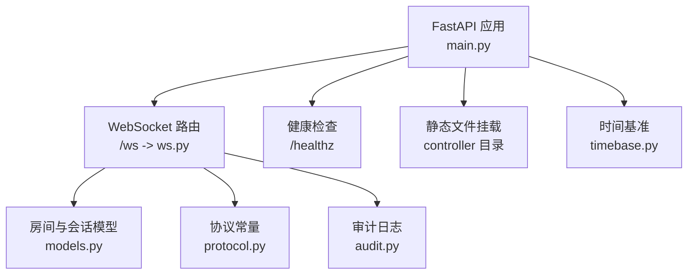
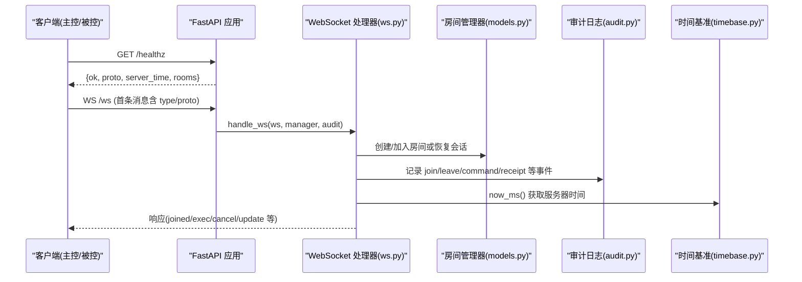
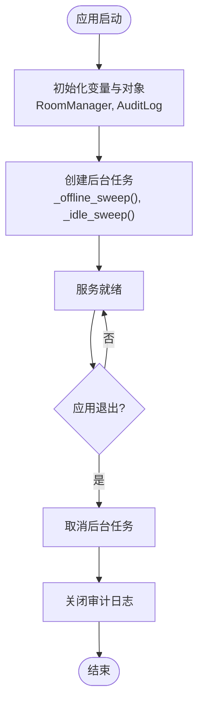
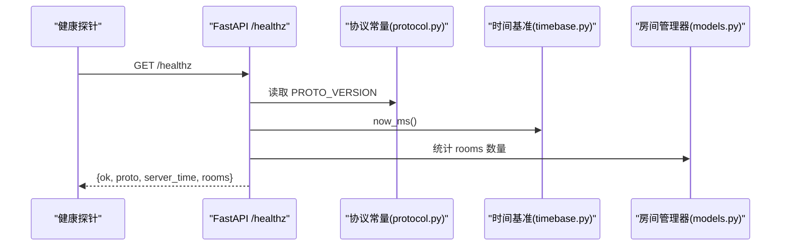
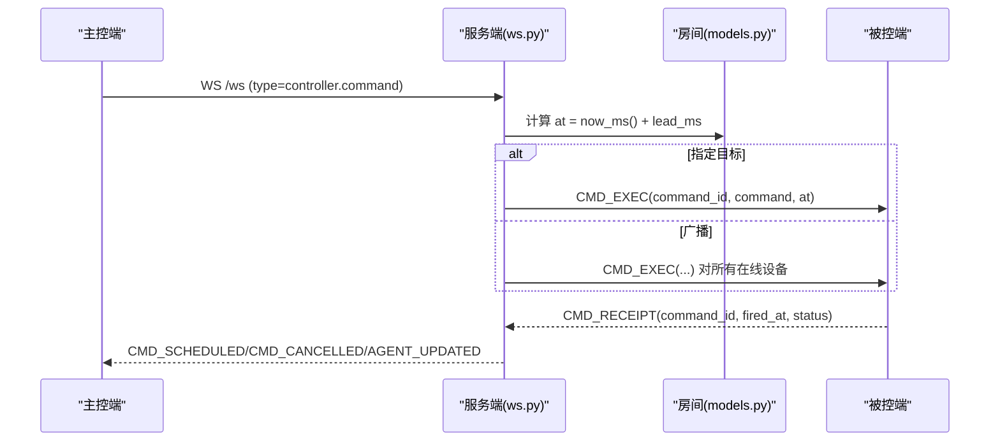
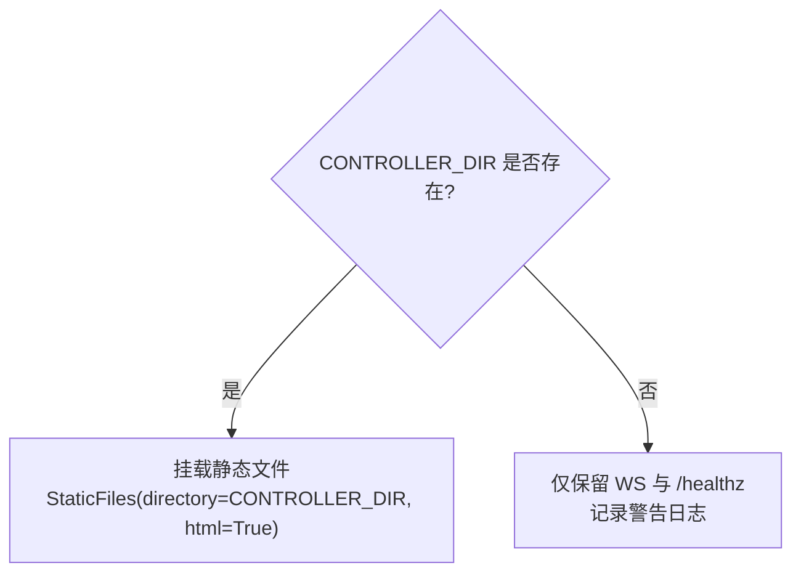
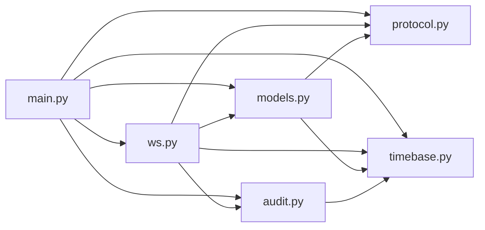

# FastAPI 应用架构

<cite>
**本文引用的文件**
- [server/server/main.py](file://server/server/main.py)
- [server/server/ws.py](file://server/server/ws.py)
- [server/server/models.py](file://server/server/models.py)
- [server/server/protocol.py](file://server/server/protocol.py)
- [server/server/timebase.py](file://server/server/timebase.py)
- [server/server/audit.py](file://server/server/audit.py)
- [README.md](file://README.md)
- [server/Dockerfile](file://server/Dockerfile)
- [docker-compose.yml](file://docker-compose.yml)
</cite>

## 目录
1. [简介](#简介)
2. [项目结构](#项目结构)
3. [核心组件](#核心组件)
4. [架构总览](#架构总览)
5. [详细组件分析](#详细组件分析)
6. [依赖关系分析](#依赖关系分析)
7. [性能考量](#性能考量)
8. [故障排查指南](#故障排查指南)
9. [结论](#结论)
10. [附录](#附录)

## 简介
本技术文档面向 ScriptCue 的 FastAPI 服务端，聚焦以下目标：
- 应用启动流程与生命周期管理（lifespan）
- 后台任务调度机制（心跳离线检测、空闲房间销毁）
- 环境变量配置系统（SC_DATA_DIR、SC_CONTROLLER_DIR、SC_DEFAULT_LEAD_MS）的作用与默认值
- 健康检查端点 /healthz 的实现原理（协议版本检查、服务器状态监控）
- 静态文件服务挂载策略与主控端界面托管机制
- 应用初始化流程图与错误处理策略

该服务通过 WebSocket 为“主控端”和“被控端”提供房间管理与指令调度能力，并以单调高精度时间作为统一授时基准。

## 项目结构
服务端代码位于 server/server 目录下，采用按职责划分的模块组织方式：
- main.py：FastAPI 应用入口、路由注册、生命周期与后台任务
- ws.py：WebSocket 会话处理（主控端与被控端共用 /ws）
- models.py：房间与会话模型（纯内存存储）
- protocol.py：协议常量与限制（消息类型、错误码、默认提前量等）
- timebase.py：服务器授时基准（毫秒级 Unix 时间）
- audit.py：操作审计日志（JSON Lines 追加写）

图表来源
- [server/server/main.py:63-98](file://server/server/main.py#L63-L98)
- [server/server/ws.py:334-360](file://server/server/ws.py#L334-L360)
- [server/server/models.py:120-157](file://server/server/models.py#L120-L157)
- [server/server/protocol.py:1-80](file://server/server/protocol.py#L1-L80)
- [server/server/timebase.py:1-13](file://server/server/timebase.py#L1-L13)
- [server/server/audit.py:17-37](file://server/server/audit.py#L17-L37)

章节来源
- [server/server/main.py:1-98](file://server/server/main.py#L1-L98)
- [README.md:7-21](file://README.md#L7-L21)

## 核心组件
- 应用入口与生命周期：定义 lifespan，启动两个后台任务（离线检测、空闲销毁），并在退出时取消任务并关闭审计日志。
- WebSocket 会话：/ws 端点根据首条消息类型分发到主控端或被控端会话处理。
- 房间与会话模型：RoomManager 负责房间创建、查找、清理；Room 维护成员与待执行指令；AgentSession 表示设备会话。
- 协议常量：集中定义消息类型、错误码、限制参数（如最大设备数、房间码长度、空闲 TTL、默认提前量）。
- 时间基准：now_ms() 提供毫秒级单调时间，用于调度与超时判断。
- 审计日志：以 JSON Lines 格式记录关键事件，支持并发安全写入。

章节来源
- [server/server/main.py:63-98](file://server/server/main.py#L63-L98)
- [server/server/ws.py:1-360](file://server/server/ws.py#L1-L360)
- [server/server/models.py:1-157](file://server/server/models.py#L1-L157)
- [server/server/protocol.py:1-80](file://server/server/protocol.py#L1-L80)
- [server/server/timebase.py:1-13](file://server/server/timebase.py#L1-L13)
- [server/server/audit.py:1-37](file://server/server/audit.py#L1-L37)

## 架构总览
下图展示了 FastAPI 应用的核心交互：客户端（主控端/被控端）通过 WebSocket 连接 /ws，服务端依据首条消息类型进行路由；同时暴露 /healthz 健康检查；可选地静态托管 controller 目录作为主控端界面。

图表来源
- [server/server/main.py:78-90](file://server/server/main.py#L78-L90)
- [server/server/ws.py:334-360](file://server/server/ws.py#L334-L360)
- [server/server/models.py:120-157](file://server/server/models.py#L120-L157)
- [server/server/audit.py:17-37](file://server/server/audit.py#L17-L37)
- [server/server/timebase.py:10-13](file://server/server/timebase.py#L10-L13)

## 详细组件分析

### 应用启动与生命周期管理
- 启动阶段：
  - 读取环境变量 SC_DATA_DIR、SC_CONTROLLER_DIR，确定数据目录与主控端静态目录。
  - 初始化 RoomManager 与 AuditLog。
  - 使用 lifespan 创建两个后台协程任务：
    - _offline_sweep：每秒扫描，若设备心跳超过阈值（AGENT_OFFLINE_S 秒）则标记离线并通知主控端，同时记录审计事件。
    - _idle_sweep：每分钟扫描，销毁空闲超过 24h 的房间，记录审计事件。
- 退出阶段：
  - 取消后台任务并等待结束。
  - 关闭审计日志文件句柄。

图表来源
- [server/server/main.py:32-72](file://server/server/main.py#L32-L72)

章节来源
- [server/server/main.py:32-72](file://server/server/main.py#L32-L72)

### 环境变量配置系统
- SC_DATA_DIR：审计日志存放目录。默认值为仓库根目录下的 server/data；Docker 镜像中设置为 /app/data 并通过卷持久化。
- SC_CONTROLLER_DIR：主控端静态页面目录。默认值为仓库根目录下的 controller；若不存在则仅保留 WebSocket 与 /healthz。
- SC_DEFAULT_LEAD_MS：指令默认提前量（毫秒）。在协议模块导入期读取，作为 Room 默认 lead_ms 的初始值。

这些环境变量影响：
- 数据持久化路径（审计日志）
- 前端资源是否可用（主控端界面）
- 指令调度提前量（影响同步精度与容错窗口）

章节来源
- [server/server/main.py:32-37](file://server/server/main.py#L32-L37)
- [server/server/protocol.py:72-73](file://server/server/protocol.py#L72-L73)
- [server/Dockerfile:14-16](file://server/Dockerfile#L14-L16)
- [README.md:34-59](file://README.md#L34-L59)

### 健康检查端点 /healthz
- 返回字段：
  - ok：布尔值，表示服务正常
  - proto：当前协议版本（来自 protocol.PROTO_VERSION）
  - server_time：服务器当前时间（毫秒）
  - rooms：当前房间数量
- 作用：
  - 外部健康探针（如 Docker HEALTHCHECK）可调用此端点判断服务可用性
  - 客户端可据此校验协议版本一致性并感知服务器时间

图表来源
- [server/server/main.py:78-85](file://server/server/main.py#L78-L85)
- [server/server/protocol.py:9](file://server/server/protocol.py#L9)
- [server/server/timebase.py:10-13](file://server/server/timebase.py#L10-L13)
- [server/server/models.py:120-122](file://server/server/models.py#L120-L122)

章节来源
- [server/server/main.py:78-85](file://server/server/main.py#L78-L85)
- [server/Dockerfile:20-21](file://server/Dockerfile#L20-L21)

### WebSocket 会话处理与调度
- 路由：/ws 接收所有 WebSocket 连接，首条消息必须包含 type 与 proto。
- 角色分发：
  - 主控端：type 为 controller.create/controller.join/controller.resume
  - 被控端：type 为 agent.join
- 指令下发与调度：
  - 主控端发送 command 时，服务器计算 at = now_ms() + lead_ms，并将指令广播给在线被控端或指定目标。
  - 被控端回执命令执行结果，服务器汇总并通知主控端。
- 清理机制：
  - 指令到期后超过回执窗口（RECEIPT_TIMEOUT_MS）自动清理 pending_commands。

图表来源
- [server/server/ws.py:67-115](file://server/server/ws.py#L67-L115)
- [server/server/ws.py:228-244](file://server/server/ws.py#L228-L244)
- [server/server/models.py:64-118](file://server/server/models.py#L64-L118)

章节来源
- [server/server/ws.py:1-360](file://server/server/ws.py#L1-L360)
- [server/server/models.py:1-157](file://server/server/models.py#L1-L157)

### 静态文件服务与主控端托管
- 当 CONTROLLER_DIR 存在时，将 / 路由挂载到 StaticFiles，启用 html=True 以支持 index.html 直接访问。
- 若目录不存在，仅保留 WebSocket 与 /healthz，并记录警告日志。

图表来源
- [server/server/main.py:93-98](file://server/server/main.py#L93-L98)

章节来源
- [server/server/main.py:93-98](file://server/server/main.py#L93-L98)

### 错误处理策略
- 消息校验：
  - 首条消息必须是 JSON 对象，否则返回 ERR_BAD_MESSAGE。
  - 协议版本不匹配返回 ERR_BAD_PROTO。
- 房间与会话：
  - 房间不存在返回 ERR_ROOM_NOT_FOUND。
  - 口令错误返回 ERR_BAD_PASSWORD。
  - 房间满员返回 ERR_ROOM_FULL。
  - 设备不存在返回 ERR_NO_SUCH_AGENT。
- 指令处理：
  - 未知指令返回 ERR_BAD_COMMAND。
  - 补偿值范围限制在 [-10000, 10000] 毫秒，超出范围将被裁剪。
  - 提前量范围限制在 [500, 60000] 毫秒，超出范围将被裁剪。
- 网络异常：
  - WebSocket 断开时优雅关闭连接，清理会话状态并记录审计事件。
- 审计日志：
  - 写入失败记录异常日志，不影响主流程。

章节来源
- [server/server/ws.py:29-60](file://server/server/ws.py#L29-L60)
- [server/server/ws.py:154-208](file://server/server/ws.py#L154-L208)
- [server/server/ws.py:246-328](file://server/server/ws.py#L246-L328)
- [server/server/protocol.py:57-66](file://server/server/protocol.py#L57-L66)
- [server/server/audit.py:24-33](file://server/server/audit.py#L24-L33)

## 依赖关系分析
- main.py 依赖：
  - protocol（消息类型、错误码、默认提前量）
  - audit（审计日志）
  - models（房间与会话管理）
  - timebase（服务器时间）
  - ws（WebSocket 处理）
- ws.py 依赖：
  - protocol、audit、models、timebase
- models.py 依赖：
  - protocol、timebase
- audit.py 依赖：
  - timebase

图表来源
- [server/server/main.py:22-26](file://server/server/main.py#L22-L26)
- [server/server/ws.py:15-18](file://server/server/ws.py#L15-L18)
- [server/server/models.py:9-10](file://server/server/models.py#L9-L10)
- [server/server/audit.py:12](file://server/server/audit.py#L12)

章节来源
- [server/server/main.py:22-26](file://server/server/main.py#L22-L26)
- [server/server/ws.py:15-18](file://server/server/ws.py#L15-L18)
- [server/server/models.py:9-10](file://server/server/models.py#L9-L10)
- [server/server/audit.py:12](file://server/server/audit.py#L12)

## 性能考量
- 时间基准：使用 time.time_ns() 提供毫秒级单调时间，满足跨平台高精度需求。
- 内存模型：房间与会话均为内存存储，重启后由客户端重连自动重建，降低 I/O 压力。
- 后台任务：
  - 离线检测每秒一次，避免频繁轮询造成 CPU 占用过高。
  - 空闲销毁每分钟一次，减少不必要的房间维持成本。
- 指令回执窗口：RECEIPT_TIMEOUT_MS 控制清理时机，平衡可靠性与资源占用。
- 静态文件：仅在目录存在时挂载，避免无效 I/O。

[本节为通用性能讨论，不直接分析具体文件]

## 故障排查指南
- 无法访问主控端界面：
  - 检查 SC_CONTROLLER_DIR 是否存在；若不存在，服务仅提供 WebSocket 与 /healthz。
- 健康检查失败：
  - 确认 /healthz 可达；Docker HEALTHCHECK 会定期调用该端点。
- 设备频繁离线：
  - 检查 AGENT_OFFLINE_S 阈值与心跳间隔；确认被控端是否正常发送心跳。
- 指令未触发：
  - 检查 lead_ms 设置是否在允许范围；确认 at 时刻是否已过期；查看回执窗口是否足够。
- 审计日志缺失：
  - 检查 SC_DATA_DIR 权限与磁盘空间；确认审计日志写入无异常。

章节来源
- [server/server/main.py:93-98](file://server/server/main.py#L93-L98)
- [server/server/main.py:40-61](file://server/server/main.py#L40-L61)
- [server/server/ws.py:67-115](file://server/server/ws.py#L67-L115)
- [server/server/audit.py:24-33](file://server/server/audit.py#L24-L33)
- [server/Dockerfile:20-21](file://server/Dockerfile#L20-L21)

## 结论
ScriptCue 的 FastAPI 服务端通过清晰的模块化设计与严格的协议约束，实现了高可靠的多设备同步起播系统。其生命周期管理确保后台任务正确启停；环境变量配置提供了灵活的部署适配；健康检查与静态文件挂载增强了可运维性与用户体验。整体架构简洁高效，适合在生产环境中稳定运行。

[本节为总结性内容，不直接分析具体文件]

## 附录
- 快速开始与服务端部署说明参见 README。
- Docker 构建与健康检查配置见 Dockerfile。
- 容器编排与数据卷挂载见 docker-compose.yml。

章节来源
- [README.md:34-59](file://README.md#L34-L59)
- [server/Dockerfile:1-24](file://server/Dockerfile#L1-L24)
- [docker-compose.yml:1-15](file://docker-compose.yml#L1-L15)