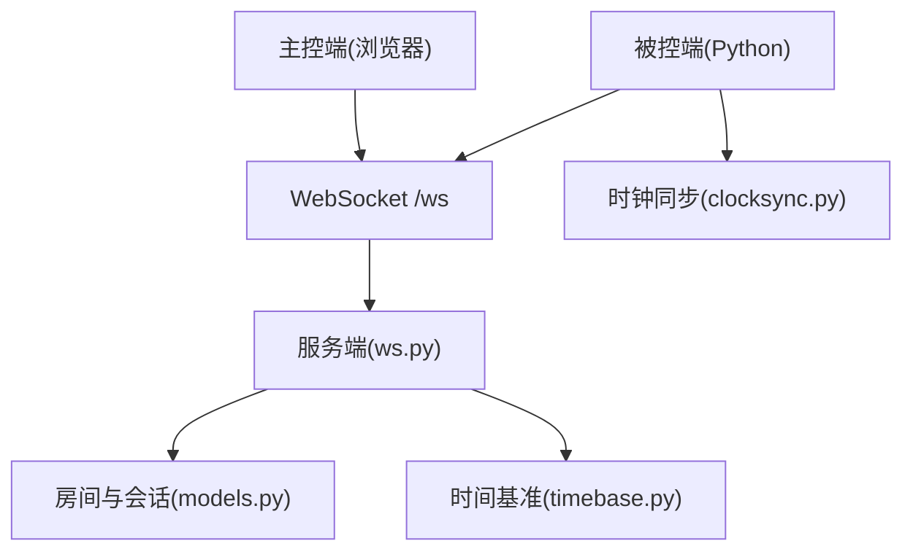
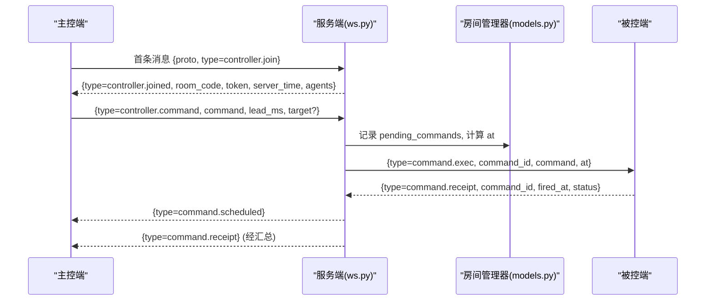
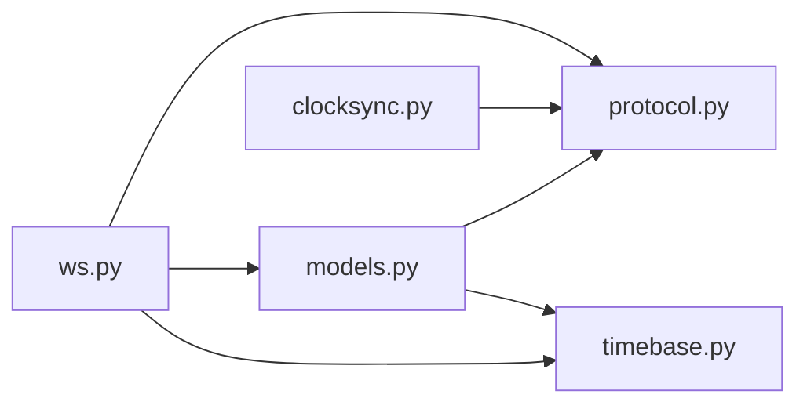

# WebSocket 协议规范

<cite>
**本文引用的文件**
- [server/server/protocol.py](file://server/server/protocol.py)
- [agent/agent/protocol.py](file://agent/agent/protocol.py)
- [server/server/ws.py](file://server/server/ws.py)
- [server/server/models.py](file://server/server/models.py)
- [server/server/timebase.py](file://server/server/timebase.py)
- [agent/agent/clocksync.py](file://agent/agent/clocksync.py)
- [README.md](file://README.md)
</cite>

## 目录
1. [简介](#简介)
2. [项目结构](#项目结构)
3. [核心组件](#核心组件)
4. [架构总览](#架构总览)
5. [详细组件分析](#详细组件分析)
6. [依赖关系分析](#依赖关系分析)
7. [性能考量](#性能考量)
8. [故障排查指南](#故障排查指南)
9. [结论](#结论)
10. [附录：消息格式与示例](#附录消息格式与示例)

## 简介
本规范定义 ScriptCue 的 WebSocket 通信协议，覆盖版本管理、消息类型与字段、错误码与处理流程、时钟同步机制、扩展机制以及序列化最佳实践。该协议用于主控端（浏览器）、服务端（FastAPI）与被控端（Python 客户端）之间的实时协作，实现多设备在公网环境下的高精度同步起播。

## 项目结构
- 服务端：房间管理、WebSocket 会话路由、指令调度、状态汇聚、审计日志、授时基准。
- 主控端：网页控制台，负责创建/加入房间、下发指令、查看设备状态。
- 被控端：加入房间后持续进行类 NTP 时钟同步，按绝对时刻执行命令。

图表来源
- [server/server/ws.py:1-360](file://server/server/ws.py#L1-L360)
- [server/server/models.py:1-157](file://server/server/models.py#L1-L157)
- [server/server/timebase.py:1-13](file://server/server/timebase.py#L1-L13)
- [agent/agent/clocksync.py:1-106](file://agent/agent/clocksync.py#L1-L106)

章节来源
- [README.md:1-86](file://README.md#L1-L86)

## 核心组件
- 协议常量与版本：集中定义于服务端的 protocol.py，被控端维护等价副本以保证一致性。
- WebSocket 会话：统一入口 handle_ws，首条消息声明角色（主控端或被控端），并进行版本校验。
- 房间与会话模型：Room、AgentSession、RoomManager 管理房间生命周期、成员与待执行指令。
- 时间基准：now_ms() 提供毫秒级单调时间戳，作为所有“服务器时间”的统一来源。
- 时钟同步：被控端通过 ping/pong 估算偏移与 RTT，选择最优样本并上报质量等级。

章节来源
- [server/server/protocol.py:1-80](file://server/server/protocol.py#L1-L80)
- [agent/agent/protocol.py:1-80](file://agent/agent/protocol.py#L1-L80)
- [server/server/ws.py:1-360](file://server/server/ws.py#L1-L360)
- [server/server/models.py:1-157](file://server/server/models.py#L1-L157)
- [server/server/timebase.py:1-13](file://server/server/timebase.py#L1-L13)
- [agent/agent/clocksync.py:1-106](file://agent/agent/clocksync.py#L1-L106)

## 架构总览
- 连接建立：客户端连接 /ws，首条消息必须为 JSON 对象且包含 proto 与 type。
- 角色路由：根据 type 分派到主控端或被控端会话处理。
- 指令流：主控端发起指令 → 服务端计算 at = now_ms() + lead_ms → 广播给在线被控端 → 被控端回执触发结果。
- 时钟同步：被控端周期性发送 clock.sync_req，服务端立即返回 clock.sync_res；被控端据此估算 offset 与 rtt，并在心跳中上报质量等级。

图表来源
- [server/server/ws.py:154-208](file://server/server/ws.py#L154-L208)
- [server/server/ws.py:246-327](file://server/server/ws.py#L246-L327)
- [server/server/models.py:64-117](file://server/server/models.py#L64-L117)

## 详细组件分析

### 版本管理与兼容性
- 版本标识：协议版本号 PROTO_VERSION 由服务端权威定义，被控端需保持一致。
- 握手校验：首条消息必须包含 proto 字段，与服务端期望版本一致，否则返回 ERR_BAD_PROTO。
- 兼容策略：
  - 新增可选字段：客户端可忽略未知字段，服务端应容忍未知字段。
  - 新增必填字段：仅在新版本引入，旧客户端无法使用新特性。
  - 行为变更：保持默认值不变，或提供降级路径。
- 升级迁移：
  - 服务端先部署新版本，允许旧客户端以旧版本连接（若兼容）。
  - 客户端逐步升级，确保 proto 匹配后再启用新特性。
  - 文档与两端常量同步更新，并递增 PROTO_VERSION。

章节来源
- [server/server/protocol.py:1-10](file://server/server/protocol.py#L1-L10)
- [agent/agent/protocol.py:1-8](file://agent/agent/protocol.py#L1-L8)
- [server/server/ws.py:334-360](file://server/server/ws.py#L334-L360)

### 消息类型与格式
- 通用字段：
  - type: 字符串，消息类型标识。
  - 其他字段依具体消息而定。
- 控制消息（主控端 → 服务器）：
  - controller.create：创建房间，可选 room_name、password。
  - controller.join：加入房间，room_code、可选 password。
  - controller.resume：恢复会话，room_code、token。
  - controller.command：下发指令，command、lead_ms、target（可选）、command_id（可选）。
  - controller.cancel：取消指令，command_id。
  - controller.set_comp：设置补偿值，session_id、compensation_ms。
- 服务器 → 主控端：
  - controller.joined：加入成功，room_code、room_name、token、server_time、agents。
  - command.scheduled：指令已调度，command_id、command、at、lead_ms。
  - command.cancelled：指令已取消，command_id。
  - agent.updated：设备状态变化，agent（AgentState）。
  - agent.left：设备离开，session_id。
  - error：错误响应，code、message。
- 被控端 → 服务器：
  - agent.join：加入房间，room_code、token（可选）、nickname、auto_create（可选）、password（可选）。
  - agent.heartbeat：心跳，ready、clock_quality、clock_offset_ms、clock_rtt_ms。
  - agent.set_comp：请求设置补偿值，compensation_ms。
  - clock.sync_req：时钟同步请求，id、t0。
  - command.receipt：指令回执，command_id、fired_at、status（可选）。
- 服务器 → 被控端：
  - agent.joined：加入成功，room_code、token、server_time、compensation_ms、lead_ms。
  - clock.sync_res：时钟同步应答，id、t0、ts。
  - command.exec：执行指令，command_id、command、at。
  - command.cancel：取消指令，command_id。
  - comp.update：补偿值更新，compensation_ms。
- 数据约束：
  - 数值型字段：整数或浮点，范围受服务端限制（如 lead_ms、compensation_ms）。
  - 字符串字段：长度受限（如 nickname ≤ 32 字符）。
  - 枚举字段：严格限定取值集合（如 command、clock_quality）。
  - 必填项：见各消息说明；缺失时服务端可能返回 ERR_BAD_MESSAGE 或采用默认值。

章节来源
- [server/server/protocol.py:11-80](file://server/server/protocol.py#L11-L80)
- [agent/agent/protocol.py:9-80](file://agent/agent/protocol.py#L9-L80)
- [server/server/ws.py:67-152](file://server/server/ws.py#L67-L152)
- [server/server/ws.py:214-327](file://server/server/ws.py#L214-L327)
- [server/server/models.py:17-52](file://server/server/models.py#L17-L52)

### 错误码与处理流程
- 错误分类：
  - 网络错误：连接断开、超时等，由框架处理，客户端应重连。
  - 业务错误：房间不存在、口令错误、房间已满、设备不存在等。
  - 协议错误：消息格式非法、未知消息类型、版本不匹配等。
- 错误码定义：
  - bad_proto：协议版本不匹配。
  - room_not_found：房间不存在。
  - bad_password：房间口令错误。
  - room_full：房间设备数已达上限。
  - not_controller：非主控端操作。
  - bad_command：指令类型无效或参数非法。
  - no_such_agent：目标设备不存在。
  - bad_message：消息格式非法或字段缺失。
- 处理流程：
  - 服务端收到非法消息：返回 error，连接保持。
  - 业务校验失败：返回对应错误码与提示消息。
  - 客户端收到 error：记录日志，必要时重试或提示用户。

章节来源
- [server/server/protocol.py:57-65](file://server/server/protocol.py#L57-L65)
- [server/server/ws.py:37-60](file://server/server/ws.py#L37-L60)
- [server/server/ws.py:67-152](file://server/server/ws.py#L67-L152)
- [server/server/ws.py:246-327](file://server/server/ws.py#L246-L327)

### 时钟同步机制
- 算法概述：被控端发送 clock.sync_req（携带本地发出时刻 t0），服务端返回 clock.sync_res（携带服务器时间 ts），被控端记录接收时刻 t1，估算 offset = ts - (t0 + t1)/2，rtt = t1 - t0。
- 采样策略：
  - 密集采样：加入房间后多次快速采样，取 RTT 最小者作为可信偏移。
  - 维持采样：定期采样，保持最新估计。
  - 样本老化：超过保留时间的样本仅在无新样本时兜底使用。
- 质量分级：
  - excellent：样本数量足够且 RTT 较低。
  - good：样本数量一般且 RTT 中等。
  - poor：样本较少或 RTT 较高。
  - none：无有效样本。
- 上报与使用：
  - 心跳中上报 clock_quality、clock_offset_ms、clock_rtt_ms。
  - 被控端将指令绝对时刻转换为本地时刻：local_fire = at - offset - compensation_ms。

章节来源
- [agent/agent/clocksync.py:1-106](file://agent/agent/clocksync.py#L1-L106)
- [server/server/ws.py:214-226](file://server/server/ws.py#L214-L226)
- [server/server/ws.py:299-303](file://server/server/ws.py#L299-L303)

### 指令调度与回执
- 调度流程：
  - 主控端下发 controller.command，服务端计算 at = now_ms() + lead_ms。
  - 服务端记录 pending_commands，并向目标或全体在线被控端广播 command.exec。
  - 被控端在 local_fire 时刻触发，并回传 command.receipt。
- 取消流程：
  - 主控端发送 controller.cancel，服务端取消待执行指令并通知相关被控端。
- 清理机制：
  - 指令到期后等待回执窗口，超时后清理 pending 记录。

章节来源
- [server/server/ws.py:67-115](file://server/server/ws.py#L67-L115)
- [server/server/ws.py:117-135](file://server/server/ws.py#L117-L135)
- [server/server/ws.py:228-244](file://server/server/ws.py#L228-L244)

### 扩展机制
- 自定义消息类型：
  - 建议遵循命名空间约定（如 namespace.action）。
  - 新增字段应为可选，避免破坏旧客户端。
- 插件接口规范：
  - 通过房间或会话上下文注入扩展能力。
  - 扩展模块需实现标准回调接口，由主流程调用。
- 向后兼容保证：
  - 服务端对未知字段静默忽略。
  - 客户端对未知消息类型忽略或降级处理。

[本节为概念性说明，不直接分析具体文件]

## 依赖关系分析
- ws.py 依赖 protocol 常量、models 房间与会话、timebase 时间基准。
- models.py 依赖 protocol 常量与 timebase。
- clocksync.py 依赖 protocol 常量与本地时间工具。
- 主控端与被控端均依赖 protocol 常量以保持消息类型一致。

图表来源
- [server/server/ws.py:1-360](file://server/server/ws.py#L1-L360)
- [server/server/models.py:1-157](file://server/server/models.py#L1-L157)
- [server/server/timebase.py:1-13](file://server/server/timebase.py#L1-L13)
- [agent/agent/clocksync.py:1-106](file://agent/agent/clocksync.py#L1-L106)

章节来源
- [server/server/ws.py:1-360](file://server/server/ws.py#L1-L360)
- [server/server/models.py:1-157](file://server/server/models.py#L1-L157)
- [server/server/timebase.py:1-13](file://server/server/timebase.py#L1-L13)
- [agent/agent/clocksync.py:1-106](file://agent/agent/clocksync.py#L1-L106)

## 性能考量
- 心跳间隔：被控端每 5 秒发送一次心跳，便于服务端检测在线状态。
- 指令提前量：默认 3000ms，可在 500ms 至 60000ms 范围内调整，以平衡延迟与可靠性。
- 补偿值范围：-10000ms 至 10000ms，防止极端值影响调度。
- 回执超时：指令到期后等待 8000ms 回执，超时后清理。
- 状态推送节流：避免频繁推送导致带宽浪费。

章节来源
- [server/server/protocol.py:67-80](file://server/server/protocol.py#L67-L80)
- [server/server/ws.py:22-27](file://server/server/ws.py#L22-L27)

## 故障排查指南
- 连接问题：
  - 检查首条消息是否为 JSON 对象且包含 proto 与 type。
  - 确认 proto 版本与服务端一致。
- 房间问题：
  - 房间不存在：检查 room_code 是否正确。
  - 口令错误：确认 password 是否匹配。
  - 房间已满：等待空闲或联系管理员扩容。
- 指令问题：
  - 未知指令：检查 command 是否在合法集合内。
  - 目标设备不存在：确认 target 或 session_id 正确。
  - 回执缺失：检查被控端时钟同步状态与网络连接。
- 时钟同步问题：
  - 质量等级为 none：检查网络延迟与采样频率。
  - 偏移异常：检查系统时间与网络稳定性。

章节来源
- [server/server/ws.py:37-60](file://server/server/ws.py#L37-L60)
- [server/server/ws.py:67-152](file://server/server/ws.py#L67-L152)
- [server/server/ws.py:246-327](file://server/server/ws.py#L246-L327)
- [agent/agent/clocksync.py:89-106](file://agent/agent/clocksync.py#L89-L106)

## 结论
本规范定义了 ScriptCue 的 WebSocket 协议，涵盖版本管理、消息格式、错误处理、时钟同步与指令调度等核心机制。通过严格的版本校验与兼容策略，确保系统在演进过程中保持稳定。建议在实际部署中关注性能参数调优与故障排查流程，以提升整体可靠性。

## 附录：消息格式与示例
以下为关键消息的结构定义与示例（字段名与类型依据源码实现）：

- 首条消息（通用）
  - 字段：proto（整数）、type（字符串）
  - 示例：{"proto": 1, "type": "controller.join"}

- 控制器创建房间
  - 字段：room_name（字符串，可选）、password（字符串，可选）
  - 示例：{"type": "controller.create", "room_name": "演示房间", "password": "secret"}

- 控制器加入房间
  - 字段：room_code（字符串）、password（字符串，可选）
  - 示例：{"type": "controller.join", "room_code": "ABC123"}

- 控制器恢复会话
  - 字段：room_code（字符串）、token（字符串）
  - 示例：{"type": "controller.resume", "room_code": "ABC123", "token": "xyz"}

- 控制器下发指令
  - 字段：command（枚举）、lead_ms（整数，可选）、target（字符串，可选）、command_id（字符串，可选）
  - 示例：{"type": "controller.command", "command": "play", "lead_ms": 3000, "target": "agent-1"}

- 控制器取消指令
  - 字段：command_id（字符串）
  - 示例：{"type": "controller.cancel", "command_id": "cmd-001"}

- 控制器设置补偿值
  - 字段：session_id（字符串）、compensation_ms（整数）
  - 示例：{"type": "controller.set_comp", "session_id": "agent-1", "compensation_ms": 100}

- 服务器返回加入成功
  - 字段：room_code（字符串）、room_name（字符串）、token（字符串）、server_time（整数）、agents（数组）
  - 示例：{"type": "controller.joined", "room_code": "ABC123", "token": "tok", "server_time": 1710000000000, "agents": []}

- 指令已调度
  - 字段：command_id（字符串）、command（字符串）、at（整数）、lead_ms（整数）
  - 示例：{"type": "command.scheduled", "command_id": "cmd-001", "command": "play", "at": 1710000003000, "lead_ms": 3000}

- 指令已取消
  - 字段：command_id（字符串）
  - 示例：{"type": "command.cancelled", "command_id": "cmd-001"}

- 设备加入房间
  - 字段：room_code（字符串）、token（字符串，可选）、nickname（字符串）、auto_create（布尔，可选）、password（字符串，可选）
  - 示例：{"type": "agent.join", "room_code": "ABC123", "nickname": "口述员A"}

- 心跳
  - 字段：ready（布尔）、clock_quality（枚举）、clock_offset_ms（浮点，可选）、clock_rtt_ms（浮点，可选）
  - 示例：{"type": "agent.heartbeat", "ready": true, "clock_quality": "good", "clock_offset_ms": 12.5, "clock_rtt_ms": 45.0}

- 时钟同步请求
  - 字段：id（整数）、t0（整数）
  - 示例：{"type": "clock.sync_req", "id": 1, "t0": 1710000000000}

- 时钟同步应答
  - 字段：id（整数）、t0（整数）、ts（整数）
  - 示例：{"type": "clock.sync_res", "id": 1, "t0": 1710000000000, "ts": 1710000000050}

- 指令执行
  - 字段：command_id（字符串）、command（字符串）、at（整数）
  - 示例：{"type": "command.exec", "command_id": "cmd-001", "command": "play", "at": 1710000003000}

- 指令取消
  - 字段：command_id（字符串）
  - 示例：{"type": "command.cancel", "command_id": "cmd-001"}

- 补偿值更新
  - 字段：compensation_ms（整数）
  - 示例：{"type": "comp.update", "compensation_ms": 100}

- 设备状态变化
  - 字段：agent（对象，含 session_id、nickname、online、ready、clock_quality、clock_offset_ms、clock_rtt_ms、compensation_ms、last_seen）
  - 示例：{"type": "agent.updated", "agent": {"session_id": "agent-1", "nickname": "口述员A", "online": true, "ready": true, "clock_quality": "good", "clock_offset_ms": 12.5, "clock_rtt_ms": 45.0, "compensation_ms": 100, "last_seen": 1710000000000}}

- 设备离开
  - 字段：session_id（字符串）
  - 示例：{"type": "agent.left", "session_id": "agent-1"}

- 错误响应
  - 字段：code（字符串）、message（字符串）
  - 示例：{"type": "error", "code": "bad_proto", "message": "协议版本不匹配，服务端要求 v1"}

章节来源
- [server/server/ws.py:154-208](file://server/server/ws.py#L154-L208)
- [server/server/ws.py:246-327](file://server/server/ws.py#L246-L327)
- [server/server/models.py:40-52](file://server/server/models.py#L40-L52)
- [server/server/protocol.py:11-80](file://server/server/protocol.py#L11-L80)
- [agent/agent/protocol.py:9-80](file://agent/agent/protocol.py#L9-L80)