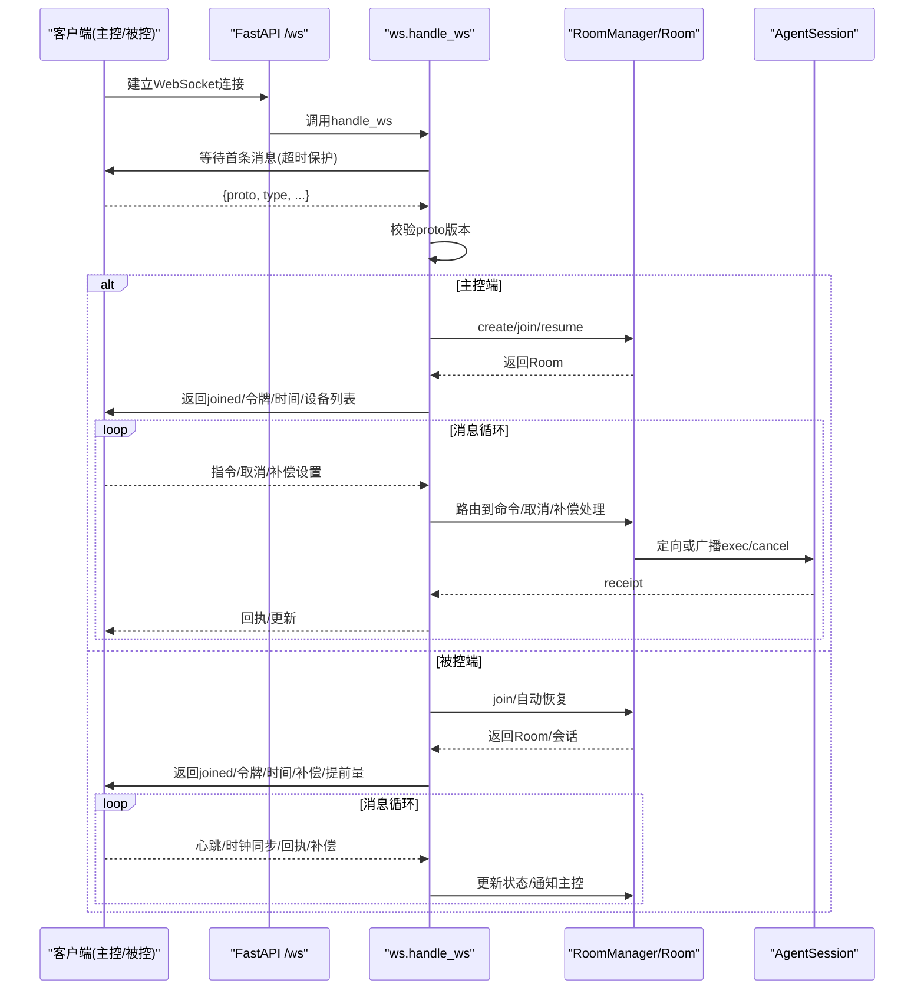
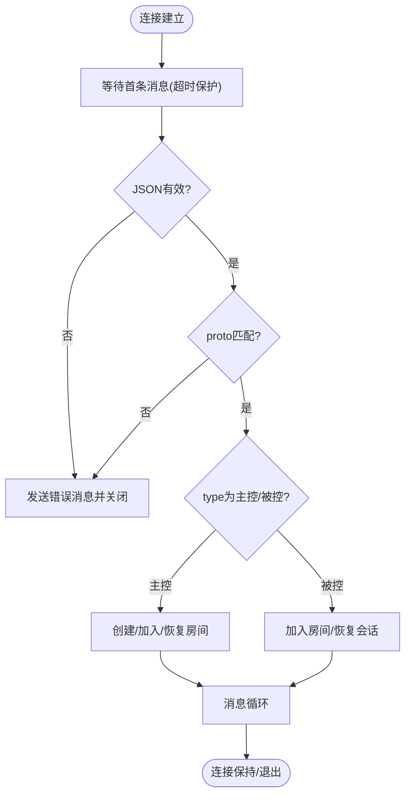
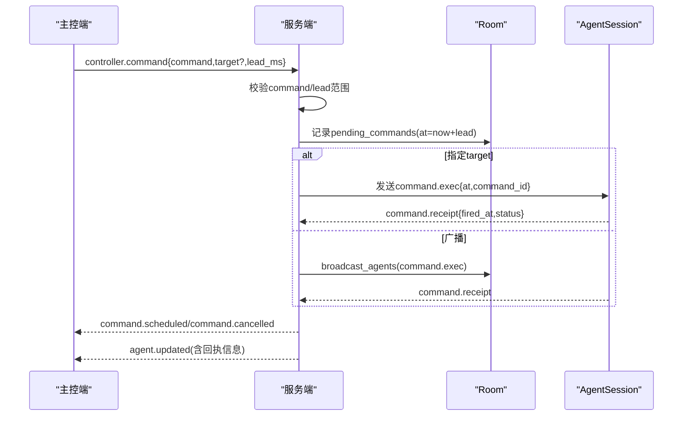
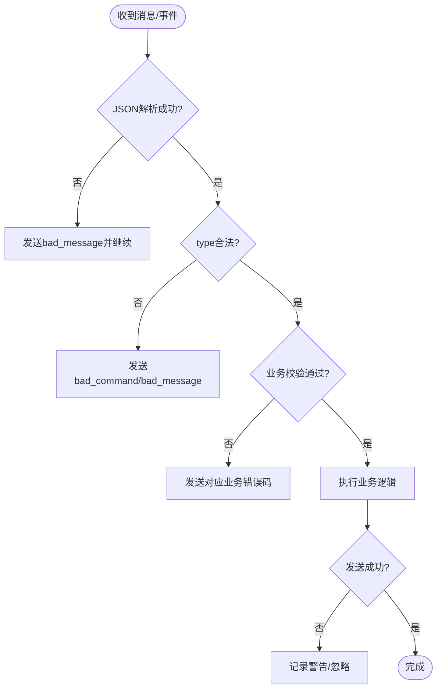
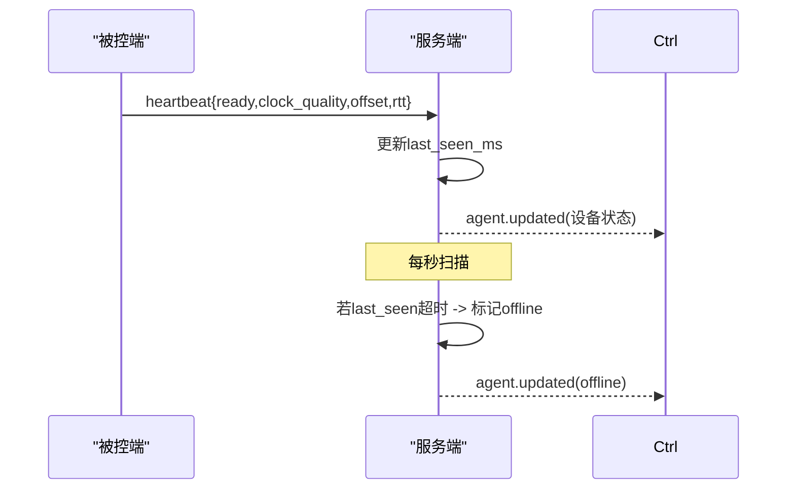
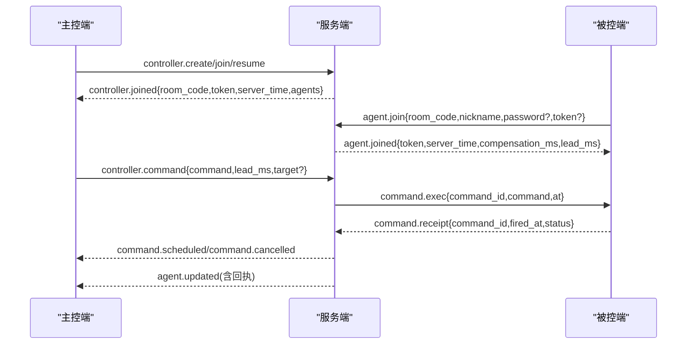
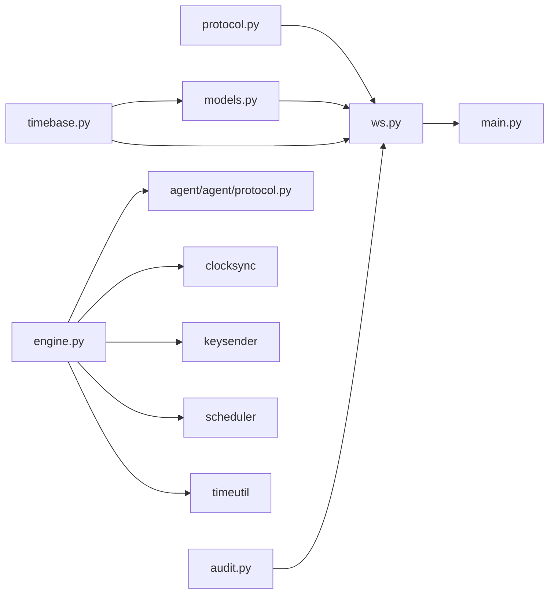

# WebSocket 通信层

<cite>
**本文引用的文件**
- [server/server/ws.py](file://server/server/ws.py)
- [server/server/protocol.py](file://server/server/protocol.py)
- [agent/agent/protocol.py](file://agent/agent/protocol.py)
- [server/server/models.py](file://server/server/models.py)
- [server/server/main.py](file://server/server/main.py)
- [agent/agent/engine.py](file://agent/agent/engine.py)
- [README.md](file://README.md)
</cite>

## 目录
1. [简介](#简介)
2. [项目结构](#项目结构)
3. [核心组件](#核心组件)
4. [架构总览](#架构总览)
5. [详细组件分析](#详细组件分析)
6. [依赖关系分析](#依赖关系分析)
7. [性能考量](#性能考量)
8. [故障排查指南](#故障排查指南)
9. [结论](#结论)

## 简介
本技术文档聚焦 ScriptCue 的 WebSocket 通信层，覆盖连接建立、维护与断开处理；消息路由与分发（类型识别、目标设备定位、广播）；协议版本管理与向后兼容策略；错误处理机制（连接异常、消息格式错误、网络中断）；心跳保活与连接池管理；并配套消息流图与错误处理流程图。该通信层由服务端 FastAPI + WebSocket 与被控端 Python 引擎共同实现，主控端通过网页与服务器交互。

## 项目结构
- 服务端：FastAPI 应用暴露 /ws 端点，统一处理主控端与被控端的 WebSocket 会话；房间与会话状态以内存模型管理；后台任务负责离线检测与空闲房间清理。
- 被控端：基于 websockets 库维持长连接，实现时钟同步、心跳、指令调度与回执上报。
- 协议常量：服务端权威定义，被控端维护等价副本，确保两端一致。

```mermaid
graph TB
subgraph "服务端"
A["FastAPI 应用<br/>/ws 端点"] --> B["WebSocket 处理器<br/>ws.py"]
B --> C["房间与会话模型<br/>models.py"]
B --> D["协议常量<br/>protocol.py"]
A --> E["后台任务<br/>main.py"]
end
subgraph "被控端"
F["AgentEngine<br/>engine.py"] --> G["协议常量副本<br/>agent/agent/protocol.py"]
end
F < --> B
```

**图表来源**
- [server/server/main.py:88-90](file://server/server/main.py#L88-L90)
- [server/server/ws.py:334-360](file://server/server/ws.py#L334-L360)
- [server/server/models.py:64-117](file://server/server/models.py#L64-L117)
- [server/server/protocol.py:1-80](file://server/server/protocol.py#L1-L80)
- [agent/agent/engine.py:106-158](file://agent/agent/engine.py#L106-L158)
- [agent/agent/protocol.py:1-80](file://agent/agent/protocol.py#L1-L80)

**章节来源**
- [README.md:16-27](file://README.md#L16-L27)
- [server/server/main.py:1-98](file://server/server/main.py#L1-L98)

## 核心组件
- WebSocket 会话处理器：统一入口 handle_ws，解析首条消息，区分主控端与被控端会话，校验协议版本，进入对应生命周期管理。
- 房间与会话模型：RoomManager 管理房间集合；Room 管理主控端连接、被控端会话集合、待执行指令队列、广播与通知能力；AgentSession 表示单台设备的会话状态与发送能力。
- 协议常量：集中定义消息类型、指令类型、错误码、限制参数与心跳相关常量，保证两端一致性。
- 被控端引擎：负责连接生命周期、时钟同步、心跳循环、指令调度与回执上报、断线重连与指数退避。

**章节来源**
- [server/server/ws.py:1-360](file://server/server/ws.py#L1-L360)
- [server/server/models.py:17-157](file://server/server/models.py#L17-L157)
- [server/server/protocol.py:1-80](file://server/server/protocol.py#L1-L80)
- [agent/agent/engine.py:31-388](file://agent/agent/engine.py#L31-L388)

## 架构总览
WebSocket 通信采用“单一端点 + 首条消息声明角色”的模式。客户端首次连接后必须发送包含 proto 与 type 的首条消息，服务端据此分流到主控端或被控端会话处理流程。房间作为隔离单元，承载主控端与多台被控端之间的指令下发、状态汇聚与广播。



**图表来源**
- [server/server/main.py:88-90](file://server/server/main.py#L88-L90)
- [server/server/ws.py:334-360](file://server/server/ws.py#L334-L360)
- [server/server/ws.py:154-208](file://server/server/ws.py#L154-L208)
- [server/server/ws.py:246-327](file://server/server/ws.py#L246-L327)
- [server/server/models.py:64-117](file://server/server/models.py#L64-L117)

## 详细组件分析

### 连接建立与维护
- 连接建立：服务端接受连接后，使用超时机制等待首条消息；若超时或断开则直接关闭。
- 首条消息校验：要求为 JSON 对象且包含 proto 字段，与服务端 PROTO_VERSION 匹配，否则返回错误并关闭。
- 角色分流：根据 type 分流至主控端或被控端会话处理。
- 会话绑定：被控端支持凭 token 恢复旧会话；新连接会顶替旧连接，旧连接被关闭。
- 房间生命周期：房间可被密码保护；空闲超过阈值自动销毁；主控端连接被顶替时，旧主控连接被关闭。



**图表来源**
- [server/server/ws.py:334-360](file://server/server/ws.py#L334-L360)
- [server/server/ws.py:154-208](file://server/server/ws.py#L154-L208)
- [server/server/ws.py:246-327](file://server/server/ws.py#L246-L327)

**章节来源**
- [server/server/ws.py:29-61](file://server/server/ws.py#L29-L61)
- [server/server/ws.py:154-208](file://server/server/ws.py#L154-L208)
- [server/server/ws.py:246-327](file://server/server/ws.py#L246-L327)
- [server/server/models.py:64-117](file://server/server/models.py#L64-L117)

### 消息路由与分发系统
- 消息类型识别：所有消息均包含 type 字段，服务端依据 type 路由到具体处理器。
- 目标设备定位：指令可指定 target 设备 session_id；未指定则广播给房间内所有在线被控端。
- 广播机制：Room.broadcast_agents 仅向在线设备发送；AgentSession.send 封装发送并捕获异常。
- 回执与审计：被控端触发后上报 CMD_RECEIPT，服务端汇总并通知主控端，同时记录审计日志。



**图表来源**
- [server/server/ws.py:67-115](file://server/server/ws.py#L67-L115)
- [server/server/ws.py:228-244](file://server/server/ws.py#L228-L244)
- [server/server/models.py:100-117](file://server/server/models.py#L100-L117)

**章节来源**
- [server/server/ws.py:67-115](file://server/server/ws.py#L67-L115)
- [server/server/ws.py:228-244](file://server/server/ws.py#L228-L244)
- [server/server/models.py:100-117](file://server/server/models.py#L100-L117)

### 协议版本管理与向后兼容
- 版本常量：服务端与被控端各自维护 PROTO_VERSION，修改协议时需同步递增。
- 握手校验：服务端在 handle_ws 中检查首条消息的 proto 是否等于 PROTO_VERSION，不匹配则返回 bad_proto 错误。
- 兼容性策略：当前为严格版本匹配；未来可扩展为服务端支持多版本协商或降级策略。

**章节来源**
- [server/server/protocol.py:7-9](file://server/server/protocol.py#L7-L9)
- [agent/agent/protocol.py:7-7](file://agent/agent/protocol.py#L7-L7)
- [server/server/ws.py:349-351](file://server/server/ws.py#L349-L351)

### 错误处理机制
- 连接异常：WebSocketDisconnect 与 asyncio.TimeoutError 被捕获，连接安全关闭。
- 消息格式错误：非 JSON 或非对象的消息返回 bad_message 错误，连接保持以便重试。
- 协议版本错误：bad_proto 错误提示并要求升级客户端。
- 业务错误：房间不存在、口令错误、房间满员、未知指令、设备不存在等均有明确错误码。
- 发送失败：send_json 异常被吞掉并返回 False，避免阻塞主循环。



**图表来源**
- [server/server/ws.py:50-61](file://server/server/ws.py#L50-L61)
- [server/server/ws.py:67-71](file://server/server/ws.py#L67-L71)
- [server/server/ws.py:200-202](file://server/server/ws.py#L200-L202)
- [server/server/ws.py:318-320](file://server/server/ws.py#L318-L320)
- [server/server/models.py:54-61](file://server/server/models.py#L54-L61)

**章节来源**
- [server/server/ws.py:50-61](file://server/server/ws.py#L50-L61)
- [server/server/ws.py:67-71](file://server/server/ws.py#L67-L71)
- [server/server/ws.py:200-202](file://server/server/ws.py#L200-L202)
- [server/server/ws.py:318-320](file://server/server/ws.py#L318-L320)
- [server/server/models.py:54-61](file://server/server/models.py#L54-L61)

### 心跳保活与连接池管理
- 心跳机制：被控端每 HEARTBEAT_INTERVAL_S 秒发送心跳，携带就绪状态、时钟质量、偏移与 RTT；服务端更新会话 last_seen_ms 并推送状态给主控端。
- 离线判定：服务端每秒扫描，若 last_seen_ms 超过 AGENT_OFFLINE_S 秒标记离线并通知主控端。
- 连接池管理：Room.agents 字典维护设备会话；RoomManager.rooms 字典维护房间；房间空闲超过 ROOM_IDLE_TTL_S 自动销毁。
- 重连策略：被控端断线后按指数退避重连，上限 RECONNECT_BACKOFF_MAX_S。



**图表来源**
- [server/server/ws.py:214-226](file://server/server/ws.py#L214-L226)
- [server/server/main.py:40-52](file://server/server/main.py#L40-L52)
- [server/server/models.py:17-52](file://server/server/models.py#L17-L52)
- [server/server/protocol.py:75-80](file://server/server/protocol.py#L75-L80)
- [agent/agent/engine.py:217-241](file://agent/agent/engine.py#L217-L241)

**章节来源**
- [server/server/ws.py:214-226](file://server/server/ws.py#L214-L226)
- [server/server/main.py:40-52](file://server/server/main.py#L40-L52)
- [server/server/models.py:17-52](file://server/server/models.py#L17-L52)
- [server/server/protocol.py:75-80](file://server/server/protocol.py#L75-L80)
- [agent/agent/engine.py:217-241](file://agent/agent/engine.py#L217-L241)

### 消息流图（端到端）


**图表来源**
- [server/server/ws.py:154-208](file://server/server/ws.py#L154-L208)
- [server/server/ws.py:246-327](file://server/server/ws.py#L246-L327)
- [server/server/ws.py:67-115](file://server/server/ws.py#L67-L115)
- [server/server/ws.py:228-244](file://server/server/ws.py#L228-L244)

## 依赖关系分析
- ws.py 依赖 protocol.py（消息类型与常量）、models.py（房间与会话）、audit.py（审计日志）、timebase.py（时间）。
- models.py 依赖 protocol.py（限制与默认值）、timebase.py。
- main.py 依赖 ws.py、models.py、protocol.py、audit.py，并启动后台任务。
- engine.py 依赖 agent/agent/protocol.py、clocksync、keysender、scheduler、timeutil。



**图表来源**
- [server/server/ws.py:1-20](file://server/server/ws.py#L1-L20)
- [server/server/models.py:1-11](file://server/server/models.py#L1-L11)
- [server/server/main.py:22-26](file://server/server/main.py#L22-L26)
- [agent/agent/engine.py:12-23](file://agent/agent/engine.py#L12-L23)

**章节来源**
- [server/server/ws.py:1-20](file://server/server/ws.py#L1-L20)
- [server/server/models.py:1-11](file://server/server/models.py#L1-L11)
- [server/server/main.py:22-26](file://server/server/main.py#L22-L26)
- [agent/agent/engine.py:12-23](file://agent/agent/engine.py#L12-L23)

## 性能考量
- 广播与定向发送：Room.broadcast_agents 仅遍历在线设备，减少无效投递；AgentSession.send 捕获异常避免阻塞。
- 心跳节流：AGENT_PUSH_THROTTLE_S 控制状态推送频率，降低主控端压力。
- 指令回执窗口：RECEIPT_TIMEOUT_MS 限定等待回执的时间，避免长期挂起。
- 房间清理：空闲房间定期销毁，释放内存与连接资源。
- 重连退避：被控端指数退避重连，避免雪崩式重连风暴。

[本节提供通用指导，无需特定文件引用]

## 故障排查指南
- 连接无法建立：检查首条消息是否为 JSON 对象且 proto 匹配；确认 /ws 端点可达。
- 房间不存在或口令错误：确认 room_code 与 password；服务端重启后客户端可使用 auto_create 重建房间。
- 设备离线：检查被控端心跳是否正常；服务端每秒扫描标记离线并通知主控端。
- 指令未触发：检查时钟同步是否完成（offset 存在）；查看回执状态与 delta_ms；必要时调整 lead_ms 或 compensation_ms。
- 消息格式错误：确保消息为 JSON 对象且 type 合法；服务端会返回 bad_message 错误。

**章节来源**
- [server/server/ws.py:50-61](file://server/server/ws.py#L50-L61)
- [server/server/ws.py:154-208](file://server/server/ws.py#L154-L208)
- [server/server/ws.py:246-327](file://server/server/ws.py#L246-L327)
- [server/server/main.py:40-52](file://server/server/main.py#L40-L52)
- [agent/agent/engine.py:159-193](file://agent/agent/engine.py#L159-L193)

## 结论
ScriptCue 的 WebSocket 通信层通过统一的 /ws 端点与首条消息角色声明，实现了主控端与被控端的清晰分离与高效协作。房间模型提供了隔离与广播能力，协议常量确保了两端一致性。心跳与离线检测保障了连接健康，错误处理机制提升了鲁棒性。整体设计简洁、可扩展，适合公网环境下多设备高精度同步场景。

[本节总结内容，无需特定文件引用]