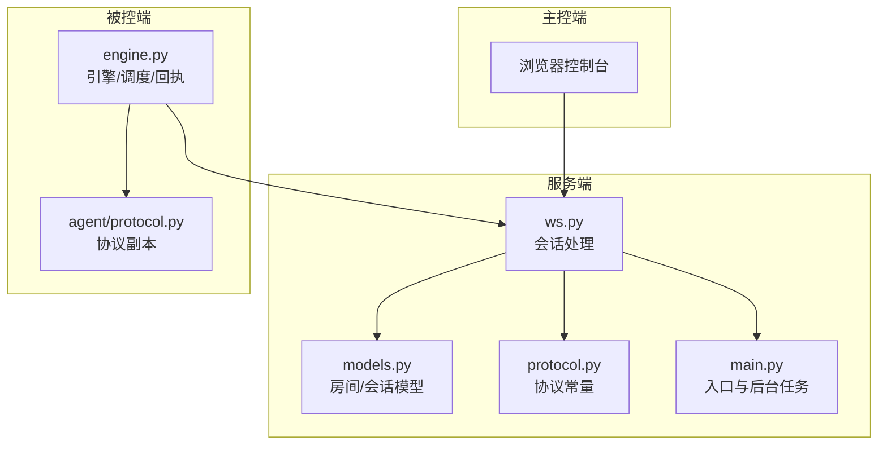
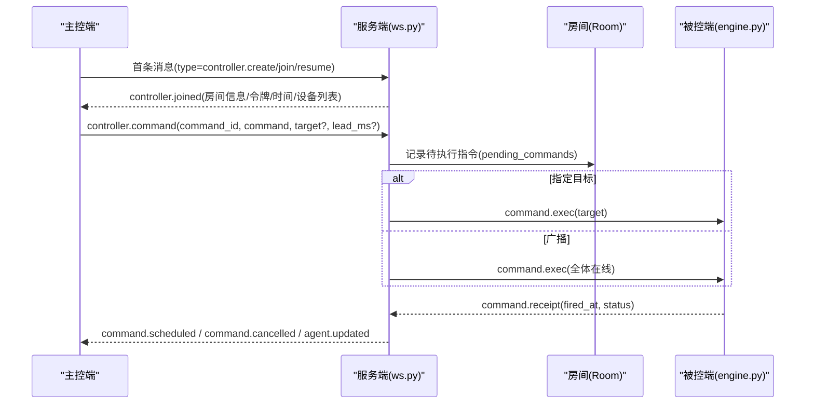
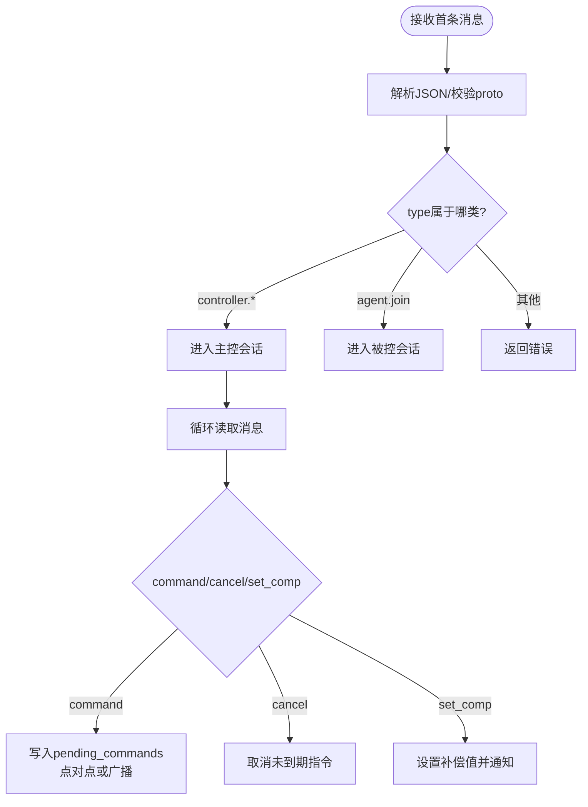
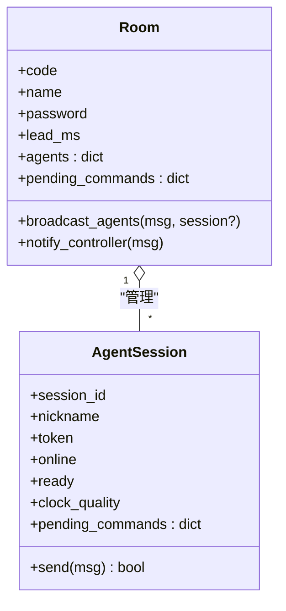
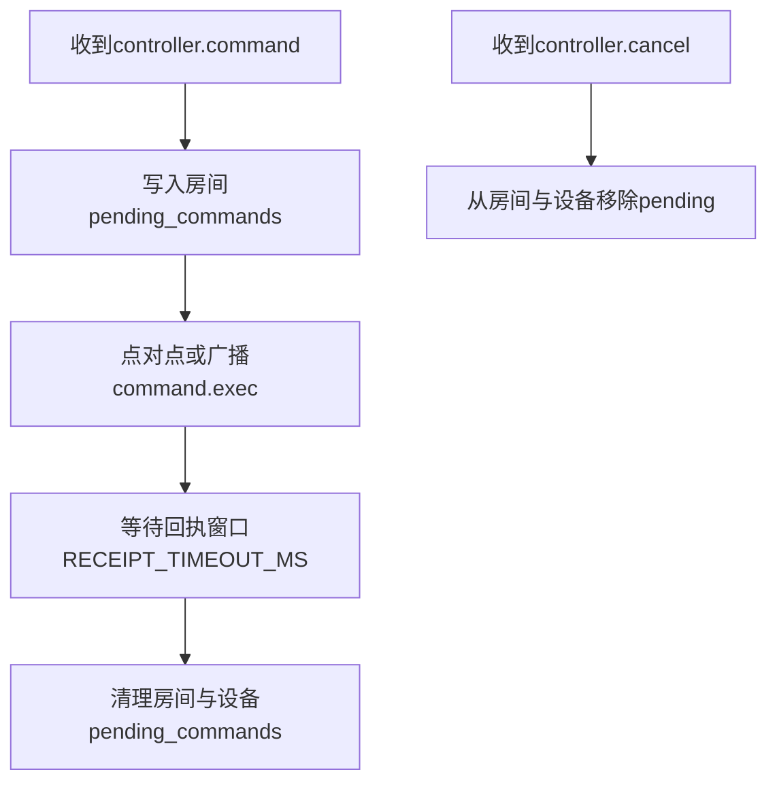
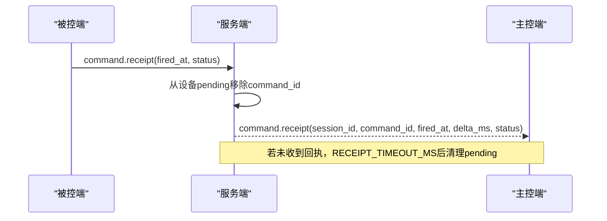
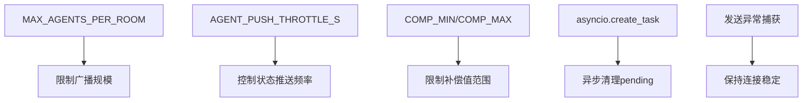
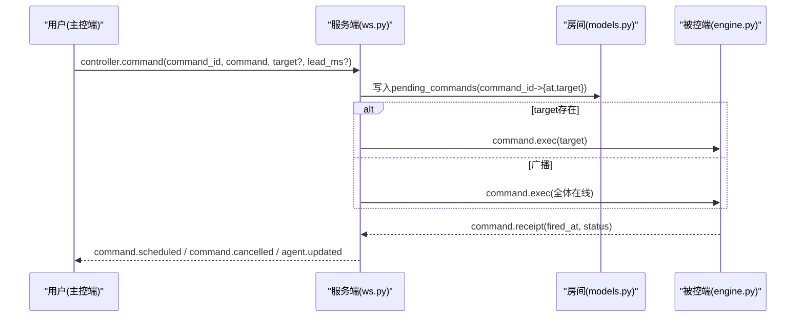
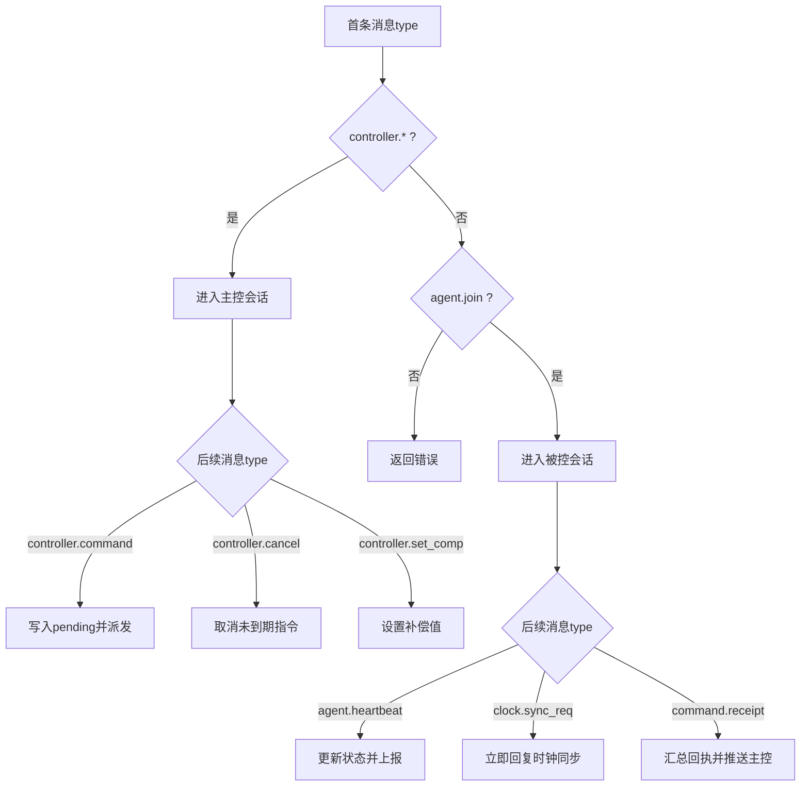
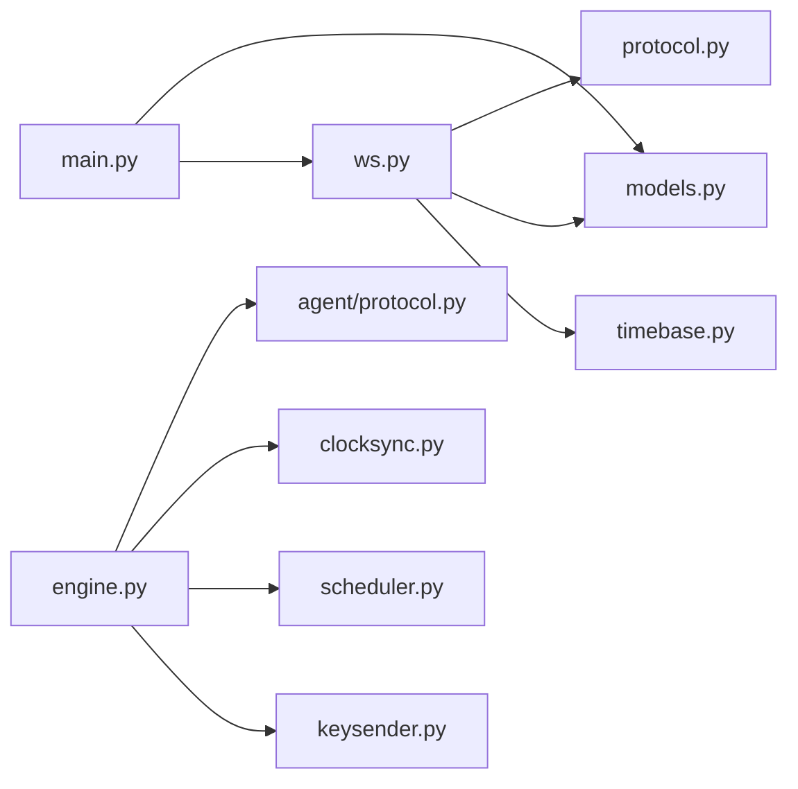

# 消息路由与分发

<cite>
**本文引用的文件**
- [server/server/ws.py](file://server/server/ws.py)
- [server/server/protocol.py](file://server/server/protocol.py)
- [agent/agent/protocol.py](file://agent/agent/protocol.py)
- [server/server/models.py](file://server/server/models.py)
- [server/server/main.py](file://server/server/main.py)
- [agent/agent/engine.py](file://agent/agent/engine.py)
- [README.md](file://README.md)
</cite>

## 目录
1. [简介](#简介)
2. [项目结构](#项目结构)
3. [核心组件](#核心组件)
4. [架构总览](#架构总览)
5. [详细组件分析](#详细组件分析)
6. [依赖关系分析](#依赖关系分析)
7. [性能考量](#性能考量)
8. [故障排查指南](#故障排查指南)
9. [结论](#结论)
10. [附录](#附录)

## 简介
本文件系统性地梳理 ScriptCue 的 WebSocket 消息路由与分发机制，覆盖以下关键主题：
- 首条消息解析、角色判断与命令分发
- 点对点通信、房间广播与设备组播的路由算法
- 待执行指令的存储、优先级与过期清理
- 回执处理、超时重试与失败补偿
- 流量限制、背压与内存管理
- 消息流转图与路由决策树

该系统通过“时钟对齐 + 绝对时刻调度”实现多设备同步起播，服务端负责房间与会话管理、指令下发与状态汇聚，主控端用于下发控制指令，被控端负责高精度定时触发并上报回执。

## 项目结构
- 服务端（FastAPI + WebSocket）：房间管理、WebSocket 长连接、授时基准、指令广播、状态汇聚、审计日志；房间数据纯内存存储，重启后由客户端重连自动重建。
- 主控端（HTML/JS 网页）：查看设备状态并下发起播/暂停等指令。
- 被控端（Python）：加入房间后持续与服务端做类 NTP 时钟同步；收到带绝对执行时刻的指令后，本地高精度定时到点触发并上报回执。

**图表来源**
- [server/server/ws.py:150-208](file://server/server/ws.py#L150-L208)
- [server/server/models.py:64-117](file://server/server/models.py#L64-L117)
- [server/server/protocol.py:11-80](file://server/server/protocol.py#L11-L80)
- [server/server/main.py:36-90](file://server/server/main.py#L36-L90)
- [agent/agent/engine.py:159-193](file://agent/agent/engine.py#L159-L193)
- [agent/agent/protocol.py:9-80](file://agent/agent/protocol.py#L9-L80)

**章节来源**
- [README.md:16-27](file://README.md#L16-L27)
- [server/server/main.py:36-90](file://server/server/main.py#L36-L90)

## 核心组件
- 会话处理器 ws.py：统一接入 /ws 端点，解析首条消息识别角色（主控/被控），进入对应会话循环，完成命令分发、回执聚合、心跳与状态推送。
- 房间与会话模型 models.py：Room 维护在线设备集合、待执行指令队列、控制器连接；AgentSession 维护单台设备的连接、时钟质量、待执行指令映射。
- 协议常量 protocol.py（服务端权威定义）与 agent/agent/protocol.py（被控端副本）：统一定义消息类型、错误码、限制参数。
- 主进程 main.py：启动后台任务（离线检测、空闲房间销毁），挂载静态页面与 WebSocket 端点。
- 被控端引擎 engine.py：连接生命周期、时钟同步、绝对时刻调度、回执发送、取消与补偿更新。

**章节来源**
- [server/server/ws.py:1-20](file://server/server/ws.py#L1-L20)
- [server/server/models.py:17-117](file://server/server/models.py#L17-L117)
- [server/server/protocol.py:11-80](file://server/server/protocol.py#L11-L80)
- [agent/agent/protocol.py:9-80](file://agent/agent/protocol.py#L9-L80)
- [server/server/main.py:36-90](file://server/server/main.py#L36-L90)
- [agent/agent/engine.py:31-62](file://agent/agent/engine.py#L31-L62)

## 架构总览
系统采用“服务端集中式路由 + 两端对称协议”的架构。所有消息经 /ws 进入，ws.py 根据首条消息的 type 字段区分主控与被控会话，再按消息类型进行路由：
- 主控侧：创建/加入/恢复房间，下发指令、取消指令、设置补偿值。
- 被控侧：加入房间、心跳上报、时钟同步、回执上报、补偿值调整。

**图表来源**
- [server/server/ws.py:154-208](file://server/server/ws.py#L154-L208)
- [server/server/ws.py:67-115](file://server/server/ws.py#L67-L115)
- [server/server/models.py:100-117](file://server/server/models.py#L100-L117)
- [agent/agent/engine.py:268-292](file://agent/agent/engine.py#L268-L292)
- [agent/agent/engine.py:297-379](file://agent/agent/engine.py#L297-L379)

## 详细组件分析

### 首条消息解析、角色判断与命令分发
- 首条消息必须为 JSON 对象且 proto 版本匹配，否则返回错误。
- 根据 type 字段分流：
  - 主控端：controller.create / controller.join / controller.resume
  - 被控端：agent.join
- 主控端会话中，后续消息按 type 分发至命令处理函数：
  - controller.command：校验指令类型、计算 at = now + lead_ms，写入房间 pending_commands，若指定 target 则点对点发送，否则广播给所有在线被控端。
  - controller.cancel：取消尚未到期的指令，向目标或全体发送取消消息。
  - controller.set_comp：设置某设备的补偿值并通知该设备与主控端。

**图表来源**
- [server/server/ws.py:334-360](file://server/server/ws.py#L334-L360)
- [server/server/ws.py:154-208](file://server/server/ws.py#L154-L208)
- [server/server/ws.py:67-152](file://server/server/ws.py#L67-L152)

**章节来源**
- [server/server/ws.py:334-360](file://server/server/ws.py#L334-L360)
- [server/server/ws.py:154-208](file://server/server/ws.py#L154-L208)
- [server/server/ws.py:67-152](file://server/server/ws.py#L67-L152)
- [server/server/protocol.py:11-49](file://server/server/protocol.py#L11-L49)

### 消息路由算法：点对点、房间广播与设备组播
- 点对点通信：当指令包含 target 时，仅向该设备发送 command.exec；取消时也仅向该设备发送取消。
- 房间广播：无 target 时，向房间内所有在线被控端广播 command.exec；取消时同样广播。
- 设备组播：通过 Room.broadcast_agents(session=None) 遍历在线设备并发消息；指定 session 时可定向发送给单个设备。

**图表来源**
- [server/server/models.py:64-117](file://server/server/models.py#L64-L117)
- [server/server/models.py:17-62](file://server/server/models.py#L17-L62)

**章节来源**
- [server/server/models.py:100-117](file://server/server/models.py#L100-L117)
- [server/server/ws.py:87-99](file://server/server/ws.py#L87-L99)
- [server/server/ws.py:117-135](file://server/server/ws.py#L117-L135)

### 消息队列管理机制：存储、优先级与过期清理
- 存储结构：
  - 房间级 pending_commands：command_id -> {command, at, target}
  - 设备级 pending_commands：command_id -> at（等待回执）
- 优先级：当前实现为 FIFO 插入顺序，没有显式优先级字段；可通过 target 实现选择性投递。
- 过期清理：
  - 指令到期后等待回执窗口 RECEIPT_TIMEOUT_MS 结束后，异步清理房间与设备端的 pending_commands。
  - 取消指令可提前移除 pending 条目。
- 空闲房间销毁：后台任务每分钟扫描，超过 24h 空闲的房间将被销毁。

**图表来源**
- [server/server/ws.py:87-115](file://server/server/ws.py#L87-L115)
- [server/server/protocol.py:75-79](file://server/server/protocol.py#L75-L79)
- [server/server/main.py:54-61](file://server/server/main.py#L54-L61)

**章节来源**
- [server/server/ws.py:87-115](file://server/server/ws.py#L87-L115)
- [server/server/protocol.py:75-79](file://server/server/protocol.py#L75-L79)
- [server/server/main.py:54-61](file://server/server/main.py#L54-L61)

### 消息确认机制：回执处理、超时重试与失败补偿
- 回执处理：
  - 被控端在精确到点后上报 command.receipt，包含 fired_at 与 status。
  - 服务端收到回执后，从设备 pending_commands 中移除，并汇总 delta_ms 与状态推送给主控端。
- 超时重试：
  - 代码中未实现自动重试；通过 RECEIPT_TIMEOUT_MS 清理 pending 条目，避免长期占用。
  - 若时钟未同步，被控端直接上报 error 回执，便于主控端感知。
- 失败补偿：
  - 支持设置补偿值 compensation_ms，可在主控端或被控端动态调整，影响本地触发时刻换算。
  - 补偿范围受限（COMP_MIN/COMP_MAX），防止极端值。

**图表来源**
- [server/server/ws.py:228-244](file://server/server/ws.py#L228-L244)
- [server/server/ws.py:107-115](file://server/server/ws.py#L107-L115)
- [agent/agent/engine.py:329-379](file://agent/agent/engine.py#L329-L379)

**章节来源**
- [server/server/ws.py:228-244](file://server/server/ws.py#L228-L244)
- [server/server/ws.py:107-115](file://server/server/ws.py#L107-L115)
- [agent/agent/engine.py:329-379](file://agent/agent/engine.py#L329-L379)

### 消息流控制：流量限制、背压与内存管理
- 流量限制：
  - 房间最大设备数 MAX_AGENTS_PER_ROOM 限制广播规模。
  - 状态推送节流 AGENT_PUSH_THROTTLE_S（常量定义存在，实际推送频率由心跳与事件驱动）。
  - 补偿值范围限制 COMP_MIN/COMP_MAX。
- 背压处理：
  - 使用异步 I/O 与 asyncio.create_task 异步清理，避免阻塞主循环。
  - 发送失败捕获异常并忽略，保持连接稳定。
- 内存管理：
  - 房间与会话均为内存存储，重启后丢失；空闲房间 TTL 24h 自动销毁。
  - 指令 pending 在回执或超时后清理，避免长期驻留。

**图表来源**
- [server/server/protocol.py:67-79](file://server/server/protocol.py#L67-L79)
- [server/server/models.py:89-95](file://server/server/models.py#L89-L95)
- [server/server/ws.py:107-115](file://server/server/ws.py#L107-L115)

**章节来源**
- [server/server/protocol.py:67-79](file://server/server/protocol.py#L67-L79)
- [server/server/models.py:89-95](file://server/server/models.py#L89-L95)
- [server/server/ws.py:107-115](file://server/server/ws.py#L107-L115)

### 消息流转图与路由决策树
- 消息流转图（端到端）：

**图表来源**
- [server/server/ws.py:67-115](file://server/server/ws.py#L67-L115)
- [server/server/models.py:100-117](file://server/server/models.py#L100-L117)
- [agent/agent/engine.py:268-292](file://agent/agent/engine.py#L268-L292)

- 路由决策树（基于消息类型）：

**图表来源**
- [server/server/ws.py:334-360](file://server/server/ws.py#L334-L360)
- [server/server/ws.py:154-208](file://server/server/ws.py#L154-L208)
- [server/server/ws.py:291-327](file://server/server/ws.py#L291-L327)

## 依赖关系分析
- ws.py 依赖 protocol.py 的消息类型与限制常量，依赖 models.py 的房间与会话模型，依赖 timebase 获取服务器时间。
- models.py 依赖 protocol.py 的限制常量（如 MAX_AGENTS_PER_ROOM、ROOM_IDLE_TTL_S）。
- main.py 启动后台任务，依赖 models.RoomManager 与 audit 日志。
- agent/engine.py 依赖 agent/protocol.py 的常量，依赖 clocksync/scheduler/keysender 完成时钟同步、精确定时与动作注入。

**图表来源**
- [server/server/ws.py:15-18](file://server/server/ws.py#L15-L18)
- [server/server/models.py:9-10](file://server/server/models.py#L9-L10)
- [server/server/main.py:22-26](file://server/server/main.py#L22-L26)
- [agent/agent/engine.py:19-23](file://agent/agent/engine.py#L19-L23)

**章节来源**
- [server/server/ws.py:15-18](file://server/server/ws.py#L15-L18)
- [server/server/models.py:9-10](file://server/server/models.py#L9-L10)
- [server/server/main.py:22-26](file://server/server/main.py#L22-L26)
- [agent/agent/engine.py:19-23](file://agent/agent/engine.py#L19-L23)

## 性能考量
- 低延迟调度：被控端采用粗睡眠 + 末段自旋等待，确保到点精度；时钟偏移与补偿值参与本地触发时刻换算。
- 广播规模控制：房间设备上限限制广播数量，避免网络拥塞。
- 异步清理：pending 指令在回执窗口后异步清理，减少阻塞。
- 心跳与离线检测：服务端每秒检查心跳超时，标记离线并通知主控端，及时释放资源。
- 空闲房间销毁：24h 空闲房间自动销毁，降低内存占用。

[本节提供通用指导，不直接分析具体文件]

## 故障排查指南
- 首条消息错误：
  - 非 JSON 或 proto 版本不匹配将返回错误；检查客户端连接与协议版本。
- 房间不存在或口令错误：
  - 主控/被控加入房间时若房间不存在或口令错误，返回相应错误；确认房间码与密码。
- 设备不存在：
  - 指令 target 指向的设备不存在时返回错误；检查设备是否已加入房间。
- 时钟未同步：
  - 被控端在未同步时钟时无法调度，会返回 error 回执；检查时钟同步流程与样本质量。
- 回执缺失：
  - 若长时间无回执，pending 会被清理；检查网络连接与被控端运行状态。
- 房间满载：
  - 达到 MAX_AGENTS_PER_ROOM 时新设备加入失败；减少设备或扩容房间策略。

**章节来源**
- [server/server/ws.py:334-360](file://server/server/ws.py#L334-L360)
- [server/server/ws.py:154-185](file://server/server/ws.py#L154-L185)
- [server/server/ws.py:228-244](file://server/server/ws.py#L228-L244)
- [server/server/protocol.py:57-65](file://server/server/protocol.py#L57-L65)
- [agent/agent/engine.py:297-311](file://agent/agent/engine.py#L297-L311)

## 结论
ScriptCue 的消息路由系统以 ws.py 为核心，结合 models.py 的房间与会话模型，实现了清晰的角色分流、精准的消息路由与可靠的回执机制。通过时钟对齐与绝对时刻调度，系统在公网环境下实现高精度同步。未来可考虑引入指令优先级、重试策略与更细粒度的流量控制，以进一步提升鲁棒性与可扩展性。

[本节总结性内容，不直接分析具体文件]

## 附录
- 环境变量与配置：
  - SC_DEFAULT_LEAD_MS：默认指令提前量（毫秒）
  - SC_LOG_LEVEL：日志级别
  - SC_DATA_DIR：审计日志目录
  - SC_CONTROLLER_DIR：主控端静态目录
- 关键常量：
  - PROTO_VERSION：协议版本
  - MAX_AGENTS_PER_ROOM：房间最大设备数
  - ROOM_IDLE_TTL_S：空闲房间销毁时间
  - HEARTBEAT_INTERVAL_S：心跳间隔
  - AGENT_OFFLINE_S：离线判定阈值
  - RECEIPT_TIMEOUT_MS：回执等待窗口

**章节来源**
- [server/server/main.py:6-10](file://server/server/main.py#L6-L10)
- [server/server/protocol.py:67-79](file://server/server/protocol.py#L67-L79)