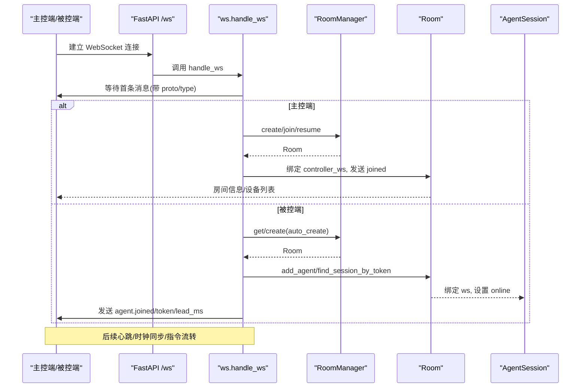
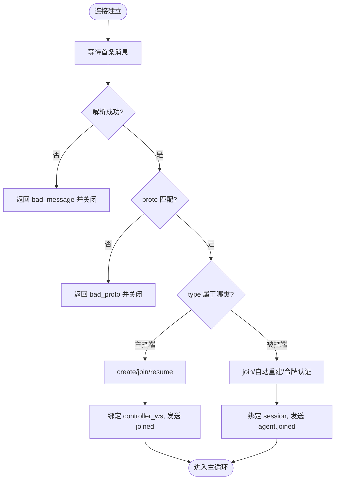
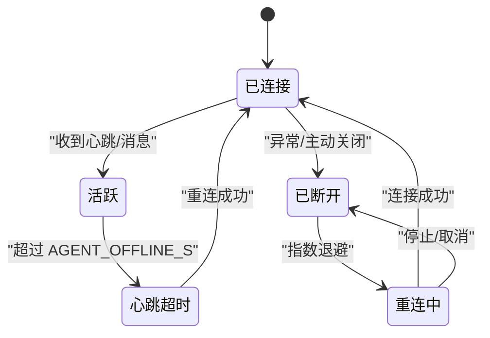
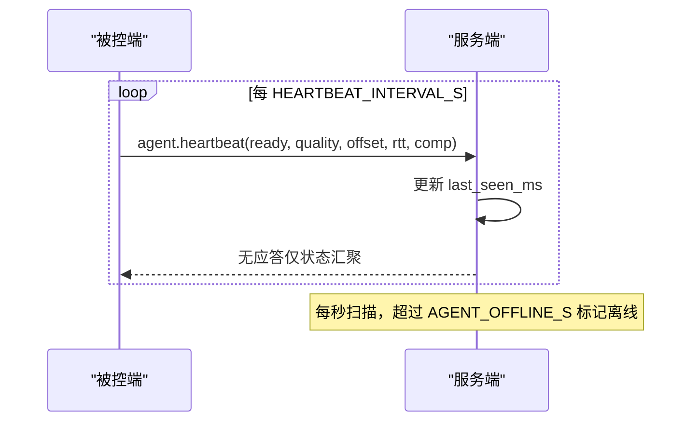
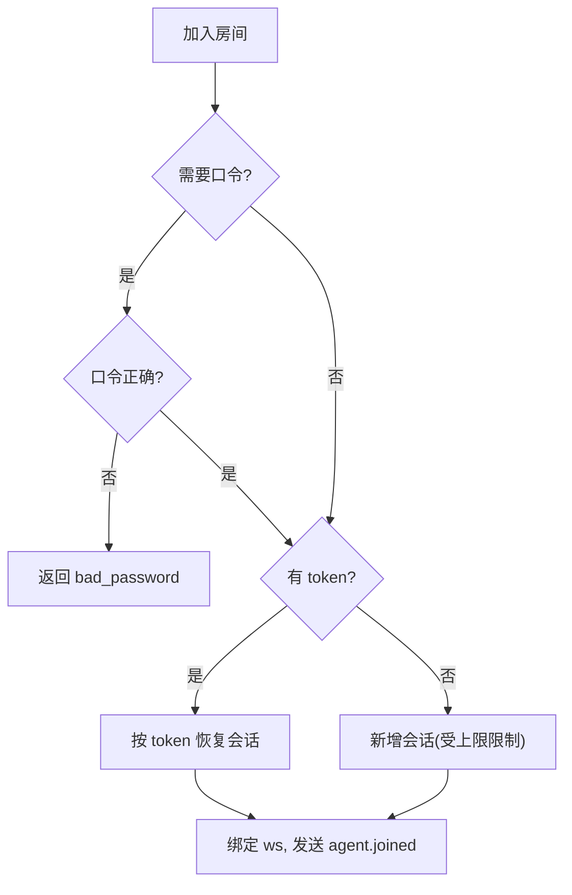
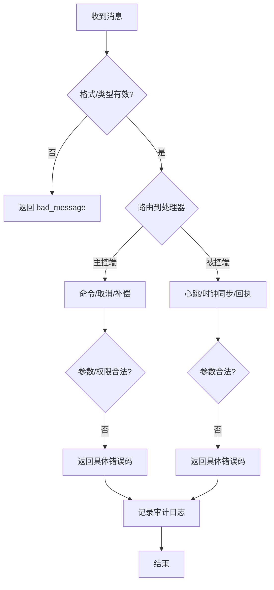
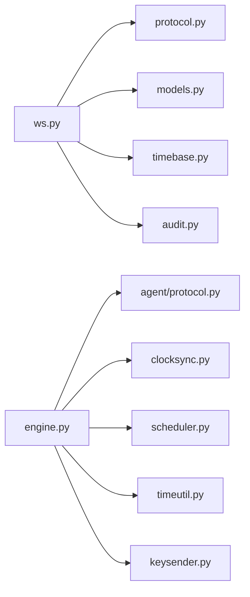

# 连接管理

<cite>
**本文引用的文件**
- [server/server/ws.py](file://server/server/ws.py)
- [server/server/protocol.py](file://server/server/protocol.py)
- [agent/agent/protocol.py](file://agent/agent/protocol.py)
- [server/server/main.py](file://server/server/main.py)
- [server/server/models.py](file://server/server/models.py)
- [agent/agent/engine.py](file://agent/agent/engine.py)
- [agent/agent/clocksync.py](file://agent/agent/clocksync.py)
- [README.md](file://README.md)
</cite>

## 目录
1. [简介](#简介)
2. [项目结构](#项目结构)
3. [核心组件](#核心组件)
4. [架构总览](#架构总览)
5. [详细组件分析](#详细组件分析)
6. [依赖关系分析](#依赖关系分析)
7. [性能考量](#性能考量)
8. [故障排查指南](#故障排查指南)
9. [结论](#结论)
10. [附录](#附录)

## 简介
本文件为 ScriptCue WebSocket 连接管理系统的权威技术文档，聚焦以下目标：
- 描述 WebSocket 连接的建立流程：握手验证、角色识别（主控端/被控端）、会话初始化。
- 说明连接生命周期管理：连接超时处理、异常断开恢复、连接池维护（房间与会话）。
- 解释心跳保活机制：心跳检测间隔、超时判定、自动重连策略。
- 阐述连接安全机制：协议版本验证、房间访问控制、令牌认证。
- 提供连接状态图与错误处理流程图，便于快速定位问题。

## 项目结构
本项目由服务端、主控端与被控端三部分组成。WebSocket 连接管理主要位于服务端 ws 模块，配合房间模型与协议常量；被控端通过引擎模块实现连接生命周期、时钟同步与心跳上报。

```mermaid
graph TB
subgraph "服务端"
A["FastAPI 应用<br/>main.py"]
B["WebSocket 处理器<br/>ws.py"]
C["房间与会话模型<br/>models.py"]
D["协议常量<br/>protocol.py"]
end
subgraph "被控端"
E["AgentEngine<br/>engine.py"]
F["时钟同步<br/>clocksync.py"]
G["协议常量副本<br/>protocol.py"]
end
A --> B
B --> C
B --> D
E --> F
E --> G
B < --> E
```

图表来源
- [server/server/main.py:75-91](file://server/server/main.py#L75-L91)
- [server/server/ws.py:334-360](file://server/server/ws.py#L334-L360)
- [server/server/models.py:64-157](file://server/server/models.py#L64-L157)
- [server/server/protocol.py:1-80](file://server/server/protocol.py#L1-L80)
- [agent/agent/engine.py:106-158](file://agent/agent/engine.py#L106-L158)
- [agent/agent/clocksync.py:29-106](file://agent/agent/clocksync.py#L29-L106)
- [agent/agent/protocol.py:1-80](file://agent/agent/protocol.py#L1-L80)

章节来源
- [README.md:16-28](file://README.md#L16-L28)
- [server/server/main.py:75-91](file://server/server/main.py#L75-L91)

## 核心组件
- WebSocket 入口与路由：FastAPI 在 /ws 暴露端点，统一接入 ws.handle_ws。
- 角色识别与会话：首条消息声明类型，区分主控端与会话创建/加入/恢复，或被控端加入。
- 房间与会话模型：RoomManager 负责房间创建、查找、空闲销毁；Room 管理控制器与会话集合；AgentSession 维护单设备会话状态。
- 协议常量：定义消息类型、错误码、限制参数（如心跳间隔、离线阈值、指令回执窗口等）。
- 被控端引擎：负责连接生命周期、指数退避重连、时钟同步、心跳上报、绝对时刻调度与回执。

章节来源
- [server/server/ws.py:15-27](file://server/server/ws.py#L15-L27)
- [server/server/models.py:17-157](file://server/server/models.py#L17-L157)
- [server/server/protocol.py:1-80](file://server/server/protocol.py#L1-L80)
- [agent/agent/engine.py:31-158](file://agent/agent/engine.py#L31-L158)

## 架构总览
下图展示从客户端连接到服务端处理的端到端流程，包括握手、角色识别、房间与会话绑定、心跳与状态推送。



图表来源
- [server/server/main.py:88-91](file://server/server/main.py#L88-L91)
- [server/server/ws.py:334-360](file://server/server/ws.py#L334-L360)
- [server/server/models.py:64-157](file://server/server/models.py#L64-L157)

## 详细组件分析

### 连接建立与角色识别
- 握手与协议版本校验：服务端接受连接后，等待首条 JSON 消息并校验 proto 字段是否匹配 PROTO_VERSION，不匹配则返回错误并关闭。
- 角色识别：
  - 主控端：type 为 controller.create/controller.join/controller.resume，分别对应创建房间、加入房间、恢复会话。
  - 被控端：type 为 agent.join，携带 room_code、nickname、可选 password/token/auto_create。
- 会话初始化：
  - 主控端：若存在旧控制器连接则顶替；返回房间信息与 token，供后续恢复使用。
  - 被控端：根据 token 或密码加入房间，分配 session_id 与 token，返回 lead_ms、compensation_ms 等。



图表来源
- [server/server/ws.py:334-360](file://server/server/ws.py#L334-L360)
- [server/server/ws.py:154-208](file://server/server/ws.py#L154-L208)
- [server/server/ws.py:246-328](file://server/server/ws.py#L246-L328)
- [server/server/protocol.py:1-80](file://server/server/protocol.py#L1-L80)

章节来源
- [server/server/ws.py:334-360](file://server/server/ws.py#L334-L360)
- [server/server/ws.py:154-208](file://server/server/ws.py#L154-L208)
- [server/server/ws.py:246-328](file://server/server/ws.py#L246-L328)

### 连接生命周期管理
- 连接超时：首条消息接收设置超时时间，超时或断线直接退出。
- 异常断开恢复：
  - 服务端：捕获 WebSocketDisconnect，清理控制器与会话引用，记录审计日志。
  - 被控端：引擎 run 循环捕获异常，触发指数退避重连；连接断开后重置状态并回调事件。
- 连接池维护（房间与会话）：
  - 房间空闲销毁：后台任务每分钟扫描，超过 TTL 的空闲房间自动销毁。
  - 设备离线标记：后台任务每秒扫描，心跳超时（连续未响应）的设备标记离线并通知主控端。
  - 会话保留：断线后会话仍保留，凭 token 可恢复；新连接会顶替旧连接。



图表来源
- [server/server/main.py:40-61](file://server/server/main.py#L40-L61)
- [server/server/ws.py:202-208](file://server/server/ws.py#L202-L208)
- [server/server/ws.py:320-328](file://server/server/ws.py#L320-L328)
- [agent/agent/engine.py:106-128](file://agent/agent/engine.py#L106-L128)

章节来源
- [server/server/main.py:40-61](file://server/server/main.py#L40-L61)
- [server/server/ws.py:202-208](file://server/server/ws.py#L202-L208)
- [server/server/ws.py:320-328](file://server/server/ws.py#L320-L328)
- [agent/agent/engine.py:106-128](file://agent/agent/engine.py#L106-L128)

### 心跳保活机制
- 心跳间隔：被控端每 HEARTBEAT_INTERVAL_S 秒发送一次心跳，包含就绪状态、时钟质量、偏移、RTT、补偿值等。
- 超时判定：服务端每秒检查，若 last_seen_ms 超过 AGENT_OFFLINE_S 秒未更新，则标记离线并通知主控端。
- 自动重连策略：被控端在连接失败后按指数退避（上限固定）重试，避免雪崩。
- 即时补发：当状态变化（如 ready 切换）时立即补发一次心跳，确保主控端尽快感知。



图表来源
- [agent/agent/engine.py:217-242](file://agent/agent/engine.py#L217-L242)
- [server/server/protocol.py:75-80](file://server/server/protocol.py#L75-L80)
- [server/server/main.py:40-52](file://server/server/main.py#L40-L52)

章节来源
- [agent/agent/engine.py:217-242](file://agent/agent/engine.py#L217-L242)
- [server/server/protocol.py:75-80](file://server/server/protocol.py#L75-L80)
- [server/server/main.py:40-52](file://server/server/main.py#L40-L52)

### 连接安全机制
- 协议版本验证：首条消息必须包含匹配的 proto 版本，否则拒绝。
- 房间访问控制：
  - 主控端 join/resume 需房间口令或 token 校验。
  - 被控端 join 支持口令校验；服务器重启后可通过 auto_create 重建房间。
- 令牌认证：
  - 被控端首次加入获得 token，后续重连可用 token 恢复会话。
  - 主控端 resume 使用 controller_token 恢复会话。
- 设备上限：房间最大设备数受限制，超出时报错。



图表来源
- [server/server/ws.py:154-208](file://server/server/ws.py#L154-L208)
- [server/server/ws.py:246-328](file://server/server/ws.py#L246-L328)
- [server/server/models.py:89-99](file://server/server/models.py#L89-L99)
- [server/server/protocol.py:57-71](file://server/server/protocol.py#L57-L71)

章节来源
- [server/server/ws.py:154-208](file://server/server/ws.py#L154-L208)
- [server/server/ws.py:246-328](file://server/server/ws.py#L246-L328)
- [server/server/models.py:89-99](file://server/server/models.py#L89-L99)
- [server/server/protocol.py:57-71](file://server/server/protocol.py#L57-L71)

### 错误处理流程
- 首条消息非法：返回 bad_message。
- 协议版本不匹配：返回 bad_proto。
- 房间不存在：返回 room_not_found；被控端可启用 auto_create 重建。
- 口令错误：返回 bad_password。
- 房间已满：返回 room_full。
- 未知指令/消息类型：返回 bad_command/bad_message。
- 设备不存在：返回 no_such_agent。



图表来源
- [server/server/ws.py:37-60](file://server/server/ws.py#L37-L60)
- [server/server/ws.py:67-152](file://server/server/ws.py#L67-L152)
- [server/server/ws.py:214-328](file://server/server/ws.py#L214-L328)
- [server/server/protocol.py:57-66](file://server/server/protocol.py#L57-L66)

章节来源
- [server/server/ws.py:37-60](file://server/server/ws.py#L37-L60)
- [server/server/ws.py:67-152](file://server/server/ws.py#L67-L152)
- [server/server/ws.py:214-328](file://server/server/ws.py#L214-L328)
- [server/server/protocol.py:57-66](file://server/server/protocol.py#L57-L66)

## 依赖关系分析
- 服务端 ws 模块依赖：
  - protocol 常量：消息类型、错误码、限制参数。
  - models 房间与会话：房间创建、成员管理、广播、通知。
  - timebase 时间基准：用于时间戳计算。
  - audit 审计日志：记录关键操作。
- 被控端 engine 依赖：
  - protocol 常量副本：与服务端保持一致。
  - clocksync 时钟同步：NTP 风格采样与估算。
  - scheduler/timeutil：高精度定时与本地时间。
  - keysender：执行动作（按键注入），与引擎解耦。



图表来源
- [server/server/ws.py:15-19](file://server/server/ws.py#L15-L19)
- [agent/agent/engine.py:17-23](file://agent/agent/engine.py#L17-L23)

章节来源
- [server/server/ws.py:15-19](file://server/server/ws.py#L15-L19)
- [agent/agent/engine.py:17-23](file://agent/agent/engine.py#L17-L23)

## 性能考量
- 心跳节流与状态推送：服务端对状态推送有节流间隔，避免频繁广播造成负载。
- 指令回执窗口：服务端在指令到期后等待回执的窗口有限，超时清理待执行记录，防止内存泄漏。
- 房间空闲销毁：长时间无活动的房间自动回收，降低内存占用。
- 设备离线判定：基于心跳间隔与超时阈值，及时释放资源并通知主控端。
- 被控端重连退避：指数退避减少瞬时重连风暴，提升系统稳定性。

章节来源
- [server/server/protocol.py:67-80](file://server/server/protocol.py#L67-L80)
- [server/server/main.py:40-61](file://server/server/main.py#L40-L61)
- [agent/agent/engine.py:106-128](file://agent/agent/engine.py#L106-L128)

## 故障排查指南
- 无法建立连接：
  - 检查首条消息是否为 JSON 对象且 proto 匹配。
  - 确认 /ws 端点可达，网络延迟与防火墙配置正常。
- 加入房间失败：
  - 房间不存在：被控端可启用 auto_create；主控端检查口令。
  - 口令错误：核对房间口令。
  - 房间已满：减少设备数量或扩容。
- 设备显示离线：
  - 检查被控端心跳是否正常发送。
  - 查看 last_seen_ms 是否持续未更新。
- 指令未执行：
  - 检查时钟同步是否完成（quality 非 none）。
  - 确认 lead_ms 足够大以覆盖网络抖动。
  - 查看回执是否在 RECEIPT_TIMEOUT_MS 内到达。

章节来源
- [server/server/ws.py:334-360](file://server/server/ws.py#L334-L360)
- [server/server/ws.py:246-328](file://server/server/ws.py#L246-L328)
- [server/server/main.py:40-52](file://server/server/main.py#L40-L52)
- [agent/agent/engine.py:297-379](file://agent/agent/engine.py#L297-L379)

## 结论
ScriptCue 的连接管理系统通过统一的 WebSocket 入口、严格的协议版本校验、房间与会话模型以及健壮的心跳与重连机制，实现了高可靠的多设备同步控制。其设计将“同步引擎”与“执行动作”解耦，既保证了精度又提升了可维护性。建议在生产环境中合理配置心跳间隔、离线阈值与指令提前量，并结合审计日志进行监控与排障。

## 附录
- 环境变量与默认值：
  - SC_DEFAULT_LEAD_MS：指令默认提前量（毫秒）。
  - SC_LOG_LEVEL：日志级别。
  - SC_DATA_DIR：审计日志目录。
  - SC_CONTROLLER_DIR：主控端静态目录。
- 健康检查：
  - /healthz 返回服务状态、协议版本、房间数量等。

章节来源
- [server/server/main.py:6-10](file://server/server/main.py#L6-L10)
- [server/server/main.py:78-85](file://server/server/main.py#L78-L85)
- [README.md:34-55](file://README.md#L34-L55)