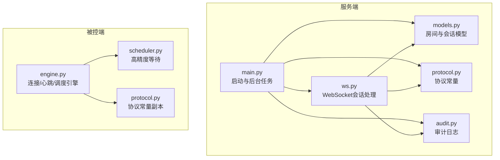
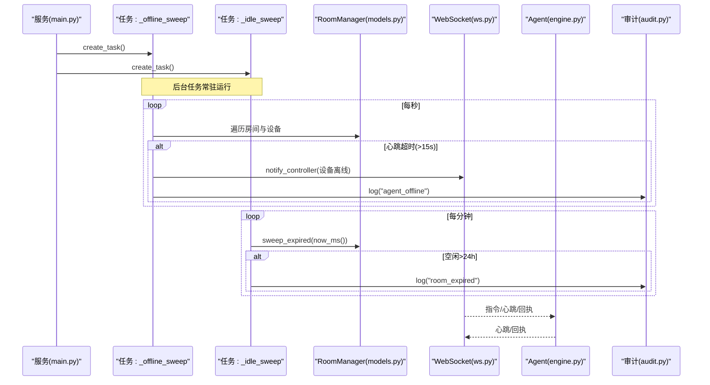
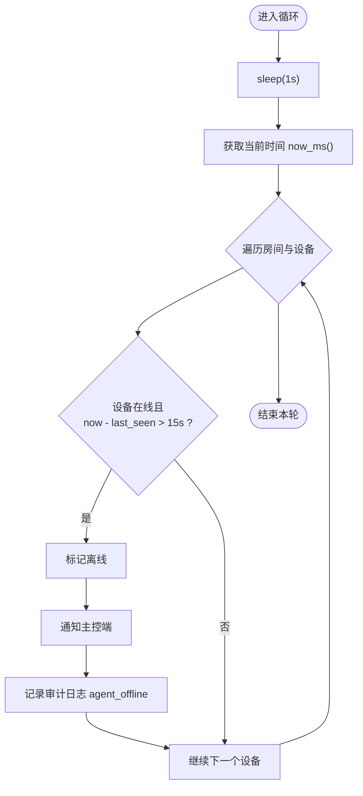
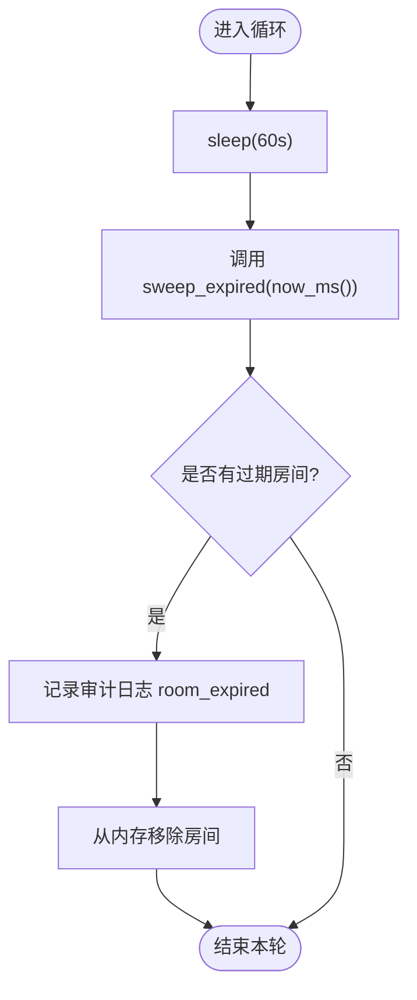
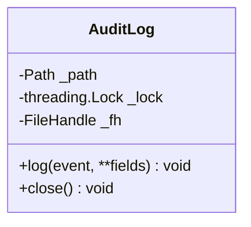
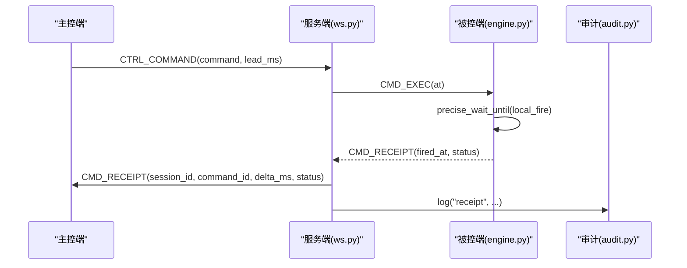
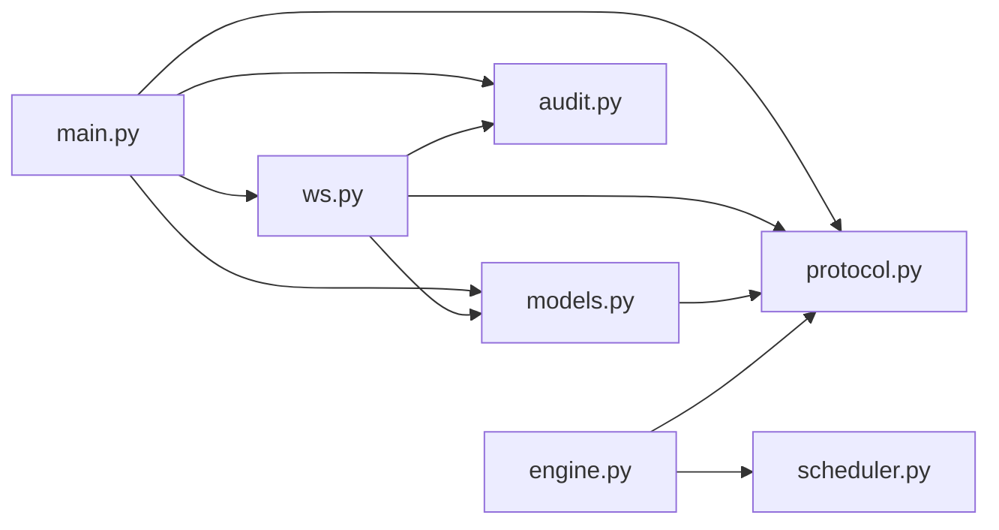

# 后台任务调度

<cite>
**本文引用的文件**
- [server/main.py](file://server/server/main.py)
- [server/ws.py](file://server/server/ws.py)
- [server/models.py](file://server/server/models.py)
- [server/protocol.py](file://server/server/protocol.py)
- [server/audit.py](file://server/server/audit.py)
- [agent/engine.py](file://agent/agent/engine.py)
- [agent/scheduler.py](file://agent/agent/scheduler.py)
- [agent/protocol.py](file://agent/agent/protocol.py)
- [README.md](file://README.md)
</cite>

## 目录
1. [简介](#简介)
2. [项目结构](#项目结构)
3. [核心组件](#核心组件)
4. [架构总览](#架构总览)
5. [详细组件分析](#详细组件分析)
6. [依赖关系分析](#依赖关系分析)
7. [性能考量](#性能考量)
8. [故障排查指南](#故障排查指南)
9. [结论](#结论)
10. [附录](#附录)

## 简介
本技术文档聚焦 ScriptCue 的后台任务调度系统，重点说明服务端两个关键后台任务：
- _offline_sweep：心跳超时检测与自动离线标记（3次未响应即离线）
- _idle_sweep：空闲房间清理（超过24小时无活跃则销毁）

同时覆盖 asyncio 任务生命周期管理、审计日志记录机制与持久化策略，并给出任务调度时序图与异常处理流程。

## 项目结构
本项目由三部分组成：
- 服务端（FastAPI + WebSocket）：负责房间与会话管理、指令调度、状态汇聚、审计日志
- 主控端（网页）：导控人员操作界面
- 被控端（Python）：高精度定时触发与心跳上报



图表来源
- [server/main.py:40-72](file://server/server/main.py#L40-L72)
- [server/ws.py:154-360](file://server/server/ws.py#L154-L360)
- [server/models.py:17-157](file://server/server/models.py#L17-L157)
- [server/protocol.py:67-79](file://server/server/protocol.py#L67-L79)
- [server/audit.py:17-37](file://server/server/audit.py#L17-L37)
- [agent/engine.py:106-158](file://agent/agent/engine.py#L106-L158)
- [agent/scheduler.py:33-59](file://agent/agent/scheduler.py#L33-L59)
- [agent/protocol.py:68-79](file://agent/agent/protocol.py#L68-L79)

章节来源
- [README.md:16-27](file://README.md#L16-L27)

## 核心组件
- 后台任务
  - _offline_sweep：每秒扫描所有房间内的设备，若某设备在线且距上次心跳时间超过阈值（AGENT_OFFLINE_S=15秒，约等于3次心跳间隔），则标记为离线，通知主控端，并记录审计日志
  - _idle_sweep：每分钟扫描房间，若房间处于空闲（无主控且无在线设备）且超过24小时，则销毁房间，并记录审计日志
- WebSocket 会话处理
  - 主控端与会话：创建/加入/恢复房间，下发指令、取消指令、设置补偿值
  - 被控端与会话：加入房间、心跳上报、时钟同步、回执上报
- 房间与会话模型
  - Room：维护成员、待执行指令、空闲判定、广播与通知
  - AgentSession：设备会话状态、发送消息、在线/就绪/时钟质量等
- 审计日志
  - AuditLog：JSON Lines 格式，线程安全追加写，进程退出时关闭文件句柄
- 高精度调度
  - precise_wait_until：粗睡眠+末段自旋，保证亚毫秒级到点精度

章节来源
- [server/main.py:40-72](file://server/server/main.py#L40-L72)
- [server/ws.py:67-208](file://server/server/ws.py#L67-L208)
- [server/ws.py:214-328](file://server/server/ws.py#L214-L328)
- [server/models.py:17-157](file://server/server/models.py#L17-L157)
- [server/protocol.py:67-79](file://server/server/protocol.py#L67-L79)
- [server/audit.py:17-37](file://server/server/audit.py#L17-L37)
- [agent/scheduler.py:33-59](file://agent/agent/scheduler.py#L33-L59)

## 架构总览
服务端通过 FastAPI lifespan 启动两个后台任务，分别负责心跳离线检测与空闲房间清理；WebSocket 通道承载主控端与被控端的实时交互；房间与会话数据驻内存，重启后由客户端自动重建；审计日志以 JSON Lines 形式落盘。



图表来源
- [server/main.py:40-72](file://server/server/main.py#L40-L72)
- [server/models.py:148-157](file://server/server/models.py#L148-L157)
- [server/ws.py:214-328](file://server/server/ws.py#L214-L328)
- [server/audit.py:24-37](file://server/server/audit.py#L24-L37)

## 详细组件分析

### _offline_sweep：心跳超时检测与自动离线标记
- 触发频率：每秒一次
- 检测逻辑：遍历所有房间的所有设备，若设备在线且距离 last_seen_ms 超过 AGENT_OFFLINE_S（15秒，约等于3次心跳间隔），则：
  - 将设备标记为离线
  - 通知主控端设备状态变更
  - 记录审计日志 agent_offline
- 相关常量：HEARTBEAT_INTERVAL_S=5秒，AGENT_OFFLINE_S=15秒（约3次心跳）



图表来源
- [server/main.py:40-52](file://server/server/main.py#L40-L52)
- [server/protocol.py:75-79](file://server/server/protocol.py#L75-L79)

章节来源
- [server/main.py:40-52](file://server/server/main.py#L40-L52)
- [server/protocol.py:75-79](file://server/server/protocol.py#L75-L79)

### _idle_sweep：空闲清理与房间销毁
- 触发频率：每分钟一次
- 空闲判定：房间无主控连接且无在线设备
- 销毁条件：空闲持续时间超过 ROOM_IDLE_TTL_S（24小时）
- 动作：从内存中移除房间，记录审计日志 room_expired



图表来源
- [server/main.py:54-61](file://server/server/main.py#L54-L61)
- [server/models.py:80-88](file://server/server/models.py#L80-L88)
- [server/models.py:148-157](file://server/server/models.py#L148-L157)
- [server/protocol.py:71](file://server/server/protocol.py#L71)

章节来源
- [server/main.py:54-61](file://server/server/main.py#L54-L61)
- [server/models.py:80-88](file://server/server/models.py#L80-L88)
- [server/models.py:148-157](file://server/server/models.py#L148-L157)
- [server/protocol.py:71](file://server/server/protocol.py#L71)

### asyncio 任务生命周期管理
- 任务创建：在 FastAPI lifespan 中通过 asyncio.create_task 启动 _offline_sweep 与 _idle_sweep
- 监控：任务为无限循环，内部使用 await asyncio.sleep 实现周期性检查
- 优雅关闭：应用退出时 cancel 任务并 await 其完成，确保资源释放；同时关闭审计日志文件句柄

```mermaid
sequenceDiagram
participant App as "FastAPI(app)"
participant LS as "lifespan"
participant T1 as "_offline_sweep"
participant T2 as "_idle_sweep"
participant Aud as "AuditLog"
App->>LS : 启动
LS->>T1 : create_task()
LS->>T2 : create_task()
Note over T1,T2 : 后台任务开始运行
App-->>LS : 关闭信号
LS->>T1 : cancel()
LS->>T2 : cancel()
LS->>Aud : close()
Note over T1,T2,Aud : 等待任务取消并完成清理
```

图表来源
- [server/main.py:63-72](file://server/server/main.py#L63-L72)
- [server/audit.py:34-37](file://server/server/audit.py#L34-L37)

章节来源
- [server/main.py:63-72](file://server/server/main.py#L63-L72)
- [server/audit.py:34-37](file://server/server/audit.py#L34-L37)

### 审计日志记录机制与持久化策略
- 写入格式：JSON Lines，每行一条记录，包含时间戳、事件类型及扩展字段
- 并发安全：使用 threading.Lock 保护文件写入，避免多协程/线程竞争
- 持久化：直接同步追加写并 flush，保证落盘；异常时记录日志但不中断主流程
- 关闭策略：应用退出时显式关闭文件句柄，避免资源泄漏



图表来源
- [server/audit.py:17-37](file://server/server/audit.py#L17-L37)

章节来源
- [server/audit.py:17-37](file://server/server/audit.py#L17-L37)

### 被控端心跳与回执链路（与服务器联动）
- 心跳：被控端每 HEARTBEAT_INTERVAL_S（5秒）发送心跳，携带就绪状态、时钟质量、偏移与往返延迟等
- 回执：被控端在精确时刻触发后，计算 fired_at（换算为服务器时间）并上报回执，服务器转发给主控端并记录审计日志
- 超时与清理：服务器对已下发指令维护 pending_commands，到期后等待回执窗口 RECEIPT_TIMEOUT_MS（8秒），超时清理



图表来源
- [server/ws.py:67-115](file://server/server/ws.py#L67-L115)
- [server/ws.py:228-244](file://server/server/ws.py#L228-L244)
- [agent/engine.py:297-379](file://agent/agent/engine.py#L297-L379)
- [agent/scheduler.py:33-59](file://agent/agent/scheduler.py#L33-L59)

章节来源
- [server/ws.py:67-115](file://server/server/ws.py#L67-L115)
- [server/ws.py:228-244](file://server/server/ws.py#L228-L244)
- [agent/engine.py:297-379](file://agent/agent/engine.py#L297-L379)
- [agent/scheduler.py:33-59](file://agent/agent/scheduler.py#L33-L59)

### 异常处理流程
- 心跳超时：_offline_sweep 检测到超时后将设备标记离线并通知主控端，便于前端展示与告警
- 房间空闲：_idle_sweep 定期清理长时间空闲的房间，释放内存资源
- 指令回执超时：服务器在指令到期后等待回执窗口，超时清理 pending 记录，避免内存泄漏
- WebSocket 断开：会话 finally 块中清理 ws 引用、标记离线、通知主控端并记录审计日志
- 审计日志写入失败：捕获 OSError 并记录异常日志，不影响主流程

章节来源
- [server/main.py:40-61](file://server/server/main.py#L40-L61)
- [server/ws.py:202-208](file://server/ws.py#L202-L208)
- [server/ws.py:320-328](file://server/ws.py#L320-L328)
- [server/audit.py:24-32](file://server/audit.py#L24-L32)

## 依赖关系分析
- 模块耦合
  - main.py 依赖 models.py、protocol.py、audit.py、ws.py
  - ws.py 依赖 protocol.py、models.py、audit.py、timebase
  - models.py 依赖 protocol.py、timebase
  - audit.py 依赖 timebase
  - engine.py 依赖 scheduler.py、protocol.py、timeutil
- 外部依赖
  - FastAPI/Starlette：WS 接入与异步框架
  - websockets：被控端与服务端通信
  - 操作系统定时器（Windows）：提升 sleep 精度



图表来源
- [server/main.py:22-26](file://server/server/main.py#L22-L26)
- [server/ws.py:15-18](file://server/server/ws.py#L15-L18)
- [server/models.py:9-10](file://server/server/models.py#L9-L10)
- [agent/engine.py:19-23](file://agent/agent/engine.py#L19-L23)

章节来源
- [server/main.py:22-26](file://server/server/main.py#L22-L26)
- [server/ws.py:15-18](file://server/server/ws.py#L15-L18)
- [server/models.py:9-10](file://server/server/models.py#L9-L10)
- [agent/engine.py:19-23](file://agent/agent/engine.py#L19-L23)

## 性能考量
- 心跳与离线检测
  - 每秒扫描房间与设备，复杂度 O(R*A)，R 为房间数，A 为设备数；建议控制房间规模与设备数量
  - 使用 now_ms() 统一时间基准，减少时间漂移影响
- 空闲清理
  - 每分钟扫描，复杂度 O(R)；房间空闲判定仅检查主控与在线设备标志，开销低
- 指令回执清理
  - 基于 at + RECEIPT_TIMEOUT_MS 的延时清理，避免频繁轮询
- 高精度调度
  - 被控端采用“粗睡眠 + 末段自旋”策略，降低 CPU 占用同时保证到点精度
  - Windows 下提升系统定时器分辨率，改善 sleep 精度

[本节为通用性能讨论，不直接分析具体代码文件]

## 故障排查指南
- 设备频繁离线
  - 检查被控端心跳是否正常发送（HEARTBEAT_INTERVAL_S=5秒）
  - 确认网络延迟与丢包是否导致心跳丢失
  - 查看审计日志 agent_offline 事件定位问题设备
- 房间无法销毁
  - 确认房间是否仍有主控或在线设备
  - 检查 ROOM_IDLE_TTL_S（24小时）配置是否正确
- 指令未收到回执
  - 检查被控端时钟同步是否成功（clock_quality）
  - 查看回执超时窗口 RECEIPT_TIMEOUT_MS（8秒）是否足够
  - 审计日志 receipt 事件可辅助定位
- 审计日志写入失败
  - 检查磁盘权限与空间
  - 关注审计日志异常日志输出

章节来源
- [server/protocol.py:75-79](file://server/protocol.py#L75-L79)
- [server/audit.py:24-32](file://server/audit.py#L24-L32)
- [server/ws.py:228-244](file://server/ws.py#L228-L244)

## 结论
ScriptCue 的后台任务调度系统通过轻量级的 asyncio 任务实现了可靠的心跳离线检测与空闲房间清理，结合 WebSocket 实时通信与审计日志，形成了完整的运行时治理闭环。被控端的高精度调度确保了跨设备的同步触发能力。整体设计简洁高效，适合演出场景下的稳定运行。

[本节为总结性内容，不直接分析具体代码文件]

## 附录
- 关键常量参考
  - 心跳间隔：HEARTBEAT_INTERVAL_S = 5秒
  - 离线阈值：AGENT_OFFLINE_S = 15秒（约3次心跳）
  - 房间空闲 TTL：ROOM_IDLE_TTL_S = 24小时
  - 回执超时窗口：RECEIPT_TIMEOUT_MS = 8秒
  - 自旋阈值：SPIN_THRESHOLD_MS = 50毫秒

章节来源
- [server/protocol.py:71-79](file://server/server/protocol.py#L71-L79)
- [agent/protocol.py:68-79](file://agent/agent/protocol.py#L68-L79)