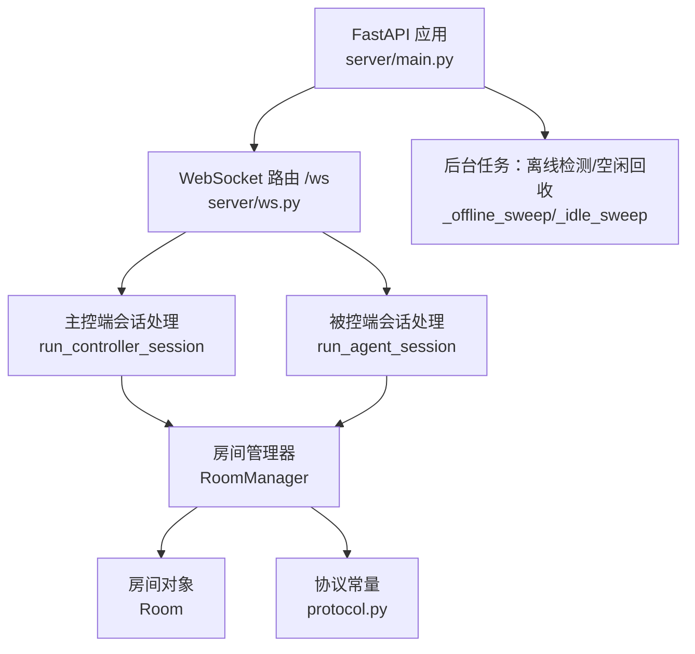
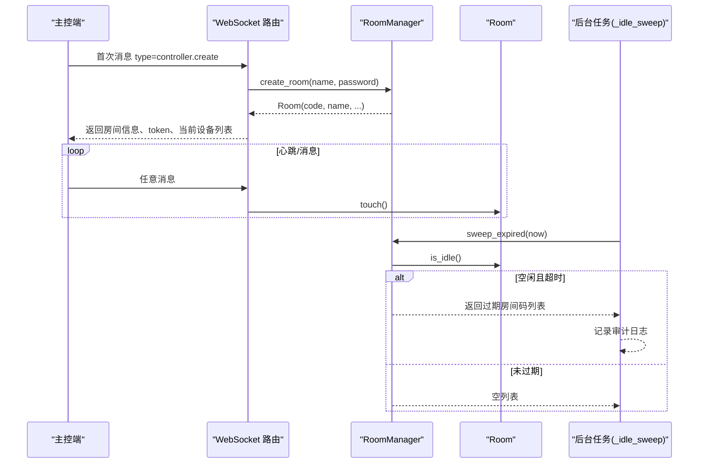
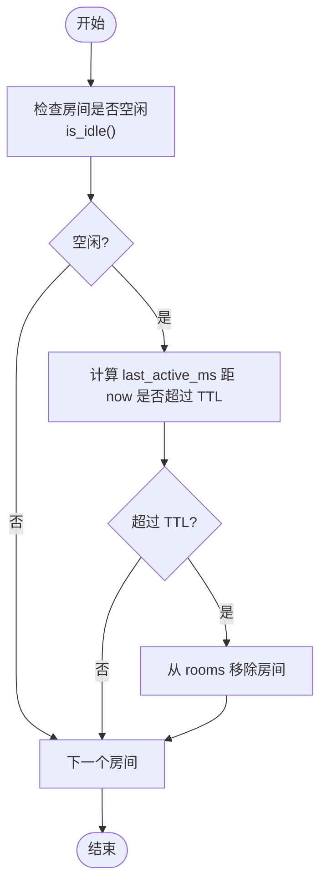
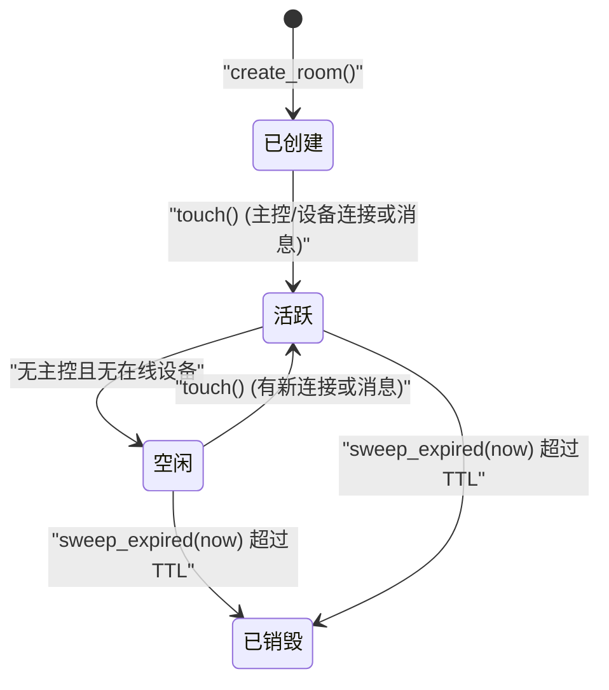
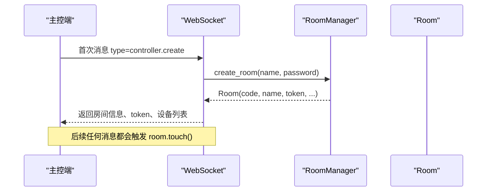
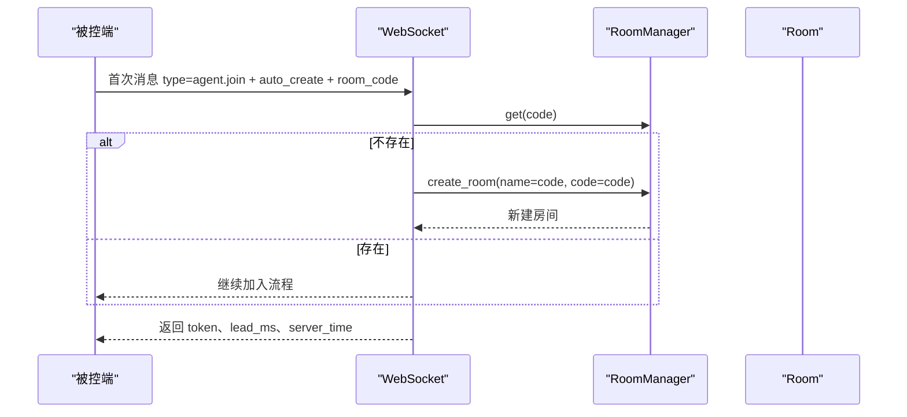
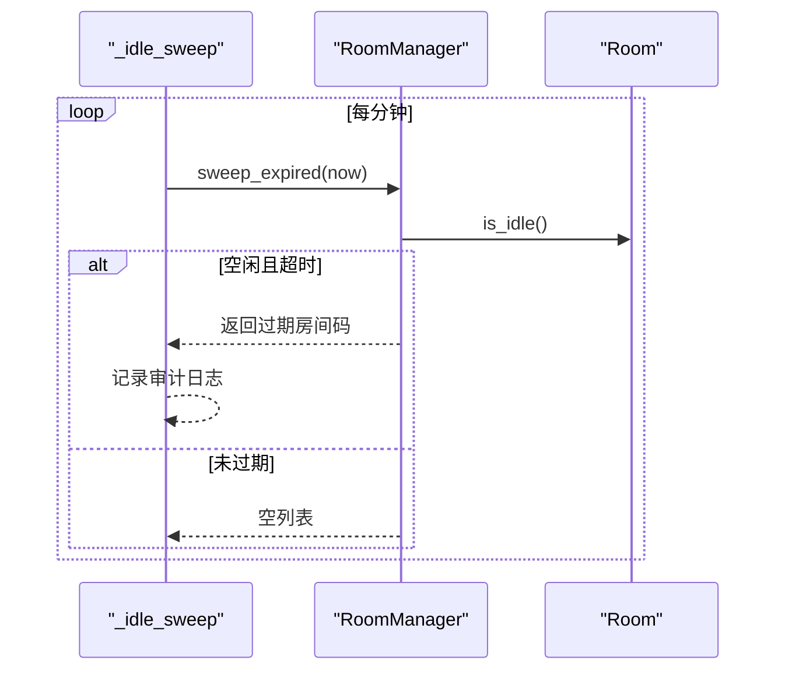
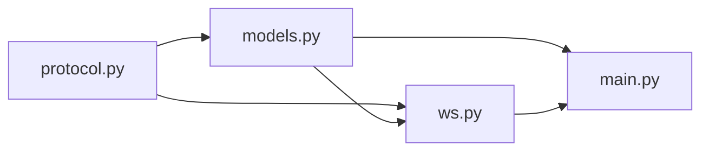

# 房间生命周期管理

<cite>
**本文引用的文件**
- [server/server/models.py](file://server/server/models.py)
- [server/server/ws.py](file://server/server/ws.py)
- [server/server/main.py](file://server/server/main.py)
- [server/server/protocol.py](file://server/server/protocol.py)
</cite>

## 目录
1. [简介](#简介)
2. [项目结构](#项目结构)
3. [核心组件](#核心组件)
4. [架构总览](#架构总览)
5. [详细组件分析](#详细组件分析)
6. [依赖关系分析](#依赖关系分析)
7. [性能考量](#性能考量)
8. [故障排查指南](#故障排查指南)
9. [结论](#结论)
10. [附录](#附录)

## 简介
本文件聚焦于 ScriptCue 服务端的“房间”生命周期管理，围绕 Room 与 RoomManager 的实现，系统阐述房间的创建、激活维护、空闲检测与销毁机制；解释房间码生成算法的随机性与冲突处理；说明房间状态字段的设计与更新时机；并总结并发安全与内存管理策略。文末提供房间状态转换图与典型使用场景的流程示意，帮助读者快速理解与服务端交互的关键路径。

## 项目结构
服务端以 FastAPI 为入口，WebSocket 路由统一接入 /ws，按首条消息类型分派到主控端或被控端会话处理流程。房间与会话模型在 models.py 中定义，协议常量在 protocol.py 中集中管理，main.py 启动后台任务进行心跳离线检测与房间空闲回收。

**图示来源**
- [server/server/main.py:63-72](file://server/server/main.py#L63-L72)
- [server/server/ws.py:154-208](file://server/server/ws.py#L154-L208)
- [server/server/ws.py:246-327](file://server/server/ws.py#L246-L327)
- [server/server/models.py:120-157](file://server/server/models.py#L120-L157)
- [server/server/protocol.py:67-79](file://server/server/protocol.py#L67-L79)

**章节来源**
- [server/server/main.py:1-98](file://server/server/main.py#L1-L98)
- [server/server/ws.py:1-360](file://server/server/ws.py#L1-L360)
- [server/server/models.py:1-157](file://server/server/models.py#L1-L157)
- [server/server/protocol.py:1-80](file://server/server/protocol.py#L1-L80)

## 核心组件
- Room：表示一个房间，包含房间标识、名称、口令、提前量、时间戳、控制器连接、设备会话集合、待执行指令队列等。
- AgentSession：表示一台被控设备的会话，包含在线状态、令牌、时钟质量、补偿值、最后可见时间、待回执指令等。
- RoomManager：房间容器与生命周期调度器，负责房间码生成、创建、查找、删除以及空闲过期清理。

关键职责划分：
- Room：封装房间级状态与广播能力，维护 last_active_ms 用于空闲判定。
- RoomManager：集中管理 rooms 字典，提供 create_room/get/remove/sweep_expired。
- ws：将 WebSocket 事件映射为对 Room/RoomManager 的操作，并在主控/被控会话中调用 touch 维持活跃。
- main：启动后台任务周期性扫描，触发空闲回收。

**章节来源**
- [server/server/models.py:17-118](file://server/server/models.py#L17-L118)
- [server/server/models.py:120-157](file://server/server/models.py#L120-L157)
- [server/server/ws.py:154-208](file://server/server/ws.py#L154-L208)
- [server/server/ws.py:246-327](file://server/server/ws.py#L246-L327)
- [server/server/main.py:40-61](file://server/server/main.py#L40-L61)

## 架构总览
房间的生命周期由以下阶段组成：
- 创建：通过主控端发送创建消息，RoomManager.create_room 生成或复用房间码，构造 Room 并加入 rooms。
- 激活：每次主控/被控连接建立或收到消息时调用 room.touch() 更新 last_active_ms。
- 运行：主控下发指令、被控上报心跳与回执，房间维护 pending_commands 与 agent 列表。
- 空闲检测：后台 _idle_sweep 每分钟检查一次，调用 RoomManager.sweep_expired(now) 销毁空闲超过阈值的房间。
- 销毁：从 rooms 移除房间引用，释放内存。

**图示来源**
- [server/server/ws.py:154-184](file://server/server/ws.py#L154-L184)
- [server/server/ws.py:187-208](file://server/server/ws.py#L187-L208)
- [server/server/models.py:131-140](file://server/server/models.py#L131-L140)
- [server/server/models.py:148-156](file://server/server/models.py#L148-L156)
- [server/server/main.py:54-61](file://server/server/main.py#L54-L61)

## 详细组件分析

### Room 类与状态字段
- code：房间唯一标识（大写），用于查找与恢复。
- name：房间显示名，默认回退到 code。
- password：可选口令，校验失败则拒绝加入。
- lead_ms：指令提前量（毫秒），可被单次命令覆盖但受范围限制。
- created_at_ms：房间创建时间（毫秒）。
- last_active_ms：最近活跃时间（毫秒），用于空闲判定。
- controller_ws/controller_token：主控端连接与令牌，支持重连接管。
- agents：设备会话字典，键为 session_id。
- pending_commands：房间级待执行指令缓存，键为 command_id。
- _agent_seq：设备序号自增，用于生成稳定 session_id。

更新时机：
- created_at_ms/last_active_ms：创建时初始化；touch() 时更新 last_active_ms。
- controller_ws/token：创建后分配 token；主控连接时绑定 ws；新连接顶替旧连接。
- agents：设备加入时添加；断线时置 online=False 并通知主控。
- pending_commands：指令调度时写入；回执或取消后清理。

并发与内存：
- Python 单进程内协程共享同一 Room 实例，读写通过 asyncio 协作式同步，无显式锁。
- 房间数据仅驻留内存，服务器重启丢失，客户端可通过 auto_create/code 重建。

**章节来源**
- [server/server/models.py:64-118](file://server/server/models.py#L64-L118)
- [server/server/ws.py:175-184](file://server/server/ws.py#L175-L184)
- [server/server/ws.py:276-287](file://server/server/ws.py#L276-L287)

### RoomManager：创建、查找、删除与回收
- create_room：若传入 code 则优先使用该码（用于重启恢复）；否则调用内部生成器产生不重复码；已存在则直接返回已有房间。
- get/remove：简单字典操作。
- sweep_expired：遍历 rooms，筛选 is_idle() 且 last_active_ms 距离 now 超过阈值（ROOM_IDLE_TTL_S*1000）的房间，删除并返回过期码列表。

房间码生成算法（_generate_code）：
- 字符集：去除易混淆字符（如 0/O/1/I/L）的字母数字组合。
- 长度：固定长度（例如 6）。
- 随机性：使用 random.choices 从字符集中采样。
- 冲突处理：循环生成直到不与现有房间码冲突为止。

注意：生产环境建议改用 secrets 模块提升密码学安全性；当前实现满足功能需求。

**章节来源**
- [server/server/models.py:124-140](file://server/server/models.py#L124-L140)
- [server/server/models.py:148-156](file://server/server/models.py#L148-L156)
- [server/server/protocol.py:67-73](file://server/server/protocol.py#L67-L73)

### 空闲检测与销毁流程
- 空闲判定：is_idle() 当没有主控连接且所有设备均 offline 时为真。
- 回收周期：_idle_sweep 每 60 秒执行一次，调用 sweep_expired(now)。
- 销毁动作：从 rooms 字典移除房间，释放引用；记录审计日志。

**图示来源**
- [server/server/models.py:83-87](file://server/server/models.py#L83-L87)
- [server/server/models.py:148-156](file://server/server/models.py#L148-L156)
- [server/server/main.py:54-61](file://server/server/main.py#L54-L61)

### 房间状态转换图

**图示来源**
- [server/server/models.py:80-87](file://server/server/models.py#L80-L87)
- [server/server/models.py:148-156](file://server/server/models.py#L148-L156)

### 典型使用场景与调用序列

#### 场景一：主控创建房间并加入

**图示来源**
- [server/server/ws.py:154-184](file://server/server/ws.py#L154-L184)
- [server/server/models.py:131-140](file://server/server/models.py#L131-L140)

#### 场景二：被控端自动恢复房间（服务器重启后）

**图示来源**
- [server/server/ws.py:246-287](file://server/server/ws.py#L246-L287)
- [server/server/models.py:131-140](file://server/server/models.py#L131-L140)

#### 场景三：空闲房间回收

**图示来源**
- [server/server/main.py:54-61](file://server/server/main.py#L54-L61)
- [server/server/models.py:148-156](file://server/server/models.py#L148-L156)

## 依赖关系分析
- models.py 依赖 protocol.py 中的常量（房间码字符集、长度、空闲 TTL、最大设备数、默认提前量等）。
- ws.py 依赖 models.py 的 Room/RoomManager 与 protocol.py 的消息类型与错误码。
- main.py 依赖 models.py 的 RoomManager 与 protocol.py 的心跳/离线阈值，并启动后台任务。

**图示来源**
- [server/server/protocol.py:67-79](file://server/server/protocol.py#L67-L79)
- [server/server/models.py:6-11](file://server/server/models.py#L6-L11)
- [server/server/ws.py:15-18](file://server/server/ws.py#L15-L18)
- [server/server/main.py:22-26](file://server/server/main.py#L22-L26)

**章节来源**
- [server/server/protocol.py:1-80](file://server/server/protocol.py#L1-L80)
- [server/server/models.py:1-157](file://server/server/models.py#L1-L157)
- [server/server/ws.py:1-360](file://server/server/ws.py#L1-L360)
- [server/server/main.py:1-98](file://server/server/main.py#L1-L98)

## 性能考量
- 空闲回收频率：每分钟一次，避免频繁扫描造成开销。
- 房间规模：每个房间最多容纳固定数量的设备（MAX_AGENTS_PER_ROOM），限制广播与状态聚合成本。
- 指令回执窗口：RECEIPT_TIMEOUT_MS 控制待执行记录的保留时长，避免长期占用内存。
- 心跳与离线：AGENT_OFFLINE_S 用于快速识别离线设备，减少无效推送。
- 内存策略：纯内存存储，房间销毁即释放；服务器重启后通过 auto_create/code 恢复。

[本节为通用指导，不直接分析具体代码行]

## 故障排查指南
- 房间不存在：检查是否已创建或是否已被回收；确认请求携带正确的 room_code。
- 口令错误：主控与被控侧需传入与房间一致的 password。
- 房间已满：达到 MAX_AGENTS_PER_ROOM 上限，需等待设备断开后再加入。
- 指令未生效：检查 lead_ms 是否在允许范围内；确认设备在线且已接收执行消息；关注回执窗口是否超时。
- 房间未回收：确认后台任务正常运行；核对 ROOM_IDLE_TTL_S 配置；检查 last_active_ms 是否被正常更新。

**章节来源**
- [server/server/ws.py:161-173](file://server/server/ws.py#L161-L173)
- [server/server/ws.py:262-274](file://server/server/ws.py#L262-L274)
- [server/server/models.py:89-95](file://server/server/models.py#L89-L95)
- [server/server/main.py:40-61](file://server/server/main.py#L40-L61)

## 结论
ScriptCue 的房间生命周期管理通过 Room/RoomManager 与后台任务协同完成，实现了简洁清晰的创建、活跃维护、空闲检测与销毁闭环。房间码生成具备基本随机性与冲突处理，适合一般场景；如需更高安全性，可替换为更严格的随机源。房间状态字段设计合理，配合 ws 层的 touch 机制确保空闲判定准确。整体采用纯内存存储，部署简单、资源占用可控，并通过 auto_create/code 支持服务器重启后的房间恢复。

[本节为总结性内容，不直接分析具体代码行]

## 附录

### 房间状态字段与作用速查
- code：房间唯一标识，用于查找与恢复。
- name：房间显示名，便于识别。
- password：可选口令，保护房间访问。
- lead_ms：指令提前量，影响执行时刻计算。
- created_at_ms：创建时间，用于审计与诊断。
- last_active_ms：最近活跃时间，驱动空闲回收。
- controller_ws/controller_token：主控连接与令牌，支持重连接管。
- agents：设备会话集合，承载在线状态与指令回执。
- pending_commands：房间级待执行指令缓存，辅助清理与审计。

**章节来源**
- [server/server/models.py:64-118](file://server/server/models.py#L64-L118)
- [server/server/protocol.py:67-79](file://server/server/protocol.py#L67-L79)