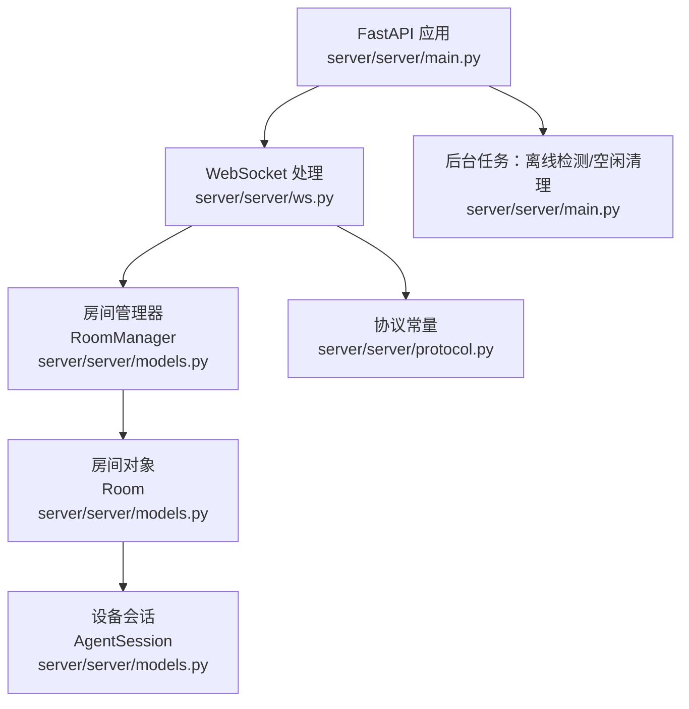
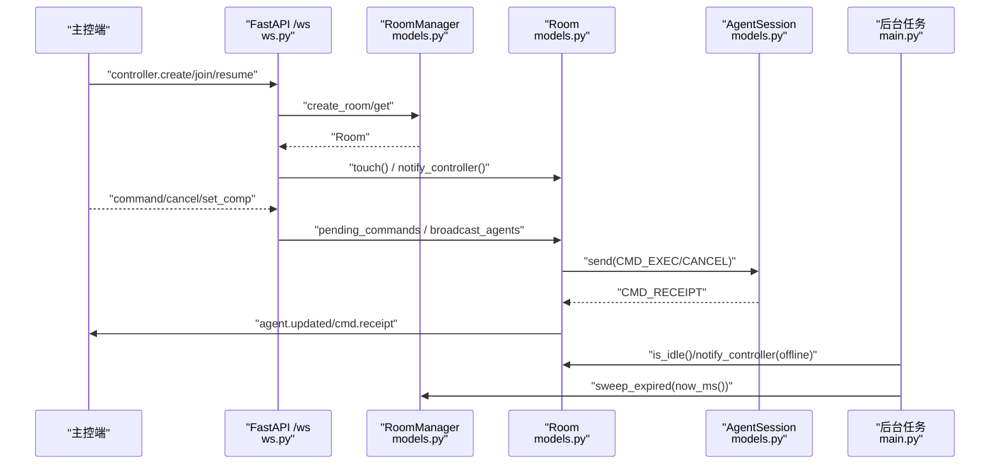
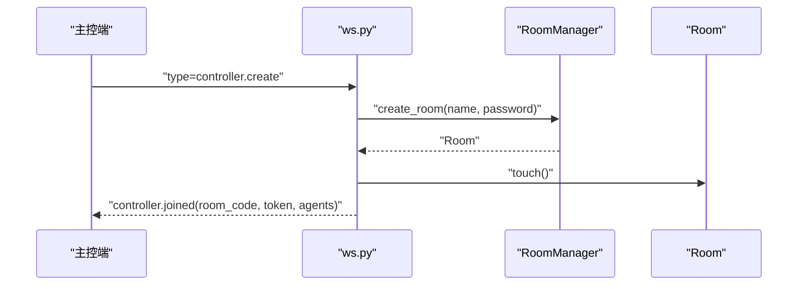
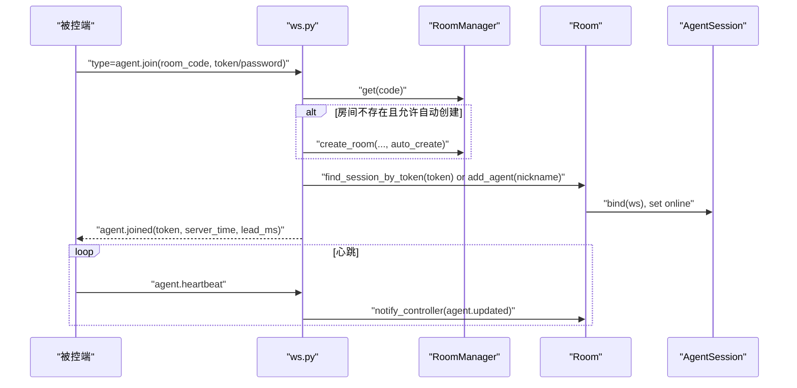
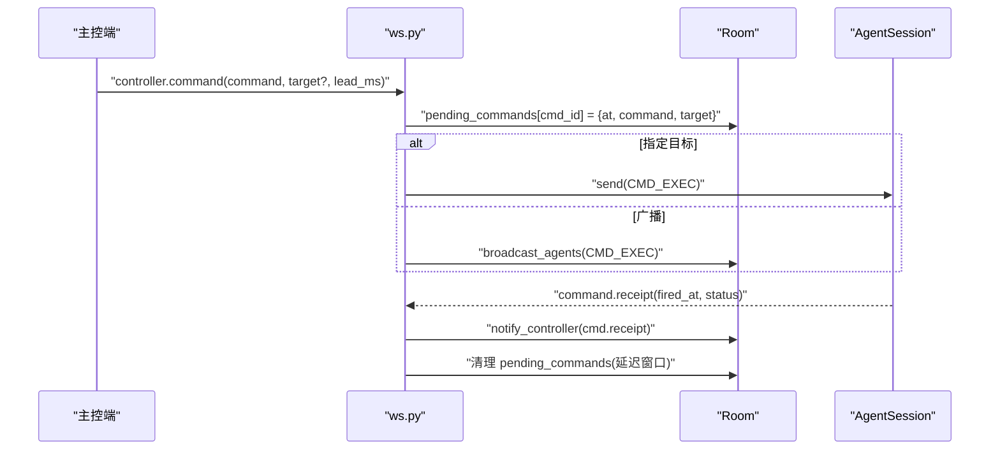
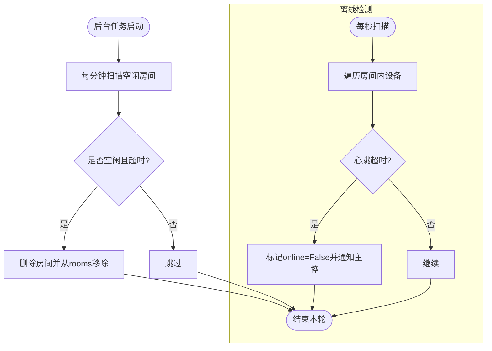
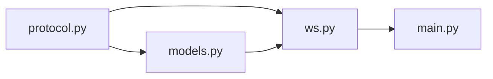

# 房间管理器核心

<cite>
**本文引用的文件**
- [server/server/models.py](file://server/server/models.py)
- [server/server/ws.py](file://server/server/ws.py)
- [server/server/main.py](file://server/server/main.py)
- [server/server/protocol.py](file://server/server/protocol.py)
</cite>

## 目录
1. [简介](#简介)
2. [项目结构](#项目结构)
3. [核心组件](#核心组件)
4. [架构总览](#架构总览)
5. [详细组件分析](#详细组件分析)
6. [依赖关系分析](#依赖关系分析)
7. [性能考量](#性能考量)
8. [故障排查指南](#故障排查指南)
9. [结论](#结论)
10. [附录](#附录)

## 简介
本章节聚焦 ScriptCue 服务端的“房间管理器”核心能力，围绕 RoomManager 类及其与 Room、AgentSession 的协作，系统阐述房间集合管理、房间生命周期、设备会话管理、控制器连接与通知、指令调度与回执、以及空闲清理等关键流程。文档同时提供架构图、时序图与流程图，帮助读者快速理解并掌握房间管理的实现要点与最佳实践。

## 项目结构
服务端以 FastAPI 应用为入口，通过 WebSocket 统一接入主控端与被控端；房间与会话模型在内存中维护，配合后台任务进行心跳离线检测与空闲房间清理。

**图表来源**
- [server/server/main.py:63-72](file://server/server/main.py#L63-L72)
- [server/server/ws.py:334-360](file://server/server/ws.py#L334-L360)
- [server/server/models.py:120-157](file://server/server/models.py#L120-L157)
- [server/server/protocol.py:67-79](file://server/server/protocol.py#L67-L79)

**章节来源**
- [server/server/main.py:1-98](file://server/server/main.py#L1-L98)
- [server/server/ws.py:1-360](file://server/server/ws.py#L1-L360)
- [server/server/models.py:1-157](file://server/server/models.py#L1-L157)
- [server/server/protocol.py:1-80](file://server/server/protocol.py#L1-L80)

## 核心组件
- RoomManager：房间集合的管理者，负责创建、查找、删除与批量清理过期房间。
- Room：房间实体，维护设备集合、待执行指令、控制器连接、活跃时间戳等。
- AgentSession：单台设备的会话，维护在线状态、时钟同步信息、补偿值、待回执指令等。
- ws 模块：WebSocket 会话路由与消息分发，协调主控端与被控端交互。
- protocol 常量：消息类型、错误码、限制参数（如房间容量、空闲 TTL、提前量范围等）。

**章节来源**
- [server/server/models.py:17-118](file://server/server/models.py#L17-L118)
- [server/server/models.py:120-157](file://server/server/models.py#L120-L157)
- [server/server/ws.py:67-208](file://server/server/ws.py#L67-L208)
- [server/server/ws.py:246-328](file://server/server/ws.py#L246-L328)
- [server/server/protocol.py:11-79](file://server/server/protocol.py#L11-L79)

## 架构总览
下图展示了房间管理器在整体系统中的位置与数据流向：主控端通过 WS 创建/加入房间，被控端加入房间后由 Room 广播指令；后台任务定期扫描离线与空闲房间。

**图表来源**
- [server/server/ws.py:154-208](file://server/server/ws.py#L154-L208)
- [server/server/ws.py:246-328](file://server/server/ws.py#L246-L328)
- [server/server/models.py:89-117](file://server/server/models.py#L89-L117)
- [server/server/models.py:120-157](file://server/server/models.py#L120-L157)
- [server/server/main.py:40-61](file://server/server/main.py#L40-L61)

## 详细组件分析

### RoomManager：房间集合管理
- rooms dict：以房间码为键的房间映射，支持 O(1) 查找与删除。
- create_room：生成或复用房间码，创建 Room 并注册到 rooms；支持指定 code 用于重启恢复。
- get：按房间码返回房间实例。
- remove：从 rooms 移除指定房间。
- sweep_expired：遍历 rooms，销毁空闲超过阈值的房间，返回被销毁的房间码列表。

并发与一致性：
- 当前实现未加锁，依赖 Python 事件循环的单线程特性保证基本原子性；在高并发写入场景下建议引入 asyncio.Lock 保护 rooms 字典的增删改。
- sweep_expired 使用列表推导式收集过期房间后再删除，避免迭代时修改字典引发异常。

**章节来源**
- [server/server/models.py:120-157](file://server/server/models.py#L120-L157)
- [server/server/main.py:54-61](file://server/server/main.py#L54-L61)

### Room：房间实体与设备关联
- 设备加入 add_agent：检查房间容量上限，分配唯一 session_id，创建 AgentSession 并加入 agents 字典。
- 会话查找 find_session_by_token：按 token 线性查找设备会话，用于断线重连与状态恢复。
- 广播机制 broadcast_agents：向所有在线设备发送消息，或定向发送给指定 session。
- 通知控制器 notify_controller：将状态变更推送给主控端连接。
- 状态查询 agent_states：聚合所有设备状态供主控端拉取。
- 活跃标记 touch：更新 last_active_ms，参与空闲判定。
- 空闲判定 is_idle：无控制器且无在线设备即视为空闲。

并发与一致性：
- 对 agents 字典的读写在同一事件循环中进行，通常安全；但高并发下仍建议用锁保护临界区。
- pending_commands 用于暂存待执行指令，配合回执清理，确保最终一致性。

**章节来源**
- [server/server/models.py:64-118](file://server/server/models.py#L64-L118)
- [server/server/ws.py:67-134](file://server/server/ws.py#L67-L134)
- [server/server/ws.py:246-328](file://server/server/ws.py#L246-L328)

### AgentSession：设备会话
- 绑定与在线状态：bind(ws) 设置 ws 与 online，更新 last_seen_ms。
- 状态快照 state：输出协议所需的 AgentState 字段。
- 发送 send：封装异步发送，失败时静默返回 False。
- 待回执指令 pending_commands：记录已下发但未回执的指令及触发时间。

**章节来源**
- [server/server/models.py:17-62](file://server/server/models.py#L17-L62)

### 控制器连接管理与通知
- controller_ws/controller_token：Room 持有主控端连接与令牌，用于鉴权与状态推送。
- run_controller_session：处理主控端创建/加入/恢复连接，顶替旧连接，返回房间信息与设备状态。
- notify_controller：房间主动推送设备状态变化、指令回执等至主控端。

**章节来源**
- [server/server/models.py:64-117](file://server/server/models.py#L64-L117)
- [server/server/ws.py:154-208](file://server/server/ws.py#L154-L208)

### 典型操作流程示例

#### 主控端创建房间并加入

**图表来源**
- [server/server/ws.py:154-185](file://server/server/ws.py#L154-L185)
- [server/server/models.py:131-140](file://server/server/models.py#L131-L140)

#### 被控端加入房间与心跳

**图表来源**
- [server/server/ws.py:246-328](file://server/server/ws.py#L246-L328)
- [server/server/models.py:89-117](file://server/server/models.py#L89-L117)

#### 指令下发与回执

**图表来源**
- [server/server/ws.py:67-115](file://server/server/ws.py#L67-L115)
- [server/server/ws.py:228-244](file://server/server/ws.py#L228-L244)

#### 空闲清理与离线检测

**图表来源**
- [server/server/main.py:40-61](file://server/server/main.py#L40-L61)
- [server/server/models.py:80-87](file://server/server/models.py#L80-L87)
- [server/server/models.py:148-156](file://server/server/models.py#L148-L156)

## 依赖关系分析
- ws.py 依赖 models.py 中的 RoomManager、Room、AgentSession 完成会话与房间管理。
- main.py 在应用生命周期中启动后台任务，调用 RoomManager.sweep_expired 与 Room.notify_controller。
- protocol.py 提供消息类型、错误码与限制参数，被 ws.py 与 models.py 共同引用。

**图表来源**
- [server/server/ws.py:15-18](file://server/server/ws.py#L15-L18)
- [server/server/models.py:6-10](file://server/server/models.py#L6-L10)
- [server/server/main.py:22-26](file://server/server/main.py#L22-L26)

**章节来源**
- [server/server/ws.py:15-18](file://server/server/ws.py#L15-L18)
- [server/server/models.py:6-10](file://server/server/models.py#L6-L10)
- [server/server/main.py:22-26](file://server/server/main.py#L22-L26)

## 性能考量
- 房间与设备查找：rooms 与 agents 均为字典，O(1) 访问；find_session_by_token 为线性扫描，建议在设备规模较大时增加 token→session 索引以提升查找效率。
- 广播开销：broadcast_agents 仅向在线设备发送，减少无效传输；可考虑批量化或节流策略降低网络压力。
- 指令回执清理：_cleanup_pending 基于 at + RECEIPT_TIMEOUT_MS 延迟清理，避免频繁轮询；可根据负载调整超时窗口。
- 空闲清理：sweep_expired 每分钟执行一次，适合低频率维护；若房间数量巨大，可考虑分片或惰性清理。
- 并发安全：当前依赖事件循环串行执行；若未来引入多线程或多进程，需为 rooms、agents、pending_commands 添加锁保护。

[本节为通用性能建议，不直接分析具体代码行]

## 故障排查指南
- 房间不存在：检查 create_room/get 调用路径与房间码大小写；确认 auto_create 配置。
- 口令错误：验证房间密码与客户端传入密码一致。
- 设备已达上限：MAX_AGENTS_PER_ROOM 限制导致 add_agent 抛出 RoomFullError，需扩容或清理闲置设备。
- 指令未回执：检查 CMD_RECEIPT 是否到达服务器；必要时增大 RECEIPT_TIMEOUT_MS 或排查设备网络。
- 控制器连接丢失：room.controller_ws 断开后，新连接会顶替旧连接；注意状态推送可能中断。
- 房间未清理：确认后台任务是否运行；检查 is_idle 逻辑与 ROOM_IDLE_TTL_S 配置。

**章节来源**
- [server/server/ws.py:154-185](file://server/server/ws.py#L154-L185)
- [server/server/ws.py:246-287](file://server/server/ws.py#L246-L287)
- [server/server/models.py:89-95](file://server/server/models.py#L89-L95)
- [server/server/protocol.py:67-79](file://server/server/protocol.py#L67-L79)

## 结论
RoomManager 以简洁的内存模型实现了房间的全生命周期管理，结合 ws.py 的消息路由与 main.py 的后台任务，提供了稳定的房间创建、设备接入、指令调度与清理能力。通过合理的限制参数与异步设计，系统在典型场景下具备良好的性能与可扩展性。未来可在索引优化、并发锁与监控指标方面进一步增强鲁棒性与可观测性。

[本节为总结性内容，不直接分析具体代码行]

## 附录
- 关键常量参考：
  - 房间容量：MAX_AGENTS_PER_ROOM
  - 房间码长度与字符集：ROOM_CODE_LENGTH、ROOM_CODE_ALPHABET
  - 空闲 TTL：ROOM_IDLE_TTL_S
  - 默认提前量：DEFAULT_LEAD_MS
  - 心跳与离线阈值：HEARTBEAT_INTERVAL_S、AGENT_OFFLINE_S
  - 回执超时：RECEIPT_TIMEOUT_MS

**章节来源**
- [server/server/protocol.py:67-79](file://server/server/protocol.py#L67-L79)