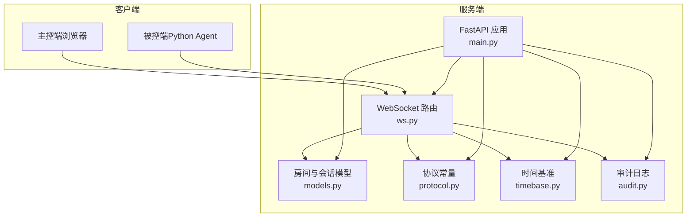
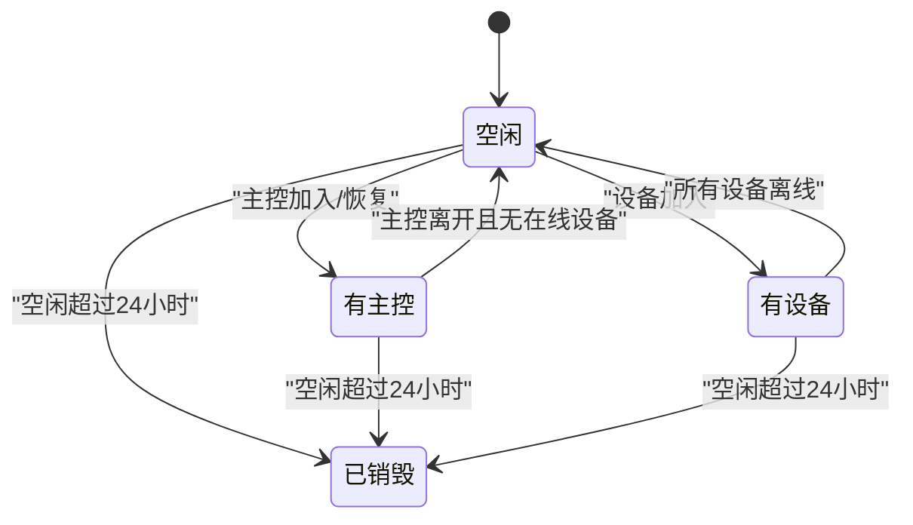
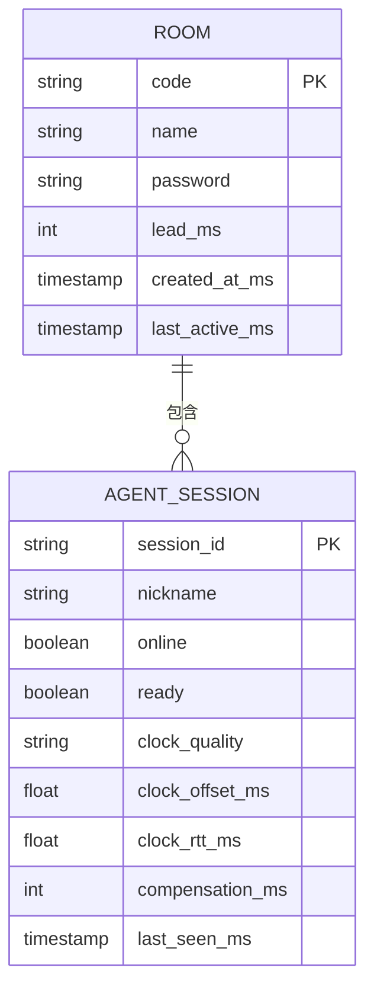
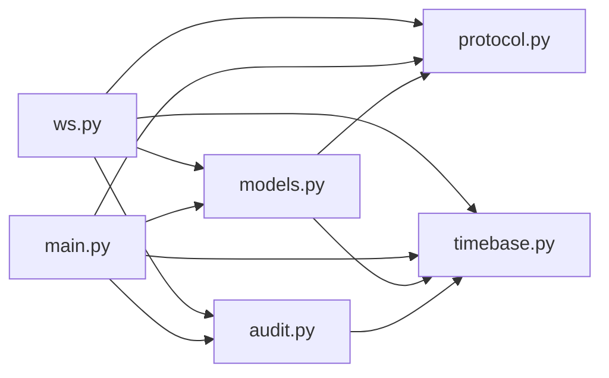

# 房间管理系统

<cite>
**本文引用的文件**
- [server/server/main.py](file://server/server/main.py)
- [server/server/ws.py](file://server/server/ws.py)
- [server/server/models.py](file://server/server/models.py)
- [server/server/protocol.py](file://server/server/protocol.py)
- [server/server/timebase.py](file://server/server/timebase.py)
- [server/server/audit.py](file://server/server/audit.py)
- [README.md](file://README.md)
</cite>

## 目录
1. [简介](#简介)
2. [项目结构](#项目结构)
3. [核心组件](#核心组件)
4. [架构总览](#架构总览)
5. [详细组件分析](#详细组件分析)
6. [依赖关系分析](#依赖关系分析)
7. [性能考量](#性能考量)
8. [故障排查指南](#故障排查指南)
9. [结论](#结论)
10. [附录](#附录)

## 简介
本文件为 ScriptCue 服务端的“房间管理系统”提供全面架构文档，聚焦 RoomManager 类的设计模式与内存存储策略，覆盖房间的创建、加入、销毁生命周期；设备会话（AgentSession）的连接建立、心跳检测、离线标记与会话恢复；并发安全机制（异步锁与数据一致性）；空闲清理算法（24小时超时）与批量操作优化；并给出房间状态图与设备关系图，以及性能优化建议。

## 项目结构
服务端采用 FastAPI + WebSocket 的轻量架构，房间与会话以纯内存模型管理，配合后台协程完成心跳离线判定与空闲房间清理。主控端与被控端通过同一 /ws 端点接入，首条消息声明角色后进入各自会话处理流程。



图表来源
- [server/server/main.py:63-98](file://server/server/main.py#L63-L98)
- [server/server/ws.py:334-360](file://server/server/ws.py#L334-L360)
- [server/server/models.py:120-157](file://server/server/models.py#L120-L157)
- [server/server/protocol.py:1-80](file://server/server/protocol.py#L1-L80)
- [server/server/timebase.py:10-13](file://server/server/timebase.py#L10-L13)
- [server/server/audit.py:17-37](file://server/server/audit.py#L17-L37)

章节来源
- [README.md:16-27](file://README.md#L16-L27)
- [server/server/main.py:1-98](file://server/server/main.py#L1-L98)

## 核心组件
- RoomManager：房间集合的内存管理器，负责房间创建、查找、删除与过期清理。
- Room：单个房间的状态容器，维护主控连接、设备会话集合、待执行指令队列、活跃时间戳等。
- AgentSession：单台设备的会话对象，维护连接、在线状态、时钟质量、补偿值、待回执指令等。
- ws 模块：统一 WebSocket 入口，区分主控与被控会话，处理命令下发、取消、补偿设置、心跳、回执等。
- protocol 模块：协议常量、错误码、限制参数（如最大设备数、房间码长度、空闲 TTL、提前量范围等）。
- timebase 模块：统一的毫秒级单调时间源。
- audit 模块：线程安全的 JSON Lines 审计日志，记录关键事件。

章节来源
- [server/server/models.py:17-157](file://server/server/models.py#L17-L157)
- [server/server/ws.py:67-327](file://server/server/ws.py#L67-L327)
- [server/server/protocol.py:1-80](file://server/server/protocol.py#L1-L80)
- [server/server/timebase.py:10-13](file://server/server/timebase.py#L10-L13)
- [server/server/audit.py:17-37](file://server/server/audit.py#L17-L37)

## 架构总览
系统由“主控端—服务器—被控端”三方组成。主控端通过 WS 创建/加入房间并下发带绝对时刻的指令；服务器将指令广播给房间内在线设备；被控端周期性上报心跳与时钟质量，服务器据此判断在线/离线并通知主控；后台任务定期清理空闲超时的房间。

```mermaid
sequenceDiagram
participant Ctrl as "主控端"
participant Srv as "服务器(ws.py)"
participant RM as "RoomManager(models.py)"
participant Rm as "Room(models.py)"
participant Ag as "AgentSession(models.py)"
participant Aud as "AuditLog(audit.py)"
Ctrl->>Srv : 首条消息(创建/加入/恢复)
Srv->>RM : create_room/get
RM-->>Srv : Room
Srv->>Rm : 绑定主控连接, 更新活跃时间
Srv-->>Ctrl : 加入成功(房间信息/令牌/设备列表)
Ctrl->>Srv : 下发指令(command.scheduled)
Srv->>Rm : 写入待执行指令, 广播给在线设备
Rm->>Ag : CMD_EXEC(含 at)
Ag-->>Srv : 回执(command.receipt)
Srv->>Aud : 记录回执
Srv-->>Ctrl : 推送回执
Note over Srv,RM : 后台任务每秒检查心跳超时; 每分钟扫描空闲房间
```

图表来源
- [server/server/ws.py:154-207](file://server/server/ws.py#L154-L207)
- [server/server/ws.py:214-243](file://server/server/ws.py#L214-L243)
- [server/server/models.py:64-118](file://server/server/models.py#L64-L118)
- [server/server/main.py:40-61](file://server/server/main.py#L40-L61)
- [server/server/audit.py:24-32](file://server/server/audit.py#L24-L32)

## 详细组件分析

### RoomManager：设计模式与内存存储策略
- 设计模式
  - 工厂模式：create_room 根据名称、口令、可选 code 生成房间实例，支持按原 code 重建（用于重启恢复）。
  - 集合管理：rooms 字典作为内存索引，get/remove/sweep_expired 提供增删查与批量过期清理。
  - 代码生成：_generate_code 基于受限字母表随机生成不冲突的房间码。
- 内存存储策略
  - 全内存 dict 映射 room_code -> Room，无持久化；重启后由客户端凭 auto_create/code 重建。
  - 空闲清理 sweep_expired 使用 now_ms() 与 ROOM_IDLE_TTL_S 计算是否超过 24h 未活跃，批量删除并返回被销毁房间码。
- 复杂度
  - 创建/查找/删除均为 O(1)。
  - 空闲扫描为 O(N)，N 为房间数量；由于房间数量有限且清理频率低（每分钟），开销可控。

章节来源
- [server/server/models.py:120-157](file://server/server/models.py#L120-L157)
- [server/server/protocol.py:67-73](file://server/server/protocol.py#L67-L73)
- [server/server/main.py:54-61](file://server/server/main.py#L54-L61)

### Room：房间生命周期与批量操作
- 生命周期
  - 创建：由 RoomManager.create_room 构造，分配 code/name/password/lead_ms，初始化 agents 与 pending_commands。
  - 加入：主控通过 CTRL_JOIN/CTRL_RESUME 进入，保存 controller_ws 与 token，更新 last_active_ms。
  - 销毁：空闲超过 24h 时由 sweep_expired 移除。
- 批量操作优化
  - broadcast_agents 仅向在线设备发送，避免无效 IO。
  - notify_controller 仅在存在主控连接时发送，异常吞掉避免阻塞。
  - agent_states 一次性生成设备快照供主控拉取。
- 空闲判定
  - is_idle：无主控连接且无任何在线设备即为空闲。

章节来源
- [server/server/models.py:64-118](file://server/server/models.py#L64-L118)

### AgentSession：设备会话管理与恢复
- 连接建立
  - 首次加入：room.add_agent 生成 session_id/nickname/token，绑定 ws，设置 online=True，last_seen_ms=now_ms()。
  - 旧连接顶替：若已有 ws 连接，先关闭旧连接再绑定新连接，保证一对一。
- 心跳检测与离线标记
  - 被控端周期发送心跳，ws 中更新 ready/clock_quality/offset/rtt，并通知主控。
  - main._offline_sweep 每秒遍历房间设备，若 last_seen_ms 超过 AGENT_OFFLINE_S*1000ms，则标记 offline 并通知主控，同时记录审计日志。
- 会话恢复
  - 重连时携带 token，room.find_session_by_token 匹配旧会话，复用 session 并重新绑定 ws。
  - 若房间不存在且 auto_create=true，则按原 code 重建房间，实现断线恢复。
- 指令回执与清理
  - 设备收到 CMD_EXEC 后在到期窗口内回传回执，ws 中从 pending_commands 移除并按需通知主控。
  - _cleanup_pending 在回执窗口结束后清理房间与设备的待执行记录，防止泄漏。

章节来源
- [server/server/models.py:17-62](file://server/server/models.py#L17-L62)
- [server/server/ws.py:246-327](file://server/server/ws.py#L246-L327)
- [server/server/main.py:40-52](file://server/server/main.py#L40-L52)
- [server/server/protocol.py:75-79](file://server/server/protocol.py#L75-L79)

### 并发安全与数据一致性
- 单进程异步模型
  - FastAPI/Starlette 基于 asyncio 单线程事件循环，RoomManager/Room/AgentSession 的读写在同一事件循环中串行执行，天然避免竞态。
  - 后台任务（心跳离线扫描、空闲清理）通过 asyncio.create_task 运行，与请求处理共享内存但不会并发写同一对象字段。
- 显式同步点
  - 审计日志 AuditLog 使用 threading.Lock 保护文件句柄写入，确保多路并发下的顺序性与完整性。
  - 房间与设备状态变更均在 ws 处理函数中顺序完成，并通过 notify_controller 推送状态，保证主控看到的视图一致。
- 一致性保障
  - 指令下发：房间与设备均维护 pending_commands，回执到达后双方清理，超时后由 _cleanup_pending 兜底清理。
  - 心跳与离线：last_seen_ms 由心跳更新，离线扫描基于固定阈值判定，避免频繁切换状态。

章节来源
- [server/server/audit.py:17-37](file://server/server/audit.py#L17-L37)
- [server/server/ws.py:67-134](file://server/server/ws.py#L67-L134)
- [server/server/main.py:40-61](file://server/server/main.py#L40-L61)

### 空闲清理算法（24小时超时）
- 触发时机：_idle_sweep 每分钟执行一次。
- 判定条件：is_idle() 为真且 (now - last_active_ms) > ROOM_IDLE_TTL_S * 1000。
- 动作：批量删除 rooms 中对应房间，记录审计日志，并返回被销毁房间码。
- 优化：仅对空闲房间进行扫描与删除，避免对活跃房间造成额外开销。

章节来源
- [server/server/main.py:54-61](file://server/server/main.py#L54-L61)
- [server/server/models.py:80-87](file://server/server/models.py#L80-L87)
- [server/server/protocol.py:71](file://server/server/protocol.py#L71)

### 房间状态图


图表来源
- [server/server/models.py:80-87](file://server/server/models.py#L80-L87)
- [server/server/main.py:54-61](file://server/server/main.py#L54-L61)

### 设备关系图


图表来源
- [server/server/models.py:17-118](file://server/server/models.py#L17-L118)

## 依赖关系分析
- ws.py 依赖 models.py（RoomManager/Room/AgentSession）、protocol.py（消息类型与限制）、timebase.py（时间）、audit.py（审计）。
- main.py 启动后台任务调用 models.RoomManager.sweep_expired 与 _offline_sweep，依赖 protocol 常量与 timebase。
- models.py 依赖 protocol 常量与 timebase。
- audit.py 依赖 timebase 与 threading 锁。



图表来源
- [server/server/ws.py:1-360](file://server/server/ws.py#L1-L360)
- [server/server/main.py:1-98](file://server/server/main.py#L1-L98)
- [server/server/models.py:1-157](file://server/server/models.py#L1-L157)
- [server/server/protocol.py:1-80](file://server/server/protocol.py#L1-L80)
- [server/server/timebase.py:1-13](file://server/server/timebase.py#L1-L13)
- [server/server/audit.py:1-37](file://server/server/audit.py#L1-L37)

章节来源
- [server/server/ws.py:1-360](file://server/server/ws.py#L1-L360)
- [server/server/main.py:1-98](file://server/server/main.py#L1-L98)
- [server/server/models.py:1-157](file://server/server/models.py#L1-L157)

## 性能考量
- 内存模型
  - 房间与会话全部驻留内存，读写 O(1)，适合高吞吐短连接场景；注意进程重启后数据丢失，依赖客户端自动重建。
- 批量与节流
  - broadcast_agents 仅向在线设备发送，减少无效网络 IO。
  - notify_controller 异常吞掉，避免阻塞主流程。
  - 心跳离线扫描每秒一次，空闲清理每分钟一次，频率合理。
- 指令回执窗口
  - RECEIPT_TIMEOUT_MS 控制等待回执的时间，超时后清理 pending_commands，防止内存泄漏。
- 时间源
  - now_ms() 使用高精度单调时间，保证调度与心跳判定的准确性。
- 可扩展性
  - 当前为单进程模型，如需水平扩展可引入 Redis 等外部存储做房间与会话共享，但需重新设计并发与一致性。

[本节为通用性能讨论，不直接分析具体文件]

## 故障排查指南
- 设备离线
  - 现象：主控看到设备 offline。
  - 原因：心跳间隔 HEARTBEAT_INTERVAL_S 内未收到心跳，超过 AGENT_OFFLINE_S 次即标记离线。
  - 排查：检查被控端心跳发送、网络连通性、WS 连接稳定性。
- 指令未执行或回执缺失
  - 现象：主控未收到回执或设备未执行。
  - 原因：设备未在 at 前就绪、网络抖动导致错过执行窗口、回执超时。
  - 排查：查看审计日志 receipt 事件；确认设备补偿值与 clock_offset_ms；增大 lead_ms 或调整补偿。
- 房间无法加入
  - 现象：ERR_ROOM_NOT_FOUND 或 ERR_BAD_PASSWORD。
  - 原因：房间不存在或口令错误；若 auto_create=false 且房间不存在会失败。
  - 排查：确认房间码与口令；必要时启用 auto_create 以便重启后恢复。
- 房间未销毁
  - 现象：长时间无活动房间仍存在。
  - 原因：仍有主控或在线设备；或空闲清理尚未触发。
  - 排查：检查 is_idle 条件与 last_active_ms；等待下一次空闲扫描。

章节来源
- [server/server/main.py:40-61](file://server/server/main.py#L40-L61)
- [server/server/ws.py:214-243](file://server/server/ws.py#L214-L243)
- [server/server/protocol.py:75-79](file://server/server/protocol.py#L75-L79)
- [server/server/audit.py:24-32](file://server/server/audit.py#L24-L32)

## 结论
ScriptCue 的房间管理系统以纯内存模型为核心，借助 RoomManager/Room/AgentSession 清晰划分职责，结合 ws 模块的消息路由与后台任务的心跳/空闲清理，实现了高可靠、低延迟的多设备同步起播能力。其设计简洁高效，易于理解与维护；通过严格的协议常量与审计日志，保障了可观测性与可追溯性。未来可在需要时引入外部存储以实现跨进程/多实例共享与持久化。

[本节为总结性内容，不直接分析具体文件]

## 附录
- 关键常量参考
  - 最大设备数：MAX_AGENTS_PER_ROOM
  - 房间码长度与字符集：ROOM_CODE_LENGTH, ROOM_CODE_ALPHABET
  - 空闲 TTL：ROOM_IDLE_TTL_S（24小时）
  - 心跳间隔与离线阈值：HEARTBEAT_INTERVAL_S, AGENT_OFFLINE_S
  - 回执超时：RECEIPT_TIMEOUT_MS
  - 默认提前量：DEFAULT_LEAD_MS（可通过环境变量配置）

章节来源
- [server/server/protocol.py:67-79](file://server/server/protocol.py#L67-L79)