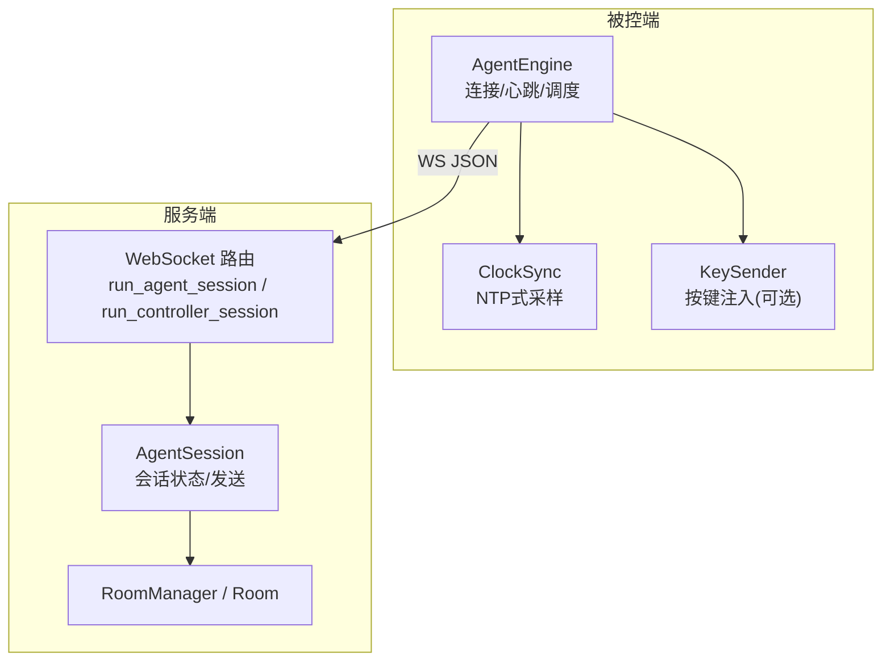
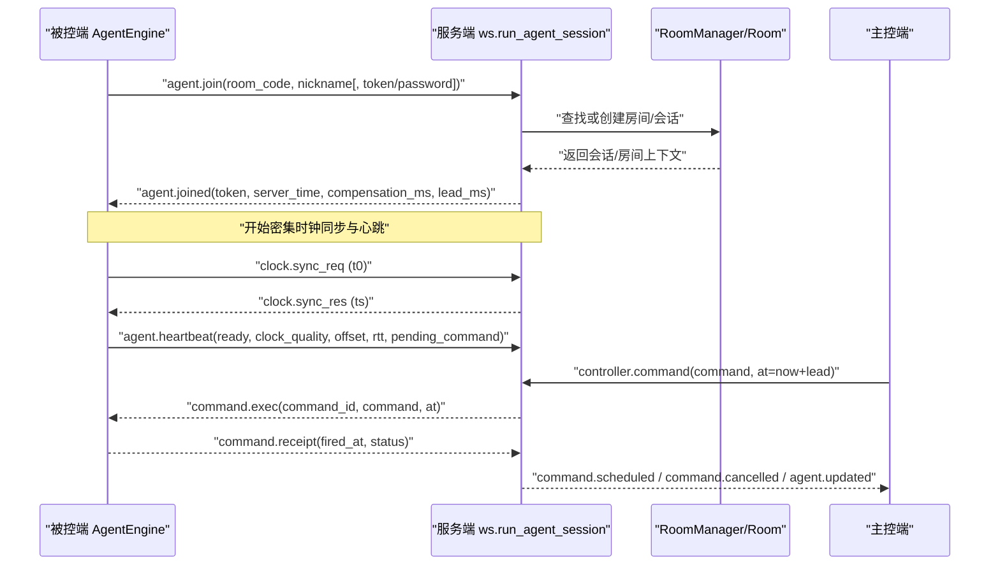
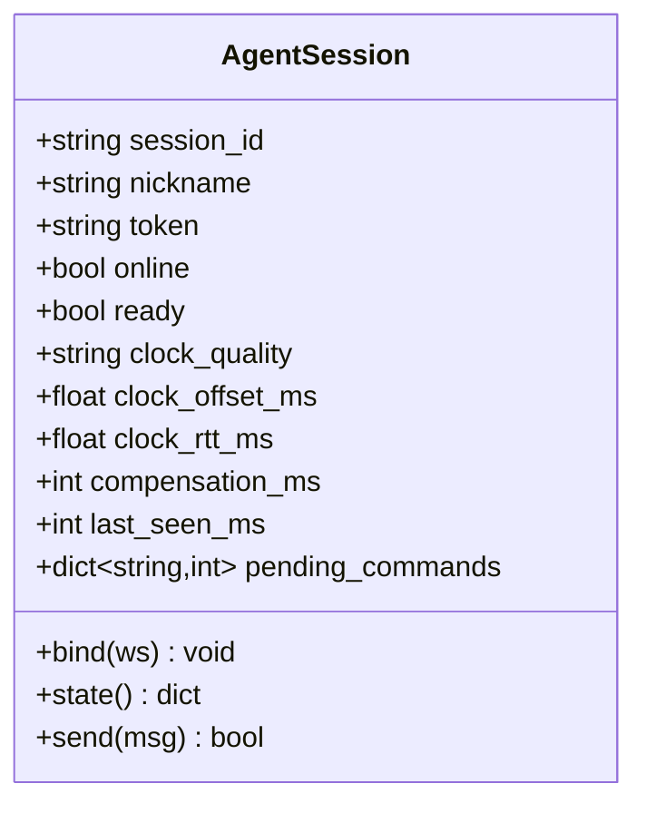
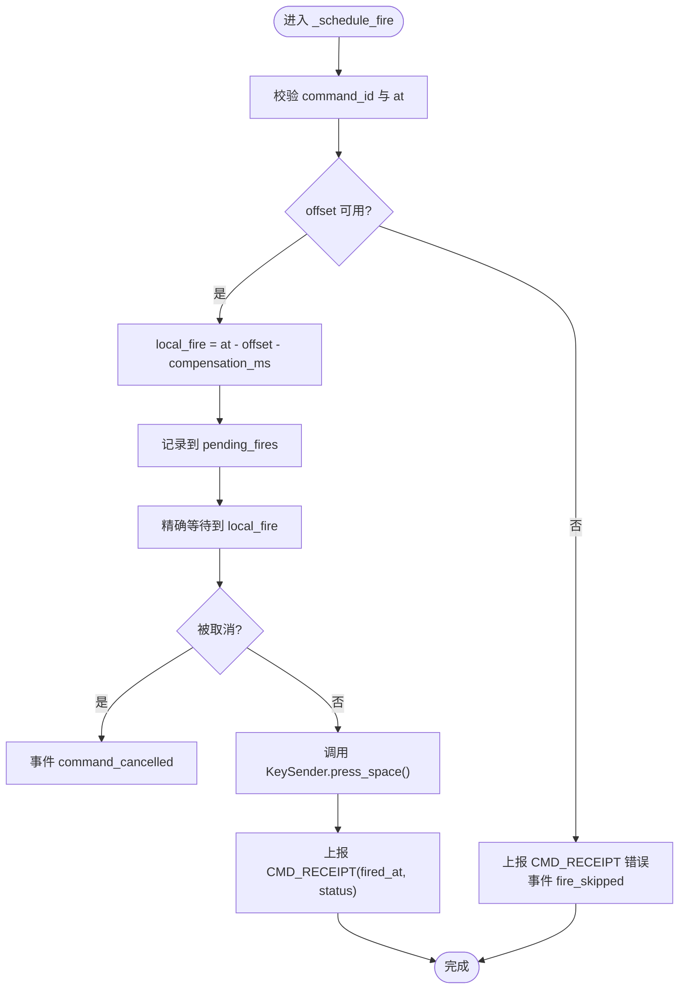
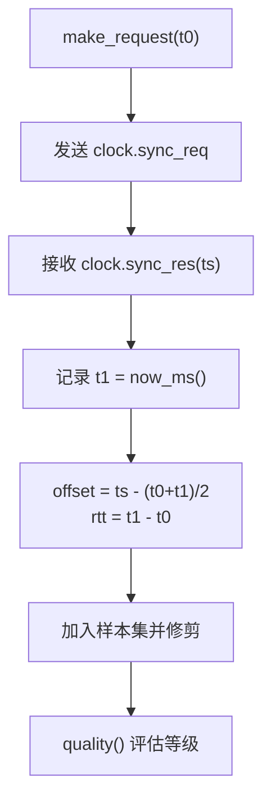
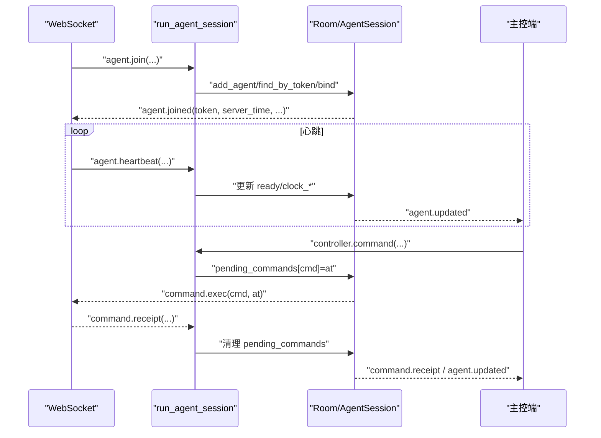
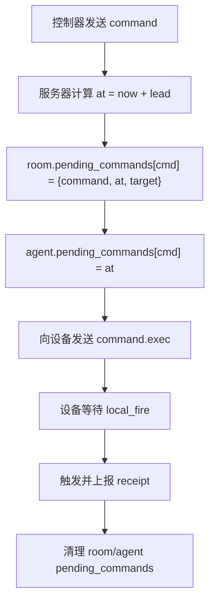
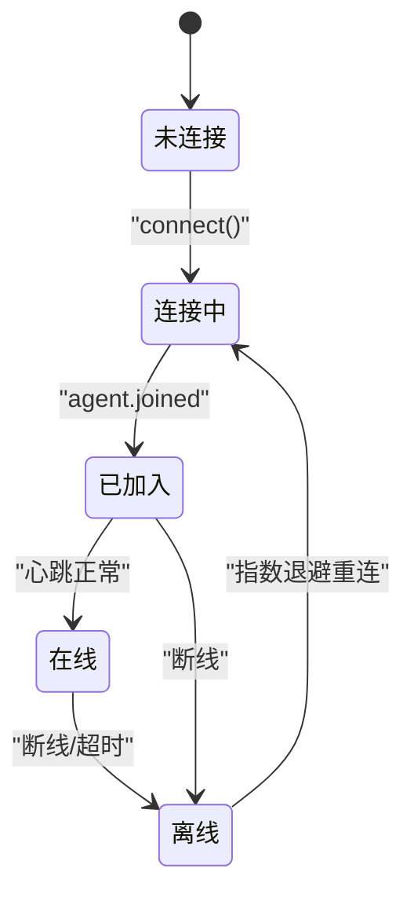
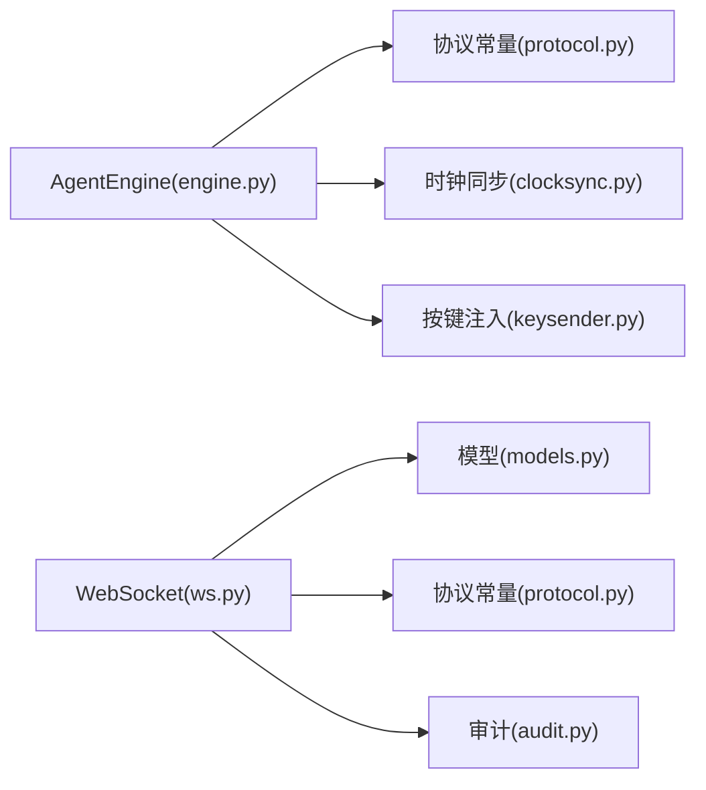

# 设备会话管理

<cite>
**本文引用的文件**
- [engine.py](file://agent/agent/engine.py)
- [protocol.py（被控端）](file://agent/agent/protocol.py)
- [clocksync.py](file://agent/agent/clocksync.py)
- [ws.py](file://server/server/ws.py)
- [models.py](file://server/server/models.py)
- [protocol.py（服务端）](file://server/server/protocol.py)
- [README.md](file://README.md)
</cite>

## 目录
1. [简介](#简介)
2. [项目结构](#项目结构)
3. [核心组件](#核心组件)
4. [架构总览](#架构总览)
5. [详细组件分析](#详细组件分析)
6. [依赖关系分析](#依赖关系分析)
7. [性能考量](#性能考量)
8. [故障排查指南](#故障排查指南)
9. [结论](#结论)
10. [附录](#附录)

## 简介
本文件为 ScriptCue 的设备会话管理系统提供全面文档，聚焦 AgentSession 类的设计与行为、AgentEngine 的会话生命周期、时钟同步与心跳机制、待执行指令队列管理与恢复流程，以及安全性与异常处理策略。目标是帮助开发者与维护者理解并可靠地扩展设备会话管理能力。

## 项目结构
- 服务端：房间与会话模型、WebSocket 会话路由、协议常量、时间基准、审计日志等。
- 被控端：连接生命周期、时钟同步、绝对时刻调度、触发回执、心跳上报。
- 主控端：网页控制台（由服务端静态托管），通过 WebSocket 下发指令与查看状态。

图表来源
- [engine.py:106-157](file://agent/agent/engine.py#L106-L157)
- [ws.py:246-327](file://server/server/ws.py#L246-L327)
- [models.py:17-62](file://server/server/models.py#L17-L62)

章节来源
- [README.md:16-27](file://README.md#L16-L27)

## 核心组件
- AgentSession（服务端）：表示一台被控设备的会话，维护在线状态、时钟质量、偏移、RTT、补偿值、最近可见时间戳、待执行指令映射，并提供绑定连接、发送消息、导出状态等方法。
- AgentEngine（被控端）：负责连接建立、加入房间、密集与维持性时钟同步、心跳循环、指令调度与回执上报、指数退避重连。
- ClockSync（被控端）：实现 NTP 风格的双向时间同步，维护样本集，计算可信偏移与 RTT，评估时钟质量。
- WebSocket 路由（服务端）：区分主控与被控首条消息类型，创建或恢复会话，处理心跳、授时、补偿更新与回执。

章节来源
- [models.py:17-62](file://server/server/models.py#L17-L62)
- [engine.py:31-157](file://agent/agent/engine.py#L31-L157)
- [clocksync.py:29-106](file://agent/agent/clocksync.py#L29-L106)
- [ws.py:246-327](file://server/server/ws.py#L246-L327)

## 架构总览
系统采用“服务器集中协调 + 客户端高精度定时”的架构。被控端通过类 NTP 方式估算本地与服务器时钟偏移，将服务器下发的绝对执行时刻换算为本地精确触发点；服务端负责房间与会话管理、指令分发、状态汇聚与审计。

图表来源
- [engine.py:159-192](file://agent/agent/engine.py#L159-L192)
- [engine.py:198-211](file://agent/agent/engine.py#L198-L211)
- [engine.py:217-241](file://agent/agent/engine.py#L217-L241)
- [ws.py:246-327](file://server/server/ws.py#L246-L327)
- [ws.py:67-104](file://server/server/ws.py#L67-L104)

## 详细组件分析

### AgentSession（服务端会话模型）
- 字段与作用
  - session_id：唯一标识该设备会话。
  - nickname：设备昵称。
  - token：用于会话恢复的安全令牌。
  - online：是否在线（绑定连接后置真，断开后置假）。
  - ready：就绪标志，随心跳上报。
  - clock_quality：时钟质量等级（excellent/good/poor/none）。
  - clock_offset_ms：当前估计的服务器时钟相对本地偏移（毫秒）。
  - clock_rtt_ms：当前估计的往返时延（毫秒）。
  - compensation_ms：用户或系统设置的补偿值（毫秒），参与本地触发时刻换算。
  - last_seen_ms：最后一次收到消息的时间戳（毫秒）。
  - pending_commands：已下发且等待触发或回执的指令集合，键为 command_id，值为计划执行时刻 at。
- 关键方法
  - bind(ws)：绑定 WebSocket 连接，标记在线并更新时间戳。
  - state()：导出协议中的 AgentState 结构，供主控端展示。
  - send(msg)：安全地向该会话发送 JSON 消息。

图表来源
- [models.py:17-62](file://server/server/models.py#L17-L62)

章节来源
- [models.py:17-62](file://server/server/models.py#L17-L62)

### AgentEngine（被控端引擎）
- 会话初始化
  - 构造参数包括服务器地址、房间码、昵称、密码、房间名、KeySender、事件回调与提示音函数。
  - 初始化时钟同步器、补偿值、就绪标志、连接标志、令牌、提前量等。
- 连接建立与加入
  - normalize_url 标准化 URL 到 ws/wss 路径。
  - run 主循环：连接 → join → 服务 → 断线指数退避重连。
  - _connect_and_serve：建立 WebSocket，启动密集同步、心跳、维持同步任务，并在 finally 中取消任务、清理状态。
  - _join：发送 agent.join，接收 agent.joined，设置 token、compensation_ms、lead_ms，重置时钟同步，标记 connected。
- 时钟同步
  - _dense_sync：加入后立即进行多次密集采样。
  - _maintain_sync_loop：周期性发送时钟同步请求以抑制漂移。
- 心跳与状态上报
  - _heartbeat_msg：组装心跳消息，包含 ready、clock_quality、compensation_ms、clock_offset_ms、clock_rtt_ms、pending_command（若有）。
  - _heartbeat_loop：按固定间隔发送心跳。
  - _send_heartbeat_now：状态变化时立即补发一次心跳。
  - _send_threadsafe/_send_json：线程安全发送 JSON 消息。
- 消息分发
  - 处理 CLOCK_SYNC_RES、CMD_EXEC、CMD_CANCEL、COMP_UPDATE、ERROR 等消息类型。
- 指令调度与回执
  - _schedule_fire：校验命令与时间，若未同步则回报错误；计算 local_fire = at - offset - compensation_ms；记录到 pending_fires；启动线程等待触发。
  - _fire_worker：在触发前播放倒数提示音；精确等待到点；调用 KeySender 模拟按键；计算 fired_at 并上报 CMD_RECEIPT；清理 pending_fires。
- 异常与恢复
  - run 捕获异常并上报 error 事件；断线后指数退避重连；支持自动重建房间（auto_create）。

图表来源
- [engine.py:297-379](file://agent/agent/engine.py#L297-L379)

章节来源
- [engine.py:31-157](file://agent/agent/engine.py#L31-L157)
- [engine.py:198-241](file://agent/agent/engine.py#L198-L241)
- [engine.py:268-379](file://agent/agent/engine.py#L268-L379)

### 时钟同步模块（ClockSync）
- 设计要点
  - 类 NTP 算法：发送携带 t0 的请求，服务器回复 ts，本地记录 t1，计算 offset = ts - (t0 + t1)/2，rtt = t1 - t0。
  - 样本管理：保留最新且 RTT 较小的样本，设置最大保留数量与老化窗口，避免陈旧样本主导。
  - 质量评估：基于样本数量与 RTT 阈值划分 excellent/good/poor/none。
- 接口
  - make_request：生成时钟同步请求。
  - handle_response：处理响应，新增样本并修剪。
  - best/offset_ms/rtt_ms：获取最优样本及结果。
  - quality：输出质量等级。
  - reset：重连后清空历史，重新密集采样。

图表来源
- [clocksync.py:37-55](file://agent/agent/clocksync.py#L37-L55)
- [clocksync.py:66-106](file://agent/agent/clocksync.py#L66-L106)

章节来源
- [clocksync.py:29-106](file://agent/agent/clocksync.py#L29-L106)

### 服务端会话处理（ws.py）
- 被控端会话
  - run_agent_session：解析首条消息，查找或创建房间与会话；旧连接顶替新连接；绑定会话；返回 agent.joined；循环处理心跳、授时、补偿更新、回执；断开时下线并通知主控。
  - _agent_handle_heartbeat：更新 ready、clock_quality、clock_offset_ms、clock_rtt_ms，并推送 AGENT_UPDATED。
  - _agent_handle_receipt：根据回执更新房间与会话的 pending_commands，并回推主控。
- 主控端会话
  - run_controller_session：创建/加入/恢复房间；处理指令、取消、设置补偿；广播或单播指令；清理过期 pending 指令。
- 通用
  - handle_ws：统一入口，校验协议版本，分派主控或被控会话。

图表来源
- [ws.py:246-327](file://server/server/ws.py#L246-L327)
- [ws.py:67-134](file://server/server/ws.py#L67-L134)

章节来源
- [ws.py:246-327](file://server/server/ws.py#L246-L327)
- [ws.py:67-134](file://server/server/ws.py#L67-L134)

### 待执行指令队列（pending_commands）管理机制
- 服务端侧
  - Room.pending_commands：全局待执行指令映射，键为 command_id，值为 {command, at, target}。
  - AgentSession.pending_commands：设备侧待执行指令映射，键为 command_id，值为 at。
  - 指令下发：控制器发送 controller.command，服务器计算 at = now + lead，写入房间与会话的 pending_commands，并向目标或全体在线设备广播 command.exec。
  - 指令取消：控制器发送 controller.cancel，服务器从房间与会话移除对应条目，并发送 command.cancel。
  - 清理策略：指令到期后超过回执窗口（RECEIPT_TIMEOUT_MS）仍未回执，则清理房间与会话的 pending_commands。
- 被控端侧
  - AgentEngine._pending_fires：线程级事件映射，键为 command_id，值为 threading.Event，用于取消与清理。
  - 调度逻辑：收到 command.exec 后，若未同步则回报错误；否则计算 local_fire 并启动线程等待触发；触发完成后上报 CMD_RECEIPT 并清理。

图表来源
- [ws.py:67-104](file://server/server/ws.py#L67-L104)
- [ws.py:107-134](file://server/server/ws.py#L107-L134)
- [engine.py:297-379](file://agent/agent/engine.py#L297-L379)

章节来源
- [ws.py:67-134](file://server/server/ws.py#L67-L134)
- [engine.py:297-379](file://agent/agent/engine.py#L297-L379)

### 会话生命周期
- 连接建立
  - 被控端：normalize_url → connect → _join → 设置 token/compensation/lead → 启动密集同步、心跳、维持同步。
  - 服务端：handle_ws 校验协议版本 → run_agent_session → 查找或创建房间与会话 → bind → 返回 agent.joined。
- 心跳保持
  - 被控端：每 5 秒发送心跳，包含 ready、clock_quality、offset、rtt、pending_command。
  - 服务端：更新会话状态并推送 AGENT_UPDATED 给主控。
- 离线标记
  - 服务端：WebSocket 断开时将 session.online 置为 False，并通知主控。
  - 房间空闲销毁：无主控且无在线设备超过 TTL（默认 24h）的房间将被销毁。
- 会话恢复
  - 被控端：支持 auto_create，当房间不存在但曾加入过，下次重连自动重建房间。
  - 服务端：根据 token 恢复旧会话；若存在旧连接则顶替关闭。

图表来源
- [engine.py:106-157](file://agent/agent/engine.py#L106-L157)
- [ws.py:246-327](file://server/server/ws.py#L246-L327)
- [models.py:80-87](file://server/server/models.py#L80-L87)

章节来源
- [engine.py:106-157](file://agent/agent/engine.py#L106-L157)
- [ws.py:246-327](file://server/server/ws.py#L246-L327)
- [models.py:80-87](file://server/server/models.py#L80-L87)

### 安全性设计
- 房间口令：主控加入房间时可设置口令；被控端加入时若房间有口令需匹配，否则拒绝。
- 会话令牌：每个 AgentSession 分配随机 token，用于恢复旧会话；服务端根据 token 查找并顶替旧连接。
- 协议版本校验：首条消息必须匹配 PROTO_VERSION，否则拒绝。
- 指令白名单：仅允许 play/pause/test 等有效指令。
- 补偿值范围限制：服务端对 compensation_ms 进行上下限裁剪，防止极端值影响调度。
- 审计日志：关键操作（加入、离开、指令、取消、补偿设置、回执）均记录审计日志。

章节来源
- [ws.py:154-185](file://server/server/ws.py#L154-L185)
- [ws.py:246-327](file://server/server/ws.py#L246-L327)
- [protocol.py（服务端）:45-79](file://server/server/protocol.py#L45-L79)

### 异常处理策略
- 连接异常
  - 被控端：run 捕获异常并上报 error 事件；断线后指数退避重连，上限 10s。
  - 服务端：WebSocket 断开时清理会话并通知主控。
- 消息异常
  - 非法 JSON：服务端返回 bad_message 错误并保持连接。
  - 未知消息类型：返回 bad_message 错误。
  - 未知指令：返回 bad_command 错误。
- 时钟未同步
  - 被控端：若 offset 不可用，上报 CMD_RECEIPT 错误并记录 fire_skipped 事件。
- 回调异常
  - on_event 回调异常被捕获并记录，不影响引擎继续运行。

章节来源
- [engine.py:106-157](file://agent/agent/engine.py#L106-L157)
- [engine.py:297-311](file://agent/agent/engine.py#L297-L311)
- [engine.py:383-388](file://agent/agent/engine.py#L383-L388)
- [ws.py:50-60](file://server/server/ws.py#L50-L60)
- [ws.py:194-202](file://server/server/ws.py#L194-L202)

## 依赖关系分析
- 被控端依赖
  - engine.py 依赖 protocol.py（常量）、clocksync.py（时钟同步）、keysender.py（按键注入）、scheduler.py（精确等待）、timeutil.py（时间工具）。
- 服务端依赖
  - ws.py 依赖 models.py（房间与会话）、protocol.py（常量）、audit.py（审计）、timebase.py（时间基准）。
- 协议一致性
  - 两端 protocol.py 保持一致，修改时需同时更新并递增 PROTO_VERSION。

图表来源
- [engine.py:12-23](file://agent/agent/engine.py#L12-L23)
- [ws.py:6-18](file://server/server/ws.py#L6-L18)

章节来源
- [engine.py:12-23](file://agent/agent/engine.py#L12-L23)
- [ws.py:6-18](file://server/server/ws.py#L6-L18)

## 性能考量
- 时钟同步
  - 密集采样与维持采样结合，使用最小 RTT 样本提升精度；样本老化避免陈旧数据影响。
- 心跳频率
  - 5 秒间隔平衡了实时性与带宽开销；状态变化时立即补发心跳。
- 指令调度
  - 粗睡眠 + 末段自旋等待，减少 CPU 占用同时保证精度；提示音在触发前 3 秒内播放，临近到点停止以避免干扰。
- 重连策略
  - 指数退避（1,2,4,8 秒，上限 10 秒）降低网络抖动时的重试压力。
- 房间清理
  - 空闲房间 24 小时自动销毁，释放内存资源。

## 故障排查指南
- 无法加入房间
  - 检查房间是否存在、口令是否正确、协议版本是否匹配。
  - 若服务器重启导致房间丢失，启用 auto_create 并传入 room_name。
- 时钟未同步
  - 观察 clock_quality 是否为 none；检查网络延迟与丢包；确认密集采样是否成功。
- 指令未执行
  - 检查 pending_commands 是否被清理；确认 at 是否已过期；查看回执是否到达。
- 设备离线
  - 检查心跳是否正常；确认 WebSocket 连接是否稳定；查看 last_seen_ms 是否更新。
- 补偿值无效
  - 确认 compensation_ms 在服务端允许范围内；检查是否被裁剪。

章节来源
- [ws.py:154-185](file://server/server/ws.py#L154-L185)
- [ws.py:246-327](file://server/server/ws.py#L246-L327)
- [engine.py:106-157](file://agent/agent/engine.py#L106-L157)
- [engine.py:297-311](file://agent/agent/engine.py#L297-L311)

## 结论
ScriptCue 的设备会话管理系统通过严谨的会话模型、稳定的心跳与授时机制、可靠的指令队列管理与恢复流程，实现了多设备在高公网环境下的精准同步。AgentSession 作为服务端核心抽象，承载了会话状态与通信能力；AgentEngine 作为被控端核心，确保连接健壮性与调度精度。系统设计兼顾安全性与可维护性，适合大规模部署与持续演进。

## 附录
- 协议常量与限制
  - 心跳间隔、重连退避、时钟同步参数、指令提前量默认值、房间容量限制等详见协议文件。
- 快速开始
  - 服务端、主控端、被控端的启动与打包说明见 README。

章节来源
- [protocol.py（服务端）:67-79](file://server/server/protocol.py#L67-L79)
- [protocol.py（被控端）:65-80](file://agent/agent/protocol.py#L65-L80)
- [README.md:34-79](file://README.md#L34-L79)