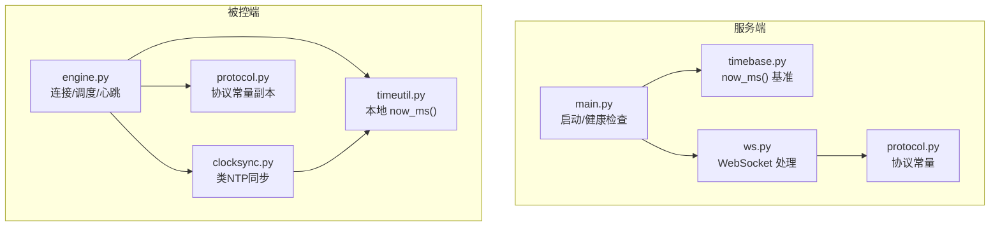
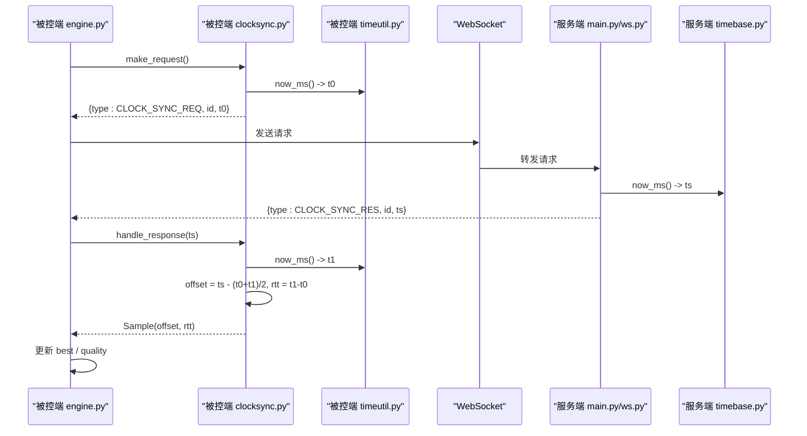
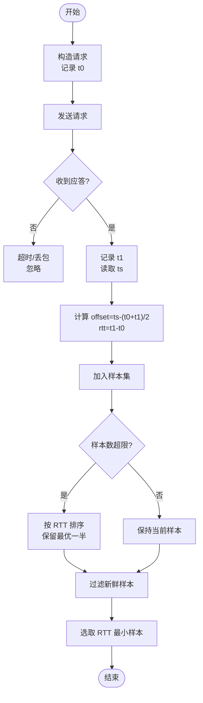
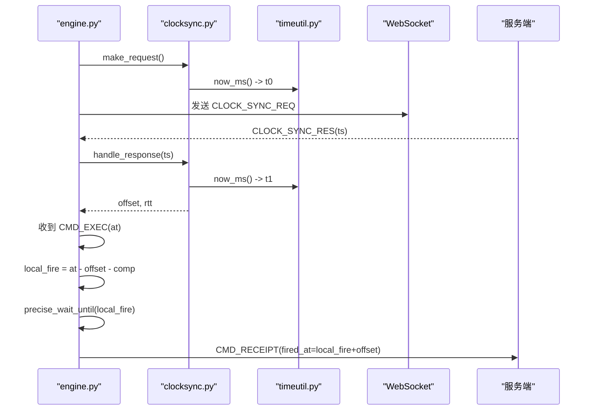
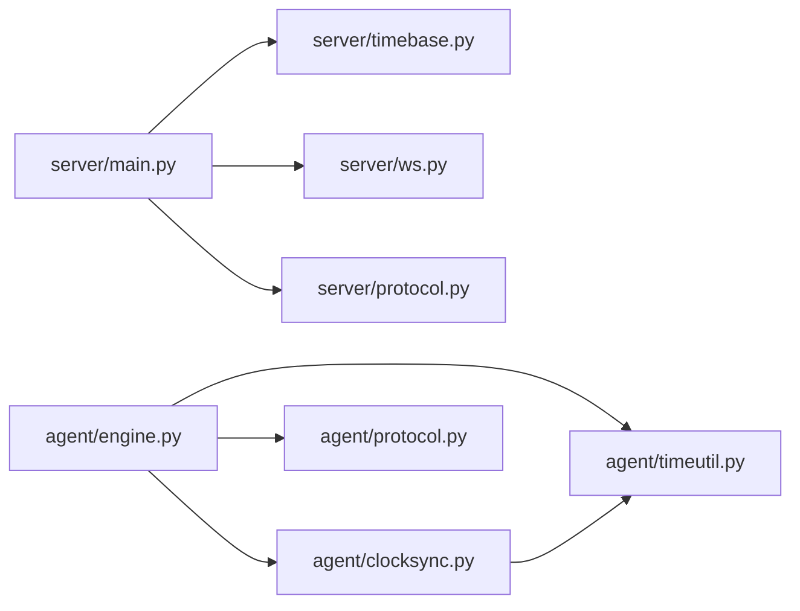

# 时钟基准服务

<cite>
**本文引用的文件**
- [server/server/timebase.py](file://server/server/timebase.py)
- [agent/agent/timeutil.py](file://agent/agent/timeutil.py)
- [agent/agent/clocksync.py](file://agent/agent/clocksync.py)
- [agent/agent/engine.py](file://agent/agent/engine.py)
- [server/server/main.py](file://server/server/main.py)
- [server/server/protocol.py](file://server/server/protocol.py)
- [agent/agent/protocol.py](file://agent/agent/protocol.py)
- [README.md](file://README.md)
</cite>

## 目录
1. [简介](#简介)
2. [项目结构](#项目结构)
3. [核心组件](#核心组件)
4. [架构总览](#架构总览)
5. [详细组件分析](#详细组件分析)
6. [依赖关系分析](#依赖关系分析)
7. [性能考量与优化](#性能考量与优化)
8. [故障排查指南](#故障排查指南)
9. [结论](#结论)
10. [附录：配置参数与调优选项](#附录配置参数与调优选项)

## 简介
本技术文档聚焦于 ScriptCue 的“时钟基准服务”，覆盖高精度时间获取机制、系统时间同步策略、now_ms() 实现原理、统一时间使用方式、相关配置与调优，并给出时间同步架构图与性能基准测试建议。该服务通过服务端提供毫秒级 Unix 时间戳作为权威基准，被控端采用类 NTP 算法进行多轮采样与 RTT 最小样本选择，从而在公网环境下实现 ≤50ms 精度的同步起播。

## 项目结构
- 服务端（FastAPI + WebSocket）：提供房间管理、指令广播、状态汇聚、审计日志以及授时基准 now_ms()。
- 主控端（HTML/JS）：由服务端静态托管，用于导控人员操作。
- 被控端（Python）：加入房间后持续与服务端做类 NTP 时钟同步；收到带绝对执行时刻的指令后，本地高精度定时到点触发动作。

图表来源
- [server/server/main.py:63-98](file://server/server/main.py#L63-L98)
- [server/server/timebase.py:1-13](file://server/server/timebase.py#L1-L13)
- [server/server/protocol.py:1-80](file://server/server/protocol.py#L1-L80)
- [agent/agent/engine.py:1-388](file://agent/agent/engine.py#L1-L388)
- [agent/agent/clocksync.py:1-106](file://agent/agent/clocksync.py#L1-L106)
- [agent/agent/timeutil.py:1-12](file://agent/agent/timeutil.py#L1-L12)
- [agent/agent/protocol.py:1-80](file://agent/agent/protocol.py#L1-L80)

章节来源
- [README.md:1-86](file://README.md#L1-L86)

## 核心组件
- 服务器授时基准：提供统一的 now_ms()，所有协议中的“服务器时间”以此为准。
- 被控端本地时间工具：提供 now_ms()，与服务端保持一致的毫秒级 Unix 时间戳。
- 时钟同步模块（类 NTP）：通过多次 ping/pong 采样估算偏移，取 RTT 最小的新鲜样本作为可信偏移。
- 同步引擎：负责连接生命周期、密集采样、维持性采样、心跳上报、绝对时刻调度与触发回执。

章节来源
- [server/server/timebase.py:1-13](file://server/server/timebase.py#L1-L13)
- [agent/agent/timeutil.py:1-12](file://agent/agent/timeutil.py#L1-L12)
- [agent/agent/clocksync.py:1-106](file://agent/agent/clocksync.py#L1-L106)
- [agent/agent/engine.py:1-388](file://agent/agent/engine.py#L1-L388)

## 架构总览
下图展示了从被控端发起时钟同步请求到服务端返回服务器时间的完整时序，以及被控端如何基于偏移量进行精确调度。

图表来源
- [agent/agent/engine.py:198-212](file://agent/agent/engine.py#L198-L212)
- [agent/agent/clocksync.py:37-55](file://agent/agent/clocksync.py#L37-L55)
- [agent/agent/timeutil.py:9-12](file://agent/agent/timeutil.py#L9-L12)
- [server/server/main.py:78-85](file://server/server/main.py#L78-L85)
- [server/server/timebase.py:10-12](file://server/server/timebase.py#L10-L12)

## 详细组件分析

### 服务器授时基准 now_ms()
- 职责：提供毫秒级 Unix 时间戳，作为全系统“服务器时间”的唯一权威来源。
- 实现要点：
  - 使用高精度系统时间源，跨平台（Windows/Linux/macOS）可达毫秒级精度。
  - 对外暴露 now_ms()，供健康检查、指令提前量计算、审计日志等统一使用。
- 性能考虑：
  - 单次调用开销极低，适合高频调用（心跳、离线扫描、空闲清理等）。
  - 无锁、无外部 I/O，纯 CPU 计算，避免阻塞事件循环。

章节来源
- [server/server/timebase.py:1-13](file://server/server/timebase.py#L1-L13)
- [server/server/main.py:78-85](file://server/server/main.py#L78-L85)

### 被控端本地时间工具 now_ms()
- 职责：提供本地毫秒级 Unix 时间戳，与服务端 now_ms() 语义一致。
- 实现要点：
  - 使用高精度系统时间源，返回浮点值以保留亚毫秒信息，便于后续精细等待与补偿计算。
- 性能考虑：
  - 轻量级函数调用，适合密集采样与调度末段自旋前的边界判断。

章节来源
- [agent/agent/timeutil.py:1-12](file://agent/agent/timeutil.py#L1-L12)

### 时钟同步模块（类 NTP）
- 目标：估算本地时钟与服务器时钟的偏移 offset，并评估网络往返时延 rtt。
- 算法流程：
  - 构造请求：记录本地发出时刻 t0，携带请求 id。
  - 接收应答：记录本地收到时刻 t1，结合服务器时间 ts 计算 offset = ts - (t0 + t1)/2，rtt = t1 - t0。
  - 样本管理：维护样本列表，按 RTT 排序保留最优一批；设置老化窗口，淘汰陈旧样本。
  - 结果输出：best 为新鲜样本中 RTT 最小者；quality 根据样本数量与 rtt 分级。
- 关键参数：
  - SAMPLE_MAX_AGE_MS：样本最长保留时间，超过后仅在无新样本时兜底使用。
  - SAMPLE_KEEP_MAX：样本总量上限，按 RTT 排序保留最优的一批。
- 错误处理：
  - 无效应答或丢失请求 id 直接丢弃，不污染样本集。
  - 重连后 reset 清空历史样本，重新密集采样。

图表来源
- [agent/agent/clocksync.py:37-77](file://agent/agent/clocksync.py#L37-L77)
- [agent/agent/clocksync.py:57-69](file://agent/agent/clocksync.py#L57-L69)

章节来源
- [agent/agent/clocksync.py:1-106](file://agent/agent/clocksync.py#L1-L106)

### 同步引擎与统一时间使用
- 连接生命周期：建立 WebSocket 连接，加入房间，启动密集采样与维持性采样任务。
- 时钟同步：
  - 加入房间后立即密集采样 DENSE_SYNC_SAMPLES 次，间隔 DENSE_SYNC_INTERVAL_MS。
  - 每 MAINTAIN_SYNC_INTERVAL_S 秒进行一次维持性采样，抑制时钟漂移。
- 心跳上报：周期性上报就绪状态、时钟质量、补偿值、偏移与 RTT。
- 绝对时刻调度：
  - 收到指令 at（服务器时间），换算为本地触发时刻 local_fire = at - offset - compensation_ms。
  - 使用高精度等待至点触发，并在触发后将 fired_at 换算回服务器时间上报回执。
- 未同步保护：若 offset 不可用，跳过调度并上报错误，确保一致性。

图表来源
- [agent/agent/engine.py:198-212](file://agent/agent/engine.py#L198-L212)
- [agent/agent/engine.py:297-379](file://agent/agent/engine.py#L297-L379)
- [agent/agent/clocksync.py:37-55](file://agent/agent/clocksync.py#L37-L55)
- [agent/agent/timeutil.py:9-12](file://agent/agent/timeutil.py#L9-L12)

章节来源
- [agent/agent/engine.py:1-388](file://agent/agent/engine.py#L1-L388)

## 依赖关系分析
- 服务端依赖：
  - FastAPI 应用入口 main.py 引入 timebase.now_ms() 用于健康检查与后台任务。
  - 协议常量 protocol.py 定义消息类型、质量分级、默认提前量等。
- 被控端依赖：
  - engine.py 组合 clocksync.py、timeutil.py、scheduler（精确等待）、keysender（按键注入）。
  - 两端协议常量副本保持一致，保证消息互通。

图表来源
- [server/server/main.py:63-98](file://server/server/main.py#L63-L98)
- [server/server/timebase.py:1-13](file://server/server/timebase.py#L1-L13)
- [server/server/protocol.py:1-80](file://server/server/protocol.py#L1-L80)
- [agent/agent/engine.py:1-388](file://agent/agent/engine.py#L1-L388)
- [agent/agent/clocksync.py:1-106](file://agent/agent/clocksync.py#L1-L106)
- [agent/agent/timeutil.py:1-12](file://agent/agent/timeutil.py#L1-L12)
- [agent/agent/protocol.py:1-80](file://agent/agent/protocol.py#L1-L80)

章节来源
- [server/server/main.py:63-98](file://server/server/main.py#L63-L98)
- [server/server/protocol.py:1-80](file://server/server/protocol.py#L1-L80)
- [agent/agent/engine.py:1-388](file://agent/agent/engine.py#L1-L388)
- [agent/agent/protocol.py:1-80](file://agent/agent/protocol.py#L1-L80)

## 性能考量与优化
- 时间源选择：
  - 服务端与被控端均使用高精度系统时间源，满足毫秒级精度需求。
  - 服务端 now_ms() 为整数毫秒，被控端 now_ms() 为浮点毫秒，兼顾精度与兼容性。
- 采样策略：
  - 密集采样：加入房间后立即进行 DENSE_SYNC_SAMPLES 次采样，快速收敛偏移估计。
  - 维持性采样：每 MAINTAIN_SYNC_INTERVAL_S 秒一次，抑制长期漂移。
  - 样本老化：SAMPLE_MAX_AGE_MS 限制样本有效期，避免路由变化导致旧样本主导。
  - 样本裁剪：SAMPLE_KEEP_MAX 限制样本总量，按 RTT 排序保留最优一半，降低内存与排序开销。
- 调度优化：
  - 绝对时刻调度将网络抖动隔离在提前量内，只要抖动不超过提前量即不影响精度。
  - 末段自旋等待阈值 SPIN_THRESHOLD_MS 控制高精度等待的切换点，减少系统调用开销。
- 监控指标：
  - 心跳中上报 clock_quality、clock_offset_ms、clock_rtt_ms，便于观察同步质量与网络状况。
  - 健康检查接口返回 server_time，可用于端到端延迟观测。

[本节为通用性能讨论，不直接分析具体代码行]

## 故障排查指南
- 时钟未同步：
  - 现象：收到指令但无法调度，上报“时钟未同步”。
  - 排查：确认密集采样是否完成、维持性采样是否正常；检查网络连通性与 RTT。
- 样本过期或质量差：
  - 现象：quality 为 poor/none，offset 不可用。
  - 排查：检查 SAMPLE_MAX_AGE_MS 是否过短；观察 rtt 是否异常升高；确认网络抖动与丢包情况。
- 重连后行为：
  - 现象：重连后需要重新密集采样。
  - 排查：确认 reset() 已调用，DENSE_SYNC_SAMPLES 与 DENSE_SYNC_INTERVAL_MS 配置合理。
- 服务端健康：
  - 使用 /healthz 接口检查 server_time 与 rooms 数量，验证时间源可用。

章节来源
- [agent/agent/engine.py:297-311](file://agent/agent/engine.py#L297-L311)
- [agent/agent/clocksync.py:66-77](file://agent/agent/clocksync.py#L66-L77)
- [server/server/main.py:78-85](file://server/server/main.py#L78-L85)

## 结论
ScriptCue 的时钟基准服务通过服务端 now_ms() 提供统一、高精度的时间源；被控端采用类 NTP 的多轮采样与 RTT 最小样本选择，结合样本老化与裁剪策略，有效抑制网络抖动与时钟漂移。配合绝对时刻调度与补偿机制，系统在公网环境下可实现 ≤50ms 精度的同步起播。通过心跳上报与健康检查，可实时监控同步质量与系统状态，保障生产环境的稳定性与可观测性。

[本节为总结性内容，不直接分析具体代码行]

## 附录：配置参数与调优选项
- 服务端
  - SC_DEFAULT_LEAD_MS：指令默认提前量（毫秒），影响调度容错与精度权衡。
  - SC_DATA_DIR：审计日志数据目录。
  - SC_CONTROLLER_DIR：主控端静态页面目录。
  - SC_LOG_LEVEL：日志级别。
- 被控端
  - DENSE_SYNC_SAMPLES：加入房间后的密集采样次数。
  - DENSE_SYNC_INTERVAL_MS：密集采样间隔（毫秒）。
  - MAINTAIN_SYNC_INTERVAL_S：维持性采样间隔（秒）。
  - SPIN_THRESHOLD_MS：调度末段自旋等待阈值（毫秒）。
  - RECONNECT_BACKOFF_S / RECONNECT_BACKOFF_MAX_S：重连退避策略。
  - HEARTBEAT_INTERVAL_S：心跳间隔（秒）。
- 调优建议
  - 公网高抖动环境：适当增大 DEFAULT_LEAD_MS 与 DENSE_SYNC_SAMPLES，提高鲁棒性。
  - 低延迟局域网：可降低 DENSE_SYNC_INTERVAL_MS 与 MAINTAIN_SYNC_INTERVAL_S，提升收敛速度。
  - 资源受限设备：适度减小 SAMPLE_KEEP_MAX，降低内存占用。

章节来源
- [server/server/main.py:6-10](file://server/server/main.py#L6-L10)
- [server/server/protocol.py:67-79](file://server/server/protocol.py#L67-L79)
- [agent/agent/protocol.py:65-80](file://agent/agent/protocol.py#L65-L80)