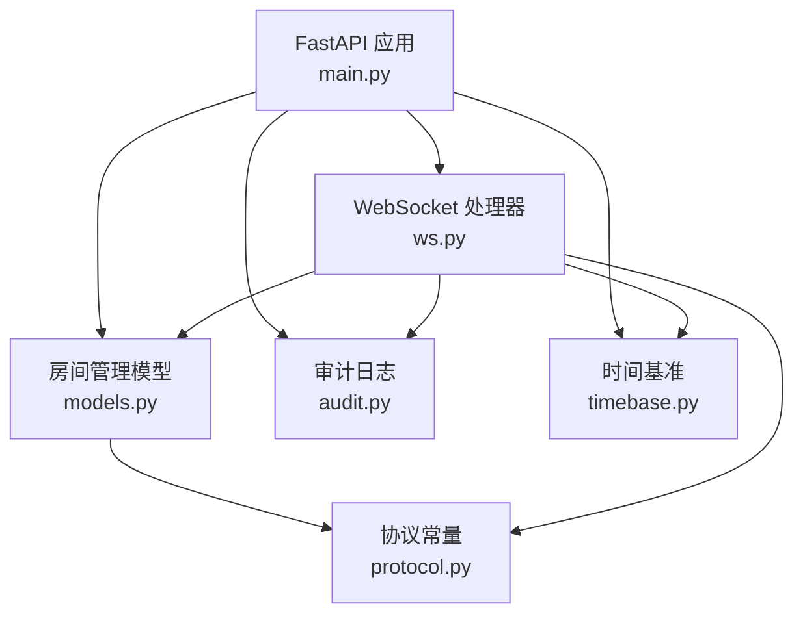
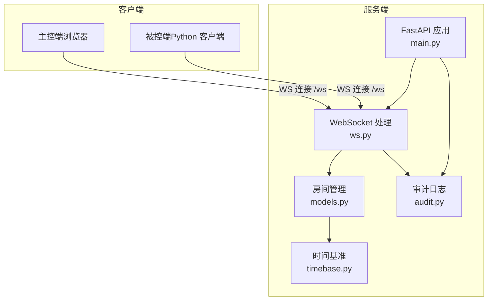
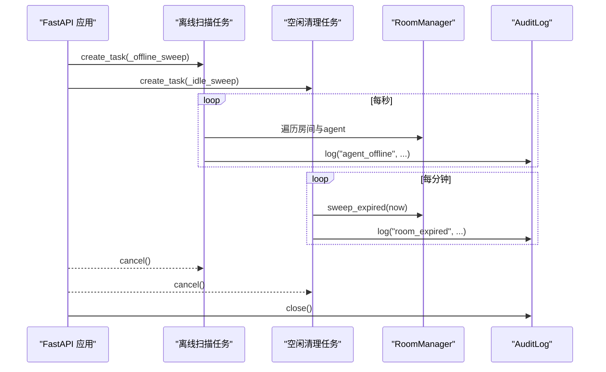
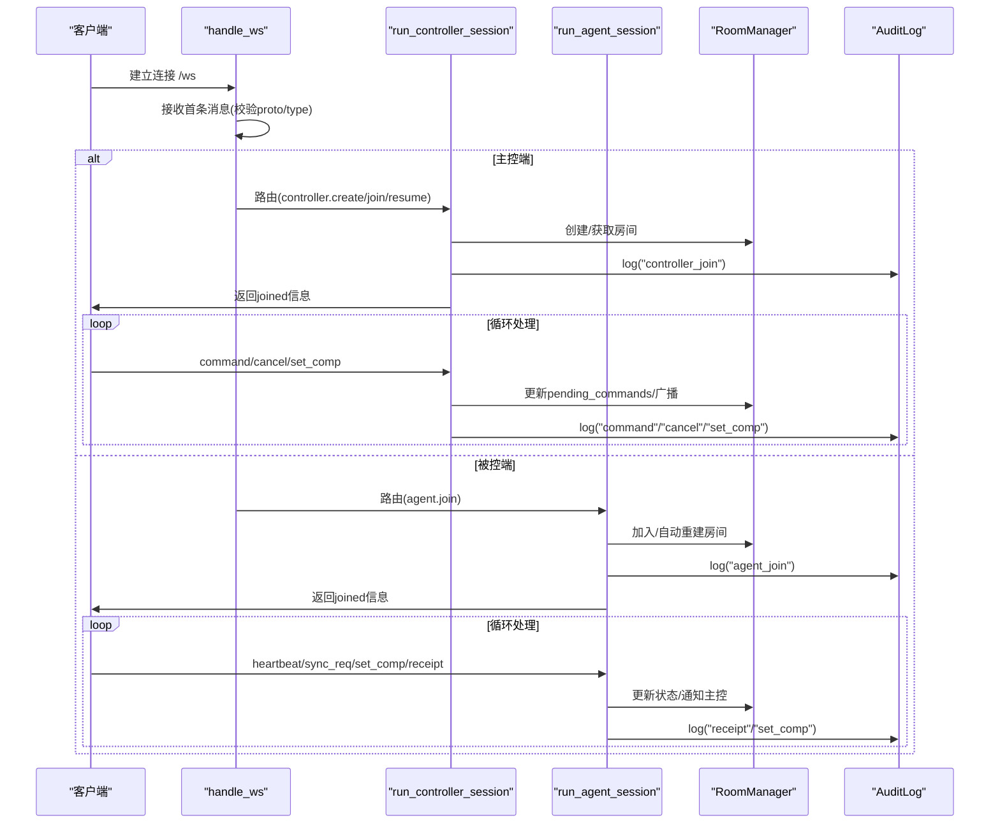
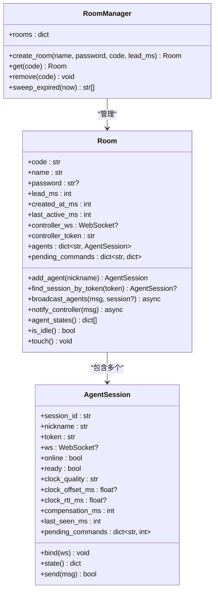
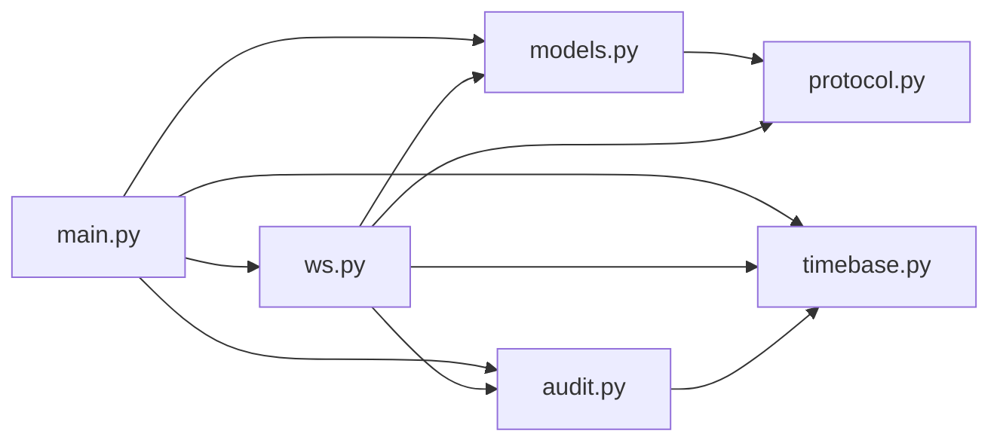

# 服务端架构设计

<cite>
**本文引用的文件**
- [server/server/main.py](file://server/server/main.py)
- [server/server/ws.py](file://server/server/ws.py)
- [server/server/models.py](file://server/server/models.py)
- [server/server/protocol.py](file://server/server/protocol.py)
- [server/server/timebase.py](file://server/server/timebase.py)
- [server/server/audit.py](file://server/server/audit.py)
- [README.md](file://README.md)
- [server/requirements.txt](file://server/requirements.txt)
- [docker-compose.yml](file://docker-compose.yml)
</cite>

## 目录
1. [简介](#简介)
2. [项目结构](#项目结构)
3. [核心组件](#核心组件)
4. [架构总览](#架构总览)
5. [详细组件分析](#详细组件分析)
6. [依赖关系分析](#依赖关系分析)
7. [性能考量](#性能考量)
8. [故障排查指南](#故障排查指南)
9. [结论](#结论)
10. [附录](#附录)

## 简介
本文件为 ScriptCue 服务端的架构文档，聚焦基于 FastAPI 的异步服务架构，涵盖应用生命周期管理、WebSocket 连接处理、房间管理系统与时钟基准服务。重点说明 RoomManager 的设计模式、内存存储策略与并发安全机制，解释心跳检测、离线标记与空闲清理等后台任务的实现原理，并提供组件交互图与数据流图，最后给出性能优化策略与扩展性考虑。

## 项目结构
服务端位于 server 目录，采用模块化组织：
- main.py：FastAPI 应用入口、生命周期钩子、健康检查、静态资源挂载
- ws.py：WebSocket 会话路由与消息分发（主控端与被控端共用 /ws）
- models.py：房间与会话模型（纯内存存储）、房间管理器
- protocol.py：协议常量与限制（消息类型、错误码、时间阈值等）
- timebase.py：服务器授时基准（毫秒级单调时间）
- audit.py：操作审计日志（JSON Lines，线程安全追加写）

**图表来源**
- [server/server/main.py:63-98](file://server/server/main.py#L63-L98)
- [server/server/ws.py:334-360](file://server/server/ws.py#L334-L360)
- [server/server/models.py:120-157](file://server/server/models.py#L120-L157)
- [server/server/protocol.py:1-80](file://server/server/protocol.py#L1-L80)
- [server/server/timebase.py:10-13](file://server/server/timebase.py#L10-L13)
- [server/server/audit.py:17-37](file://server/server/audit.py#L17-L37)

**章节来源**
- [server/server/main.py:1-98](file://server/server/main.py#L1-L98)
- [README.md:9-21](file://README.md#L9-L21)

## 核心组件
- 应用生命周期管理：通过 lifespan 启动两个后台任务（离线扫描、空闲清理），在退出时取消任务并关闭审计日志。
- WebSocket 会话处理：统一 /ws 端点，首条消息声明角色（主控端或被控端），后续按协议分派到对应处理流程。
- 房间管理系统：RoomManager 维护 rooms 字典；Room 管理 AgentSession 集合、待执行指令、控制器连接；AgentSession 表示一台被控设备会话。
- 时钟基准服务：timebase.now_ms 提供毫秒级单调时间戳，用于调度与心跳判定。
- 审计日志：AuditLog 以 JSON Lines 格式记录关键事件，线程安全写入。

**章节来源**
- [server/server/main.py:40-72](file://server/server/main.py#L40-L72)
- [server/server/ws.py:154-208](file://server/server/ws.py#L154-L208)
- [server/server/models.py:17-118](file://server/server/models.py#L17-L118)
- [server/server/timebase.py:10-13](file://server/server/timebase.py#L10-L13)
- [server/server/audit.py:17-37](file://server/server/audit.py#L17-L37)

## 架构总览
系统由三部分构成：主控端（浏览器）、被控端（Python 客户端）、服务端（FastAPI + WebSocket）。服务端负责房间管理、指令调度、状态汇聚与审计。

**图表来源**
- [server/server/main.py:78-98](file://server/server/main.py#L78-L98)
- [server/server/ws.py:334-360](file://server/server/ws.py#L334-L360)
- [server/server/models.py:120-157](file://server/server/models.py#L120-L157)
- [server/server/timebase.py:10-13](file://server/server/timebase.py#L10-L13)
- [server/server/audit.py:17-37](file://server/server/audit.py#L17-L37)

## 详细组件分析

### 应用生命周期与后台任务
- 启动阶段：创建并启动两个后台任务
  - _offline_sweep：每秒扫描房间内所有 agent，若 last_seen 超过阈值则标记离线并通知主控端，同时记录审计日志。
  - _idle_sweep：每分钟扫描房间，销毁空闲超过阈值的房间，记录审计日志。
- 退出阶段：取消后台任务，关闭审计日志。

**图表来源**
- [server/server/main.py:40-72](file://server/server/main.py#L40-L72)
- [server/server/protocol.py:75-80](file://server/server/protocol.py#L75-L80)

**章节来源**
- [server/server/main.py:40-72](file://server/server/main.py#L40-L72)

### WebSocket 连接处理与消息路由
- 统一入口 handle_ws：接受连接，等待首条消息，校验协议版本与消息类型，路由至主控端或被控端会话处理。
- 主控端会话 run_controller_session：支持创建房间、加入房间、恢复会话；处理指令下发、取消、补偿设置；维护 pending_commands 并广播给在线 agent。
- 被控端会话 run_agent_session：加入房间或自动重建；处理心跳、时钟同步、补偿设置、回执；更新在线状态并通知主控端。

**图表来源**
- [server/server/ws.py:334-360](file://server/server/ws.py#L334-L360)
- [server/server/ws.py:154-208](file://server/server/ws.py#L154-L208)
- [server/server/ws.py:246-328](file://server/server/ws.py#L246-L328)

**章节来源**
- [server/server/ws.py:1-360](file://server/server/ws.py#L1-L360)

### 房间管理系统与内存存储策略
- RoomManager：维护 rooms 字典；提供 create_room/get/remove/sweep_expired；房间码生成避免冲突。
- Room：管理 agents 字典、控制器连接、待执行指令；提供 add_agent/broadcast_agents/notify_controller/agent_states/is_idle/touch。
- AgentSession：代表一台被控设备；维护 token、online/ready、时钟质量与偏移、补偿值、last_seen、pending_commands；提供 bind/send/state。

**图表来源**
- [server/server/models.py:17-118](file://server/server/models.py#L17-L118)
- [server/server/models.py:120-157](file://server/server/models.py#L120-L157)

**章节来源**
- [server/server/models.py:17-157](file://server/server/models.py#L17-L157)

### 时钟基准服务
- now_ms：使用 time.time_ns() // 1_000_000 提供毫秒级单调时间戳，跨平台可用，满足高精度调度需求。
- 用途：心跳超时判定、指令 at 时刻计算、房间活跃时间戳更新。

**章节来源**
- [server/server/timebase.py:1-13](file://server/server/timebase.py#L1-L13)

### 审计日志
- AuditLog：JSON Lines 格式，记录事件时间戳与字段；使用 threading.Lock 保证多线程安全；异常时记录日志但不中断主流程。
- 记录事件：agent_offline、room_expired、controller_join/leave、agent_join/disconnect、command/cancel/set_comp/receipt 等。

**章节来源**
- [server/server/audit.py:1-37](file://server/server/audit.py#L1-L37)

### 协议常量与限制
- 消息类型：主控端/被控端/服务器→两端各类消息类型常量。
- 指令类型：play/pause/test，VALID_COMMANDS 限定可执行指令。
- 错误码：bad_proto、room_not_found、bad_password、room_full、not_controller、bad_command、no_such_agent、bad_message。
- 限制：每房间最大 agent 数、房间码长度与字符集、空闲 TTL、心跳间隔、离线判定阈值、回执超时、状态推送节流。

**章节来源**
- [server/server/protocol.py:1-80](file://server/server/protocol.py#L1-L80)

## 依赖关系分析
- main.py 依赖 ws、models、audit、timebase、protocol。
- ws.py 依赖 protocol、audit、models、timebase。
- models.py 依赖 protocol、timebase。
- audit.py 依赖 timebase。
- timebase.py 无外部依赖。
- protocol.py 无运行时依赖（仅常量定义）。

**图表来源**
- [server/server/main.py:22-27](file://server/server/main.py#L22-L27)
- [server/server/ws.py:15-18](file://server/server/ws.py#L15-L18)
- [server/server/models.py:9-10](file://server/server/models.py#L9-L10)
- [server/server/audit.py:12](file://server/server/audit.py#L12)

**章节来源**
- [server/server/main.py:22-27](file://server/server/main.py#L22-L27)
- [server/server/ws.py:15-18](file://server/server/ws.py#L15-L18)
- [server/server/models.py:9-10](file://server/server/models.py#L9-L10)
- [server/server/audit.py:12](file://server/server/audit.py#L12)

## 性能考量
- 异步 I/O：FastAPI + Uvicorn 提供高并发 WebSocket 处理能力；消息收发与房间操作均为异步。
- 内存存储：房间与会话数据驻留内存，读写延迟极低；重启后由客户端自动重建房间，降低持久化开销。
- 后台任务：离线扫描与空闲清理使用 asyncio.sleep 周期执行，避免阻塞请求路径。
- 指令调度：通过绝对时刻 at 与回执窗口控制，减少重复广播与无效重试。
- 节流与限流：AGENT_PUSH_THROTTLE_S 可用于状态推送节流（当前未启用），防止主控端过载。
- 日志写入：审计日志使用线程锁保护，顺序追加写，适合低吞吐场景。

[本节为通用性能讨论，不直接分析具体代码行]

## 故障排查指南
- 心跳超时离线：检查被控端是否按时发送心跳；确认 AGENT_OFFLINE_S 阈值与网络状况；查看审计日志中的 agent_offline 事件。
- 房间不存在或口令错误：确认房间码与密码；检查主控端是否正确传递 room_code/password/token。
- 指令未执行：核对指令提前量 lead_ms 与回执超时 RECEIPT_TIMEOUT_MS；检查被控端是否收到 CMD_EXEC 并正确回执。
- 房间未销毁：确认空闲清理任务是否运行；检查 is_idle 逻辑与 ROOM_IDLE_TTL_S 配置。
- 审计日志写入失败：检查磁盘空间与权限；关注 OSError 异常日志。

**章节来源**
- [server/server/main.py:40-61](file://server/server/main.py#L40-L61)
- [server/server/ws.py:117-152](file://server/server/ws.py#L117-L152)
- [server/server/audit.py:24-33](file://server/server/audit.py#L24-L33)

## 结论
ScriptCue 服务端采用 FastAPI 异步架构，结合内存房间管理与精确时钟基准，实现了高并发、低延迟的多设备同步起播能力。RoomManager 以简洁的数据结构与清晰的职责划分支撑了房间与会话的生命周期管理；后台任务保障离线检测与资源回收；审计日志提供可追溯的事件记录。整体设计具备良好的扩展性与可维护性，适用于演出场景下的多端协同。

[本节为总结性内容，不直接分析具体代码行]

## 附录
- 部署方式：可通过 pip 安装依赖并使用 uvicorn 启动，或使用 Docker/Docker Compose 部署。
- 环境变量：SC_DATA_DIR（审计日志目录）、SC_CONTROLLER_DIR（主控端静态目录）、SC_DEFAULT_LEAD_MS（默认提前量）。
- 依赖包：fastapi、uvicorn[standard]。

**章节来源**
- [README.md:36-55](file://README.md#L36-L55)
- [server/server/main.py:6-10](file://server/server/main.py#L6-L10)
- [server/requirements.txt:1-3](file://server/requirements.txt#L1-L3)
- [docker-compose.yml:1-15](file://docker-compose.yml#L1-L15)