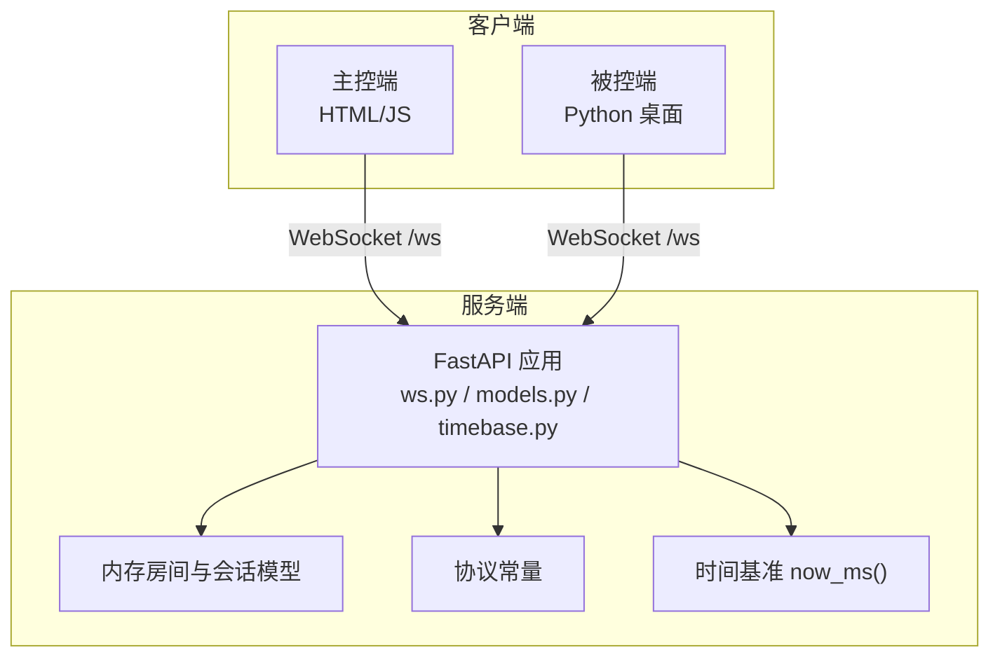
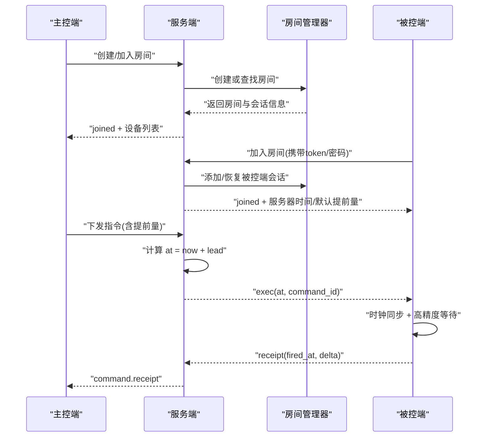
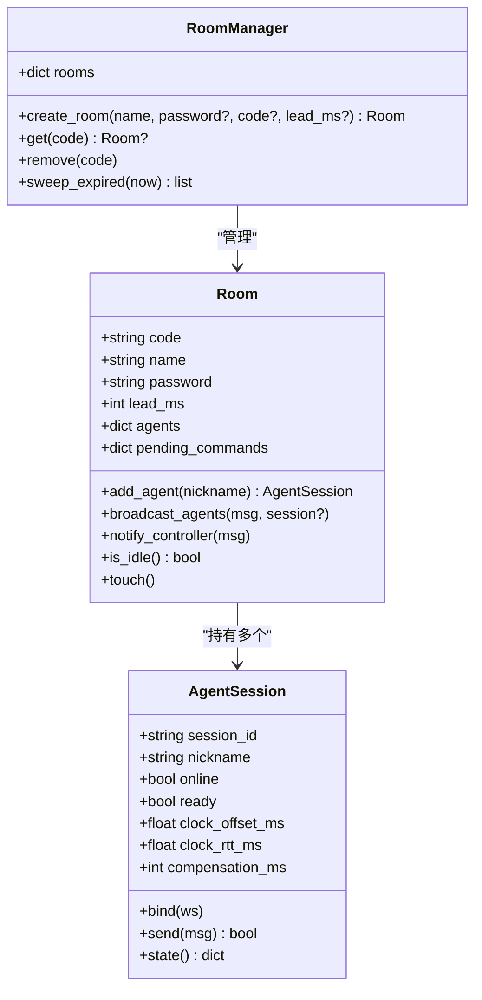
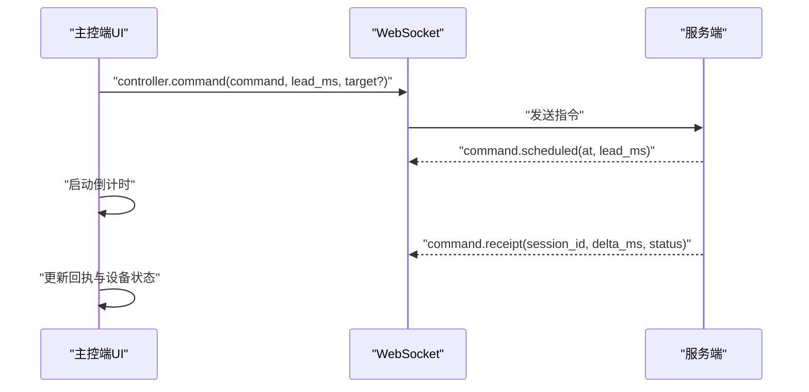
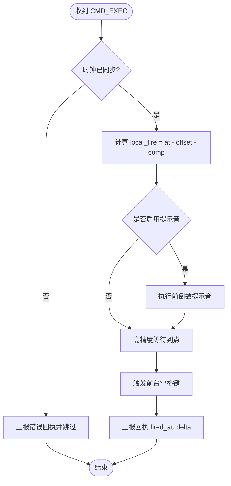
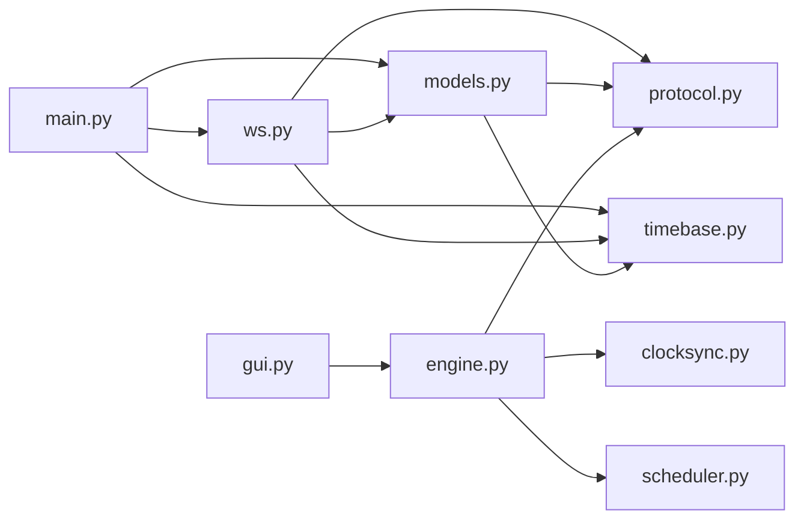

# 系统架构设计

<cite>
**本文引用的文件**
- [README.md](file://README.md)
- [docker-compose.yml](file://docker-compose.yml)
- [server/main.py](file://server/server/main.py)
- [server/ws.py](file://server/server/ws.py)
- [server/models.py](file://server/server/models.py)
- [server/protocol.py](file://server/server/protocol.py)
- [server/timebase.py](file://server/server/timebase.py)
- [controller/index.html](file://controller/index.html)
- [controller/app.js](file://controller/app.js)
- [agent/engine.py](file://agent/agent/engine.py)
- [agent/clocksync.py](file://agent/agent/clocksync.py)
- [agent/scheduler.py](file://agent/agent/scheduler.py)
- [agent/gui.py](file://agent/agent/gui.py)
- [agent/protocol.py](file://agent/agent/protocol.py)
</cite>

## 目录
1. [简介](#简介)
2. [项目结构](#项目结构)
3. [核心组件](#核心组件)
4. [架构总览](#架构总览)
5. [详细组件分析](#详细组件分析)
6. [依赖关系分析](#依赖关系分析)
7. [性能考量](#性能考量)
8. [故障排查指南](#故障排查指南)
9. [结论](#结论)
10. [附录](#附录)

## 简介
本架构文档面向 ScriptCue 多设备口述影像同步起播系统，覆盖整体系统设计、架构模式与系统边界，并详细说明服务端（FastAPI + WebSocket）、主控端（原生 HTML/JS）与被控端（Python 桌面应用）的职责与交互。重点解释房间管理、WebSocket 长连接、时钟同步、指令调度与状态监控等子系统的设计思路，给出系统上下文图与组件分解图，总结技术决策、权衡与约束，并涵盖基础设施要求、可扩展性与部署拓扑。

## 项目结构
仓库采用按职责分层的模块化组织：
- server：云端服务，提供房间管理、WebSocket 会话、指令广播、时钟基准、审计日志与静态页面托管。
- controller：主控端网页，由服务端静态托管，用于创建/加入房间、下发指令、查看回执与设备状态。
- agent：被控端 Python 桌面应用，负责与服务器建立 WebSocket 连接、进行类 NTP 时钟同步、高精度定时触发前台按键，并向主控端上报状态与回执。
- docs：协议与使用文档（不在代码中展开）。
- docker-compose.yml：一键编排服务端容器化部署。

图表来源
- [server/main.py:1-98](file://server/server/main.py#L1-L98)
- [server/ws.py:1-360](file://server/server/ws.py#L1-L360)
- [server/models.py:1-157](file://server/server/models.py#L1-L157)
- [server/protocol.py:1-80](file://server/server/protocol.py#L1-L80)
- [server/timebase.py:1-13](file://server/server/timebase.py#L1-L13)
- [controller/index.html:1-98](file://controller/index.html#L1-L98)
- [controller/app.js:1-522](file://controller/app.js#L1-L522)
- [agent/engine.py:1-388](file://agent/agent/engine.py#L1-L388)

章节来源
- [README.md:1-86](file://README.md#L1-L86)
- [docker-compose.yml:1-15](file://docker-compose.yml#L1-L15)

## 核心组件
- 服务端（FastAPI + WebSocket）
  - 职责：房间生命周期管理、主控端与被控端会话路由、指令调度与广播、时钟基准、心跳离线检测、空闲房间回收、审计日志、静态页面托管。
  - 关键实现：入口与生命周期任务、WebSocket 路由与消息分发、房间与会话模型、时间基准。
- 主控端（原生 HTML/JS）
  - 职责：创建/加入房间、显示设备列表与时钟质量、长按防误触下发指令、倒计时与回执汇总、断线自动重连。
  - 关键实现：WebSocket 连接管理、消息派发、UI 渲染与交互。
- 被控端（Python 桌面应用）
  - 职责：加入房间、类 NTP 时钟同步、高精度定时到点触发前台窗口空格键、心跳上报、补偿值设置、回执上报。
  - 关键实现：引擎主循环、时钟同步模块、高精度调度器、GUI 界面与事件轮询。

章节来源
- [server/main.py:1-98](file://server/server/main.py#L1-L98)
- [server/ws.py:1-360](file://server/server/ws.py#L1-L360)
- [server/models.py:1-157](file://server/server/models.py#L1-L157)
- [controller/index.html:1-98](file://controller/index.html#L1-L98)
- [controller/app.js:1-522](file://controller/app.js#L1-L522)
- [agent/engine.py:1-388](file://agent/agent/engine.py#L1-L388)
- [agent/clocksync.py:1-106](file://agent/agent/clocksync.py#L1-L106)
- [agent/scheduler.py:1-59](file://agent/agent/scheduler.py#L1-L59)
- [agent/gui.py:1-464](file://agent/agent/gui.py#L1-L464)

## 架构总览
系统采用“服务端集中式协调 + 两端直连 WebSocket”的架构模式。主控端与被控端通过同一 WebSocket 端点接入，首条消息声明角色后进入各自会话处理流程。指令以“绝对执行时刻 + 提前量”的方式下发，被控端基于本地时钟偏移与补偿值进行高精度触发，并通过回执反馈执行结果。

图表来源
- [server/ws.py:67-134](file://server/server/ws.py#L67-L134)
- [server/ws.py:246-327](file://server/server/ws.py#L246-L327)
- [agent/engine.py:159-192](file://agent/agent/engine.py#L159-L192)
- [agent/engine.py:297-379](file://agent/agent/engine.py#L297-L379)
- [controller/app.js:83-134](file://controller/app.js#L83-L134)

## 详细组件分析

### 服务端：房间管理与 WebSocket 会话
- 房间与会话模型
  - Room：维护房间码、名称、口令、默认提前量、在线主控连接、被控端会话集合、待执行指令队列；支持广播与通知主控。
  - AgentSession：单台被控端设备的会话，包含在线状态、就绪标记、时钟质量、偏移、RTT、补偿值、最近心跳时间与待执行指令映射。
  - RoomManager：房间集合、随机房间码生成、空闲房间扫描销毁。
- WebSocket 会话处理
  - 统一 /ws 端点，首条消息校验协议版本并路由至主控或被控会话。
  - 主控会话：创建/加入/恢复房间，下发指令（带提前量），取消指令，远程设置补偿值。
  - 被控会话：时钟同步应答、心跳上报、补偿值设置、回执上报。
  - 后台任务：离线检测（心跳超时标记离线并通知主控）、空闲房间回收（24h）。
- 时间基准
  - 统一使用 now_ms() 作为所有协议时间的权威来源。

图表来源
- [server/models.py:17-157](file://server/server/models.py#L17-L157)

章节来源
- [server/models.py:1-157](file://server/server/models.py#L1-L157)
- [server/ws.py:1-360](file://server/server/ws.py#L1-L360)
- [server/main.py:1-98](file://server/server/main.py#L1-L98)
- [server/timebase.py:1-13](file://server/server/timebase.py#L1-L13)

### 主控端：房间控制台与指令流
- 连接与会话恢复
  - 首次创建/加入房间，获得 token；断线后使用 token 恢复会话。
- 指令下发与回执
  - 长按防误触发送指令，服务端返回 scheduled；收到 receipt 后更新设备卡片与回执表。
- 倒计时与超时
  - 根据 at 与服务端时间差展示倒计时；到期后等待回执窗口，最终汇总未回执设备状态。

图表来源
- [controller/app.js:316-389](file://controller/app.js#L316-L389)
- [controller/app.js:479-518](file://controller/app.js#L479-L518)
- [server/ws.py:67-134](file://server/server/ws.py#L67-L134)

章节来源
- [controller/index.html:1-98](file://controller/index.html#L1-L98)
- [controller/app.js:1-522](file://controller/app.js#L1-L522)

### 被控端：时钟同步、高精度调度与触发
- 时钟同步（类 NTP）
  - 密集采样（加入房间后多次 ping）+ 维持性采样；取 RTT 最小的新鲜样本作为可信偏移；质量分级随心跳上报。
- 指令调度与触发
  - 收到 exec(at) 后，换算本地触发时刻 local_fire = at - offset - compensation；使用“粗睡眠 + 末段自旋”策略精确到点触发。
  - 触发前播放提示音（可选），完成后上报回执 fired_at 与状态。
- GUI 与事件轮询
  - tkinter 界面展示连接状态、时钟质量、补偿值、倒计时；线程安全回调引擎事件并刷新 UI。

图表来源
- [agent/engine.py:297-379](file://agent/agent/engine.py#L297-L379)
- [agent/clocksync.py:29-106](file://agent/agent/clocksync.py#L29-L106)
- [agent/scheduler.py:33-59](file://agent/agent/scheduler.py#L33-L59)

章节来源
- [agent/engine.py:1-388](file://agent/agent/engine.py#L1-L388)
- [agent/clocksync.py:1-106](file://agent/agent/clocksync.py#L1-L106)
- [agent/scheduler.py:1-59](file://agent/agent/scheduler.py#L1-L59)
- [agent/gui.py:1-464](file://agent/agent/gui.py#L1-L464)

### 协议与常量
- 服务端与被控端各自维护协议常量副本，确保消息类型、指令类型、错误码、限制参数一致。
- 关键常量包括：消息类型、指令类型、时钟质量等级、错误码、房间上限、心跳间隔、离线判定阈值、回执超时、默认提前量等。

章节来源
- [server/protocol.py:1-80](file://server/server/protocol.py#L1-L80)
- [agent/protocol.py:1-80](file://agent/agent/protocol.py#L1-L80)

## 依赖关系分析
- 服务端内部依赖
  - main.py 依赖 ws.py、models.py、timebase.py、protocol.py。
  - ws.py 依赖 protocol.py、audit（未在当前片段展开）、models.py、timebase.py。
  - models.py 依赖 protocol.py、timebase.py。
- 主控端依赖
  - app.js 直接操作 DOM 与 WebSocket，无外部框架依赖。
- 被控端依赖
  - engine.py 依赖 clocksync.py、scheduler.py、protocol.py、timeutil（未在当前片段展开）。
  - gui.py 依赖 engine.py、keysender（未在当前片段展开）、protocol.py。

图表来源
- [server/main.py:1-98](file://server/server/main.py#L1-L98)
- [server/ws.py:1-360](file://server/server/ws.py#L1-L360)
- [server/models.py:1-157](file://server/server/models.py#L1-L157)
- [agent/engine.py:1-388](file://agent/agent/engine.py#L1-L388)
- [agent/clocksync.py:1-106](file://agent/agent/clocksync.py#L1-L106)
- [agent/scheduler.py:1-59](file://agent/agent/scheduler.py#L1-L59)
- [agent/gui.py:1-464](file://agent/agent/gui.py#L1-L464)

章节来源
- [server/main.py:1-98](file://server/server/main.py#L1-L98)
- [server/ws.py:1-360](file://server/server/ws.py#L1-L360)
- [server/models.py:1-157](file://server/server/models.py#L1-L157)
- [agent/engine.py:1-388](file://agent/agent/engine.py#L1-L388)

## 性能考量
- 时钟同步精度
  - 采用类 NTP 算法，取 RTT 最小样本作为可信偏移；密集采样快速收敛，维持性采样抑制漂移。
  - 质量分级依据样本数量与 RTT 阈值，便于主控端可视化评估。
- 高精度触发
  - 使用“粗睡眠 + 末段自旋”策略，避免 OS 调度误差导致的大抖动；Windows 下提升系统定时器分辨率改善 sleep 精度。
- 心跳与离线判定
  - 固定心跳间隔，服务端在 3 次心跳无响应后标记离线并通知主控；减少无效推送与资源占用。
- 指令调度与回执
  - 提前量可配置，保证网络抖动不破坏同步精度；回执超时窗口内聚合结果，避免长时间阻塞。
- 房间与内存
  - 纯内存存储，重启后由客户端自动重建房间；适合轻量级部署，但需考虑持久化需求时的扩展。

[本节为通用性能讨论，不直接分析具体文件]

## 故障排查指南
- 连接与协议问题
  - 首条消息必须为 JSON 对象且协议版本匹配；否则服务端返回错误并关闭连接。
  - 主控端断线后使用 token 恢复；若房间不存在或令牌失效，回到首页重新创建/加入。
- 房间与会话
  - 房间满员时拒绝新被控端加入；口令错误将被拒绝。
  - 空闲房间超过 24h 自动销毁；主控离开或被控全部离线将触发销毁计时。
- 时钟同步与触发
  - 若时钟未同步，被控端会跳过触发并上报错误回执；检查时钟质量与 RTT。
  - 补偿值范围受限，非法输入会被拒绝；可通过主控端远程设置或本地修改。
- 审计与日志
  - 服务端记录命令、取消、回执、设备上下线等事件；数据目录可通过环境变量配置。

章节来源
- [server/ws.py:50-60](file://server/server/ws.py#L50-L60)
- [server/ws.py:154-185](file://server/server/ws.py#L154-L185)
- [server/ws.py:246-327](file://server/server/ws.py#L246-L327)
- [server/main.py:40-61](file://server/server/main.py#L40-L61)
- [agent/engine.py:297-379](file://agent/agent/engine.py#L297-L379)

## 结论
ScriptCue 通过“服务端集中协调 + 两端直连 WebSocket”的架构，实现了多设备在公网环境下的低延迟同步起播。核心优势在于：
- 明确的职责划分：服务端负责房间与会话、指令调度与时间基准；主控端负责控制与可视化；被控端负责高精度触发与状态上报。
- 可靠的时钟同步与调度：类 NTP 采样与“粗睡眠 + 末段自旋”确保 ≤50ms 精度的同步触发。
- 简洁易部署：纯内存房间、Docker 化部署、原生前端无构建步骤。
约束与权衡：
- 内存存储意味着重启后房间丢失，依赖客户端自动重建；如需持久化需引入外部存储。
- 高并发场景下需评估 WebSocket 连接数与 CPU 占用，必要时横向扩展服务端实例。

[本节为总结性内容，不直接分析具体文件]

## 附录
- 基础设施要求
  - Python ≥ 3.10（服务端与被控端）；可选 Docker 用于服务端部署。
  - 端口 8000 暴露 WebSocket 与静态页面。
- 部署拓扑
  - 单容器部署：docker-compose 启动 scriptcue-server，挂载数据卷保存审计日志。
  - 浏览器访问 http(s)://<服务器地址>:8000/ 打开主控端；被控端通过命令行或 GUI 加入房间。
- 可扩展性考虑
  - 水平扩展：多进程/多实例部署时需引入共享状态（如 Redis）以支持房间跨实例可见与负载均衡。
  - 持久化：将房间与会话状态落盘，避免重启后依赖客户端重建。
  - 监控：增加指标采集（连接数、指令吞吐、回执成功率、时钟质量分布）。

章节来源
- [README.md:29-79](file://README.md#L29-L79)
- [docker-compose.yml:1-15](file://docker-compose.yml#L1-L15)