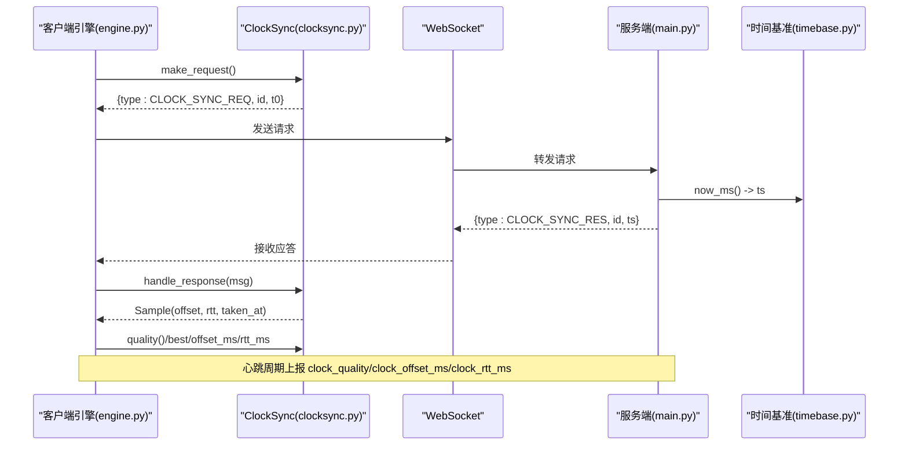
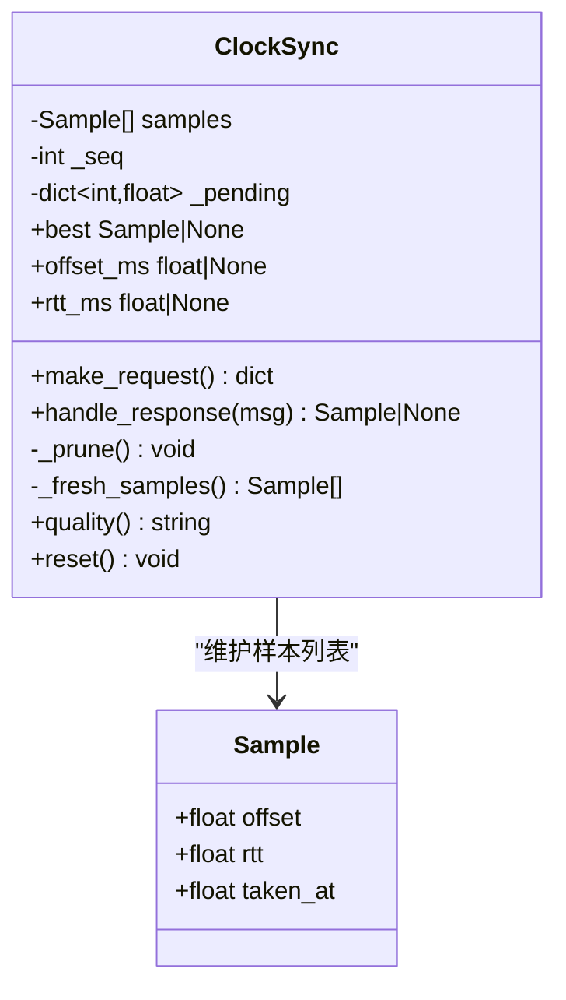
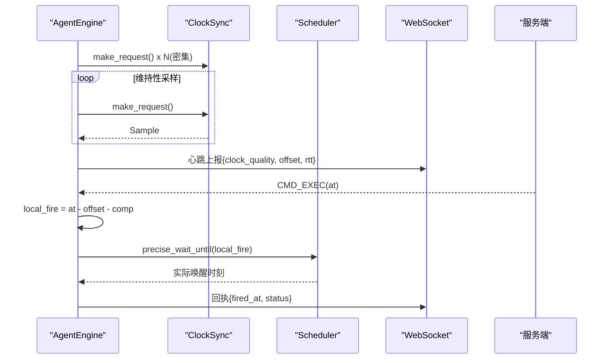
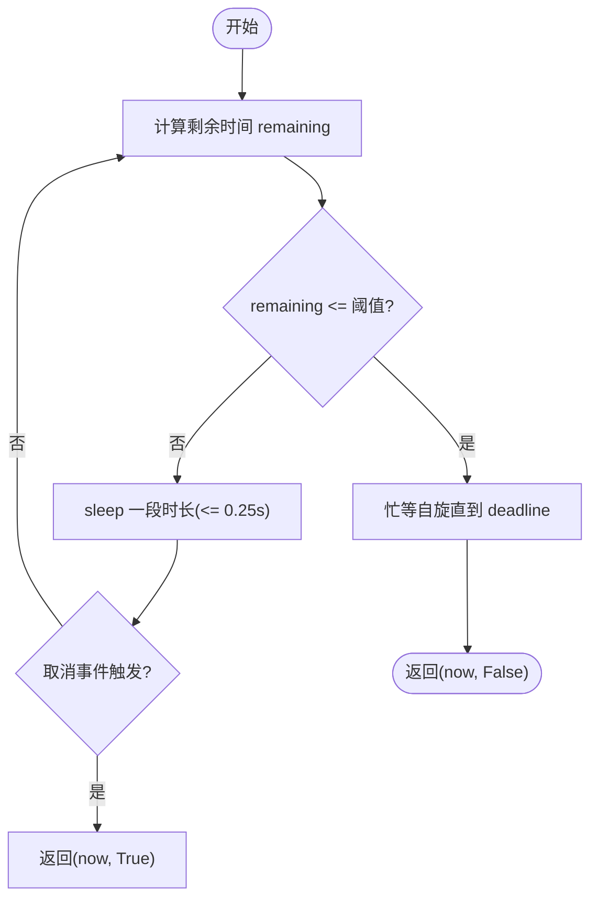
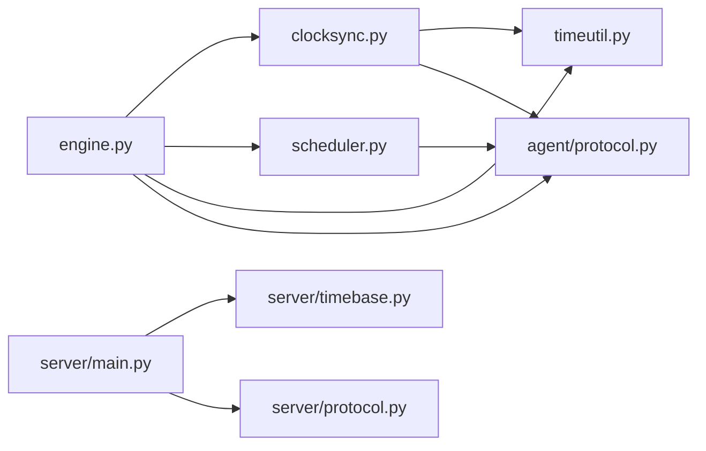

# NTP风格同步算法

<cite>
**本文引用的文件**
- [agent/agent/clocksync.py](file://agent/agent/clocksync.py)
- [agent/agent/engine.py](file://agent/agent/engine.py)
- [agent/agent/scheduler.py](file://agent/agent/scheduler.py)
- [agent/agent/timeutil.py](file://agent/agent/timeutil.py)
- [agent/agent/protocol.py](file://agent/agent/protocol.py)
- [server/server/timebase.py](file://server/server/timebase.py)
- [server/server/protocol.py](file://server/server/protocol.py)
- [server/server/main.py](file://server/server/main.py)
</cite>

## 目录
1. [简介](#简介)
2. [项目结构](#项目结构)
3. [核心组件](#核心组件)
4. [架构总览](#架构总览)
5. [详细组件分析](#详细组件分析)
6. [依赖关系分析](#依赖关系分析)
7. [性能考量](#性能考量)
8. [故障排查指南](#故障排查指南)
9. [结论](#结论)
10. [附录：数学推导与伪代码](#附录数学推导与伪代码)

## 简介
本仓库实现了一套“类 NTP”的时钟同步机制，用于在客户端（被控端）与服务端之间估计时钟偏移并据此进行高精度绝对时刻调度。其核心思想是：
- 客户端发送携带本地发出时间 t0 的请求；
- 服务端返回服务器时间 ts；
- 客户端记录收到时间 t1；
- 估算偏移 offset = ts - (t0 + t1)/2，往返时延 rtt = t1 - t0；
- 通过多次采样、保留新鲜样本并按 RTT 最小选择可信样本，降低网络抖动影响；
- 基于质量评分（excellent/good/fair/poor）评估当前同步可靠性；
- 使用“密集采样 + 维持性采样”策略快速收敛并保持长期稳定。

该方案在工程上兼顾了低开销与高鲁棒性，适用于对触发精度有严格要求的场景。

## 项目结构
与 NTP 风格同步相关的关键模块分布如下：
- 客户端侧
  - clocksync.py：NTP 风格采样、偏移估计、质量评估、样本管理
  - engine.py：连接生命周期、心跳上报、密集/维持性采样调度、命令触发
  - scheduler.py：高精度等待（粗睡眠 + 末段自旋），保障触发精度
  - timeutil.py：本地毫秒时间戳
  - protocol.py：协议常量（消息类型、质量等级、采样参数等）
- 服务端侧
  - timebase.py：服务器毫秒时间基准
  - protocol.py：服务端权威协议常量
  - main.py：WebSocket 入口，启动后台任务

```mermaid
graph TB
subgraph "客户端"
A["engine.py<br/>连接/心跳/调度"]
B["clocksync.py<br/>NTP采样/偏移/质量"]
C["scheduler.py<br/>高精度等待"]
D["timeutil.py<br/>now_ms()"]
E["protocol.py<br/>常量/参数"]
end
subgraph "服务端"
F["main.py<br/>WS入口"]
G["timebase.py<br/>now_ms()"]
H["protocol.py<br/>常量/参数"]
end
A --> B
A --> C
A --> D
A --> E
A < --> F
F --> G
F --> H
```

**图表来源**
- [agent/agent/engine.py:106-211](file://agent/agent/engine.py#L106-L211)
- [agent/agent/clocksync.py:29-105](file://agent/agent/clocksync.py#L29-L105)
- [agent/agent/scheduler.py:33-58](file://agent/agent/scheduler.py#L33-L58)
- [agent/agent/timeutil.py:9-11](file://agent/agent/timeutil.py#L9-L11)
- [agent/agent/protocol.py:75-79](file://agent/agent/protocol.py#L75-L79)
- [server/server/main.py:88-90](file://server/server/main.py#L88-L90)
- [server/server/timebase.py:10-12](file://server/server/timebase.py#L10-L12)
- [server/server/protocol.py:75-79](file://server/server/protocol.py#L75-L79)

**章节来源**
- [agent/agent/engine.py:106-211](file://agent/agent/engine.py#L106-L211)
- [agent/agent/clocksync.py:29-105](file://agent/agent/clocksync.py#L29-L105)
- [agent/agent/scheduler.py:33-58](file://agent/agent/scheduler.py#L33-L58)
- [agent/agent/timeutil.py:9-11](file://agent/agent/timeutil.py#L9-L11)
- [agent/agent/protocol.py:75-79](file://agent/agent/protocol.py#L75-L79)
- [server/server/main.py:88-90](file://server/server/main.py#L88-L90)
- [server/server/timebase.py:10-12](file://server/server/timebase.py#L10-L12)
- [server/server/protocol.py:75-79](file://server/server/protocol.py#L75-L79)

## 核心组件
- ClockSync（NTP 风格同步器）
  - 维护样本队列，支持 make_request/handle_response/best/quality/reset
  - 样本按 RTT 排序裁剪，保证内存可控且保留最优样本
  - 新鲜度过滤避免陈旧路由导致的偏差
- AgentEngine（同步引擎）
  - 负责建立 WebSocket 连接、加入房间、心跳上报
  - 启动密集采样与维持性采样协程
  - 将时钟偏移应用到绝对时刻调度中
- Scheduler（高精度等待）
  - 采用“粗睡眠 + 末段自旋”策略，确保触发误差亚毫秒级
- 时间工具
  - 客户端与服务端分别提供 now_ms()，保证时间戳一致性

**章节来源**
- [agent/agent/clocksync.py:29-105](file://agent/agent/clocksync.py#L29-L105)
- [agent/agent/engine.py:106-211](file://agent/agent/engine.py#L106-L211)
- [agent/agent/scheduler.py:33-58](file://agent/agent/scheduler.py#L33-L58)
- [agent/agent/timeutil.py:9-11](file://agent/agent/timeutil.py#L9-L11)
- [server/server/timebase.py:10-12](file://server/server/timebase.py#L10-L12)

## 架构总览
下图展示了从客户端发起请求到服务端应答、再到偏移估计与调度的完整流程。



**图表来源**
- [agent/agent/engine.py:198-211](file://agent/agent/engine.py#L198-L211)
- [agent/agent/clocksync.py:37-55](file://agent/agent/clocksync.py#L37-L55)
- [server/server/main.py:88-90](file://server/server/main.py#L88-L90)
- [server/server/timebase.py:10-12](file://server/server/timebase.py#L10-L12)

## 详细组件分析

### ClockSync：NTP 风格采样与偏移估计
- 多次采样策略
  - 每次请求记录本地 t0，收到应答后记录 t1，计算 rtt = t1 - t0；
  - 偏移 offset = ts - (t0 + t1)/2；
  - 样本带 taken_at 时间戳，支持新鲜度过滤；
  - 样本总量上限 SAMPLE_KEEP_MAX，按 RTT 排序保留最优的一半，减少内存占用同时保留高质量样本。
- 可信偏移选择
  - best 属性从新鲜样本中选择 rtt 最小的样本作为可信偏移；
  - 若新鲜样本为空，回退到全部样本，避免无数据时的空指针。
- 质量评分机制
  - 依据新鲜样本数量 n 与 best.rtt 判断：
    - excellent：n >= 10 且 best.rtt <= 80 ms
    - good：n >= 5 且 best.rtt <= 200 ms
    - poor：其他情况
    - none：无有效样本
  - 该分级随心跳上报，供主控端评估同步质量。
- 维护性
  - reset 清空历史样本，重连后重新密集采样，避免旧路由影响。



**图表来源**
- [agent/agent/clocksync.py:22-105](file://agent/agent/clocksync.py#L22-L105)

**章节来源**
- [agent/agent/clocksync.py:29-105](file://agent/agent/clocksync.py#L29-L105)

### AgentEngine：同步调度与心跳上报
- 连接与生命周期
  - run() 主循环负责连接、异常处理、指数退避重连；
  - _connect_and_serve() 建立 WebSocket，启动三个协程：密集采样、心跳、维持性采样。
- 密集采样 vs 维持性采样
  - 密集采样：加入房间后立即连续发送 DENSE_SYNC_SAMPLES 次请求，间隔 DENSE_SYNC_INTERVAL_MS，快速收敛偏移；
  - 维持性采样：周期性发送请求（MAINTAIN_SYNC_INTERVAL_S），抑制时钟漂移。
- 心跳上报
  - 每 HEARTBEAT_INTERVAL_S 秒上报 clock_quality、clock_offset_ms、clock_rtt_ms、compensation_ms；
  - 状态变化时立即补发一次心跳。
- 绝对时刻调度
  - 收到 CMD_EXEC 后，根据 offset 和 compensation 计算 local_fire；
  - 使用 scheduler.precise_wait_until 精确等待；
  - 触发后上报回执，包含 fired_at 与 delta_ms。



**图表来源**
- [agent/agent/engine.py:198-211](file://agent/agent/engine.py#L198-L211)
- [agent/agent/engine.py:217-241](file://agent/agent/engine.py#L217-L241)
- [agent/agent/engine.py:297-379](file://agent/agent/engine.py#L297-L379)
- [agent/agent/scheduler.py:33-58](file://agent/agent/scheduler.py#L33-L58)

**章节来源**
- [agent/agent/engine.py:106-211](file://agent/agent/engine.py#L106-L211)
- [agent/agent/engine.py:217-241](file://agent/agent/engine.py#L217-L241)
- [agent/agent/engine.py:297-379](file://agent/agent/engine.py#L297-L379)

### Scheduler：高精度等待
- 策略
  - 距离目标较远时使用 sleep 粗等待，最大切片 COARSE_SLEEP_CHUNK_S 保证取消响应及时；
  - 进入最后 SPIN_THRESHOLD_MS 毫秒切换为忙等自旋，逼近目标时刻；
  - Windows 下提升系统定时器分辨率，改善 sleep 精度。
- 返回值
  - 返回 (实际醒来时刻, 是否被取消)，便于上层做取消逻辑。



**图表来源**
- [agent/agent/scheduler.py:33-58](file://agent/agent/scheduler.py#L33-L58)

**章节来源**
- [agent/agent/scheduler.py:33-58](file://agent/agent/scheduler.py#L33-L58)

### 时间基准与协议常量
- 客户端 timeutil.now_ms() 与服务端 timebase.now_ms() 均提供毫秒级 Unix 时间戳，保证两端时间一致；
- 协议常量定义消息类型、质量等级、采样参数（DENSE_SYNC_SAMPLES、DENSE_SYNC_INTERVAL_MS、MAINTAIN_SYNC_INTERVAL_S、SPIN_THRESHOLD_MS）。

**章节来源**
- [agent/agent/timeutil.py:9-11](file://agent/agent/timeutil.py#L9-L11)
- [server/server/timebase.py:10-12](file://server/server/timebase.py#L10-L12)
- [agent/agent/protocol.py:75-79](file://agent/agent/protocol.py#L75-L79)
- [server/server/protocol.py:75-79](file://server/server/protocol.py#L75-L79)

## 依赖关系分析
- 耦合与内聚
  - ClockSync 仅依赖 timeutil 与 protocol，内聚度高；
  - Engine 组合 ClockSync、Scheduler、Protocol，承担编排职责；
  - Scheduler 独立于同步逻辑，专注高精度等待；
  - 服务端 main 仅暴露 WS 入口，时间基准由 timebase 提供。
- 外部依赖
  - websockets 用于通信；
  - asyncio 事件循环驱动异步任务；
  - threading.Event 用于取消信号。
- 潜在循环依赖
  - 各模块单向依赖，未见循环引用。



**图表来源**
- [agent/agent/engine.py:19-23](file://agent/agent/engine.py#L19-L23)
- [agent/agent/clocksync.py:11-14](file://agent/agent/clocksync.py#L11-L14)
- [agent/agent/scheduler.py:17-18](file://agent/agent/scheduler.py#L17-L18)
- [server/server/main.py:22-26](file://server/server/main.py#L22-L26)

**章节来源**
- [agent/agent/engine.py:19-23](file://agent/agent/engine.py#L19-L23)
- [agent/agent/clocksync.py:11-14](file://agent/agent/clocksync.py#L11-L14)
- [agent/agent/scheduler.py:17-18](file://agent/agent/scheduler.py#L17-L18)
- [server/server/main.py:22-26](file://server/server/main.py#L22-L26)

## 性能考量
- 采样频率与内存
  - DENSE_SYNC_SAMPLES=20，间隔 50ms，初始阶段高频采样快速收敛；
  - MAINTAIN_SYNC_INTERVAL_S=30s，低频维持性采样抑制漂移；
  - 样本上限 200，按 RTT 排序保留一半，控制内存占用。
- 网络抖动抑制
  - 取新鲜样本中 RTT 最小者，降低突发拥塞或丢包带来的偏差；
  - 新鲜度窗口 10 分钟，避免陈旧路由主导。
- 触发精度
  - 粗睡眠 + 末段自旋，Windows 提升定时器分辨率，达到亚毫秒级误差。
- 调优建议
  - 局域网低延迟环境：可增大 DENSE_SYNC_SAMPLES 至 30-50，缩短 DENSE_SYNC_INTERVAL_MS 至 20-30ms；
  - 跨网/高延迟环境：适当提高 MAINTAIN_SYNC_INTERVAL_S 至 60s，增加 robustness；
  - 高抖动环境：可适当放宽 quality 阈值（如 rtt 阈值提升至 100/250ms），但需权衡触发精度；
  - 若 CPU 紧张，可减少密集采样次数或增大维持间隔。

[本节为通用指导，不直接分析具体文件]

## 故障排查指南
- 无有效样本
  - 现象：quality 返回 none，offset_ms 为 None；
  - 排查：检查网络连接、服务端是否在线、请求是否超时；
  - 参考：engine 心跳上报中包含 clock_quality、clock_offset_ms、clock_rtt_ms。
- 质量持续 poor
  - 现象：best.rtt 较大或新鲜样本不足；
  - 排查：网络拥塞、路由不稳定；调整采样参数或重试；
  - 参考：quality 判定逻辑与 fresh 样本过滤。
- 触发不准
  - 现象：delta_ms 较大；
  - 排查：确认 offset 是否正确应用、compensation 是否合理；检查 scheduler 自旋阈值；
  - 参考：_schedule_fire 与 precise_wait_until。
- 重连后偏差大
  - 现象：重置后首次偏移异常；
  - 排查：确保密集采样完成后再执行关键触发；
  - 参考：reset 与 _dense_sync。

**章节来源**
- [agent/agent/engine.py:217-241](file://agent/agent/engine.py#L217-L241)
- [agent/agent/clocksync.py:66-99](file://agent/agent/clocksync.py#L66-L99)
- [agent/agent/engine.py:297-379](file://agent/agent/engine.py#L297-L379)
- [agent/agent/scheduler.py:33-58](file://agent/agent/scheduler.py#L33-L58)

## 结论
该实现以简洁可靠的“类 NTP”方法完成了时钟偏移估计与高精度触发调度。通过多次采样、新鲜度过滤与 RTT 最小选择，有效抑制网络抖动；质量评分机制为上层提供了直观的同步可靠性指标；“密集采样 + 维持性采样”的策略兼顾快速收敛与长期稳定；配合“粗睡眠 + 末段自旋”的高精度等待，整体满足严格的时间同步需求。

[本节为总结，不直接分析具体文件]

## 附录：数学推导与伪代码

### 数学公式推导
- 基本 NTP 模型
  - 客户端发出时刻 t0，收到应答时刻 t1；
  - 服务端返回服务器时间 ts；
  - 往返时延 rtt = t1 - t0；
  - 偏移 offset = ts - (t0 + t1)/2；
  - 解释：假设对称路径，单向延迟约为 rtt/2，因此 server_time ≈ client_time + offset。
- 置信度评估
  - 新鲜样本数量 n 与 best.rtt 共同决定质量等级；
  - 更多样本与更小 rtt 意味着更高的置信度。

### 算法伪代码
- 采样与估计
  - 初始化样本列表 samples = []
  - 对于每次请求：
    - t0 = now_ms()
    - 发送 CLOCK_SYNC_REQ(id, t0)
    - 收到 CLOCK_SYNC_RES(id, ts) 后：
      - t1 = now_ms()
      - rtt = t1 - t0
      - offset = ts - (t0 + t1)/2
      - 添加样本 {offset, rtt, taken_at=t1}
      - 裁剪样本：按 rtt 排序，保留前 K 个
  - 选择 best：从新鲜样本中取 rtt 最小者
  - 质量评估：
    - if best is None: return "none"
    - if n >= 10 and best.rtt <= 80: return "excellent"
    - if n >= 5 and best.rtt <= 200: return "good"
    - else: return "poor"

- 调度触发
  - 收到 CMD_EXEC(at)：
    - offset = best.offset
    - local_fire = at - offset - compensation
    - 使用 precise_wait_until(local_fire) 等待
    - 触发动作并上报回执

**章节来源**
- [agent/agent/clocksync.py:37-99](file://agent/agent/clocksync.py#L37-L99)
- [agent/agent/engine.py:297-379](file://agent/agent/engine.py#L297-L379)
- [agent/agent/scheduler.py:33-58](file://agent/agent/scheduler.py#L33-L58)