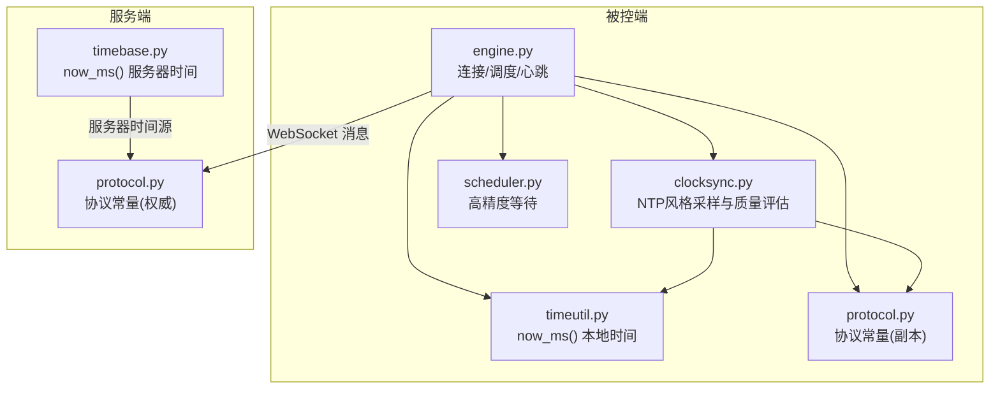
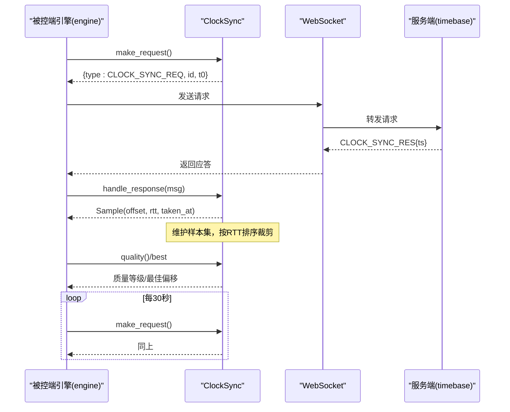
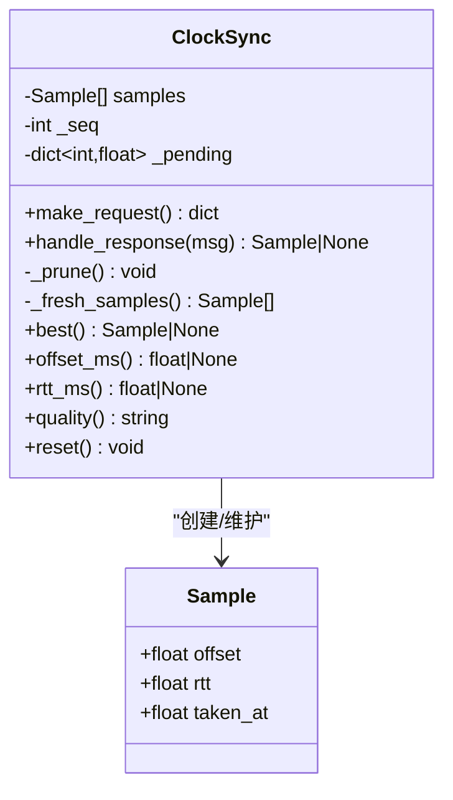
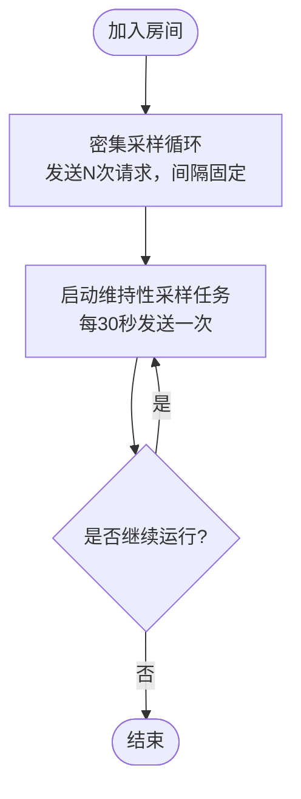
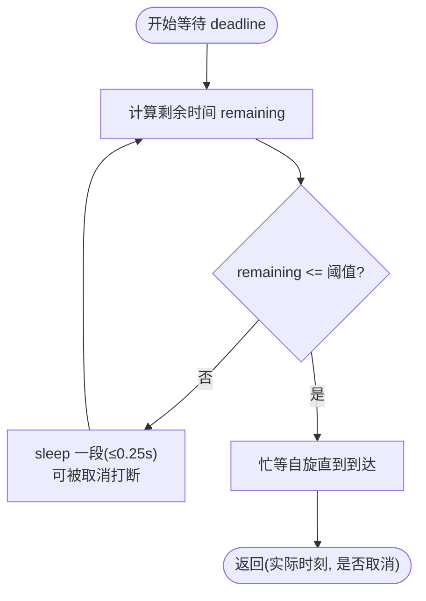
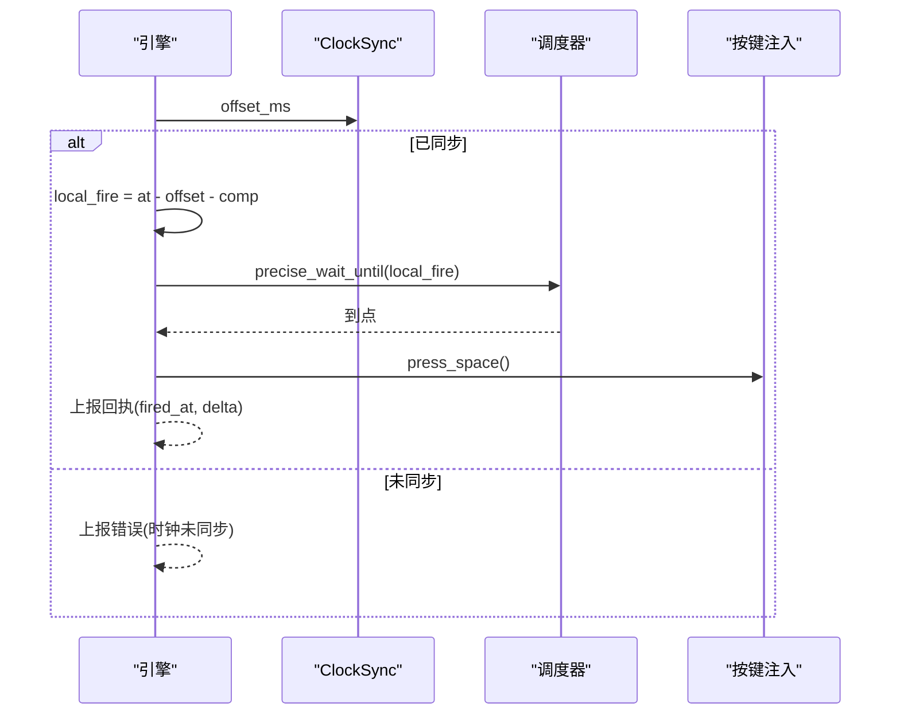
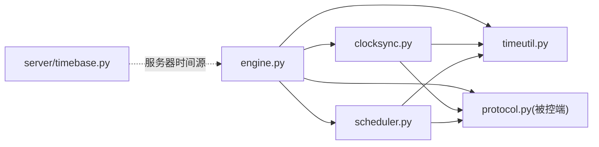

# 时钟同步系统

<cite>
**本文引用的文件**
- [agent/agent/clocksync.py](file://agent/agent/clocksync.py)
- [agent/agent/timeutil.py](file://agent/agent/timeutil.py)
- [server/server/timebase.py](file://server/server/timebase.py)
- [agent/agent/engine.py](file://agent/agent/engine.py)
- [agent/agent/scheduler.py](file://agent/agent/scheduler.py)
- [agent/agent/protocol.py](file://agent/agent/protocol.py)
- [server/server/protocol.py](file://server/server/protocol.py)
- [README.md](file://README.md)
</cite>

## 目录
1. [简介](#简介)
2. [项目结构](#项目结构)
3. [核心组件](#核心组件)
4. [架构总览](#架构总览)
5. [详细组件分析](#详细组件分析)
6. [依赖关系分析](#依赖关系分析)
7. [性能考量](#性能考量)
8. [故障排查指南](#故障排查指南)
9. [结论](#结论)
10. [附录：测试与调优](#附录测试与调优)

## 简介
本系统实现了一套 NTP 风格的时钟同步机制，用于在公网环境下让被控端（Agent）与服务器保持毫秒级时间对齐。其核心思想是：被控端周期性发送携带本地发出时刻 t0 的探测请求，服务器回显服务器时间 ts；被控端记录收到时刻 t1，估算偏移 offset = ts - (t0 + t1)/2，往返时延 rtt = t1 - t0。通过多次采样并选择 RTT 最小的样本作为可信偏移，结合“新鲜度窗口”和“样本老化”，有效抑制网络抖动与路由变化带来的误差。

该机制支撑了后续的“绝对时刻调度”：服务端下发指令时附带执行时刻 T，被控端将其换算为本地触发时刻 local_fire = T - offset - compensation_ms，并通过高精度定时策略精确到点触发。

## 项目结构
- 被控端（agent）：负责连接管理、时钟同步、心跳上报、绝对时刻调度与按键注入。
- 服务端（server）：提供房间管理、WebSocket 长连接、授时基准、指令广播与状态汇聚。
- 主控端（controller）：网页控制台，供导播人员操作。

图表来源
- [agent/agent/engine.py:106-157](file://agent/agent/engine.py#L106-L157)
- [agent/agent/clocksync.py:29-105](file://agent/agent/clocksync.py#L29-L105)
- [agent/agent/timeutil.py:9-11](file://agent/agent/timeutil.py#L9-L11)
- [agent/agent/scheduler.py:33-58](file://agent/agent/scheduler.py#L33-L58)
- [server/server/timebase.py:10-12](file://server/server/timebase.py#L10-L12)
- [agent/agent/protocol.py:23-35](file://agent/agent/protocol.py#L23-L35)
- [server/server/protocol.py:25-37](file://server/server/protocol.py#L25-L37)

章节来源
- [README.md:16-27](file://README.md#L16-L27)

## 核心组件
- ClockSync：实现 NTP 风格采样、样本管理与质量评估。
- timeutil.now_ms：被控端本地高精度毫秒时间戳。
- server.timebase.now_ms：服务端高精度毫秒时间戳。
- engine.AgentEngine：协调密集采样、维持性采样、心跳与绝对时刻调度。
- scheduler.precise_wait_until：粗睡眠+末段自旋的高精度等待。

章节来源
- [agent/agent/clocksync.py:22-105](file://agent/agent/clocksync.py#L22-L105)
- [agent/agent/timeutil.py:9-11](file://agent/agent/timeutil.py#L9-L11)
- [server/server/timebase.py:10-12](file://server/server/timebase.py#L10-L12)
- [agent/agent/engine.py:198-211](file://agent/agent/engine.py#L198-L211)
- [agent/agent/scheduler.py:33-58](file://agent/agent/scheduler.py#L33-L58)

## 架构总览
下图展示了从加入房间到完成密集采样、进入维持性采样、再到接收指令并精确触发的完整流程。

图表来源
- [agent/agent/engine.py:198-211](file://agent/agent/engine.py#L198-L211)
- [agent/agent/clocksync.py:37-55](file://agent/agent/clocksync.py#L37-L55)
- [server/server/timebase.py:10-12](file://server/server/timebase.py#L10-L12)

## 详细组件分析

### ClockSync：NTP 风格采样与质量评估
- 数据结构
  - Sample：包含 offset（服务器时钟 - 本地时钟，毫秒）、rtt（往返时延，毫秒）、taken_at（采样本地时刻）。
  - 内部维护 samples 列表、待处理请求映射 _pending（id -> t0）、序列号 _seq。
- 关键方法
  - make_request：生成 CLOCK_SYNC_REQ，记录 t0 并保存于 _pending。
  - handle_response：匹配请求 id，计算 t1=now_ms()，得到 offset 与 rtt，追加样本并裁剪。
  - best：在“新鲜样本”中取 RTT 最小者作为可信偏移。
  - quality：基于新鲜样本数量与最佳 RTT 给出 excellent/good/poor/none 分级。
  - reset：重连后清空历史，重新密集采样。
- 算法要点
  - 偏移估计：offset = ts - (t0 + t1)/2，rtt = t1 - t0。
  - 多次采样：密集采样快速收敛，维持性采样抑制漂移。
  - 样本老化：超过最大保留时间的旧样本仅在无新样本时兜底使用。
  - 容量控制：按 RTT 排序保留最优一批，避免内存膨胀。

图表来源
- [agent/agent/clocksync.py:22-105](file://agent/agent/clocksync.py#L22-L105)

章节来源
- [agent/agent/clocksync.py:22-105](file://agent/agent/clocksync.py#L22-L105)

### 密集采样与维护性采样
- 密集采样（Dense Sync）
  - 场景：加入房间后立即进行，快速建立可信偏移。
  - 参数：次数 DENSE_SYNC_SAMPLES，间隔 DENSE_SYNC_INTERVAL_MS。
  - 行为：循环发送请求，间隔固定，尽快积累样本。
- 维持性采样（Maintain Sync）
  - 场景：长期运行中抑制时钟漂移。
  - 参数：MAINTAIN_SYNC_INTERVAL_S。
  - 行为：周期发送请求，持续更新样本池。

图表来源
- [agent/agent/engine.py:198-211](file://agent/agent/engine.py#L198-L211)
- [agent/agent/protocol.py:75-79](file://agent/agent/protocol.py#L75-L79)

章节来源
- [agent/agent/engine.py:198-211](file://agent/agent/engine.py#L198-L211)
- [agent/agent/protocol.py:75-79](file://agent/agent/protocol.py#L75-L79)

### 时间工具函数 now_ms 的实现与精度
- 被控端 timeutil.now_ms：使用 time.time_ns() / 1_000_000，返回浮点毫秒，保留亚毫秒信息。
- 服务端 timebase.now_ms：使用 time.time_ns() // 1_000_000，返回整毫秒。
- 精度说明：time.time_ns() 在 Windows/Linux/macOS 上均可达毫秒级精度，满足授时需求；被控端采用浮点以保留更高精度细节。

章节来源
- [agent/agent/timeutil.py:9-11](file://agent/agent/timeutil.py#L9-L11)
- [server/server/timebase.py:10-12](file://server/server/timebase.py#L10-L12)

### 高精度调度：粗睡眠 + 末段自旋
- 策略：距离目标较远时使用 sleep 粗等待（可被取消事件打断），进入最后 SPIN_THRESHOLD_MS 毫秒切换忙等自旋，逼近目标时刻，误差控制在亚毫秒级。
- 平台优化：Windows 下提升系统定时器分辨率，改善 sleep 精度。
- 返回值：实际醒来时刻与是否被取消。

图表来源
- [agent/agent/scheduler.py:33-58](file://agent/agent/scheduler.py#L33-L58)
- [agent/agent/protocol.py:79](file://agent/agent/protocol.py#L79)

章节来源
- [agent/agent/scheduler.py:1-59](file://agent/agent/scheduler.py#L1-L59)

### 绝对时刻调度与触发流程
- 服务端下发指令时附带 at（服务器绝对时刻）。
- 被控端将 at 转换为本地触发时刻：local_fire = at - offset - compensation_ms。
- 若未同步（offset 为空），则拒绝调度并上报错误。
- 使用 precise_wait_until 精确到点触发，并在临近时刻播放提示音（可选）。

图表来源
- [agent/agent/engine.py:297-379](file://agent/agent/engine.py#L297-L379)
- [agent/agent/scheduler.py:33-58](file://agent/agent/scheduler.py#L33-L58)

章节来源
- [agent/agent/engine.py:297-379](file://agent/agent/engine.py#L297-L379)

## 依赖关系分析
- 模块耦合
  - engine 依赖 clocksync、scheduler、timeutil、protocol。
  - clocksync 依赖 timeutil、protocol。
  - scheduler 依赖 protocol、timeutil。
  - 服务端 timebase 独立提供时间源。
- 外部依赖
  - WebSocket 通信（websockets）。
  - 操作系统时间 API（time.time_ns）。
- 潜在循环依赖
  - 当前代码未发现循环导入；各模块职责清晰，耦合度低。

图表来源
- [agent/agent/engine.py:12-23](file://agent/agent/engine.py#L12-L23)
- [agent/agent/clocksync.py:11-14](file://agent/agent/clocksync.py#L11-L14)
- [agent/agent/scheduler.py:13-18](file://agent/agent/scheduler.py#L13-L18)
- [server/server/timebase.py:7-12](file://server/server/timebase.py#L7-L12)

章节来源
- [agent/agent/engine.py:12-23](file://agent/agent/engine.py#L12-L23)
- [agent/agent/clocksync.py:11-14](file://agent/agent/clocksync.py#L11-L14)
- [agent/agent/scheduler.py:13-18](file://agent/agent/scheduler.py#L13-L18)
- [server/server/timebase.py:7-12](file://server/server/timebase.py#L7-L12)

## 性能考量
- 采样频率与开销
  - 密集采样在短时间内集中请求，有助于快速收敛；维持性采样低频进行，降低长期开销。
  - 建议根据网络状况调整 DENSE_SYNC_INTERVAL_MS 与 MAINTAIN_SYNC_INTERVAL_S。
- 样本裁剪与内存
  - 按 RTT 排序保留最优一半样本，避免内存增长；当样本过多时及时裁剪。
- 时间精度
  - 被控端 now_ms 使用浮点保留亚毫秒；服务端整毫秒足够。
  - 调度阶段采用粗睡眠+末段自旋，减少 OS 调度误差。
- 网络抖动容忍
  - 通过“新鲜度窗口”与“RTT 最小优先”策略，降低瞬时抖动影响。
- 平台差异
  - Windows 下提升系统定时器分辨率，提高 sleep 精度。

[本节为通用性能讨论，不直接分析具体文件]

## 故障排查指南
- 时钟未同步
  - 现象：无法调度，上报“时钟未同步”。
  - 排查：检查网络连接、握手成功、CLOCK_SYNC_RES 是否正常返回；确认密集采样是否执行。
- 质量等级低
  - 现象：quality 返回 poor/none。
  - 排查：观察 rtt 是否过大；检查网络抖动；必要时增加密集采样次数或缩短间隔。
- 样本陈旧
  - 现象：长时间无新样本导致使用旧样本。
  - 排查：确保维持性采样正常运行；检查网络连通性与心跳。
- 触发延迟
  - 现象：命令执行偏晚或偏早。
  - 排查：检查补偿值 compensation_ms；确认 precise_wait_until 工作正常；观察 SPIN_THRESHOLD_MS 设置。

章节来源
- [agent/agent/engine.py:297-311](file://agent/agent/engine.py#L297-L311)
- [agent/agent/clocksync.py:89-99](file://agent/agent/clocksync.py#L89-L99)
- [agent/agent/scheduler.py:33-58](file://agent/agent/scheduler.py#L33-L58)

## 结论
本时钟同步系统通过 NTP 风格的多采样与 RTT 最小优先策略，结合样本老化与质量评估，实现了在公网环境下的稳定毫秒级时间对齐。配合高精度调度与补偿机制，能够在指令下发时保证可靠的绝对时刻触发。整体设计解耦清晰、扩展性强，适合多设备协同场景。

[本节为总结性内容，不直接分析具体文件]

## 附录：测试与调优
- 基础测试
  - 验证密集采样：加入房间后观察 clock_sample 事件，确认 offset 与 rtt 逐步收敛。
  - 验证质量等级：在不同网络条件下观察 excellent/good/poor 的变化。
  - 验证绝对时刻调度：下发带 at 的命令，检查 fired_at 与 delta_ms。
- 调优建议
  - 调整密集采样参数：DENSE_SYNC_SAMPLES、DENSE_SYNC_INTERVAL_MS，平衡收敛速度与开销。
  - 调整维持性采样间隔：MAINTAIN_SYNC_INTERVAL_S，适应不同时钟漂移速率。
  - 调整补偿值：compensation_ms，针对本地系统延迟进行微调。
  - 调整自旋阈值：SPIN_THRESHOLD_MS，权衡精度与 CPU 占用。
- 监控指标
  - 关注 clock_quality、clock_offset_ms、clock_rtt_ms、samples 数量。
  - 观察 command_fired 事件的 delta_ms，评估端到端精度。

章节来源
- [agent/agent/engine.py:217-241](file://agent/agent/engine.py#L217-L241)
- [agent/agent/engine.py:297-379](file://agent/agent/engine.py#L297-L379)
- [agent/agent/protocol.py:75-79](file://agent/agent/protocol.py#L75-L79)