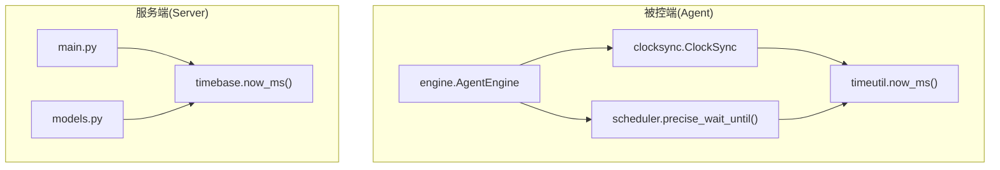
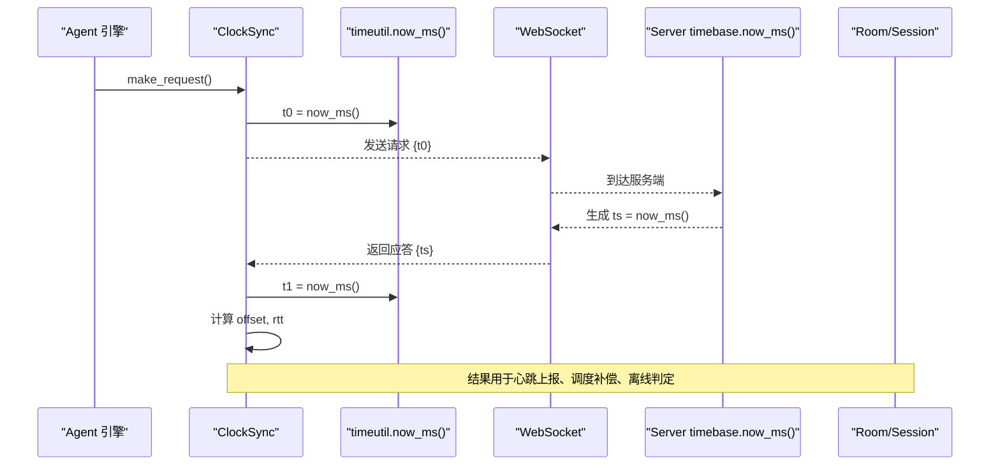
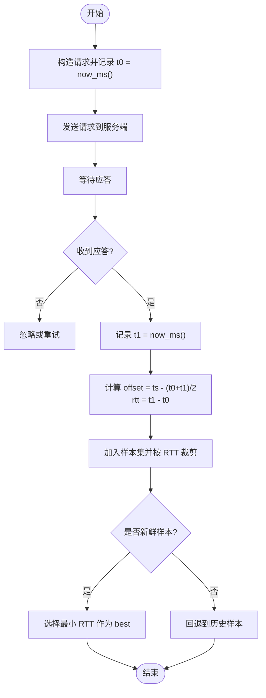
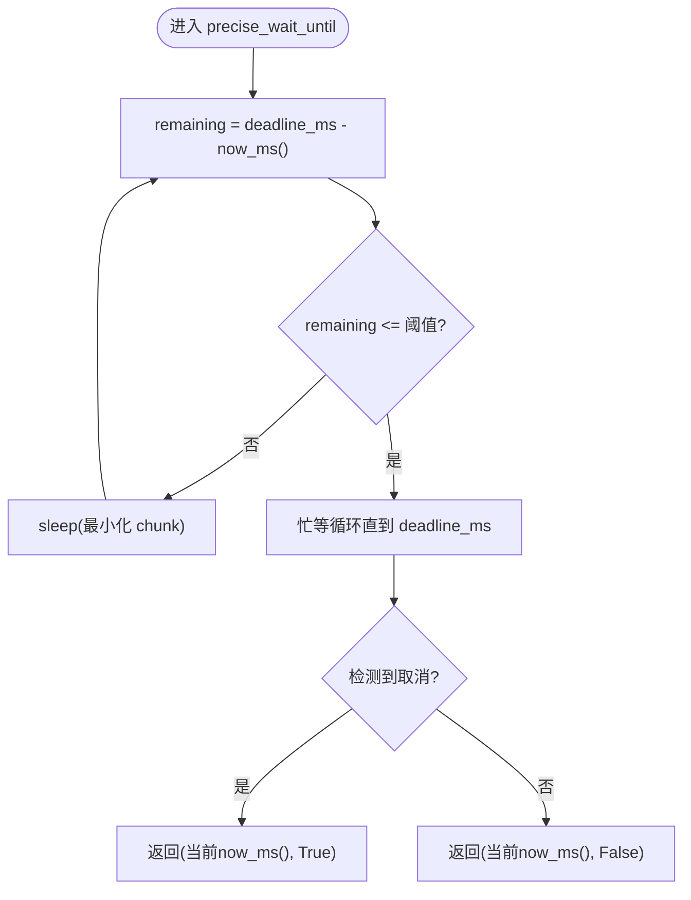
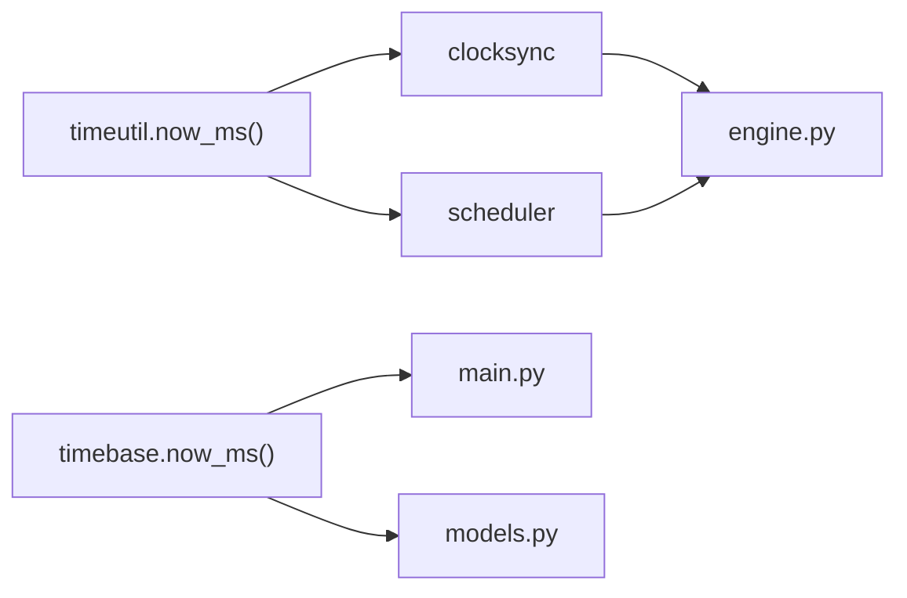

# 时间工具函数

<cite>
**本文引用的文件**
- [agent/agent/timeutil.py](file://agent/agent/timeutil.py)
- [server/server/timebase.py](file://server/server/timebase.py)
- [agent/agent/clocksync.py](file://agent/agent/clocksync.py)
- [agent/agent/scheduler.py](file://agent/agent/scheduler.py)
- [agent/agent/engine.py](file://agent/agent/engine.py)
- [server/server/main.py](file://server/server/main.py)
- [server/server/models.py](file://server/server/models.py)
</cite>

## 目录
1. [简介](#简介)
2. [项目结构](#项目结构)
3. [核心组件](#核心组件)
4. [架构总览](#架构总览)
5. [详细组件分析](#详细组件分析)
6. [依赖关系分析](#依赖关系分析)
7. [性能考量](#性能考量)
8. [故障排查指南](#故障排查指南)
9. [结论](#结论)
10. [附录](#附录)

## 简介
本文件聚焦于本项目中的“时间工具函数”实现与使用，重点说明：
- now_ms() 的高精度时间获取方法与跨平台兼容性处理
- 时间戳格式统一与精度保证机制
- 性能对比与最佳实践
- 时间基准的统一管理与模块间共享方式

该方案通过统一的毫秒级 Unix 时间戳接口，在客户端（Agent）与服务端（Server）之间建立一致的时间语义，支撑时钟同步、高精度调度、心跳与超时检测等关键功能。

## 项目结构
与时间相关的代码主要分布在以下位置：
- Agent 侧本地时间工具：agent/agent/timeutil.py
- Server 侧授时基准：server/server/timebase.py
- 时钟同步算法：agent/agent/clocksync.py
- 高精度定时调度：agent/agent/scheduler.py
- 引擎集成与使用：agent/agent/engine.py
- 服务端主流程与模型：server/server/main.py, server/server/models.py

图表来源
- [agent/agent/timeutil.py:9-11](file://agent/agent/timeutil.py#L9-L11)
- [server/server/timebase.py:10-12](file://server/server/timebase.py#L10-L12)
- [agent/agent/clocksync.py:37-55](file://agent/agent/clocksync.py#L37-L55)
- [agent/agent/scheduler.py:33-58](file://agent/agent/scheduler.py#L33-L58)
- [agent/agent/engine.py:198-211](file://agent/agent/engine.py#L198-L211)
- [server/server/main.py:40-60](file://server/server/main.py#L40-L60)
- [server/server/models.py:17-81](file://server/server/models.py#L17-L81)

章节来源
- [agent/agent/timeutil.py:1-11](file://agent/agent/timeutil.py#L1-L11)
- [server/server/timebase.py:1-12](file://server/server/timebase.py#L1-L12)

## 核心组件
- 本地时间工具（Agent）：提供 now_ms()，返回浮点毫秒时间戳，保留亚毫秒信息，便于后续计算减少舍入误差。
- 服务器授时基准（Server）：提供 now_ms()，返回整型毫秒时间戳，用于协议中“服务器时间”的权威来源。
- 时钟同步（Agent）：基于类 NTP 算法，利用 now_ms() 记录 t0/t1，结合服务器时间 ts 估算偏移与往返时延。
- 高精度调度（Agent）：采用“粗睡眠 + 最后阶段自旋等待”策略，配合 now_ms() 实现亚毫秒级触发精度。
- 引擎与模型：在连接、心跳、超时检测、房间生命周期管理等处统一使用 now_ms() 作为时间源。

章节来源
- [agent/agent/timeutil.py:9-11](file://agent/agent/timeutil.py#L9-L11)
- [server/server/timebase.py:10-12](file://server/server/timebase.py#L10-L12)
- [agent/agent/clocksync.py:37-55](file://agent/agent/clocksync.py#L37-L55)
- [agent/agent/scheduler.py:33-58](file://agent/agent/scheduler.py#L33-L58)
- [server/server/main.py:40-60](file://server/server/main.py#L40-L60)
- [server/server/models.py:17-81](file://server/server/models.py#L17-L81)

## 架构总览
下图展示了时间基准在系统中的统一管理与跨模块共享方式：

图表来源
- [agent/agent/clocksync.py:37-55](file://agent/agent/clocksync.py#L37-L55)
- [agent/agent/timeutil.py:9-11](file://agent/agent/timeutil.py#L9-L11)
- [server/server/timebase.py:10-12](file://server/server/timebase.py#L10-L12)
- [server/server/models.py:17-81](file://server/server/models.py#L17-L81)

## 详细组件分析

### 本地时间工具 now_ms()（Agent）
- 实现要点
  - 使用系统高精度纳秒时间 time.time_ns()，除以 1_000_000 得到毫秒级浮点时间戳。
  - 返回浮点以保留亚毫秒信息，有利于后续差值计算与补偿，避免过早取整引入误差。
- 跨平台兼容
  - Python 的 time.time_ns() 在 Windows/Linux/macOS 上均提供高精度时间源，满足毫秒级精度需求。
- 使用场景
  - 时钟同步采样（记录 t0/t1）
  - 高精度调度（精确等待目标时刻）
  - 心跳与超时判断（与服务器时间比较）

章节来源
- [agent/agent/timeutil.py:9-11](file://agent/agent/timeutil.py#L9-L11)
- [agent/agent/clocksync.py:37-55](file://agent/agent/clocksync.py#L37-L55)
- [agent/agent/scheduler.py:33-58](file://agent/agent/scheduler.py#L33-L58)

### 服务器授时基准 now_ms()（Server）
- 实现要点
  - 同样基于 time.time_ns()，但采用整除 // 1_000_000 返回整型毫秒时间戳，确保协议中“服务器时间”为整数毫秒。
- 设计动机
  - 服务端作为权威时间源，统一所有协议时间字段为整型毫秒，便于序列化与比较。
- 使用场景
  - 健康检查返回 server_time
  - 会话与房间的 last_seen/last_active 更新
  - 空闲房间销毁、心跳超时判定

章节来源
- [server/server/timebase.py:10-12](file://server/server/timebase.py#L10-L12)
- [server/server/main.py:40-60](file://server/server/main.py#L40-L60)
- [server/server/models.py:17-81](file://server/server/models.py#L17-L81)

### 时钟同步模块（Agent）
- 算法概述
  - 类 NTP 算法：客户端记录发送时刻 t0，收到服务器时间 ts 后记录接收时刻 t1，估算 offset = ts - (t0 + t1)/2，rtt = t1 - t0。
  - 多次采样并维护样本集，按 RTT 排序保留最优子集；同时设置老化窗口，淘汰陈旧样本，避免路由变化导致的偏差。
- 与 now_ms() 的关系
  - 采样过程中频繁调用 now_ms() 获取高精度本地时间，保证 offset 与 rtt 计算的准确性。
- 质量评估
  - 根据新鲜样本数量与最小 RTT 给出质量等级，随心跳上报给服务端。

图表来源
- [agent/agent/clocksync.py:37-77](file://agent/agent/clocksync.py#L37-L77)

章节来源
- [agent/agent/clocksync.py:16-77](file://agent/agent/clocksync.py#L16-L77)

### 高精度定时调度（Agent）
- 策略说明
  - 粗睡眠段：距离目标较远时使用 sleep，支持取消事件打断，避免长时间阻塞。
  - 末段自旋：进入最后阈值（默认 SPIN_THRESHOLD_MS）后切换忙等循环，逼近目标时刻，误差控制在亚毫秒级。
  - Windows 下提升系统定时器分辨率，改善 sleep 精度。
- 与 now_ms() 的关系
  - 每次循环都调用 now_ms() 计算剩余时间与判断是否到达目标时刻，确保高精度触发。

图表来源
- [agent/agent/scheduler.py:33-58](file://agent/agent/scheduler.py#L33-L58)

章节来源
- [agent/agent/scheduler.py:1-58](file://agent/agent/scheduler.py#L1-L58)

### 引擎与模型中的时间使用
- 引擎（AgentEngine）
  - 密集同步与维护性同步：周期性发起时钟同步请求，抑制时钟漂移。
  - 心跳消息包含 clock_quality、compensation_ms 等，结合 offset 进行调度补偿。
- 模型（Server）
  - 会话与会话状态：记录 last_seen_ms、created_at_ms、last_active_ms，统一使用 now_ms()。
  - 空闲房间销毁与心跳超时判定：基于 now_ms() 计算时间差。

章节来源
- [agent/agent/engine.py:198-211](file://agent/agent/engine.py#L198-L211)
- [server/server/models.py:17-81](file://server/server/models.py#L17-L81)
- [server/server/main.py:40-60](file://server/server/main.py#L40-L60)

## 依赖关系分析
- 模块耦合
  - Agent 的 clocksync 与 scheduler 强依赖 timeutil.now_ms()，以保证高精度时间源一致性。
  - Server 的 main 与 models 强依赖 timebase.now_ms()，确保协议时间字段统一。
- 外部依赖
  - 两者均依赖 Python 标准库 time.time_ns()，在主流操作系统上提供高精度时间源。
- 潜在风险
  - 若系统时间发生跳变（如 NTP 校正），需依赖上层逻辑（如时钟同步与样本老化）来缓解影响。
  - Windows 下 sleep 精度受系统定时器分辨率影响，已通过 timeBeginPeriod 优化。

图表来源
- [agent/agent/timeutil.py:9-11](file://agent/agent/timeutil.py#L9-L11)
- [server/server/timebase.py:10-12](file://server/server/timebase.py#L10-L12)
- [agent/agent/clocksync.py:37-55](file://agent/agent/clocksync.py#L37-L55)
- [agent/agent/scheduler.py:33-58](file://agent/agent/scheduler.py#L33-L58)
- [agent/agent/engine.py:198-211](file://agent/agent/engine.py#L198-L211)
- [server/server/main.py:40-60](file://server/server/main.py#L40-L60)
- [server/server/models.py:17-81](file://server/server/models.py#L17-L81)

章节来源
- [agent/agent/timeutil.py:9-11](file://agent/agent/timeutil.py#L9-L11)
- [server/server/timebase.py:10-12](file://server/server/timebase.py#L10-L12)

## 性能考量
- 时间源选择
  - time.time_ns() 在高精度时间方面优于 time.time()，且跨平台一致性好，适合毫秒级精度需求。
- 精度与开销
  - 浮点 vs 整型：Agent 侧使用浮点 now_ms() 保留亚毫秒信息，减少累计误差；Server 侧使用整型 now_ms() 保证协议字段统一与序列化效率。
- 调度策略
  - “粗睡眠 + 自旋”策略显著降低 CPU 占用同时提高触发精度；Windows 下提升定时器分辨率进一步改善 sleep 精度。
- 建议
  - 高频调用 now_ms() 的场景应尽量避免不必要的中间变量与类型转换，减少额外开销。
  - 对实时性要求极高的路径，优先使用自旋等待的最后阶段，缩短抖动。

[本节为通用性能讨论，不直接分析具体文件]

## 故障排查指南
- 时钟不同步
  - 现象：触发时刻偏差大、指令执行提前或延后。
  - 排查：检查 ClockSync 的 best.offset_ms 与 quality()，确认是否有新鲜样本与较小 RTT。
  - 参考：[agent/agent/clocksync.py:66-77](file://agent/agent/clocksync.py#L66-L77)
- 心跳超时误判
  - 现象：设备被错误标记离线。
  - 排查：核对 last_seen_ms 与 now_ms() 的差值是否超过阈值；检查网络与心跳频率。
  - 参考：[server/server/main.py:40-60](file://server/server/main.py#L40-L60), [server/server/models.py:17-81](file://server/server/models.py#L17-L81)
- 调度精度不足
  - 现象：触发时刻抖动较大。
  - 排查：确认是否进入自旋阶段；检查 cancel_event 是否提前触发；验证 Windows 定时器分辨率设置。
  - 参考：[agent/agent/scheduler.py:33-58](file://agent/agent/scheduler.py#L33-L58)

章节来源
- [agent/agent/clocksync.py:66-77](file://agent/agent/clocksync.py#L66-L77)
- [server/server/main.py:40-60](file://server/server/main.py#L40-L60)
- [server/server/models.py:17-81](file://server/server/models.py#L17-L81)
- [agent/agent/scheduler.py:33-58](file://agent/agent/scheduler.py#L33-L58)

## 结论
本项目通过统一的 now_ms() 接口实现了跨平台、高精度的时间获取，并在 Agent 与 Server 两端分别采用浮点与整型毫秒时间戳以满足各自需求。结合类 NTP 时钟同步与“粗睡眠 + 自旋”的高精度调度策略，系统在多模块间共享了可靠的时间基准，有效支撑了心跳、超时检测、指令调度等关键功能。建议在后续迭代中继续监控时间源稳定性与调度精度，并根据实际网络环境调整采样频率与自旋阈值。

[本节为总结性内容，不直接分析具体文件]

## 附录
- 术语
  - 毫秒级 Unix 时间戳：从 1970-01-01 起经过的毫秒数。
  - 偏移量（offset）：服务器时钟与本地时钟的差值（毫秒）。
  - 往返时延（RTT）：请求发出到应答收到的时间间隔（毫秒）。
- 最佳实践
  - 统一通过 now_ms() 获取时间，避免混用多种时间源。
  - 在需要高精度触发的路径，优先使用 precise_wait_until。
  - 定期采样并维护样本集，及时淘汰陈旧数据。
  - 在 Windows 环境下启用系统定时器分辨率优化以提升 sleep 精度。

[本节为补充说明，不直接分析具体文件]