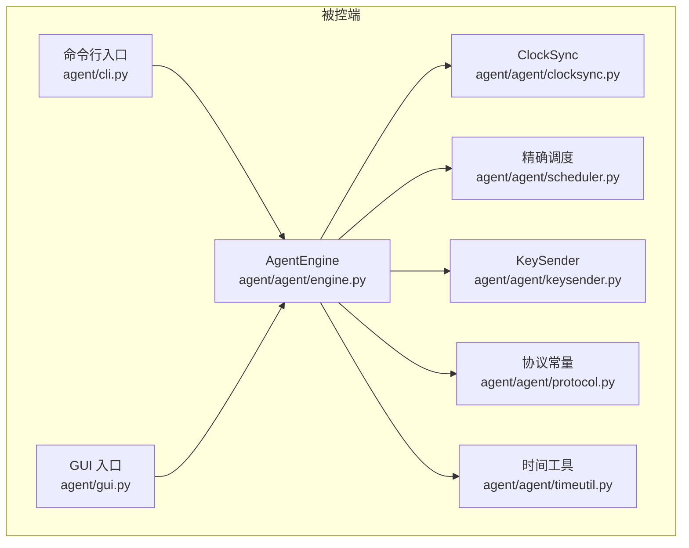
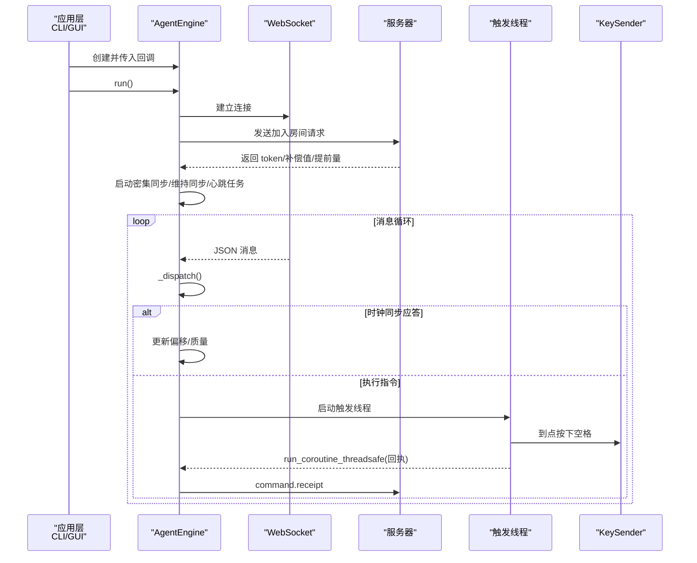
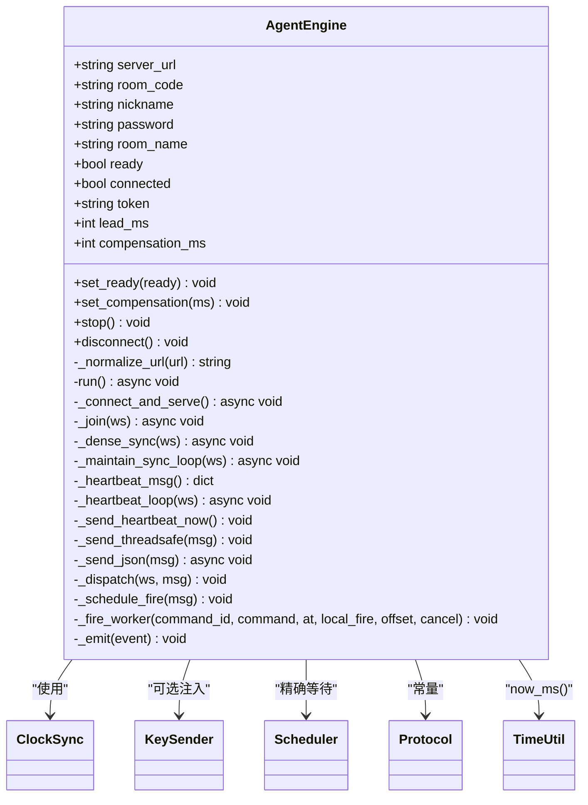
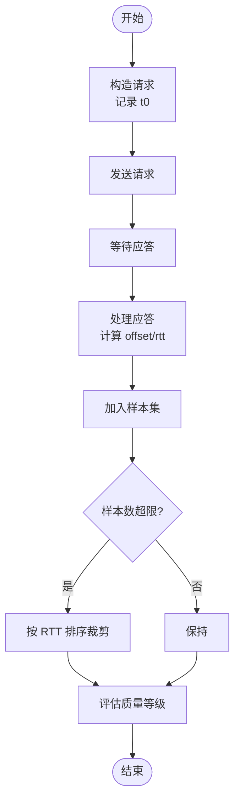
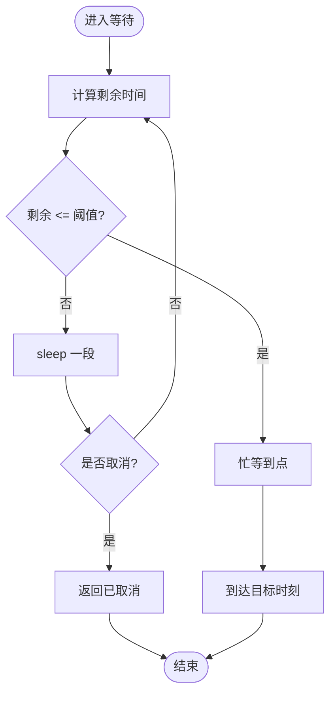
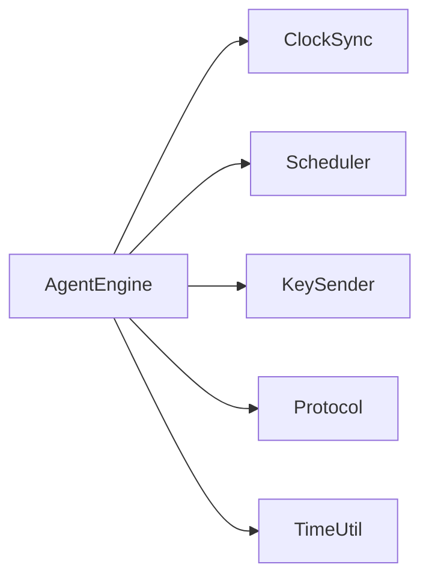

# 核心引擎架构

<cite>
**本文引用的文件**
- [engine.py](file://agent/agent/engine.py)
- [protocol.py](file://agent/agent/protocol.py)
- [clocksync.py](file://agent/agent/clocksync.py)
- [scheduler.py](file://agent/agent/scheduler.py)
- [keysender.py](file://agent/agent/keysender.py)
- [timeutil.py](file://agent/agent/timeutil.py)
- [cli.py](file://agent/agent/cli.py)
- [scriptcue_agent.py](file://agent/scriptcue_agent.py)
- [README.md](file://README.md)
</cite>

## 目录
1. [简介](#简介)
2. [项目结构](#项目结构)
3. [核心组件](#核心组件)
4. [架构总览](#架构总览)
5. [详细组件分析](#详细组件分析)
6. [依赖关系分析](#依赖关系分析)
7. [性能考量](#性能考量)
8. [故障排查指南](#故障排查指南)
9. [结论](#结论)
10. [附录：使用示例与最佳实践](#附录使用示例与最佳实践)

## 简介
本文件为 ScriptCue 被控端核心引擎的权威技术文档，聚焦 AgentEngine 类的设计模式、事件驱动架构、线程模型（asyncio 事件循环 + 独立触发线程）、生命周期管理（连接、会话、断线重连）、对外接口（set_ready、set_compensation、stop、disconnect）、内部状态管理、消息分发机制、异常处理策略与回调系统。文档同时提供架构图与时序图，并给出实际使用模式的参考路径。

## 项目结构
被控端位于 agent 目录，核心由 engine.py 实现；时钟同步、高精度调度、按键注入、协议常量等作为支撑模块。CLI 与 GUI 均复用同一引擎。

图表来源
- [engine.py:31-106](file://agent/agent/engine.py#L31-L106)
- [cli.py:104-134](file://agent/agent/cli.py#L104-L134)
- [protocol.py:1-80](file://agent/agent/protocol.py#L1-L80)

章节来源
- [README.md:1-86](file://README.md#L1-L86)
- [engine.py:1-106](file://agent/agent/engine.py#L1-L106)

## 核心组件
- AgentEngine：被控端同步引擎，负责 WebSocket 连接、心跳、时钟同步、指令调度与回执上报、事件回调。
- ClockSync：类 NTP 时钟同步，维护样本集，计算偏移与质量等级。
- scheduler：高精度定时等待，采用“粗睡眠 + 末段自旋”策略，支持取消。
- KeySender：跨平台空格键注入，含自检与权限引导。
- protocol：通信协议常量定义（消息类型、错误码、限制与间隔）。
- timeutil：本地毫秒时间戳工具。

章节来源
- [engine.py:31-106](file://agent/agent/engine.py#L31-L106)
- [clocksync.py:22-106](file://agent/agent/clocksync.py#L22-L106)
- [scheduler.py:1-59](file://agent/agent/scheduler.py#L1-L59)
- [keysender.py:99-126](file://agent/agent/keysender.py#L99-L126)
- [protocol.py:1-80](file://agent/agent/protocol.py#L1-L80)
- [timeutil.py:1-12](file://agent/agent/timeutil.py#L1-L12)

## 架构总览
AgentEngine 运行在调用方提供的 asyncio 事件循环中，主循环负责连接、加入房间、启动密集/维持性时钟同步任务、心跳任务以及消息接收与分发。收到执行指令后，引擎将调度工作下沉到独立线程，避免阻塞事件循环；触发完成后通过 run_coroutine_threadsafe 回事件循环发送回执。所有 on_event 回调均在引擎线程中调用，GUI 需自行切换到 UI 线程。

图表来源
- [engine.py:106-157](file://agent/agent/engine.py#L106-L157)
- [engine.py:159-193](file://agent/agent/engine.py#L159-L193)
- [engine.py:198-212](file://agent/agent/engine.py#L198-L212)
- [engine.py:235-242](file://agent/agent/engine.py#L235-L242)
- [engine.py:268-292](file://agent/agent/engine.py#L268-L292)
- [engine.py:297-379](file://agent/agent/engine.py#L297-L379)

## 详细组件分析

### AgentEngine：设计模式与实现细节
- 设计模式
  - 事件驱动：通过 on_event 回调统一上报连接、时钟采样、指令调度、触发结果等事件。
  - 职责分离：引擎只负责协议与定时，动作由 KeySender 完成，便于替换与测试。
  - 线程隔离：事件循环与触发线程解耦，避免阻塞；跨线程通信通过 run_coroutine_threadsafe。
- 线程模型
  - 事件循环：run() 持有 ws 连接，串行处理消息；_connect_and_serve() 内创建密集同步、心跳、维持同步三个协程任务。
  - 触发线程：每个指令对应一个 daemon 线程，使用 precise_wait_until 等待到点，期间可被取消事件中断。
- 生命周期管理
  - 连接：_normalize_url 标准化 URL；_connect_and_serve 建立连接并进入消息循环；_join 完成握手与初始化。
  - 会话：心跳周期性上报 ready、时钟质量、补偿值、RTT、偏移与待执行命令；时钟同步密集采样与维持采样。
  - 断线重连：run() 捕获异常后指数退避重试，直至 stopped 标志置位。
- 对外接口
  - set_ready(ready)：切换就绪状态并立即补发一次心跳。
  - set_compensation(ms)：本地修改补偿值并上报服务器。
  - stop()：设置停止标志，退出主循环。
  - disconnect()：停止引擎并主动关闭当前连接，清理挂起触发。
- 内部状态
  - ready、connected、token、lead_ms、compensation_ms、_pending_fires、_has_joined、_auto_create、_stopped 等。
- 消息分发
  - _dispatch 根据 type 路由至时钟同步、指令执行、指令取消、补偿更新或错误事件。
- 异常处理
  - 连接/网络异常：记录日志并触发 error 事件；重连前重置连接状态。
  - 回调异常：on_event 包裹 try/except，防止回调抛错影响引擎。
  - 触发异常：KeySender 抛出异常时回执 status 为 error，并附带 detail。

图表来源
- [engine.py:31-388](file://agent/agent/engine.py#L31-L388)
- [protocol.py:1-80](file://agent/agent/protocol.py#L1-L80)
- [clocksync.py:22-106](file://agent/agent/clocksync.py#L22-L106)
- [scheduler.py:1-59](file://agent/agent/scheduler.py#L1-L59)
- [keysender.py:99-126](file://agent/agent/keysender.py#L99-L126)
- [timeutil.py:1-12](file://agent/agent/timeutil.py#L1-L12)

章节来源
- [engine.py:31-388](file://agent/agent/engine.py#L31-L388)

### 时钟同步（ClockSync）
- 算法：类 NTP，发送携带 t0 的请求，收到 ts 后计算 offset = ts - (t0 + t1)/2，rtt = t1 - t0。
- 样本管理：保留最新且 RTT 最小的若干样本，超过上限按 RTT 排序裁剪；样本带 taken_at 用于老化淘汰。
- 质量分级：基于样本数量与 RTT 阈值分为 excellent/good/poor/none，随心跳上报。
- 重置：重连后清空样本，重新密集采样。

图表来源
- [clocksync.py:37-55](file://agent/agent/clocksync.py#L37-L55)
- [clocksync.py:57-63](file://agent/agent/clocksync.py#L57-L63)
- [clocksync.py:66-99](file://agent/agent/clocksync.py#L66-L99)

章节来源
- [clocksync.py:1-106](file://agent/agent/clocksync.py#L1-L106)

### 精确调度（scheduler）
- 策略：距离目标较远时使用 sleep 粗等待，最后 SPIN_THRESHOLD_MS 切换忙等自旋，误差亚毫秒级。
- 取消：支持 threading.Event 打断，确保及时响应取消。
- 平台优化：Windows 下提升系统定时器分辨率，改善 sleep 精度。

图表来源
- [scheduler.py:33-59](file://agent/agent/scheduler.py#L33-L59)

章节来源
- [scheduler.py:1-59](file://agent/agent/scheduler.py#L1-L59)

### 按键注入（KeySender）
- 平台实现：Windows 使用 SendInput，macOS 使用 pynput 封装 CGEventPost。
- 自检：启动时验证注入能力；macOS 检测辅助功能权限并提供引导。
- 演练模式：dry_run 跳过实际注入，便于联调。

章节来源
- [keysender.py:1-126](file://agent/agent/keysender.py#L1-L126)

### 协议常量（protocol）
- 消息类型：主控→服务器、服务器→主控、被控端↔服务器、错误码等。
- 限制与间隔：默认提前量、心跳间隔、重连退避、时钟同步参数。
- 版本控制：PROTO_VERSION 需与服务器保持一致。

章节来源
- [protocol.py:1-80](file://agent/agent/protocol.py#L1-L80)

### 时间工具（timeutil）
- now_ms：返回毫秒级 Unix 时间戳，浮点保留亚毫秒信息，保证高精度计时。

章节来源
- [timeutil.py:1-12](file://agent/agent/timeutil.py#L1-L12)

## 依赖关系分析
- 耦合度
  - AgentEngine 对 ClockSync、Scheduler、KeySender 为组合关系，低耦合高内聚。
  - 通过 protocol 常量解耦消息语义，便于多端一致。
- 外部依赖
  - websockets：长连接通信。
  - 平台 API：Windows SendInput、macOS Accessibility 权限检查。
- 潜在循环依赖
  - 无直接循环导入；engine 仅单向依赖其他模块。

图表来源
- [engine.py:12-24](file://agent/agent/engine.py#L12-L24)
- [protocol.py:1-80](file://agent/agent/protocol.py#L1-L80)

章节来源
- [engine.py:12-24](file://agent/agent/engine.py#L12-L24)
- [protocol.py:1-80](file://agent/agent/protocol.py#L1-L80)

## 性能考量
- 时钟同步：密集采样快速收敛，维持采样抑制漂移；样本老化避免陈旧最优样本主导。
- 调度精度：粗睡眠降低 CPU 占用，末段自旋逼近目标时刻，整体误差控制在亚毫秒级。
- 线程模型：触发线程不阻塞事件循环；取消事件保障及时退出。
- 网络开销：心跳周期与重连退避平衡实时性与带宽消耗。
- 平台优化：Windows 提升定时器分辨率，减少 sleep 抖动。

[本节为通用性能讨论，不直接分析具体代码行]

## 故障排查指南
- 无法连接/加入失败
  - 检查 URL 标准化是否正确；确认房间码、密码、token 有效。
  - 关注 error 事件中的 code 与 message。
- 时钟未同步导致触发跳过
  - 观察 clock_sample 事件，确认 offset/rtt/quality；必要时调整网络或等待更多样本。
- 触发延迟或偏差较大
  - 检查补偿值 compensation_ms 是否合理；查看 command_fired 的 delta_ms。
- 按键注入失败
  - macOS 检查辅助功能权限；Windows 检查安全软件拦截；使用 dry-run 模式定位问题。
- 频繁重连
  - 检查网络稳定性；关注 reconnecting 事件的 delay_s 变化。

章节来源
- [engine.py:106-157](file://agent/agent/engine.py#L106-L157)
- [engine.py:159-193](file://agent/agent/engine.py#L159-L193)
- [engine.py:268-292](file://agent/agent/engine.py#L268-L292)
- [engine.py:297-379](file://agent/agent/engine.py#L297-L379)
- [keysender.py:107-126](file://agent/agent/keysender.py#L107-L126)

## 结论
AgentEngine 以事件驱动与线程隔离为核心，结合类 NTP 时钟同步与高精度调度，实现了跨公网环境的多设备同步起播。其清晰的职责边界、健壮的生命周期管理与完善的回调体系，使其易于集成到 CLI/GUI 等不同前端形态中。通过合理的补偿与质量评估，可在网络抖动条件下仍保持稳定的同步精度。

[本节为总结性内容，不直接分析具体代码行]

## 附录：使用示例与最佳实践
- 命令行版使用流程
  - 安装依赖后，运行命令行入口，传入服务器地址、房间码、昵称等参数；通过交互命令切换就绪、设置补偿、查看状态、退出。
  - 参考路径：[cli.py:104-134](file://agent/agent/cli.py#L104-L134)
- GUI 版打包入口
  - 通过脚本入口启动 GUI 主函数。
  - 参考路径：[scriptcue_agent.py:6-9](file://agent/scriptcue_agent.py#L6-L9)
- 引擎使用要点
  - 在应用层创建 AgentEngine，传入 on_event 回调与可选 KeySender。
  - 调用 run() 启动事件循环；通过 set_ready/set_compensation 动态调整状态。
  - 监听事件：connecting/connected/disconnected/reconnecting/error/clock_sample/command_scheduled/command_fired/command_cancelled/fire_skipped/comp_changed。
  - 优雅退出：调用 stop() 或 disconnect()。
- 最佳实践
  - 首次加入房间后等待足够样本再触发，确保时钟质量良好。
  - 合理设置补偿值，结合 command_fired 的 delta_ms 微调。
  - 在 GUI 中将 on_event 回调切换到 UI 线程，避免跨线程 UI 操作。
  - 使用 dry-run 模式进行联调，确认链路后再开启真实注入。

章节来源
- [cli.py:33-62](file://agent/agent/cli.py#L33-L62)
- [cli.py:65-134](file://agent/agent/cli.py#L65-L134)
- [engine.py:31-106](file://agent/agent/engine.py#L31-L106)
- [engine.py:268-379](file://agent/agent/engine.py#L268-L379)