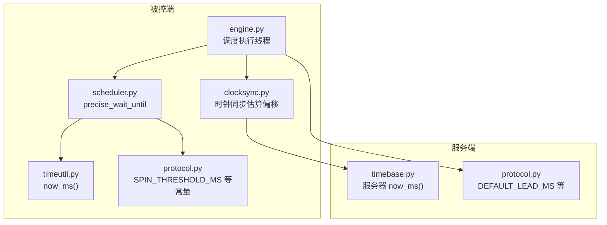
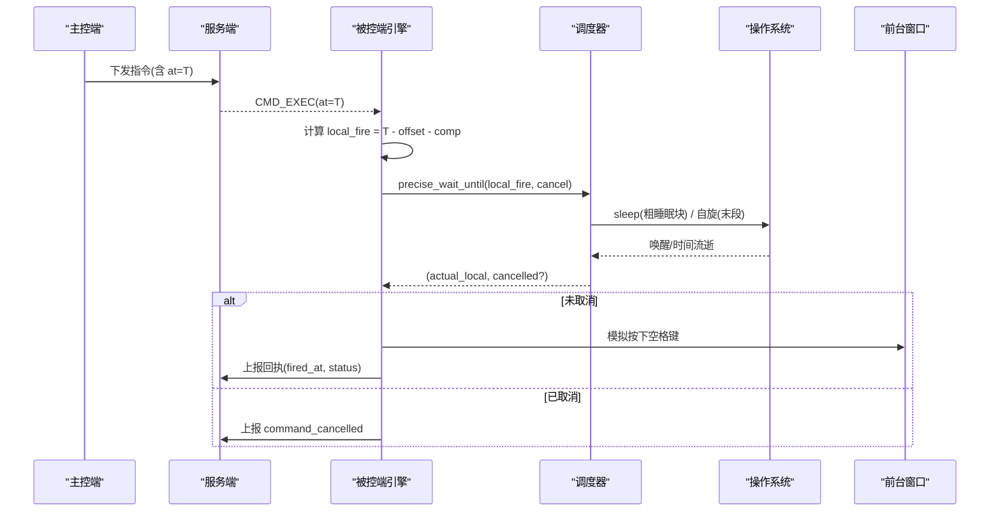
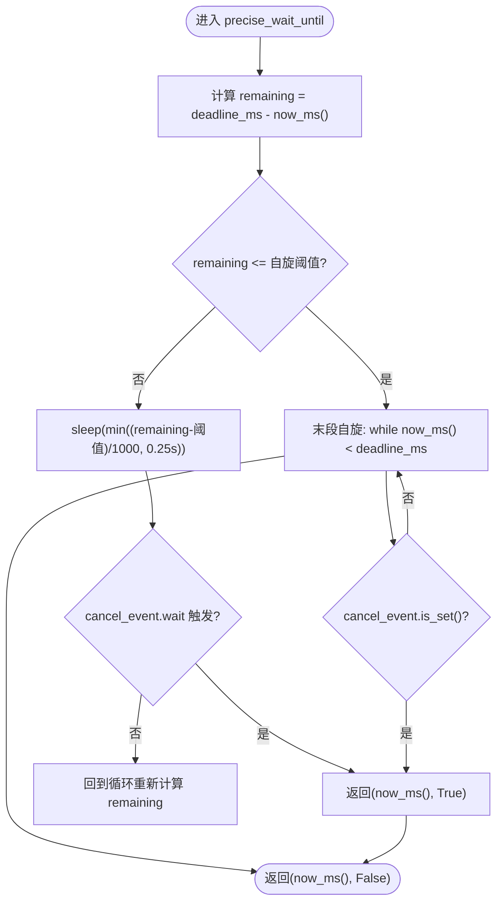
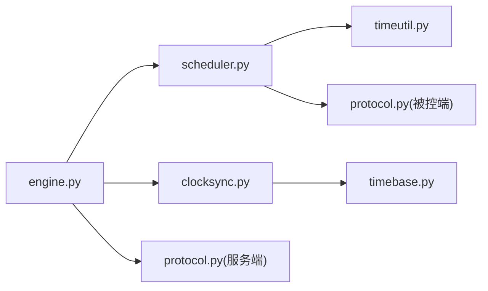

# 精确调度器

<cite>
**本文引用的文件**
- [scheduler.py](file://agent/agent/scheduler.py)
- [timeutil.py](file://agent/agent/timeutil.py)
- [protocol.py（被控端）](file://agent/agent/protocol.py)
- [engine.py](file://agent/agent/engine.py)
- [timebase.py](file://server/server/timebase.py)
- [protocol.py（服务端）](file://server/server/protocol.py)
- [clocksync.py](file://agent/agent/clocksync.py)
- [README.md](file://README.md)
</cite>

## 目录
1. [简介](#简介)
2. [项目结构](#项目结构)
3. [核心组件](#核心组件)
4. [架构总览](#架构总览)
5. [详细组件分析](#详细组件分析)
6. [依赖关系分析](#依赖关系分析)
7. [性能与精度](#性能与精度)
8. [故障排查指南](#故障排查指南)
9. [结论](#结论)
10. [附录：扩展自定义调度策略](#附录：扩展自定义调度策略)

## 简介
本文件面向 ScriptCue 的“精确调度器”，聚焦绝对时刻调度算法与高精度定时实现机制。重点解释 precise_wait_until 的工作原理，包括粗睡眠 + 末段自旋的策略、CPU 休眠优化、忙等待策略与取消机制；说明调度器的精度保证与性能优化技巧；阐述与操作系统定时器 API 的交互方式及跨平台适配；并给出调度精度测试方法与性能基准建议，以及扩展自定义调度策略的指南。

## 项目结构
ScriptCue 由服务端、主控端与被控端组成。精确调度器位于被控端 agent 中，负责在本地按“服务器时间 + 提前量 - 时钟偏移 - 补偿”换算后的本地绝对时刻精准触发动作。

图表来源
- [engine.py:320-388](file://agent/agent/engine.py#L320-L388)
- [scheduler.py:1-59](file://agent/agent/scheduler.py#L1-L59)
- [timeutil.py:1-12](file://agent/agent/timeutil.py#L1-L12)
- [protocol.py（被控端）:75-80](file://agent/agent/protocol.py#L75-L80)
- [clocksync.py:1-73](file://agent/agent/clocksync.py#L1-L73)
- [timebase.py:1-13](file://server/server/timebase.py#L1-L13)
- [protocol.py（服务端）:67-80](file://server/server/protocol.py#L67-L80)

章节来源
- [README.md:16-27](file://README.md#L16-L27)

## 核心组件
- 高精度等待函数 precise_wait_until：实现“粗睡眠 + 最后 N ms 自旋”的绝对时刻等待，支持可中断取消。
- 本地时间工具 timeutil.now_ms：提供毫秒级高精度本地时间戳。
- 协议常量 protocol.SPIN_THRESHOLD_MS：定义自旋阈值（默认 50ms）。
- 时钟同步 clocksync：估算本地与服务器时钟偏移，用于将服务器绝对时刻转换为本地绝对时刻。
- 执行引擎 engine：构造本地触发时刻、启动工作线程、调用 precise_wait_until 并在到点时执行按键模拟与回执上报。
- 服务端授时 timebase：提供统一的服务器高精度时间源。

章节来源
- [scheduler.py:1-59](file://agent/agent/scheduler.py#L1-L59)
- [timeutil.py:1-12](file://agent/agent/timeutil.py#L1-L12)
- [protocol.py（被控端）:75-80](file://agent/agent/protocol.py#L75-L80)
- [clocksync.py:1-73](file://agent/agent/clocksync.py#L1-L73)
- [engine.py:320-388](file://agent/agent/engine.py#L320-L388)
- [timebase.py:1-13](file://server/server/timebase.py#L1-L13)

## 架构总览
精确调度的端到端流程如下：
- 服务端以 timebase.now_ms() 作为权威时间源，结合 DEFAULT_LEAD_MS 计算指令的执行绝对时刻 T。
- 被控端通过 clocksync 多次采样估算本地与服务器时钟偏移 offset，并将 T 转换为本地绝对时刻 local_fire = T − offset − compensation。
- engine 启动独立线程，使用 precise_wait_until(local_fire, cancel) 等待到点；若临近到点前需要提示音，则先对多个 beep_at 调用 precise_wait_until。
- 到点后执行按键模拟，并以 fired_at = actual_local + offset 上报回执，便于服务端评估实际触发偏差 delta_ms = fired_at − at。

图表来源
- [engine.py:320-388](file://agent/agent/engine.py#L320-L388)
- [scheduler.py:1-59](file://agent/agent/scheduler.py#L1-L59)
- [timebase.py:1-13](file://server/server/timebase.py#L1-L13)
- [protocol.py（服务端）:67-80](file://server/server/protocol.py#L67-L80)

## 详细组件分析

### precise_wait_until 工作原理
- 输入参数：
  - deadline_ms：目标绝对时刻（本地毫秒时间戳）
  - cancel_event：可选取消事件，设置后立即返回
  - spin_threshold_ms：自旋阈值，默认来自协议常量 SPIN_THRESHOLD_MS（50ms）
- 算法流程：
  - 循环计算剩余时间 remaining = deadline_ms − now_ms()
  - 当 remaining > spin_threshold_ms 时，进入粗睡眠阶段：
    - 每次最多睡眠 COARSE_SLEEP_CHUNK_S（0.25s），避免长时间阻塞导致取消延迟
    - 若提供 cancel_event，使用 wait(sleep_s) 以便及时响应取消
  - 当 remaining ≤ spin_threshold_ms 时，切换为末段自旋：
    - 忙等轮询 now_ms() < deadline_ms，期间仍检查取消事件
    - 自旋确保逼近目标时刻的误差控制在亚毫秒级
- 返回值：
  - (实际醒来时刻, 是否被取消)。被取消时立即返回，不再继续等待

图表来源
- [scheduler.py:33-58](file://agent/agent/scheduler.py#L33-L58)
- [protocol.py（被控端）:75-80](file://agent/agent/protocol.py#L75-L80)

章节来源
- [scheduler.py:1-59](file://agent/agent/scheduler.py#L1-L59)
- [protocol.py（被控端）:75-80](file://agent/agent/protocol.py#L75-L80)

### CPU 休眠优化与自旋策略
- 粗睡眠阶段：
  - 使用固定最大块 0.25s 的 sleep，降低系统调度开销，同时保证取消响应及时
  - Windows 下提升系统定时器分辨率至 1ms，减少 sleep 的“睡过头”风险
- 末段自旋：
  - 在最后 50ms 内采用忙等，利用高精度 now_ms() 轮询逼近目标时刻
  - 自旋期间仍检查取消事件，避免阻塞退出
- 复杂度与资源占用：
  - 粗睡眠阶段 O(1) 每轮，整体轮数约 ceil(remaining / 0.25s)
  - 自旋阶段 CPU 占用较高但持续时间短（≤50ms），适合临界到点场景

章节来源
- [scheduler.py:20-30](file://agent/agent/scheduler.py#L20-L30)
- [scheduler.py:40-58](file://agent/agent/scheduler.py#L40-L58)

### 取消机制
- 支持 threading.Event 取消：
  - 粗睡眠阶段通过 wait(sleep_s) 监听取消事件
  - 自旋阶段通过 is_set() 检测取消
- 语义：一旦取消，立即返回 (now_ms(), True)，上层据此中止后续动作或上报取消事件

章节来源
- [scheduler.py:47-56](file://agent/agent/scheduler.py#L47-L56)
- [engine.py:337-356](file://agent/agent/engine.py#L337-L356)

### 与操作系统定时器 API 的交互与跨平台适配
- Windows：
  - 通过 winmm.timeBeginPeriod(1) 提升系统定时器分辨率，改善 sleep 精度
  - 异常捕获保证在不支持的环境降级运行
- 其他平台：
  - 不主动修改系统定时器分辨率，依赖标准 sleep 行为
- 时间源：
  - 统一使用 time.time_ns() 派生的毫秒时间戳，跨平台一致且具备亚毫秒精度

章节来源
- [scheduler.py:20-27](file://agent/agent/scheduler.py#L20-L27)
- [timeutil.py:9-11](file://agent/agent/timeutil.py#L9-L11)
- [timebase.py:10-12](file://server/server/timebase.py#L10-L12)

### 执行引擎中的调度集成
- 倒计时提示音：
  - 在执行前 3 秒发出三次提示音，每次间隔 1s，临近到点（<500ms）停止提示，避免干扰精确等待
- 精确到点触发：
  - 调用 precise_wait_until(local_fire, cancel) 等待到点
  - 到点后模拟按键，并上报回执，包含 fired_at 与 delta_ms 用于精度评估

章节来源
- [engine.py:323-388](file://agent/agent/engine.py#L323-L388)

### 时钟同步与绝对时刻转换
- 客户端侧：
  - 通过 clocksync 多次 ping 采样，取 RTT 最小的样本作为可信偏移 offset
  - 将服务器绝对时刻 T 转换为本地绝对时刻 local_fire = T − offset − compensation
- 服务端侧：
  - 使用 timebase.now_ms() 生成权威时间，DEFAULT_LEAD_MS 控制提前量

章节来源
- [clocksync.py:1-73](file://agent/agent/clocksync.py#L1-L73)
- [timebase.py:1-13](file://server/server/timebase.py#L1-L13)
- [protocol.py（服务端）:67-80](file://server/server/protocol.py#L67-L80)

## 依赖关系分析
- scheduler.py 依赖：
  - timeutil.now_ms() 提供高精度本地时间
  - protocol.SPIN_THRESHOLD_MS 提供自旋阈值
  - 可选 cancel_event 实现取消
- engine.py 依赖：
  - scheduler.precise_wait_until 进行精确等待
  - clocksync.ClockSync.best 获取最优偏移
  - protocol 常量（如 BEEP_COUNTDOWN_MS）
- 服务端 timebase.py 提供权威时间源，确保全局一致性

图表来源
- [engine.py:320-388](file://agent/agent/engine.py#L320-L388)
- [scheduler.py:1-59](file://agent/agent/scheduler.py#L1-L59)
- [timeutil.py:1-12](file://agent/agent/timeutil.py#L1-L12)
- [protocol.py（被控端）:75-80](file://agent/agent/protocol.py#L75-L80)
- [protocol.py（服务端）:67-80](file://server/server/protocol.py#L67-L80)
- [clocksync.py:1-73](file://agent/agent/clocksync.py#L1-L73)
- [timebase.py:1-13](file://server/server/timebase.py#L1-L13)

章节来源
- [engine.py:320-388](file://agent/agent/engine.py#L320-L388)
- [scheduler.py:1-59](file://agent/agent/scheduler.py#L1-L59)
- [timeutil.py:1-12](file://agent/agent/timeutil.py#L1-L12)
- [protocol.py（被控端）:75-80](file://agent/agent/protocol.py#L75-L80)
- [protocol.py（服务端）:67-80](file://server/server/protocol.py#L67-L80)
- [clocksync.py:1-73](file://agent/agent/clocksync.py#L1-L73)
- [timebase.py:1-13](file://server/server/timebase.py#L1-L13)

## 性能与精度
- 精度保证：
  - 粗睡眠阶段降低系统开销，末段自旋确保到点误差控制在亚毫秒级
  - Windows 下提升定时器分辨率，进一步减少 sleep 抖动
- 性能特征：
  - 自旋仅在最后 50ms 内发生，CPU 占用短暂可控
  - 取消响应及时，最长阻塞不超过 0.25s
- 测试与基准建议：
  - 使用 engine 上报的 delta_ms 统计分布（均值、P95、P99），评估端到端精度
  - 在不同网络条件下（稳定局域网、公网高抖动）采集数据，观察 DEFAULT_LEAD_MS 的影响
  - 对比关闭自旋与开启自旋的误差分布，验证自旋对精度的贡献
  - 记录 CPU 占用峰值与平均占用，评估自旋阶段的资源消耗

[本节为通用指导，不直接分析具体代码文件]

## 故障排查指南
- 到点不准或抖动大：
  - 检查网络质量与时钟同步质量（clocksync.best），确认 offset 是否稳定
  - 调整 DEFAULT_LEAD_MS，确保网络抖动不会超过提前量
- 取消无效或延迟：
  - 确认 cancel_event 正确设置，且在粗睡眠阶段通过 wait(sleep_s) 生效
  - 检查自旋阶段是否因业务逻辑阻塞了取消检测
- Windows 下 sleep 精度不佳：
  - 确认 timeBeginPeriod(1) 调用成功，必要时以管理员权限运行
- 提示音干扰到点：
  - 确认临近到点（<500ms）时停止提示音，避免影响自旋到点

章节来源
- [engine.py:333-356](file://agent/agent/engine.py#L333-L356)
- [scheduler.py:47-56](file://agent/agent/scheduler.py#L47-L56)
- [scheduler.py:20-27](file://agent/agent/scheduler.py#L20-L27)

## 结论
ScriptCue 的精确调度器通过“粗睡眠 + 末段自旋”的策略，在保证低 CPU 占用的同时实现了亚毫秒级的到点精度。配合时钟同步与服务器授时基准，可在公网环境下实现稳定的多设备同步起播。precise_wait_until 提供了可取消的高精度等待能力，engine 将其与提示音、按键模拟和回执上报整合，形成完整的执行链路。通过合理的提前量配置与精度测试，可在不同网络条件下达到预期效果。

[本节为总结性内容，不直接分析具体代码文件]

## 附录：扩展自定义调度策略
- 替换自旋阈值：
  - 通过传入 spin_threshold_ms 参数调整自旋起点，平衡精度与 CPU 占用
- 自定义粗睡眠块大小：
  - 修改 COARSE_SLEEP_CHUNK_S 以权衡取消响应速度与系统调度开销
- 替代时间源：
  - 若需更高精度或特定平台特性，可替换 timeutil.now_ms() 的实现
- 增加自适应策略：
  - 根据历史 delta_ms 动态调整 DEFAULT_LEAD_MS 或自旋阈值
- 监控与诊断：
  - 在 engine 中记录 more 指标（如 remaining 分布、自旋时长、取消次数）
  - 基于指标自动调参或告警

[本节为扩展指南，不直接分析具体代码文件]