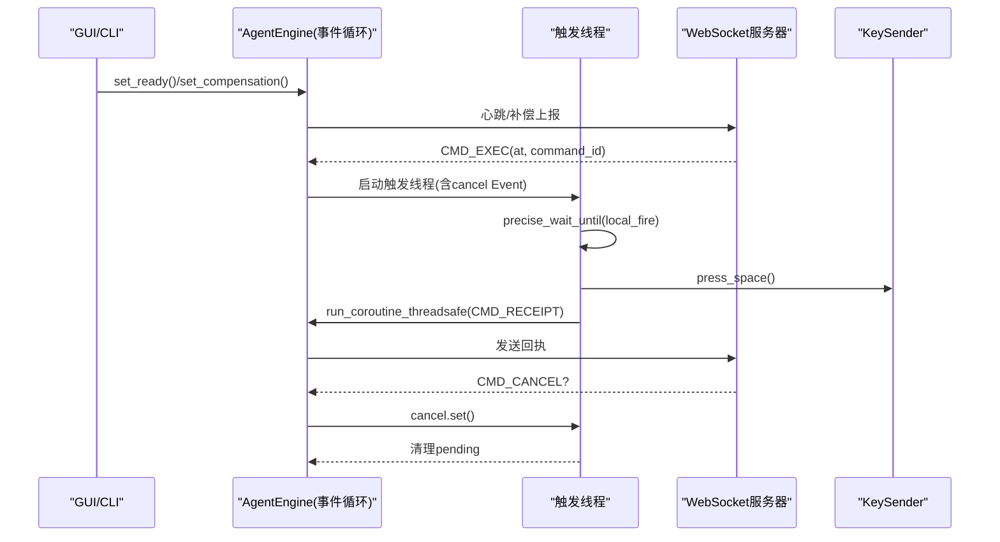
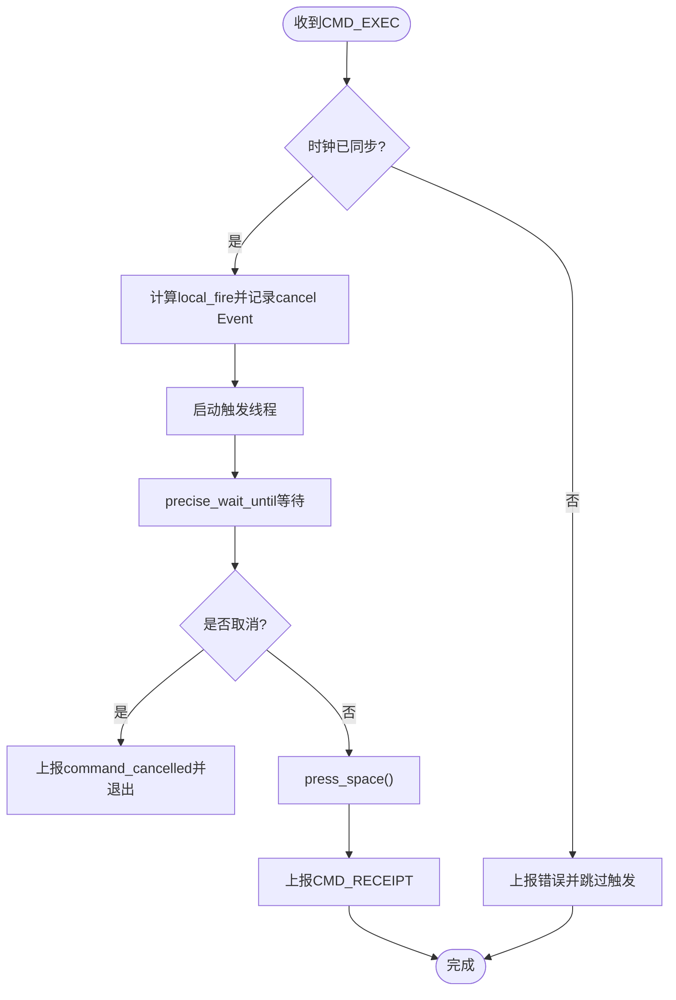
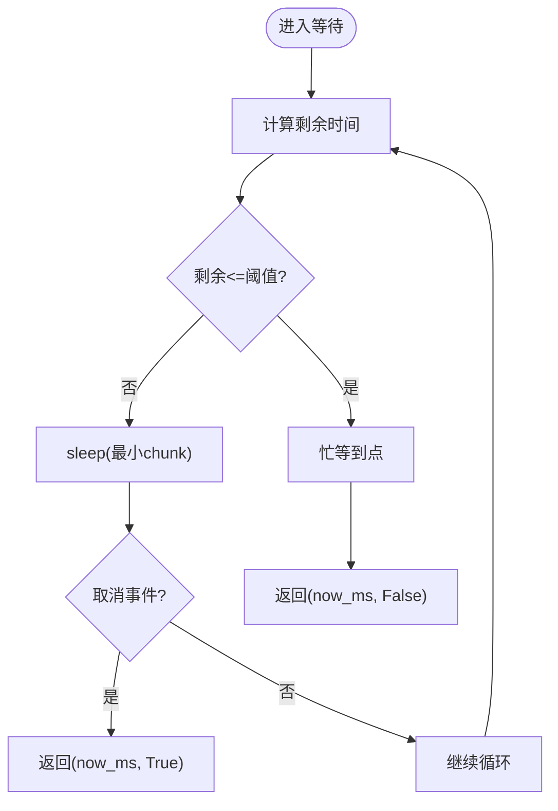
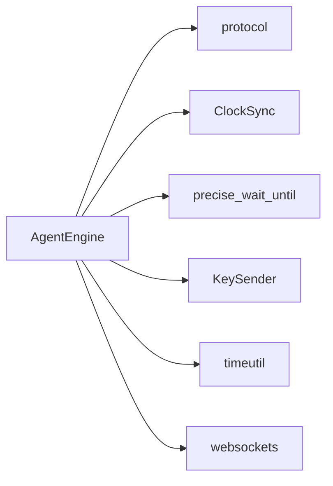

# 线程模型设计

<cite>
**本文引用的文件**
- [engine.py](file://agent/agent/engine.py)
- [scheduler.py](file://agent/agent/scheduler.py)
- [gui.py](file://agent/agent/gui.py)
- [cli.py](file://agent/agent/cli.py)
- [clocksync.py](file://agent/agent/clocksync.py)
- [protocol.py](file://agent/agent/protocol.py)
- [timeutil.py](file://agent/agent/timeutil.py)
- [keysender.py](file://agent/agent/keysender.py)
</cite>

## 目录
1. [简介](#简介)
2. [项目结构](#项目结构)
3. [核心组件](#核心组件)
4. [架构总览](#架构总览)
5. [详细组件分析](#详细组件分析)
6. [依赖关系分析](#依赖关系分析)
7. [性能考量](#性能考量)
8. [故障排查指南](#故障排查指南)
9. [结论](#结论)
10. [附录](#附录)

## 简介
本文档聚焦 ScriptCue 被控端的线程模型与协作模式，解释“异步事件循环 + 触发专用线程”的混合架构选择原因，并系统阐述主线程（事件循环）与触发线程的职责边界、线程间通信机制、线程安全设计、资源竞争避免与死锁预防策略。同时覆盖任务取消、异常传播、优雅关闭、线程状态监控与调试技巧，以及性能分析与优化建议。

## 项目结构
被控端由 GUI/CLI 入口、引擎（连接/时钟同步/调度）、高精度调度器、按键注入器、时钟同步模块、协议常量与时间工具组成。GUI/CLI 负责用户交互与 UI 更新；引擎在独立事件循环中运行，负责网络与定时；触发执行在独立线程中进行，通过队列或回调将事件回传 UI 线程显示。

```mermaid
graph TB
subgraph "UI层"
GUI["GUI应用<br/>tkinter"]
CLI["CLI应用<br/>命令行"]
end
subgraph "引擎层"
Engine["AgentEngine<br/>事件循环(异步)"]
ClockSync["ClockSync<br/>时钟同步"]
Scheduler["precise_wait_until<br/>高精度等待"]
end
subgraph "执行层"
KeySender["KeySender<br/>按键注入"]
end
subgraph "外部"
Server["WebSocket服务器"]
end
GUI --> Engine
CLI --> Engine
Engine --> ClockSync
Engine --> Scheduler
Engine --> KeySender
Engine < --> Server
```

图表来源
- [gui.py:206-238](file://agent/agent/gui.py#L206-L238)
- [cli.py:104-134](file://agent/agent/cli.py#L104-L134)
- [engine.py:31-157](file://agent/agent/engine.py#L31-L157)
- [scheduler.py:33-58](file://agent/agent/scheduler.py#L33-L58)
- [clocksync.py:29-106](file://agent/agent/clocksync.py#L29-L106)
- [keysender.py:99-126](file://agent/agent/keysender.py#L99-L126)

章节来源
- [gui.py:206-238](file://agent/agent/gui.py#L206-L238)
- [cli.py:104-134](file://agent/agent/cli.py#L104-L134)
- [engine.py:31-157](file://agent/agent/engine.py#L31-L157)

## 核心组件
- AgentEngine：被控端同步引擎，管理 WebSocket 连接生命周期、心跳、时钟同步、指令调度与回执上报。所有 on_event 回调在引擎线程中调用，GUI 需自行切换到 UI 线程。
- precise_wait_until：高精度等待实现，采用“粗睡眠 + 最后 N ms 自旋”的策略，确保到点精度。
- ClockSync：类 NTP 时钟同步，维护样本集，计算偏移与 RTT，提供质量评估。
- KeySender：跨平台空格键注入，支持自检与权限引导。
- GUI/CLI：分别提供图形界面与命令行交互，通过队列或回调接收引擎事件并刷新 UI。

章节来源
- [engine.py:31-157](file://agent/agent/engine.py#L31-L157)
- [scheduler.py:33-58](file://agent/agent/scheduler.py#L33-L58)
- [clocksync.py:29-106](file://agent/agent/clocksync.py#L29-L106)
- [keysender.py:99-126](file://agent/agent/keysender.py#L99-L126)
- [gui.py:96-238](file://agent/agent/gui.py#L96-L238)
- [cli.py:65-134](file://agent/agent/cli.py#L65-L134)

## 架构总览
被控端采用“事件循环 + 触发线程”的混合架构：
- 事件循环（主线程）：负责网络 I/O、消息分发、时钟同步、心跳、重连逻辑。使用 asyncio 以非阻塞方式处理 WebSocket 收发。
- 触发线程：为每条待触发命令创建独立线程，进行高精度等待与按键注入。该线程不阻塞事件循环，完成后通过 run_coroutine_threadsafe 将回执发回事件循环。
- 线程间通信：
  - 引擎 → UI：on_event 回调在引擎线程中调用，GUI 通过 queue.Queue 收集事件并在 UI 线程轮询消费，避免跨线程直接操作 UI。
  - 触发线程 → 事件循环：run_coroutine_threadsafe 提交发送回执协程，保证在事件循环上下文中执行网络发送。
  - 取消信号：threading.Event 用于取消等待与提示音流程。



图表来源
- [engine.py:268-379](file://agent/agent/engine.py#L268-L379)
- [scheduler.py:33-58](file://agent/agent/scheduler.py#L33-L58)
- [gui.py:291-337](file://agent/agent/gui.py#L291-L337)

章节来源
- [engine.py:268-379](file://agent/agent/engine.py#L268-L379)
- [gui.py:291-337](file://agent/agent/gui.py#L291-L337)

## 详细组件分析

### AgentEngine：事件循环与触发线程的协调者
- 职责分离：
  - 事件循环：连接建立、加入房间、密集/维持性时钟同步、心跳、消息分发、重连退避。
  - 触发线程：精确等待目标时刻、播放倒数提示音、按键注入、回执上报。
- 线程安全设计：
  - 对外控制接口（set_ready、set_compensation、stop、disconnect）可在任意线程调用。
  - 发送消息统一通过 _send_threadsafe，内部使用 run_coroutine_threadsafe 将协程投递到事件循环，避免跨线程直接操作 WebSocket。
  - 触发线程通过 threading.Event 与引擎共享取消信号，避免竞态。
- 资源竞争与死锁预防：
  - pending_fires 字典仅由事件循环写入/读取，触发线程只读/设置 Event，避免写写冲突。
  - 触发线程在 finally 中清理 pending，防止泄漏。
  - 断开时立即设置 stopped 并清空 pending，避免悬挂任务。
- 任务取消与异常传播：
  - CMD_CANCEL 会设置对应 Event，触发线程检测到后退出并上报取消事件。
  - 引擎捕获 CancelledError 与通用异常，上报错误并继续重连。
- 优雅关闭：
  - disconnect 设置 stopped 并尝试关闭 WebSocket；run 循环检测 stopped 退出。
  - 事件循环关闭前取消所有后台任务，确保资源释放。



图表来源
- [engine.py:297-379](file://agent/agent/engine.py#L297-L379)
- [scheduler.py:33-58](file://agent/agent/scheduler.py#L33-L58)

章节来源
- [engine.py:297-379](file://agent/agent/engine.py#L297-L379)

### precise_wait_until：高精度等待算法
- 策略：距离目标较远时使用 sleep 粗等（可被取消打断），进入最后 SPIN_THRESHOLD_MS 毫秒切换忙等自旋，逼近目标时刻，误差控制在亚毫秒级。
- 取消响应：每次循环检查取消事件，确保及时退出。
- 平台优化：Windows 下提升系统定时器分辨率，改善 sleep 精度。



图表来源
- [scheduler.py:33-58](file://agent/agent/scheduler.py#L33-L58)

章节来源
- [scheduler.py:33-58](file://agent/agent/scheduler.py#L33-L58)

### ClockSync：时钟同步与质量评估
- 类 NTP 算法：客户端记录 t0，服务端回复 ts，客户端记录 t1，估算 offset = ts - (t0 + t1)/2，rtt = t1 - t0。
- 样本管理：保留新鲜样本并按 RTT 排序择优，避免陈旧样本主导。
- 质量分级：根据样本数量与 RTT 给出 excellent/good/poor/none。

章节来源
- [clocksync.py:29-106](file://agent/agent/clocksync.py#L29-L106)

### KeySender：按键注入与自检
- 跨平台实现：Windows 使用 SendInput，macOS 使用 pynput 封装 CGEventPost。
- 自检与权限：启动时验证注入能力，macOS 引导辅助功能授权。
- 低延迟路径：原生调用减少中间层开销，降低注入延迟。

章节来源
- [keysender.py:99-126](file://agent/agent/keysender.py#L99-L126)

### GUI/CLI：UI 线程与引擎线程的解耦
- GUI：
  - 通过 queue.Queue 接收引擎事件，UI 线程定期轮询消费，避免跨线程直接修改 UI。
  - 倒计时与日志在 UI 线程更新，保持界面流畅。
- CLI：
  - 输入循环在独立线程中运行，命令调用引擎接口，输出打印在控制台。

章节来源
- [gui.py:96-238](file://agent/agent/gui.py#L96-L238)
- [gui.py:291-337](file://agent/agent/gui.py#L291-L337)
- [cli.py:65-134](file://agent/agent/cli.py#L65-L134)

## 依赖关系分析
- 引擎依赖：
  - protocol：消息类型、限制参数、重连退避、时钟同步参数。
  - clocksync：时钟同步请求构造与应答处理。
  - scheduler：高精度等待。
  - keysender：按键注入。
  - timeutil：本地毫秒时间戳。
- 外部依赖：
  - websockets：WebSocket 客户端。
  - tkinter（GUI）、ctypes/pynput（按键注入）。



图表来源
- [engine.py:12-24](file://agent/agent/engine.py#L12-L24)
- [protocol.py:1-80](file://agent/agent/protocol.py#L1-L80)
- [clocksync.py:11-14](file://agent/agent/clocksync.py#L11-L14)
- [scheduler.py:13-18](file://agent/agent/scheduler.py#L13-L18)
- [keysender.py:10-12](file://agent/agent/keysender.py#L10-L12)
- [timeutil.py:6-11](file://agent/agent/timeutil.py#L6-L11)

章节来源
- [engine.py:12-24](file://agent/agent/engine.py#L12-L24)
- [protocol.py:1-80](file://agent/agent/protocol.py#L1-L80)

## 性能考量
- 高精度等待：
  - 粗睡眠减少 CPU 占用，末段自旋保证到点精度。
  - Windows 提升系统定时器分辨率，降低 sleep 抖动。
- 线程模型：
  - 触发线程独立于事件循环，避免阻塞网络 I/O。
  - 通过 run_coroutine_threadsafe 将回执发送回事件循环，避免跨线程直接操作 socket。
- 时钟同步：
  - 密集采样快速收敛，维持性采样抑制漂移。
  - 样本老化与择优避免陈旧数据影响。
- 资源管理：
  - 断开时立即清理 pending 与任务，防止内存泄漏。
  - 心跳间隔与重连退避平衡网络负载与恢复速度。

[本节为通用性能讨论，无需具体文件引用]

## 故障排查指南
- 常见问题定位：
  - 时钟未同步：引擎上报 fire_skipped，检查时钟质量与样本数。
  - 指令取消：收到 CMD_CANCEL 后触发线程退出，检查主控端取消逻辑。
  - 按键注入失败：KeySender.check 自检失败，确认权限与系统拦截。
- 调试技巧：
  - 使用 CLI 的 status 命令查看连接、就绪、偏移、RTT、质量、样本数、补偿值。
  - GUI 日志区显示连接状态、时钟采样、指令调度与触发结果。
  - 观察心跳消息中的 clock_quality、compensation_ms、pending_command 字段。
- 优雅关闭：
  - 调用 disconnect 停止引擎并关闭连接，确保 pending 清理与任务取消。

章节来源
- [engine.py:106-157](file://agent/agent/engine.py#L106-L157)
- [engine.py:268-379](file://agent/agent/engine.py#L268-L379)
- [cli.py:65-134](file://agent/agent/cli.py#L65-L134)
- [gui.py:291-337](file://agent/agent/gui.py#L291-L337)

## 结论
ScriptCue 被控端采用“事件循环 + 触发线程”的混合架构，既保证了网络 I/O 的高并发与非阻塞特性，又实现了高精度的绝对时刻触发。通过清晰的职责分离、线程安全的通信机制、完善的取消与异常处理、以及优雅关闭策略，系统在稳定性与性能之间取得良好平衡。结合时钟同步与高质量等待算法，能够在不同网络环境下稳定工作，并提供良好的可观测性与可维护性。

[本节为总结性内容，无需具体文件引用]

## 附录
- 关键参数参考：
  - 心跳间隔：5 秒
  - 重连退避：1/2/4/8 秒，上限 10 秒
  - 密集采样：20 次，间隔 50ms
  - 维持采样：每 30 秒一次
  - 自旋阈值：50ms
- 线程状态监控：
  - 通过引擎回调获取连接状态、时钟质量、指令调度与触发结果。
  - GUI 实时显示倒计时与日志，CLI 提供交互式状态查询。

[本节为补充信息，无需具体文件引用]