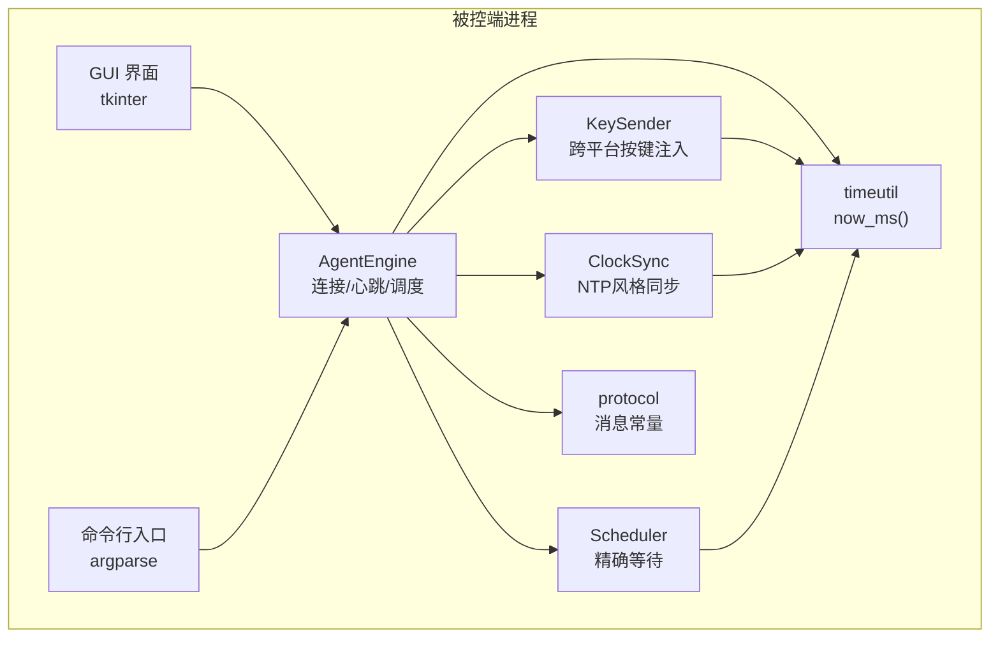
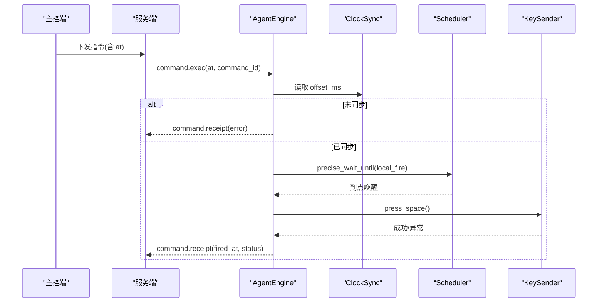
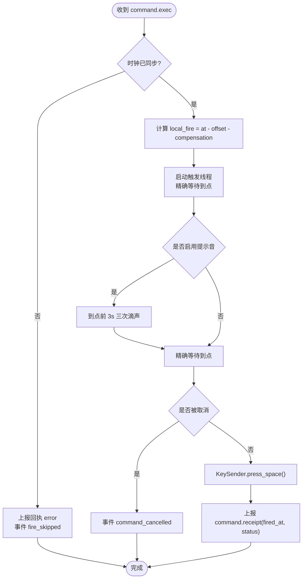
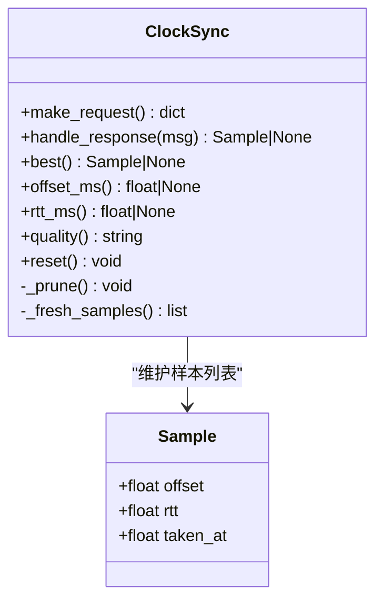
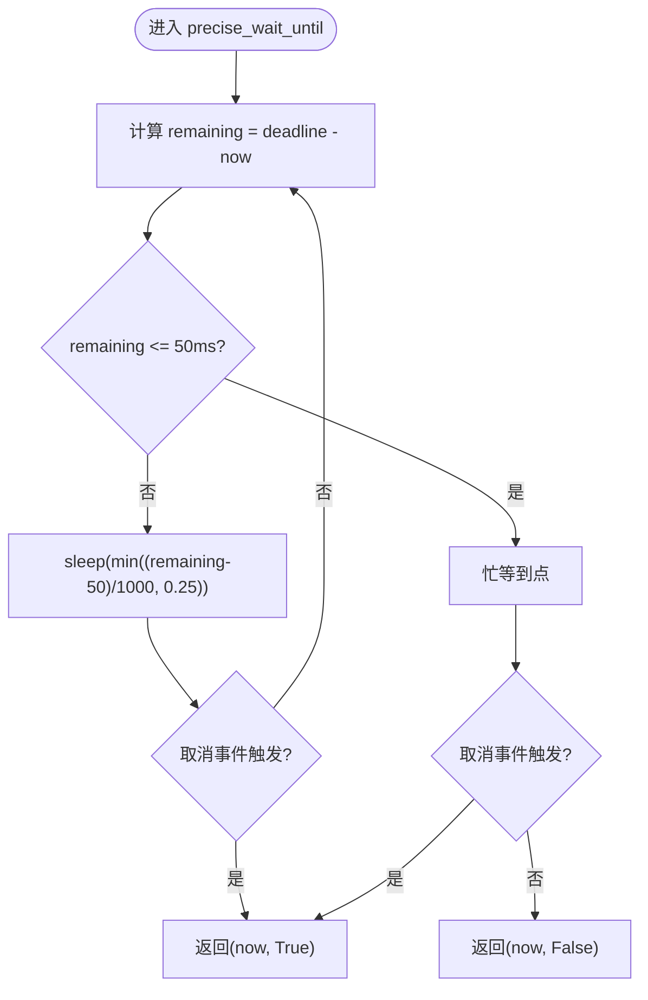
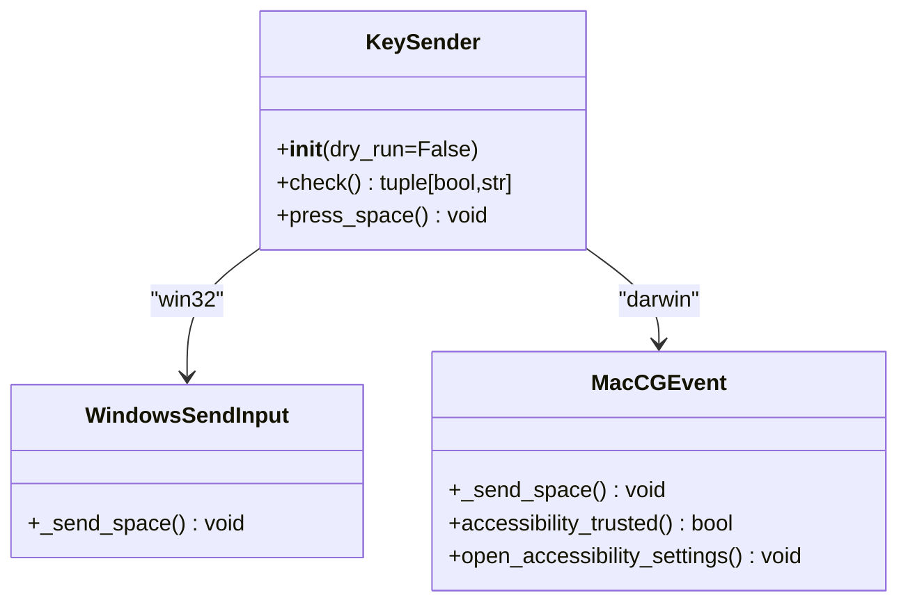
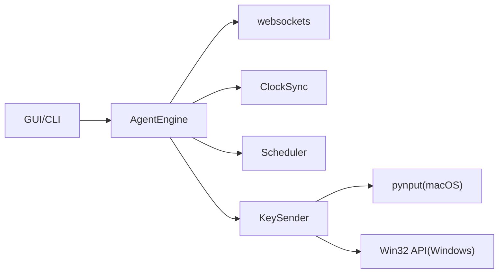

# 被控端架构设计

<cite>
**本文引用的文件**
- [engine.py](file://agent/agent/engine.py)
- [clocksync.py](file://agent/agent/clocksync.py)
- [scheduler.py](file://agent/agent/scheduler.py)
- [keysender.py](file://agent/agent/keysender.py)
- [timeutil.py](file://agent/agent/timeutil.py)
- [protocol.py](file://agent/agent/protocol.py)
- [cli.py](file://agent/agent/cli.py)
- [gui.py](file://agent/agent/gui.py)
- [README.md](file://README.md)
</cite>

## 目录
1. [简介](#简介)
2. [项目结构](#项目结构)
3. [核心组件](#核心组件)
4. [架构总览](#架构总览)
5. [详细组件分析](#详细组件分析)
6. [依赖关系分析](#依赖关系分析)
7. [性能考量](#性能考量)
8. [故障排查指南](#故障排查指南)
9. [结论](#结论)
10. [附录](#附录)

## 简介
本文件为 ScriptCue 被控端的架构文档，聚焦事件驱动的桌面应用架构，覆盖以下关键能力：
- 核心引擎：连接生命周期管理、消息分发、心跳与状态上报、指令调度与回执。
- 时钟同步系统：类 NTP 的偏移估计、样本老化与质量分级。
- 精确调度器：粗睡眠 + 末段自旋的高精度定时到点触发。
- 跨平台输入模拟：Windows SendInput 与 macOS CGEventPost（经 pynput）的空格键注入。
- 线程模型与生命周期：异步事件循环 + 独立触发线程 + UI 轮询；异常隔离与优雅退出。
- 多平台适配与优化：Windows 定时器分辨率提升、macOS 辅助功能权限引导与自检。

## 项目结构
被控端位于 agent 模块，采用“引擎 + 子系统”的分层组织：
- 引擎层：AgentEngine 负责协议交互、时钟同步、调度与触发编排。
- 时钟同步：ClockSync 实现采样、估算、质量评估与样本管理。
- 调度器：precise_wait_until 提供亚毫秒级到点等待。
- 输入模拟：KeySender 封装跨平台空格键注入与自检。
- 时间工具：now_ms 提供统一本地高精度时间源。
- 协议常量：统一的 JSON 消息类型、错误码、限制与间隔参数。
- 入口与界面：CLI 用于联调验证；GUI 提供用户交互、提示音、紧凑面板与配置持久化。

图表来源
- [engine.py:31-128](file://agent/agent/engine.py#L31-L128)
- [clocksync.py:29-106](file://agent/agent/clocksync.py#L29-L106)
- [scheduler.py:33-59](file://agent/agent/scheduler.py#L33-L59)
- [keysender.py:99-126](file://agent/agent/keysender.py#L99-L126)
- [timeutil.py:9-12](file://agent/agent/timeutil.py#L9-L12)
- [protocol.py:7-80](file://agent/agent/protocol.py#L7-L80)

章节来源
- [README.md:17-27](file://README.md#L17-L27)
- [engine.py:1-10](file://agent/agent/engine.py#L1-L10)

## 核心组件
- AgentEngine：被控端的核心协调者，维护 WebSocket 连接、时钟同步任务、心跳任务、指令接收与绝对时刻调度、触发回执与事件回调。
- ClockSync：实现类 NTP 的时钟同步算法，维护样本队列、选择最优样本、计算质量等级。
- Scheduler：实现“粗睡眠 + 最后 50ms 自旋”的高精度等待策略，支持取消信号。
- KeySender：跨平台空格键注入，包含开机自检与权限引导。
- timeutil：统一的时间获取接口，保证与服务器一致的毫秒级 Unix 时间戳。
- protocol：集中定义消息类型、错误码、默认提前量、心跳间隔、重连退避、同步参数等。

章节来源
- [engine.py:31-128](file://agent/agent/engine.py#L31-L128)
- [clocksync.py:29-106](file://agent/agent/clocksync.py#L29-L106)
- [scheduler.py:33-59](file://agent/agent/scheduler.py#L33-L59)
- [keysender.py:99-126](file://agent/agent/keysender.py#L99-L126)
- [timeutil.py:9-12](file://agent/agent/timeutil.py#L9-L12)
- [protocol.py:7-80](file://agent/agent/protocol.py#L7-L80)

## 架构总览
被控端以事件驱动为核心，运行在 asyncio 事件循环中；触发执行在独立线程中进行，避免阻塞事件循环。通过时钟同步将服务器下发的绝对执行时刻换算为本地时刻，使用高精度等待到点后执行按键注入并上报回执。

图表来源
- [engine.py:268-379](file://agent/agent/engine.py#L268-L379)
- [clocksync.py:44-87](file://agent/agent/clocksync.py#L44-L87)
- [scheduler.py:33-59](file://agent/agent/scheduler.py#L33-L59)
- [keysender.py:121-126](file://agent/agent/keysender.py#L121-L126)

## 详细组件分析

### 核心引擎 AgentEngine
职责与行为
- 连接生命周期：标准化 URL、建立 WebSocket、加入房间、指数退避重连、断线清理。
- 时钟同步：密集采样与维持性采样，处理服务器应答更新偏移与 RTT。
- 心跳与状态上报：周期性上报就绪状态、时钟质量、补偿值、RTT、偏移与待执行命令。
- 指令调度：解析绝对执行时刻，结合偏移与补偿计算本地触发时刻，启动独立线程精确等待。
- 触发执行：可选提示音倒数，调用 KeySender 注入空格键，计算 fired_at 并上报回执。
- 事件回调：on_event 在引擎线程中调用，GUI 需自行切换到 UI 线程。

线程模型
- 主线程：asyncio 事件循环，负责网络 I/O、消息分发、任务调度。
- 触发线程：每个指令一个 daemon 线程，自旋等待到点，完成后回事件循环发送回执。
- 取消机制：通过 threading.Event 支持指令取消。

异常处理
- 连接异常：捕获后记录日志、上报 error 事件、进入重连流程。
- 回调异常：on_event 异常被捕获并记录，不影响引擎继续运行。
- 注入异常：press_space 异常被捕获，回执标记为 error 并附带 detail。

图表来源
- [engine.py:297-379](file://agent/agent/engine.py#L297-L379)

章节来源
- [engine.py:31-128](file://agent/agent/engine.py#L31-L128)
- [engine.py:159-193](file://agent/agent/engine.py#L159-L193)
- [engine.py:198-241](file://agent/agent/engine.py#L198-L241)
- [engine.py:268-379](file://agent/agent/engine.py#L268-L379)

### 时钟同步系统 ClockSync
算法要点
- 请求构造：携带本地发出时刻 t0 与递增 id。
- 应答处理：服务器返回 ts，记录收到时刻 t1，计算 offset = ts - (t0 + t1)/2，rtt = t1 - t0。
- 样本管理：保留最新且 RTT 较小的样本，设置最大数量与老化窗口，避免陈旧样本主导。
- 最佳样本：从新鲜样本中选择 RTT 最小者为可信偏移。
- 质量分级：基于样本数量与 RTT 阈值分为 excellent/good/poor/none。

数据流
- 密集采样：加入房间后立即多次快速采样，加速收敛。
- 维持采样：周期性发送请求，抑制漂移。
- 结果暴露：offset_ms、rtt_ms、quality 供引擎与心跳上报使用。

图表来源
- [clocksync.py:22-106](file://agent/agent/clocksync.py#L22-L106)

章节来源
- [clocksync.py:29-106](file://agent/agent/clocksync.py#L29-L106)

### 精确调度器 scheduler
策略说明
- 粗睡眠阶段：距离目标较远时使用 sleep，每次最长 0.25 秒，确保取消响应及时。
- 自旋阶段：进入最后 50ms 切换忙等，逼近目标时刻，误差控制在亚毫秒级。
- 取消支持：可传入 threading.Event，在等待期间检查取消信号。
- 平台优化：Windows 下提升系统定时器分辨率至 1ms，改善 sleep 精度。

复杂度与性能
- 时间复杂度：O(1) 每轮检查剩余时间与取消状态。
- 空间复杂度：O(1)。
- 性能影响：自旋阶段 CPU 占用较高但持续时间短，整体对系统影响可控。

图表来源
- [scheduler.py:33-59](file://agent/agent/scheduler.py#L33-L59)

章节来源
- [scheduler.py:33-59](file://agent/agent/scheduler.py#L33-L59)

### 跨平台输入模拟 KeySender
平台适配
- Windows：直接调用 Win32 SendInput 注入空格键，延迟低、无第三方依赖。
- macOS：通过 pynput 调用 CGEventPost 注入空格键；提供辅助功能权限检测与引导打开系统设置页面。
- 其他平台：不支持时抛出异常。

自检与引导
- check：验证注入能力，macOS 下检测辅助功能权限，必要时引导用户授权。
- dry_run：演练模式跳过实际注入，便于联调。

图表来源
- [keysender.py:22-93](file://agent/agent/keysender.py#L22-L93)
- [keysender.py:99-126](file://agent/agent/keysender.py#L99-L126)

章节来源
- [keysender.py:22-93](file://agent/agent/keysender.py#L22-L93)
- [keysender.py:99-126](file://agent/agent/keysender.py#L99-L126)

### 时间工具 timeutil
- now_ms：返回毫秒级 Unix 时间戳（浮点保留亚毫秒信息），与服务端 timebase 一致。
- 作用：为时钟同步、调度与回执时间计算提供统一时间源。

章节来源
- [timeutil.py:9-12](file://agent/agent/timeutil.py#L9-L12)

### 协议常量 protocol
- 消息类型：主控→服务器、服务器→主控、被控端↔服务器的消息类型。
- 指令类型：play/pause/test 及校验集合。
- 时钟质量：excellent/good/poor/none。
- 错误码：房间不存在、口令错误、满员、非主控、坏消息等。
- 限制与间隔：默认提前量、心跳间隔、重连退避、同步采样次数与间隔、自旋阈值。

章节来源
- [protocol.py:7-80](file://agent/agent/protocol.py#L7-L80)

## 依赖关系分析
组件耦合与内聚
- AgentEngine 高内聚：聚合连接、同步、调度、触发与事件回调，对外暴露简洁控制接口。
- ClockSync 与 scheduler 解耦：分别专注时间偏移估算与到点等待，通过 now_ms 与 protocol 常量协作。
- KeySender 与 engine 解耦：engine 仅依赖 KeySender 的 press_space 接口，便于替换或测试。
- GUI/CLI 与 engine 解耦：通过 on_event 与 set_ready/set_compensation 进行交互。

外部依赖
- websockets：WebSocket 长连接。
- pynput：macOS 按键注入。
- ctypes：Windows 原生 API 调用。
- tkinter：GUI 界面。

图表来源
- [engine.py:12-23](file://agent/agent/engine.py#L12-L23)
- [keysender.py:10-12](file://agent/agent/keysender.py#L10-L12)
- [gui.py:15-28](file://agent/agent/gui.py#L15-L28)
- [cli.py:16-23](file://agent/agent/cli.py#L16-L23)

章节来源
- [engine.py:12-23](file://agent/agent/engine.py#L12-L23)
- [keysender.py:10-12](file://agent/agent/keysender.py#L10-L12)
- [gui.py:15-28](file://agent/agent/gui.py#L15-L28)
- [cli.py:16-23](file://agent/agent/cli.py#L16-L23)

## 性能考量
- 时钟同步：密集采样快速收敛，维持性采样抑制漂移；样本按 RTT 排序裁剪，避免内存膨胀。
- 精确调度：粗睡眠降低 CPU 占用，末段自旋保证亚毫秒精度；Windows 提升定时器分辨率减少 sleep 误差。
- 线程模型：触发线程独立于事件循环，避免阻塞；取消信号及时响应，减少无效等待。
- 注入路径：Windows 直调 SendInput，macOS 使用 pynput 的底层事件，尽量缩短注入链路。
- 资源管理：断线时取消任务、关闭连接；GUI 日志行数上限防止内存增长。

## 故障排查指南
常见问题与定位
- 时钟未同步：收到指令后无法调度，上报 error 并触发 fire_skipped；检查网络连接与服务器应答。
- 触发失败：press_space 抛出异常，回执 status=error 并附带 detail；检查安全软件拦截或 macOS 辅助功能权限。
- 指令取消：收到 CMD_CANCEL 后取消对应线程等待，上报 command_cancelled。
- 重连频繁：指数退避重连，关注网络抖动与服务器负载；检查防火墙与代理设置。
- GUI 无响应：确认 on_event 回调未阻塞 UI 线程；检查事件队列轮询是否正常。

定位建议
- 查看引擎事件：connecting/connected/disconnected/reconnecting/error/clock_sample/command_scheduled/command_fired/command_cancelled/fire_skipped/comp_changed。
- 检查补偿值：通过 GUI 或 CLI 调整 compensation_ms，观察 delta_ms 变化。
- 平台自检：macOS 先确认辅助功能权限；Windows 检查安全软件是否拦截 SendInput。

章节来源
- [engine.py:268-379](file://agent/agent/engine.py#L268-L379)
- [gui.py:301-336](file://agent/agent/gui.py#L301-L336)
- [keysender.py:107-119](file://agent/agent/keysender.py#L107-L119)

## 结论
被控端以事件驱动为核心，通过类 NTP 时钟同步与绝对时刻调度，实现跨设备高精度同步起播。引擎将连接管理、时钟同步、精确调度与输入模拟解耦，具备良好的可维护性与扩展性。线程模型与异常处理保障了稳定性与用户体验。不同平台的适配方案与性能优化技巧使系统在公网环境下仍能达到 ≤50ms 的同步精度。

## 附录
- 启动方式：GUI 版 python -m agent.gui；命令行版 python -m agent.cli --server ... --room ... --nickname ...
- 打包发布：Windows 使用 build_windows.ps1；macOS 使用 build_macos.sh。
- 协议版本：修改协议时需同时更新 server 与 agent 的 protocol 常量并递增 PROTO_VERSION。

章节来源
- [README.md:63-79](file://README.md#L63-L79)
- [protocol.py:7-80](file://agent/agent/protocol.py#L7-L80)