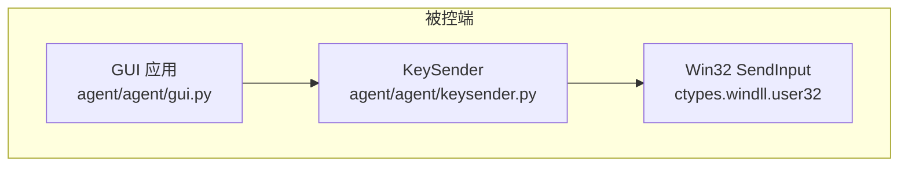
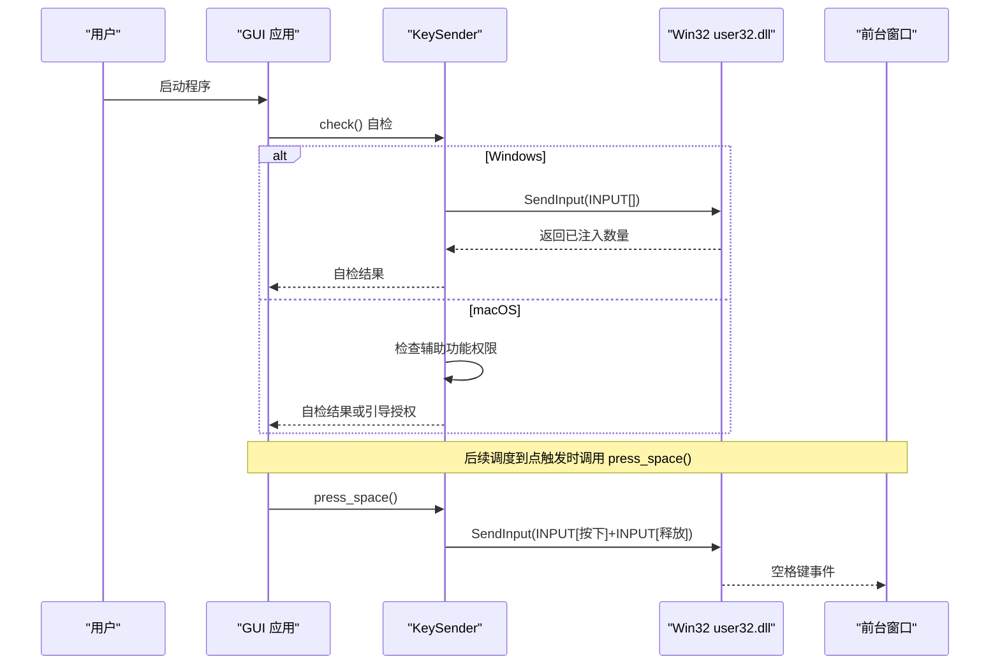
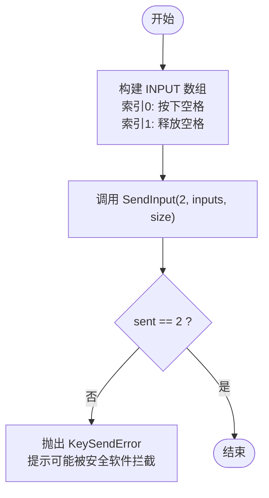
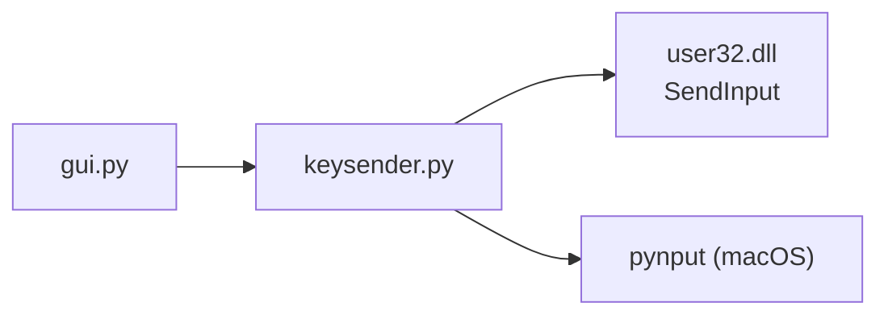

# Windows 键盘输入

<cite>
**本文引用的文件**
- [agent/agent/keysender.py](file://agent/agent/keysender.py)
- [agent/agent/gui.py](file://agent/agent/gui.py)
- [agent/build_windows.ps1](file://agent/build_windows.ps1)
- [README.md](file://README.md)
</cite>

## 目录
1. [简介](#简介)
2. [项目结构](#项目结构)
3. [核心组件](#核心组件)
4. [架构总览](#架构总览)
5. [详细组件分析](#详细组件分析)
6. [依赖关系分析](#依赖关系分析)
7. [性能考量](#性能考量)
8. [故障排查指南](#故障排查指南)
9. [结论](#结论)
10. [附录](#附录)

## 简介
本章节说明本项目在 Windows 平台上的键盘输入模拟实现。代码通过 ctypes 直接调用 Win32 API SendInput，使用 INPUT 与 KEYBDINPUT 结构体注入空格键事件，目标是低延迟、无第三方依赖的“系统级快速路径”。同时提供跨平台的统一入口 KeySender，并在 GUI 启动时进行自检与权限引导（macOS）。

## 项目结构
- agent/agent/keysender.py：定义 Windows/macOS 下的按键注入实现与统一入口 KeySender。
- agent/agent/gui.py：GUI 启动流程，包含开机自检与 macOS 辅助功能权限引导。
- agent/build_windows.ps1：Windows 打包脚本，生成单文件可执行程序。
- README.md：项目概述、运行方式与打包说明。

图表来源
- [agent/agent/gui.py:433-454](file://agent/agent/gui.py#L433-L454)
- [agent/agent/keysender.py:22-57](file://agent/agent/keysender.py#L22-L57)

章节来源
- [README.md:1-86](file://README.md#L1-L86)
- [agent/agent/keysender.py:1-126](file://agent/agent/keysender.py#L1-L126)
- [agent/agent/gui.py:433-454](file://agent/agent/gui.py#L433-L454)
- [agent/build_windows.ps1:1-15](file://agent/build_windows.ps1#L1-L15)

## 核心组件
- KeySender：跨平台统一入口，封装 check() 自检与 press_space() 实际注入。
- Windows 路径：定义 INPUT_KEYBOARD、KEYEVENTF_KEYUP、VK_SPACE，构造 INPUT 数组并调用 SendInput。
- macOS 路径：通过 pynput 发送空格，并提供辅助功能权限检测与设置页打开。

章节来源
- [agent/agent/keysender.py:14-126](file://agent/agent/keysender.py#L14-L126)

## 架构总览
下图展示从 GUI 启动到按键注入的完整调用链，包括自检、权限检查与实际注入。

图表来源
- [agent/agent/gui.py:433-454](file://agent/agent/gui.py#L433-L454)
- [agent/agent/keysender.py:22-57](file://agent/agent/keysender.py#L22-L57)
- [agent/agent/keysender.py:99-126](file://agent/agent/keysender.py#L99-L126)

## 详细组件分析

### Windows 下 SendInput 调用与 INPUT/KEYBDINPUT 配置
- 常量与结构体
  - INPUT_KEYBOARD：输入类型为键盘。
  - KEYEVENTF_KEYUP：表示按键释放。
  - VK_SPACE：空格键虚拟键码。
  - KEYBDINPUT：包含 wVk、wScan、dwFlags、time、dwExtraInfo。
  - _INPUT_UNION：联合体，承载 ki(KEYBDINPUT)。
  - INPUT：包含 type 与匿名联合体 u，可直接访问 ki。
- 注入流程
  - 构造长度为 2 的 INPUT 数组：
    - 第一个元素：type=INPUT_KEYBOARD，ki.wVk=VK_SPACE（按下）。
    - 第二个元素：type=INPUT_KEYBOARD，ki.dwFlags=KEYEVENTF_KEYUP（释放）。
  - 调用 SendInput(2, byref(inputs), sizeof(INPUT))。
  - 校验返回值：若 sent != 2，抛出 KeySendError，提示可能被安全软件拦截。

图表来源
- [agent/agent/keysender.py:26-57](file://agent/agent/keysender.py#L26-L57)

章节来源
- [agent/agent/keysender.py:22-57](file://agent/agent/keysender.py#L22-L57)

### 虚拟键码映射与扩展
- 当前仅使用 VK_SPACE 作为示例键位。
- 如需支持更多键位，可在相同模块中追加常量（如字母键、功能键等）并在构造 KEYBDINPUT 时替换 wVk 字段；必要时配合 dwFlags 组合标志位（例如修饰键）。

章节来源
- [agent/agent/keysender.py:26-57](file://agent/agent/keysender.py#L26-L57)

### 管理员权限要求与 UAC 提示处理
- 代码未显式请求管理员权限，也未包含 UAC 提权逻辑。
- 因此默认以当前用户上下文运行；若目标进程受完整性级别限制，可能需要以更高权限运行程序。
- 建议：
  - 在需要时通过清单文件或启动参数请求管理员权限，以便向高完整性进程注入。
  - 在 GUI 启动阶段检测权限并提示用户以管理员身份重启。
  - 注意：非必需场景不建议强制管理员权限，避免不必要的 UAC 弹窗。

章节来源
- [agent/agent/keysender.py:22-57](file://agent/agent/keysender.py#L22-L57)
- [agent/build_windows.ps1:1-15](file://agent/build_windows.ps1#L1-L15)

### 错误处理与兼容性考虑
- 错误处理
  - 当 SendInput 返回值不足时，抛出 KeySendError，便于上层捕获并提示“可能被安全软件拦截”等诊断信息。
  - GUI 启动时执行 check()，将异常转换为友好的错误消息显示给用户。
- 兼容性
  - 使用 ctypes 直调 Win32 API，不依赖第三方库，兼容性好。
  - 对不支持的平台（非 win32/darwin）直接抛出 KeySendError。

章节来源
- [agent/agent/keysender.py:14-126](file://agent/agent/keysender.py#L14-L126)
- [agent/agent/gui.py:433-454](file://agent/agent/gui.py#L433-L454)

### 调试技巧
- 自检优先：启动时调用 check()，确保注入链路可用。
- 最小化复现：先单独调用 press_space() 验证是否成功注入空格。
- 观察返回值：关注 SendInput 的返回计数，定位是构造问题还是系统拦截。
- 日志与提示：在 GUI 层记录自检结果与错误信息，便于用户反馈。

章节来源
- [agent/agent/gui.py:433-454](file://agent/agent/gui.py#L433-L454)
- [agent/agent/keysender.py:99-126](file://agent/agent/keysender.py#L99-L126)

### 性能优化建议
- 批量注入：一次 SendInput 调用可传入多个 INPUT，减少系统调用次数。
- 复用结构体：避免重复分配内存，尽量重用 INPUT 数组。
- 精简等待：精确到点触发时使用自旋等待，减少额外开销。
- 避免频繁 UI 更新：在高频触发场景下降低界面刷新频率。

章节来源
- [agent/agent/keysender.py:22-57](file://agent/agent/keysender.py#L22-L57)

## 依赖关系分析
- 运行时依赖
  - Windows：ctypes + user32.dll（系统自带）。
  - macOS：pynput（可选，用于 CGEventPost）。
- 打包产物
  - Windows：单文件 exe（build_windows.ps1），首次运行可能触发 SmartScreen 提示。
- 外部交互
  - 前台窗口：接收注入的空格键事件。

图表来源
- [agent/agent/keysender.py:22-57](file://agent/agent/keysender.py#L22-L57)
- [agent/agent/gui.py:433-454](file://agent/agent/gui.py#L433-L454)
- [agent/build_windows.ps1:1-15](file://agent/build_windows.ps1#L1-L15)

章节来源
- [agent/agent/keysender.py:22-57](file://agent/agent/keysender.py#L22-L57)
- [agent/build_windows.ps1:1-15](file://agent/build_windows.ps1#L1-L15)

## 性能考量
- 注入延迟：原生 SendInput 路径具备较低延迟（注释指出约 1~5ms）。
- 调用开销：尽量减少 SendInput 调用次数，合并多个按键事件。
- 等待策略：临近到点时使用高精度等待，避免长时间睡眠导致抖动。
- 资源占用：避免在高频循环中进行大量对象创建与 UI 更新。

章节来源
- [agent/agent/keysender.py:1-8](file://agent/agent/keysender.py#L1-L8)

## 故障排查指南
- 自检失败
  - 现象：check() 返回失败并提示“按键注入自检失败”。
  - 处理：确认未被安全软件拦截；尝试以管理员身份运行；检查目标窗口是否为前台。
- 注入数量不足
  - 现象：SendInput 返回计数小于期望值。
  - 处理：检查 INPUT 数组构造是否正确；确认 dwFlags 与 wVk 匹配；查看是否有安全软件拦截。
- 平台不支持
  - 现象：初始化 KeySender 时抛出“不支持的操作系统”。
  - 处理：仅在 win32/darwin 平台运行；其他平台需适配。

章节来源
- [agent/agent/keysender.py:14-126](file://agent/agent/keysender.py#L14-L126)
- [agent/agent/gui.py:433-454](file://agent/agent/gui.py#L433-L454)

## 结论
本项目在 Windows 上通过 ctypes 直接调用 SendInput 实现低延迟的键盘输入模拟，采用 INPUT 与 KEYBDINPUT 结构体配置按键事件，并以 KeySender 提供统一的跨平台接口。当前实现未内置管理员权限请求与 UAC 处理，建议在需要时按需启用。错误处理集中在 KeySendError 与 GUI 层的自检提示，便于快速定位问题。性能方面可通过批量注入、减少调用次数与高精度等待进一步优化。

## 附录
- 关键实现位置
  - Windows 注入路径：[agent/agent/keysender.py:22-57](file://agent/agent/keysender.py#L22-L57)
  - 统一入口与自检：[agent/agent/keysender.py:99-126](file://agent/agent/keysender.py#L99-L126)
  - GUI 启动自检与权限引导：[agent/agent/gui.py:433-454](file://agent/agent/gui.py#L433-L454)
  - Windows 打包脚本：[agent/build_windows.ps1:1-15](file://agent/build_windows.ps1#L1-L15)
  - 项目概览与运行方式：[README.md:1-86](file://README.md#L1-L86)