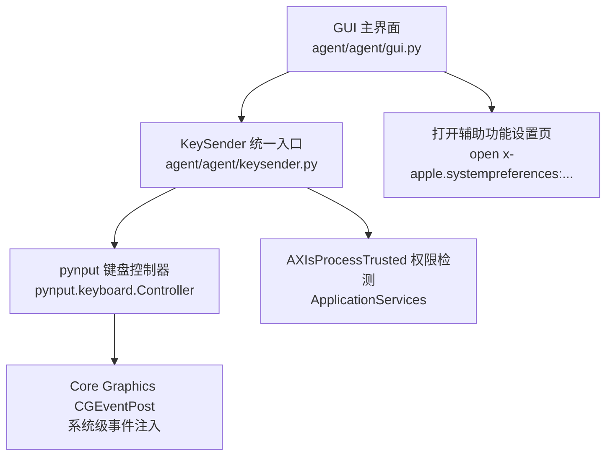
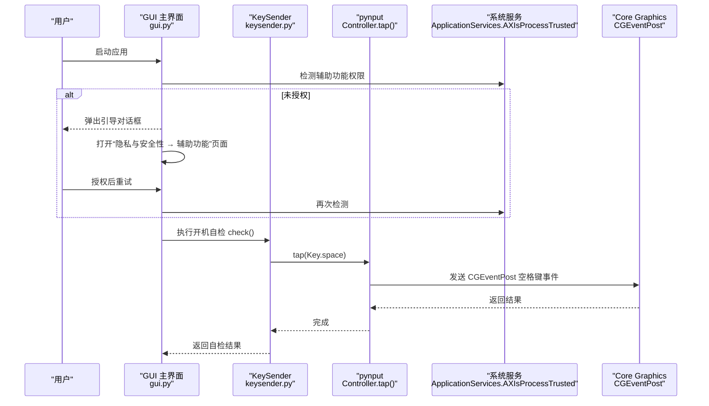
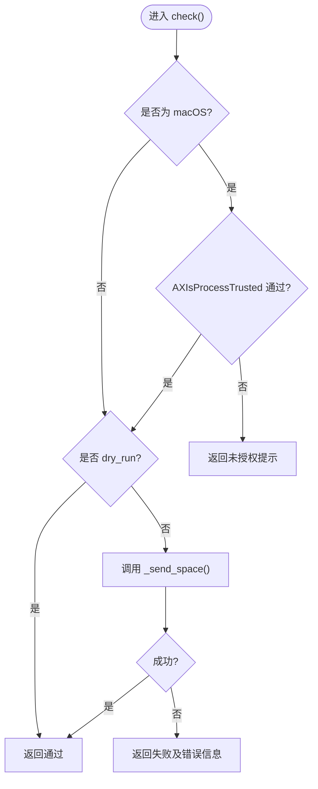
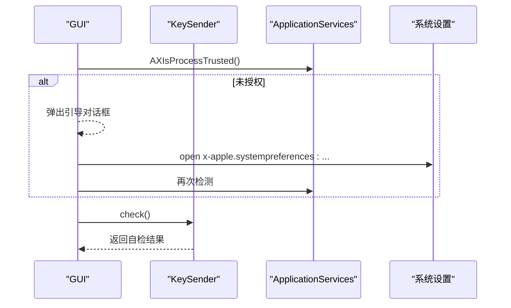
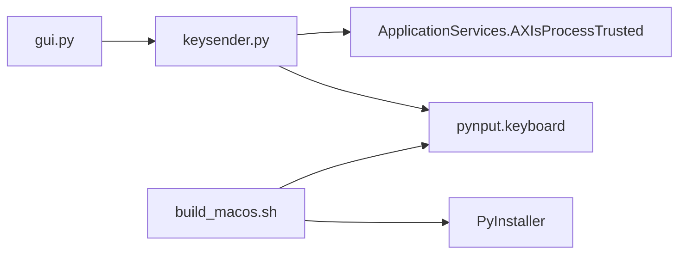

# macOS 键盘输入

<cite>
**本文引用的文件**
- [agent/agent/keysender.py](file://agent/agent/keysender.py)
- [agent/agent/gui.py](file://agent/agent/gui.py)
- [agent/build_macos.sh](file://agent/build_macos.sh)
- [agent/requirements.txt](file://agent/requirements.txt)
- [README.md](file://README.md)
</cite>

## 目录
1. [简介](#简介)
2. [项目结构](#项目结构)
3. [核心组件](#核心组件)
4. [架构总览](#架构总览)
5. [详细组件分析](#详细组件分析)
6. [依赖关系分析](#依赖关系分析)
7. [性能考量](#性能考量)
8. [故障诊断与调试](#故障诊断与调试)
9. [结论](#结论)
10. [附录](#附录)

## 简介
本文件聚焦 macOS 平台上的键盘输入模拟实现，围绕 Core Graphics（CG）事件、辅助功能权限、沙箱环境限制、错误处理与系统版本兼容性进行说明。重点解释 AXIsProcessTrusted 权限检测、pynput 库的使用以及 Accessibility 权限引导流程，并结合仓库中的实际代码给出可操作的排障建议。

## 项目结构
本项目为多端协作的同步起播系统，被控端在 macOS 上通过 GUI 启动，负责加入房间、时钟同步、到点触发空格键注入。macOS 端的按键注入由 KeySender 提供统一入口，底层使用 pynput 封装 CGEventPost；同时通过 ApplicationServices 的 AXIsProcessTrusted 检测辅助功能权限，并在 GUI 中提供权限引导。

图表来源
- [agent/agent/gui.py:433-454](file://agent/agent/gui.py#L433-L454)
- [agent/agent/keysender.py:63-92](file://agent/agent/keysender.py#L63-L92)
- [agent/agent/keysender.py:99-126](file://agent/agent/keysender.py#L99-L126)

章节来源
- [README.md:16-27](file://README.md#L16-L27)
- [agent/agent/gui.py:1-13](file://agent/agent/gui.py#L1-L13)

## 核心组件
- KeySender：跨平台空格键注入器，提供 check() 自检与 press_space() 触发；在 macOS 下通过 pynput 调用 CGEventPost，并通过 AXIsProcessTrusted 检测辅助功能权限。
- GUI 启动检查：在 macOS 上循环提示并引导用户开启“辅助功能”权限，随后执行开机自检。
- 打包脚本：使用 PyInstaller 将应用打包为 .app，收集 pynput 子模块。
- 依赖声明：仅在 darwin 平台引入 pynput。

章节来源
- [agent/agent/keysender.py:99-126](file://agent/agent/keysender.py#L99-L126)
- [agent/agent/gui.py:433-454](file://agent/agent/gui.py#L433-L454)
- [agent/build_macos.sh:11-15](file://agent/build_macos.sh#L11-L15)
- [agent/requirements.txt:3](file://agent/requirements.txt#L3)

## 架构总览
下图展示了从 GUI 启动到按键注入的完整流程，包括权限检测、引导与自检。

图表来源
- [agent/agent/gui.py:433-454](file://agent/agent/gui.py#L433-L454)
- [agent/agent/keysender.py:63-92](file://agent/agent/keysender.py#L63-L92)
- [agent/agent/keysender.py:107-119](file://agent/agent/keysender.py#L107-L119)

## 详细组件分析

### KeySender（macOS 路径）
- 权限检测：通过 ctypes 加载 ApplicationServices 并调用 AXIsProcessTrusted 判断当前进程是否已获得辅助功能权限。
- 按键注入：使用 pynput.keyboard.Controller().tap(Key.space) 触发空格键，底层走 CGEventPost。
- 自检逻辑：若未获得权限直接返回失败；否则尝试发送一次空格作为自检，捕获异常并返回诊断信息。
- 错误类型：自定义 KeySendError 用于跨平台错误上报。

图表来源
- [agent/agent/keysender.py:63-92](file://agent/agent/keysender.py#L63-L92)
- [agent/agent/keysender.py:107-119](file://agent/agent/keysender.py#L107-L119)

章节来源
- [agent/agent/keysender.py:14-15](file://agent/agent/keysender.py#L14-L15)
- [agent/agent/keysender.py:63-92](file://agent/agent/keysender.py#L63-L92)
- [agent/agent/keysender.py:99-126](file://agent/agent/keysender.py#L99-L126)

### GUI 启动与权限引导（R-10 / R-11）
- 启动时优先检测 macOS 辅助功能权限，若未授权则循环弹窗引导用户前往“隐私与安全性 → 辅助功能”勾选本程序。
- 权限通过后，创建 KeySender 并执行开机自检，向用户反馈自检结果。
- 通过 subprocess 调用 open 命令打开系统偏好设置的辅助功能页面。

图表来源
- [agent/agent/gui.py:433-454](file://agent/agent/gui.py#L433-L454)
- [agent/agent/keysender.py:63-92](file://agent/agent/keysender.py#L63-L92)

章节来源
- [agent/agent/gui.py:433-454](file://agent/agent/gui.py#L433-L454)
- [agent/agent/keysender.py:87-92](file://agent/agent/keysender.py#L87-L92)

### 构建与打包（macOS）
- 使用 PyInstaller 以窗口模式打包，指定 Bundle Identifier，并收集 pynput 子模块以确保运行时可用。
- 产物为 ScriptCue.app，首次运行需右键→打开（未签名应用），详见 README 指引。

章节来源
- [agent/build_macos.sh:11-15](file://agent/build_macos.sh#L11-L15)
- [README.md:74-79](file://README.md#L74-L79)

### 依赖与环境
- 仅在 macOS 平台引入 pynput，避免在其他平台产生不必要依赖。
- 服务端与被控端共享 websockets 版本约束，确保兼容。

章节来源
- [agent/requirements.txt:3](file://agent/requirements.txt#L3)
- [agent/requirements.txt:1-2](file://agent/requirements.txt#L1-L2)

## 依赖关系分析
- GUI 依赖 KeySender 和 AgentEngine；KeySender 在 macOS 下依赖 pynput 与 ApplicationServices。
- 打包阶段需要 pyinstaller 与 pynput；运行时仅 pynput（macOS）。

图表来源
- [agent/agent/gui.py:25-28](file://agent/agent/gui.py#L25-L28)
- [agent/agent/keysender.py:63-92](file://agent/agent/keysender.py#L63-L92)
- [agent/build_macos.sh:11-15](file://agent/build_macos.sh#L11-L15)

章节来源
- [agent/agent/gui.py:25-28](file://agent/agent/gui.py#L25-L28)
- [agent/agent/keysender.py:63-92](file://agent/agent/keysender.py#L63-L92)
- [agent/build_macos.sh:11-15](file://agent/build_macos.sh#L11-L15)

## 性能考量
- 注入延迟：注释指出选择原生路径以实现最低延迟（1~5ms），通过 pynput 调用 CGEventPost 直达系统事件队列。
- 自检策略：check() 会实际发送一次空格键，验证注入链路畅通，有助于快速发现权限或拦截问题。
- 资源占用：pynput 按需导入，减少启动开销；GUI 轮询事件间隔固定，避免 UI 卡顿。

章节来源
- [agent/agent/keysender.py:1-8](file://agent/agent/keysender.py#L1-L8)
- [agent/agent/keysender.py:107-119](file://agent/agent/keysender.py#L107-L119)
- [agent/agent/gui.py:31](file://agent/agent/gui.py#L31)

## 故障诊断与调试
- 权限问题
  - 现象：check() 返回未获得辅助功能权限。
  - 排查：确认已在“系统设置 → 隐私与安全性 → 辅助功能”中勾选本程序；必要时重启应用。
  - 相关实现：AXIsProcessTrusted 检测与 open_accessibility_settings 引导。
- 注入失败
  - 现象：check() 抛出异常或返回失败。
  - 排查：确认前台窗口可接收键盘事件；检查安全软件是否拦截；确认 pynput 已正确打包。
- 打包与运行
  - 现象：首次运行无法打开或被系统阻止。
  - 排查：按 README 指引右键→打开；确保 build_macos.sh 收集了 pynput 子模块。
- 日志与状态
  - 现象：GUI 显示连接或指令状态异常。
  - 排查：查看 GUI 日志区输出；检查网络与服务端连通性。

章节来源
- [agent/agent/keysender.py:63-92](file://agent/agent/keysender.py#L63-L92)
- [agent/agent/keysender.py:107-119](file://agent/agent/keysender.py#L107-L119)
- [agent/agent/gui.py:433-454](file://agent/agent/gui.py#L433-L454)
- [README.md:74-79](file://README.md#L74-L79)

## 结论
该实现以 KeySender 为核心，在 macOS 上通过 pynput 调用 CGEventPost 实现低延迟空格键注入，并使用 AXIsProcessTrusted 进行辅助功能权限检测。GUI 层提供友好的权限引导与开机自检，结合打包脚本确保运行时依赖完整。整体方案兼顾易用性与可靠性，适用于对精度与延迟敏感的场景。

## 附录
- 术语
  - CGEventPost：Core Graphics 的事件发布接口，用于向系统事件队列注入输入事件。
  - AXIsProcessTrusted：ApplicationServices 提供的辅助功能权限检测函数。
  - pynput：Python 第三方库，封装跨平台输入事件注入能力。
- 参考
  - 项目概览与快速开始见 README。
  - 打包与首次运行注意事项见 build_macos.sh 与 README。