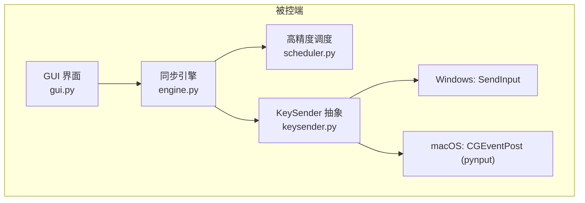
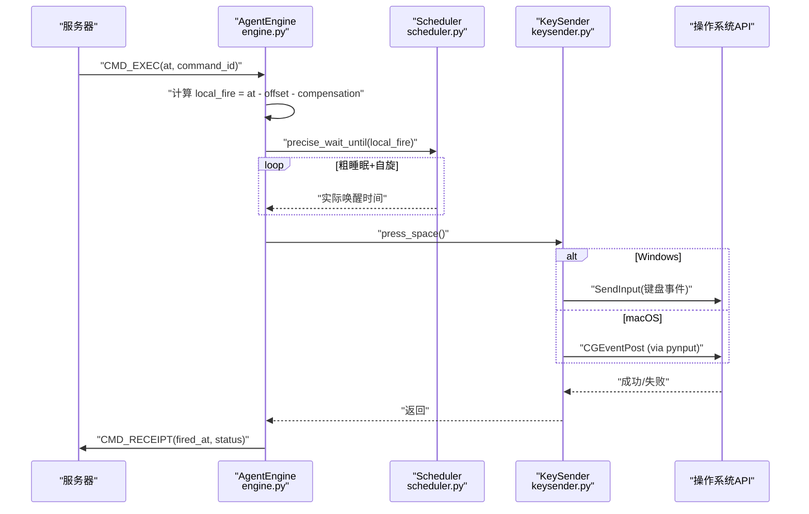
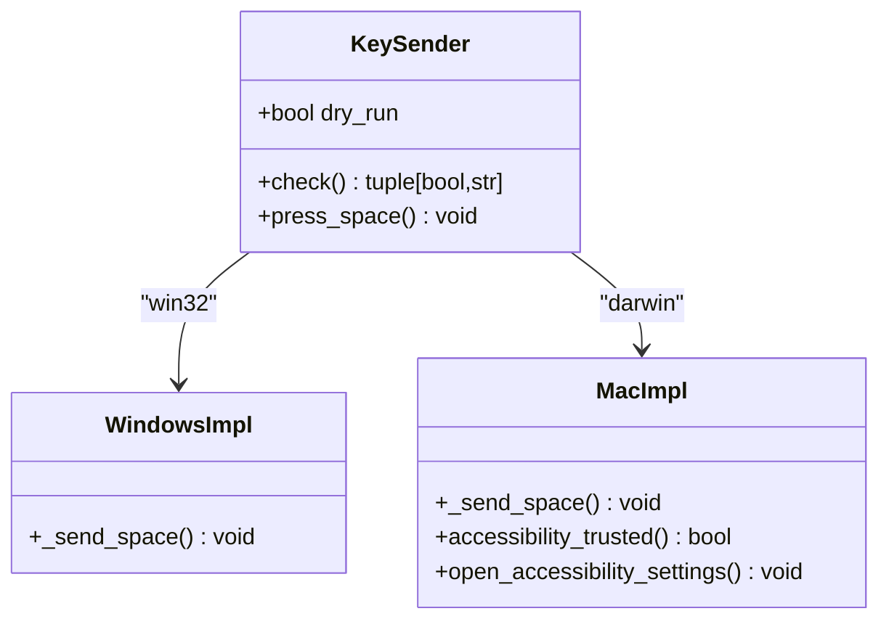
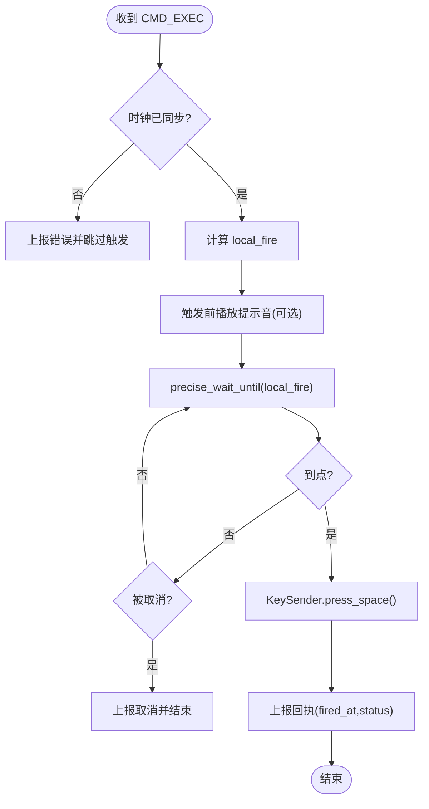
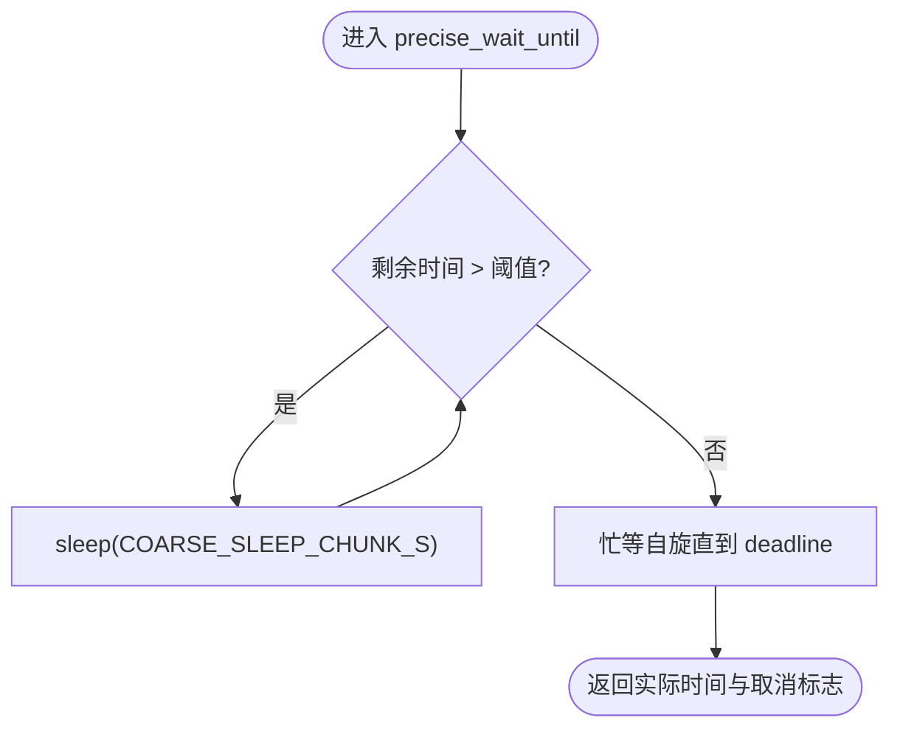
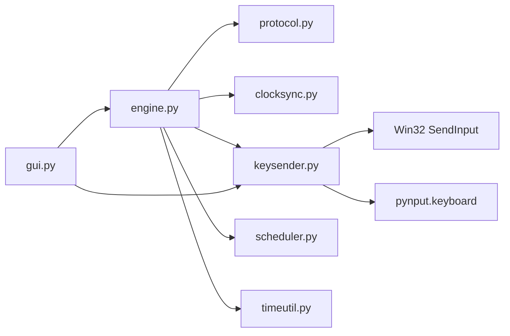

# 跨平台输入模拟

<cite>
**本文引用的文件**
- [agent/agent/keysender.py](file://agent/agent/keysender.py)
- [agent/agent/engine.py](file://agent/agent/engine.py)
- [agent/agent/scheduler.py](file://agent/agent/scheduler.py)
- [agent/agent/gui.py](file://agent/agent/gui.py)
- [README.md](file://README.md)
</cite>

## 目录
1. [简介](#简介)
2. [项目结构](#项目结构)
3. [核心组件](#核心组件)
4. [架构总览](#架构总览)
5. [详细组件分析](#详细组件分析)
6. [依赖关系分析](#依赖关系分析)
7. [性能与精度](#性能与精度)
8. [权限、安全与异常处理](#权限安全与异常处理)
9. [故障排除指南](#故障排除指南)
10. [扩展开发指南](#扩展开发指南)
11. [结论](#结论)

## 简介
本文件面向 ScriptCue 被控端的“跨平台输入模拟”子系统，重点解释 KeySender 抽象接口设计、Windows 与 macOS 平台的实现差异、权限与安全限制、异常处理策略、按键注入的精度控制与性能优化，以及各平台配置与故障排除方法。同时提供自定义触发动作的扩展开发指南，帮助开发者在不破坏现有架构的前提下替换或增强触发行为。

## 项目结构
ScriptCue 由服务端、主控端与被控端组成。本文聚焦被控端（agent）中与输入模拟相关的模块：
- keysender.py：跨平台空格键注入器，封装 Windows SendInput 与 macOS CGEventPost（经 pynput）。
- engine.py：同步引擎，负责连接、时钟同步、绝对时刻调度与触发回执；将“定时”和“动作”解耦，通过 KeySender 执行具体动作。
- scheduler.py：高精度定时调度，采用“粗睡眠 + 末段自旋”策略，确保到点精度。
- gui.py：GUI 入口，负责开机自检、macOS 辅助功能权限引导与用户交互。
- README.md：整体架构概览与环境要求。

图表来源
- [agent/agent/gui.py:1-200](file://agent/agent/gui.py#L1-L200)
- [agent/agent/engine.py:1-120](file://agent/agent/engine.py#L1-L120)
- [agent/agent/scheduler.py:1-59](file://agent/agent/scheduler.py#L1-L59)
- [agent/agent/keysender.py:1-126](file://agent/agent/keysender.py#L1-L126)

章节来源
- [README.md:16-28](file://README.md#L16-L28)
- [agent/agent/gui.py:1-200](file://agent/agent/gui.py#L1-L200)
- [agent/agent/engine.py:1-120](file://agent/agent/engine.py#L1-L120)
- [agent/agent/scheduler.py:1-59](file://agent/agent/scheduler.py#L1-L59)
- [agent/agent/keysender.py:1-126](file://agent/agent/keysender.py#L1-L126)

## 核心组件
- KeySender：跨平台空格键注入的统一入口，屏蔽平台差异，提供 check() 自检与 press_space() 触发。
- AgentEngine：接收服务器指令，计算本地触发时刻，使用 scheduler 精确等待，并在到点时调用 KeySender 执行动作。
- Scheduler：实现高精度等待，避免普通 sleep 带来的系统调度误差。
- GUI：启动流程中完成权限检查与自检，必要时引导用户开启辅助功能权限。

章节来源
- [agent/agent/keysender.py:99-126](file://agent/agent/keysender.py#L99-L126)
- [agent/agent/engine.py:31-120](file://agent/agent/engine.py#L31-L120)
- [agent/agent/scheduler.py:1-59](file://agent/agent/scheduler.py#L1-L59)
- [agent/agent/gui.py:429-455](file://agent/agent/gui.py#L429-L455)

## 架构总览
下图展示从收到服务器指令到最终注入空格键的关键流程，包括时钟同步、精确定时与跨平台注入。

图表来源
- [agent/agent/engine.py:297-378](file://agent/agent/engine.py#L297-L378)
- [agent/agent/scheduler.py:33-59](file://agent/agent/scheduler.py#L33-L59)
- [agent/agent/keysender.py:46-57](file://agent/agent/keysender.py#L46-L57)
- [agent/agent/keysender.py:77-79](file://agent/agent/keysender.py#L77-L79)

## 详细组件分析

### KeySender 抽象接口与平台实现
- 统一入口 KeySender：
  - __init__：校验平台，支持 dry_run 模式用于演练。
  - check：开机自检，macOS 下检测辅助功能权限，并尝试发送一次空格验证注入能力。
  - press_space：向前台窗口模拟按下并释放空格键。
- Windows 实现：
  - 通过 ctypes 直接调用 Win32 API SendInput，构造两个键盘事件（按下与抬起），批量提交以提升效率。
  - 若返回数量不等于预期，抛出 KeySendError，提示可能被安全软件拦截。
- macOS 实现：
  - 通过 pynput.keyboard.Controller().tap(Key.space) 调用底层 CGEventPost。
  - 提供 accessibility_trusted() 检测当前进程是否具备辅助功能权限。
  - 提供 open_accessibility_settings() 打开系统设置页面以引导授权。

图表来源
- [agent/agent/keysender.py:99-126](file://agent/agent/keysender.py#L99-L126)
- [agent/agent/keysender.py:22-57](file://agent/agent/keysender.py#L22-L57)
- [agent/agent/keysender.py:63-92](file://agent/agent/keysender.py#L63-L92)

章节来源
- [agent/agent/keysender.py:14-16](file://agent/agent/keysender.py#L14-L16)
- [agent/agent/keysender.py:22-57](file://agent/agent/keysender.py#L22-L57)
- [agent/agent/keysender.py:63-92](file://agent/agent/keysender.py#L63-L92)
- [agent/agent/keysender.py:99-126](file://agent/agent/keysender.py#L99-L126)

### 同步引擎与触发流程
- AgentEngine 在收到 CMD_EXEC 后：
  - 校验时钟同步状态，未同步则上报错误并跳过触发。
  - 计算本地触发时刻 local_fire，创建取消事件并启动独立线程执行 _fire_worker。
  - 在触发前播放倒数提示音（可配置），然后调用 precise_wait_until 精确等待。
  - 到点后调用 KeySender.press_space()，捕获异常并将结果作为回执上报。
- 回调 on_event 在引擎线程中调用，GUI 需自行切换到 UI 线程更新界面。

图表来源
- [agent/agent/engine.py:297-378](file://agent/agent/engine.py#L297-L378)

章节来源
- [agent/agent/engine.py:297-378](file://agent/agent/engine.py#L297-L378)

### 高精度调度与性能优化
- 策略：粗睡眠 + 最后 SPIN_THRESHOLD_MS 毫秒自旋等待，避免普通 sleep 的系统调度误差。
- Windows 优化：提升系统定时器分辨率（timeBeginPeriod(1)），减少粗睡眠段的过睡风险。
- 取消机制：支持 threading.Event 打断等待，保证命令取消及时响应。
- 线程模型：触发在独立线程执行，避免阻塞事件循环；完成后通过 run_coroutine_threadsafe 回事件循环发送回执。

图表来源
- [agent/agent/scheduler.py:33-59](file://agent/agent/scheduler.py#L33-L59)

章节来源
- [agent/agent/scheduler.py:1-59](file://agent/agent/scheduler.py#L1-L59)
- [agent/agent/engine.py:1-10](file://agent/agent/engine.py#L1-L10)

### GUI 启动与权限引导
- 启动时检测 macOS 辅助功能权限，未授权则循环引导用户打开系统设置并勾选本程序。
- 运行 KeySender.check() 进行开机自检，失败时弹窗提示。
- 提供提示音函数 make_beep_fn()，Windows 使用 winsound，macOS 使用 afplay。

章节来源
- [agent/agent/gui.py:429-455](file://agent/agent/gui.py#L429-L455)
- [agent/agent/gui.py:71-89](file://agent/agent/gui.py#L71-L89)

## 依赖关系分析
- engine.py 依赖：
  - protocol：协议常量与默认提前量。
  - clocksync：时钟同步。
  - keysender：按键注入。
  - scheduler：高精度等待。
  - timeutil：时间工具。
- keysender.py 依赖：
  - Windows：ctypes + winmm（通过 scheduler 提升定时器分辨率）。
  - macOS：pynput.keyboard（封装 CGEventPost）。
- gui.py 依赖：
  - tkinter：UI。
  - winsound/afplay：提示音。
  - subprocess：打开系统设置。

图表来源
- [agent/agent/engine.py:12-24](file://agent/agent/engine.py#L12-L24)
- [agent/agent/keysender.py:22-79](file://agent/agent/keysender.py#L22-L79)
- [agent/agent/gui.py:15-28](file://agent/agent/gui.py#L15-L28)

章节来源
- [agent/agent/engine.py:12-24](file://agent/agent/engine.py#L12-L24)
- [agent/agent/keysender.py:22-79](file://agent/agent/keysender.py#L22-L79)
- [agent/agent/gui.py:15-28](file://agent/agent/gui.py#L15-L28)

## 性能与精度
- 注入延迟：选择原生路径（Windows SendInput、macOS CGEventPost via pynput）以降低延迟（约 1~5ms）。
- 到点精度：采用“粗睡眠 + 末段自旋”，Windows 下提升系统定时器分辨率，确保粗睡眠不显著过睡。
- 线程隔离：触发在独立线程执行，避免阻塞事件循环；取消事件保障及时退出。
- 建议：
  - 保持网络抖动小于提前量，避免影响同步精度。
  - 合理设置补偿值（compensation_ms）以适配不同设备与时钟漂移。
  - 在资源紧张环境下，减少提示音与日志输出频率。

章节来源
- [agent/agent/keysender.py:1-8](file://agent/agent/keysender.py#L1-L8)
- [agent/agent/scheduler.py:1-11](file://agent/agent/scheduler.py#L1-L11)
- [agent/agent/engine.py:297-378](file://agent/agent/engine.py#L297-L378)

## 权限、安全与异常处理
- 权限要求：
  - macOS：需要“辅助功能”权限才能注入按键。提供 accessibility_trusted() 检测与 open_accessibility_settings() 引导。
  - Windows：无额外权限要求，但可能被安全软件拦截。
- 安全限制：
  - 仅对前台窗口注入空格键，避免全局干扰。
  - 通过 dry_run 模式支持演练，不实际触发系统事件。
- 异常处理：
  - Windows：SendInput 返回数量不符时抛出 KeySendError，提示可能被安全软件拦截。
  - macOS：未授权时 check() 返回失败信息，GUI 引导用户授权。
  - 引擎层：捕获 press_space() 异常，上报回执中的 status 与 detail，便于主控端可见。

章节来源
- [agent/agent/keysender.py:63-92](file://agent/agent/keysender.py#L63-L92)
- [agent/agent/keysender.py:46-57](file://agent/agent/keysender.py#L46-L57)
- [agent/agent/gui.py:429-455](file://agent/agent/gui.py#L429-L455)
- [agent/agent/engine.py:362-374](file://agent/agent/engine.py#L362-L374)

## 故障排除指南
- macOS 无法注入按键：
  - 现象：check() 返回失败，提示未获得辅助功能权限。
  - 解决：点击重试打开系统设置 → 隐私与安全性 → 辅助功能，勾选本程序后重启应用。
- Windows 注入失败：
  - 现象：KeySendError 提示 SendInput 失败。
  - 解决：确认程序未被安全软件拦截；尝试以管理员身份运行；关闭可能拦截系统事件的防护软件。
- 时钟未同步导致跳过触发：
  - 现象：引擎上报“时钟未同步”。
  - 解决：检查网络连接与服务端可达性；等待多次 ping 采样收敛；必要时调整补偿值。
- 提示音不可用：
  - 现象：触发前无声音。
  - 解决：Windows 检查 winsound 可用性；macOS 检查 afplay 与系统声音设置。

章节来源
- [agent/agent/gui.py:429-455](file://agent/agent/gui.py#L429-L455)
- [agent/agent/keysender.py:46-57](file://agent/agent/keysender.py#L46-L57)
- [agent/agent/engine.py:304-311](file://agent/agent/engine.py#L304-L311)
- [agent/agent/gui.py:71-89](file://agent/agent/gui.py#L71-L89)

## 扩展开发指南
- 目标：在不破坏现有架构的前提下，替换或增强触发动作（如改为组合键、鼠标点击或其他系统事件）。
- 步骤：
  1. 新增平台实现：
     - 在 keysender.py 中按 sys.platform 分支添加新的 _send_xxx() 函数，遵循现有命名约定。
     - 如需权限检测，参考 macOS 的 accessibility_trusted() 与 open_accessibility_settings() 模式。
  2. 扩展 KeySender：
     - 在 KeySender 中添加新方法（如 press_key、click_mouse），复用 dry_run 模式与异常处理策略。
     - 保持 check() 自检逻辑覆盖新动作。
  3. 集成到引擎：
     - 在 engine.py 的 _fire_worker 中，根据命令类型调用相应 KeySender 方法。
     - 保持异常捕获与回执上报一致。
  4. 测试与验证：
     - 使用 dry_run 模式验证流程无误。
     - 在不同平台下进行端到端测试，关注注入延迟与到点精度。
- 注意事项：
  - 避免引入重型第三方库，优先使用系统原生 API。
  - 保持线程安全，避免在 UI 线程执行耗时操作。
  - 明确权限需求与安全边界，仅在必要时请求系统级权限。

章节来源
- [agent/agent/keysender.py:22-92](file://agent/agent/keysender.py#L22-L92)
- [agent/agent/engine.py:329-378](file://agent/agent/engine.py#L329-L378)

## 结论
ScriptCue 的跨平台输入模拟子系统通过 KeySender 抽象接口统一了 Windows 与 macOS 的差异，结合高精度调度与严谨的权限与异常处理，实现了低延迟、高精度的按键注入。该设计具备良好的可扩展性，便于未来接入更多平台或触发动作。在实际部署中，应重点关注 macOS 辅助功能权限、Windows 安全软件拦截与时钟同步质量，以确保多设备同步起播的稳定性和准确性。