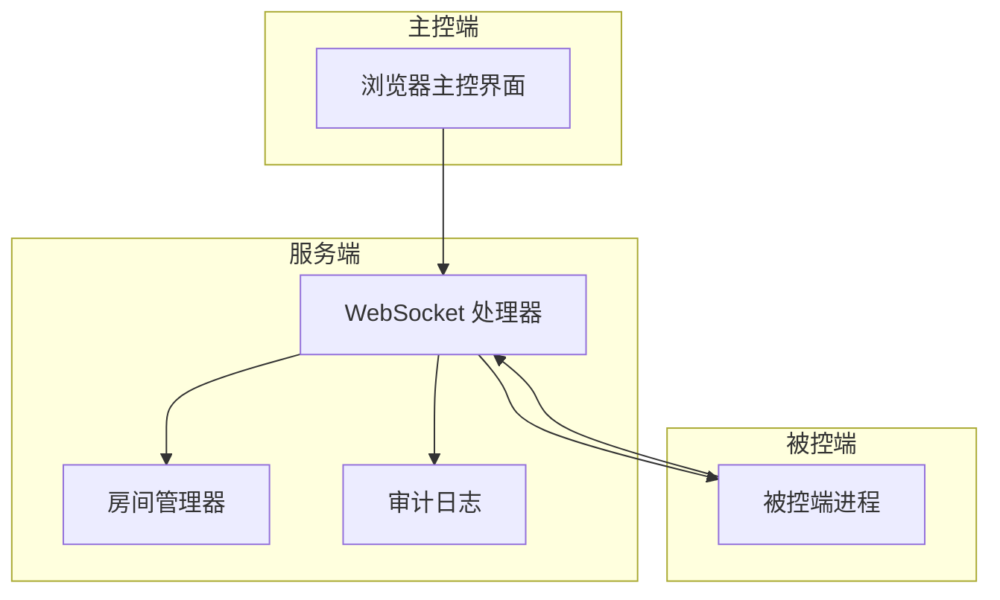
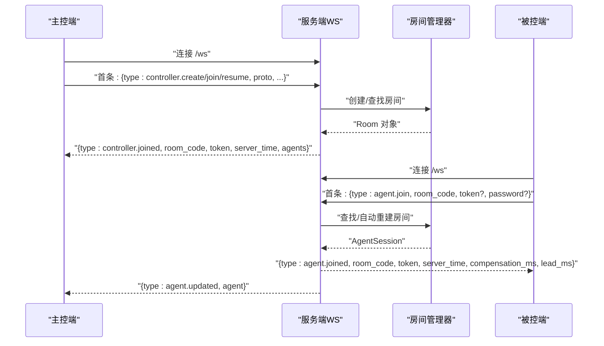
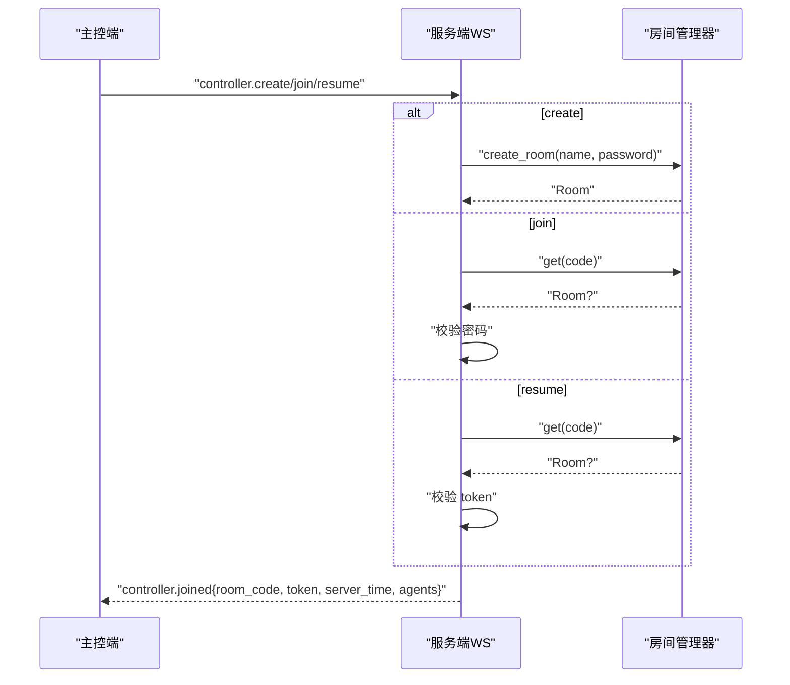
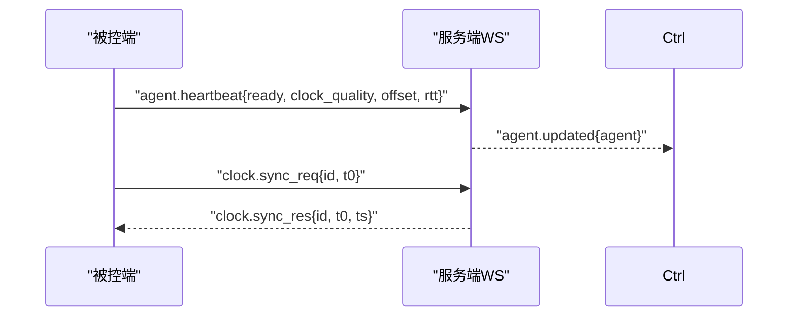
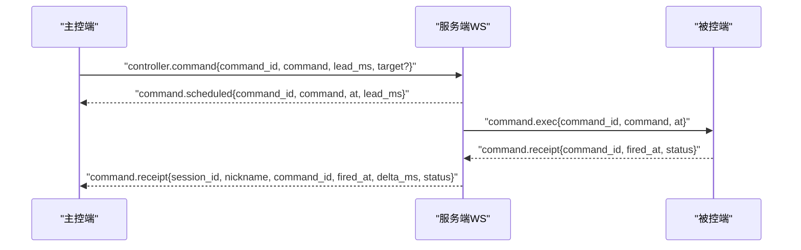
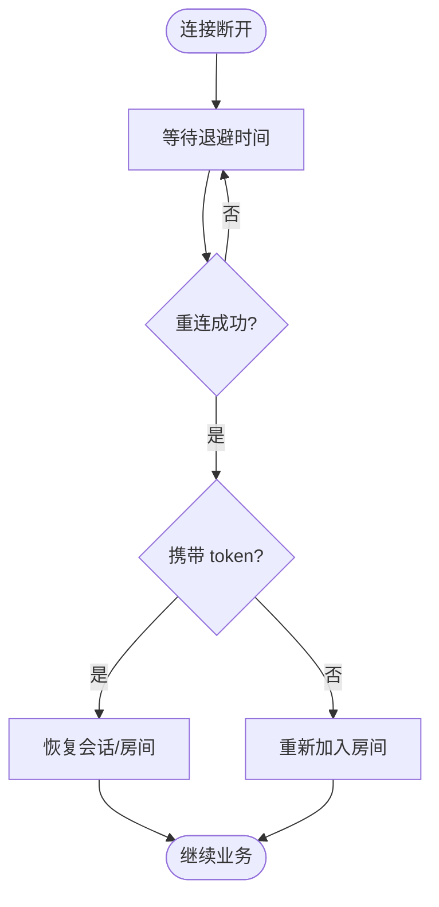
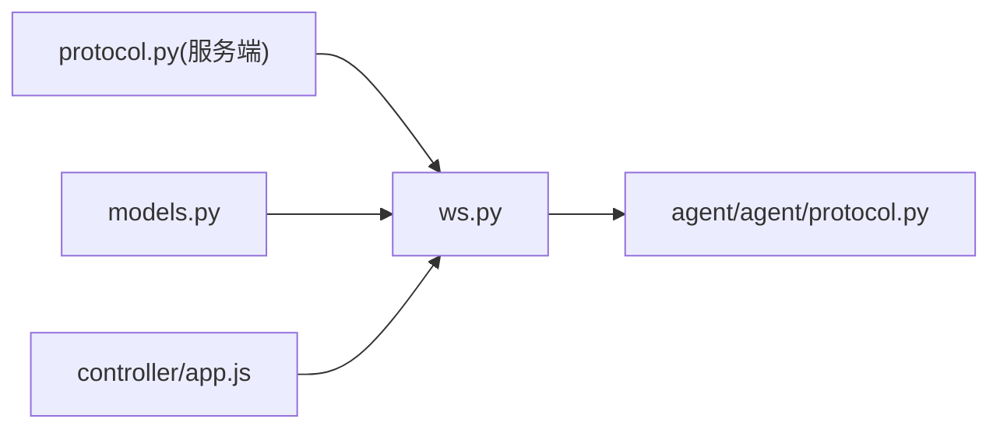

# 通信协议设计

<cite>
**本文引用的文件**
- [server/server/protocol.py](file://server/server/protocol.py)
- [agent/agent/protocol.py](file://agent/agent/protocol.py)
- [server/server/ws.py](file://server/server/ws.py)
- [server/server/models.py](file://server/server/models.py)
- [controller/app.js](file://controller/app.js)
- [README.md](file://README.md)
</cite>

## 目录
1. [简介](#简介)
2. [项目结构](#项目结构)
3. [核心组件](#核心组件)
4. [架构总览](#架构总览)
5. [详细组件分析](#详细组件分析)
6. [依赖关系分析](#依赖关系分析)
7. [性能考虑](#性能考虑)
8. [故障排查指南](#故障排查指南)
9. [结论](#结论)
10. [附录：数据包示例与迁移指南](#附录：数据包示例与迁移指南)

## 简介
本文件为 ScriptCue 系统的 WebSocket 文本通信协议设计文档。协议基于 JSON，采用版本化管理，定义控制消息、状态消息和事件消息的格式规范，覆盖连接建立、认证授权、心跳保活、断线重连、时钟同步与指令回执等关键流程。文档同时给出消息序列图、数据包示例以及兼容性策略与升级迁移指南，帮助主控端、被控端与服务端三方实现一致且可演进的通信行为。

## 项目结构
- 服务端（FastAPI + WebSocket）：房间管理、WebSocket 会话、指令调度、状态汇聚、审计日志。
- 主控端（浏览器网页）：创建/加入房间、下发指令、查看设备状态与回执。
- 被控端（Python 客户端）：加入房间、心跳与授时、执行带绝对时刻的指令。

**图表来源**
- [server/server/ws.py:1-360](file://server/server/ws.py#L1-L360)
- [server/server/models.py:1-157](file://server/server/models.py#L1-L157)
- [controller/app.js:1-522](file://controller/app.js#L1-L522)

**章节来源**
- [README.md:1-86](file://README.md#L1-L86)

## 核心组件
- 协议常量与版本：统一的消息类型、错误码、限制参数与版本常量，由服务端权威定义，被控端维护等价副本。
- WebSocket 会话处理：首条消息声明角色（主控/被控），后续按类型路由到对应处理函数。
- 房间与会话模型：内存存储的房间与会话，支持令牌恢复、在线状态、待执行指令集合、广播与通知。
- 主控端前端：连接、认证、指令下发、倒计时与回执汇总展示。

**章节来源**
- [server/server/protocol.py:1-80](file://server/server/protocol.py#L1-L80)
- [agent/agent/protocol.py:1-80](file://agent/agent/protocol.py#L1-L80)
- [server/server/ws.py:1-360](file://server/server/ws.py#L1-L360)
- [server/server/models.py:1-157](file://server/server/models.py#L1-L157)
- [controller/app.js:1-522](file://controller/app.js#L1-L522)

## 架构总览
协议以“首条消息声明角色”的方式复用同一 WebSocket 端点。主控端与被控端通过不同消息类型进入各自的生命周期。服务器负责房间生命周期、指令调度、时钟同步响应、状态推送与审计。

**图表来源**
- [server/server/ws.py:154-327](file://server/server/ws.py#L154-L327)
- [server/server/models.py:64-117](file://server/server/models.py#L64-L117)

## 详细组件分析

### 协议版本与消息类型
- 版本管理：所有首条消息必须包含字段 proto，与服务端当前 PROTO_VERSION 匹配，否则返回错误并关闭连接。
- 消息类型：
  - 控制消息（主控 → 服务）：创建房间、加入房间、恢复会话、下发指令、取消指令、设置补偿值。
  - 控制消息（服务 → 主控）：加入成功、指令已计划、指令已取消。
  - 被控消息（被控 → 服务）：加入房间、心跳、设置补偿、时钟同步请求、指令回执。
  - 服务消息（服务 → 被控）：加入成功、时钟同步响应、指令执行、指令取消、补偿更新。
  - 状态汇聚（服务 → 主控）：设备状态更新、设备离开。
  - 错误消息：统一 error 类型，携带 code 与 message。

**章节来源**
- [server/server/protocol.py:1-80](file://server/server/protocol.py#L1-L80)
- [agent/agent/protocol.py:1-80](file://agent/agent/protocol.py#L1-L80)

### 连接建立与认证授权
- 主控端：
  - 首次连接发送 controller.create 或 controller.join；若 resume，则使用之前获得的 token 恢复会话。
  - 服务器校验房间是否存在、口令是否正确、token 是否有效；成功后返回 controller.joined，附带房间信息、token、服务器时间与设备列表。
- 被控端：
  - 首次连接发送 agent.join，携带 room_code；可选 token（用于重连恢复）、password（房间口令）。
  - 服务器查找房间，必要时根据 auto_create 重建房间；校验口令后分配或恢复 AgentSession，返回 agent.joined，附带 token、服务器时间、补偿值与提前量。

**图表来源**
- [server/server/ws.py:154-185](file://server/server/ws.py#L154-L185)
- [server/server/models.py:131-140](file://server/server/models.py#L131-L140)

**章节来源**
- [server/server/ws.py:154-185](file://server/server/ws.py#L154-L185)
- [server/server/ws.py:246-289](file://server/server/ws.py#L246-L289)

### 心跳保活与时钟同步
- 心跳：
  - 被控端周期性发送 agent.heartbeat，携带 ready、clock_quality、clock_offset_ms、clock_rtt_ms。
  - 服务端更新会话状态并推送 agent.updated 给主控端。
  - 服务端配置心跳间隔与离线判定阈值，未收到心跳超过阈值视为离线。
- 时钟同步：
  - 被控端发送 clock.sync_req（含 id、t0），服务端立即回复 clock.sync_res（id、t0、ts=now_ms）。
  - 被控端据此估算偏移与 RTT，用于精确触发。

**图表来源**
- [server/server/ws.py:214-226](file://server/server/ws.py#L214-L226)
- [server/server/ws.py:299-303](file://server/server/ws.py#L299-L303)

**章节来源**
- [server/server/ws.py:214-226](file://server/server/ws.py#L214-L226)
- [server/server/ws.py:299-303](file://server/server/ws.py#L299-L303)
- [server/server/protocol.py:75-80](file://server/server/protocol.py#L75-L80)

### 指令下发、执行与回执
- 主控端下发指令：
  - 发送 controller.command，包含 command_id、command、lead_ms（可选，默认房间值）、target（可选）。
  - 服务端计算 at = now_ms() + lead_ms，记录 pending_commands，向目标或被控端广播 command.exec。
  - 返回 command.scheduled 给主控端，显示倒计时。
- 被控端执行与回执：
  - 被控端在 at 时刻执行命令，发送 command.receipt，包含 command_id、fired_at、status。
  - 服务端计算 delta_ms = fired_at - at，推送 command.receipt 给主控端。
- 取消指令：
  - 主控端发送 controller.cancel，服务端取消待执行指令并向目标或被控端广播 command.cancel。
  - 返回 command.cancelled 给主控端。

**图表来源**
- [server/server/ws.py:67-115](file://server/server/ws.py#L67-L115)
- [server/server/ws.py:228-244](file://server/server/ws.py#L228-L244)

**章节来源**
- [server/server/ws.py:67-115](file://server/server/ws.py#L67-L115)
- [server/server/ws.py:228-244](file://server/server/ws.py#L228-L244)

### 补偿值设置与状态推送
- 主控端可通过 controller.set_comp 设置某设备的 compensation_ms（范围受限）。
- 被控端也可主动发送 agent.set_comp 上报本地补偿值。
- 服务端校验范围后更新会话状态，并推送 comp.update 给被控端、agent.updated 给主控端。

**章节来源**
- [server/server/ws.py:137-152](file://server/server/ws.py#L137-L152)
- [server/server/ws.py:305-315](file://server/server/ws.py#L305-L315)

### 断线重连与恢复
- 主控端：
  - 断开后指数退避重连，优先使用 controller.resume 携带 token 恢复会话。
  - 若收到 room_not_found 错误，回到首页重新创建或加入。
- 被控端：
  - 断开后指数退避重连，使用 agent.join 携带 token 恢复会话；若房间不存在且启用 auto_create，服务端自动重建房间。
  - 旧连接被新连接顶替，确保单会话一致性。

**图表来源**
- [controller/app.js:66-81](file://controller/app.js#L66-L81)
- [server/server/ws.py:246-289](file://server/server/ws.py#L246-L289)

**章节来源**
- [controller/app.js:66-81](file://controller/app.js#L66-L81)
- [server/server/ws.py:246-289](file://server/server/ws.py#L246-L289)

## 依赖关系分析
- 服务端 ws.py 依赖 protocol 常量与 models 房间模型，负责消息路由、状态管理与审计。
- 主控端 app.js 直接实现协议逻辑：连接、认证、指令、回执与 UI 渲染。
- 被控端协议常量与限制与服务端保持一致，确保兼容。

**图表来源**
- [server/server/ws.py:1-360](file://server/server/ws.py#L1-L360)
- [server/server/protocol.py:1-80](file://server/server/protocol.py#L1-L80)
- [agent/agent/protocol.py:1-80](file://agent/agent/protocol.py#L1-L80)
- [controller/app.js:1-522](file://controller/app.js#L1-L522)

**章节来源**
- [server/server/ws.py:1-360](file://server/server/ws.py#L1-L360)
- [server/server/protocol.py:1-80](file://server/server/protocol.py#L1-L80)
- [agent/agent/protocol.py:1-80](file://agent/agent/protocol.py#L1-L80)
- [controller/app.js:1-522](file://controller/app.js#L1-L522)

## 性能考虑
- 心跳间隔与离线判定：合理设置心跳频率与超时阈值，避免频繁网络开销与误判离线。
- 指令回执窗口：服务端在指令到期后保留回执等待窗口，超时清理待执行记录，防止内存泄漏。
- 状态推送节流：对 agent.updated 进行节流，降低主控端渲染压力。
- 补偿值与提前量范围：限制补偿值与提前量范围，保证系统稳定性与精度。

[本节提供通用指导，不直接分析具体文件]

## 故障排查指南
- 首条消息非 JSON 对象：返回 bad_message，检查客户端序列化逻辑。
- 协议版本不匹配：返回 bad_proto，升级客户端或服务端至相同版本。
- 房间不存在：返回 room_not_found，主控端应提示重新创建或加入；被控端可启用自动重建。
- 口令错误：返回 bad_password，检查房间口令配置。
- 房间已满：返回 room_full，减少设备数量或扩容房间上限。
- 未知指令：返回 bad_command，检查 command 枚举值。
- 设备不存在：返回 no_such_agent，检查 target/session_id。
- 不支持的消息类型：返回 bad_message，检查消息路由逻辑。

**章节来源**
- [server/server/ws.py:50-60](file://server/server/ws.py#L50-L60)
- [server/server/ws.py:334-360](file://server/server/ws.py#L334-L360)
- [server/server/protocol.py:57-65](file://server/server/protocol.py#L57-L65)

## 结论
本协议通过版本化 JSON 文本消息与统一的 WebSocket 端点，实现了主控端与被控端的可靠通信。结合心跳保活、时钟同步、指令回执与断线重连机制，系统在公网环境下可实现高精度同步起播。建议严格遵循协议常量与限制，保持两端一致性，并在升级时同步更新版本与文档。

[本节总结性内容，不直接分析具体文件]

## 附录：数据包示例与迁移指南

### 数据包示例（字段说明）
- 主控端首条消息（创建房间）
  - type: "controller.create"
  - proto: 当前版本号
  - room_name: 房间名称（可选）
  - password: 房间口令（可选）
- 主控端首条消息（加入房间）
  - type: "controller.join"
  - proto: 当前版本号
  - room_code: 房间码
  - password: 房间口令（可选）
- 主控端首条消息（恢复会话）
  - type: "controller.resume"
  - proto: 当前版本号
  - room_code: 房间码
  - token: 之前获取的控制器令牌
- 被控端首条消息（加入房间）
  - type: "agent.join"
  - proto: 当前版本号
  - room_code: 房间码
  - token: 重连令牌（可选）
  - password: 房间口令（可选）
  - nickname: 设备昵称（可选）
  - auto_create: 允许自动重建房间（可选）
- 心跳消息（被控端）
  - type: "agent.heartbeat"
  - ready: 是否就绪
  - clock_quality: 时钟质量等级
  - clock_offset_ms: 时钟偏移（毫秒）
  - clock_rtt_ms: 往返时延（毫秒）
- 时钟同步请求（被控端）
  - type: "clock.sync_req"
  - id: 请求标识
  - t0: 本地时间戳
- 时钟同步响应（服务端）
  - type: "clock.sync_res"
  - id: 请求标识
  - t0: 原请求 t0
  - ts: 服务器当前时间（毫秒）
- 指令回执（被控端）
  - type: "command.receipt"
  - command_id: 指令标识
  - fired_at: 实际触发时间（毫秒）
  - status: 执行状态（如 ok/error/skipped）
- 设置补偿值（主控端/被控端）
  - type: "controller.set_comp" 或 "agent.set_comp"
  - session_id: 设备会话标识（主控端设置时必填）
  - compensation_ms: 补偿值（毫秒，整数，受范围限制）

[以上为字段说明，不包含具体代码片段]

### 兼容性策略与升级迁移指南
- 版本管理：
  - 所有首条消息必须包含 proto 字段，与服务端 PROTO_VERSION 一致方可建立会话。
  - 修改协议时需同时更新服务端与被控端副本，并递增 PROTO_VERSION。
- 向后兼容：
  - 新增可选字段不应破坏旧客户端解析；服务端应忽略未知字段。
  - 新增消息类型需在服务端明确路由，未知类型返回 bad_message。
- 升级步骤：
  - 先升级服务端，再升级客户端；客户端检测到版本不匹配时应提示升级。
  - 对于破坏性变更，建议在过渡期同时支持新旧版本一段时间，并提供降级路径。
- 回滚策略：
  - 若新版本引入问题，可快速回滚服务端并提示客户端切换至稳定版本。
  - 对被控端重连逻辑进行保护，避免因版本不一致导致长时间无法恢复。

**章节来源**
- [server/server/protocol.py:1-10](file://server/server/protocol.py#L1-L10)
- [agent/agent/protocol.py:1-8](file://agent/agent/protocol.py#L1-L8)
- [server/server/ws.py:334-360](file://server/server/ws.py#L334-L360)